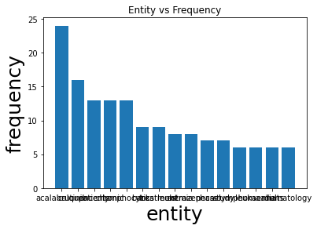
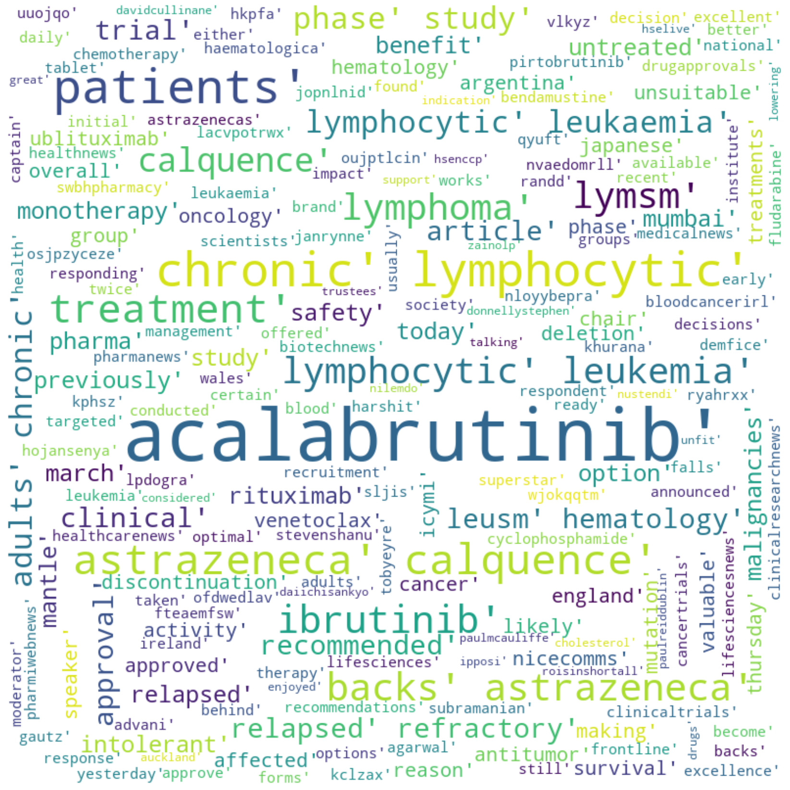

# Entity Frequency of Tweets


### Note: For analysis only first 50 rows were taken as a sample data due to technical issues while loading data.

## Importing Libraries


```python
import pandas as pd
import numpy as np
import json
import re
import nltk
import matplotlib.pyplot as plt
from nltk.corpus import stopwords
import plotly.io as pio
from nltk import word_tokenize,pos_tag
```

##  Loading and cleaning data


```python
df = pd.read_json('tweets.json')
```


```python
df_1 = df.drop(df.index[[0]])
```


```python
df_2 = df_1.T
```


```python
df_2
```


<div>
<style scoped>
    .dataframe tbody tr th:only-of-type {
        vertical-align: middle;
    }

    .dataframe tbody tr th {
        vertical-align: top;
    }

    .dataframe thead th {
        text-align: right;
    }
</style>
<table border="1" class="dataframe">
  <thead>
    <tr style="text-align: right;">
      <th></th>
      <th>tweet_text</th>
    </tr>
  </thead>
  <tbody>
    <tr>
      <th>2013-07-18 09:39:46.071961602</th>
      <td>⚕️ Scientists conducted a Phase II study of ac...</td>
    </tr>
    <tr>
      <th>2013-07-17 03:40:32.173842437</th>
      <td>This phase 2 Acalabrutinib-Venetoclax (AV) tri...</td>
    </tr>
    <tr>
      <th>2013-07-15 15:41:16.553048065</th>
      <td>#NICE backs #AstraZenecas #Calquence for #CLL ...</td>
    </tr>
    <tr>
      <th>2013-07-12 19:19:42.367813635</th>
      <td>#acalabrutinib is a valuable option in pts int...</td>
    </tr>
    <tr>
      <th>2013-07-04 12:40:34.334232586</th>
      <td>NICE has recommended the use of acalabrutinib ...</td>
    </tr>
    <tr>
      <th>...</th>
      <td>...</td>
    </tr>
    <tr>
      <th>1987-06-19 12:17:53.643945985</th>
      <td>Hanging out with Friends! :) #FF #CLL #Happine...</td>
    </tr>
    <tr>
      <th>1987-06-19 12:06:26.675290112</th>
      <td>Hanging out with Friends! :) #FF #CLL #Happine...</td>
    </tr>
    <tr>
      <th>1987-06-17 23:05:41.186953217</th>
      <td>Zusatznutzen von #Idelalisib ist weder für #CL...</td>
    </tr>
    <tr>
      <th>1987-06-17 15:18:00.525635584</th>
      <td>#Hematología PTK2 EXPRESSION AND IMMUNOCHEMOTH...</td>
    </tr>
    <tr>
      <th>1987-06-13 10:44:06.537678849</th>
      <td>#Hematología MUTATIONS IN TLR/MYD88 PATHWAY ID...</td>
    </tr>
  </tbody>
</table>
<p>43347 rows × 1 columns</p>
</div>


```python
df_2.reset_index(level=0, inplace=True)
```


```python
df_3 = df_2.drop(['index'],axis=1)
```


```python
df_3
```


<div>
<style scoped>
    .dataframe tbody tr th:only-of-type {
        vertical-align: middle;
    }

    .dataframe tbody tr th {
        vertical-align: top;
    }

    .dataframe thead th {
        text-align: right;
    }
</style>
<table border="1" class="dataframe">
  <thead>
    <tr style="text-align: right;">
      <th></th>
      <th>tweet_text</th>
    </tr>
  </thead>
  <tbody>
    <tr>
      <th>0</th>
      <td>⚕️ Scientists conducted a Phase II study of ac...</td>
    </tr>
    <tr>
      <th>1</th>
      <td>This phase 2 Acalabrutinib-Venetoclax (AV) tri...</td>
    </tr>
    <tr>
      <th>2</th>
      <td>#NICE backs #AstraZenecas #Calquence for #CLL ...</td>
    </tr>
    <tr>
      <th>3</th>
      <td>#acalabrutinib is a valuable option in pts int...</td>
    </tr>
    <tr>
      <th>4</th>
      <td>NICE has recommended the use of acalabrutinib ...</td>
    </tr>
    <tr>
      <th>...</th>
      <td>...</td>
    </tr>
    <tr>
      <th>43342</th>
      <td>Hanging out with Friends! :) #FF #CLL #Happine...</td>
    </tr>
    <tr>
      <th>43343</th>
      <td>Hanging out with Friends! :) #FF #CLL #Happine...</td>
    </tr>
    <tr>
      <th>43344</th>
      <td>Zusatznutzen von #Idelalisib ist weder für #CL...</td>
    </tr>
    <tr>
      <th>43345</th>
      <td>#Hematología PTK2 EXPRESSION AND IMMUNOCHEMOTH...</td>
    </tr>
    <tr>
      <th>43346</th>
      <td>#Hematología MUTATIONS IN TLR/MYD88 PATHWAY ID...</td>
    </tr>
  </tbody>
</table>
<p>43347 rows × 1 columns</p>
</div>


```python
new_df = df_3.head(51)
```


```python
new_df
```


<div>
<style scoped>
    .dataframe tbody tr th:only-of-type {
        vertical-align: middle;
    }

    .dataframe tbody tr th {
        vertical-align: top;
    }

    .dataframe thead th {
        text-align: right;
    }
</style>
<table border="1" class="dataframe">
  <thead>
    <tr style="text-align: right;">
      <th></th>
      <th>tweet_text</th>
    </tr>
  </thead>
  <tbody>
    <tr>
      <th>0</th>
      <td>⚕️ Scientists conducted a Phase II study of ac...</td>
    </tr>
    <tr>
      <th>1</th>
      <td>This phase 2 Acalabrutinib-Venetoclax (AV) tri...</td>
    </tr>
    <tr>
      <th>2</th>
      <td>#NICE backs #AstraZenecas #Calquence for #CLL ...</td>
    </tr>
    <tr>
      <th>3</th>
      <td>#acalabrutinib is a valuable option in pts int...</td>
    </tr>
    <tr>
      <th>4</th>
      <td>NICE has recommended the use of acalabrutinib ...</td>
    </tr>
    <tr>
      <th>5</th>
      <td>NICE backs AstraZeneca’s Calquence for CLL htt...</td>
    </tr>
    <tr>
      <th>6</th>
      <td>This is England for now - these decisions usua...</td>
    </tr>
    <tr>
      <th>7</th>
      <td>AstraZeneca’s Calquence (acalabrutinib), a che...</td>
    </tr>
    <tr>
      <th>8</th>
      <td>Superstar @tobyeyre82 responding to the excell...</td>
    </tr>
    <tr>
      <th>9</th>
      <td>CLL patients all know the drug Ibrutinib and y...</td>
    </tr>
    <tr>
      <th>10</th>
      <td>Optimal Management of High-Risk CLL with Acala...</td>
    </tr>
    <tr>
      <th>11</th>
      <td>Acalabrutinib for all forms of CLL, NICE today...</td>
    </tr>
    <tr>
      <th>12</th>
      <td>It has been announced today (Thursday 18th Mar...</td>
    </tr>
    <tr>
      <th>13</th>
      <td>NICE has recommended the use of acalabrutinib,...</td>
    </tr>
    <tr>
      <th>14</th>
      <td>A brand new oral treatment, Acalabrutinib, tak...</td>
    </tr>
    <tr>
      <th>15</th>
      <td>NICE backs AstraZeneca’s Calquence for CLL htt...</td>
    </tr>
    <tr>
      <th>16</th>
      <td>NICE backs AstraZeneca’s Calquence for CLL htt...</td>
    </tr>
    <tr>
      <th>17</th>
      <td>NICE backs AstraZeneca’s Calquence for CLL htt...</td>
    </tr>
    <tr>
      <th>18</th>
      <td>NICE backs AstraZeneca’s Calquence for CLL htt...</td>
    </tr>
    <tr>
      <th>19</th>
      <td>NICE backs AstraZeneca’s Calquence for CLL htt...</td>
    </tr>
    <tr>
      <th>20</th>
      <td>NICE backs AstraZeneca’s Calquence for CLL htt...</td>
    </tr>
    <tr>
      <th>21</th>
      <td>New article: Phase 2 study of acalabrutinib in...</td>
    </tr>
    <tr>
      <th>22</th>
      <td>TARGETED ORAL MONOTHERAPY CALQUENCE (ACALABRUT...</td>
    </tr>
    <tr>
      <th>23</th>
      <td>As the UK approve new treatments for #CLL with...</td>
    </tr>
    <tr>
      <th>24</th>
      <td>.@NICEComms backs NHS use for @AstraZeneca’s C...</td>
    </tr>
    <tr>
      <th>25</th>
      <td>#Acalabrutinib @NICEComms approved for 1L #CLL...</td>
    </tr>
    <tr>
      <th>26</th>
      <td>Safety and Antitumor Activity of Acalabrutinib...</td>
    </tr>
    <tr>
      <th>27</th>
      <td>New article: Safety and Antitumor Activity of ...</td>
    </tr>
    <tr>
      <th>28</th>
      <td>Congress| #EBMT21 | @michaelwangmd, @MDAnderso...</td>
    </tr>
    <tr>
      <th>29</th>
      <td>New2Trip: Acalabrutinib (Calquence) for treatm...</td>
    </tr>
    <tr>
      <th>30</th>
      <td>Calquence Commercial Had A REALLY PRETTY Lady ...</td>
    </tr>
    <tr>
      <th>31</th>
      <td>New clinical trial: Acalabrutinib, Umbralisib,...</td>
    </tr>
    <tr>
      <th>32</th>
      <td>'Solidarity negotiated with Astra-Zeneca to te...</td>
    </tr>
    <tr>
      <th>33</th>
      <td>ICYMI, please view our #ASH20 TiP poster prese...</td>
    </tr>
    <tr>
      <th>34</th>
      <td>IQVIA RDS Argentina S.R.L. representa en Argen...</td>
    </tr>
    <tr>
      <th>35</th>
      <td>Maria, we appreciate you!\nOur group has passe...</td>
    </tr>
    <tr>
      <th>36</th>
      <td>The role of acalabrutinib in adults with chron...</td>
    </tr>
    <tr>
      <th>37</th>
      <td>The role of acalabrutinib in adults with chron...</td>
    </tr>
    <tr>
      <th>38</th>
      <td>New article: The role of acalabrutinib in adul...</td>
    </tr>
    <tr>
      <th>39</th>
      <td>The role of acalabrutinib in adults with chron...</td>
    </tr>
    <tr>
      <th>40</th>
      <td>New article: The role of acalabrutinib in adul...</td>
    </tr>
    <tr>
      <th>41</th>
      <td>The role of CD20 in addition to BTK inhibitors...</td>
    </tr>
    <tr>
      <th>42</th>
      <td>New clinical trial: Acalabrutinib and Rituxima...</td>
    </tr>
    <tr>
      <th>43</th>
      <td>Acalabrutinib alcanza el objetivo primario de ...</td>
    </tr>
    <tr>
      <th>44</th>
      <td>Physician Views Preview: Digging into the impr...</td>
    </tr>
    <tr>
      <th>45</th>
      <td>#ICYMI: Overall, the phase 3 ELEVATE-RR trial ...</td>
    </tr>
    <tr>
      <th>46</th>
      <td>CLL Research: Acalabrutinib – An Analysis of C...</td>
    </tr>
    <tr>
      <th>47</th>
      <td>Comparing acalabrutinib to standard treatments...</td>
    </tr>
    <tr>
      <th>48</th>
      <td>MCL Survival Likely Affected by Reason for Aca...</td>
    </tr>
    <tr>
      <th>49</th>
      <td>Mantle Cell Lymphoma Survival Likely Affected ...</td>
    </tr>
    <tr>
      <th>50</th>
      <td>CALQUENCE Beneficial for CLL, Study Shows http...</td>
    </tr>
  </tbody>
</table>
</div>


## converting dataset to list and then to text


```python
tweet_list = new_df['tweet_text'].to_list()
soup_text = " ".join(tweet_list)
```

## reading text


```python
ready_text = soup_text.lower()
ready_text = re.sub('http[s]?://(?:[a-zA-Z]|[0-9]|[$-_@.&+]|[!*\(\),]|(?:%[0-9a-fA-F][0-9a-fA-F]))', '', ready_text, flags=re.MULTILINE)
```


```python
ready_text = ready_text.replace("cll"," ")
ready_text = ready_text.replace("\\n"," ")
ready_text = re.sub(r"[^a-zA]+", ' ', ready_text)
```


```python
nltk.download('stopwords')
```

    [nltk_data] Downloading package stopwords to
    [nltk_data]     C:\Users\SONY\AppData\Roaming\nltk_data...
    [nltk_data]   Package stopwords is already up-to-date!
    


    True


## Tokenizing the text


```python
tokens = []
for t in ready_text.split():
    tokens.append(t)
```

## Optimizing the text using stopwords


```python
stop_words = stopwords.words('english')
clean_tokens = tokens[:]
for token in tokens:
    if token in stop_words:
        clean_tokens.remove(token)
```

## Further optimizing the tokens 


```python
def funcname(clean_tokens):
    for i in clean_tokens[:]:
            if len(i) <= 4:
                clean_tokens.remove(i)
            print(clean_tokens)
    return clean_tokens

clean_tokens = funcname(clean_tokens)
```

    IOPub data rate exceeded.
    The notebook server will temporarily stop sending output
    to the client in order to avoid crashing it.
    To change this limit, set the config variable
    `--NotebookApp.iopub_data_rate_limit`.
    
    Current values:
    NotebookApp.iopub_data_rate_limit=1000000.0 (bytes/sec)
    NotebookApp.rate_limit_window=3.0 (secs)
    
    

    
    ['scientists', 'conducted', 'phase', 'study', 'acalabrutinib', 'patients', 'relapsed', 'refractory', 'ibrutinib', 'intolerant', 'found', 'overall', 'response', 'phase', 'acalabrutinib', 'venetoclax', 'trial', 'still', 'recruitment', 'phase', 'study', 'venetoclax', 'acalabrutinib', 'works', 'patients', 'either', 'relapsed', 'respondent', 'initial', 'therapy', 'backs', 'astrazenecas', 'calquence', 'lpdogra', 'acalabrutinib', 'valuable', 'option', 'intolerant', 'ibrutinib', 'valuable', 'decision', 'making', 'early', 'haematologica', 'kclzax', 'recommended', 'acalabrutinib', 'patients', 'treatment', 'chronic', 'lymphocytic', 'leukemia', 'oujptlcin', 'lymsm', 'lymphoma', 'backs', 'astrazeneca', 'calquence', 'jopnlnid', 'england', 'decisions', 'usually', 'wales', 'ofdwedlav', 'astrazeneca', 'calquence', 'acalabrutinib', 'chemotherapy', 'monotherapy', 'offered', 'patients', 'chronic', 'lymphocytic', 'leukaemia', 'oncology', 'drugapprovals', 'pharma', 'healthnews', 'qyuft', 'superstar', 'tobyeyre', 'responding', 'excellent', 'approval', 'acalabrutinib', 'frontline', 'unsuitable', 'patients', 'lacvpotrwx', 'patients', 'ibrutinib', 'yesterday', 'acalabrutinib', 'approved', 'pirtobrutinib', 'making', 'impact', 'relapsed', 'patients', 'recent', 'clinicaltrials', 'cancertrials', 'society', 'bloodcancerirl', 'kphsz', 'optimal', 'management', 'acalabrutinib', 'march', 'speaker', 'subramanian', 'mumbai', 'speaker', 'group', 'captain', 'harshit', 'khurana', 'chair', 'advani', 'mumbai', 'moderator', 'agarwal', 'mumbai', 'demfice', 'nvaedomrll', 'acalabrutinib', 'forms', 'today', 'ready', 'swbhpharmacy', 'stevenshanu', 'hojansenya', 'randd', 'oncology', 'gautz', 'announced', 'today', 'thursday', 'march', 'national', 'institute', 'health', 'excellence', 'recommendations', 'acalabrutinib', 'become', 'treatment', 'option', 'certain', 'groups', 'chronic', 'lymphocytic', 'leukaemia', 'patients', 'england', 'recommended', 'acalabrutinib', 'monotherapy', 'option', 'adults', 'deletion', 'mutation', 'deletion', 'mutation', 'fludarabine', 'cyclophosphamide', 'rituximab', 'bendamustine', 'rituximab', 'unsuitable', 'vlkyz', 'brand', 'treatment', 'acalabrutinib', 'taken', 'twice', 'daily', 'tablet', 'untreated', 'blood', 'cancer', 'chronic', 'lymphocytic', 'leukaemia', 'today', 'thursday', 'march', 'recommended', 'nloyybepra', 'backs', 'astrazeneca', 'calquence', 'backs', 'astrazeneca', 'calquence', 'wjokqqtm', 'backs', 'astrazeneca', 'calquence', 'sljis', 'backs', 'astrazeneca', 'calquence', 'hkpfa', 'backs', 'astrazeneca', 'calquence', 'ryahrxx', 'backs', 'astrazeneca', 'calquence', 'fteaemfsw', 'pharma', 'lifesciences', 'article', 'phase', 'study', 'acalabrutinib', 'ibrutinib', 'intolerant', 'patients', 'relapsed', 'refractory', 'chronic', 'lymphocytic', 'leukemia', 'osjpzyceze', 'leusm', 'hematology', 'targeted', 'monotherapy', 'calquence', 'acalabrutinib', 'recommended', 'patients', 'chronic', 'lymphocytic', 'leukaemia', 'pharmanews', 'clinicalresearchnews', 'biotechnews', 'lifesciencesnews', 'medicalnews', 'healthcarenews', 'pharmiwebnews', 'uuojqo', 'approve', 'treatments', 'acalabrutinib', 'available', 'ireland', 'falls', 'behind', 'patients', 'better', 'options', 'janrynne', 'donnellystephen', 'hselive', 'davidcullinane', 'hsenccp', 'paulreiddublin', 'ipposi', 'paulmcauliffe', 'roisinshortall', 'zainolp', 'nicecomms', 'backs', 'astrazeneca', 'calquence', 'leukaemia', 'indication', 'daiichisankyo', 'cholesterol', 'lowering', 'drugs', 'nilemdo', 'nustendi', 'acalabrutinib', 'nicecomms', 'approved', 'considered', 'unfit', 'relapsed', 'enjoyed', 'talking', 'support', 'chair', 'trustees', 'auckland', 'great', 'bloodcancer', 'iidgkel', 'safety', 'antitumor', 'activity', 'acalabrutinib', 'relapsed', 'refractory', 'malignancies', 'japanese', 'phase', 'study', 'lymphoma', 'lymsm', 'article', 'safety', 'antitumor', 'activity', 'acalabrutinib', 'relapsed', 'refractory', 'malignancies', 'japanese', 'phase', 'study', 'ivdjs', 'leusm', 'hematology', 'congress', 'michaelwangmd', 'mdandersonnews', 'discussed', 'results', 'study', 'mantel', 'lymphoma', 'morphology', 'prior', 'exposure', 'ibrutinib', 'acalabrutinib', 'concluded', 'subgroups', 'clinical', 'benefit', 'treatment', 'lymsm', 'vufxrfrbgd', 'acalabrutinib', 'calquence', 'treatment', 'chronic', 'lymphocytic', 'leukaemia', 'qszwczx', 'calquence', 'commercial', 'really', 'pretty', 'chanel', 'twittersupport', 'nurse', 'think', 'clinical', 'trial', 'acalabrutinib', 'umbralisib', 'ublituximab', 'treatment', 'previously', 'untreated', 'mantle', 'lymphoma', 'benjlrg', 'lymsm', 'hematology', 'solidarity', 'negotiated', 'astra', 'zeneca', 'cancer', 'acalabrutinib', 'dampens', 'immune', 'system', 'investigators', 'changed', 'treatment', 'protocols', 'include', 'medicine', 'company', 'decided', 'green', 'light', 'mjlnv', 'icymi', 'please', 'poster', 'presentation', 'study', 'explore', 'combination', 'acalabrutinib', 'patients', 'malignancies', 'uoottdlo', 'sgbnxj', 'lymsm', 'dlbcl', 'iqvia', 'argentina', 'representa', 'argentina', 'janssen', 'vaccines', 'prevention', 'pharma', 'astrazeneca', 'amgen', 'acalabrutinib', 'apremilast', 'lanadelumab', 'abatacept', 'remdesivir', 'infliximab', 'mesilato', 'cenicriviroc', 'kuruk', 'spitta', 'maria', 'appreciate', 'group', 'passed', 'inspections', 'ibrutinib', 'approval', 'acalabrutinib', 'approval', 'brexucarbatagene', 'autoleucel', 'approval', 'without', 'leadership', 'wonderful', 'possible', 'fpumj', 'acalabrutinib', 'adults', 'chronic', 'lymphocytic', 'leukemia', 'acalabrutinib', 'adults', 'chronic', 'lymphocytic', 'leukemia', 'lymphoma', 'lymsm', 'article', 'acalabrutinib', 'adults', 'chronic', 'lymphocytic', 'leukemia', 'xrlun', 'leusm', 'hematology', 'acalabrutinib', 'adults', 'chronic', 'lymphocytic', 'leukemia', 'article', 'acalabrutinib', 'adults', 'chronic', 'lymphocytic', 'leukemia', 'yanuxmbr', 'leusm', 'hematology', 'addition', 'inhibitors', 'closed', 'story', 'previously', 'published', 'obinutuzumab', 'benefit', 'acalabrutinib', 'klsjuwwfdm', 'ublituximab', 'ibrutinib', 'benefit', 'tgtherapeutics', 'anthonymatomd', 'clinical', 'trial', 'acalabrutinib', 'rituximab', 'treatment', 'previously', 'untreated', 'mantle', 'lymphoma', 'co', 'kpdyk', 'kvoo', 'mcl', 'lymsm', 'hematology', 'acalabrutinib', 'alcanza', 'el', 'objetivo', 'primario', 'de', 'eficacia', 'en', 'comparaci', 'n', 'con', 'ibrutinib', 'en', 'llc', 'astrazenecaes', 'co', 'vtn', 'bsx', 'physician', 'views', 'preview', 'digging', 'impressive', 'us', 'launch', 'astrazeneca', 'calquence', 'azn', 'co', 'mv', 'lvmuuqb', 'icymi', 'overall', 'phase', 'elevate', 'rr', 'trial', 'demonstrated', 'efficacy', 'acalabrutinib', 'safety', 'tolerability', 'profile', 'consistent', 'observed', 'broader', 'acalabrutinib', 'clinical', 'development', 'program', 'co', 'j', 'lbfc', 'research', 'acalabrutinib', 'analysis', 'cardiovascular', 'events', 'co', 'spouz', 'fdnp', 'comparing', 'acalabrutinib', 'standard', 'treatments', 'patients', 'chronic', 'lymphocytic', 'l', 'co', 'tlxiunst', 'via', 'medivizor', 'leukemia', 'mcl', 'survival', 'likely', 'affected', 'reason', 'acalabrutinib', 'discontinuation', 'co', 'hsjczh', 'kq', 'mantle', 'cell', 'lymphoma', 'survival', 'likely', 'affected', 'reason', 'acalabrutinib', 'discontinuation', 'co', 'cbfjm', 'ghpy', 'co', 'plfzmtrpzo', 'calquence', 'beneficial', 'study', 'shows', 'co', 'zlyxexhka', 'calquence', 'chroniclymphocyticleukemia', 'rarecancer', 'treatment', 'llsusa']
    ['scientists', 'conducted', 'phase', 'study', 'acalabrutinib', 'patients', 'relapsed', 'refractory', 'ibrutinib', 'intolerant', 'found', 'overall', 'response', 'phase', 'acalabrutinib', 'venetoclax', 'trial', 'still', 'recruitment', 'phase', 'study', 'venetoclax', 'acalabrutinib', 'works', 'patients', 'either', 'relapsed', 'respondent', 'initial', 'therapy', 'backs', 'astrazenecas', 'calquence', 'lpdogra', 'acalabrutinib', 'valuable', 'option', 'intolerant', 'ibrutinib', 'valuable', 'decision', 'making', 'early', 'haematologica', 'kclzax', 'recommended', 'acalabrutinib', 'patients', 'treatment', 'chronic', 'lymphocytic', 'leukemia', 'oujptlcin', 'lymsm', 'lymphoma', 'backs', 'astrazeneca', 'calquence', 'jopnlnid', 'england', 'decisions', 'usually', 'wales', 'ofdwedlav', 'astrazeneca', 'calquence', 'acalabrutinib', 'chemotherapy', 'monotherapy', 'offered', 'patients', 'chronic', 'lymphocytic', 'leukaemia', 'oncology', 'drugapprovals', 'pharma', 'healthnews', 'qyuft', 'superstar', 'tobyeyre', 'responding', 'excellent', 'approval', 'acalabrutinib', 'frontline', 'unsuitable', 'patients', 'lacvpotrwx', 'patients', 'ibrutinib', 'yesterday', 'acalabrutinib', 'approved', 'pirtobrutinib', 'making', 'impact', 'relapsed', 'patients', 'recent', 'clinicaltrials', 'cancertrials', 'society', 'bloodcancerirl', 'kphsz', 'optimal', 'management', 'acalabrutinib', 'march', 'speaker', 'subramanian', 'mumbai', 'speaker', 'group', 'captain', 'harshit', 'khurana', 'chair', 'advani', 'mumbai', 'moderator', 'agarwal', 'mumbai', 'demfice', 'nvaedomrll', 'acalabrutinib', 'forms', 'today', 'ready', 'swbhpharmacy', 'stevenshanu', 'hojansenya', 'randd', 'oncology', 'gautz', 'announced', 'today', 'thursday', 'march', 'national', 'institute', 'health', 'excellence', 'recommendations', 'acalabrutinib', 'become', 'treatment', 'option', 'certain', 'groups', 'chronic', 'lymphocytic', 'leukaemia', 'patients', 'england', 'recommended', 'acalabrutinib', 'monotherapy', 'option', 'adults', 'deletion', 'mutation', 'deletion', 'mutation', 'fludarabine', 'cyclophosphamide', 'rituximab', 'bendamustine', 'rituximab', 'unsuitable', 'vlkyz', 'brand', 'treatment', 'acalabrutinib', 'taken', 'twice', 'daily', 'tablet', 'untreated', 'blood', 'cancer', 'chronic', 'lymphocytic', 'leukaemia', 'today', 'thursday', 'march', 'recommended', 'nloyybepra', 'backs', 'astrazeneca', 'calquence', 'backs', 'astrazeneca', 'calquence', 'wjokqqtm', 'backs', 'astrazeneca', 'calquence', 'sljis', 'backs', 'astrazeneca', 'calquence', 'hkpfa', 'backs', 'astrazeneca', 'calquence', 'ryahrxx', 'backs', 'astrazeneca', 'calquence', 'fteaemfsw', 'pharma', 'lifesciences', 'article', 'phase', 'study', 'acalabrutinib', 'ibrutinib', 'intolerant', 'patients', 'relapsed', 'refractory', 'chronic', 'lymphocytic', 'leukemia', 'osjpzyceze', 'leusm', 'hematology', 'targeted', 'monotherapy', 'calquence', 'acalabrutinib', 'recommended', 'patients', 'chronic', 'lymphocytic', 'leukaemia', 'pharmanews', 'clinicalresearchnews', 'biotechnews', 'lifesciencesnews', 'medicalnews', 'healthcarenews', 'pharmiwebnews', 'uuojqo', 'approve', 'treatments', 'acalabrutinib', 'available', 'ireland', 'falls', 'behind', 'patients', 'better', 'options', 'janrynne', 'donnellystephen', 'hselive', 'davidcullinane', 'hsenccp', 'paulreiddublin', 'ipposi', 'paulmcauliffe', 'roisinshortall', 'zainolp', 'nicecomms', 'backs', 'astrazeneca', 'calquence', 'leukaemia', 'indication', 'daiichisankyo', 'cholesterol', 'lowering', 'drugs', 'nilemdo', 'nustendi', 'acalabrutinib', 'nicecomms', 'approved', 'considered', 'unfit', 'relapsed', 'enjoyed', 'talking', 'support', 'chair', 'trustees', 'auckland', 'great', 'bloodcancer', 'iidgkel', 'safety', 'antitumor', 'activity', 'acalabrutinib', 'relapsed', 'refractory', 'malignancies', 'japanese', 'phase', 'study', 'lymphoma', 'lymsm', 'article', 'safety', 'antitumor', 'activity', 'acalabrutinib', 'relapsed', 'refractory', 'malignancies', 'japanese', 'phase', 'study', 'ivdjs', 'leusm', 'hematology', 'congress', 'michaelwangmd', 'mdandersonnews', 'discussed', 'results', 'study', 'mantel', 'lymphoma', 'morphology', 'prior', 'exposure', 'ibrutinib', 'acalabrutinib', 'concluded', 'subgroups', 'clinical', 'benefit', 'treatment', 'lymsm', 'vufxrfrbgd', 'acalabrutinib', 'calquence', 'treatment', 'chronic', 'lymphocytic', 'leukaemia', 'qszwczx', 'calquence', 'commercial', 'really', 'pretty', 'chanel', 'twittersupport', 'nurse', 'think', 'clinical', 'trial', 'acalabrutinib', 'umbralisib', 'ublituximab', 'treatment', 'previously', 'untreated', 'mantle', 'lymphoma', 'benjlrg', 'lymsm', 'hematology', 'solidarity', 'negotiated', 'astra', 'zeneca', 'cancer', 'acalabrutinib', 'dampens', 'immune', 'system', 'investigators', 'changed', 'treatment', 'protocols', 'include', 'medicine', 'company', 'decided', 'green', 'light', 'mjlnv', 'icymi', 'please', 'poster', 'presentation', 'study', 'explore', 'combination', 'acalabrutinib', 'patients', 'malignancies', 'uoottdlo', 'sgbnxj', 'lymsm', 'dlbcl', 'iqvia', 'argentina', 'representa', 'argentina', 'janssen', 'vaccines', 'prevention', 'pharma', 'astrazeneca', 'amgen', 'acalabrutinib', 'apremilast', 'lanadelumab', 'abatacept', 'remdesivir', 'infliximab', 'mesilato', 'cenicriviroc', 'kuruk', 'spitta', 'maria', 'appreciate', 'group', 'passed', 'inspections', 'ibrutinib', 'approval', 'acalabrutinib', 'approval', 'brexucarbatagene', 'autoleucel', 'approval', 'without', 'leadership', 'wonderful', 'possible', 'fpumj', 'acalabrutinib', 'adults', 'chronic', 'lymphocytic', 'leukemia', 'acalabrutinib', 'adults', 'chronic', 'lymphocytic', 'leukemia', 'lymphoma', 'lymsm', 'article', 'acalabrutinib', 'adults', 'chronic', 'lymphocytic', 'leukemia', 'xrlun', 'leusm', 'hematology', 'acalabrutinib', 'adults', 'chronic', 'lymphocytic', 'leukemia', 'article', 'acalabrutinib', 'adults', 'chronic', 'lymphocytic', 'leukemia', 'yanuxmbr', 'leusm', 'hematology', 'addition', 'inhibitors', 'closed', 'story', 'previously', 'published', 'obinutuzumab', 'benefit', 'acalabrutinib', 'klsjuwwfdm', 'ublituximab', 'ibrutinib', 'benefit', 'tgtherapeutics', 'anthonymatomd', 'clinical', 'trial', 'acalabrutinib', 'rituximab', 'treatment', 'previously', 'untreated', 'mantle', 'lymphoma', 'co', 'kpdyk', 'kvoo', 'mcl', 'lymsm', 'hematology', 'acalabrutinib', 'alcanza', 'el', 'objetivo', 'primario', 'de', 'eficacia', 'en', 'comparaci', 'n', 'con', 'ibrutinib', 'en', 'llc', 'astrazenecaes', 'co', 'vtn', 'bsx', 'physician', 'views', 'preview', 'digging', 'impressive', 'us', 'launch', 'astrazeneca', 'calquence', 'azn', 'co', 'mv', 'lvmuuqb', 'icymi', 'overall', 'phase', 'elevate', 'rr', 'trial', 'demonstrated', 'efficacy', 'acalabrutinib', 'safety', 'tolerability', 'profile', 'consistent', 'observed', 'broader', 'acalabrutinib', 'clinical', 'development', 'program', 'co', 'j', 'lbfc', 'research', 'acalabrutinib', 'analysis', 'cardiovascular', 'events', 'co', 'spouz', 'fdnp', 'comparing', 'acalabrutinib', 'standard', 'treatments', 'patients', 'chronic', 'lymphocytic', 'l', 'co', 'tlxiunst', 'via', 'medivizor', 'leukemia', 'mcl', 'survival', 'likely', 'affected', 'reason', 'acalabrutinib', 'discontinuation', 'co', 'hsjczh', 'kq', 'mantle', 'cell', 'lymphoma', 'survival', 'likely', 'affected', 'reason', 'acalabrutinib', 'discontinuation', 'co', 'cbfjm', 'ghpy', 'co', 'plfzmtrpzo', 'calquence', 'beneficial', 'study', 'shows', 'co', 'zlyxexhka', 'calquence', 'chroniclymphocyticleukemia', 'rarecancer', 'treatment', 'llsusa']
    ['scientists', 'conducted', 'phase', 'study', 'acalabrutinib', 'patients', 'relapsed', 'refractory', 'ibrutinib', 'intolerant', 'found', 'overall', 'response', 'phase', 'acalabrutinib', 'venetoclax', 'trial', 'still', 'recruitment', 'phase', 'study', 'venetoclax', 'acalabrutinib', 'works', 'patients', 'either', 'relapsed', 'respondent', 'initial', 'therapy', 'backs', 'astrazenecas', 'calquence', 'lpdogra', 'acalabrutinib', 'valuable', 'option', 'intolerant', 'ibrutinib', 'valuable', 'decision', 'making', 'early', 'haematologica', 'kclzax', 'recommended', 'acalabrutinib', 'patients', 'treatment', 'chronic', 'lymphocytic', 'leukemia', 'oujptlcin', 'lymsm', 'lymphoma', 'backs', 'astrazeneca', 'calquence', 'jopnlnid', 'england', 'decisions', 'usually', 'wales', 'ofdwedlav', 'astrazeneca', 'calquence', 'acalabrutinib', 'chemotherapy', 'monotherapy', 'offered', 'patients', 'chronic', 'lymphocytic', 'leukaemia', 'oncology', 'drugapprovals', 'pharma', 'healthnews', 'qyuft', 'superstar', 'tobyeyre', 'responding', 'excellent', 'approval', 'acalabrutinib', 'frontline', 'unsuitable', 'patients', 'lacvpotrwx', 'patients', 'ibrutinib', 'yesterday', 'acalabrutinib', 'approved', 'pirtobrutinib', 'making', 'impact', 'relapsed', 'patients', 'recent', 'clinicaltrials', 'cancertrials', 'society', 'bloodcancerirl', 'kphsz', 'optimal', 'management', 'acalabrutinib', 'march', 'speaker', 'subramanian', 'mumbai', 'speaker', 'group', 'captain', 'harshit', 'khurana', 'chair', 'advani', 'mumbai', 'moderator', 'agarwal', 'mumbai', 'demfice', 'nvaedomrll', 'acalabrutinib', 'forms', 'today', 'ready', 'swbhpharmacy', 'stevenshanu', 'hojansenya', 'randd', 'oncology', 'gautz', 'announced', 'today', 'thursday', 'march', 'national', 'institute', 'health', 'excellence', 'recommendations', 'acalabrutinib', 'become', 'treatment', 'option', 'certain', 'groups', 'chronic', 'lymphocytic', 'leukaemia', 'patients', 'england', 'recommended', 'acalabrutinib', 'monotherapy', 'option', 'adults', 'deletion', 'mutation', 'deletion', 'mutation', 'fludarabine', 'cyclophosphamide', 'rituximab', 'bendamustine', 'rituximab', 'unsuitable', 'vlkyz', 'brand', 'treatment', 'acalabrutinib', 'taken', 'twice', 'daily', 'tablet', 'untreated', 'blood', 'cancer', 'chronic', 'lymphocytic', 'leukaemia', 'today', 'thursday', 'march', 'recommended', 'nloyybepra', 'backs', 'astrazeneca', 'calquence', 'backs', 'astrazeneca', 'calquence', 'wjokqqtm', 'backs', 'astrazeneca', 'calquence', 'sljis', 'backs', 'astrazeneca', 'calquence', 'hkpfa', 'backs', 'astrazeneca', 'calquence', 'ryahrxx', 'backs', 'astrazeneca', 'calquence', 'fteaemfsw', 'pharma', 'lifesciences', 'article', 'phase', 'study', 'acalabrutinib', 'ibrutinib', 'intolerant', 'patients', 'relapsed', 'refractory', 'chronic', 'lymphocytic', 'leukemia', 'osjpzyceze', 'leusm', 'hematology', 'targeted', 'monotherapy', 'calquence', 'acalabrutinib', 'recommended', 'patients', 'chronic', 'lymphocytic', 'leukaemia', 'pharmanews', 'clinicalresearchnews', 'biotechnews', 'lifesciencesnews', 'medicalnews', 'healthcarenews', 'pharmiwebnews', 'uuojqo', 'approve', 'treatments', 'acalabrutinib', 'available', 'ireland', 'falls', 'behind', 'patients', 'better', 'options', 'janrynne', 'donnellystephen', 'hselive', 'davidcullinane', 'hsenccp', 'paulreiddublin', 'ipposi', 'paulmcauliffe', 'roisinshortall', 'zainolp', 'nicecomms', 'backs', 'astrazeneca', 'calquence', 'leukaemia', 'indication', 'daiichisankyo', 'cholesterol', 'lowering', 'drugs', 'nilemdo', 'nustendi', 'acalabrutinib', 'nicecomms', 'approved', 'considered', 'unfit', 'relapsed', 'enjoyed', 'talking', 'support', 'chair', 'trustees', 'auckland', 'great', 'bloodcancer', 'iidgkel', 'safety', 'antitumor', 'activity', 'acalabrutinib', 'relapsed', 'refractory', 'malignancies', 'japanese', 'phase', 'study', 'lymphoma', 'lymsm', 'article', 'safety', 'antitumor', 'activity', 'acalabrutinib', 'relapsed', 'refractory', 'malignancies', 'japanese', 'phase', 'study', 'ivdjs', 'leusm', 'hematology', 'congress', 'michaelwangmd', 'mdandersonnews', 'discussed', 'results', 'study', 'mantel', 'lymphoma', 'morphology', 'prior', 'exposure', 'ibrutinib', 'acalabrutinib', 'concluded', 'subgroups', 'clinical', 'benefit', 'treatment', 'lymsm', 'vufxrfrbgd', 'acalabrutinib', 'calquence', 'treatment', 'chronic', 'lymphocytic', 'leukaemia', 'qszwczx', 'calquence', 'commercial', 'really', 'pretty', 'chanel', 'twittersupport', 'nurse', 'think', 'clinical', 'trial', 'acalabrutinib', 'umbralisib', 'ublituximab', 'treatment', 'previously', 'untreated', 'mantle', 'lymphoma', 'benjlrg', 'lymsm', 'hematology', 'solidarity', 'negotiated', 'astra', 'zeneca', 'cancer', 'acalabrutinib', 'dampens', 'immune', 'system', 'investigators', 'changed', 'treatment', 'protocols', 'include', 'medicine', 'company', 'decided', 'green', 'light', 'mjlnv', 'icymi', 'please', 'poster', 'presentation', 'study', 'explore', 'combination', 'acalabrutinib', 'patients', 'malignancies', 'uoottdlo', 'sgbnxj', 'lymsm', 'dlbcl', 'iqvia', 'argentina', 'representa', 'argentina', 'janssen', 'vaccines', 'prevention', 'pharma', 'astrazeneca', 'amgen', 'acalabrutinib', 'apremilast', 'lanadelumab', 'abatacept', 'remdesivir', 'infliximab', 'mesilato', 'cenicriviroc', 'kuruk', 'spitta', 'maria', 'appreciate', 'group', 'passed', 'inspections', 'ibrutinib', 'approval', 'acalabrutinib', 'approval', 'brexucarbatagene', 'autoleucel', 'approval', 'without', 'leadership', 'wonderful', 'possible', 'fpumj', 'acalabrutinib', 'adults', 'chronic', 'lymphocytic', 'leukemia', 'acalabrutinib', 'adults', 'chronic', 'lymphocytic', 'leukemia', 'lymphoma', 'lymsm', 'article', 'acalabrutinib', 'adults', 'chronic', 'lymphocytic', 'leukemia', 'xrlun', 'leusm', 'hematology', 'acalabrutinib', 'adults', 'chronic', 'lymphocytic', 'leukemia', 'article', 'acalabrutinib', 'adults', 'chronic', 'lymphocytic', 'leukemia', 'yanuxmbr', 'leusm', 'hematology', 'addition', 'inhibitors', 'closed', 'story', 'previously', 'published', 'obinutuzumab', 'benefit', 'acalabrutinib', 'klsjuwwfdm', 'ublituximab', 'ibrutinib', 'benefit', 'tgtherapeutics', 'anthonymatomd', 'clinical', 'trial', 'acalabrutinib', 'rituximab', 'treatment', 'previously', 'untreated', 'mantle', 'lymphoma', 'kpdyk', 'kvoo', 'mcl', 'lymsm', 'hematology', 'acalabrutinib', 'alcanza', 'el', 'objetivo', 'primario', 'de', 'eficacia', 'en', 'comparaci', 'n', 'con', 'ibrutinib', 'en', 'llc', 'astrazenecaes', 'co', 'vtn', 'bsx', 'physician', 'views', 'preview', 'digging', 'impressive', 'us', 'launch', 'astrazeneca', 'calquence', 'azn', 'co', 'mv', 'lvmuuqb', 'icymi', 'overall', 'phase', 'elevate', 'rr', 'trial', 'demonstrated', 'efficacy', 'acalabrutinib', 'safety', 'tolerability', 'profile', 'consistent', 'observed', 'broader', 'acalabrutinib', 'clinical', 'development', 'program', 'co', 'j', 'lbfc', 'research', 'acalabrutinib', 'analysis', 'cardiovascular', 'events', 'co', 'spouz', 'fdnp', 'comparing', 'acalabrutinib', 'standard', 'treatments', 'patients', 'chronic', 'lymphocytic', 'l', 'co', 'tlxiunst', 'via', 'medivizor', 'leukemia', 'mcl', 'survival', 'likely', 'affected', 'reason', 'acalabrutinib', 'discontinuation', 'co', 'hsjczh', 'kq', 'mantle', 'cell', 'lymphoma', 'survival', 'likely', 'affected', 'reason', 'acalabrutinib', 'discontinuation', 'co', 'cbfjm', 'ghpy', 'co', 'plfzmtrpzo', 'calquence', 'beneficial', 'study', 'shows', 'co', 'zlyxexhka', 'calquence', 'chroniclymphocyticleukemia', 'rarecancer', 'treatment', 'llsusa']
    ['scientists', 'conducted', 'phase', 'study', 'acalabrutinib', 'patients', 'relapsed', 'refractory', 'ibrutinib', 'intolerant', 'found', 'overall', 'response', 'phase', 'acalabrutinib', 'venetoclax', 'trial', 'still', 'recruitment', 'phase', 'study', 'venetoclax', 'acalabrutinib', 'works', 'patients', 'either', 'relapsed', 'respondent', 'initial', 'therapy', 'backs', 'astrazenecas', 'calquence', 'lpdogra', 'acalabrutinib', 'valuable', 'option', 'intolerant', 'ibrutinib', 'valuable', 'decision', 'making', 'early', 'haematologica', 'kclzax', 'recommended', 'acalabrutinib', 'patients', 'treatment', 'chronic', 'lymphocytic', 'leukemia', 'oujptlcin', 'lymsm', 'lymphoma', 'backs', 'astrazeneca', 'calquence', 'jopnlnid', 'england', 'decisions', 'usually', 'wales', 'ofdwedlav', 'astrazeneca', 'calquence', 'acalabrutinib', 'chemotherapy', 'monotherapy', 'offered', 'patients', 'chronic', 'lymphocytic', 'leukaemia', 'oncology', 'drugapprovals', 'pharma', 'healthnews', 'qyuft', 'superstar', 'tobyeyre', 'responding', 'excellent', 'approval', 'acalabrutinib', 'frontline', 'unsuitable', 'patients', 'lacvpotrwx', 'patients', 'ibrutinib', 'yesterday', 'acalabrutinib', 'approved', 'pirtobrutinib', 'making', 'impact', 'relapsed', 'patients', 'recent', 'clinicaltrials', 'cancertrials', 'society', 'bloodcancerirl', 'kphsz', 'optimal', 'management', 'acalabrutinib', 'march', 'speaker', 'subramanian', 'mumbai', 'speaker', 'group', 'captain', 'harshit', 'khurana', 'chair', 'advani', 'mumbai', 'moderator', 'agarwal', 'mumbai', 'demfice', 'nvaedomrll', 'acalabrutinib', 'forms', 'today', 'ready', 'swbhpharmacy', 'stevenshanu', 'hojansenya', 'randd', 'oncology', 'gautz', 'announced', 'today', 'thursday', 'march', 'national', 'institute', 'health', 'excellence', 'recommendations', 'acalabrutinib', 'become', 'treatment', 'option', 'certain', 'groups', 'chronic', 'lymphocytic', 'leukaemia', 'patients', 'england', 'recommended', 'acalabrutinib', 'monotherapy', 'option', 'adults', 'deletion', 'mutation', 'deletion', 'mutation', 'fludarabine', 'cyclophosphamide', 'rituximab', 'bendamustine', 'rituximab', 'unsuitable', 'vlkyz', 'brand', 'treatment', 'acalabrutinib', 'taken', 'twice', 'daily', 'tablet', 'untreated', 'blood', 'cancer', 'chronic', 'lymphocytic', 'leukaemia', 'today', 'thursday', 'march', 'recommended', 'nloyybepra', 'backs', 'astrazeneca', 'calquence', 'backs', 'astrazeneca', 'calquence', 'wjokqqtm', 'backs', 'astrazeneca', 'calquence', 'sljis', 'backs', 'astrazeneca', 'calquence', 'hkpfa', 'backs', 'astrazeneca', 'calquence', 'ryahrxx', 'backs', 'astrazeneca', 'calquence', 'fteaemfsw', 'pharma', 'lifesciences', 'article', 'phase', 'study', 'acalabrutinib', 'ibrutinib', 'intolerant', 'patients', 'relapsed', 'refractory', 'chronic', 'lymphocytic', 'leukemia', 'osjpzyceze', 'leusm', 'hematology', 'targeted', 'monotherapy', 'calquence', 'acalabrutinib', 'recommended', 'patients', 'chronic', 'lymphocytic', 'leukaemia', 'pharmanews', 'clinicalresearchnews', 'biotechnews', 'lifesciencesnews', 'medicalnews', 'healthcarenews', 'pharmiwebnews', 'uuojqo', 'approve', 'treatments', 'acalabrutinib', 'available', 'ireland', 'falls', 'behind', 'patients', 'better', 'options', 'janrynne', 'donnellystephen', 'hselive', 'davidcullinane', 'hsenccp', 'paulreiddublin', 'ipposi', 'paulmcauliffe', 'roisinshortall', 'zainolp', 'nicecomms', 'backs', 'astrazeneca', 'calquence', 'leukaemia', 'indication', 'daiichisankyo', 'cholesterol', 'lowering', 'drugs', 'nilemdo', 'nustendi', 'acalabrutinib', 'nicecomms', 'approved', 'considered', 'unfit', 'relapsed', 'enjoyed', 'talking', 'support', 'chair', 'trustees', 'auckland', 'great', 'bloodcancer', 'iidgkel', 'safety', 'antitumor', 'activity', 'acalabrutinib', 'relapsed', 'refractory', 'malignancies', 'japanese', 'phase', 'study', 'lymphoma', 'lymsm', 'article', 'safety', 'antitumor', 'activity', 'acalabrutinib', 'relapsed', 'refractory', 'malignancies', 'japanese', 'phase', 'study', 'ivdjs', 'leusm', 'hematology', 'congress', 'michaelwangmd', 'mdandersonnews', 'discussed', 'results', 'study', 'mantel', 'lymphoma', 'morphology', 'prior', 'exposure', 'ibrutinib', 'acalabrutinib', 'concluded', 'subgroups', 'clinical', 'benefit', 'treatment', 'lymsm', 'vufxrfrbgd', 'acalabrutinib', 'calquence', 'treatment', 'chronic', 'lymphocytic', 'leukaemia', 'qszwczx', 'calquence', 'commercial', 'really', 'pretty', 'chanel', 'twittersupport', 'nurse', 'think', 'clinical', 'trial', 'acalabrutinib', 'umbralisib', 'ublituximab', 'treatment', 'previously', 'untreated', 'mantle', 'lymphoma', 'benjlrg', 'lymsm', 'hematology', 'solidarity', 'negotiated', 'astra', 'zeneca', 'cancer', 'acalabrutinib', 'dampens', 'immune', 'system', 'investigators', 'changed', 'treatment', 'protocols', 'include', 'medicine', 'company', 'decided', 'green', 'light', 'mjlnv', 'icymi', 'please', 'poster', 'presentation', 'study', 'explore', 'combination', 'acalabrutinib', 'patients', 'malignancies', 'uoottdlo', 'sgbnxj', 'lymsm', 'dlbcl', 'iqvia', 'argentina', 'representa', 'argentina', 'janssen', 'vaccines', 'prevention', 'pharma', 'astrazeneca', 'amgen', 'acalabrutinib', 'apremilast', 'lanadelumab', 'abatacept', 'remdesivir', 'infliximab', 'mesilato', 'cenicriviroc', 'kuruk', 'spitta', 'maria', 'appreciate', 'group', 'passed', 'inspections', 'ibrutinib', 'approval', 'acalabrutinib', 'approval', 'brexucarbatagene', 'autoleucel', 'approval', 'without', 'leadership', 'wonderful', 'possible', 'fpumj', 'acalabrutinib', 'adults', 'chronic', 'lymphocytic', 'leukemia', 'acalabrutinib', 'adults', 'chronic', 'lymphocytic', 'leukemia', 'lymphoma', 'lymsm', 'article', 'acalabrutinib', 'adults', 'chronic', 'lymphocytic', 'leukemia', 'xrlun', 'leusm', 'hematology', 'acalabrutinib', 'adults', 'chronic', 'lymphocytic', 'leukemia', 'article', 'acalabrutinib', 'adults', 'chronic', 'lymphocytic', 'leukemia', 'yanuxmbr', 'leusm', 'hematology', 'addition', 'inhibitors', 'closed', 'story', 'previously', 'published', 'obinutuzumab', 'benefit', 'acalabrutinib', 'klsjuwwfdm', 'ublituximab', 'ibrutinib', 'benefit', 'tgtherapeutics', 'anthonymatomd', 'clinical', 'trial', 'acalabrutinib', 'rituximab', 'treatment', 'previously', 'untreated', 'mantle', 'lymphoma', 'kpdyk', 'kvoo', 'mcl', 'lymsm', 'hematology', 'acalabrutinib', 'alcanza', 'el', 'objetivo', 'primario', 'de', 'eficacia', 'en', 'comparaci', 'n', 'con', 'ibrutinib', 'en', 'llc', 'astrazenecaes', 'co', 'vtn', 'bsx', 'physician', 'views', 'preview', 'digging', 'impressive', 'us', 'launch', 'astrazeneca', 'calquence', 'azn', 'co', 'mv', 'lvmuuqb', 'icymi', 'overall', 'phase', 'elevate', 'rr', 'trial', 'demonstrated', 'efficacy', 'acalabrutinib', 'safety', 'tolerability', 'profile', 'consistent', 'observed', 'broader', 'acalabrutinib', 'clinical', 'development', 'program', 'co', 'j', 'lbfc', 'research', 'acalabrutinib', 'analysis', 'cardiovascular', 'events', 'co', 'spouz', 'fdnp', 'comparing', 'acalabrutinib', 'standard', 'treatments', 'patients', 'chronic', 'lymphocytic', 'l', 'co', 'tlxiunst', 'via', 'medivizor', 'leukemia', 'mcl', 'survival', 'likely', 'affected', 'reason', 'acalabrutinib', 'discontinuation', 'co', 'hsjczh', 'kq', 'mantle', 'cell', 'lymphoma', 'survival', 'likely', 'affected', 'reason', 'acalabrutinib', 'discontinuation', 'co', 'cbfjm', 'ghpy', 'co', 'plfzmtrpzo', 'calquence', 'beneficial', 'study', 'shows', 'co', 'zlyxexhka', 'calquence', 'chroniclymphocyticleukemia', 'rarecancer', 'treatment', 'llsusa']
    ['scientists', 'conducted', 'phase', 'study', 'acalabrutinib', 'patients', 'relapsed', 'refractory', 'ibrutinib', 'intolerant', 'found', 'overall', 'response', 'phase', 'acalabrutinib', 'venetoclax', 'trial', 'still', 'recruitment', 'phase', 'study', 'venetoclax', 'acalabrutinib', 'works', 'patients', 'either', 'relapsed', 'respondent', 'initial', 'therapy', 'backs', 'astrazenecas', 'calquence', 'lpdogra', 'acalabrutinib', 'valuable', 'option', 'intolerant', 'ibrutinib', 'valuable', 'decision', 'making', 'early', 'haematologica', 'kclzax', 'recommended', 'acalabrutinib', 'patients', 'treatment', 'chronic', 'lymphocytic', 'leukemia', 'oujptlcin', 'lymsm', 'lymphoma', 'backs', 'astrazeneca', 'calquence', 'jopnlnid', 'england', 'decisions', 'usually', 'wales', 'ofdwedlav', 'astrazeneca', 'calquence', 'acalabrutinib', 'chemotherapy', 'monotherapy', 'offered', 'patients', 'chronic', 'lymphocytic', 'leukaemia', 'oncology', 'drugapprovals', 'pharma', 'healthnews', 'qyuft', 'superstar', 'tobyeyre', 'responding', 'excellent', 'approval', 'acalabrutinib', 'frontline', 'unsuitable', 'patients', 'lacvpotrwx', 'patients', 'ibrutinib', 'yesterday', 'acalabrutinib', 'approved', 'pirtobrutinib', 'making', 'impact', 'relapsed', 'patients', 'recent', 'clinicaltrials', 'cancertrials', 'society', 'bloodcancerirl', 'kphsz', 'optimal', 'management', 'acalabrutinib', 'march', 'speaker', 'subramanian', 'mumbai', 'speaker', 'group', 'captain', 'harshit', 'khurana', 'chair', 'advani', 'mumbai', 'moderator', 'agarwal', 'mumbai', 'demfice', 'nvaedomrll', 'acalabrutinib', 'forms', 'today', 'ready', 'swbhpharmacy', 'stevenshanu', 'hojansenya', 'randd', 'oncology', 'gautz', 'announced', 'today', 'thursday', 'march', 'national', 'institute', 'health', 'excellence', 'recommendations', 'acalabrutinib', 'become', 'treatment', 'option', 'certain', 'groups', 'chronic', 'lymphocytic', 'leukaemia', 'patients', 'england', 'recommended', 'acalabrutinib', 'monotherapy', 'option', 'adults', 'deletion', 'mutation', 'deletion', 'mutation', 'fludarabine', 'cyclophosphamide', 'rituximab', 'bendamustine', 'rituximab', 'unsuitable', 'vlkyz', 'brand', 'treatment', 'acalabrutinib', 'taken', 'twice', 'daily', 'tablet', 'untreated', 'blood', 'cancer', 'chronic', 'lymphocytic', 'leukaemia', 'today', 'thursday', 'march', 'recommended', 'nloyybepra', 'backs', 'astrazeneca', 'calquence', 'backs', 'astrazeneca', 'calquence', 'wjokqqtm', 'backs', 'astrazeneca', 'calquence', 'sljis', 'backs', 'astrazeneca', 'calquence', 'hkpfa', 'backs', 'astrazeneca', 'calquence', 'ryahrxx', 'backs', 'astrazeneca', 'calquence', 'fteaemfsw', 'pharma', 'lifesciences', 'article', 'phase', 'study', 'acalabrutinib', 'ibrutinib', 'intolerant', 'patients', 'relapsed', 'refractory', 'chronic', 'lymphocytic', 'leukemia', 'osjpzyceze', 'leusm', 'hematology', 'targeted', 'monotherapy', 'calquence', 'acalabrutinib', 'recommended', 'patients', 'chronic', 'lymphocytic', 'leukaemia', 'pharmanews', 'clinicalresearchnews', 'biotechnews', 'lifesciencesnews', 'medicalnews', 'healthcarenews', 'pharmiwebnews', 'uuojqo', 'approve', 'treatments', 'acalabrutinib', 'available', 'ireland', 'falls', 'behind', 'patients', 'better', 'options', 'janrynne', 'donnellystephen', 'hselive', 'davidcullinane', 'hsenccp', 'paulreiddublin', 'ipposi', 'paulmcauliffe', 'roisinshortall', 'zainolp', 'nicecomms', 'backs', 'astrazeneca', 'calquence', 'leukaemia', 'indication', 'daiichisankyo', 'cholesterol', 'lowering', 'drugs', 'nilemdo', 'nustendi', 'acalabrutinib', 'nicecomms', 'approved', 'considered', 'unfit', 'relapsed', 'enjoyed', 'talking', 'support', 'chair', 'trustees', 'auckland', 'great', 'bloodcancer', 'iidgkel', 'safety', 'antitumor', 'activity', 'acalabrutinib', 'relapsed', 'refractory', 'malignancies', 'japanese', 'phase', 'study', 'lymphoma', 'lymsm', 'article', 'safety', 'antitumor', 'activity', 'acalabrutinib', 'relapsed', 'refractory', 'malignancies', 'japanese', 'phase', 'study', 'ivdjs', 'leusm', 'hematology', 'congress', 'michaelwangmd', 'mdandersonnews', 'discussed', 'results', 'study', 'mantel', 'lymphoma', 'morphology', 'prior', 'exposure', 'ibrutinib', 'acalabrutinib', 'concluded', 'subgroups', 'clinical', 'benefit', 'treatment', 'lymsm', 'vufxrfrbgd', 'acalabrutinib', 'calquence', 'treatment', 'chronic', 'lymphocytic', 'leukaemia', 'qszwczx', 'calquence', 'commercial', 'really', 'pretty', 'chanel', 'twittersupport', 'nurse', 'think', 'clinical', 'trial', 'acalabrutinib', 'umbralisib', 'ublituximab', 'treatment', 'previously', 'untreated', 'mantle', 'lymphoma', 'benjlrg', 'lymsm', 'hematology', 'solidarity', 'negotiated', 'astra', 'zeneca', 'cancer', 'acalabrutinib', 'dampens', 'immune', 'system', 'investigators', 'changed', 'treatment', 'protocols', 'include', 'medicine', 'company', 'decided', 'green', 'light', 'mjlnv', 'icymi', 'please', 'poster', 'presentation', 'study', 'explore', 'combination', 'acalabrutinib', 'patients', 'malignancies', 'uoottdlo', 'sgbnxj', 'lymsm', 'dlbcl', 'iqvia', 'argentina', 'representa', 'argentina', 'janssen', 'vaccines', 'prevention', 'pharma', 'astrazeneca', 'amgen', 'acalabrutinib', 'apremilast', 'lanadelumab', 'abatacept', 'remdesivir', 'infliximab', 'mesilato', 'cenicriviroc', 'kuruk', 'spitta', 'maria', 'appreciate', 'group', 'passed', 'inspections', 'ibrutinib', 'approval', 'acalabrutinib', 'approval', 'brexucarbatagene', 'autoleucel', 'approval', 'without', 'leadership', 'wonderful', 'possible', 'fpumj', 'acalabrutinib', 'adults', 'chronic', 'lymphocytic', 'leukemia', 'acalabrutinib', 'adults', 'chronic', 'lymphocytic', 'leukemia', 'lymphoma', 'lymsm', 'article', 'acalabrutinib', 'adults', 'chronic', 'lymphocytic', 'leukemia', 'xrlun', 'leusm', 'hematology', 'acalabrutinib', 'adults', 'chronic', 'lymphocytic', 'leukemia', 'article', 'acalabrutinib', 'adults', 'chronic', 'lymphocytic', 'leukemia', 'yanuxmbr', 'leusm', 'hematology', 'addition', 'inhibitors', 'closed', 'story', 'previously', 'published', 'obinutuzumab', 'benefit', 'acalabrutinib', 'klsjuwwfdm', 'ublituximab', 'ibrutinib', 'benefit', 'tgtherapeutics', 'anthonymatomd', 'clinical', 'trial', 'acalabrutinib', 'rituximab', 'treatment', 'previously', 'untreated', 'mantle', 'lymphoma', 'kpdyk', 'mcl', 'lymsm', 'hematology', 'acalabrutinib', 'alcanza', 'el', 'objetivo', 'primario', 'de', 'eficacia', 'en', 'comparaci', 'n', 'con', 'ibrutinib', 'en', 'llc', 'astrazenecaes', 'co', 'vtn', 'bsx', 'physician', 'views', 'preview', 'digging', 'impressive', 'us', 'launch', 'astrazeneca', 'calquence', 'azn', 'co', 'mv', 'lvmuuqb', 'icymi', 'overall', 'phase', 'elevate', 'rr', 'trial', 'demonstrated', 'efficacy', 'acalabrutinib', 'safety', 'tolerability', 'profile', 'consistent', 'observed', 'broader', 'acalabrutinib', 'clinical', 'development', 'program', 'co', 'j', 'lbfc', 'research', 'acalabrutinib', 'analysis', 'cardiovascular', 'events', 'co', 'spouz', 'fdnp', 'comparing', 'acalabrutinib', 'standard', 'treatments', 'patients', 'chronic', 'lymphocytic', 'l', 'co', 'tlxiunst', 'via', 'medivizor', 'leukemia', 'mcl', 'survival', 'likely', 'affected', 'reason', 'acalabrutinib', 'discontinuation', 'co', 'hsjczh', 'kq', 'mantle', 'cell', 'lymphoma', 'survival', 'likely', 'affected', 'reason', 'acalabrutinib', 'discontinuation', 'co', 'cbfjm', 'ghpy', 'co', 'plfzmtrpzo', 'calquence', 'beneficial', 'study', 'shows', 'co', 'zlyxexhka', 'calquence', 'chroniclymphocyticleukemia', 'rarecancer', 'treatment', 'llsusa']
    ['scientists', 'conducted', 'phase', 'study', 'acalabrutinib', 'patients', 'relapsed', 'refractory', 'ibrutinib', 'intolerant', 'found', 'overall', 'response', 'phase', 'acalabrutinib', 'venetoclax', 'trial', 'still', 'recruitment', 'phase', 'study', 'venetoclax', 'acalabrutinib', 'works', 'patients', 'either', 'relapsed', 'respondent', 'initial', 'therapy', 'backs', 'astrazenecas', 'calquence', 'lpdogra', 'acalabrutinib', 'valuable', 'option', 'intolerant', 'ibrutinib', 'valuable', 'decision', 'making', 'early', 'haematologica', 'kclzax', 'recommended', 'acalabrutinib', 'patients', 'treatment', 'chronic', 'lymphocytic', 'leukemia', 'oujptlcin', 'lymsm', 'lymphoma', 'backs', 'astrazeneca', 'calquence', 'jopnlnid', 'england', 'decisions', 'usually', 'wales', 'ofdwedlav', 'astrazeneca', 'calquence', 'acalabrutinib', 'chemotherapy', 'monotherapy', 'offered', 'patients', 'chronic', 'lymphocytic', 'leukaemia', 'oncology', 'drugapprovals', 'pharma', 'healthnews', 'qyuft', 'superstar', 'tobyeyre', 'responding', 'excellent', 'approval', 'acalabrutinib', 'frontline', 'unsuitable', 'patients', 'lacvpotrwx', 'patients', 'ibrutinib', 'yesterday', 'acalabrutinib', 'approved', 'pirtobrutinib', 'making', 'impact', 'relapsed', 'patients', 'recent', 'clinicaltrials', 'cancertrials', 'society', 'bloodcancerirl', 'kphsz', 'optimal', 'management', 'acalabrutinib', 'march', 'speaker', 'subramanian', 'mumbai', 'speaker', 'group', 'captain', 'harshit', 'khurana', 'chair', 'advani', 'mumbai', 'moderator', 'agarwal', 'mumbai', 'demfice', 'nvaedomrll', 'acalabrutinib', 'forms', 'today', 'ready', 'swbhpharmacy', 'stevenshanu', 'hojansenya', 'randd', 'oncology', 'gautz', 'announced', 'today', 'thursday', 'march', 'national', 'institute', 'health', 'excellence', 'recommendations', 'acalabrutinib', 'become', 'treatment', 'option', 'certain', 'groups', 'chronic', 'lymphocytic', 'leukaemia', 'patients', 'england', 'recommended', 'acalabrutinib', 'monotherapy', 'option', 'adults', 'deletion', 'mutation', 'deletion', 'mutation', 'fludarabine', 'cyclophosphamide', 'rituximab', 'bendamustine', 'rituximab', 'unsuitable', 'vlkyz', 'brand', 'treatment', 'acalabrutinib', 'taken', 'twice', 'daily', 'tablet', 'untreated', 'blood', 'cancer', 'chronic', 'lymphocytic', 'leukaemia', 'today', 'thursday', 'march', 'recommended', 'nloyybepra', 'backs', 'astrazeneca', 'calquence', 'backs', 'astrazeneca', 'calquence', 'wjokqqtm', 'backs', 'astrazeneca', 'calquence', 'sljis', 'backs', 'astrazeneca', 'calquence', 'hkpfa', 'backs', 'astrazeneca', 'calquence', 'ryahrxx', 'backs', 'astrazeneca', 'calquence', 'fteaemfsw', 'pharma', 'lifesciences', 'article', 'phase', 'study', 'acalabrutinib', 'ibrutinib', 'intolerant', 'patients', 'relapsed', 'refractory', 'chronic', 'lymphocytic', 'leukemia', 'osjpzyceze', 'leusm', 'hematology', 'targeted', 'monotherapy', 'calquence', 'acalabrutinib', 'recommended', 'patients', 'chronic', 'lymphocytic', 'leukaemia', 'pharmanews', 'clinicalresearchnews', 'biotechnews', 'lifesciencesnews', 'medicalnews', 'healthcarenews', 'pharmiwebnews', 'uuojqo', 'approve', 'treatments', 'acalabrutinib', 'available', 'ireland', 'falls', 'behind', 'patients', 'better', 'options', 'janrynne', 'donnellystephen', 'hselive', 'davidcullinane', 'hsenccp', 'paulreiddublin', 'ipposi', 'paulmcauliffe', 'roisinshortall', 'zainolp', 'nicecomms', 'backs', 'astrazeneca', 'calquence', 'leukaemia', 'indication', 'daiichisankyo', 'cholesterol', 'lowering', 'drugs', 'nilemdo', 'nustendi', 'acalabrutinib', 'nicecomms', 'approved', 'considered', 'unfit', 'relapsed', 'enjoyed', 'talking', 'support', 'chair', 'trustees', 'auckland', 'great', 'bloodcancer', 'iidgkel', 'safety', 'antitumor', 'activity', 'acalabrutinib', 'relapsed', 'refractory', 'malignancies', 'japanese', 'phase', 'study', 'lymphoma', 'lymsm', 'article', 'safety', 'antitumor', 'activity', 'acalabrutinib', 'relapsed', 'refractory', 'malignancies', 'japanese', 'phase', 'study', 'ivdjs', 'leusm', 'hematology', 'congress', 'michaelwangmd', 'mdandersonnews', 'discussed', 'results', 'study', 'mantel', 'lymphoma', 'morphology', 'prior', 'exposure', 'ibrutinib', 'acalabrutinib', 'concluded', 'subgroups', 'clinical', 'benefit', 'treatment', 'lymsm', 'vufxrfrbgd', 'acalabrutinib', 'calquence', 'treatment', 'chronic', 'lymphocytic', 'leukaemia', 'qszwczx', 'calquence', 'commercial', 'really', 'pretty', 'chanel', 'twittersupport', 'nurse', 'think', 'clinical', 'trial', 'acalabrutinib', 'umbralisib', 'ublituximab', 'treatment', 'previously', 'untreated', 'mantle', 'lymphoma', 'benjlrg', 'lymsm', 'hematology', 'solidarity', 'negotiated', 'astra', 'zeneca', 'cancer', 'acalabrutinib', 'dampens', 'immune', 'system', 'investigators', 'changed', 'treatment', 'protocols', 'include', 'medicine', 'company', 'decided', 'green', 'light', 'mjlnv', 'icymi', 'please', 'poster', 'presentation', 'study', 'explore', 'combination', 'acalabrutinib', 'patients', 'malignancies', 'uoottdlo', 'sgbnxj', 'lymsm', 'dlbcl', 'iqvia', 'argentina', 'representa', 'argentina', 'janssen', 'vaccines', 'prevention', 'pharma', 'astrazeneca', 'amgen', 'acalabrutinib', 'apremilast', 'lanadelumab', 'abatacept', 'remdesivir', 'infliximab', 'mesilato', 'cenicriviroc', 'kuruk', 'spitta', 'maria', 'appreciate', 'group', 'passed', 'inspections', 'ibrutinib', 'approval', 'acalabrutinib', 'approval', 'brexucarbatagene', 'autoleucel', 'approval', 'without', 'leadership', 'wonderful', 'possible', 'fpumj', 'acalabrutinib', 'adults', 'chronic', 'lymphocytic', 'leukemia', 'acalabrutinib', 'adults', 'chronic', 'lymphocytic', 'leukemia', 'lymphoma', 'lymsm', 'article', 'acalabrutinib', 'adults', 'chronic', 'lymphocytic', 'leukemia', 'xrlun', 'leusm', 'hematology', 'acalabrutinib', 'adults', 'chronic', 'lymphocytic', 'leukemia', 'article', 'acalabrutinib', 'adults', 'chronic', 'lymphocytic', 'leukemia', 'yanuxmbr', 'leusm', 'hematology', 'addition', 'inhibitors', 'closed', 'story', 'previously', 'published', 'obinutuzumab', 'benefit', 'acalabrutinib', 'klsjuwwfdm', 'ublituximab', 'ibrutinib', 'benefit', 'tgtherapeutics', 'anthonymatomd', 'clinical', 'trial', 'acalabrutinib', 'rituximab', 'treatment', 'previously', 'untreated', 'mantle', 'lymphoma', 'kpdyk', 'lymsm', 'hematology', 'acalabrutinib', 'alcanza', 'el', 'objetivo', 'primario', 'de', 'eficacia', 'en', 'comparaci', 'n', 'con', 'ibrutinib', 'en', 'llc', 'astrazenecaes', 'co', 'vtn', 'bsx', 'physician', 'views', 'preview', 'digging', 'impressive', 'us', 'launch', 'astrazeneca', 'calquence', 'azn', 'co', 'mv', 'lvmuuqb', 'icymi', 'overall', 'phase', 'elevate', 'rr', 'trial', 'demonstrated', 'efficacy', 'acalabrutinib', 'safety', 'tolerability', 'profile', 'consistent', 'observed', 'broader', 'acalabrutinib', 'clinical', 'development', 'program', 'co', 'j', 'lbfc', 'research', 'acalabrutinib', 'analysis', 'cardiovascular', 'events', 'co', 'spouz', 'fdnp', 'comparing', 'acalabrutinib', 'standard', 'treatments', 'patients', 'chronic', 'lymphocytic', 'l', 'co', 'tlxiunst', 'via', 'medivizor', 'leukemia', 'mcl', 'survival', 'likely', 'affected', 'reason', 'acalabrutinib', 'discontinuation', 'co', 'hsjczh', 'kq', 'mantle', 'cell', 'lymphoma', 'survival', 'likely', 'affected', 'reason', 'acalabrutinib', 'discontinuation', 'co', 'cbfjm', 'ghpy', 'co', 'plfzmtrpzo', 'calquence', 'beneficial', 'study', 'shows', 'co', 'zlyxexhka', 'calquence', 'chroniclymphocyticleukemia', 'rarecancer', 'treatment', 'llsusa']
    ['scientists', 'conducted', 'phase', 'study', 'acalabrutinib', 'patients', 'relapsed', 'refractory', 'ibrutinib', 'intolerant', 'found', 'overall', 'response', 'phase', 'acalabrutinib', 'venetoclax', 'trial', 'still', 'recruitment', 'phase', 'study', 'venetoclax', 'acalabrutinib', 'works', 'patients', 'either', 'relapsed', 'respondent', 'initial', 'therapy', 'backs', 'astrazenecas', 'calquence', 'lpdogra', 'acalabrutinib', 'valuable', 'option', 'intolerant', 'ibrutinib', 'valuable', 'decision', 'making', 'early', 'haematologica', 'kclzax', 'recommended', 'acalabrutinib', 'patients', 'treatment', 'chronic', 'lymphocytic', 'leukemia', 'oujptlcin', 'lymsm', 'lymphoma', 'backs', 'astrazeneca', 'calquence', 'jopnlnid', 'england', 'decisions', 'usually', 'wales', 'ofdwedlav', 'astrazeneca', 'calquence', 'acalabrutinib', 'chemotherapy', 'monotherapy', 'offered', 'patients', 'chronic', 'lymphocytic', 'leukaemia', 'oncology', 'drugapprovals', 'pharma', 'healthnews', 'qyuft', 'superstar', 'tobyeyre', 'responding', 'excellent', 'approval', 'acalabrutinib', 'frontline', 'unsuitable', 'patients', 'lacvpotrwx', 'patients', 'ibrutinib', 'yesterday', 'acalabrutinib', 'approved', 'pirtobrutinib', 'making', 'impact', 'relapsed', 'patients', 'recent', 'clinicaltrials', 'cancertrials', 'society', 'bloodcancerirl', 'kphsz', 'optimal', 'management', 'acalabrutinib', 'march', 'speaker', 'subramanian', 'mumbai', 'speaker', 'group', 'captain', 'harshit', 'khurana', 'chair', 'advani', 'mumbai', 'moderator', 'agarwal', 'mumbai', 'demfice', 'nvaedomrll', 'acalabrutinib', 'forms', 'today', 'ready', 'swbhpharmacy', 'stevenshanu', 'hojansenya', 'randd', 'oncology', 'gautz', 'announced', 'today', 'thursday', 'march', 'national', 'institute', 'health', 'excellence', 'recommendations', 'acalabrutinib', 'become', 'treatment', 'option', 'certain', 'groups', 'chronic', 'lymphocytic', 'leukaemia', 'patients', 'england', 'recommended', 'acalabrutinib', 'monotherapy', 'option', 'adults', 'deletion', 'mutation', 'deletion', 'mutation', 'fludarabine', 'cyclophosphamide', 'rituximab', 'bendamustine', 'rituximab', 'unsuitable', 'vlkyz', 'brand', 'treatment', 'acalabrutinib', 'taken', 'twice', 'daily', 'tablet', 'untreated', 'blood', 'cancer', 'chronic', 'lymphocytic', 'leukaemia', 'today', 'thursday', 'march', 'recommended', 'nloyybepra', 'backs', 'astrazeneca', 'calquence', 'backs', 'astrazeneca', 'calquence', 'wjokqqtm', 'backs', 'astrazeneca', 'calquence', 'sljis', 'backs', 'astrazeneca', 'calquence', 'hkpfa', 'backs', 'astrazeneca', 'calquence', 'ryahrxx', 'backs', 'astrazeneca', 'calquence', 'fteaemfsw', 'pharma', 'lifesciences', 'article', 'phase', 'study', 'acalabrutinib', 'ibrutinib', 'intolerant', 'patients', 'relapsed', 'refractory', 'chronic', 'lymphocytic', 'leukemia', 'osjpzyceze', 'leusm', 'hematology', 'targeted', 'monotherapy', 'calquence', 'acalabrutinib', 'recommended', 'patients', 'chronic', 'lymphocytic', 'leukaemia', 'pharmanews', 'clinicalresearchnews', 'biotechnews', 'lifesciencesnews', 'medicalnews', 'healthcarenews', 'pharmiwebnews', 'uuojqo', 'approve', 'treatments', 'acalabrutinib', 'available', 'ireland', 'falls', 'behind', 'patients', 'better', 'options', 'janrynne', 'donnellystephen', 'hselive', 'davidcullinane', 'hsenccp', 'paulreiddublin', 'ipposi', 'paulmcauliffe', 'roisinshortall', 'zainolp', 'nicecomms', 'backs', 'astrazeneca', 'calquence', 'leukaemia', 'indication', 'daiichisankyo', 'cholesterol', 'lowering', 'drugs', 'nilemdo', 'nustendi', 'acalabrutinib', 'nicecomms', 'approved', 'considered', 'unfit', 'relapsed', 'enjoyed', 'talking', 'support', 'chair', 'trustees', 'auckland', 'great', 'bloodcancer', 'iidgkel', 'safety', 'antitumor', 'activity', 'acalabrutinib', 'relapsed', 'refractory', 'malignancies', 'japanese', 'phase', 'study', 'lymphoma', 'lymsm', 'article', 'safety', 'antitumor', 'activity', 'acalabrutinib', 'relapsed', 'refractory', 'malignancies', 'japanese', 'phase', 'study', 'ivdjs', 'leusm', 'hematology', 'congress', 'michaelwangmd', 'mdandersonnews', 'discussed', 'results', 'study', 'mantel', 'lymphoma', 'morphology', 'prior', 'exposure', 'ibrutinib', 'acalabrutinib', 'concluded', 'subgroups', 'clinical', 'benefit', 'treatment', 'lymsm', 'vufxrfrbgd', 'acalabrutinib', 'calquence', 'treatment', 'chronic', 'lymphocytic', 'leukaemia', 'qszwczx', 'calquence', 'commercial', 'really', 'pretty', 'chanel', 'twittersupport', 'nurse', 'think', 'clinical', 'trial', 'acalabrutinib', 'umbralisib', 'ublituximab', 'treatment', 'previously', 'untreated', 'mantle', 'lymphoma', 'benjlrg', 'lymsm', 'hematology', 'solidarity', 'negotiated', 'astra', 'zeneca', 'cancer', 'acalabrutinib', 'dampens', 'immune', 'system', 'investigators', 'changed', 'treatment', 'protocols', 'include', 'medicine', 'company', 'decided', 'green', 'light', 'mjlnv', 'icymi', 'please', 'poster', 'presentation', 'study', 'explore', 'combination', 'acalabrutinib', 'patients', 'malignancies', 'uoottdlo', 'sgbnxj', 'lymsm', 'dlbcl', 'iqvia', 'argentina', 'representa', 'argentina', 'janssen', 'vaccines', 'prevention', 'pharma', 'astrazeneca', 'amgen', 'acalabrutinib', 'apremilast', 'lanadelumab', 'abatacept', 'remdesivir', 'infliximab', 'mesilato', 'cenicriviroc', 'kuruk', 'spitta', 'maria', 'appreciate', 'group', 'passed', 'inspections', 'ibrutinib', 'approval', 'acalabrutinib', 'approval', 'brexucarbatagene', 'autoleucel', 'approval', 'without', 'leadership', 'wonderful', 'possible', 'fpumj', 'acalabrutinib', 'adults', 'chronic', 'lymphocytic', 'leukemia', 'acalabrutinib', 'adults', 'chronic', 'lymphocytic', 'leukemia', 'lymphoma', 'lymsm', 'article', 'acalabrutinib', 'adults', 'chronic', 'lymphocytic', 'leukemia', 'xrlun', 'leusm', 'hematology', 'acalabrutinib', 'adults', 'chronic', 'lymphocytic', 'leukemia', 'article', 'acalabrutinib', 'adults', 'chronic', 'lymphocytic', 'leukemia', 'yanuxmbr', 'leusm', 'hematology', 'addition', 'inhibitors', 'closed', 'story', 'previously', 'published', 'obinutuzumab', 'benefit', 'acalabrutinib', 'klsjuwwfdm', 'ublituximab', 'ibrutinib', 'benefit', 'tgtherapeutics', 'anthonymatomd', 'clinical', 'trial', 'acalabrutinib', 'rituximab', 'treatment', 'previously', 'untreated', 'mantle', 'lymphoma', 'kpdyk', 'lymsm', 'hematology', 'acalabrutinib', 'alcanza', 'el', 'objetivo', 'primario', 'de', 'eficacia', 'en', 'comparaci', 'n', 'con', 'ibrutinib', 'en', 'llc', 'astrazenecaes', 'co', 'vtn', 'bsx', 'physician', 'views', 'preview', 'digging', 'impressive', 'us', 'launch', 'astrazeneca', 'calquence', 'azn', 'co', 'mv', 'lvmuuqb', 'icymi', 'overall', 'phase', 'elevate', 'rr', 'trial', 'demonstrated', 'efficacy', 'acalabrutinib', 'safety', 'tolerability', 'profile', 'consistent', 'observed', 'broader', 'acalabrutinib', 'clinical', 'development', 'program', 'co', 'j', 'lbfc', 'research', 'acalabrutinib', 'analysis', 'cardiovascular', 'events', 'co', 'spouz', 'fdnp', 'comparing', 'acalabrutinib', 'standard', 'treatments', 'patients', 'chronic', 'lymphocytic', 'l', 'co', 'tlxiunst', 'via', 'medivizor', 'leukemia', 'mcl', 'survival', 'likely', 'affected', 'reason', 'acalabrutinib', 'discontinuation', 'co', 'hsjczh', 'kq', 'mantle', 'cell', 'lymphoma', 'survival', 'likely', 'affected', 'reason', 'acalabrutinib', 'discontinuation', 'co', 'cbfjm', 'ghpy', 'co', 'plfzmtrpzo', 'calquence', 'beneficial', 'study', 'shows', 'co', 'zlyxexhka', 'calquence', 'chroniclymphocyticleukemia', 'rarecancer', 'treatment', 'llsusa']
    ['scientists', 'conducted', 'phase', 'study', 'acalabrutinib', 'patients', 'relapsed', 'refractory', 'ibrutinib', 'intolerant', 'found', 'overall', 'response', 'phase', 'acalabrutinib', 'venetoclax', 'trial', 'still', 'recruitment', 'phase', 'study', 'venetoclax', 'acalabrutinib', 'works', 'patients', 'either', 'relapsed', 'respondent', 'initial', 'therapy', 'backs', 'astrazenecas', 'calquence', 'lpdogra', 'acalabrutinib', 'valuable', 'option', 'intolerant', 'ibrutinib', 'valuable', 'decision', 'making', 'early', 'haematologica', 'kclzax', 'recommended', 'acalabrutinib', 'patients', 'treatment', 'chronic', 'lymphocytic', 'leukemia', 'oujptlcin', 'lymsm', 'lymphoma', 'backs', 'astrazeneca', 'calquence', 'jopnlnid', 'england', 'decisions', 'usually', 'wales', 'ofdwedlav', 'astrazeneca', 'calquence', 'acalabrutinib', 'chemotherapy', 'monotherapy', 'offered', 'patients', 'chronic', 'lymphocytic', 'leukaemia', 'oncology', 'drugapprovals', 'pharma', 'healthnews', 'qyuft', 'superstar', 'tobyeyre', 'responding', 'excellent', 'approval', 'acalabrutinib', 'frontline', 'unsuitable', 'patients', 'lacvpotrwx', 'patients', 'ibrutinib', 'yesterday', 'acalabrutinib', 'approved', 'pirtobrutinib', 'making', 'impact', 'relapsed', 'patients', 'recent', 'clinicaltrials', 'cancertrials', 'society', 'bloodcancerirl', 'kphsz', 'optimal', 'management', 'acalabrutinib', 'march', 'speaker', 'subramanian', 'mumbai', 'speaker', 'group', 'captain', 'harshit', 'khurana', 'chair', 'advani', 'mumbai', 'moderator', 'agarwal', 'mumbai', 'demfice', 'nvaedomrll', 'acalabrutinib', 'forms', 'today', 'ready', 'swbhpharmacy', 'stevenshanu', 'hojansenya', 'randd', 'oncology', 'gautz', 'announced', 'today', 'thursday', 'march', 'national', 'institute', 'health', 'excellence', 'recommendations', 'acalabrutinib', 'become', 'treatment', 'option', 'certain', 'groups', 'chronic', 'lymphocytic', 'leukaemia', 'patients', 'england', 'recommended', 'acalabrutinib', 'monotherapy', 'option', 'adults', 'deletion', 'mutation', 'deletion', 'mutation', 'fludarabine', 'cyclophosphamide', 'rituximab', 'bendamustine', 'rituximab', 'unsuitable', 'vlkyz', 'brand', 'treatment', 'acalabrutinib', 'taken', 'twice', 'daily', 'tablet', 'untreated', 'blood', 'cancer', 'chronic', 'lymphocytic', 'leukaemia', 'today', 'thursday', 'march', 'recommended', 'nloyybepra', 'backs', 'astrazeneca', 'calquence', 'backs', 'astrazeneca', 'calquence', 'wjokqqtm', 'backs', 'astrazeneca', 'calquence', 'sljis', 'backs', 'astrazeneca', 'calquence', 'hkpfa', 'backs', 'astrazeneca', 'calquence', 'ryahrxx', 'backs', 'astrazeneca', 'calquence', 'fteaemfsw', 'pharma', 'lifesciences', 'article', 'phase', 'study', 'acalabrutinib', 'ibrutinib', 'intolerant', 'patients', 'relapsed', 'refractory', 'chronic', 'lymphocytic', 'leukemia', 'osjpzyceze', 'leusm', 'hematology', 'targeted', 'monotherapy', 'calquence', 'acalabrutinib', 'recommended', 'patients', 'chronic', 'lymphocytic', 'leukaemia', 'pharmanews', 'clinicalresearchnews', 'biotechnews', 'lifesciencesnews', 'medicalnews', 'healthcarenews', 'pharmiwebnews', 'uuojqo', 'approve', 'treatments', 'acalabrutinib', 'available', 'ireland', 'falls', 'behind', 'patients', 'better', 'options', 'janrynne', 'donnellystephen', 'hselive', 'davidcullinane', 'hsenccp', 'paulreiddublin', 'ipposi', 'paulmcauliffe', 'roisinshortall', 'zainolp', 'nicecomms', 'backs', 'astrazeneca', 'calquence', 'leukaemia', 'indication', 'daiichisankyo', 'cholesterol', 'lowering', 'drugs', 'nilemdo', 'nustendi', 'acalabrutinib', 'nicecomms', 'approved', 'considered', 'unfit', 'relapsed', 'enjoyed', 'talking', 'support', 'chair', 'trustees', 'auckland', 'great', 'bloodcancer', 'iidgkel', 'safety', 'antitumor', 'activity', 'acalabrutinib', 'relapsed', 'refractory', 'malignancies', 'japanese', 'phase', 'study', 'lymphoma', 'lymsm', 'article', 'safety', 'antitumor', 'activity', 'acalabrutinib', 'relapsed', 'refractory', 'malignancies', 'japanese', 'phase', 'study', 'ivdjs', 'leusm', 'hematology', 'congress', 'michaelwangmd', 'mdandersonnews', 'discussed', 'results', 'study', 'mantel', 'lymphoma', 'morphology', 'prior', 'exposure', 'ibrutinib', 'acalabrutinib', 'concluded', 'subgroups', 'clinical', 'benefit', 'treatment', 'lymsm', 'vufxrfrbgd', 'acalabrutinib', 'calquence', 'treatment', 'chronic', 'lymphocytic', 'leukaemia', 'qszwczx', 'calquence', 'commercial', 'really', 'pretty', 'chanel', 'twittersupport', 'nurse', 'think', 'clinical', 'trial', 'acalabrutinib', 'umbralisib', 'ublituximab', 'treatment', 'previously', 'untreated', 'mantle', 'lymphoma', 'benjlrg', 'lymsm', 'hematology', 'solidarity', 'negotiated', 'astra', 'zeneca', 'cancer', 'acalabrutinib', 'dampens', 'immune', 'system', 'investigators', 'changed', 'treatment', 'protocols', 'include', 'medicine', 'company', 'decided', 'green', 'light', 'mjlnv', 'icymi', 'please', 'poster', 'presentation', 'study', 'explore', 'combination', 'acalabrutinib', 'patients', 'malignancies', 'uoottdlo', 'sgbnxj', 'lymsm', 'dlbcl', 'iqvia', 'argentina', 'representa', 'argentina', 'janssen', 'vaccines', 'prevention', 'pharma', 'astrazeneca', 'amgen', 'acalabrutinib', 'apremilast', 'lanadelumab', 'abatacept', 'remdesivir', 'infliximab', 'mesilato', 'cenicriviroc', 'kuruk', 'spitta', 'maria', 'appreciate', 'group', 'passed', 'inspections', 'ibrutinib', 'approval', 'acalabrutinib', 'approval', 'brexucarbatagene', 'autoleucel', 'approval', 'without', 'leadership', 'wonderful', 'possible', 'fpumj', 'acalabrutinib', 'adults', 'chronic', 'lymphocytic', 'leukemia', 'acalabrutinib', 'adults', 'chronic', 'lymphocytic', 'leukemia', 'lymphoma', 'lymsm', 'article', 'acalabrutinib', 'adults', 'chronic', 'lymphocytic', 'leukemia', 'xrlun', 'leusm', 'hematology', 'acalabrutinib', 'adults', 'chronic', 'lymphocytic', 'leukemia', 'article', 'acalabrutinib', 'adults', 'chronic', 'lymphocytic', 'leukemia', 'yanuxmbr', 'leusm', 'hematology', 'addition', 'inhibitors', 'closed', 'story', 'previously', 'published', 'obinutuzumab', 'benefit', 'acalabrutinib', 'klsjuwwfdm', 'ublituximab', 'ibrutinib', 'benefit', 'tgtherapeutics', 'anthonymatomd', 'clinical', 'trial', 'acalabrutinib', 'rituximab', 'treatment', 'previously', 'untreated', 'mantle', 'lymphoma', 'kpdyk', 'lymsm', 'hematology', 'acalabrutinib', 'alcanza', 'el', 'objetivo', 'primario', 'de', 'eficacia', 'en', 'comparaci', 'n', 'con', 'ibrutinib', 'en', 'llc', 'astrazenecaes', 'co', 'vtn', 'bsx', 'physician', 'views', 'preview', 'digging', 'impressive', 'us', 'launch', 'astrazeneca', 'calquence', 'azn', 'co', 'mv', 'lvmuuqb', 'icymi', 'overall', 'phase', 'elevate', 'rr', 'trial', 'demonstrated', 'efficacy', 'acalabrutinib', 'safety', 'tolerability', 'profile', 'consistent', 'observed', 'broader', 'acalabrutinib', 'clinical', 'development', 'program', 'co', 'j', 'lbfc', 'research', 'acalabrutinib', 'analysis', 'cardiovascular', 'events', 'co', 'spouz', 'fdnp', 'comparing', 'acalabrutinib', 'standard', 'treatments', 'patients', 'chronic', 'lymphocytic', 'l', 'co', 'tlxiunst', 'via', 'medivizor', 'leukemia', 'mcl', 'survival', 'likely', 'affected', 'reason', 'acalabrutinib', 'discontinuation', 'co', 'hsjczh', 'kq', 'mantle', 'cell', 'lymphoma', 'survival', 'likely', 'affected', 'reason', 'acalabrutinib', 'discontinuation', 'co', 'cbfjm', 'ghpy', 'co', 'plfzmtrpzo', 'calquence', 'beneficial', 'study', 'shows', 'co', 'zlyxexhka', 'calquence', 'chroniclymphocyticleukemia', 'rarecancer', 'treatment', 'llsusa']
    ['scientists', 'conducted', 'phase', 'study', 'acalabrutinib', 'patients', 'relapsed', 'refractory', 'ibrutinib', 'intolerant', 'found', 'overall', 'response', 'phase', 'acalabrutinib', 'venetoclax', 'trial', 'still', 'recruitment', 'phase', 'study', 'venetoclax', 'acalabrutinib', 'works', 'patients', 'either', 'relapsed', 'respondent', 'initial', 'therapy', 'backs', 'astrazenecas', 'calquence', 'lpdogra', 'acalabrutinib', 'valuable', 'option', 'intolerant', 'ibrutinib', 'valuable', 'decision', 'making', 'early', 'haematologica', 'kclzax', 'recommended', 'acalabrutinib', 'patients', 'treatment', 'chronic', 'lymphocytic', 'leukemia', 'oujptlcin', 'lymsm', 'lymphoma', 'backs', 'astrazeneca', 'calquence', 'jopnlnid', 'england', 'decisions', 'usually', 'wales', 'ofdwedlav', 'astrazeneca', 'calquence', 'acalabrutinib', 'chemotherapy', 'monotherapy', 'offered', 'patients', 'chronic', 'lymphocytic', 'leukaemia', 'oncology', 'drugapprovals', 'pharma', 'healthnews', 'qyuft', 'superstar', 'tobyeyre', 'responding', 'excellent', 'approval', 'acalabrutinib', 'frontline', 'unsuitable', 'patients', 'lacvpotrwx', 'patients', 'ibrutinib', 'yesterday', 'acalabrutinib', 'approved', 'pirtobrutinib', 'making', 'impact', 'relapsed', 'patients', 'recent', 'clinicaltrials', 'cancertrials', 'society', 'bloodcancerirl', 'kphsz', 'optimal', 'management', 'acalabrutinib', 'march', 'speaker', 'subramanian', 'mumbai', 'speaker', 'group', 'captain', 'harshit', 'khurana', 'chair', 'advani', 'mumbai', 'moderator', 'agarwal', 'mumbai', 'demfice', 'nvaedomrll', 'acalabrutinib', 'forms', 'today', 'ready', 'swbhpharmacy', 'stevenshanu', 'hojansenya', 'randd', 'oncology', 'gautz', 'announced', 'today', 'thursday', 'march', 'national', 'institute', 'health', 'excellence', 'recommendations', 'acalabrutinib', 'become', 'treatment', 'option', 'certain', 'groups', 'chronic', 'lymphocytic', 'leukaemia', 'patients', 'england', 'recommended', 'acalabrutinib', 'monotherapy', 'option', 'adults', 'deletion', 'mutation', 'deletion', 'mutation', 'fludarabine', 'cyclophosphamide', 'rituximab', 'bendamustine', 'rituximab', 'unsuitable', 'vlkyz', 'brand', 'treatment', 'acalabrutinib', 'taken', 'twice', 'daily', 'tablet', 'untreated', 'blood', 'cancer', 'chronic', 'lymphocytic', 'leukaemia', 'today', 'thursday', 'march', 'recommended', 'nloyybepra', 'backs', 'astrazeneca', 'calquence', 'backs', 'astrazeneca', 'calquence', 'wjokqqtm', 'backs', 'astrazeneca', 'calquence', 'sljis', 'backs', 'astrazeneca', 'calquence', 'hkpfa', 'backs', 'astrazeneca', 'calquence', 'ryahrxx', 'backs', 'astrazeneca', 'calquence', 'fteaemfsw', 'pharma', 'lifesciences', 'article', 'phase', 'study', 'acalabrutinib', 'ibrutinib', 'intolerant', 'patients', 'relapsed', 'refractory', 'chronic', 'lymphocytic', 'leukemia', 'osjpzyceze', 'leusm', 'hematology', 'targeted', 'monotherapy', 'calquence', 'acalabrutinib', 'recommended', 'patients', 'chronic', 'lymphocytic', 'leukaemia', 'pharmanews', 'clinicalresearchnews', 'biotechnews', 'lifesciencesnews', 'medicalnews', 'healthcarenews', 'pharmiwebnews', 'uuojqo', 'approve', 'treatments', 'acalabrutinib', 'available', 'ireland', 'falls', 'behind', 'patients', 'better', 'options', 'janrynne', 'donnellystephen', 'hselive', 'davidcullinane', 'hsenccp', 'paulreiddublin', 'ipposi', 'paulmcauliffe', 'roisinshortall', 'zainolp', 'nicecomms', 'backs', 'astrazeneca', 'calquence', 'leukaemia', 'indication', 'daiichisankyo', 'cholesterol', 'lowering', 'drugs', 'nilemdo', 'nustendi', 'acalabrutinib', 'nicecomms', 'approved', 'considered', 'unfit', 'relapsed', 'enjoyed', 'talking', 'support', 'chair', 'trustees', 'auckland', 'great', 'bloodcancer', 'iidgkel', 'safety', 'antitumor', 'activity', 'acalabrutinib', 'relapsed', 'refractory', 'malignancies', 'japanese', 'phase', 'study', 'lymphoma', 'lymsm', 'article', 'safety', 'antitumor', 'activity', 'acalabrutinib', 'relapsed', 'refractory', 'malignancies', 'japanese', 'phase', 'study', 'ivdjs', 'leusm', 'hematology', 'congress', 'michaelwangmd', 'mdandersonnews', 'discussed', 'results', 'study', 'mantel', 'lymphoma', 'morphology', 'prior', 'exposure', 'ibrutinib', 'acalabrutinib', 'concluded', 'subgroups', 'clinical', 'benefit', 'treatment', 'lymsm', 'vufxrfrbgd', 'acalabrutinib', 'calquence', 'treatment', 'chronic', 'lymphocytic', 'leukaemia', 'qszwczx', 'calquence', 'commercial', 'really', 'pretty', 'chanel', 'twittersupport', 'nurse', 'think', 'clinical', 'trial', 'acalabrutinib', 'umbralisib', 'ublituximab', 'treatment', 'previously', 'untreated', 'mantle', 'lymphoma', 'benjlrg', 'lymsm', 'hematology', 'solidarity', 'negotiated', 'astra', 'zeneca', 'cancer', 'acalabrutinib', 'dampens', 'immune', 'system', 'investigators', 'changed', 'treatment', 'protocols', 'include', 'medicine', 'company', 'decided', 'green', 'light', 'mjlnv', 'icymi', 'please', 'poster', 'presentation', 'study', 'explore', 'combination', 'acalabrutinib', 'patients', 'malignancies', 'uoottdlo', 'sgbnxj', 'lymsm', 'dlbcl', 'iqvia', 'argentina', 'representa', 'argentina', 'janssen', 'vaccines', 'prevention', 'pharma', 'astrazeneca', 'amgen', 'acalabrutinib', 'apremilast', 'lanadelumab', 'abatacept', 'remdesivir', 'infliximab', 'mesilato', 'cenicriviroc', 'kuruk', 'spitta', 'maria', 'appreciate', 'group', 'passed', 'inspections', 'ibrutinib', 'approval', 'acalabrutinib', 'approval', 'brexucarbatagene', 'autoleucel', 'approval', 'without', 'leadership', 'wonderful', 'possible', 'fpumj', 'acalabrutinib', 'adults', 'chronic', 'lymphocytic', 'leukemia', 'acalabrutinib', 'adults', 'chronic', 'lymphocytic', 'leukemia', 'lymphoma', 'lymsm', 'article', 'acalabrutinib', 'adults', 'chronic', 'lymphocytic', 'leukemia', 'xrlun', 'leusm', 'hematology', 'acalabrutinib', 'adults', 'chronic', 'lymphocytic', 'leukemia', 'article', 'acalabrutinib', 'adults', 'chronic', 'lymphocytic', 'leukemia', 'yanuxmbr', 'leusm', 'hematology', 'addition', 'inhibitors', 'closed', 'story', 'previously', 'published', 'obinutuzumab', 'benefit', 'acalabrutinib', 'klsjuwwfdm', 'ublituximab', 'ibrutinib', 'benefit', 'tgtherapeutics', 'anthonymatomd', 'clinical', 'trial', 'acalabrutinib', 'rituximab', 'treatment', 'previously', 'untreated', 'mantle', 'lymphoma', 'kpdyk', 'lymsm', 'hematology', 'acalabrutinib', 'alcanza', 'el', 'objetivo', 'primario', 'de', 'eficacia', 'en', 'comparaci', 'n', 'con', 'ibrutinib', 'en', 'llc', 'astrazenecaes', 'co', 'vtn', 'bsx', 'physician', 'views', 'preview', 'digging', 'impressive', 'us', 'launch', 'astrazeneca', 'calquence', 'azn', 'co', 'mv', 'lvmuuqb', 'icymi', 'overall', 'phase', 'elevate', 'rr', 'trial', 'demonstrated', 'efficacy', 'acalabrutinib', 'safety', 'tolerability', 'profile', 'consistent', 'observed', 'broader', 'acalabrutinib', 'clinical', 'development', 'program', 'co', 'j', 'lbfc', 'research', 'acalabrutinib', 'analysis', 'cardiovascular', 'events', 'co', 'spouz', 'fdnp', 'comparing', 'acalabrutinib', 'standard', 'treatments', 'patients', 'chronic', 'lymphocytic', 'l', 'co', 'tlxiunst', 'via', 'medivizor', 'leukemia', 'mcl', 'survival', 'likely', 'affected', 'reason', 'acalabrutinib', 'discontinuation', 'co', 'hsjczh', 'kq', 'mantle', 'cell', 'lymphoma', 'survival', 'likely', 'affected', 'reason', 'acalabrutinib', 'discontinuation', 'co', 'cbfjm', 'ghpy', 'co', 'plfzmtrpzo', 'calquence', 'beneficial', 'study', 'shows', 'co', 'zlyxexhka', 'calquence', 'chroniclymphocyticleukemia', 'rarecancer', 'treatment', 'llsusa']
    ['scientists', 'conducted', 'phase', 'study', 'acalabrutinib', 'patients', 'relapsed', 'refractory', 'ibrutinib', 'intolerant', 'found', 'overall', 'response', 'phase', 'acalabrutinib', 'venetoclax', 'trial', 'still', 'recruitment', 'phase', 'study', 'venetoclax', 'acalabrutinib', 'works', 'patients', 'either', 'relapsed', 'respondent', 'initial', 'therapy', 'backs', 'astrazenecas', 'calquence', 'lpdogra', 'acalabrutinib', 'valuable', 'option', 'intolerant', 'ibrutinib', 'valuable', 'decision', 'making', 'early', 'haematologica', 'kclzax', 'recommended', 'acalabrutinib', 'patients', 'treatment', 'chronic', 'lymphocytic', 'leukemia', 'oujptlcin', 'lymsm', 'lymphoma', 'backs', 'astrazeneca', 'calquence', 'jopnlnid', 'england', 'decisions', 'usually', 'wales', 'ofdwedlav', 'astrazeneca', 'calquence', 'acalabrutinib', 'chemotherapy', 'monotherapy', 'offered', 'patients', 'chronic', 'lymphocytic', 'leukaemia', 'oncology', 'drugapprovals', 'pharma', 'healthnews', 'qyuft', 'superstar', 'tobyeyre', 'responding', 'excellent', 'approval', 'acalabrutinib', 'frontline', 'unsuitable', 'patients', 'lacvpotrwx', 'patients', 'ibrutinib', 'yesterday', 'acalabrutinib', 'approved', 'pirtobrutinib', 'making', 'impact', 'relapsed', 'patients', 'recent', 'clinicaltrials', 'cancertrials', 'society', 'bloodcancerirl', 'kphsz', 'optimal', 'management', 'acalabrutinib', 'march', 'speaker', 'subramanian', 'mumbai', 'speaker', 'group', 'captain', 'harshit', 'khurana', 'chair', 'advani', 'mumbai', 'moderator', 'agarwal', 'mumbai', 'demfice', 'nvaedomrll', 'acalabrutinib', 'forms', 'today', 'ready', 'swbhpharmacy', 'stevenshanu', 'hojansenya', 'randd', 'oncology', 'gautz', 'announced', 'today', 'thursday', 'march', 'national', 'institute', 'health', 'excellence', 'recommendations', 'acalabrutinib', 'become', 'treatment', 'option', 'certain', 'groups', 'chronic', 'lymphocytic', 'leukaemia', 'patients', 'england', 'recommended', 'acalabrutinib', 'monotherapy', 'option', 'adults', 'deletion', 'mutation', 'deletion', 'mutation', 'fludarabine', 'cyclophosphamide', 'rituximab', 'bendamustine', 'rituximab', 'unsuitable', 'vlkyz', 'brand', 'treatment', 'acalabrutinib', 'taken', 'twice', 'daily', 'tablet', 'untreated', 'blood', 'cancer', 'chronic', 'lymphocytic', 'leukaemia', 'today', 'thursday', 'march', 'recommended', 'nloyybepra', 'backs', 'astrazeneca', 'calquence', 'backs', 'astrazeneca', 'calquence', 'wjokqqtm', 'backs', 'astrazeneca', 'calquence', 'sljis', 'backs', 'astrazeneca', 'calquence', 'hkpfa', 'backs', 'astrazeneca', 'calquence', 'ryahrxx', 'backs', 'astrazeneca', 'calquence', 'fteaemfsw', 'pharma', 'lifesciences', 'article', 'phase', 'study', 'acalabrutinib', 'ibrutinib', 'intolerant', 'patients', 'relapsed', 'refractory', 'chronic', 'lymphocytic', 'leukemia', 'osjpzyceze', 'leusm', 'hematology', 'targeted', 'monotherapy', 'calquence', 'acalabrutinib', 'recommended', 'patients', 'chronic', 'lymphocytic', 'leukaemia', 'pharmanews', 'clinicalresearchnews', 'biotechnews', 'lifesciencesnews', 'medicalnews', 'healthcarenews', 'pharmiwebnews', 'uuojqo', 'approve', 'treatments', 'acalabrutinib', 'available', 'ireland', 'falls', 'behind', 'patients', 'better', 'options', 'janrynne', 'donnellystephen', 'hselive', 'davidcullinane', 'hsenccp', 'paulreiddublin', 'ipposi', 'paulmcauliffe', 'roisinshortall', 'zainolp', 'nicecomms', 'backs', 'astrazeneca', 'calquence', 'leukaemia', 'indication', 'daiichisankyo', 'cholesterol', 'lowering', 'drugs', 'nilemdo', 'nustendi', 'acalabrutinib', 'nicecomms', 'approved', 'considered', 'unfit', 'relapsed', 'enjoyed', 'talking', 'support', 'chair', 'trustees', 'auckland', 'great', 'bloodcancer', 'iidgkel', 'safety', 'antitumor', 'activity', 'acalabrutinib', 'relapsed', 'refractory', 'malignancies', 'japanese', 'phase', 'study', 'lymphoma', 'lymsm', 'article', 'safety', 'antitumor', 'activity', 'acalabrutinib', 'relapsed', 'refractory', 'malignancies', 'japanese', 'phase', 'study', 'ivdjs', 'leusm', 'hematology', 'congress', 'michaelwangmd', 'mdandersonnews', 'discussed', 'results', 'study', 'mantel', 'lymphoma', 'morphology', 'prior', 'exposure', 'ibrutinib', 'acalabrutinib', 'concluded', 'subgroups', 'clinical', 'benefit', 'treatment', 'lymsm', 'vufxrfrbgd', 'acalabrutinib', 'calquence', 'treatment', 'chronic', 'lymphocytic', 'leukaemia', 'qszwczx', 'calquence', 'commercial', 'really', 'pretty', 'chanel', 'twittersupport', 'nurse', 'think', 'clinical', 'trial', 'acalabrutinib', 'umbralisib', 'ublituximab', 'treatment', 'previously', 'untreated', 'mantle', 'lymphoma', 'benjlrg', 'lymsm', 'hematology', 'solidarity', 'negotiated', 'astra', 'zeneca', 'cancer', 'acalabrutinib', 'dampens', 'immune', 'system', 'investigators', 'changed', 'treatment', 'protocols', 'include', 'medicine', 'company', 'decided', 'green', 'light', 'mjlnv', 'icymi', 'please', 'poster', 'presentation', 'study', 'explore', 'combination', 'acalabrutinib', 'patients', 'malignancies', 'uoottdlo', 'sgbnxj', 'lymsm', 'dlbcl', 'iqvia', 'argentina', 'representa', 'argentina', 'janssen', 'vaccines', 'prevention', 'pharma', 'astrazeneca', 'amgen', 'acalabrutinib', 'apremilast', 'lanadelumab', 'abatacept', 'remdesivir', 'infliximab', 'mesilato', 'cenicriviroc', 'kuruk', 'spitta', 'maria', 'appreciate', 'group', 'passed', 'inspections', 'ibrutinib', 'approval', 'acalabrutinib', 'approval', 'brexucarbatagene', 'autoleucel', 'approval', 'without', 'leadership', 'wonderful', 'possible', 'fpumj', 'acalabrutinib', 'adults', 'chronic', 'lymphocytic', 'leukemia', 'acalabrutinib', 'adults', 'chronic', 'lymphocytic', 'leukemia', 'lymphoma', 'lymsm', 'article', 'acalabrutinib', 'adults', 'chronic', 'lymphocytic', 'leukemia', 'xrlun', 'leusm', 'hematology', 'acalabrutinib', 'adults', 'chronic', 'lymphocytic', 'leukemia', 'article', 'acalabrutinib', 'adults', 'chronic', 'lymphocytic', 'leukemia', 'yanuxmbr', 'leusm', 'hematology', 'addition', 'inhibitors', 'closed', 'story', 'previously', 'published', 'obinutuzumab', 'benefit', 'acalabrutinib', 'klsjuwwfdm', 'ublituximab', 'ibrutinib', 'benefit', 'tgtherapeutics', 'anthonymatomd', 'clinical', 'trial', 'acalabrutinib', 'rituximab', 'treatment', 'previously', 'untreated', 'mantle', 'lymphoma', 'kpdyk', 'lymsm', 'hematology', 'acalabrutinib', 'alcanza', 'el', 'objetivo', 'primario', 'de', 'eficacia', 'en', 'comparaci', 'n', 'con', 'ibrutinib', 'en', 'llc', 'astrazenecaes', 'co', 'vtn', 'bsx', 'physician', 'views', 'preview', 'digging', 'impressive', 'us', 'launch', 'astrazeneca', 'calquence', 'azn', 'co', 'mv', 'lvmuuqb', 'icymi', 'overall', 'phase', 'elevate', 'rr', 'trial', 'demonstrated', 'efficacy', 'acalabrutinib', 'safety', 'tolerability', 'profile', 'consistent', 'observed', 'broader', 'acalabrutinib', 'clinical', 'development', 'program', 'co', 'j', 'lbfc', 'research', 'acalabrutinib', 'analysis', 'cardiovascular', 'events', 'co', 'spouz', 'fdnp', 'comparing', 'acalabrutinib', 'standard', 'treatments', 'patients', 'chronic', 'lymphocytic', 'l', 'co', 'tlxiunst', 'via', 'medivizor', 'leukemia', 'mcl', 'survival', 'likely', 'affected', 'reason', 'acalabrutinib', 'discontinuation', 'co', 'hsjczh', 'kq', 'mantle', 'cell', 'lymphoma', 'survival', 'likely', 'affected', 'reason', 'acalabrutinib', 'discontinuation', 'co', 'cbfjm', 'ghpy', 'co', 'plfzmtrpzo', 'calquence', 'beneficial', 'study', 'shows', 'co', 'zlyxexhka', 'calquence', 'chroniclymphocyticleukemia', 'rarecancer', 'treatment', 'llsusa']
    ['scientists', 'conducted', 'phase', 'study', 'acalabrutinib', 'patients', 'relapsed', 'refractory', 'ibrutinib', 'intolerant', 'found', 'overall', 'response', 'phase', 'acalabrutinib', 'venetoclax', 'trial', 'still', 'recruitment', 'phase', 'study', 'venetoclax', 'acalabrutinib', 'works', 'patients', 'either', 'relapsed', 'respondent', 'initial', 'therapy', 'backs', 'astrazenecas', 'calquence', 'lpdogra', 'acalabrutinib', 'valuable', 'option', 'intolerant', 'ibrutinib', 'valuable', 'decision', 'making', 'early', 'haematologica', 'kclzax', 'recommended', 'acalabrutinib', 'patients', 'treatment', 'chronic', 'lymphocytic', 'leukemia', 'oujptlcin', 'lymsm', 'lymphoma', 'backs', 'astrazeneca', 'calquence', 'jopnlnid', 'england', 'decisions', 'usually', 'wales', 'ofdwedlav', 'astrazeneca', 'calquence', 'acalabrutinib', 'chemotherapy', 'monotherapy', 'offered', 'patients', 'chronic', 'lymphocytic', 'leukaemia', 'oncology', 'drugapprovals', 'pharma', 'healthnews', 'qyuft', 'superstar', 'tobyeyre', 'responding', 'excellent', 'approval', 'acalabrutinib', 'frontline', 'unsuitable', 'patients', 'lacvpotrwx', 'patients', 'ibrutinib', 'yesterday', 'acalabrutinib', 'approved', 'pirtobrutinib', 'making', 'impact', 'relapsed', 'patients', 'recent', 'clinicaltrials', 'cancertrials', 'society', 'bloodcancerirl', 'kphsz', 'optimal', 'management', 'acalabrutinib', 'march', 'speaker', 'subramanian', 'mumbai', 'speaker', 'group', 'captain', 'harshit', 'khurana', 'chair', 'advani', 'mumbai', 'moderator', 'agarwal', 'mumbai', 'demfice', 'nvaedomrll', 'acalabrutinib', 'forms', 'today', 'ready', 'swbhpharmacy', 'stevenshanu', 'hojansenya', 'randd', 'oncology', 'gautz', 'announced', 'today', 'thursday', 'march', 'national', 'institute', 'health', 'excellence', 'recommendations', 'acalabrutinib', 'become', 'treatment', 'option', 'certain', 'groups', 'chronic', 'lymphocytic', 'leukaemia', 'patients', 'england', 'recommended', 'acalabrutinib', 'monotherapy', 'option', 'adults', 'deletion', 'mutation', 'deletion', 'mutation', 'fludarabine', 'cyclophosphamide', 'rituximab', 'bendamustine', 'rituximab', 'unsuitable', 'vlkyz', 'brand', 'treatment', 'acalabrutinib', 'taken', 'twice', 'daily', 'tablet', 'untreated', 'blood', 'cancer', 'chronic', 'lymphocytic', 'leukaemia', 'today', 'thursday', 'march', 'recommended', 'nloyybepra', 'backs', 'astrazeneca', 'calquence', 'backs', 'astrazeneca', 'calquence', 'wjokqqtm', 'backs', 'astrazeneca', 'calquence', 'sljis', 'backs', 'astrazeneca', 'calquence', 'hkpfa', 'backs', 'astrazeneca', 'calquence', 'ryahrxx', 'backs', 'astrazeneca', 'calquence', 'fteaemfsw', 'pharma', 'lifesciences', 'article', 'phase', 'study', 'acalabrutinib', 'ibrutinib', 'intolerant', 'patients', 'relapsed', 'refractory', 'chronic', 'lymphocytic', 'leukemia', 'osjpzyceze', 'leusm', 'hematology', 'targeted', 'monotherapy', 'calquence', 'acalabrutinib', 'recommended', 'patients', 'chronic', 'lymphocytic', 'leukaemia', 'pharmanews', 'clinicalresearchnews', 'biotechnews', 'lifesciencesnews', 'medicalnews', 'healthcarenews', 'pharmiwebnews', 'uuojqo', 'approve', 'treatments', 'acalabrutinib', 'available', 'ireland', 'falls', 'behind', 'patients', 'better', 'options', 'janrynne', 'donnellystephen', 'hselive', 'davidcullinane', 'hsenccp', 'paulreiddublin', 'ipposi', 'paulmcauliffe', 'roisinshortall', 'zainolp', 'nicecomms', 'backs', 'astrazeneca', 'calquence', 'leukaemia', 'indication', 'daiichisankyo', 'cholesterol', 'lowering', 'drugs', 'nilemdo', 'nustendi', 'acalabrutinib', 'nicecomms', 'approved', 'considered', 'unfit', 'relapsed', 'enjoyed', 'talking', 'support', 'chair', 'trustees', 'auckland', 'great', 'bloodcancer', 'iidgkel', 'safety', 'antitumor', 'activity', 'acalabrutinib', 'relapsed', 'refractory', 'malignancies', 'japanese', 'phase', 'study', 'lymphoma', 'lymsm', 'article', 'safety', 'antitumor', 'activity', 'acalabrutinib', 'relapsed', 'refractory', 'malignancies', 'japanese', 'phase', 'study', 'ivdjs', 'leusm', 'hematology', 'congress', 'michaelwangmd', 'mdandersonnews', 'discussed', 'results', 'study', 'mantel', 'lymphoma', 'morphology', 'prior', 'exposure', 'ibrutinib', 'acalabrutinib', 'concluded', 'subgroups', 'clinical', 'benefit', 'treatment', 'lymsm', 'vufxrfrbgd', 'acalabrutinib', 'calquence', 'treatment', 'chronic', 'lymphocytic', 'leukaemia', 'qszwczx', 'calquence', 'commercial', 'really', 'pretty', 'chanel', 'twittersupport', 'nurse', 'think', 'clinical', 'trial', 'acalabrutinib', 'umbralisib', 'ublituximab', 'treatment', 'previously', 'untreated', 'mantle', 'lymphoma', 'benjlrg', 'lymsm', 'hematology', 'solidarity', 'negotiated', 'astra', 'zeneca', 'cancer', 'acalabrutinib', 'dampens', 'immune', 'system', 'investigators', 'changed', 'treatment', 'protocols', 'include', 'medicine', 'company', 'decided', 'green', 'light', 'mjlnv', 'icymi', 'please', 'poster', 'presentation', 'study', 'explore', 'combination', 'acalabrutinib', 'patients', 'malignancies', 'uoottdlo', 'sgbnxj', 'lymsm', 'dlbcl', 'iqvia', 'argentina', 'representa', 'argentina', 'janssen', 'vaccines', 'prevention', 'pharma', 'astrazeneca', 'amgen', 'acalabrutinib', 'apremilast', 'lanadelumab', 'abatacept', 'remdesivir', 'infliximab', 'mesilato', 'cenicriviroc', 'kuruk', 'spitta', 'maria', 'appreciate', 'group', 'passed', 'inspections', 'ibrutinib', 'approval', 'acalabrutinib', 'approval', 'brexucarbatagene', 'autoleucel', 'approval', 'without', 'leadership', 'wonderful', 'possible', 'fpumj', 'acalabrutinib', 'adults', 'chronic', 'lymphocytic', 'leukemia', 'acalabrutinib', 'adults', 'chronic', 'lymphocytic', 'leukemia', 'lymphoma', 'lymsm', 'article', 'acalabrutinib', 'adults', 'chronic', 'lymphocytic', 'leukemia', 'xrlun', 'leusm', 'hematology', 'acalabrutinib', 'adults', 'chronic', 'lymphocytic', 'leukemia', 'article', 'acalabrutinib', 'adults', 'chronic', 'lymphocytic', 'leukemia', 'yanuxmbr', 'leusm', 'hematology', 'addition', 'inhibitors', 'closed', 'story', 'previously', 'published', 'obinutuzumab', 'benefit', 'acalabrutinib', 'klsjuwwfdm', 'ublituximab', 'ibrutinib', 'benefit', 'tgtherapeutics', 'anthonymatomd', 'clinical', 'trial', 'acalabrutinib', 'rituximab', 'treatment', 'previously', 'untreated', 'mantle', 'lymphoma', 'kpdyk', 'lymsm', 'hematology', 'acalabrutinib', 'alcanza', 'objetivo', 'primario', 'de', 'eficacia', 'en', 'comparaci', 'n', 'con', 'ibrutinib', 'en', 'llc', 'astrazenecaes', 'co', 'vtn', 'bsx', 'physician', 'views', 'preview', 'digging', 'impressive', 'us', 'launch', 'astrazeneca', 'calquence', 'azn', 'co', 'mv', 'lvmuuqb', 'icymi', 'overall', 'phase', 'elevate', 'rr', 'trial', 'demonstrated', 'efficacy', 'acalabrutinib', 'safety', 'tolerability', 'profile', 'consistent', 'observed', 'broader', 'acalabrutinib', 'clinical', 'development', 'program', 'co', 'j', 'lbfc', 'research', 'acalabrutinib', 'analysis', 'cardiovascular', 'events', 'co', 'spouz', 'fdnp', 'comparing', 'acalabrutinib', 'standard', 'treatments', 'patients', 'chronic', 'lymphocytic', 'l', 'co', 'tlxiunst', 'via', 'medivizor', 'leukemia', 'mcl', 'survival', 'likely', 'affected', 'reason', 'acalabrutinib', 'discontinuation', 'co', 'hsjczh', 'kq', 'mantle', 'cell', 'lymphoma', 'survival', 'likely', 'affected', 'reason', 'acalabrutinib', 'discontinuation', 'co', 'cbfjm', 'ghpy', 'co', 'plfzmtrpzo', 'calquence', 'beneficial', 'study', 'shows', 'co', 'zlyxexhka', 'calquence', 'chroniclymphocyticleukemia', 'rarecancer', 'treatment', 'llsusa']
    ['scientists', 'conducted', 'phase', 'study', 'acalabrutinib', 'patients', 'relapsed', 'refractory', 'ibrutinib', 'intolerant', 'found', 'overall', 'response', 'phase', 'acalabrutinib', 'venetoclax', 'trial', 'still', 'recruitment', 'phase', 'study', 'venetoclax', 'acalabrutinib', 'works', 'patients', 'either', 'relapsed', 'respondent', 'initial', 'therapy', 'backs', 'astrazenecas', 'calquence', 'lpdogra', 'acalabrutinib', 'valuable', 'option', 'intolerant', 'ibrutinib', 'valuable', 'decision', 'making', 'early', 'haematologica', 'kclzax', 'recommended', 'acalabrutinib', 'patients', 'treatment', 'chronic', 'lymphocytic', 'leukemia', 'oujptlcin', 'lymsm', 'lymphoma', 'backs', 'astrazeneca', 'calquence', 'jopnlnid', 'england', 'decisions', 'usually', 'wales', 'ofdwedlav', 'astrazeneca', 'calquence', 'acalabrutinib', 'chemotherapy', 'monotherapy', 'offered', 'patients', 'chronic', 'lymphocytic', 'leukaemia', 'oncology', 'drugapprovals', 'pharma', 'healthnews', 'qyuft', 'superstar', 'tobyeyre', 'responding', 'excellent', 'approval', 'acalabrutinib', 'frontline', 'unsuitable', 'patients', 'lacvpotrwx', 'patients', 'ibrutinib', 'yesterday', 'acalabrutinib', 'approved', 'pirtobrutinib', 'making', 'impact', 'relapsed', 'patients', 'recent', 'clinicaltrials', 'cancertrials', 'society', 'bloodcancerirl', 'kphsz', 'optimal', 'management', 'acalabrutinib', 'march', 'speaker', 'subramanian', 'mumbai', 'speaker', 'group', 'captain', 'harshit', 'khurana', 'chair', 'advani', 'mumbai', 'moderator', 'agarwal', 'mumbai', 'demfice', 'nvaedomrll', 'acalabrutinib', 'forms', 'today', 'ready', 'swbhpharmacy', 'stevenshanu', 'hojansenya', 'randd', 'oncology', 'gautz', 'announced', 'today', 'thursday', 'march', 'national', 'institute', 'health', 'excellence', 'recommendations', 'acalabrutinib', 'become', 'treatment', 'option', 'certain', 'groups', 'chronic', 'lymphocytic', 'leukaemia', 'patients', 'england', 'recommended', 'acalabrutinib', 'monotherapy', 'option', 'adults', 'deletion', 'mutation', 'deletion', 'mutation', 'fludarabine', 'cyclophosphamide', 'rituximab', 'bendamustine', 'rituximab', 'unsuitable', 'vlkyz', 'brand', 'treatment', 'acalabrutinib', 'taken', 'twice', 'daily', 'tablet', 'untreated', 'blood', 'cancer', 'chronic', 'lymphocytic', 'leukaemia', 'today', 'thursday', 'march', 'recommended', 'nloyybepra', 'backs', 'astrazeneca', 'calquence', 'backs', 'astrazeneca', 'calquence', 'wjokqqtm', 'backs', 'astrazeneca', 'calquence', 'sljis', 'backs', 'astrazeneca', 'calquence', 'hkpfa', 'backs', 'astrazeneca', 'calquence', 'ryahrxx', 'backs', 'astrazeneca', 'calquence', 'fteaemfsw', 'pharma', 'lifesciences', 'article', 'phase', 'study', 'acalabrutinib', 'ibrutinib', 'intolerant', 'patients', 'relapsed', 'refractory', 'chronic', 'lymphocytic', 'leukemia', 'osjpzyceze', 'leusm', 'hematology', 'targeted', 'monotherapy', 'calquence', 'acalabrutinib', 'recommended', 'patients', 'chronic', 'lymphocytic', 'leukaemia', 'pharmanews', 'clinicalresearchnews', 'biotechnews', 'lifesciencesnews', 'medicalnews', 'healthcarenews', 'pharmiwebnews', 'uuojqo', 'approve', 'treatments', 'acalabrutinib', 'available', 'ireland', 'falls', 'behind', 'patients', 'better', 'options', 'janrynne', 'donnellystephen', 'hselive', 'davidcullinane', 'hsenccp', 'paulreiddublin', 'ipposi', 'paulmcauliffe', 'roisinshortall', 'zainolp', 'nicecomms', 'backs', 'astrazeneca', 'calquence', 'leukaemia', 'indication', 'daiichisankyo', 'cholesterol', 'lowering', 'drugs', 'nilemdo', 'nustendi', 'acalabrutinib', 'nicecomms', 'approved', 'considered', 'unfit', 'relapsed', 'enjoyed', 'talking', 'support', 'chair', 'trustees', 'auckland', 'great', 'bloodcancer', 'iidgkel', 'safety', 'antitumor', 'activity', 'acalabrutinib', 'relapsed', 'refractory', 'malignancies', 'japanese', 'phase', 'study', 'lymphoma', 'lymsm', 'article', 'safety', 'antitumor', 'activity', 'acalabrutinib', 'relapsed', 'refractory', 'malignancies', 'japanese', 'phase', 'study', 'ivdjs', 'leusm', 'hematology', 'congress', 'michaelwangmd', 'mdandersonnews', 'discussed', 'results', 'study', 'mantel', 'lymphoma', 'morphology', 'prior', 'exposure', 'ibrutinib', 'acalabrutinib', 'concluded', 'subgroups', 'clinical', 'benefit', 'treatment', 'lymsm', 'vufxrfrbgd', 'acalabrutinib', 'calquence', 'treatment', 'chronic', 'lymphocytic', 'leukaemia', 'qszwczx', 'calquence', 'commercial', 'really', 'pretty', 'chanel', 'twittersupport', 'nurse', 'think', 'clinical', 'trial', 'acalabrutinib', 'umbralisib', 'ublituximab', 'treatment', 'previously', 'untreated', 'mantle', 'lymphoma', 'benjlrg', 'lymsm', 'hematology', 'solidarity', 'negotiated', 'astra', 'zeneca', 'cancer', 'acalabrutinib', 'dampens', 'immune', 'system', 'investigators', 'changed', 'treatment', 'protocols', 'include', 'medicine', 'company', 'decided', 'green', 'light', 'mjlnv', 'icymi', 'please', 'poster', 'presentation', 'study', 'explore', 'combination', 'acalabrutinib', 'patients', 'malignancies', 'uoottdlo', 'sgbnxj', 'lymsm', 'dlbcl', 'iqvia', 'argentina', 'representa', 'argentina', 'janssen', 'vaccines', 'prevention', 'pharma', 'astrazeneca', 'amgen', 'acalabrutinib', 'apremilast', 'lanadelumab', 'abatacept', 'remdesivir', 'infliximab', 'mesilato', 'cenicriviroc', 'kuruk', 'spitta', 'maria', 'appreciate', 'group', 'passed', 'inspections', 'ibrutinib', 'approval', 'acalabrutinib', 'approval', 'brexucarbatagene', 'autoleucel', 'approval', 'without', 'leadership', 'wonderful', 'possible', 'fpumj', 'acalabrutinib', 'adults', 'chronic', 'lymphocytic', 'leukemia', 'acalabrutinib', 'adults', 'chronic', 'lymphocytic', 'leukemia', 'lymphoma', 'lymsm', 'article', 'acalabrutinib', 'adults', 'chronic', 'lymphocytic', 'leukemia', 'xrlun', 'leusm', 'hematology', 'acalabrutinib', 'adults', 'chronic', 'lymphocytic', 'leukemia', 'article', 'acalabrutinib', 'adults', 'chronic', 'lymphocytic', 'leukemia', 'yanuxmbr', 'leusm', 'hematology', 'addition', 'inhibitors', 'closed', 'story', 'previously', 'published', 'obinutuzumab', 'benefit', 'acalabrutinib', 'klsjuwwfdm', 'ublituximab', 'ibrutinib', 'benefit', 'tgtherapeutics', 'anthonymatomd', 'clinical', 'trial', 'acalabrutinib', 'rituximab', 'treatment', 'previously', 'untreated', 'mantle', 'lymphoma', 'kpdyk', 'lymsm', 'hematology', 'acalabrutinib', 'alcanza', 'objetivo', 'primario', 'de', 'eficacia', 'en', 'comparaci', 'n', 'con', 'ibrutinib', 'en', 'llc', 'astrazenecaes', 'co', 'vtn', 'bsx', 'physician', 'views', 'preview', 'digging', 'impressive', 'us', 'launch', 'astrazeneca', 'calquence', 'azn', 'co', 'mv', 'lvmuuqb', 'icymi', 'overall', 'phase', 'elevate', 'rr', 'trial', 'demonstrated', 'efficacy', 'acalabrutinib', 'safety', 'tolerability', 'profile', 'consistent', 'observed', 'broader', 'acalabrutinib', 'clinical', 'development', 'program', 'co', 'j', 'lbfc', 'research', 'acalabrutinib', 'analysis', 'cardiovascular', 'events', 'co', 'spouz', 'fdnp', 'comparing', 'acalabrutinib', 'standard', 'treatments', 'patients', 'chronic', 'lymphocytic', 'l', 'co', 'tlxiunst', 'via', 'medivizor', 'leukemia', 'mcl', 'survival', 'likely', 'affected', 'reason', 'acalabrutinib', 'discontinuation', 'co', 'hsjczh', 'kq', 'mantle', 'cell', 'lymphoma', 'survival', 'likely', 'affected', 'reason', 'acalabrutinib', 'discontinuation', 'co', 'cbfjm', 'ghpy', 'co', 'plfzmtrpzo', 'calquence', 'beneficial', 'study', 'shows', 'co', 'zlyxexhka', 'calquence', 'chroniclymphocyticleukemia', 'rarecancer', 'treatment', 'llsusa']
    ['scientists', 'conducted', 'phase', 'study', 'acalabrutinib', 'patients', 'relapsed', 'refractory', 'ibrutinib', 'intolerant', 'found', 'overall', 'response', 'phase', 'acalabrutinib', 'venetoclax', 'trial', 'still', 'recruitment', 'phase', 'study', 'venetoclax', 'acalabrutinib', 'works', 'patients', 'either', 'relapsed', 'respondent', 'initial', 'therapy', 'backs', 'astrazenecas', 'calquence', 'lpdogra', 'acalabrutinib', 'valuable', 'option', 'intolerant', 'ibrutinib', 'valuable', 'decision', 'making', 'early', 'haematologica', 'kclzax', 'recommended', 'acalabrutinib', 'patients', 'treatment', 'chronic', 'lymphocytic', 'leukemia', 'oujptlcin', 'lymsm', 'lymphoma', 'backs', 'astrazeneca', 'calquence', 'jopnlnid', 'england', 'decisions', 'usually', 'wales', 'ofdwedlav', 'astrazeneca', 'calquence', 'acalabrutinib', 'chemotherapy', 'monotherapy', 'offered', 'patients', 'chronic', 'lymphocytic', 'leukaemia', 'oncology', 'drugapprovals', 'pharma', 'healthnews', 'qyuft', 'superstar', 'tobyeyre', 'responding', 'excellent', 'approval', 'acalabrutinib', 'frontline', 'unsuitable', 'patients', 'lacvpotrwx', 'patients', 'ibrutinib', 'yesterday', 'acalabrutinib', 'approved', 'pirtobrutinib', 'making', 'impact', 'relapsed', 'patients', 'recent', 'clinicaltrials', 'cancertrials', 'society', 'bloodcancerirl', 'kphsz', 'optimal', 'management', 'acalabrutinib', 'march', 'speaker', 'subramanian', 'mumbai', 'speaker', 'group', 'captain', 'harshit', 'khurana', 'chair', 'advani', 'mumbai', 'moderator', 'agarwal', 'mumbai', 'demfice', 'nvaedomrll', 'acalabrutinib', 'forms', 'today', 'ready', 'swbhpharmacy', 'stevenshanu', 'hojansenya', 'randd', 'oncology', 'gautz', 'announced', 'today', 'thursday', 'march', 'national', 'institute', 'health', 'excellence', 'recommendations', 'acalabrutinib', 'become', 'treatment', 'option', 'certain', 'groups', 'chronic', 'lymphocytic', 'leukaemia', 'patients', 'england', 'recommended', 'acalabrutinib', 'monotherapy', 'option', 'adults', 'deletion', 'mutation', 'deletion', 'mutation', 'fludarabine', 'cyclophosphamide', 'rituximab', 'bendamustine', 'rituximab', 'unsuitable', 'vlkyz', 'brand', 'treatment', 'acalabrutinib', 'taken', 'twice', 'daily', 'tablet', 'untreated', 'blood', 'cancer', 'chronic', 'lymphocytic', 'leukaemia', 'today', 'thursday', 'march', 'recommended', 'nloyybepra', 'backs', 'astrazeneca', 'calquence', 'backs', 'astrazeneca', 'calquence', 'wjokqqtm', 'backs', 'astrazeneca', 'calquence', 'sljis', 'backs', 'astrazeneca', 'calquence', 'hkpfa', 'backs', 'astrazeneca', 'calquence', 'ryahrxx', 'backs', 'astrazeneca', 'calquence', 'fteaemfsw', 'pharma', 'lifesciences', 'article', 'phase', 'study', 'acalabrutinib', 'ibrutinib', 'intolerant', 'patients', 'relapsed', 'refractory', 'chronic', 'lymphocytic', 'leukemia', 'osjpzyceze', 'leusm', 'hematology', 'targeted', 'monotherapy', 'calquence', 'acalabrutinib', 'recommended', 'patients', 'chronic', 'lymphocytic', 'leukaemia', 'pharmanews', 'clinicalresearchnews', 'biotechnews', 'lifesciencesnews', 'medicalnews', 'healthcarenews', 'pharmiwebnews', 'uuojqo', 'approve', 'treatments', 'acalabrutinib', 'available', 'ireland', 'falls', 'behind', 'patients', 'better', 'options', 'janrynne', 'donnellystephen', 'hselive', 'davidcullinane', 'hsenccp', 'paulreiddublin', 'ipposi', 'paulmcauliffe', 'roisinshortall', 'zainolp', 'nicecomms', 'backs', 'astrazeneca', 'calquence', 'leukaemia', 'indication', 'daiichisankyo', 'cholesterol', 'lowering', 'drugs', 'nilemdo', 'nustendi', 'acalabrutinib', 'nicecomms', 'approved', 'considered', 'unfit', 'relapsed', 'enjoyed', 'talking', 'support', 'chair', 'trustees', 'auckland', 'great', 'bloodcancer', 'iidgkel', 'safety', 'antitumor', 'activity', 'acalabrutinib', 'relapsed', 'refractory', 'malignancies', 'japanese', 'phase', 'study', 'lymphoma', 'lymsm', 'article', 'safety', 'antitumor', 'activity', 'acalabrutinib', 'relapsed', 'refractory', 'malignancies', 'japanese', 'phase', 'study', 'ivdjs', 'leusm', 'hematology', 'congress', 'michaelwangmd', 'mdandersonnews', 'discussed', 'results', 'study', 'mantel', 'lymphoma', 'morphology', 'prior', 'exposure', 'ibrutinib', 'acalabrutinib', 'concluded', 'subgroups', 'clinical', 'benefit', 'treatment', 'lymsm', 'vufxrfrbgd', 'acalabrutinib', 'calquence', 'treatment', 'chronic', 'lymphocytic', 'leukaemia', 'qszwczx', 'calquence', 'commercial', 'really', 'pretty', 'chanel', 'twittersupport', 'nurse', 'think', 'clinical', 'trial', 'acalabrutinib', 'umbralisib', 'ublituximab', 'treatment', 'previously', 'untreated', 'mantle', 'lymphoma', 'benjlrg', 'lymsm', 'hematology', 'solidarity', 'negotiated', 'astra', 'zeneca', 'cancer', 'acalabrutinib', 'dampens', 'immune', 'system', 'investigators', 'changed', 'treatment', 'protocols', 'include', 'medicine', 'company', 'decided', 'green', 'light', 'mjlnv', 'icymi', 'please', 'poster', 'presentation', 'study', 'explore', 'combination', 'acalabrutinib', 'patients', 'malignancies', 'uoottdlo', 'sgbnxj', 'lymsm', 'dlbcl', 'iqvia', 'argentina', 'representa', 'argentina', 'janssen', 'vaccines', 'prevention', 'pharma', 'astrazeneca', 'amgen', 'acalabrutinib', 'apremilast', 'lanadelumab', 'abatacept', 'remdesivir', 'infliximab', 'mesilato', 'cenicriviroc', 'kuruk', 'spitta', 'maria', 'appreciate', 'group', 'passed', 'inspections', 'ibrutinib', 'approval', 'acalabrutinib', 'approval', 'brexucarbatagene', 'autoleucel', 'approval', 'without', 'leadership', 'wonderful', 'possible', 'fpumj', 'acalabrutinib', 'adults', 'chronic', 'lymphocytic', 'leukemia', 'acalabrutinib', 'adults', 'chronic', 'lymphocytic', 'leukemia', 'lymphoma', 'lymsm', 'article', 'acalabrutinib', 'adults', 'chronic', 'lymphocytic', 'leukemia', 'xrlun', 'leusm', 'hematology', 'acalabrutinib', 'adults', 'chronic', 'lymphocytic', 'leukemia', 'article', 'acalabrutinib', 'adults', 'chronic', 'lymphocytic', 'leukemia', 'yanuxmbr', 'leusm', 'hematology', 'addition', 'inhibitors', 'closed', 'story', 'previously', 'published', 'obinutuzumab', 'benefit', 'acalabrutinib', 'klsjuwwfdm', 'ublituximab', 'ibrutinib', 'benefit', 'tgtherapeutics', 'anthonymatomd', 'clinical', 'trial', 'acalabrutinib', 'rituximab', 'treatment', 'previously', 'untreated', 'mantle', 'lymphoma', 'kpdyk', 'lymsm', 'hematology', 'acalabrutinib', 'alcanza', 'objetivo', 'primario', 'de', 'eficacia', 'en', 'comparaci', 'n', 'con', 'ibrutinib', 'en', 'llc', 'astrazenecaes', 'co', 'vtn', 'bsx', 'physician', 'views', 'preview', 'digging', 'impressive', 'us', 'launch', 'astrazeneca', 'calquence', 'azn', 'co', 'mv', 'lvmuuqb', 'icymi', 'overall', 'phase', 'elevate', 'rr', 'trial', 'demonstrated', 'efficacy', 'acalabrutinib', 'safety', 'tolerability', 'profile', 'consistent', 'observed', 'broader', 'acalabrutinib', 'clinical', 'development', 'program', 'co', 'j', 'lbfc', 'research', 'acalabrutinib', 'analysis', 'cardiovascular', 'events', 'co', 'spouz', 'fdnp', 'comparing', 'acalabrutinib', 'standard', 'treatments', 'patients', 'chronic', 'lymphocytic', 'l', 'co', 'tlxiunst', 'via', 'medivizor', 'leukemia', 'mcl', 'survival', 'likely', 'affected', 'reason', 'acalabrutinib', 'discontinuation', 'co', 'hsjczh', 'kq', 'mantle', 'cell', 'lymphoma', 'survival', 'likely', 'affected', 'reason', 'acalabrutinib', 'discontinuation', 'co', 'cbfjm', 'ghpy', 'co', 'plfzmtrpzo', 'calquence', 'beneficial', 'study', 'shows', 'co', 'zlyxexhka', 'calquence', 'chroniclymphocyticleukemia', 'rarecancer', 'treatment', 'llsusa']
    ['scientists', 'conducted', 'phase', 'study', 'acalabrutinib', 'patients', 'relapsed', 'refractory', 'ibrutinib', 'intolerant', 'found', 'overall', 'response', 'phase', 'acalabrutinib', 'venetoclax', 'trial', 'still', 'recruitment', 'phase', 'study', 'venetoclax', 'acalabrutinib', 'works', 'patients', 'either', 'relapsed', 'respondent', 'initial', 'therapy', 'backs', 'astrazenecas', 'calquence', 'lpdogra', 'acalabrutinib', 'valuable', 'option', 'intolerant', 'ibrutinib', 'valuable', 'decision', 'making', 'early', 'haematologica', 'kclzax', 'recommended', 'acalabrutinib', 'patients', 'treatment', 'chronic', 'lymphocytic', 'leukemia', 'oujptlcin', 'lymsm', 'lymphoma', 'backs', 'astrazeneca', 'calquence', 'jopnlnid', 'england', 'decisions', 'usually', 'wales', 'ofdwedlav', 'astrazeneca', 'calquence', 'acalabrutinib', 'chemotherapy', 'monotherapy', 'offered', 'patients', 'chronic', 'lymphocytic', 'leukaemia', 'oncology', 'drugapprovals', 'pharma', 'healthnews', 'qyuft', 'superstar', 'tobyeyre', 'responding', 'excellent', 'approval', 'acalabrutinib', 'frontline', 'unsuitable', 'patients', 'lacvpotrwx', 'patients', 'ibrutinib', 'yesterday', 'acalabrutinib', 'approved', 'pirtobrutinib', 'making', 'impact', 'relapsed', 'patients', 'recent', 'clinicaltrials', 'cancertrials', 'society', 'bloodcancerirl', 'kphsz', 'optimal', 'management', 'acalabrutinib', 'march', 'speaker', 'subramanian', 'mumbai', 'speaker', 'group', 'captain', 'harshit', 'khurana', 'chair', 'advani', 'mumbai', 'moderator', 'agarwal', 'mumbai', 'demfice', 'nvaedomrll', 'acalabrutinib', 'forms', 'today', 'ready', 'swbhpharmacy', 'stevenshanu', 'hojansenya', 'randd', 'oncology', 'gautz', 'announced', 'today', 'thursday', 'march', 'national', 'institute', 'health', 'excellence', 'recommendations', 'acalabrutinib', 'become', 'treatment', 'option', 'certain', 'groups', 'chronic', 'lymphocytic', 'leukaemia', 'patients', 'england', 'recommended', 'acalabrutinib', 'monotherapy', 'option', 'adults', 'deletion', 'mutation', 'deletion', 'mutation', 'fludarabine', 'cyclophosphamide', 'rituximab', 'bendamustine', 'rituximab', 'unsuitable', 'vlkyz', 'brand', 'treatment', 'acalabrutinib', 'taken', 'twice', 'daily', 'tablet', 'untreated', 'blood', 'cancer', 'chronic', 'lymphocytic', 'leukaemia', 'today', 'thursday', 'march', 'recommended', 'nloyybepra', 'backs', 'astrazeneca', 'calquence', 'backs', 'astrazeneca', 'calquence', 'wjokqqtm', 'backs', 'astrazeneca', 'calquence', 'sljis', 'backs', 'astrazeneca', 'calquence', 'hkpfa', 'backs', 'astrazeneca', 'calquence', 'ryahrxx', 'backs', 'astrazeneca', 'calquence', 'fteaemfsw', 'pharma', 'lifesciences', 'article', 'phase', 'study', 'acalabrutinib', 'ibrutinib', 'intolerant', 'patients', 'relapsed', 'refractory', 'chronic', 'lymphocytic', 'leukemia', 'osjpzyceze', 'leusm', 'hematology', 'targeted', 'monotherapy', 'calquence', 'acalabrutinib', 'recommended', 'patients', 'chronic', 'lymphocytic', 'leukaemia', 'pharmanews', 'clinicalresearchnews', 'biotechnews', 'lifesciencesnews', 'medicalnews', 'healthcarenews', 'pharmiwebnews', 'uuojqo', 'approve', 'treatments', 'acalabrutinib', 'available', 'ireland', 'falls', 'behind', 'patients', 'better', 'options', 'janrynne', 'donnellystephen', 'hselive', 'davidcullinane', 'hsenccp', 'paulreiddublin', 'ipposi', 'paulmcauliffe', 'roisinshortall', 'zainolp', 'nicecomms', 'backs', 'astrazeneca', 'calquence', 'leukaemia', 'indication', 'daiichisankyo', 'cholesterol', 'lowering', 'drugs', 'nilemdo', 'nustendi', 'acalabrutinib', 'nicecomms', 'approved', 'considered', 'unfit', 'relapsed', 'enjoyed', 'talking', 'support', 'chair', 'trustees', 'auckland', 'great', 'bloodcancer', 'iidgkel', 'safety', 'antitumor', 'activity', 'acalabrutinib', 'relapsed', 'refractory', 'malignancies', 'japanese', 'phase', 'study', 'lymphoma', 'lymsm', 'article', 'safety', 'antitumor', 'activity', 'acalabrutinib', 'relapsed', 'refractory', 'malignancies', 'japanese', 'phase', 'study', 'ivdjs', 'leusm', 'hematology', 'congress', 'michaelwangmd', 'mdandersonnews', 'discussed', 'results', 'study', 'mantel', 'lymphoma', 'morphology', 'prior', 'exposure', 'ibrutinib', 'acalabrutinib', 'concluded', 'subgroups', 'clinical', 'benefit', 'treatment', 'lymsm', 'vufxrfrbgd', 'acalabrutinib', 'calquence', 'treatment', 'chronic', 'lymphocytic', 'leukaemia', 'qszwczx', 'calquence', 'commercial', 'really', 'pretty', 'chanel', 'twittersupport', 'nurse', 'think', 'clinical', 'trial', 'acalabrutinib', 'umbralisib', 'ublituximab', 'treatment', 'previously', 'untreated', 'mantle', 'lymphoma', 'benjlrg', 'lymsm', 'hematology', 'solidarity', 'negotiated', 'astra', 'zeneca', 'cancer', 'acalabrutinib', 'dampens', 'immune', 'system', 'investigators', 'changed', 'treatment', 'protocols', 'include', 'medicine', 'company', 'decided', 'green', 'light', 'mjlnv', 'icymi', 'please', 'poster', 'presentation', 'study', 'explore', 'combination', 'acalabrutinib', 'patients', 'malignancies', 'uoottdlo', 'sgbnxj', 'lymsm', 'dlbcl', 'iqvia', 'argentina', 'representa', 'argentina', 'janssen', 'vaccines', 'prevention', 'pharma', 'astrazeneca', 'amgen', 'acalabrutinib', 'apremilast', 'lanadelumab', 'abatacept', 'remdesivir', 'infliximab', 'mesilato', 'cenicriviroc', 'kuruk', 'spitta', 'maria', 'appreciate', 'group', 'passed', 'inspections', 'ibrutinib', 'approval', 'acalabrutinib', 'approval', 'brexucarbatagene', 'autoleucel', 'approval', 'without', 'leadership', 'wonderful', 'possible', 'fpumj', 'acalabrutinib', 'adults', 'chronic', 'lymphocytic', 'leukemia', 'acalabrutinib', 'adults', 'chronic', 'lymphocytic', 'leukemia', 'lymphoma', 'lymsm', 'article', 'acalabrutinib', 'adults', 'chronic', 'lymphocytic', 'leukemia', 'xrlun', 'leusm', 'hematology', 'acalabrutinib', 'adults', 'chronic', 'lymphocytic', 'leukemia', 'article', 'acalabrutinib', 'adults', 'chronic', 'lymphocytic', 'leukemia', 'yanuxmbr', 'leusm', 'hematology', 'addition', 'inhibitors', 'closed', 'story', 'previously', 'published', 'obinutuzumab', 'benefit', 'acalabrutinib', 'klsjuwwfdm', 'ublituximab', 'ibrutinib', 'benefit', 'tgtherapeutics', 'anthonymatomd', 'clinical', 'trial', 'acalabrutinib', 'rituximab', 'treatment', 'previously', 'untreated', 'mantle', 'lymphoma', 'kpdyk', 'lymsm', 'hematology', 'acalabrutinib', 'alcanza', 'objetivo', 'primario', 'eficacia', 'en', 'comparaci', 'n', 'con', 'ibrutinib', 'en', 'llc', 'astrazenecaes', 'co', 'vtn', 'bsx', 'physician', 'views', 'preview', 'digging', 'impressive', 'us', 'launch', 'astrazeneca', 'calquence', 'azn', 'co', 'mv', 'lvmuuqb', 'icymi', 'overall', 'phase', 'elevate', 'rr', 'trial', 'demonstrated', 'efficacy', 'acalabrutinib', 'safety', 'tolerability', 'profile', 'consistent', 'observed', 'broader', 'acalabrutinib', 'clinical', 'development', 'program', 'co', 'j', 'lbfc', 'research', 'acalabrutinib', 'analysis', 'cardiovascular', 'events', 'co', 'spouz', 'fdnp', 'comparing', 'acalabrutinib', 'standard', 'treatments', 'patients', 'chronic', 'lymphocytic', 'l', 'co', 'tlxiunst', 'via', 'medivizor', 'leukemia', 'mcl', 'survival', 'likely', 'affected', 'reason', 'acalabrutinib', 'discontinuation', 'co', 'hsjczh', 'kq', 'mantle', 'cell', 'lymphoma', 'survival', 'likely', 'affected', 'reason', 'acalabrutinib', 'discontinuation', 'co', 'cbfjm', 'ghpy', 'co', 'plfzmtrpzo', 'calquence', 'beneficial', 'study', 'shows', 'co', 'zlyxexhka', 'calquence', 'chroniclymphocyticleukemia', 'rarecancer', 'treatment', 'llsusa']
    ['scientists', 'conducted', 'phase', 'study', 'acalabrutinib', 'patients', 'relapsed', 'refractory', 'ibrutinib', 'intolerant', 'found', 'overall', 'response', 'phase', 'acalabrutinib', 'venetoclax', 'trial', 'still', 'recruitment', 'phase', 'study', 'venetoclax', 'acalabrutinib', 'works', 'patients', 'either', 'relapsed', 'respondent', 'initial', 'therapy', 'backs', 'astrazenecas', 'calquence', 'lpdogra', 'acalabrutinib', 'valuable', 'option', 'intolerant', 'ibrutinib', 'valuable', 'decision', 'making', 'early', 'haematologica', 'kclzax', 'recommended', 'acalabrutinib', 'patients', 'treatment', 'chronic', 'lymphocytic', 'leukemia', 'oujptlcin', 'lymsm', 'lymphoma', 'backs', 'astrazeneca', 'calquence', 'jopnlnid', 'england', 'decisions', 'usually', 'wales', 'ofdwedlav', 'astrazeneca', 'calquence', 'acalabrutinib', 'chemotherapy', 'monotherapy', 'offered', 'patients', 'chronic', 'lymphocytic', 'leukaemia', 'oncology', 'drugapprovals', 'pharma', 'healthnews', 'qyuft', 'superstar', 'tobyeyre', 'responding', 'excellent', 'approval', 'acalabrutinib', 'frontline', 'unsuitable', 'patients', 'lacvpotrwx', 'patients', 'ibrutinib', 'yesterday', 'acalabrutinib', 'approved', 'pirtobrutinib', 'making', 'impact', 'relapsed', 'patients', 'recent', 'clinicaltrials', 'cancertrials', 'society', 'bloodcancerirl', 'kphsz', 'optimal', 'management', 'acalabrutinib', 'march', 'speaker', 'subramanian', 'mumbai', 'speaker', 'group', 'captain', 'harshit', 'khurana', 'chair', 'advani', 'mumbai', 'moderator', 'agarwal', 'mumbai', 'demfice', 'nvaedomrll', 'acalabrutinib', 'forms', 'today', 'ready', 'swbhpharmacy', 'stevenshanu', 'hojansenya', 'randd', 'oncology', 'gautz', 'announced', 'today', 'thursday', 'march', 'national', 'institute', 'health', 'excellence', 'recommendations', 'acalabrutinib', 'become', 'treatment', 'option', 'certain', 'groups', 'chronic', 'lymphocytic', 'leukaemia', 'patients', 'england', 'recommended', 'acalabrutinib', 'monotherapy', 'option', 'adults', 'deletion', 'mutation', 'deletion', 'mutation', 'fludarabine', 'cyclophosphamide', 'rituximab', 'bendamustine', 'rituximab', 'unsuitable', 'vlkyz', 'brand', 'treatment', 'acalabrutinib', 'taken', 'twice', 'daily', 'tablet', 'untreated', 'blood', 'cancer', 'chronic', 'lymphocytic', 'leukaemia', 'today', 'thursday', 'march', 'recommended', 'nloyybepra', 'backs', 'astrazeneca', 'calquence', 'backs', 'astrazeneca', 'calquence', 'wjokqqtm', 'backs', 'astrazeneca', 'calquence', 'sljis', 'backs', 'astrazeneca', 'calquence', 'hkpfa', 'backs', 'astrazeneca', 'calquence', 'ryahrxx', 'backs', 'astrazeneca', 'calquence', 'fteaemfsw', 'pharma', 'lifesciences', 'article', 'phase', 'study', 'acalabrutinib', 'ibrutinib', 'intolerant', 'patients', 'relapsed', 'refractory', 'chronic', 'lymphocytic', 'leukemia', 'osjpzyceze', 'leusm', 'hematology', 'targeted', 'monotherapy', 'calquence', 'acalabrutinib', 'recommended', 'patients', 'chronic', 'lymphocytic', 'leukaemia', 'pharmanews', 'clinicalresearchnews', 'biotechnews', 'lifesciencesnews', 'medicalnews', 'healthcarenews', 'pharmiwebnews', 'uuojqo', 'approve', 'treatments', 'acalabrutinib', 'available', 'ireland', 'falls', 'behind', 'patients', 'better', 'options', 'janrynne', 'donnellystephen', 'hselive', 'davidcullinane', 'hsenccp', 'paulreiddublin', 'ipposi', 'paulmcauliffe', 'roisinshortall', 'zainolp', 'nicecomms', 'backs', 'astrazeneca', 'calquence', 'leukaemia', 'indication', 'daiichisankyo', 'cholesterol', 'lowering', 'drugs', 'nilemdo', 'nustendi', 'acalabrutinib', 'nicecomms', 'approved', 'considered', 'unfit', 'relapsed', 'enjoyed', 'talking', 'support', 'chair', 'trustees', 'auckland', 'great', 'bloodcancer', 'iidgkel', 'safety', 'antitumor', 'activity', 'acalabrutinib', 'relapsed', 'refractory', 'malignancies', 'japanese', 'phase', 'study', 'lymphoma', 'lymsm', 'article', 'safety', 'antitumor', 'activity', 'acalabrutinib', 'relapsed', 'refractory', 'malignancies', 'japanese', 'phase', 'study', 'ivdjs', 'leusm', 'hematology', 'congress', 'michaelwangmd', 'mdandersonnews', 'discussed', 'results', 'study', 'mantel', 'lymphoma', 'morphology', 'prior', 'exposure', 'ibrutinib', 'acalabrutinib', 'concluded', 'subgroups', 'clinical', 'benefit', 'treatment', 'lymsm', 'vufxrfrbgd', 'acalabrutinib', 'calquence', 'treatment', 'chronic', 'lymphocytic', 'leukaemia', 'qszwczx', 'calquence', 'commercial', 'really', 'pretty', 'chanel', 'twittersupport', 'nurse', 'think', 'clinical', 'trial', 'acalabrutinib', 'umbralisib', 'ublituximab', 'treatment', 'previously', 'untreated', 'mantle', 'lymphoma', 'benjlrg', 'lymsm', 'hematology', 'solidarity', 'negotiated', 'astra', 'zeneca', 'cancer', 'acalabrutinib', 'dampens', 'immune', 'system', 'investigators', 'changed', 'treatment', 'protocols', 'include', 'medicine', 'company', 'decided', 'green', 'light', 'mjlnv', 'icymi', 'please', 'poster', 'presentation', 'study', 'explore', 'combination', 'acalabrutinib', 'patients', 'malignancies', 'uoottdlo', 'sgbnxj', 'lymsm', 'dlbcl', 'iqvia', 'argentina', 'representa', 'argentina', 'janssen', 'vaccines', 'prevention', 'pharma', 'astrazeneca', 'amgen', 'acalabrutinib', 'apremilast', 'lanadelumab', 'abatacept', 'remdesivir', 'infliximab', 'mesilato', 'cenicriviroc', 'kuruk', 'spitta', 'maria', 'appreciate', 'group', 'passed', 'inspections', 'ibrutinib', 'approval', 'acalabrutinib', 'approval', 'brexucarbatagene', 'autoleucel', 'approval', 'without', 'leadership', 'wonderful', 'possible', 'fpumj', 'acalabrutinib', 'adults', 'chronic', 'lymphocytic', 'leukemia', 'acalabrutinib', 'adults', 'chronic', 'lymphocytic', 'leukemia', 'lymphoma', 'lymsm', 'article', 'acalabrutinib', 'adults', 'chronic', 'lymphocytic', 'leukemia', 'xrlun', 'leusm', 'hematology', 'acalabrutinib', 'adults', 'chronic', 'lymphocytic', 'leukemia', 'article', 'acalabrutinib', 'adults', 'chronic', 'lymphocytic', 'leukemia', 'yanuxmbr', 'leusm', 'hematology', 'addition', 'inhibitors', 'closed', 'story', 'previously', 'published', 'obinutuzumab', 'benefit', 'acalabrutinib', 'klsjuwwfdm', 'ublituximab', 'ibrutinib', 'benefit', 'tgtherapeutics', 'anthonymatomd', 'clinical', 'trial', 'acalabrutinib', 'rituximab', 'treatment', 'previously', 'untreated', 'mantle', 'lymphoma', 'kpdyk', 'lymsm', 'hematology', 'acalabrutinib', 'alcanza', 'objetivo', 'primario', 'eficacia', 'en', 'comparaci', 'n', 'con', 'ibrutinib', 'en', 'llc', 'astrazenecaes', 'co', 'vtn', 'bsx', 'physician', 'views', 'preview', 'digging', 'impressive', 'us', 'launch', 'astrazeneca', 'calquence', 'azn', 'co', 'mv', 'lvmuuqb', 'icymi', 'overall', 'phase', 'elevate', 'rr', 'trial', 'demonstrated', 'efficacy', 'acalabrutinib', 'safety', 'tolerability', 'profile', 'consistent', 'observed', 'broader', 'acalabrutinib', 'clinical', 'development', 'program', 'co', 'j', 'lbfc', 'research', 'acalabrutinib', 'analysis', 'cardiovascular', 'events', 'co', 'spouz', 'fdnp', 'comparing', 'acalabrutinib', 'standard', 'treatments', 'patients', 'chronic', 'lymphocytic', 'l', 'co', 'tlxiunst', 'via', 'medivizor', 'leukemia', 'mcl', 'survival', 'likely', 'affected', 'reason', 'acalabrutinib', 'discontinuation', 'co', 'hsjczh', 'kq', 'mantle', 'cell', 'lymphoma', 'survival', 'likely', 'affected', 'reason', 'acalabrutinib', 'discontinuation', 'co', 'cbfjm', 'ghpy', 'co', 'plfzmtrpzo', 'calquence', 'beneficial', 'study', 'shows', 'co', 'zlyxexhka', 'calquence', 'chroniclymphocyticleukemia', 'rarecancer', 'treatment', 'llsusa']
    ['scientists', 'conducted', 'phase', 'study', 'acalabrutinib', 'patients', 'relapsed', 'refractory', 'ibrutinib', 'intolerant', 'found', 'overall', 'response', 'phase', 'acalabrutinib', 'venetoclax', 'trial', 'still', 'recruitment', 'phase', 'study', 'venetoclax', 'acalabrutinib', 'works', 'patients', 'either', 'relapsed', 'respondent', 'initial', 'therapy', 'backs', 'astrazenecas', 'calquence', 'lpdogra', 'acalabrutinib', 'valuable', 'option', 'intolerant', 'ibrutinib', 'valuable', 'decision', 'making', 'early', 'haematologica', 'kclzax', 'recommended', 'acalabrutinib', 'patients', 'treatment', 'chronic', 'lymphocytic', 'leukemia', 'oujptlcin', 'lymsm', 'lymphoma', 'backs', 'astrazeneca', 'calquence', 'jopnlnid', 'england', 'decisions', 'usually', 'wales', 'ofdwedlav', 'astrazeneca', 'calquence', 'acalabrutinib', 'chemotherapy', 'monotherapy', 'offered', 'patients', 'chronic', 'lymphocytic', 'leukaemia', 'oncology', 'drugapprovals', 'pharma', 'healthnews', 'qyuft', 'superstar', 'tobyeyre', 'responding', 'excellent', 'approval', 'acalabrutinib', 'frontline', 'unsuitable', 'patients', 'lacvpotrwx', 'patients', 'ibrutinib', 'yesterday', 'acalabrutinib', 'approved', 'pirtobrutinib', 'making', 'impact', 'relapsed', 'patients', 'recent', 'clinicaltrials', 'cancertrials', 'society', 'bloodcancerirl', 'kphsz', 'optimal', 'management', 'acalabrutinib', 'march', 'speaker', 'subramanian', 'mumbai', 'speaker', 'group', 'captain', 'harshit', 'khurana', 'chair', 'advani', 'mumbai', 'moderator', 'agarwal', 'mumbai', 'demfice', 'nvaedomrll', 'acalabrutinib', 'forms', 'today', 'ready', 'swbhpharmacy', 'stevenshanu', 'hojansenya', 'randd', 'oncology', 'gautz', 'announced', 'today', 'thursday', 'march', 'national', 'institute', 'health', 'excellence', 'recommendations', 'acalabrutinib', 'become', 'treatment', 'option', 'certain', 'groups', 'chronic', 'lymphocytic', 'leukaemia', 'patients', 'england', 'recommended', 'acalabrutinib', 'monotherapy', 'option', 'adults', 'deletion', 'mutation', 'deletion', 'mutation', 'fludarabine', 'cyclophosphamide', 'rituximab', 'bendamustine', 'rituximab', 'unsuitable', 'vlkyz', 'brand', 'treatment', 'acalabrutinib', 'taken', 'twice', 'daily', 'tablet', 'untreated', 'blood', 'cancer', 'chronic', 'lymphocytic', 'leukaemia', 'today', 'thursday', 'march', 'recommended', 'nloyybepra', 'backs', 'astrazeneca', 'calquence', 'backs', 'astrazeneca', 'calquence', 'wjokqqtm', 'backs', 'astrazeneca', 'calquence', 'sljis', 'backs', 'astrazeneca', 'calquence', 'hkpfa', 'backs', 'astrazeneca', 'calquence', 'ryahrxx', 'backs', 'astrazeneca', 'calquence', 'fteaemfsw', 'pharma', 'lifesciences', 'article', 'phase', 'study', 'acalabrutinib', 'ibrutinib', 'intolerant', 'patients', 'relapsed', 'refractory', 'chronic', 'lymphocytic', 'leukemia', 'osjpzyceze', 'leusm', 'hematology', 'targeted', 'monotherapy', 'calquence', 'acalabrutinib', 'recommended', 'patients', 'chronic', 'lymphocytic', 'leukaemia', 'pharmanews', 'clinicalresearchnews', 'biotechnews', 'lifesciencesnews', 'medicalnews', 'healthcarenews', 'pharmiwebnews', 'uuojqo', 'approve', 'treatments', 'acalabrutinib', 'available', 'ireland', 'falls', 'behind', 'patients', 'better', 'options', 'janrynne', 'donnellystephen', 'hselive', 'davidcullinane', 'hsenccp', 'paulreiddublin', 'ipposi', 'paulmcauliffe', 'roisinshortall', 'zainolp', 'nicecomms', 'backs', 'astrazeneca', 'calquence', 'leukaemia', 'indication', 'daiichisankyo', 'cholesterol', 'lowering', 'drugs', 'nilemdo', 'nustendi', 'acalabrutinib', 'nicecomms', 'approved', 'considered', 'unfit', 'relapsed', 'enjoyed', 'talking', 'support', 'chair', 'trustees', 'auckland', 'great', 'bloodcancer', 'iidgkel', 'safety', 'antitumor', 'activity', 'acalabrutinib', 'relapsed', 'refractory', 'malignancies', 'japanese', 'phase', 'study', 'lymphoma', 'lymsm', 'article', 'safety', 'antitumor', 'activity', 'acalabrutinib', 'relapsed', 'refractory', 'malignancies', 'japanese', 'phase', 'study', 'ivdjs', 'leusm', 'hematology', 'congress', 'michaelwangmd', 'mdandersonnews', 'discussed', 'results', 'study', 'mantel', 'lymphoma', 'morphology', 'prior', 'exposure', 'ibrutinib', 'acalabrutinib', 'concluded', 'subgroups', 'clinical', 'benefit', 'treatment', 'lymsm', 'vufxrfrbgd', 'acalabrutinib', 'calquence', 'treatment', 'chronic', 'lymphocytic', 'leukaemia', 'qszwczx', 'calquence', 'commercial', 'really', 'pretty', 'chanel', 'twittersupport', 'nurse', 'think', 'clinical', 'trial', 'acalabrutinib', 'umbralisib', 'ublituximab', 'treatment', 'previously', 'untreated', 'mantle', 'lymphoma', 'benjlrg', 'lymsm', 'hematology', 'solidarity', 'negotiated', 'astra', 'zeneca', 'cancer', 'acalabrutinib', 'dampens', 'immune', 'system', 'investigators', 'changed', 'treatment', 'protocols', 'include', 'medicine', 'company', 'decided', 'green', 'light', 'mjlnv', 'icymi', 'please', 'poster', 'presentation', 'study', 'explore', 'combination', 'acalabrutinib', 'patients', 'malignancies', 'uoottdlo', 'sgbnxj', 'lymsm', 'dlbcl', 'iqvia', 'argentina', 'representa', 'argentina', 'janssen', 'vaccines', 'prevention', 'pharma', 'astrazeneca', 'amgen', 'acalabrutinib', 'apremilast', 'lanadelumab', 'abatacept', 'remdesivir', 'infliximab', 'mesilato', 'cenicriviroc', 'kuruk', 'spitta', 'maria', 'appreciate', 'group', 'passed', 'inspections', 'ibrutinib', 'approval', 'acalabrutinib', 'approval', 'brexucarbatagene', 'autoleucel', 'approval', 'without', 'leadership', 'wonderful', 'possible', 'fpumj', 'acalabrutinib', 'adults', 'chronic', 'lymphocytic', 'leukemia', 'acalabrutinib', 'adults', 'chronic', 'lymphocytic', 'leukemia', 'lymphoma', 'lymsm', 'article', 'acalabrutinib', 'adults', 'chronic', 'lymphocytic', 'leukemia', 'xrlun', 'leusm', 'hematology', 'acalabrutinib', 'adults', 'chronic', 'lymphocytic', 'leukemia', 'article', 'acalabrutinib', 'adults', 'chronic', 'lymphocytic', 'leukemia', 'yanuxmbr', 'leusm', 'hematology', 'addition', 'inhibitors', 'closed', 'story', 'previously', 'published', 'obinutuzumab', 'benefit', 'acalabrutinib', 'klsjuwwfdm', 'ublituximab', 'ibrutinib', 'benefit', 'tgtherapeutics', 'anthonymatomd', 'clinical', 'trial', 'acalabrutinib', 'rituximab', 'treatment', 'previously', 'untreated', 'mantle', 'lymphoma', 'kpdyk', 'lymsm', 'hematology', 'acalabrutinib', 'alcanza', 'objetivo', 'primario', 'eficacia', 'comparaci', 'n', 'con', 'ibrutinib', 'en', 'llc', 'astrazenecaes', 'co', 'vtn', 'bsx', 'physician', 'views', 'preview', 'digging', 'impressive', 'us', 'launch', 'astrazeneca', 'calquence', 'azn', 'co', 'mv', 'lvmuuqb', 'icymi', 'overall', 'phase', 'elevate', 'rr', 'trial', 'demonstrated', 'efficacy', 'acalabrutinib', 'safety', 'tolerability', 'profile', 'consistent', 'observed', 'broader', 'acalabrutinib', 'clinical', 'development', 'program', 'co', 'j', 'lbfc', 'research', 'acalabrutinib', 'analysis', 'cardiovascular', 'events', 'co', 'spouz', 'fdnp', 'comparing', 'acalabrutinib', 'standard', 'treatments', 'patients', 'chronic', 'lymphocytic', 'l', 'co', 'tlxiunst', 'via', 'medivizor', 'leukemia', 'mcl', 'survival', 'likely', 'affected', 'reason', 'acalabrutinib', 'discontinuation', 'co', 'hsjczh', 'kq', 'mantle', 'cell', 'lymphoma', 'survival', 'likely', 'affected', 'reason', 'acalabrutinib', 'discontinuation', 'co', 'cbfjm', 'ghpy', 'co', 'plfzmtrpzo', 'calquence', 'beneficial', 'study', 'shows', 'co', 'zlyxexhka', 'calquence', 'chroniclymphocyticleukemia', 'rarecancer', 'treatment', 'llsusa']
    ['scientists', 'conducted', 'phase', 'study', 'acalabrutinib', 'patients', 'relapsed', 'refractory', 'ibrutinib', 'intolerant', 'found', 'overall', 'response', 'phase', 'acalabrutinib', 'venetoclax', 'trial', 'still', 'recruitment', 'phase', 'study', 'venetoclax', 'acalabrutinib', 'works', 'patients', 'either', 'relapsed', 'respondent', 'initial', 'therapy', 'backs', 'astrazenecas', 'calquence', 'lpdogra', 'acalabrutinib', 'valuable', 'option', 'intolerant', 'ibrutinib', 'valuable', 'decision', 'making', 'early', 'haematologica', 'kclzax', 'recommended', 'acalabrutinib', 'patients', 'treatment', 'chronic', 'lymphocytic', 'leukemia', 'oujptlcin', 'lymsm', 'lymphoma', 'backs', 'astrazeneca', 'calquence', 'jopnlnid', 'england', 'decisions', 'usually', 'wales', 'ofdwedlav', 'astrazeneca', 'calquence', 'acalabrutinib', 'chemotherapy', 'monotherapy', 'offered', 'patients', 'chronic', 'lymphocytic', 'leukaemia', 'oncology', 'drugapprovals', 'pharma', 'healthnews', 'qyuft', 'superstar', 'tobyeyre', 'responding', 'excellent', 'approval', 'acalabrutinib', 'frontline', 'unsuitable', 'patients', 'lacvpotrwx', 'patients', 'ibrutinib', 'yesterday', 'acalabrutinib', 'approved', 'pirtobrutinib', 'making', 'impact', 'relapsed', 'patients', 'recent', 'clinicaltrials', 'cancertrials', 'society', 'bloodcancerirl', 'kphsz', 'optimal', 'management', 'acalabrutinib', 'march', 'speaker', 'subramanian', 'mumbai', 'speaker', 'group', 'captain', 'harshit', 'khurana', 'chair', 'advani', 'mumbai', 'moderator', 'agarwal', 'mumbai', 'demfice', 'nvaedomrll', 'acalabrutinib', 'forms', 'today', 'ready', 'swbhpharmacy', 'stevenshanu', 'hojansenya', 'randd', 'oncology', 'gautz', 'announced', 'today', 'thursday', 'march', 'national', 'institute', 'health', 'excellence', 'recommendations', 'acalabrutinib', 'become', 'treatment', 'option', 'certain', 'groups', 'chronic', 'lymphocytic', 'leukaemia', 'patients', 'england', 'recommended', 'acalabrutinib', 'monotherapy', 'option', 'adults', 'deletion', 'mutation', 'deletion', 'mutation', 'fludarabine', 'cyclophosphamide', 'rituximab', 'bendamustine', 'rituximab', 'unsuitable', 'vlkyz', 'brand', 'treatment', 'acalabrutinib', 'taken', 'twice', 'daily', 'tablet', 'untreated', 'blood', 'cancer', 'chronic', 'lymphocytic', 'leukaemia', 'today', 'thursday', 'march', 'recommended', 'nloyybepra', 'backs', 'astrazeneca', 'calquence', 'backs', 'astrazeneca', 'calquence', 'wjokqqtm', 'backs', 'astrazeneca', 'calquence', 'sljis', 'backs', 'astrazeneca', 'calquence', 'hkpfa', 'backs', 'astrazeneca', 'calquence', 'ryahrxx', 'backs', 'astrazeneca', 'calquence', 'fteaemfsw', 'pharma', 'lifesciences', 'article', 'phase', 'study', 'acalabrutinib', 'ibrutinib', 'intolerant', 'patients', 'relapsed', 'refractory', 'chronic', 'lymphocytic', 'leukemia', 'osjpzyceze', 'leusm', 'hematology', 'targeted', 'monotherapy', 'calquence', 'acalabrutinib', 'recommended', 'patients', 'chronic', 'lymphocytic', 'leukaemia', 'pharmanews', 'clinicalresearchnews', 'biotechnews', 'lifesciencesnews', 'medicalnews', 'healthcarenews', 'pharmiwebnews', 'uuojqo', 'approve', 'treatments', 'acalabrutinib', 'available', 'ireland', 'falls', 'behind', 'patients', 'better', 'options', 'janrynne', 'donnellystephen', 'hselive', 'davidcullinane', 'hsenccp', 'paulreiddublin', 'ipposi', 'paulmcauliffe', 'roisinshortall', 'zainolp', 'nicecomms', 'backs', 'astrazeneca', 'calquence', 'leukaemia', 'indication', 'daiichisankyo', 'cholesterol', 'lowering', 'drugs', 'nilemdo', 'nustendi', 'acalabrutinib', 'nicecomms', 'approved', 'considered', 'unfit', 'relapsed', 'enjoyed', 'talking', 'support', 'chair', 'trustees', 'auckland', 'great', 'bloodcancer', 'iidgkel', 'safety', 'antitumor', 'activity', 'acalabrutinib', 'relapsed', 'refractory', 'malignancies', 'japanese', 'phase', 'study', 'lymphoma', 'lymsm', 'article', 'safety', 'antitumor', 'activity', 'acalabrutinib', 'relapsed', 'refractory', 'malignancies', 'japanese', 'phase', 'study', 'ivdjs', 'leusm', 'hematology', 'congress', 'michaelwangmd', 'mdandersonnews', 'discussed', 'results', 'study', 'mantel', 'lymphoma', 'morphology', 'prior', 'exposure', 'ibrutinib', 'acalabrutinib', 'concluded', 'subgroups', 'clinical', 'benefit', 'treatment', 'lymsm', 'vufxrfrbgd', 'acalabrutinib', 'calquence', 'treatment', 'chronic', 'lymphocytic', 'leukaemia', 'qszwczx', 'calquence', 'commercial', 'really', 'pretty', 'chanel', 'twittersupport', 'nurse', 'think', 'clinical', 'trial', 'acalabrutinib', 'umbralisib', 'ublituximab', 'treatment', 'previously', 'untreated', 'mantle', 'lymphoma', 'benjlrg', 'lymsm', 'hematology', 'solidarity', 'negotiated', 'astra', 'zeneca', 'cancer', 'acalabrutinib', 'dampens', 'immune', 'system', 'investigators', 'changed', 'treatment', 'protocols', 'include', 'medicine', 'company', 'decided', 'green', 'light', 'mjlnv', 'icymi', 'please', 'poster', 'presentation', 'study', 'explore', 'combination', 'acalabrutinib', 'patients', 'malignancies', 'uoottdlo', 'sgbnxj', 'lymsm', 'dlbcl', 'iqvia', 'argentina', 'representa', 'argentina', 'janssen', 'vaccines', 'prevention', 'pharma', 'astrazeneca', 'amgen', 'acalabrutinib', 'apremilast', 'lanadelumab', 'abatacept', 'remdesivir', 'infliximab', 'mesilato', 'cenicriviroc', 'kuruk', 'spitta', 'maria', 'appreciate', 'group', 'passed', 'inspections', 'ibrutinib', 'approval', 'acalabrutinib', 'approval', 'brexucarbatagene', 'autoleucel', 'approval', 'without', 'leadership', 'wonderful', 'possible', 'fpumj', 'acalabrutinib', 'adults', 'chronic', 'lymphocytic', 'leukemia', 'acalabrutinib', 'adults', 'chronic', 'lymphocytic', 'leukemia', 'lymphoma', 'lymsm', 'article', 'acalabrutinib', 'adults', 'chronic', 'lymphocytic', 'leukemia', 'xrlun', 'leusm', 'hematology', 'acalabrutinib', 'adults', 'chronic', 'lymphocytic', 'leukemia', 'article', 'acalabrutinib', 'adults', 'chronic', 'lymphocytic', 'leukemia', 'yanuxmbr', 'leusm', 'hematology', 'addition', 'inhibitors', 'closed', 'story', 'previously', 'published', 'obinutuzumab', 'benefit', 'acalabrutinib', 'klsjuwwfdm', 'ublituximab', 'ibrutinib', 'benefit', 'tgtherapeutics', 'anthonymatomd', 'clinical', 'trial', 'acalabrutinib', 'rituximab', 'treatment', 'previously', 'untreated', 'mantle', 'lymphoma', 'kpdyk', 'lymsm', 'hematology', 'acalabrutinib', 'alcanza', 'objetivo', 'primario', 'eficacia', 'comparaci', 'n', 'con', 'ibrutinib', 'en', 'llc', 'astrazenecaes', 'co', 'vtn', 'bsx', 'physician', 'views', 'preview', 'digging', 'impressive', 'us', 'launch', 'astrazeneca', 'calquence', 'azn', 'co', 'mv', 'lvmuuqb', 'icymi', 'overall', 'phase', 'elevate', 'rr', 'trial', 'demonstrated', 'efficacy', 'acalabrutinib', 'safety', 'tolerability', 'profile', 'consistent', 'observed', 'broader', 'acalabrutinib', 'clinical', 'development', 'program', 'co', 'j', 'lbfc', 'research', 'acalabrutinib', 'analysis', 'cardiovascular', 'events', 'co', 'spouz', 'fdnp', 'comparing', 'acalabrutinib', 'standard', 'treatments', 'patients', 'chronic', 'lymphocytic', 'l', 'co', 'tlxiunst', 'via', 'medivizor', 'leukemia', 'mcl', 'survival', 'likely', 'affected', 'reason', 'acalabrutinib', 'discontinuation', 'co', 'hsjczh', 'kq', 'mantle', 'cell', 'lymphoma', 'survival', 'likely', 'affected', 'reason', 'acalabrutinib', 'discontinuation', 'co', 'cbfjm', 'ghpy', 'co', 'plfzmtrpzo', 'calquence', 'beneficial', 'study', 'shows', 'co', 'zlyxexhka', 'calquence', 'chroniclymphocyticleukemia', 'rarecancer', 'treatment', 'llsusa']
    ['scientists', 'conducted', 'phase', 'study', 'acalabrutinib', 'patients', 'relapsed', 'refractory', 'ibrutinib', 'intolerant', 'found', 'overall', 'response', 'phase', 'acalabrutinib', 'venetoclax', 'trial', 'still', 'recruitment', 'phase', 'study', 'venetoclax', 'acalabrutinib', 'works', 'patients', 'either', 'relapsed', 'respondent', 'initial', 'therapy', 'backs', 'astrazenecas', 'calquence', 'lpdogra', 'acalabrutinib', 'valuable', 'option', 'intolerant', 'ibrutinib', 'valuable', 'decision', 'making', 'early', 'haematologica', 'kclzax', 'recommended', 'acalabrutinib', 'patients', 'treatment', 'chronic', 'lymphocytic', 'leukemia', 'oujptlcin', 'lymsm', 'lymphoma', 'backs', 'astrazeneca', 'calquence', 'jopnlnid', 'england', 'decisions', 'usually', 'wales', 'ofdwedlav', 'astrazeneca', 'calquence', 'acalabrutinib', 'chemotherapy', 'monotherapy', 'offered', 'patients', 'chronic', 'lymphocytic', 'leukaemia', 'oncology', 'drugapprovals', 'pharma', 'healthnews', 'qyuft', 'superstar', 'tobyeyre', 'responding', 'excellent', 'approval', 'acalabrutinib', 'frontline', 'unsuitable', 'patients', 'lacvpotrwx', 'patients', 'ibrutinib', 'yesterday', 'acalabrutinib', 'approved', 'pirtobrutinib', 'making', 'impact', 'relapsed', 'patients', 'recent', 'clinicaltrials', 'cancertrials', 'society', 'bloodcancerirl', 'kphsz', 'optimal', 'management', 'acalabrutinib', 'march', 'speaker', 'subramanian', 'mumbai', 'speaker', 'group', 'captain', 'harshit', 'khurana', 'chair', 'advani', 'mumbai', 'moderator', 'agarwal', 'mumbai', 'demfice', 'nvaedomrll', 'acalabrutinib', 'forms', 'today', 'ready', 'swbhpharmacy', 'stevenshanu', 'hojansenya', 'randd', 'oncology', 'gautz', 'announced', 'today', 'thursday', 'march', 'national', 'institute', 'health', 'excellence', 'recommendations', 'acalabrutinib', 'become', 'treatment', 'option', 'certain', 'groups', 'chronic', 'lymphocytic', 'leukaemia', 'patients', 'england', 'recommended', 'acalabrutinib', 'monotherapy', 'option', 'adults', 'deletion', 'mutation', 'deletion', 'mutation', 'fludarabine', 'cyclophosphamide', 'rituximab', 'bendamustine', 'rituximab', 'unsuitable', 'vlkyz', 'brand', 'treatment', 'acalabrutinib', 'taken', 'twice', 'daily', 'tablet', 'untreated', 'blood', 'cancer', 'chronic', 'lymphocytic', 'leukaemia', 'today', 'thursday', 'march', 'recommended', 'nloyybepra', 'backs', 'astrazeneca', 'calquence', 'backs', 'astrazeneca', 'calquence', 'wjokqqtm', 'backs', 'astrazeneca', 'calquence', 'sljis', 'backs', 'astrazeneca', 'calquence', 'hkpfa', 'backs', 'astrazeneca', 'calquence', 'ryahrxx', 'backs', 'astrazeneca', 'calquence', 'fteaemfsw', 'pharma', 'lifesciences', 'article', 'phase', 'study', 'acalabrutinib', 'ibrutinib', 'intolerant', 'patients', 'relapsed', 'refractory', 'chronic', 'lymphocytic', 'leukemia', 'osjpzyceze', 'leusm', 'hematology', 'targeted', 'monotherapy', 'calquence', 'acalabrutinib', 'recommended', 'patients', 'chronic', 'lymphocytic', 'leukaemia', 'pharmanews', 'clinicalresearchnews', 'biotechnews', 'lifesciencesnews', 'medicalnews', 'healthcarenews', 'pharmiwebnews', 'uuojqo', 'approve', 'treatments', 'acalabrutinib', 'available', 'ireland', 'falls', 'behind', 'patients', 'better', 'options', 'janrynne', 'donnellystephen', 'hselive', 'davidcullinane', 'hsenccp', 'paulreiddublin', 'ipposi', 'paulmcauliffe', 'roisinshortall', 'zainolp', 'nicecomms', 'backs', 'astrazeneca', 'calquence', 'leukaemia', 'indication', 'daiichisankyo', 'cholesterol', 'lowering', 'drugs', 'nilemdo', 'nustendi', 'acalabrutinib', 'nicecomms', 'approved', 'considered', 'unfit', 'relapsed', 'enjoyed', 'talking', 'support', 'chair', 'trustees', 'auckland', 'great', 'bloodcancer', 'iidgkel', 'safety', 'antitumor', 'activity', 'acalabrutinib', 'relapsed', 'refractory', 'malignancies', 'japanese', 'phase', 'study', 'lymphoma', 'lymsm', 'article', 'safety', 'antitumor', 'activity', 'acalabrutinib', 'relapsed', 'refractory', 'malignancies', 'japanese', 'phase', 'study', 'ivdjs', 'leusm', 'hematology', 'congress', 'michaelwangmd', 'mdandersonnews', 'discussed', 'results', 'study', 'mantel', 'lymphoma', 'morphology', 'prior', 'exposure', 'ibrutinib', 'acalabrutinib', 'concluded', 'subgroups', 'clinical', 'benefit', 'treatment', 'lymsm', 'vufxrfrbgd', 'acalabrutinib', 'calquence', 'treatment', 'chronic', 'lymphocytic', 'leukaemia', 'qszwczx', 'calquence', 'commercial', 'really', 'pretty', 'chanel', 'twittersupport', 'nurse', 'think', 'clinical', 'trial', 'acalabrutinib', 'umbralisib', 'ublituximab', 'treatment', 'previously', 'untreated', 'mantle', 'lymphoma', 'benjlrg', 'lymsm', 'hematology', 'solidarity', 'negotiated', 'astra', 'zeneca', 'cancer', 'acalabrutinib', 'dampens', 'immune', 'system', 'investigators', 'changed', 'treatment', 'protocols', 'include', 'medicine', 'company', 'decided', 'green', 'light', 'mjlnv', 'icymi', 'please', 'poster', 'presentation', 'study', 'explore', 'combination', 'acalabrutinib', 'patients', 'malignancies', 'uoottdlo', 'sgbnxj', 'lymsm', 'dlbcl', 'iqvia', 'argentina', 'representa', 'argentina', 'janssen', 'vaccines', 'prevention', 'pharma', 'astrazeneca', 'amgen', 'acalabrutinib', 'apremilast', 'lanadelumab', 'abatacept', 'remdesivir', 'infliximab', 'mesilato', 'cenicriviroc', 'kuruk', 'spitta', 'maria', 'appreciate', 'group', 'passed', 'inspections', 'ibrutinib', 'approval', 'acalabrutinib', 'approval', 'brexucarbatagene', 'autoleucel', 'approval', 'without', 'leadership', 'wonderful', 'possible', 'fpumj', 'acalabrutinib', 'adults', 'chronic', 'lymphocytic', 'leukemia', 'acalabrutinib', 'adults', 'chronic', 'lymphocytic', 'leukemia', 'lymphoma', 'lymsm', 'article', 'acalabrutinib', 'adults', 'chronic', 'lymphocytic', 'leukemia', 'xrlun', 'leusm', 'hematology', 'acalabrutinib', 'adults', 'chronic', 'lymphocytic', 'leukemia', 'article', 'acalabrutinib', 'adults', 'chronic', 'lymphocytic', 'leukemia', 'yanuxmbr', 'leusm', 'hematology', 'addition', 'inhibitors', 'closed', 'story', 'previously', 'published', 'obinutuzumab', 'benefit', 'acalabrutinib', 'klsjuwwfdm', 'ublituximab', 'ibrutinib', 'benefit', 'tgtherapeutics', 'anthonymatomd', 'clinical', 'trial', 'acalabrutinib', 'rituximab', 'treatment', 'previously', 'untreated', 'mantle', 'lymphoma', 'kpdyk', 'lymsm', 'hematology', 'acalabrutinib', 'alcanza', 'objetivo', 'primario', 'eficacia', 'comparaci', 'con', 'ibrutinib', 'en', 'llc', 'astrazenecaes', 'co', 'vtn', 'bsx', 'physician', 'views', 'preview', 'digging', 'impressive', 'us', 'launch', 'astrazeneca', 'calquence', 'azn', 'co', 'mv', 'lvmuuqb', 'icymi', 'overall', 'phase', 'elevate', 'rr', 'trial', 'demonstrated', 'efficacy', 'acalabrutinib', 'safety', 'tolerability', 'profile', 'consistent', 'observed', 'broader', 'acalabrutinib', 'clinical', 'development', 'program', 'co', 'j', 'lbfc', 'research', 'acalabrutinib', 'analysis', 'cardiovascular', 'events', 'co', 'spouz', 'fdnp', 'comparing', 'acalabrutinib', 'standard', 'treatments', 'patients', 'chronic', 'lymphocytic', 'l', 'co', 'tlxiunst', 'via', 'medivizor', 'leukemia', 'mcl', 'survival', 'likely', 'affected', 'reason', 'acalabrutinib', 'discontinuation', 'co', 'hsjczh', 'kq', 'mantle', 'cell', 'lymphoma', 'survival', 'likely', 'affected', 'reason', 'acalabrutinib', 'discontinuation', 'co', 'cbfjm', 'ghpy', 'co', 'plfzmtrpzo', 'calquence', 'beneficial', 'study', 'shows', 'co', 'zlyxexhka', 'calquence', 'chroniclymphocyticleukemia', 'rarecancer', 'treatment', 'llsusa']
    ['scientists', 'conducted', 'phase', 'study', 'acalabrutinib', 'patients', 'relapsed', 'refractory', 'ibrutinib', 'intolerant', 'found', 'overall', 'response', 'phase', 'acalabrutinib', 'venetoclax', 'trial', 'still', 'recruitment', 'phase', 'study', 'venetoclax', 'acalabrutinib', 'works', 'patients', 'either', 'relapsed', 'respondent', 'initial', 'therapy', 'backs', 'astrazenecas', 'calquence', 'lpdogra', 'acalabrutinib', 'valuable', 'option', 'intolerant', 'ibrutinib', 'valuable', 'decision', 'making', 'early', 'haematologica', 'kclzax', 'recommended', 'acalabrutinib', 'patients', 'treatment', 'chronic', 'lymphocytic', 'leukemia', 'oujptlcin', 'lymsm', 'lymphoma', 'backs', 'astrazeneca', 'calquence', 'jopnlnid', 'england', 'decisions', 'usually', 'wales', 'ofdwedlav', 'astrazeneca', 'calquence', 'acalabrutinib', 'chemotherapy', 'monotherapy', 'offered', 'patients', 'chronic', 'lymphocytic', 'leukaemia', 'oncology', 'drugapprovals', 'pharma', 'healthnews', 'qyuft', 'superstar', 'tobyeyre', 'responding', 'excellent', 'approval', 'acalabrutinib', 'frontline', 'unsuitable', 'patients', 'lacvpotrwx', 'patients', 'ibrutinib', 'yesterday', 'acalabrutinib', 'approved', 'pirtobrutinib', 'making', 'impact', 'relapsed', 'patients', 'recent', 'clinicaltrials', 'cancertrials', 'society', 'bloodcancerirl', 'kphsz', 'optimal', 'management', 'acalabrutinib', 'march', 'speaker', 'subramanian', 'mumbai', 'speaker', 'group', 'captain', 'harshit', 'khurana', 'chair', 'advani', 'mumbai', 'moderator', 'agarwal', 'mumbai', 'demfice', 'nvaedomrll', 'acalabrutinib', 'forms', 'today', 'ready', 'swbhpharmacy', 'stevenshanu', 'hojansenya', 'randd', 'oncology', 'gautz', 'announced', 'today', 'thursday', 'march', 'national', 'institute', 'health', 'excellence', 'recommendations', 'acalabrutinib', 'become', 'treatment', 'option', 'certain', 'groups', 'chronic', 'lymphocytic', 'leukaemia', 'patients', 'england', 'recommended', 'acalabrutinib', 'monotherapy', 'option', 'adults', 'deletion', 'mutation', 'deletion', 'mutation', 'fludarabine', 'cyclophosphamide', 'rituximab', 'bendamustine', 'rituximab', 'unsuitable', 'vlkyz', 'brand', 'treatment', 'acalabrutinib', 'taken', 'twice', 'daily', 'tablet', 'untreated', 'blood', 'cancer', 'chronic', 'lymphocytic', 'leukaemia', 'today', 'thursday', 'march', 'recommended', 'nloyybepra', 'backs', 'astrazeneca', 'calquence', 'backs', 'astrazeneca', 'calquence', 'wjokqqtm', 'backs', 'astrazeneca', 'calquence', 'sljis', 'backs', 'astrazeneca', 'calquence', 'hkpfa', 'backs', 'astrazeneca', 'calquence', 'ryahrxx', 'backs', 'astrazeneca', 'calquence', 'fteaemfsw', 'pharma', 'lifesciences', 'article', 'phase', 'study', 'acalabrutinib', 'ibrutinib', 'intolerant', 'patients', 'relapsed', 'refractory', 'chronic', 'lymphocytic', 'leukemia', 'osjpzyceze', 'leusm', 'hematology', 'targeted', 'monotherapy', 'calquence', 'acalabrutinib', 'recommended', 'patients', 'chronic', 'lymphocytic', 'leukaemia', 'pharmanews', 'clinicalresearchnews', 'biotechnews', 'lifesciencesnews', 'medicalnews', 'healthcarenews', 'pharmiwebnews', 'uuojqo', 'approve', 'treatments', 'acalabrutinib', 'available', 'ireland', 'falls', 'behind', 'patients', 'better', 'options', 'janrynne', 'donnellystephen', 'hselive', 'davidcullinane', 'hsenccp', 'paulreiddublin', 'ipposi', 'paulmcauliffe', 'roisinshortall', 'zainolp', 'nicecomms', 'backs', 'astrazeneca', 'calquence', 'leukaemia', 'indication', 'daiichisankyo', 'cholesterol', 'lowering', 'drugs', 'nilemdo', 'nustendi', 'acalabrutinib', 'nicecomms', 'approved', 'considered', 'unfit', 'relapsed', 'enjoyed', 'talking', 'support', 'chair', 'trustees', 'auckland', 'great', 'bloodcancer', 'iidgkel', 'safety', 'antitumor', 'activity', 'acalabrutinib', 'relapsed', 'refractory', 'malignancies', 'japanese', 'phase', 'study', 'lymphoma', 'lymsm', 'article', 'safety', 'antitumor', 'activity', 'acalabrutinib', 'relapsed', 'refractory', 'malignancies', 'japanese', 'phase', 'study', 'ivdjs', 'leusm', 'hematology', 'congress', 'michaelwangmd', 'mdandersonnews', 'discussed', 'results', 'study', 'mantel', 'lymphoma', 'morphology', 'prior', 'exposure', 'ibrutinib', 'acalabrutinib', 'concluded', 'subgroups', 'clinical', 'benefit', 'treatment', 'lymsm', 'vufxrfrbgd', 'acalabrutinib', 'calquence', 'treatment', 'chronic', 'lymphocytic', 'leukaemia', 'qszwczx', 'calquence', 'commercial', 'really', 'pretty', 'chanel', 'twittersupport', 'nurse', 'think', 'clinical', 'trial', 'acalabrutinib', 'umbralisib', 'ublituximab', 'treatment', 'previously', 'untreated', 'mantle', 'lymphoma', 'benjlrg', 'lymsm', 'hematology', 'solidarity', 'negotiated', 'astra', 'zeneca', 'cancer', 'acalabrutinib', 'dampens', 'immune', 'system', 'investigators', 'changed', 'treatment', 'protocols', 'include', 'medicine', 'company', 'decided', 'green', 'light', 'mjlnv', 'icymi', 'please', 'poster', 'presentation', 'study', 'explore', 'combination', 'acalabrutinib', 'patients', 'malignancies', 'uoottdlo', 'sgbnxj', 'lymsm', 'dlbcl', 'iqvia', 'argentina', 'representa', 'argentina', 'janssen', 'vaccines', 'prevention', 'pharma', 'astrazeneca', 'amgen', 'acalabrutinib', 'apremilast', 'lanadelumab', 'abatacept', 'remdesivir', 'infliximab', 'mesilato', 'cenicriviroc', 'kuruk', 'spitta', 'maria', 'appreciate', 'group', 'passed', 'inspections', 'ibrutinib', 'approval', 'acalabrutinib', 'approval', 'brexucarbatagene', 'autoleucel', 'approval', 'without', 'leadership', 'wonderful', 'possible', 'fpumj', 'acalabrutinib', 'adults', 'chronic', 'lymphocytic', 'leukemia', 'acalabrutinib', 'adults', 'chronic', 'lymphocytic', 'leukemia', 'lymphoma', 'lymsm', 'article', 'acalabrutinib', 'adults', 'chronic', 'lymphocytic', 'leukemia', 'xrlun', 'leusm', 'hematology', 'acalabrutinib', 'adults', 'chronic', 'lymphocytic', 'leukemia', 'article', 'acalabrutinib', 'adults', 'chronic', 'lymphocytic', 'leukemia', 'yanuxmbr', 'leusm', 'hematology', 'addition', 'inhibitors', 'closed', 'story', 'previously', 'published', 'obinutuzumab', 'benefit', 'acalabrutinib', 'klsjuwwfdm', 'ublituximab', 'ibrutinib', 'benefit', 'tgtherapeutics', 'anthonymatomd', 'clinical', 'trial', 'acalabrutinib', 'rituximab', 'treatment', 'previously', 'untreated', 'mantle', 'lymphoma', 'kpdyk', 'lymsm', 'hematology', 'acalabrutinib', 'alcanza', 'objetivo', 'primario', 'eficacia', 'comparaci', 'ibrutinib', 'en', 'llc', 'astrazenecaes', 'co', 'vtn', 'bsx', 'physician', 'views', 'preview', 'digging', 'impressive', 'us', 'launch', 'astrazeneca', 'calquence', 'azn', 'co', 'mv', 'lvmuuqb', 'icymi', 'overall', 'phase', 'elevate', 'rr', 'trial', 'demonstrated', 'efficacy', 'acalabrutinib', 'safety', 'tolerability', 'profile', 'consistent', 'observed', 'broader', 'acalabrutinib', 'clinical', 'development', 'program', 'co', 'j', 'lbfc', 'research', 'acalabrutinib', 'analysis', 'cardiovascular', 'events', 'co', 'spouz', 'fdnp', 'comparing', 'acalabrutinib', 'standard', 'treatments', 'patients', 'chronic', 'lymphocytic', 'l', 'co', 'tlxiunst', 'via', 'medivizor', 'leukemia', 'mcl', 'survival', 'likely', 'affected', 'reason', 'acalabrutinib', 'discontinuation', 'co', 'hsjczh', 'kq', 'mantle', 'cell', 'lymphoma', 'survival', 'likely', 'affected', 'reason', 'acalabrutinib', 'discontinuation', 'co', 'cbfjm', 'ghpy', 'co', 'plfzmtrpzo', 'calquence', 'beneficial', 'study', 'shows', 'co', 'zlyxexhka', 'calquence', 'chroniclymphocyticleukemia', 'rarecancer', 'treatment', 'llsusa']
    ['scientists', 'conducted', 'phase', 'study', 'acalabrutinib', 'patients', 'relapsed', 'refractory', 'ibrutinib', 'intolerant', 'found', 'overall', 'response', 'phase', 'acalabrutinib', 'venetoclax', 'trial', 'still', 'recruitment', 'phase', 'study', 'venetoclax', 'acalabrutinib', 'works', 'patients', 'either', 'relapsed', 'respondent', 'initial', 'therapy', 'backs', 'astrazenecas', 'calquence', 'lpdogra', 'acalabrutinib', 'valuable', 'option', 'intolerant', 'ibrutinib', 'valuable', 'decision', 'making', 'early', 'haematologica', 'kclzax', 'recommended', 'acalabrutinib', 'patients', 'treatment', 'chronic', 'lymphocytic', 'leukemia', 'oujptlcin', 'lymsm', 'lymphoma', 'backs', 'astrazeneca', 'calquence', 'jopnlnid', 'england', 'decisions', 'usually', 'wales', 'ofdwedlav', 'astrazeneca', 'calquence', 'acalabrutinib', 'chemotherapy', 'monotherapy', 'offered', 'patients', 'chronic', 'lymphocytic', 'leukaemia', 'oncology', 'drugapprovals', 'pharma', 'healthnews', 'qyuft', 'superstar', 'tobyeyre', 'responding', 'excellent', 'approval', 'acalabrutinib', 'frontline', 'unsuitable', 'patients', 'lacvpotrwx', 'patients', 'ibrutinib', 'yesterday', 'acalabrutinib', 'approved', 'pirtobrutinib', 'making', 'impact', 'relapsed', 'patients', 'recent', 'clinicaltrials', 'cancertrials', 'society', 'bloodcancerirl', 'kphsz', 'optimal', 'management', 'acalabrutinib', 'march', 'speaker', 'subramanian', 'mumbai', 'speaker', 'group', 'captain', 'harshit', 'khurana', 'chair', 'advani', 'mumbai', 'moderator', 'agarwal', 'mumbai', 'demfice', 'nvaedomrll', 'acalabrutinib', 'forms', 'today', 'ready', 'swbhpharmacy', 'stevenshanu', 'hojansenya', 'randd', 'oncology', 'gautz', 'announced', 'today', 'thursday', 'march', 'national', 'institute', 'health', 'excellence', 'recommendations', 'acalabrutinib', 'become', 'treatment', 'option', 'certain', 'groups', 'chronic', 'lymphocytic', 'leukaemia', 'patients', 'england', 'recommended', 'acalabrutinib', 'monotherapy', 'option', 'adults', 'deletion', 'mutation', 'deletion', 'mutation', 'fludarabine', 'cyclophosphamide', 'rituximab', 'bendamustine', 'rituximab', 'unsuitable', 'vlkyz', 'brand', 'treatment', 'acalabrutinib', 'taken', 'twice', 'daily', 'tablet', 'untreated', 'blood', 'cancer', 'chronic', 'lymphocytic', 'leukaemia', 'today', 'thursday', 'march', 'recommended', 'nloyybepra', 'backs', 'astrazeneca', 'calquence', 'backs', 'astrazeneca', 'calquence', 'wjokqqtm', 'backs', 'astrazeneca', 'calquence', 'sljis', 'backs', 'astrazeneca', 'calquence', 'hkpfa', 'backs', 'astrazeneca', 'calquence', 'ryahrxx', 'backs', 'astrazeneca', 'calquence', 'fteaemfsw', 'pharma', 'lifesciences', 'article', 'phase', 'study', 'acalabrutinib', 'ibrutinib', 'intolerant', 'patients', 'relapsed', 'refractory', 'chronic', 'lymphocytic', 'leukemia', 'osjpzyceze', 'leusm', 'hematology', 'targeted', 'monotherapy', 'calquence', 'acalabrutinib', 'recommended', 'patients', 'chronic', 'lymphocytic', 'leukaemia', 'pharmanews', 'clinicalresearchnews', 'biotechnews', 'lifesciencesnews', 'medicalnews', 'healthcarenews', 'pharmiwebnews', 'uuojqo', 'approve', 'treatments', 'acalabrutinib', 'available', 'ireland', 'falls', 'behind', 'patients', 'better', 'options', 'janrynne', 'donnellystephen', 'hselive', 'davidcullinane', 'hsenccp', 'paulreiddublin', 'ipposi', 'paulmcauliffe', 'roisinshortall', 'zainolp', 'nicecomms', 'backs', 'astrazeneca', 'calquence', 'leukaemia', 'indication', 'daiichisankyo', 'cholesterol', 'lowering', 'drugs', 'nilemdo', 'nustendi', 'acalabrutinib', 'nicecomms', 'approved', 'considered', 'unfit', 'relapsed', 'enjoyed', 'talking', 'support', 'chair', 'trustees', 'auckland', 'great', 'bloodcancer', 'iidgkel', 'safety', 'antitumor', 'activity', 'acalabrutinib', 'relapsed', 'refractory', 'malignancies', 'japanese', 'phase', 'study', 'lymphoma', 'lymsm', 'article', 'safety', 'antitumor', 'activity', 'acalabrutinib', 'relapsed', 'refractory', 'malignancies', 'japanese', 'phase', 'study', 'ivdjs', 'leusm', 'hematology', 'congress', 'michaelwangmd', 'mdandersonnews', 'discussed', 'results', 'study', 'mantel', 'lymphoma', 'morphology', 'prior', 'exposure', 'ibrutinib', 'acalabrutinib', 'concluded', 'subgroups', 'clinical', 'benefit', 'treatment', 'lymsm', 'vufxrfrbgd', 'acalabrutinib', 'calquence', 'treatment', 'chronic', 'lymphocytic', 'leukaemia', 'qszwczx', 'calquence', 'commercial', 'really', 'pretty', 'chanel', 'twittersupport', 'nurse', 'think', 'clinical', 'trial', 'acalabrutinib', 'umbralisib', 'ublituximab', 'treatment', 'previously', 'untreated', 'mantle', 'lymphoma', 'benjlrg', 'lymsm', 'hematology', 'solidarity', 'negotiated', 'astra', 'zeneca', 'cancer', 'acalabrutinib', 'dampens', 'immune', 'system', 'investigators', 'changed', 'treatment', 'protocols', 'include', 'medicine', 'company', 'decided', 'green', 'light', 'mjlnv', 'icymi', 'please', 'poster', 'presentation', 'study', 'explore', 'combination', 'acalabrutinib', 'patients', 'malignancies', 'uoottdlo', 'sgbnxj', 'lymsm', 'dlbcl', 'iqvia', 'argentina', 'representa', 'argentina', 'janssen', 'vaccines', 'prevention', 'pharma', 'astrazeneca', 'amgen', 'acalabrutinib', 'apremilast', 'lanadelumab', 'abatacept', 'remdesivir', 'infliximab', 'mesilato', 'cenicriviroc', 'kuruk', 'spitta', 'maria', 'appreciate', 'group', 'passed', 'inspections', 'ibrutinib', 'approval', 'acalabrutinib', 'approval', 'brexucarbatagene', 'autoleucel', 'approval', 'without', 'leadership', 'wonderful', 'possible', 'fpumj', 'acalabrutinib', 'adults', 'chronic', 'lymphocytic', 'leukemia', 'acalabrutinib', 'adults', 'chronic', 'lymphocytic', 'leukemia', 'lymphoma', 'lymsm', 'article', 'acalabrutinib', 'adults', 'chronic', 'lymphocytic', 'leukemia', 'xrlun', 'leusm', 'hematology', 'acalabrutinib', 'adults', 'chronic', 'lymphocytic', 'leukemia', 'article', 'acalabrutinib', 'adults', 'chronic', 'lymphocytic', 'leukemia', 'yanuxmbr', 'leusm', 'hematology', 'addition', 'inhibitors', 'closed', 'story', 'previously', 'published', 'obinutuzumab', 'benefit', 'acalabrutinib', 'klsjuwwfdm', 'ublituximab', 'ibrutinib', 'benefit', 'tgtherapeutics', 'anthonymatomd', 'clinical', 'trial', 'acalabrutinib', 'rituximab', 'treatment', 'previously', 'untreated', 'mantle', 'lymphoma', 'kpdyk', 'lymsm', 'hematology', 'acalabrutinib', 'alcanza', 'objetivo', 'primario', 'eficacia', 'comparaci', 'ibrutinib', 'en', 'llc', 'astrazenecaes', 'co', 'vtn', 'bsx', 'physician', 'views', 'preview', 'digging', 'impressive', 'us', 'launch', 'astrazeneca', 'calquence', 'azn', 'co', 'mv', 'lvmuuqb', 'icymi', 'overall', 'phase', 'elevate', 'rr', 'trial', 'demonstrated', 'efficacy', 'acalabrutinib', 'safety', 'tolerability', 'profile', 'consistent', 'observed', 'broader', 'acalabrutinib', 'clinical', 'development', 'program', 'co', 'j', 'lbfc', 'research', 'acalabrutinib', 'analysis', 'cardiovascular', 'events', 'co', 'spouz', 'fdnp', 'comparing', 'acalabrutinib', 'standard', 'treatments', 'patients', 'chronic', 'lymphocytic', 'l', 'co', 'tlxiunst', 'via', 'medivizor', 'leukemia', 'mcl', 'survival', 'likely', 'affected', 'reason', 'acalabrutinib', 'discontinuation', 'co', 'hsjczh', 'kq', 'mantle', 'cell', 'lymphoma', 'survival', 'likely', 'affected', 'reason', 'acalabrutinib', 'discontinuation', 'co', 'cbfjm', 'ghpy', 'co', 'plfzmtrpzo', 'calquence', 'beneficial', 'study', 'shows', 'co', 'zlyxexhka', 'calquence', 'chroniclymphocyticleukemia', 'rarecancer', 'treatment', 'llsusa']
    ['scientists', 'conducted', 'phase', 'study', 'acalabrutinib', 'patients', 'relapsed', 'refractory', 'ibrutinib', 'intolerant', 'found', 'overall', 'response', 'phase', 'acalabrutinib', 'venetoclax', 'trial', 'still', 'recruitment', 'phase', 'study', 'venetoclax', 'acalabrutinib', 'works', 'patients', 'either', 'relapsed', 'respondent', 'initial', 'therapy', 'backs', 'astrazenecas', 'calquence', 'lpdogra', 'acalabrutinib', 'valuable', 'option', 'intolerant', 'ibrutinib', 'valuable', 'decision', 'making', 'early', 'haematologica', 'kclzax', 'recommended', 'acalabrutinib', 'patients', 'treatment', 'chronic', 'lymphocytic', 'leukemia', 'oujptlcin', 'lymsm', 'lymphoma', 'backs', 'astrazeneca', 'calquence', 'jopnlnid', 'england', 'decisions', 'usually', 'wales', 'ofdwedlav', 'astrazeneca', 'calquence', 'acalabrutinib', 'chemotherapy', 'monotherapy', 'offered', 'patients', 'chronic', 'lymphocytic', 'leukaemia', 'oncology', 'drugapprovals', 'pharma', 'healthnews', 'qyuft', 'superstar', 'tobyeyre', 'responding', 'excellent', 'approval', 'acalabrutinib', 'frontline', 'unsuitable', 'patients', 'lacvpotrwx', 'patients', 'ibrutinib', 'yesterday', 'acalabrutinib', 'approved', 'pirtobrutinib', 'making', 'impact', 'relapsed', 'patients', 'recent', 'clinicaltrials', 'cancertrials', 'society', 'bloodcancerirl', 'kphsz', 'optimal', 'management', 'acalabrutinib', 'march', 'speaker', 'subramanian', 'mumbai', 'speaker', 'group', 'captain', 'harshit', 'khurana', 'chair', 'advani', 'mumbai', 'moderator', 'agarwal', 'mumbai', 'demfice', 'nvaedomrll', 'acalabrutinib', 'forms', 'today', 'ready', 'swbhpharmacy', 'stevenshanu', 'hojansenya', 'randd', 'oncology', 'gautz', 'announced', 'today', 'thursday', 'march', 'national', 'institute', 'health', 'excellence', 'recommendations', 'acalabrutinib', 'become', 'treatment', 'option', 'certain', 'groups', 'chronic', 'lymphocytic', 'leukaemia', 'patients', 'england', 'recommended', 'acalabrutinib', 'monotherapy', 'option', 'adults', 'deletion', 'mutation', 'deletion', 'mutation', 'fludarabine', 'cyclophosphamide', 'rituximab', 'bendamustine', 'rituximab', 'unsuitable', 'vlkyz', 'brand', 'treatment', 'acalabrutinib', 'taken', 'twice', 'daily', 'tablet', 'untreated', 'blood', 'cancer', 'chronic', 'lymphocytic', 'leukaemia', 'today', 'thursday', 'march', 'recommended', 'nloyybepra', 'backs', 'astrazeneca', 'calquence', 'backs', 'astrazeneca', 'calquence', 'wjokqqtm', 'backs', 'astrazeneca', 'calquence', 'sljis', 'backs', 'astrazeneca', 'calquence', 'hkpfa', 'backs', 'astrazeneca', 'calquence', 'ryahrxx', 'backs', 'astrazeneca', 'calquence', 'fteaemfsw', 'pharma', 'lifesciences', 'article', 'phase', 'study', 'acalabrutinib', 'ibrutinib', 'intolerant', 'patients', 'relapsed', 'refractory', 'chronic', 'lymphocytic', 'leukemia', 'osjpzyceze', 'leusm', 'hematology', 'targeted', 'monotherapy', 'calquence', 'acalabrutinib', 'recommended', 'patients', 'chronic', 'lymphocytic', 'leukaemia', 'pharmanews', 'clinicalresearchnews', 'biotechnews', 'lifesciencesnews', 'medicalnews', 'healthcarenews', 'pharmiwebnews', 'uuojqo', 'approve', 'treatments', 'acalabrutinib', 'available', 'ireland', 'falls', 'behind', 'patients', 'better', 'options', 'janrynne', 'donnellystephen', 'hselive', 'davidcullinane', 'hsenccp', 'paulreiddublin', 'ipposi', 'paulmcauliffe', 'roisinshortall', 'zainolp', 'nicecomms', 'backs', 'astrazeneca', 'calquence', 'leukaemia', 'indication', 'daiichisankyo', 'cholesterol', 'lowering', 'drugs', 'nilemdo', 'nustendi', 'acalabrutinib', 'nicecomms', 'approved', 'considered', 'unfit', 'relapsed', 'enjoyed', 'talking', 'support', 'chair', 'trustees', 'auckland', 'great', 'bloodcancer', 'iidgkel', 'safety', 'antitumor', 'activity', 'acalabrutinib', 'relapsed', 'refractory', 'malignancies', 'japanese', 'phase', 'study', 'lymphoma', 'lymsm', 'article', 'safety', 'antitumor', 'activity', 'acalabrutinib', 'relapsed', 'refractory', 'malignancies', 'japanese', 'phase', 'study', 'ivdjs', 'leusm', 'hematology', 'congress', 'michaelwangmd', 'mdandersonnews', 'discussed', 'results', 'study', 'mantel', 'lymphoma', 'morphology', 'prior', 'exposure', 'ibrutinib', 'acalabrutinib', 'concluded', 'subgroups', 'clinical', 'benefit', 'treatment', 'lymsm', 'vufxrfrbgd', 'acalabrutinib', 'calquence', 'treatment', 'chronic', 'lymphocytic', 'leukaemia', 'qszwczx', 'calquence', 'commercial', 'really', 'pretty', 'chanel', 'twittersupport', 'nurse', 'think', 'clinical', 'trial', 'acalabrutinib', 'umbralisib', 'ublituximab', 'treatment', 'previously', 'untreated', 'mantle', 'lymphoma', 'benjlrg', 'lymsm', 'hematology', 'solidarity', 'negotiated', 'astra', 'zeneca', 'cancer', 'acalabrutinib', 'dampens', 'immune', 'system', 'investigators', 'changed', 'treatment', 'protocols', 'include', 'medicine', 'company', 'decided', 'green', 'light', 'mjlnv', 'icymi', 'please', 'poster', 'presentation', 'study', 'explore', 'combination', 'acalabrutinib', 'patients', 'malignancies', 'uoottdlo', 'sgbnxj', 'lymsm', 'dlbcl', 'iqvia', 'argentina', 'representa', 'argentina', 'janssen', 'vaccines', 'prevention', 'pharma', 'astrazeneca', 'amgen', 'acalabrutinib', 'apremilast', 'lanadelumab', 'abatacept', 'remdesivir', 'infliximab', 'mesilato', 'cenicriviroc', 'kuruk', 'spitta', 'maria', 'appreciate', 'group', 'passed', 'inspections', 'ibrutinib', 'approval', 'acalabrutinib', 'approval', 'brexucarbatagene', 'autoleucel', 'approval', 'without', 'leadership', 'wonderful', 'possible', 'fpumj', 'acalabrutinib', 'adults', 'chronic', 'lymphocytic', 'leukemia', 'acalabrutinib', 'adults', 'chronic', 'lymphocytic', 'leukemia', 'lymphoma', 'lymsm', 'article', 'acalabrutinib', 'adults', 'chronic', 'lymphocytic', 'leukemia', 'xrlun', 'leusm', 'hematology', 'acalabrutinib', 'adults', 'chronic', 'lymphocytic', 'leukemia', 'article', 'acalabrutinib', 'adults', 'chronic', 'lymphocytic', 'leukemia', 'yanuxmbr', 'leusm', 'hematology', 'addition', 'inhibitors', 'closed', 'story', 'previously', 'published', 'obinutuzumab', 'benefit', 'acalabrutinib', 'klsjuwwfdm', 'ublituximab', 'ibrutinib', 'benefit', 'tgtherapeutics', 'anthonymatomd', 'clinical', 'trial', 'acalabrutinib', 'rituximab', 'treatment', 'previously', 'untreated', 'mantle', 'lymphoma', 'kpdyk', 'lymsm', 'hematology', 'acalabrutinib', 'alcanza', 'objetivo', 'primario', 'eficacia', 'comparaci', 'ibrutinib', 'llc', 'astrazenecaes', 'co', 'vtn', 'bsx', 'physician', 'views', 'preview', 'digging', 'impressive', 'us', 'launch', 'astrazeneca', 'calquence', 'azn', 'co', 'mv', 'lvmuuqb', 'icymi', 'overall', 'phase', 'elevate', 'rr', 'trial', 'demonstrated', 'efficacy', 'acalabrutinib', 'safety', 'tolerability', 'profile', 'consistent', 'observed', 'broader', 'acalabrutinib', 'clinical', 'development', 'program', 'co', 'j', 'lbfc', 'research', 'acalabrutinib', 'analysis', 'cardiovascular', 'events', 'co', 'spouz', 'fdnp', 'comparing', 'acalabrutinib', 'standard', 'treatments', 'patients', 'chronic', 'lymphocytic', 'l', 'co', 'tlxiunst', 'via', 'medivizor', 'leukemia', 'mcl', 'survival', 'likely', 'affected', 'reason', 'acalabrutinib', 'discontinuation', 'co', 'hsjczh', 'kq', 'mantle', 'cell', 'lymphoma', 'survival', 'likely', 'affected', 'reason', 'acalabrutinib', 'discontinuation', 'co', 'cbfjm', 'ghpy', 'co', 'plfzmtrpzo', 'calquence', 'beneficial', 'study', 'shows', 'co', 'zlyxexhka', 'calquence', 'chroniclymphocyticleukemia', 'rarecancer', 'treatment', 'llsusa']
    ['scientists', 'conducted', 'phase', 'study', 'acalabrutinib', 'patients', 'relapsed', 'refractory', 'ibrutinib', 'intolerant', 'found', 'overall', 'response', 'phase', 'acalabrutinib', 'venetoclax', 'trial', 'still', 'recruitment', 'phase', 'study', 'venetoclax', 'acalabrutinib', 'works', 'patients', 'either', 'relapsed', 'respondent', 'initial', 'therapy', 'backs', 'astrazenecas', 'calquence', 'lpdogra', 'acalabrutinib', 'valuable', 'option', 'intolerant', 'ibrutinib', 'valuable', 'decision', 'making', 'early', 'haematologica', 'kclzax', 'recommended', 'acalabrutinib', 'patients', 'treatment', 'chronic', 'lymphocytic', 'leukemia', 'oujptlcin', 'lymsm', 'lymphoma', 'backs', 'astrazeneca', 'calquence', 'jopnlnid', 'england', 'decisions', 'usually', 'wales', 'ofdwedlav', 'astrazeneca', 'calquence', 'acalabrutinib', 'chemotherapy', 'monotherapy', 'offered', 'patients', 'chronic', 'lymphocytic', 'leukaemia', 'oncology', 'drugapprovals', 'pharma', 'healthnews', 'qyuft', 'superstar', 'tobyeyre', 'responding', 'excellent', 'approval', 'acalabrutinib', 'frontline', 'unsuitable', 'patients', 'lacvpotrwx', 'patients', 'ibrutinib', 'yesterday', 'acalabrutinib', 'approved', 'pirtobrutinib', 'making', 'impact', 'relapsed', 'patients', 'recent', 'clinicaltrials', 'cancertrials', 'society', 'bloodcancerirl', 'kphsz', 'optimal', 'management', 'acalabrutinib', 'march', 'speaker', 'subramanian', 'mumbai', 'speaker', 'group', 'captain', 'harshit', 'khurana', 'chair', 'advani', 'mumbai', 'moderator', 'agarwal', 'mumbai', 'demfice', 'nvaedomrll', 'acalabrutinib', 'forms', 'today', 'ready', 'swbhpharmacy', 'stevenshanu', 'hojansenya', 'randd', 'oncology', 'gautz', 'announced', 'today', 'thursday', 'march', 'national', 'institute', 'health', 'excellence', 'recommendations', 'acalabrutinib', 'become', 'treatment', 'option', 'certain', 'groups', 'chronic', 'lymphocytic', 'leukaemia', 'patients', 'england', 'recommended', 'acalabrutinib', 'monotherapy', 'option', 'adults', 'deletion', 'mutation', 'deletion', 'mutation', 'fludarabine', 'cyclophosphamide', 'rituximab', 'bendamustine', 'rituximab', 'unsuitable', 'vlkyz', 'brand', 'treatment', 'acalabrutinib', 'taken', 'twice', 'daily', 'tablet', 'untreated', 'blood', 'cancer', 'chronic', 'lymphocytic', 'leukaemia', 'today', 'thursday', 'march', 'recommended', 'nloyybepra', 'backs', 'astrazeneca', 'calquence', 'backs', 'astrazeneca', 'calquence', 'wjokqqtm', 'backs', 'astrazeneca', 'calquence', 'sljis', 'backs', 'astrazeneca', 'calquence', 'hkpfa', 'backs', 'astrazeneca', 'calquence', 'ryahrxx', 'backs', 'astrazeneca', 'calquence', 'fteaemfsw', 'pharma', 'lifesciences', 'article', 'phase', 'study', 'acalabrutinib', 'ibrutinib', 'intolerant', 'patients', 'relapsed', 'refractory', 'chronic', 'lymphocytic', 'leukemia', 'osjpzyceze', 'leusm', 'hematology', 'targeted', 'monotherapy', 'calquence', 'acalabrutinib', 'recommended', 'patients', 'chronic', 'lymphocytic', 'leukaemia', 'pharmanews', 'clinicalresearchnews', 'biotechnews', 'lifesciencesnews', 'medicalnews', 'healthcarenews', 'pharmiwebnews', 'uuojqo', 'approve', 'treatments', 'acalabrutinib', 'available', 'ireland', 'falls', 'behind', 'patients', 'better', 'options', 'janrynne', 'donnellystephen', 'hselive', 'davidcullinane', 'hsenccp', 'paulreiddublin', 'ipposi', 'paulmcauliffe', 'roisinshortall', 'zainolp', 'nicecomms', 'backs', 'astrazeneca', 'calquence', 'leukaemia', 'indication', 'daiichisankyo', 'cholesterol', 'lowering', 'drugs', 'nilemdo', 'nustendi', 'acalabrutinib', 'nicecomms', 'approved', 'considered', 'unfit', 'relapsed', 'enjoyed', 'talking', 'support', 'chair', 'trustees', 'auckland', 'great', 'bloodcancer', 'iidgkel', 'safety', 'antitumor', 'activity', 'acalabrutinib', 'relapsed', 'refractory', 'malignancies', 'japanese', 'phase', 'study', 'lymphoma', 'lymsm', 'article', 'safety', 'antitumor', 'activity', 'acalabrutinib', 'relapsed', 'refractory', 'malignancies', 'japanese', 'phase', 'study', 'ivdjs', 'leusm', 'hematology', 'congress', 'michaelwangmd', 'mdandersonnews', 'discussed', 'results', 'study', 'mantel', 'lymphoma', 'morphology', 'prior', 'exposure', 'ibrutinib', 'acalabrutinib', 'concluded', 'subgroups', 'clinical', 'benefit', 'treatment', 'lymsm', 'vufxrfrbgd', 'acalabrutinib', 'calquence', 'treatment', 'chronic', 'lymphocytic', 'leukaemia', 'qszwczx', 'calquence', 'commercial', 'really', 'pretty', 'chanel', 'twittersupport', 'nurse', 'think', 'clinical', 'trial', 'acalabrutinib', 'umbralisib', 'ublituximab', 'treatment', 'previously', 'untreated', 'mantle', 'lymphoma', 'benjlrg', 'lymsm', 'hematology', 'solidarity', 'negotiated', 'astra', 'zeneca', 'cancer', 'acalabrutinib', 'dampens', 'immune', 'system', 'investigators', 'changed', 'treatment', 'protocols', 'include', 'medicine', 'company', 'decided', 'green', 'light', 'mjlnv', 'icymi', 'please', 'poster', 'presentation', 'study', 'explore', 'combination', 'acalabrutinib', 'patients', 'malignancies', 'uoottdlo', 'sgbnxj', 'lymsm', 'dlbcl', 'iqvia', 'argentina', 'representa', 'argentina', 'janssen', 'vaccines', 'prevention', 'pharma', 'astrazeneca', 'amgen', 'acalabrutinib', 'apremilast', 'lanadelumab', 'abatacept', 'remdesivir', 'infliximab', 'mesilato', 'cenicriviroc', 'kuruk', 'spitta', 'maria', 'appreciate', 'group', 'passed', 'inspections', 'ibrutinib', 'approval', 'acalabrutinib', 'approval', 'brexucarbatagene', 'autoleucel', 'approval', 'without', 'leadership', 'wonderful', 'possible', 'fpumj', 'acalabrutinib', 'adults', 'chronic', 'lymphocytic', 'leukemia', 'acalabrutinib', 'adults', 'chronic', 'lymphocytic', 'leukemia', 'lymphoma', 'lymsm', 'article', 'acalabrutinib', 'adults', 'chronic', 'lymphocytic', 'leukemia', 'xrlun', 'leusm', 'hematology', 'acalabrutinib', 'adults', 'chronic', 'lymphocytic', 'leukemia', 'article', 'acalabrutinib', 'adults', 'chronic', 'lymphocytic', 'leukemia', 'yanuxmbr', 'leusm', 'hematology', 'addition', 'inhibitors', 'closed', 'story', 'previously', 'published', 'obinutuzumab', 'benefit', 'acalabrutinib', 'klsjuwwfdm', 'ublituximab', 'ibrutinib', 'benefit', 'tgtherapeutics', 'anthonymatomd', 'clinical', 'trial', 'acalabrutinib', 'rituximab', 'treatment', 'previously', 'untreated', 'mantle', 'lymphoma', 'kpdyk', 'lymsm', 'hematology', 'acalabrutinib', 'alcanza', 'objetivo', 'primario', 'eficacia', 'comparaci', 'ibrutinib', 'astrazenecaes', 'co', 'vtn', 'bsx', 'physician', 'views', 'preview', 'digging', 'impressive', 'us', 'launch', 'astrazeneca', 'calquence', 'azn', 'co', 'mv', 'lvmuuqb', 'icymi', 'overall', 'phase', 'elevate', 'rr', 'trial', 'demonstrated', 'efficacy', 'acalabrutinib', 'safety', 'tolerability', 'profile', 'consistent', 'observed', 'broader', 'acalabrutinib', 'clinical', 'development', 'program', 'co', 'j', 'lbfc', 'research', 'acalabrutinib', 'analysis', 'cardiovascular', 'events', 'co', 'spouz', 'fdnp', 'comparing', 'acalabrutinib', 'standard', 'treatments', 'patients', 'chronic', 'lymphocytic', 'l', 'co', 'tlxiunst', 'via', 'medivizor', 'leukemia', 'mcl', 'survival', 'likely', 'affected', 'reason', 'acalabrutinib', 'discontinuation', 'co', 'hsjczh', 'kq', 'mantle', 'cell', 'lymphoma', 'survival', 'likely', 'affected', 'reason', 'acalabrutinib', 'discontinuation', 'co', 'cbfjm', 'ghpy', 'co', 'plfzmtrpzo', 'calquence', 'beneficial', 'study', 'shows', 'co', 'zlyxexhka', 'calquence', 'chroniclymphocyticleukemia', 'rarecancer', 'treatment', 'llsusa']
    ['scientists', 'conducted', 'phase', 'study', 'acalabrutinib', 'patients', 'relapsed', 'refractory', 'ibrutinib', 'intolerant', 'found', 'overall', 'response', 'phase', 'acalabrutinib', 'venetoclax', 'trial', 'still', 'recruitment', 'phase', 'study', 'venetoclax', 'acalabrutinib', 'works', 'patients', 'either', 'relapsed', 'respondent', 'initial', 'therapy', 'backs', 'astrazenecas', 'calquence', 'lpdogra', 'acalabrutinib', 'valuable', 'option', 'intolerant', 'ibrutinib', 'valuable', 'decision', 'making', 'early', 'haematologica', 'kclzax', 'recommended', 'acalabrutinib', 'patients', 'treatment', 'chronic', 'lymphocytic', 'leukemia', 'oujptlcin', 'lymsm', 'lymphoma', 'backs', 'astrazeneca', 'calquence', 'jopnlnid', 'england', 'decisions', 'usually', 'wales', 'ofdwedlav', 'astrazeneca', 'calquence', 'acalabrutinib', 'chemotherapy', 'monotherapy', 'offered', 'patients', 'chronic', 'lymphocytic', 'leukaemia', 'oncology', 'drugapprovals', 'pharma', 'healthnews', 'qyuft', 'superstar', 'tobyeyre', 'responding', 'excellent', 'approval', 'acalabrutinib', 'frontline', 'unsuitable', 'patients', 'lacvpotrwx', 'patients', 'ibrutinib', 'yesterday', 'acalabrutinib', 'approved', 'pirtobrutinib', 'making', 'impact', 'relapsed', 'patients', 'recent', 'clinicaltrials', 'cancertrials', 'society', 'bloodcancerirl', 'kphsz', 'optimal', 'management', 'acalabrutinib', 'march', 'speaker', 'subramanian', 'mumbai', 'speaker', 'group', 'captain', 'harshit', 'khurana', 'chair', 'advani', 'mumbai', 'moderator', 'agarwal', 'mumbai', 'demfice', 'nvaedomrll', 'acalabrutinib', 'forms', 'today', 'ready', 'swbhpharmacy', 'stevenshanu', 'hojansenya', 'randd', 'oncology', 'gautz', 'announced', 'today', 'thursday', 'march', 'national', 'institute', 'health', 'excellence', 'recommendations', 'acalabrutinib', 'become', 'treatment', 'option', 'certain', 'groups', 'chronic', 'lymphocytic', 'leukaemia', 'patients', 'england', 'recommended', 'acalabrutinib', 'monotherapy', 'option', 'adults', 'deletion', 'mutation', 'deletion', 'mutation', 'fludarabine', 'cyclophosphamide', 'rituximab', 'bendamustine', 'rituximab', 'unsuitable', 'vlkyz', 'brand', 'treatment', 'acalabrutinib', 'taken', 'twice', 'daily', 'tablet', 'untreated', 'blood', 'cancer', 'chronic', 'lymphocytic', 'leukaemia', 'today', 'thursday', 'march', 'recommended', 'nloyybepra', 'backs', 'astrazeneca', 'calquence', 'backs', 'astrazeneca', 'calquence', 'wjokqqtm', 'backs', 'astrazeneca', 'calquence', 'sljis', 'backs', 'astrazeneca', 'calquence', 'hkpfa', 'backs', 'astrazeneca', 'calquence', 'ryahrxx', 'backs', 'astrazeneca', 'calquence', 'fteaemfsw', 'pharma', 'lifesciences', 'article', 'phase', 'study', 'acalabrutinib', 'ibrutinib', 'intolerant', 'patients', 'relapsed', 'refractory', 'chronic', 'lymphocytic', 'leukemia', 'osjpzyceze', 'leusm', 'hematology', 'targeted', 'monotherapy', 'calquence', 'acalabrutinib', 'recommended', 'patients', 'chronic', 'lymphocytic', 'leukaemia', 'pharmanews', 'clinicalresearchnews', 'biotechnews', 'lifesciencesnews', 'medicalnews', 'healthcarenews', 'pharmiwebnews', 'uuojqo', 'approve', 'treatments', 'acalabrutinib', 'available', 'ireland', 'falls', 'behind', 'patients', 'better', 'options', 'janrynne', 'donnellystephen', 'hselive', 'davidcullinane', 'hsenccp', 'paulreiddublin', 'ipposi', 'paulmcauliffe', 'roisinshortall', 'zainolp', 'nicecomms', 'backs', 'astrazeneca', 'calquence', 'leukaemia', 'indication', 'daiichisankyo', 'cholesterol', 'lowering', 'drugs', 'nilemdo', 'nustendi', 'acalabrutinib', 'nicecomms', 'approved', 'considered', 'unfit', 'relapsed', 'enjoyed', 'talking', 'support', 'chair', 'trustees', 'auckland', 'great', 'bloodcancer', 'iidgkel', 'safety', 'antitumor', 'activity', 'acalabrutinib', 'relapsed', 'refractory', 'malignancies', 'japanese', 'phase', 'study', 'lymphoma', 'lymsm', 'article', 'safety', 'antitumor', 'activity', 'acalabrutinib', 'relapsed', 'refractory', 'malignancies', 'japanese', 'phase', 'study', 'ivdjs', 'leusm', 'hematology', 'congress', 'michaelwangmd', 'mdandersonnews', 'discussed', 'results', 'study', 'mantel', 'lymphoma', 'morphology', 'prior', 'exposure', 'ibrutinib', 'acalabrutinib', 'concluded', 'subgroups', 'clinical', 'benefit', 'treatment', 'lymsm', 'vufxrfrbgd', 'acalabrutinib', 'calquence', 'treatment', 'chronic', 'lymphocytic', 'leukaemia', 'qszwczx', 'calquence', 'commercial', 'really', 'pretty', 'chanel', 'twittersupport', 'nurse', 'think', 'clinical', 'trial', 'acalabrutinib', 'umbralisib', 'ublituximab', 'treatment', 'previously', 'untreated', 'mantle', 'lymphoma', 'benjlrg', 'lymsm', 'hematology', 'solidarity', 'negotiated', 'astra', 'zeneca', 'cancer', 'acalabrutinib', 'dampens', 'immune', 'system', 'investigators', 'changed', 'treatment', 'protocols', 'include', 'medicine', 'company', 'decided', 'green', 'light', 'mjlnv', 'icymi', 'please', 'poster', 'presentation', 'study', 'explore', 'combination', 'acalabrutinib', 'patients', 'malignancies', 'uoottdlo', 'sgbnxj', 'lymsm', 'dlbcl', 'iqvia', 'argentina', 'representa', 'argentina', 'janssen', 'vaccines', 'prevention', 'pharma', 'astrazeneca', 'amgen', 'acalabrutinib', 'apremilast', 'lanadelumab', 'abatacept', 'remdesivir', 'infliximab', 'mesilato', 'cenicriviroc', 'kuruk', 'spitta', 'maria', 'appreciate', 'group', 'passed', 'inspections', 'ibrutinib', 'approval', 'acalabrutinib', 'approval', 'brexucarbatagene', 'autoleucel', 'approval', 'without', 'leadership', 'wonderful', 'possible', 'fpumj', 'acalabrutinib', 'adults', 'chronic', 'lymphocytic', 'leukemia', 'acalabrutinib', 'adults', 'chronic', 'lymphocytic', 'leukemia', 'lymphoma', 'lymsm', 'article', 'acalabrutinib', 'adults', 'chronic', 'lymphocytic', 'leukemia', 'xrlun', 'leusm', 'hematology', 'acalabrutinib', 'adults', 'chronic', 'lymphocytic', 'leukemia', 'article', 'acalabrutinib', 'adults', 'chronic', 'lymphocytic', 'leukemia', 'yanuxmbr', 'leusm', 'hematology', 'addition', 'inhibitors', 'closed', 'story', 'previously', 'published', 'obinutuzumab', 'benefit', 'acalabrutinib', 'klsjuwwfdm', 'ublituximab', 'ibrutinib', 'benefit', 'tgtherapeutics', 'anthonymatomd', 'clinical', 'trial', 'acalabrutinib', 'rituximab', 'treatment', 'previously', 'untreated', 'mantle', 'lymphoma', 'kpdyk', 'lymsm', 'hematology', 'acalabrutinib', 'alcanza', 'objetivo', 'primario', 'eficacia', 'comparaci', 'ibrutinib', 'astrazenecaes', 'co', 'vtn', 'bsx', 'physician', 'views', 'preview', 'digging', 'impressive', 'us', 'launch', 'astrazeneca', 'calquence', 'azn', 'co', 'mv', 'lvmuuqb', 'icymi', 'overall', 'phase', 'elevate', 'rr', 'trial', 'demonstrated', 'efficacy', 'acalabrutinib', 'safety', 'tolerability', 'profile', 'consistent', 'observed', 'broader', 'acalabrutinib', 'clinical', 'development', 'program', 'co', 'j', 'lbfc', 'research', 'acalabrutinib', 'analysis', 'cardiovascular', 'events', 'co', 'spouz', 'fdnp', 'comparing', 'acalabrutinib', 'standard', 'treatments', 'patients', 'chronic', 'lymphocytic', 'l', 'co', 'tlxiunst', 'via', 'medivizor', 'leukemia', 'mcl', 'survival', 'likely', 'affected', 'reason', 'acalabrutinib', 'discontinuation', 'co', 'hsjczh', 'kq', 'mantle', 'cell', 'lymphoma', 'survival', 'likely', 'affected', 'reason', 'acalabrutinib', 'discontinuation', 'co', 'cbfjm', 'ghpy', 'co', 'plfzmtrpzo', 'calquence', 'beneficial', 'study', 'shows', 'co', 'zlyxexhka', 'calquence', 'chroniclymphocyticleukemia', 'rarecancer', 'treatment', 'llsusa']
    ['scientists', 'conducted', 'phase', 'study', 'acalabrutinib', 'patients', 'relapsed', 'refractory', 'ibrutinib', 'intolerant', 'found', 'overall', 'response', 'phase', 'acalabrutinib', 'venetoclax', 'trial', 'still', 'recruitment', 'phase', 'study', 'venetoclax', 'acalabrutinib', 'works', 'patients', 'either', 'relapsed', 'respondent', 'initial', 'therapy', 'backs', 'astrazenecas', 'calquence', 'lpdogra', 'acalabrutinib', 'valuable', 'option', 'intolerant', 'ibrutinib', 'valuable', 'decision', 'making', 'early', 'haematologica', 'kclzax', 'recommended', 'acalabrutinib', 'patients', 'treatment', 'chronic', 'lymphocytic', 'leukemia', 'oujptlcin', 'lymsm', 'lymphoma', 'backs', 'astrazeneca', 'calquence', 'jopnlnid', 'england', 'decisions', 'usually', 'wales', 'ofdwedlav', 'astrazeneca', 'calquence', 'acalabrutinib', 'chemotherapy', 'monotherapy', 'offered', 'patients', 'chronic', 'lymphocytic', 'leukaemia', 'oncology', 'drugapprovals', 'pharma', 'healthnews', 'qyuft', 'superstar', 'tobyeyre', 'responding', 'excellent', 'approval', 'acalabrutinib', 'frontline', 'unsuitable', 'patients', 'lacvpotrwx', 'patients', 'ibrutinib', 'yesterday', 'acalabrutinib', 'approved', 'pirtobrutinib', 'making', 'impact', 'relapsed', 'patients', 'recent', 'clinicaltrials', 'cancertrials', 'society', 'bloodcancerirl', 'kphsz', 'optimal', 'management', 'acalabrutinib', 'march', 'speaker', 'subramanian', 'mumbai', 'speaker', 'group', 'captain', 'harshit', 'khurana', 'chair', 'advani', 'mumbai', 'moderator', 'agarwal', 'mumbai', 'demfice', 'nvaedomrll', 'acalabrutinib', 'forms', 'today', 'ready', 'swbhpharmacy', 'stevenshanu', 'hojansenya', 'randd', 'oncology', 'gautz', 'announced', 'today', 'thursday', 'march', 'national', 'institute', 'health', 'excellence', 'recommendations', 'acalabrutinib', 'become', 'treatment', 'option', 'certain', 'groups', 'chronic', 'lymphocytic', 'leukaemia', 'patients', 'england', 'recommended', 'acalabrutinib', 'monotherapy', 'option', 'adults', 'deletion', 'mutation', 'deletion', 'mutation', 'fludarabine', 'cyclophosphamide', 'rituximab', 'bendamustine', 'rituximab', 'unsuitable', 'vlkyz', 'brand', 'treatment', 'acalabrutinib', 'taken', 'twice', 'daily', 'tablet', 'untreated', 'blood', 'cancer', 'chronic', 'lymphocytic', 'leukaemia', 'today', 'thursday', 'march', 'recommended', 'nloyybepra', 'backs', 'astrazeneca', 'calquence', 'backs', 'astrazeneca', 'calquence', 'wjokqqtm', 'backs', 'astrazeneca', 'calquence', 'sljis', 'backs', 'astrazeneca', 'calquence', 'hkpfa', 'backs', 'astrazeneca', 'calquence', 'ryahrxx', 'backs', 'astrazeneca', 'calquence', 'fteaemfsw', 'pharma', 'lifesciences', 'article', 'phase', 'study', 'acalabrutinib', 'ibrutinib', 'intolerant', 'patients', 'relapsed', 'refractory', 'chronic', 'lymphocytic', 'leukemia', 'osjpzyceze', 'leusm', 'hematology', 'targeted', 'monotherapy', 'calquence', 'acalabrutinib', 'recommended', 'patients', 'chronic', 'lymphocytic', 'leukaemia', 'pharmanews', 'clinicalresearchnews', 'biotechnews', 'lifesciencesnews', 'medicalnews', 'healthcarenews', 'pharmiwebnews', 'uuojqo', 'approve', 'treatments', 'acalabrutinib', 'available', 'ireland', 'falls', 'behind', 'patients', 'better', 'options', 'janrynne', 'donnellystephen', 'hselive', 'davidcullinane', 'hsenccp', 'paulreiddublin', 'ipposi', 'paulmcauliffe', 'roisinshortall', 'zainolp', 'nicecomms', 'backs', 'astrazeneca', 'calquence', 'leukaemia', 'indication', 'daiichisankyo', 'cholesterol', 'lowering', 'drugs', 'nilemdo', 'nustendi', 'acalabrutinib', 'nicecomms', 'approved', 'considered', 'unfit', 'relapsed', 'enjoyed', 'talking', 'support', 'chair', 'trustees', 'auckland', 'great', 'bloodcancer', 'iidgkel', 'safety', 'antitumor', 'activity', 'acalabrutinib', 'relapsed', 'refractory', 'malignancies', 'japanese', 'phase', 'study', 'lymphoma', 'lymsm', 'article', 'safety', 'antitumor', 'activity', 'acalabrutinib', 'relapsed', 'refractory', 'malignancies', 'japanese', 'phase', 'study', 'ivdjs', 'leusm', 'hematology', 'congress', 'michaelwangmd', 'mdandersonnews', 'discussed', 'results', 'study', 'mantel', 'lymphoma', 'morphology', 'prior', 'exposure', 'ibrutinib', 'acalabrutinib', 'concluded', 'subgroups', 'clinical', 'benefit', 'treatment', 'lymsm', 'vufxrfrbgd', 'acalabrutinib', 'calquence', 'treatment', 'chronic', 'lymphocytic', 'leukaemia', 'qszwczx', 'calquence', 'commercial', 'really', 'pretty', 'chanel', 'twittersupport', 'nurse', 'think', 'clinical', 'trial', 'acalabrutinib', 'umbralisib', 'ublituximab', 'treatment', 'previously', 'untreated', 'mantle', 'lymphoma', 'benjlrg', 'lymsm', 'hematology', 'solidarity', 'negotiated', 'astra', 'zeneca', 'cancer', 'acalabrutinib', 'dampens', 'immune', 'system', 'investigators', 'changed', 'treatment', 'protocols', 'include', 'medicine', 'company', 'decided', 'green', 'light', 'mjlnv', 'icymi', 'please', 'poster', 'presentation', 'study', 'explore', 'combination', 'acalabrutinib', 'patients', 'malignancies', 'uoottdlo', 'sgbnxj', 'lymsm', 'dlbcl', 'iqvia', 'argentina', 'representa', 'argentina', 'janssen', 'vaccines', 'prevention', 'pharma', 'astrazeneca', 'amgen', 'acalabrutinib', 'apremilast', 'lanadelumab', 'abatacept', 'remdesivir', 'infliximab', 'mesilato', 'cenicriviroc', 'kuruk', 'spitta', 'maria', 'appreciate', 'group', 'passed', 'inspections', 'ibrutinib', 'approval', 'acalabrutinib', 'approval', 'brexucarbatagene', 'autoleucel', 'approval', 'without', 'leadership', 'wonderful', 'possible', 'fpumj', 'acalabrutinib', 'adults', 'chronic', 'lymphocytic', 'leukemia', 'acalabrutinib', 'adults', 'chronic', 'lymphocytic', 'leukemia', 'lymphoma', 'lymsm', 'article', 'acalabrutinib', 'adults', 'chronic', 'lymphocytic', 'leukemia', 'xrlun', 'leusm', 'hematology', 'acalabrutinib', 'adults', 'chronic', 'lymphocytic', 'leukemia', 'article', 'acalabrutinib', 'adults', 'chronic', 'lymphocytic', 'leukemia', 'yanuxmbr', 'leusm', 'hematology', 'addition', 'inhibitors', 'closed', 'story', 'previously', 'published', 'obinutuzumab', 'benefit', 'acalabrutinib', 'klsjuwwfdm', 'ublituximab', 'ibrutinib', 'benefit', 'tgtherapeutics', 'anthonymatomd', 'clinical', 'trial', 'acalabrutinib', 'rituximab', 'treatment', 'previously', 'untreated', 'mantle', 'lymphoma', 'kpdyk', 'lymsm', 'hematology', 'acalabrutinib', 'alcanza', 'objetivo', 'primario', 'eficacia', 'comparaci', 'ibrutinib', 'astrazenecaes', 'vtn', 'bsx', 'physician', 'views', 'preview', 'digging', 'impressive', 'us', 'launch', 'astrazeneca', 'calquence', 'azn', 'co', 'mv', 'lvmuuqb', 'icymi', 'overall', 'phase', 'elevate', 'rr', 'trial', 'demonstrated', 'efficacy', 'acalabrutinib', 'safety', 'tolerability', 'profile', 'consistent', 'observed', 'broader', 'acalabrutinib', 'clinical', 'development', 'program', 'co', 'j', 'lbfc', 'research', 'acalabrutinib', 'analysis', 'cardiovascular', 'events', 'co', 'spouz', 'fdnp', 'comparing', 'acalabrutinib', 'standard', 'treatments', 'patients', 'chronic', 'lymphocytic', 'l', 'co', 'tlxiunst', 'via', 'medivizor', 'leukemia', 'mcl', 'survival', 'likely', 'affected', 'reason', 'acalabrutinib', 'discontinuation', 'co', 'hsjczh', 'kq', 'mantle', 'cell', 'lymphoma', 'survival', 'likely', 'affected', 'reason', 'acalabrutinib', 'discontinuation', 'co', 'cbfjm', 'ghpy', 'co', 'plfzmtrpzo', 'calquence', 'beneficial', 'study', 'shows', 'co', 'zlyxexhka', 'calquence', 'chroniclymphocyticleukemia', 'rarecancer', 'treatment', 'llsusa']
    ['scientists', 'conducted', 'phase', 'study', 'acalabrutinib', 'patients', 'relapsed', 'refractory', 'ibrutinib', 'intolerant', 'found', 'overall', 'response', 'phase', 'acalabrutinib', 'venetoclax', 'trial', 'still', 'recruitment', 'phase', 'study', 'venetoclax', 'acalabrutinib', 'works', 'patients', 'either', 'relapsed', 'respondent', 'initial', 'therapy', 'backs', 'astrazenecas', 'calquence', 'lpdogra', 'acalabrutinib', 'valuable', 'option', 'intolerant', 'ibrutinib', 'valuable', 'decision', 'making', 'early', 'haematologica', 'kclzax', 'recommended', 'acalabrutinib', 'patients', 'treatment', 'chronic', 'lymphocytic', 'leukemia', 'oujptlcin', 'lymsm', 'lymphoma', 'backs', 'astrazeneca', 'calquence', 'jopnlnid', 'england', 'decisions', 'usually', 'wales', 'ofdwedlav', 'astrazeneca', 'calquence', 'acalabrutinib', 'chemotherapy', 'monotherapy', 'offered', 'patients', 'chronic', 'lymphocytic', 'leukaemia', 'oncology', 'drugapprovals', 'pharma', 'healthnews', 'qyuft', 'superstar', 'tobyeyre', 'responding', 'excellent', 'approval', 'acalabrutinib', 'frontline', 'unsuitable', 'patients', 'lacvpotrwx', 'patients', 'ibrutinib', 'yesterday', 'acalabrutinib', 'approved', 'pirtobrutinib', 'making', 'impact', 'relapsed', 'patients', 'recent', 'clinicaltrials', 'cancertrials', 'society', 'bloodcancerirl', 'kphsz', 'optimal', 'management', 'acalabrutinib', 'march', 'speaker', 'subramanian', 'mumbai', 'speaker', 'group', 'captain', 'harshit', 'khurana', 'chair', 'advani', 'mumbai', 'moderator', 'agarwal', 'mumbai', 'demfice', 'nvaedomrll', 'acalabrutinib', 'forms', 'today', 'ready', 'swbhpharmacy', 'stevenshanu', 'hojansenya', 'randd', 'oncology', 'gautz', 'announced', 'today', 'thursday', 'march', 'national', 'institute', 'health', 'excellence', 'recommendations', 'acalabrutinib', 'become', 'treatment', 'option', 'certain', 'groups', 'chronic', 'lymphocytic', 'leukaemia', 'patients', 'england', 'recommended', 'acalabrutinib', 'monotherapy', 'option', 'adults', 'deletion', 'mutation', 'deletion', 'mutation', 'fludarabine', 'cyclophosphamide', 'rituximab', 'bendamustine', 'rituximab', 'unsuitable', 'vlkyz', 'brand', 'treatment', 'acalabrutinib', 'taken', 'twice', 'daily', 'tablet', 'untreated', 'blood', 'cancer', 'chronic', 'lymphocytic', 'leukaemia', 'today', 'thursday', 'march', 'recommended', 'nloyybepra', 'backs', 'astrazeneca', 'calquence', 'backs', 'astrazeneca', 'calquence', 'wjokqqtm', 'backs', 'astrazeneca', 'calquence', 'sljis', 'backs', 'astrazeneca', 'calquence', 'hkpfa', 'backs', 'astrazeneca', 'calquence', 'ryahrxx', 'backs', 'astrazeneca', 'calquence', 'fteaemfsw', 'pharma', 'lifesciences', 'article', 'phase', 'study', 'acalabrutinib', 'ibrutinib', 'intolerant', 'patients', 'relapsed', 'refractory', 'chronic', 'lymphocytic', 'leukemia', 'osjpzyceze', 'leusm', 'hematology', 'targeted', 'monotherapy', 'calquence', 'acalabrutinib', 'recommended', 'patients', 'chronic', 'lymphocytic', 'leukaemia', 'pharmanews', 'clinicalresearchnews', 'biotechnews', 'lifesciencesnews', 'medicalnews', 'healthcarenews', 'pharmiwebnews', 'uuojqo', 'approve', 'treatments', 'acalabrutinib', 'available', 'ireland', 'falls', 'behind', 'patients', 'better', 'options', 'janrynne', 'donnellystephen', 'hselive', 'davidcullinane', 'hsenccp', 'paulreiddublin', 'ipposi', 'paulmcauliffe', 'roisinshortall', 'zainolp', 'nicecomms', 'backs', 'astrazeneca', 'calquence', 'leukaemia', 'indication', 'daiichisankyo', 'cholesterol', 'lowering', 'drugs', 'nilemdo', 'nustendi', 'acalabrutinib', 'nicecomms', 'approved', 'considered', 'unfit', 'relapsed', 'enjoyed', 'talking', 'support', 'chair', 'trustees', 'auckland', 'great', 'bloodcancer', 'iidgkel', 'safety', 'antitumor', 'activity', 'acalabrutinib', 'relapsed', 'refractory', 'malignancies', 'japanese', 'phase', 'study', 'lymphoma', 'lymsm', 'article', 'safety', 'antitumor', 'activity', 'acalabrutinib', 'relapsed', 'refractory', 'malignancies', 'japanese', 'phase', 'study', 'ivdjs', 'leusm', 'hematology', 'congress', 'michaelwangmd', 'mdandersonnews', 'discussed', 'results', 'study', 'mantel', 'lymphoma', 'morphology', 'prior', 'exposure', 'ibrutinib', 'acalabrutinib', 'concluded', 'subgroups', 'clinical', 'benefit', 'treatment', 'lymsm', 'vufxrfrbgd', 'acalabrutinib', 'calquence', 'treatment', 'chronic', 'lymphocytic', 'leukaemia', 'qszwczx', 'calquence', 'commercial', 'really', 'pretty', 'chanel', 'twittersupport', 'nurse', 'think', 'clinical', 'trial', 'acalabrutinib', 'umbralisib', 'ublituximab', 'treatment', 'previously', 'untreated', 'mantle', 'lymphoma', 'benjlrg', 'lymsm', 'hematology', 'solidarity', 'negotiated', 'astra', 'zeneca', 'cancer', 'acalabrutinib', 'dampens', 'immune', 'system', 'investigators', 'changed', 'treatment', 'protocols', 'include', 'medicine', 'company', 'decided', 'green', 'light', 'mjlnv', 'icymi', 'please', 'poster', 'presentation', 'study', 'explore', 'combination', 'acalabrutinib', 'patients', 'malignancies', 'uoottdlo', 'sgbnxj', 'lymsm', 'dlbcl', 'iqvia', 'argentina', 'representa', 'argentina', 'janssen', 'vaccines', 'prevention', 'pharma', 'astrazeneca', 'amgen', 'acalabrutinib', 'apremilast', 'lanadelumab', 'abatacept', 'remdesivir', 'infliximab', 'mesilato', 'cenicriviroc', 'kuruk', 'spitta', 'maria', 'appreciate', 'group', 'passed', 'inspections', 'ibrutinib', 'approval', 'acalabrutinib', 'approval', 'brexucarbatagene', 'autoleucel', 'approval', 'without', 'leadership', 'wonderful', 'possible', 'fpumj', 'acalabrutinib', 'adults', 'chronic', 'lymphocytic', 'leukemia', 'acalabrutinib', 'adults', 'chronic', 'lymphocytic', 'leukemia', 'lymphoma', 'lymsm', 'article', 'acalabrutinib', 'adults', 'chronic', 'lymphocytic', 'leukemia', 'xrlun', 'leusm', 'hematology', 'acalabrutinib', 'adults', 'chronic', 'lymphocytic', 'leukemia', 'article', 'acalabrutinib', 'adults', 'chronic', 'lymphocytic', 'leukemia', 'yanuxmbr', 'leusm', 'hematology', 'addition', 'inhibitors', 'closed', 'story', 'previously', 'published', 'obinutuzumab', 'benefit', 'acalabrutinib', 'klsjuwwfdm', 'ublituximab', 'ibrutinib', 'benefit', 'tgtherapeutics', 'anthonymatomd', 'clinical', 'trial', 'acalabrutinib', 'rituximab', 'treatment', 'previously', 'untreated', 'mantle', 'lymphoma', 'kpdyk', 'lymsm', 'hematology', 'acalabrutinib', 'alcanza', 'objetivo', 'primario', 'eficacia', 'comparaci', 'ibrutinib', 'astrazenecaes', 'bsx', 'physician', 'views', 'preview', 'digging', 'impressive', 'us', 'launch', 'astrazeneca', 'calquence', 'azn', 'co', 'mv', 'lvmuuqb', 'icymi', 'overall', 'phase', 'elevate', 'rr', 'trial', 'demonstrated', 'efficacy', 'acalabrutinib', 'safety', 'tolerability', 'profile', 'consistent', 'observed', 'broader', 'acalabrutinib', 'clinical', 'development', 'program', 'co', 'j', 'lbfc', 'research', 'acalabrutinib', 'analysis', 'cardiovascular', 'events', 'co', 'spouz', 'fdnp', 'comparing', 'acalabrutinib', 'standard', 'treatments', 'patients', 'chronic', 'lymphocytic', 'l', 'co', 'tlxiunst', 'via', 'medivizor', 'leukemia', 'mcl', 'survival', 'likely', 'affected', 'reason', 'acalabrutinib', 'discontinuation', 'co', 'hsjczh', 'kq', 'mantle', 'cell', 'lymphoma', 'survival', 'likely', 'affected', 'reason', 'acalabrutinib', 'discontinuation', 'co', 'cbfjm', 'ghpy', 'co', 'plfzmtrpzo', 'calquence', 'beneficial', 'study', 'shows', 'co', 'zlyxexhka', 'calquence', 'chroniclymphocyticleukemia', 'rarecancer', 'treatment', 'llsusa']
    ['scientists', 'conducted', 'phase', 'study', 'acalabrutinib', 'patients', 'relapsed', 'refractory', 'ibrutinib', 'intolerant', 'found', 'overall', 'response', 'phase', 'acalabrutinib', 'venetoclax', 'trial', 'still', 'recruitment', 'phase', 'study', 'venetoclax', 'acalabrutinib', 'works', 'patients', 'either', 'relapsed', 'respondent', 'initial', 'therapy', 'backs', 'astrazenecas', 'calquence', 'lpdogra', 'acalabrutinib', 'valuable', 'option', 'intolerant', 'ibrutinib', 'valuable', 'decision', 'making', 'early', 'haematologica', 'kclzax', 'recommended', 'acalabrutinib', 'patients', 'treatment', 'chronic', 'lymphocytic', 'leukemia', 'oujptlcin', 'lymsm', 'lymphoma', 'backs', 'astrazeneca', 'calquence', 'jopnlnid', 'england', 'decisions', 'usually', 'wales', 'ofdwedlav', 'astrazeneca', 'calquence', 'acalabrutinib', 'chemotherapy', 'monotherapy', 'offered', 'patients', 'chronic', 'lymphocytic', 'leukaemia', 'oncology', 'drugapprovals', 'pharma', 'healthnews', 'qyuft', 'superstar', 'tobyeyre', 'responding', 'excellent', 'approval', 'acalabrutinib', 'frontline', 'unsuitable', 'patients', 'lacvpotrwx', 'patients', 'ibrutinib', 'yesterday', 'acalabrutinib', 'approved', 'pirtobrutinib', 'making', 'impact', 'relapsed', 'patients', 'recent', 'clinicaltrials', 'cancertrials', 'society', 'bloodcancerirl', 'kphsz', 'optimal', 'management', 'acalabrutinib', 'march', 'speaker', 'subramanian', 'mumbai', 'speaker', 'group', 'captain', 'harshit', 'khurana', 'chair', 'advani', 'mumbai', 'moderator', 'agarwal', 'mumbai', 'demfice', 'nvaedomrll', 'acalabrutinib', 'forms', 'today', 'ready', 'swbhpharmacy', 'stevenshanu', 'hojansenya', 'randd', 'oncology', 'gautz', 'announced', 'today', 'thursday', 'march', 'national', 'institute', 'health', 'excellence', 'recommendations', 'acalabrutinib', 'become', 'treatment', 'option', 'certain', 'groups', 'chronic', 'lymphocytic', 'leukaemia', 'patients', 'england', 'recommended', 'acalabrutinib', 'monotherapy', 'option', 'adults', 'deletion', 'mutation', 'deletion', 'mutation', 'fludarabine', 'cyclophosphamide', 'rituximab', 'bendamustine', 'rituximab', 'unsuitable', 'vlkyz', 'brand', 'treatment', 'acalabrutinib', 'taken', 'twice', 'daily', 'tablet', 'untreated', 'blood', 'cancer', 'chronic', 'lymphocytic', 'leukaemia', 'today', 'thursday', 'march', 'recommended', 'nloyybepra', 'backs', 'astrazeneca', 'calquence', 'backs', 'astrazeneca', 'calquence', 'wjokqqtm', 'backs', 'astrazeneca', 'calquence', 'sljis', 'backs', 'astrazeneca', 'calquence', 'hkpfa', 'backs', 'astrazeneca', 'calquence', 'ryahrxx', 'backs', 'astrazeneca', 'calquence', 'fteaemfsw', 'pharma', 'lifesciences', 'article', 'phase', 'study', 'acalabrutinib', 'ibrutinib', 'intolerant', 'patients', 'relapsed', 'refractory', 'chronic', 'lymphocytic', 'leukemia', 'osjpzyceze', 'leusm', 'hematology', 'targeted', 'monotherapy', 'calquence', 'acalabrutinib', 'recommended', 'patients', 'chronic', 'lymphocytic', 'leukaemia', 'pharmanews', 'clinicalresearchnews', 'biotechnews', 'lifesciencesnews', 'medicalnews', 'healthcarenews', 'pharmiwebnews', 'uuojqo', 'approve', 'treatments', 'acalabrutinib', 'available', 'ireland', 'falls', 'behind', 'patients', 'better', 'options', 'janrynne', 'donnellystephen', 'hselive', 'davidcullinane', 'hsenccp', 'paulreiddublin', 'ipposi', 'paulmcauliffe', 'roisinshortall', 'zainolp', 'nicecomms', 'backs', 'astrazeneca', 'calquence', 'leukaemia', 'indication', 'daiichisankyo', 'cholesterol', 'lowering', 'drugs', 'nilemdo', 'nustendi', 'acalabrutinib', 'nicecomms', 'approved', 'considered', 'unfit', 'relapsed', 'enjoyed', 'talking', 'support', 'chair', 'trustees', 'auckland', 'great', 'bloodcancer', 'iidgkel', 'safety', 'antitumor', 'activity', 'acalabrutinib', 'relapsed', 'refractory', 'malignancies', 'japanese', 'phase', 'study', 'lymphoma', 'lymsm', 'article', 'safety', 'antitumor', 'activity', 'acalabrutinib', 'relapsed', 'refractory', 'malignancies', 'japanese', 'phase', 'study', 'ivdjs', 'leusm', 'hematology', 'congress', 'michaelwangmd', 'mdandersonnews', 'discussed', 'results', 'study', 'mantel', 'lymphoma', 'morphology', 'prior', 'exposure', 'ibrutinib', 'acalabrutinib', 'concluded', 'subgroups', 'clinical', 'benefit', 'treatment', 'lymsm', 'vufxrfrbgd', 'acalabrutinib', 'calquence', 'treatment', 'chronic', 'lymphocytic', 'leukaemia', 'qszwczx', 'calquence', 'commercial', 'really', 'pretty', 'chanel', 'twittersupport', 'nurse', 'think', 'clinical', 'trial', 'acalabrutinib', 'umbralisib', 'ublituximab', 'treatment', 'previously', 'untreated', 'mantle', 'lymphoma', 'benjlrg', 'lymsm', 'hematology', 'solidarity', 'negotiated', 'astra', 'zeneca', 'cancer', 'acalabrutinib', 'dampens', 'immune', 'system', 'investigators', 'changed', 'treatment', 'protocols', 'include', 'medicine', 'company', 'decided', 'green', 'light', 'mjlnv', 'icymi', 'please', 'poster', 'presentation', 'study', 'explore', 'combination', 'acalabrutinib', 'patients', 'malignancies', 'uoottdlo', 'sgbnxj', 'lymsm', 'dlbcl', 'iqvia', 'argentina', 'representa', 'argentina', 'janssen', 'vaccines', 'prevention', 'pharma', 'astrazeneca', 'amgen', 'acalabrutinib', 'apremilast', 'lanadelumab', 'abatacept', 'remdesivir', 'infliximab', 'mesilato', 'cenicriviroc', 'kuruk', 'spitta', 'maria', 'appreciate', 'group', 'passed', 'inspections', 'ibrutinib', 'approval', 'acalabrutinib', 'approval', 'brexucarbatagene', 'autoleucel', 'approval', 'without', 'leadership', 'wonderful', 'possible', 'fpumj', 'acalabrutinib', 'adults', 'chronic', 'lymphocytic', 'leukemia', 'acalabrutinib', 'adults', 'chronic', 'lymphocytic', 'leukemia', 'lymphoma', 'lymsm', 'article', 'acalabrutinib', 'adults', 'chronic', 'lymphocytic', 'leukemia', 'xrlun', 'leusm', 'hematology', 'acalabrutinib', 'adults', 'chronic', 'lymphocytic', 'leukemia', 'article', 'acalabrutinib', 'adults', 'chronic', 'lymphocytic', 'leukemia', 'yanuxmbr', 'leusm', 'hematology', 'addition', 'inhibitors', 'closed', 'story', 'previously', 'published', 'obinutuzumab', 'benefit', 'acalabrutinib', 'klsjuwwfdm', 'ublituximab', 'ibrutinib', 'benefit', 'tgtherapeutics', 'anthonymatomd', 'clinical', 'trial', 'acalabrutinib', 'rituximab', 'treatment', 'previously', 'untreated', 'mantle', 'lymphoma', 'kpdyk', 'lymsm', 'hematology', 'acalabrutinib', 'alcanza', 'objetivo', 'primario', 'eficacia', 'comparaci', 'ibrutinib', 'astrazenecaes', 'physician', 'views', 'preview', 'digging', 'impressive', 'us', 'launch', 'astrazeneca', 'calquence', 'azn', 'co', 'mv', 'lvmuuqb', 'icymi', 'overall', 'phase', 'elevate', 'rr', 'trial', 'demonstrated', 'efficacy', 'acalabrutinib', 'safety', 'tolerability', 'profile', 'consistent', 'observed', 'broader', 'acalabrutinib', 'clinical', 'development', 'program', 'co', 'j', 'lbfc', 'research', 'acalabrutinib', 'analysis', 'cardiovascular', 'events', 'co', 'spouz', 'fdnp', 'comparing', 'acalabrutinib', 'standard', 'treatments', 'patients', 'chronic', 'lymphocytic', 'l', 'co', 'tlxiunst', 'via', 'medivizor', 'leukemia', 'mcl', 'survival', 'likely', 'affected', 'reason', 'acalabrutinib', 'discontinuation', 'co', 'hsjczh', 'kq', 'mantle', 'cell', 'lymphoma', 'survival', 'likely', 'affected', 'reason', 'acalabrutinib', 'discontinuation', 'co', 'cbfjm', 'ghpy', 'co', 'plfzmtrpzo', 'calquence', 'beneficial', 'study', 'shows', 'co', 'zlyxexhka', 'calquence', 'chroniclymphocyticleukemia', 'rarecancer', 'treatment', 'llsusa']
    ['scientists', 'conducted', 'phase', 'study', 'acalabrutinib', 'patients', 'relapsed', 'refractory', 'ibrutinib', 'intolerant', 'found', 'overall', 'response', 'phase', 'acalabrutinib', 'venetoclax', 'trial', 'still', 'recruitment', 'phase', 'study', 'venetoclax', 'acalabrutinib', 'works', 'patients', 'either', 'relapsed', 'respondent', 'initial', 'therapy', 'backs', 'astrazenecas', 'calquence', 'lpdogra', 'acalabrutinib', 'valuable', 'option', 'intolerant', 'ibrutinib', 'valuable', 'decision', 'making', 'early', 'haematologica', 'kclzax', 'recommended', 'acalabrutinib', 'patients', 'treatment', 'chronic', 'lymphocytic', 'leukemia', 'oujptlcin', 'lymsm', 'lymphoma', 'backs', 'astrazeneca', 'calquence', 'jopnlnid', 'england', 'decisions', 'usually', 'wales', 'ofdwedlav', 'astrazeneca', 'calquence', 'acalabrutinib', 'chemotherapy', 'monotherapy', 'offered', 'patients', 'chronic', 'lymphocytic', 'leukaemia', 'oncology', 'drugapprovals', 'pharma', 'healthnews', 'qyuft', 'superstar', 'tobyeyre', 'responding', 'excellent', 'approval', 'acalabrutinib', 'frontline', 'unsuitable', 'patients', 'lacvpotrwx', 'patients', 'ibrutinib', 'yesterday', 'acalabrutinib', 'approved', 'pirtobrutinib', 'making', 'impact', 'relapsed', 'patients', 'recent', 'clinicaltrials', 'cancertrials', 'society', 'bloodcancerirl', 'kphsz', 'optimal', 'management', 'acalabrutinib', 'march', 'speaker', 'subramanian', 'mumbai', 'speaker', 'group', 'captain', 'harshit', 'khurana', 'chair', 'advani', 'mumbai', 'moderator', 'agarwal', 'mumbai', 'demfice', 'nvaedomrll', 'acalabrutinib', 'forms', 'today', 'ready', 'swbhpharmacy', 'stevenshanu', 'hojansenya', 'randd', 'oncology', 'gautz', 'announced', 'today', 'thursday', 'march', 'national', 'institute', 'health', 'excellence', 'recommendations', 'acalabrutinib', 'become', 'treatment', 'option', 'certain', 'groups', 'chronic', 'lymphocytic', 'leukaemia', 'patients', 'england', 'recommended', 'acalabrutinib', 'monotherapy', 'option', 'adults', 'deletion', 'mutation', 'deletion', 'mutation', 'fludarabine', 'cyclophosphamide', 'rituximab', 'bendamustine', 'rituximab', 'unsuitable', 'vlkyz', 'brand', 'treatment', 'acalabrutinib', 'taken', 'twice', 'daily', 'tablet', 'untreated', 'blood', 'cancer', 'chronic', 'lymphocytic', 'leukaemia', 'today', 'thursday', 'march', 'recommended', 'nloyybepra', 'backs', 'astrazeneca', 'calquence', 'backs', 'astrazeneca', 'calquence', 'wjokqqtm', 'backs', 'astrazeneca', 'calquence', 'sljis', 'backs', 'astrazeneca', 'calquence', 'hkpfa', 'backs', 'astrazeneca', 'calquence', 'ryahrxx', 'backs', 'astrazeneca', 'calquence', 'fteaemfsw', 'pharma', 'lifesciences', 'article', 'phase', 'study', 'acalabrutinib', 'ibrutinib', 'intolerant', 'patients', 'relapsed', 'refractory', 'chronic', 'lymphocytic', 'leukemia', 'osjpzyceze', 'leusm', 'hematology', 'targeted', 'monotherapy', 'calquence', 'acalabrutinib', 'recommended', 'patients', 'chronic', 'lymphocytic', 'leukaemia', 'pharmanews', 'clinicalresearchnews', 'biotechnews', 'lifesciencesnews', 'medicalnews', 'healthcarenews', 'pharmiwebnews', 'uuojqo', 'approve', 'treatments', 'acalabrutinib', 'available', 'ireland', 'falls', 'behind', 'patients', 'better', 'options', 'janrynne', 'donnellystephen', 'hselive', 'davidcullinane', 'hsenccp', 'paulreiddublin', 'ipposi', 'paulmcauliffe', 'roisinshortall', 'zainolp', 'nicecomms', 'backs', 'astrazeneca', 'calquence', 'leukaemia', 'indication', 'daiichisankyo', 'cholesterol', 'lowering', 'drugs', 'nilemdo', 'nustendi', 'acalabrutinib', 'nicecomms', 'approved', 'considered', 'unfit', 'relapsed', 'enjoyed', 'talking', 'support', 'chair', 'trustees', 'auckland', 'great', 'bloodcancer', 'iidgkel', 'safety', 'antitumor', 'activity', 'acalabrutinib', 'relapsed', 'refractory', 'malignancies', 'japanese', 'phase', 'study', 'lymphoma', 'lymsm', 'article', 'safety', 'antitumor', 'activity', 'acalabrutinib', 'relapsed', 'refractory', 'malignancies', 'japanese', 'phase', 'study', 'ivdjs', 'leusm', 'hematology', 'congress', 'michaelwangmd', 'mdandersonnews', 'discussed', 'results', 'study', 'mantel', 'lymphoma', 'morphology', 'prior', 'exposure', 'ibrutinib', 'acalabrutinib', 'concluded', 'subgroups', 'clinical', 'benefit', 'treatment', 'lymsm', 'vufxrfrbgd', 'acalabrutinib', 'calquence', 'treatment', 'chronic', 'lymphocytic', 'leukaemia', 'qszwczx', 'calquence', 'commercial', 'really', 'pretty', 'chanel', 'twittersupport', 'nurse', 'think', 'clinical', 'trial', 'acalabrutinib', 'umbralisib', 'ublituximab', 'treatment', 'previously', 'untreated', 'mantle', 'lymphoma', 'benjlrg', 'lymsm', 'hematology', 'solidarity', 'negotiated', 'astra', 'zeneca', 'cancer', 'acalabrutinib', 'dampens', 'immune', 'system', 'investigators', 'changed', 'treatment', 'protocols', 'include', 'medicine', 'company', 'decided', 'green', 'light', 'mjlnv', 'icymi', 'please', 'poster', 'presentation', 'study', 'explore', 'combination', 'acalabrutinib', 'patients', 'malignancies', 'uoottdlo', 'sgbnxj', 'lymsm', 'dlbcl', 'iqvia', 'argentina', 'representa', 'argentina', 'janssen', 'vaccines', 'prevention', 'pharma', 'astrazeneca', 'amgen', 'acalabrutinib', 'apremilast', 'lanadelumab', 'abatacept', 'remdesivir', 'infliximab', 'mesilato', 'cenicriviroc', 'kuruk', 'spitta', 'maria', 'appreciate', 'group', 'passed', 'inspections', 'ibrutinib', 'approval', 'acalabrutinib', 'approval', 'brexucarbatagene', 'autoleucel', 'approval', 'without', 'leadership', 'wonderful', 'possible', 'fpumj', 'acalabrutinib', 'adults', 'chronic', 'lymphocytic', 'leukemia', 'acalabrutinib', 'adults', 'chronic', 'lymphocytic', 'leukemia', 'lymphoma', 'lymsm', 'article', 'acalabrutinib', 'adults', 'chronic', 'lymphocytic', 'leukemia', 'xrlun', 'leusm', 'hematology', 'acalabrutinib', 'adults', 'chronic', 'lymphocytic', 'leukemia', 'article', 'acalabrutinib', 'adults', 'chronic', 'lymphocytic', 'leukemia', 'yanuxmbr', 'leusm', 'hematology', 'addition', 'inhibitors', 'closed', 'story', 'previously', 'published', 'obinutuzumab', 'benefit', 'acalabrutinib', 'klsjuwwfdm', 'ublituximab', 'ibrutinib', 'benefit', 'tgtherapeutics', 'anthonymatomd', 'clinical', 'trial', 'acalabrutinib', 'rituximab', 'treatment', 'previously', 'untreated', 'mantle', 'lymphoma', 'kpdyk', 'lymsm', 'hematology', 'acalabrutinib', 'alcanza', 'objetivo', 'primario', 'eficacia', 'comparaci', 'ibrutinib', 'astrazenecaes', 'physician', 'views', 'preview', 'digging', 'impressive', 'us', 'launch', 'astrazeneca', 'calquence', 'azn', 'co', 'mv', 'lvmuuqb', 'icymi', 'overall', 'phase', 'elevate', 'rr', 'trial', 'demonstrated', 'efficacy', 'acalabrutinib', 'safety', 'tolerability', 'profile', 'consistent', 'observed', 'broader', 'acalabrutinib', 'clinical', 'development', 'program', 'co', 'j', 'lbfc', 'research', 'acalabrutinib', 'analysis', 'cardiovascular', 'events', 'co', 'spouz', 'fdnp', 'comparing', 'acalabrutinib', 'standard', 'treatments', 'patients', 'chronic', 'lymphocytic', 'l', 'co', 'tlxiunst', 'via', 'medivizor', 'leukemia', 'mcl', 'survival', 'likely', 'affected', 'reason', 'acalabrutinib', 'discontinuation', 'co', 'hsjczh', 'kq', 'mantle', 'cell', 'lymphoma', 'survival', 'likely', 'affected', 'reason', 'acalabrutinib', 'discontinuation', 'co', 'cbfjm', 'ghpy', 'co', 'plfzmtrpzo', 'calquence', 'beneficial', 'study', 'shows', 'co', 'zlyxexhka', 'calquence', 'chroniclymphocyticleukemia', 'rarecancer', 'treatment', 'llsusa']
    ['scientists', 'conducted', 'phase', 'study', 'acalabrutinib', 'patients', 'relapsed', 'refractory', 'ibrutinib', 'intolerant', 'found', 'overall', 'response', 'phase', 'acalabrutinib', 'venetoclax', 'trial', 'still', 'recruitment', 'phase', 'study', 'venetoclax', 'acalabrutinib', 'works', 'patients', 'either', 'relapsed', 'respondent', 'initial', 'therapy', 'backs', 'astrazenecas', 'calquence', 'lpdogra', 'acalabrutinib', 'valuable', 'option', 'intolerant', 'ibrutinib', 'valuable', 'decision', 'making', 'early', 'haematologica', 'kclzax', 'recommended', 'acalabrutinib', 'patients', 'treatment', 'chronic', 'lymphocytic', 'leukemia', 'oujptlcin', 'lymsm', 'lymphoma', 'backs', 'astrazeneca', 'calquence', 'jopnlnid', 'england', 'decisions', 'usually', 'wales', 'ofdwedlav', 'astrazeneca', 'calquence', 'acalabrutinib', 'chemotherapy', 'monotherapy', 'offered', 'patients', 'chronic', 'lymphocytic', 'leukaemia', 'oncology', 'drugapprovals', 'pharma', 'healthnews', 'qyuft', 'superstar', 'tobyeyre', 'responding', 'excellent', 'approval', 'acalabrutinib', 'frontline', 'unsuitable', 'patients', 'lacvpotrwx', 'patients', 'ibrutinib', 'yesterday', 'acalabrutinib', 'approved', 'pirtobrutinib', 'making', 'impact', 'relapsed', 'patients', 'recent', 'clinicaltrials', 'cancertrials', 'society', 'bloodcancerirl', 'kphsz', 'optimal', 'management', 'acalabrutinib', 'march', 'speaker', 'subramanian', 'mumbai', 'speaker', 'group', 'captain', 'harshit', 'khurana', 'chair', 'advani', 'mumbai', 'moderator', 'agarwal', 'mumbai', 'demfice', 'nvaedomrll', 'acalabrutinib', 'forms', 'today', 'ready', 'swbhpharmacy', 'stevenshanu', 'hojansenya', 'randd', 'oncology', 'gautz', 'announced', 'today', 'thursday', 'march', 'national', 'institute', 'health', 'excellence', 'recommendations', 'acalabrutinib', 'become', 'treatment', 'option', 'certain', 'groups', 'chronic', 'lymphocytic', 'leukaemia', 'patients', 'england', 'recommended', 'acalabrutinib', 'monotherapy', 'option', 'adults', 'deletion', 'mutation', 'deletion', 'mutation', 'fludarabine', 'cyclophosphamide', 'rituximab', 'bendamustine', 'rituximab', 'unsuitable', 'vlkyz', 'brand', 'treatment', 'acalabrutinib', 'taken', 'twice', 'daily', 'tablet', 'untreated', 'blood', 'cancer', 'chronic', 'lymphocytic', 'leukaemia', 'today', 'thursday', 'march', 'recommended', 'nloyybepra', 'backs', 'astrazeneca', 'calquence', 'backs', 'astrazeneca', 'calquence', 'wjokqqtm', 'backs', 'astrazeneca', 'calquence', 'sljis', 'backs', 'astrazeneca', 'calquence', 'hkpfa', 'backs', 'astrazeneca', 'calquence', 'ryahrxx', 'backs', 'astrazeneca', 'calquence', 'fteaemfsw', 'pharma', 'lifesciences', 'article', 'phase', 'study', 'acalabrutinib', 'ibrutinib', 'intolerant', 'patients', 'relapsed', 'refractory', 'chronic', 'lymphocytic', 'leukemia', 'osjpzyceze', 'leusm', 'hematology', 'targeted', 'monotherapy', 'calquence', 'acalabrutinib', 'recommended', 'patients', 'chronic', 'lymphocytic', 'leukaemia', 'pharmanews', 'clinicalresearchnews', 'biotechnews', 'lifesciencesnews', 'medicalnews', 'healthcarenews', 'pharmiwebnews', 'uuojqo', 'approve', 'treatments', 'acalabrutinib', 'available', 'ireland', 'falls', 'behind', 'patients', 'better', 'options', 'janrynne', 'donnellystephen', 'hselive', 'davidcullinane', 'hsenccp', 'paulreiddublin', 'ipposi', 'paulmcauliffe', 'roisinshortall', 'zainolp', 'nicecomms', 'backs', 'astrazeneca', 'calquence', 'leukaemia', 'indication', 'daiichisankyo', 'cholesterol', 'lowering', 'drugs', 'nilemdo', 'nustendi', 'acalabrutinib', 'nicecomms', 'approved', 'considered', 'unfit', 'relapsed', 'enjoyed', 'talking', 'support', 'chair', 'trustees', 'auckland', 'great', 'bloodcancer', 'iidgkel', 'safety', 'antitumor', 'activity', 'acalabrutinib', 'relapsed', 'refractory', 'malignancies', 'japanese', 'phase', 'study', 'lymphoma', 'lymsm', 'article', 'safety', 'antitumor', 'activity', 'acalabrutinib', 'relapsed', 'refractory', 'malignancies', 'japanese', 'phase', 'study', 'ivdjs', 'leusm', 'hematology', 'congress', 'michaelwangmd', 'mdandersonnews', 'discussed', 'results', 'study', 'mantel', 'lymphoma', 'morphology', 'prior', 'exposure', 'ibrutinib', 'acalabrutinib', 'concluded', 'subgroups', 'clinical', 'benefit', 'treatment', 'lymsm', 'vufxrfrbgd', 'acalabrutinib', 'calquence', 'treatment', 'chronic', 'lymphocytic', 'leukaemia', 'qszwczx', 'calquence', 'commercial', 'really', 'pretty', 'chanel', 'twittersupport', 'nurse', 'think', 'clinical', 'trial', 'acalabrutinib', 'umbralisib', 'ublituximab', 'treatment', 'previously', 'untreated', 'mantle', 'lymphoma', 'benjlrg', 'lymsm', 'hematology', 'solidarity', 'negotiated', 'astra', 'zeneca', 'cancer', 'acalabrutinib', 'dampens', 'immune', 'system', 'investigators', 'changed', 'treatment', 'protocols', 'include', 'medicine', 'company', 'decided', 'green', 'light', 'mjlnv', 'icymi', 'please', 'poster', 'presentation', 'study', 'explore', 'combination', 'acalabrutinib', 'patients', 'malignancies', 'uoottdlo', 'sgbnxj', 'lymsm', 'dlbcl', 'iqvia', 'argentina', 'representa', 'argentina', 'janssen', 'vaccines', 'prevention', 'pharma', 'astrazeneca', 'amgen', 'acalabrutinib', 'apremilast', 'lanadelumab', 'abatacept', 'remdesivir', 'infliximab', 'mesilato', 'cenicriviroc', 'kuruk', 'spitta', 'maria', 'appreciate', 'group', 'passed', 'inspections', 'ibrutinib', 'approval', 'acalabrutinib', 'approval', 'brexucarbatagene', 'autoleucel', 'approval', 'without', 'leadership', 'wonderful', 'possible', 'fpumj', 'acalabrutinib', 'adults', 'chronic', 'lymphocytic', 'leukemia', 'acalabrutinib', 'adults', 'chronic', 'lymphocytic', 'leukemia', 'lymphoma', 'lymsm', 'article', 'acalabrutinib', 'adults', 'chronic', 'lymphocytic', 'leukemia', 'xrlun', 'leusm', 'hematology', 'acalabrutinib', 'adults', 'chronic', 'lymphocytic', 'leukemia', 'article', 'acalabrutinib', 'adults', 'chronic', 'lymphocytic', 'leukemia', 'yanuxmbr', 'leusm', 'hematology', 'addition', 'inhibitors', 'closed', 'story', 'previously', 'published', 'obinutuzumab', 'benefit', 'acalabrutinib', 'klsjuwwfdm', 'ublituximab', 'ibrutinib', 'benefit', 'tgtherapeutics', 'anthonymatomd', 'clinical', 'trial', 'acalabrutinib', 'rituximab', 'treatment', 'previously', 'untreated', 'mantle', 'lymphoma', 'kpdyk', 'lymsm', 'hematology', 'acalabrutinib', 'alcanza', 'objetivo', 'primario', 'eficacia', 'comparaci', 'ibrutinib', 'astrazenecaes', 'physician', 'views', 'preview', 'digging', 'impressive', 'us', 'launch', 'astrazeneca', 'calquence', 'azn', 'co', 'mv', 'lvmuuqb', 'icymi', 'overall', 'phase', 'elevate', 'rr', 'trial', 'demonstrated', 'efficacy', 'acalabrutinib', 'safety', 'tolerability', 'profile', 'consistent', 'observed', 'broader', 'acalabrutinib', 'clinical', 'development', 'program', 'co', 'j', 'lbfc', 'research', 'acalabrutinib', 'analysis', 'cardiovascular', 'events', 'co', 'spouz', 'fdnp', 'comparing', 'acalabrutinib', 'standard', 'treatments', 'patients', 'chronic', 'lymphocytic', 'l', 'co', 'tlxiunst', 'via', 'medivizor', 'leukemia', 'mcl', 'survival', 'likely', 'affected', 'reason', 'acalabrutinib', 'discontinuation', 'co', 'hsjczh', 'kq', 'mantle', 'cell', 'lymphoma', 'survival', 'likely', 'affected', 'reason', 'acalabrutinib', 'discontinuation', 'co', 'cbfjm', 'ghpy', 'co', 'plfzmtrpzo', 'calquence', 'beneficial', 'study', 'shows', 'co', 'zlyxexhka', 'calquence', 'chroniclymphocyticleukemia', 'rarecancer', 'treatment', 'llsusa']
    ['scientists', 'conducted', 'phase', 'study', 'acalabrutinib', 'patients', 'relapsed', 'refractory', 'ibrutinib', 'intolerant', 'found', 'overall', 'response', 'phase', 'acalabrutinib', 'venetoclax', 'trial', 'still', 'recruitment', 'phase', 'study', 'venetoclax', 'acalabrutinib', 'works', 'patients', 'either', 'relapsed', 'respondent', 'initial', 'therapy', 'backs', 'astrazenecas', 'calquence', 'lpdogra', 'acalabrutinib', 'valuable', 'option', 'intolerant', 'ibrutinib', 'valuable', 'decision', 'making', 'early', 'haematologica', 'kclzax', 'recommended', 'acalabrutinib', 'patients', 'treatment', 'chronic', 'lymphocytic', 'leukemia', 'oujptlcin', 'lymsm', 'lymphoma', 'backs', 'astrazeneca', 'calquence', 'jopnlnid', 'england', 'decisions', 'usually', 'wales', 'ofdwedlav', 'astrazeneca', 'calquence', 'acalabrutinib', 'chemotherapy', 'monotherapy', 'offered', 'patients', 'chronic', 'lymphocytic', 'leukaemia', 'oncology', 'drugapprovals', 'pharma', 'healthnews', 'qyuft', 'superstar', 'tobyeyre', 'responding', 'excellent', 'approval', 'acalabrutinib', 'frontline', 'unsuitable', 'patients', 'lacvpotrwx', 'patients', 'ibrutinib', 'yesterday', 'acalabrutinib', 'approved', 'pirtobrutinib', 'making', 'impact', 'relapsed', 'patients', 'recent', 'clinicaltrials', 'cancertrials', 'society', 'bloodcancerirl', 'kphsz', 'optimal', 'management', 'acalabrutinib', 'march', 'speaker', 'subramanian', 'mumbai', 'speaker', 'group', 'captain', 'harshit', 'khurana', 'chair', 'advani', 'mumbai', 'moderator', 'agarwal', 'mumbai', 'demfice', 'nvaedomrll', 'acalabrutinib', 'forms', 'today', 'ready', 'swbhpharmacy', 'stevenshanu', 'hojansenya', 'randd', 'oncology', 'gautz', 'announced', 'today', 'thursday', 'march', 'national', 'institute', 'health', 'excellence', 'recommendations', 'acalabrutinib', 'become', 'treatment', 'option', 'certain', 'groups', 'chronic', 'lymphocytic', 'leukaemia', 'patients', 'england', 'recommended', 'acalabrutinib', 'monotherapy', 'option', 'adults', 'deletion', 'mutation', 'deletion', 'mutation', 'fludarabine', 'cyclophosphamide', 'rituximab', 'bendamustine', 'rituximab', 'unsuitable', 'vlkyz', 'brand', 'treatment', 'acalabrutinib', 'taken', 'twice', 'daily', 'tablet', 'untreated', 'blood', 'cancer', 'chronic', 'lymphocytic', 'leukaemia', 'today', 'thursday', 'march', 'recommended', 'nloyybepra', 'backs', 'astrazeneca', 'calquence', 'backs', 'astrazeneca', 'calquence', 'wjokqqtm', 'backs', 'astrazeneca', 'calquence', 'sljis', 'backs', 'astrazeneca', 'calquence', 'hkpfa', 'backs', 'astrazeneca', 'calquence', 'ryahrxx', 'backs', 'astrazeneca', 'calquence', 'fteaemfsw', 'pharma', 'lifesciences', 'article', 'phase', 'study', 'acalabrutinib', 'ibrutinib', 'intolerant', 'patients', 'relapsed', 'refractory', 'chronic', 'lymphocytic', 'leukemia', 'osjpzyceze', 'leusm', 'hematology', 'targeted', 'monotherapy', 'calquence', 'acalabrutinib', 'recommended', 'patients', 'chronic', 'lymphocytic', 'leukaemia', 'pharmanews', 'clinicalresearchnews', 'biotechnews', 'lifesciencesnews', 'medicalnews', 'healthcarenews', 'pharmiwebnews', 'uuojqo', 'approve', 'treatments', 'acalabrutinib', 'available', 'ireland', 'falls', 'behind', 'patients', 'better', 'options', 'janrynne', 'donnellystephen', 'hselive', 'davidcullinane', 'hsenccp', 'paulreiddublin', 'ipposi', 'paulmcauliffe', 'roisinshortall', 'zainolp', 'nicecomms', 'backs', 'astrazeneca', 'calquence', 'leukaemia', 'indication', 'daiichisankyo', 'cholesterol', 'lowering', 'drugs', 'nilemdo', 'nustendi', 'acalabrutinib', 'nicecomms', 'approved', 'considered', 'unfit', 'relapsed', 'enjoyed', 'talking', 'support', 'chair', 'trustees', 'auckland', 'great', 'bloodcancer', 'iidgkel', 'safety', 'antitumor', 'activity', 'acalabrutinib', 'relapsed', 'refractory', 'malignancies', 'japanese', 'phase', 'study', 'lymphoma', 'lymsm', 'article', 'safety', 'antitumor', 'activity', 'acalabrutinib', 'relapsed', 'refractory', 'malignancies', 'japanese', 'phase', 'study', 'ivdjs', 'leusm', 'hematology', 'congress', 'michaelwangmd', 'mdandersonnews', 'discussed', 'results', 'study', 'mantel', 'lymphoma', 'morphology', 'prior', 'exposure', 'ibrutinib', 'acalabrutinib', 'concluded', 'subgroups', 'clinical', 'benefit', 'treatment', 'lymsm', 'vufxrfrbgd', 'acalabrutinib', 'calquence', 'treatment', 'chronic', 'lymphocytic', 'leukaemia', 'qszwczx', 'calquence', 'commercial', 'really', 'pretty', 'chanel', 'twittersupport', 'nurse', 'think', 'clinical', 'trial', 'acalabrutinib', 'umbralisib', 'ublituximab', 'treatment', 'previously', 'untreated', 'mantle', 'lymphoma', 'benjlrg', 'lymsm', 'hematology', 'solidarity', 'negotiated', 'astra', 'zeneca', 'cancer', 'acalabrutinib', 'dampens', 'immune', 'system', 'investigators', 'changed', 'treatment', 'protocols', 'include', 'medicine', 'company', 'decided', 'green', 'light', 'mjlnv', 'icymi', 'please', 'poster', 'presentation', 'study', 'explore', 'combination', 'acalabrutinib', 'patients', 'malignancies', 'uoottdlo', 'sgbnxj', 'lymsm', 'dlbcl', 'iqvia', 'argentina', 'representa', 'argentina', 'janssen', 'vaccines', 'prevention', 'pharma', 'astrazeneca', 'amgen', 'acalabrutinib', 'apremilast', 'lanadelumab', 'abatacept', 'remdesivir', 'infliximab', 'mesilato', 'cenicriviroc', 'kuruk', 'spitta', 'maria', 'appreciate', 'group', 'passed', 'inspections', 'ibrutinib', 'approval', 'acalabrutinib', 'approval', 'brexucarbatagene', 'autoleucel', 'approval', 'without', 'leadership', 'wonderful', 'possible', 'fpumj', 'acalabrutinib', 'adults', 'chronic', 'lymphocytic', 'leukemia', 'acalabrutinib', 'adults', 'chronic', 'lymphocytic', 'leukemia', 'lymphoma', 'lymsm', 'article', 'acalabrutinib', 'adults', 'chronic', 'lymphocytic', 'leukemia', 'xrlun', 'leusm', 'hematology', 'acalabrutinib', 'adults', 'chronic', 'lymphocytic', 'leukemia', 'article', 'acalabrutinib', 'adults', 'chronic', 'lymphocytic', 'leukemia', 'yanuxmbr', 'leusm', 'hematology', 'addition', 'inhibitors', 'closed', 'story', 'previously', 'published', 'obinutuzumab', 'benefit', 'acalabrutinib', 'klsjuwwfdm', 'ublituximab', 'ibrutinib', 'benefit', 'tgtherapeutics', 'anthonymatomd', 'clinical', 'trial', 'acalabrutinib', 'rituximab', 'treatment', 'previously', 'untreated', 'mantle', 'lymphoma', 'kpdyk', 'lymsm', 'hematology', 'acalabrutinib', 'alcanza', 'objetivo', 'primario', 'eficacia', 'comparaci', 'ibrutinib', 'astrazenecaes', 'physician', 'views', 'preview', 'digging', 'impressive', 'us', 'launch', 'astrazeneca', 'calquence', 'azn', 'co', 'mv', 'lvmuuqb', 'icymi', 'overall', 'phase', 'elevate', 'rr', 'trial', 'demonstrated', 'efficacy', 'acalabrutinib', 'safety', 'tolerability', 'profile', 'consistent', 'observed', 'broader', 'acalabrutinib', 'clinical', 'development', 'program', 'co', 'j', 'lbfc', 'research', 'acalabrutinib', 'analysis', 'cardiovascular', 'events', 'co', 'spouz', 'fdnp', 'comparing', 'acalabrutinib', 'standard', 'treatments', 'patients', 'chronic', 'lymphocytic', 'l', 'co', 'tlxiunst', 'via', 'medivizor', 'leukemia', 'mcl', 'survival', 'likely', 'affected', 'reason', 'acalabrutinib', 'discontinuation', 'co', 'hsjczh', 'kq', 'mantle', 'cell', 'lymphoma', 'survival', 'likely', 'affected', 'reason', 'acalabrutinib', 'discontinuation', 'co', 'cbfjm', 'ghpy', 'co', 'plfzmtrpzo', 'calquence', 'beneficial', 'study', 'shows', 'co', 'zlyxexhka', 'calquence', 'chroniclymphocyticleukemia', 'rarecancer', 'treatment', 'llsusa']
    ['scientists', 'conducted', 'phase', 'study', 'acalabrutinib', 'patients', 'relapsed', 'refractory', 'ibrutinib', 'intolerant', 'found', 'overall', 'response', 'phase', 'acalabrutinib', 'venetoclax', 'trial', 'still', 'recruitment', 'phase', 'study', 'venetoclax', 'acalabrutinib', 'works', 'patients', 'either', 'relapsed', 'respondent', 'initial', 'therapy', 'backs', 'astrazenecas', 'calquence', 'lpdogra', 'acalabrutinib', 'valuable', 'option', 'intolerant', 'ibrutinib', 'valuable', 'decision', 'making', 'early', 'haematologica', 'kclzax', 'recommended', 'acalabrutinib', 'patients', 'treatment', 'chronic', 'lymphocytic', 'leukemia', 'oujptlcin', 'lymsm', 'lymphoma', 'backs', 'astrazeneca', 'calquence', 'jopnlnid', 'england', 'decisions', 'usually', 'wales', 'ofdwedlav', 'astrazeneca', 'calquence', 'acalabrutinib', 'chemotherapy', 'monotherapy', 'offered', 'patients', 'chronic', 'lymphocytic', 'leukaemia', 'oncology', 'drugapprovals', 'pharma', 'healthnews', 'qyuft', 'superstar', 'tobyeyre', 'responding', 'excellent', 'approval', 'acalabrutinib', 'frontline', 'unsuitable', 'patients', 'lacvpotrwx', 'patients', 'ibrutinib', 'yesterday', 'acalabrutinib', 'approved', 'pirtobrutinib', 'making', 'impact', 'relapsed', 'patients', 'recent', 'clinicaltrials', 'cancertrials', 'society', 'bloodcancerirl', 'kphsz', 'optimal', 'management', 'acalabrutinib', 'march', 'speaker', 'subramanian', 'mumbai', 'speaker', 'group', 'captain', 'harshit', 'khurana', 'chair', 'advani', 'mumbai', 'moderator', 'agarwal', 'mumbai', 'demfice', 'nvaedomrll', 'acalabrutinib', 'forms', 'today', 'ready', 'swbhpharmacy', 'stevenshanu', 'hojansenya', 'randd', 'oncology', 'gautz', 'announced', 'today', 'thursday', 'march', 'national', 'institute', 'health', 'excellence', 'recommendations', 'acalabrutinib', 'become', 'treatment', 'option', 'certain', 'groups', 'chronic', 'lymphocytic', 'leukaemia', 'patients', 'england', 'recommended', 'acalabrutinib', 'monotherapy', 'option', 'adults', 'deletion', 'mutation', 'deletion', 'mutation', 'fludarabine', 'cyclophosphamide', 'rituximab', 'bendamustine', 'rituximab', 'unsuitable', 'vlkyz', 'brand', 'treatment', 'acalabrutinib', 'taken', 'twice', 'daily', 'tablet', 'untreated', 'blood', 'cancer', 'chronic', 'lymphocytic', 'leukaemia', 'today', 'thursday', 'march', 'recommended', 'nloyybepra', 'backs', 'astrazeneca', 'calquence', 'backs', 'astrazeneca', 'calquence', 'wjokqqtm', 'backs', 'astrazeneca', 'calquence', 'sljis', 'backs', 'astrazeneca', 'calquence', 'hkpfa', 'backs', 'astrazeneca', 'calquence', 'ryahrxx', 'backs', 'astrazeneca', 'calquence', 'fteaemfsw', 'pharma', 'lifesciences', 'article', 'phase', 'study', 'acalabrutinib', 'ibrutinib', 'intolerant', 'patients', 'relapsed', 'refractory', 'chronic', 'lymphocytic', 'leukemia', 'osjpzyceze', 'leusm', 'hematology', 'targeted', 'monotherapy', 'calquence', 'acalabrutinib', 'recommended', 'patients', 'chronic', 'lymphocytic', 'leukaemia', 'pharmanews', 'clinicalresearchnews', 'biotechnews', 'lifesciencesnews', 'medicalnews', 'healthcarenews', 'pharmiwebnews', 'uuojqo', 'approve', 'treatments', 'acalabrutinib', 'available', 'ireland', 'falls', 'behind', 'patients', 'better', 'options', 'janrynne', 'donnellystephen', 'hselive', 'davidcullinane', 'hsenccp', 'paulreiddublin', 'ipposi', 'paulmcauliffe', 'roisinshortall', 'zainolp', 'nicecomms', 'backs', 'astrazeneca', 'calquence', 'leukaemia', 'indication', 'daiichisankyo', 'cholesterol', 'lowering', 'drugs', 'nilemdo', 'nustendi', 'acalabrutinib', 'nicecomms', 'approved', 'considered', 'unfit', 'relapsed', 'enjoyed', 'talking', 'support', 'chair', 'trustees', 'auckland', 'great', 'bloodcancer', 'iidgkel', 'safety', 'antitumor', 'activity', 'acalabrutinib', 'relapsed', 'refractory', 'malignancies', 'japanese', 'phase', 'study', 'lymphoma', 'lymsm', 'article', 'safety', 'antitumor', 'activity', 'acalabrutinib', 'relapsed', 'refractory', 'malignancies', 'japanese', 'phase', 'study', 'ivdjs', 'leusm', 'hematology', 'congress', 'michaelwangmd', 'mdandersonnews', 'discussed', 'results', 'study', 'mantel', 'lymphoma', 'morphology', 'prior', 'exposure', 'ibrutinib', 'acalabrutinib', 'concluded', 'subgroups', 'clinical', 'benefit', 'treatment', 'lymsm', 'vufxrfrbgd', 'acalabrutinib', 'calquence', 'treatment', 'chronic', 'lymphocytic', 'leukaemia', 'qszwczx', 'calquence', 'commercial', 'really', 'pretty', 'chanel', 'twittersupport', 'nurse', 'think', 'clinical', 'trial', 'acalabrutinib', 'umbralisib', 'ublituximab', 'treatment', 'previously', 'untreated', 'mantle', 'lymphoma', 'benjlrg', 'lymsm', 'hematology', 'solidarity', 'negotiated', 'astra', 'zeneca', 'cancer', 'acalabrutinib', 'dampens', 'immune', 'system', 'investigators', 'changed', 'treatment', 'protocols', 'include', 'medicine', 'company', 'decided', 'green', 'light', 'mjlnv', 'icymi', 'please', 'poster', 'presentation', 'study', 'explore', 'combination', 'acalabrutinib', 'patients', 'malignancies', 'uoottdlo', 'sgbnxj', 'lymsm', 'dlbcl', 'iqvia', 'argentina', 'representa', 'argentina', 'janssen', 'vaccines', 'prevention', 'pharma', 'astrazeneca', 'amgen', 'acalabrutinib', 'apremilast', 'lanadelumab', 'abatacept', 'remdesivir', 'infliximab', 'mesilato', 'cenicriviroc', 'kuruk', 'spitta', 'maria', 'appreciate', 'group', 'passed', 'inspections', 'ibrutinib', 'approval', 'acalabrutinib', 'approval', 'brexucarbatagene', 'autoleucel', 'approval', 'without', 'leadership', 'wonderful', 'possible', 'fpumj', 'acalabrutinib', 'adults', 'chronic', 'lymphocytic', 'leukemia', 'acalabrutinib', 'adults', 'chronic', 'lymphocytic', 'leukemia', 'lymphoma', 'lymsm', 'article', 'acalabrutinib', 'adults', 'chronic', 'lymphocytic', 'leukemia', 'xrlun', 'leusm', 'hematology', 'acalabrutinib', 'adults', 'chronic', 'lymphocytic', 'leukemia', 'article', 'acalabrutinib', 'adults', 'chronic', 'lymphocytic', 'leukemia', 'yanuxmbr', 'leusm', 'hematology', 'addition', 'inhibitors', 'closed', 'story', 'previously', 'published', 'obinutuzumab', 'benefit', 'acalabrutinib', 'klsjuwwfdm', 'ublituximab', 'ibrutinib', 'benefit', 'tgtherapeutics', 'anthonymatomd', 'clinical', 'trial', 'acalabrutinib', 'rituximab', 'treatment', 'previously', 'untreated', 'mantle', 'lymphoma', 'kpdyk', 'lymsm', 'hematology', 'acalabrutinib', 'alcanza', 'objetivo', 'primario', 'eficacia', 'comparaci', 'ibrutinib', 'astrazenecaes', 'physician', 'views', 'preview', 'digging', 'impressive', 'us', 'launch', 'astrazeneca', 'calquence', 'azn', 'co', 'mv', 'lvmuuqb', 'icymi', 'overall', 'phase', 'elevate', 'rr', 'trial', 'demonstrated', 'efficacy', 'acalabrutinib', 'safety', 'tolerability', 'profile', 'consistent', 'observed', 'broader', 'acalabrutinib', 'clinical', 'development', 'program', 'co', 'j', 'lbfc', 'research', 'acalabrutinib', 'analysis', 'cardiovascular', 'events', 'co', 'spouz', 'fdnp', 'comparing', 'acalabrutinib', 'standard', 'treatments', 'patients', 'chronic', 'lymphocytic', 'l', 'co', 'tlxiunst', 'via', 'medivizor', 'leukemia', 'mcl', 'survival', 'likely', 'affected', 'reason', 'acalabrutinib', 'discontinuation', 'co', 'hsjczh', 'kq', 'mantle', 'cell', 'lymphoma', 'survival', 'likely', 'affected', 'reason', 'acalabrutinib', 'discontinuation', 'co', 'cbfjm', 'ghpy', 'co', 'plfzmtrpzo', 'calquence', 'beneficial', 'study', 'shows', 'co', 'zlyxexhka', 'calquence', 'chroniclymphocyticleukemia', 'rarecancer', 'treatment', 'llsusa']
    ['scientists', 'conducted', 'phase', 'study', 'acalabrutinib', 'patients', 'relapsed', 'refractory', 'ibrutinib', 'intolerant', 'found', 'overall', 'response', 'phase', 'acalabrutinib', 'venetoclax', 'trial', 'still', 'recruitment', 'phase', 'study', 'venetoclax', 'acalabrutinib', 'works', 'patients', 'either', 'relapsed', 'respondent', 'initial', 'therapy', 'backs', 'astrazenecas', 'calquence', 'lpdogra', 'acalabrutinib', 'valuable', 'option', 'intolerant', 'ibrutinib', 'valuable', 'decision', 'making', 'early', 'haematologica', 'kclzax', 'recommended', 'acalabrutinib', 'patients', 'treatment', 'chronic', 'lymphocytic', 'leukemia', 'oujptlcin', 'lymsm', 'lymphoma', 'backs', 'astrazeneca', 'calquence', 'jopnlnid', 'england', 'decisions', 'usually', 'wales', 'ofdwedlav', 'astrazeneca', 'calquence', 'acalabrutinib', 'chemotherapy', 'monotherapy', 'offered', 'patients', 'chronic', 'lymphocytic', 'leukaemia', 'oncology', 'drugapprovals', 'pharma', 'healthnews', 'qyuft', 'superstar', 'tobyeyre', 'responding', 'excellent', 'approval', 'acalabrutinib', 'frontline', 'unsuitable', 'patients', 'lacvpotrwx', 'patients', 'ibrutinib', 'yesterday', 'acalabrutinib', 'approved', 'pirtobrutinib', 'making', 'impact', 'relapsed', 'patients', 'recent', 'clinicaltrials', 'cancertrials', 'society', 'bloodcancerirl', 'kphsz', 'optimal', 'management', 'acalabrutinib', 'march', 'speaker', 'subramanian', 'mumbai', 'speaker', 'group', 'captain', 'harshit', 'khurana', 'chair', 'advani', 'mumbai', 'moderator', 'agarwal', 'mumbai', 'demfice', 'nvaedomrll', 'acalabrutinib', 'forms', 'today', 'ready', 'swbhpharmacy', 'stevenshanu', 'hojansenya', 'randd', 'oncology', 'gautz', 'announced', 'today', 'thursday', 'march', 'national', 'institute', 'health', 'excellence', 'recommendations', 'acalabrutinib', 'become', 'treatment', 'option', 'certain', 'groups', 'chronic', 'lymphocytic', 'leukaemia', 'patients', 'england', 'recommended', 'acalabrutinib', 'monotherapy', 'option', 'adults', 'deletion', 'mutation', 'deletion', 'mutation', 'fludarabine', 'cyclophosphamide', 'rituximab', 'bendamustine', 'rituximab', 'unsuitable', 'vlkyz', 'brand', 'treatment', 'acalabrutinib', 'taken', 'twice', 'daily', 'tablet', 'untreated', 'blood', 'cancer', 'chronic', 'lymphocytic', 'leukaemia', 'today', 'thursday', 'march', 'recommended', 'nloyybepra', 'backs', 'astrazeneca', 'calquence', 'backs', 'astrazeneca', 'calquence', 'wjokqqtm', 'backs', 'astrazeneca', 'calquence', 'sljis', 'backs', 'astrazeneca', 'calquence', 'hkpfa', 'backs', 'astrazeneca', 'calquence', 'ryahrxx', 'backs', 'astrazeneca', 'calquence', 'fteaemfsw', 'pharma', 'lifesciences', 'article', 'phase', 'study', 'acalabrutinib', 'ibrutinib', 'intolerant', 'patients', 'relapsed', 'refractory', 'chronic', 'lymphocytic', 'leukemia', 'osjpzyceze', 'leusm', 'hematology', 'targeted', 'monotherapy', 'calquence', 'acalabrutinib', 'recommended', 'patients', 'chronic', 'lymphocytic', 'leukaemia', 'pharmanews', 'clinicalresearchnews', 'biotechnews', 'lifesciencesnews', 'medicalnews', 'healthcarenews', 'pharmiwebnews', 'uuojqo', 'approve', 'treatments', 'acalabrutinib', 'available', 'ireland', 'falls', 'behind', 'patients', 'better', 'options', 'janrynne', 'donnellystephen', 'hselive', 'davidcullinane', 'hsenccp', 'paulreiddublin', 'ipposi', 'paulmcauliffe', 'roisinshortall', 'zainolp', 'nicecomms', 'backs', 'astrazeneca', 'calquence', 'leukaemia', 'indication', 'daiichisankyo', 'cholesterol', 'lowering', 'drugs', 'nilemdo', 'nustendi', 'acalabrutinib', 'nicecomms', 'approved', 'considered', 'unfit', 'relapsed', 'enjoyed', 'talking', 'support', 'chair', 'trustees', 'auckland', 'great', 'bloodcancer', 'iidgkel', 'safety', 'antitumor', 'activity', 'acalabrutinib', 'relapsed', 'refractory', 'malignancies', 'japanese', 'phase', 'study', 'lymphoma', 'lymsm', 'article', 'safety', 'antitumor', 'activity', 'acalabrutinib', 'relapsed', 'refractory', 'malignancies', 'japanese', 'phase', 'study', 'ivdjs', 'leusm', 'hematology', 'congress', 'michaelwangmd', 'mdandersonnews', 'discussed', 'results', 'study', 'mantel', 'lymphoma', 'morphology', 'prior', 'exposure', 'ibrutinib', 'acalabrutinib', 'concluded', 'subgroups', 'clinical', 'benefit', 'treatment', 'lymsm', 'vufxrfrbgd', 'acalabrutinib', 'calquence', 'treatment', 'chronic', 'lymphocytic', 'leukaemia', 'qszwczx', 'calquence', 'commercial', 'really', 'pretty', 'chanel', 'twittersupport', 'nurse', 'think', 'clinical', 'trial', 'acalabrutinib', 'umbralisib', 'ublituximab', 'treatment', 'previously', 'untreated', 'mantle', 'lymphoma', 'benjlrg', 'lymsm', 'hematology', 'solidarity', 'negotiated', 'astra', 'zeneca', 'cancer', 'acalabrutinib', 'dampens', 'immune', 'system', 'investigators', 'changed', 'treatment', 'protocols', 'include', 'medicine', 'company', 'decided', 'green', 'light', 'mjlnv', 'icymi', 'please', 'poster', 'presentation', 'study', 'explore', 'combination', 'acalabrutinib', 'patients', 'malignancies', 'uoottdlo', 'sgbnxj', 'lymsm', 'dlbcl', 'iqvia', 'argentina', 'representa', 'argentina', 'janssen', 'vaccines', 'prevention', 'pharma', 'astrazeneca', 'amgen', 'acalabrutinib', 'apremilast', 'lanadelumab', 'abatacept', 'remdesivir', 'infliximab', 'mesilato', 'cenicriviroc', 'kuruk', 'spitta', 'maria', 'appreciate', 'group', 'passed', 'inspections', 'ibrutinib', 'approval', 'acalabrutinib', 'approval', 'brexucarbatagene', 'autoleucel', 'approval', 'without', 'leadership', 'wonderful', 'possible', 'fpumj', 'acalabrutinib', 'adults', 'chronic', 'lymphocytic', 'leukemia', 'acalabrutinib', 'adults', 'chronic', 'lymphocytic', 'leukemia', 'lymphoma', 'lymsm', 'article', 'acalabrutinib', 'adults', 'chronic', 'lymphocytic', 'leukemia', 'xrlun', 'leusm', 'hematology', 'acalabrutinib', 'adults', 'chronic', 'lymphocytic', 'leukemia', 'article', 'acalabrutinib', 'adults', 'chronic', 'lymphocytic', 'leukemia', 'yanuxmbr', 'leusm', 'hematology', 'addition', 'inhibitors', 'closed', 'story', 'previously', 'published', 'obinutuzumab', 'benefit', 'acalabrutinib', 'klsjuwwfdm', 'ublituximab', 'ibrutinib', 'benefit', 'tgtherapeutics', 'anthonymatomd', 'clinical', 'trial', 'acalabrutinib', 'rituximab', 'treatment', 'previously', 'untreated', 'mantle', 'lymphoma', 'kpdyk', 'lymsm', 'hematology', 'acalabrutinib', 'alcanza', 'objetivo', 'primario', 'eficacia', 'comparaci', 'ibrutinib', 'astrazenecaes', 'physician', 'views', 'preview', 'digging', 'impressive', 'us', 'launch', 'astrazeneca', 'calquence', 'azn', 'co', 'mv', 'lvmuuqb', 'icymi', 'overall', 'phase', 'elevate', 'rr', 'trial', 'demonstrated', 'efficacy', 'acalabrutinib', 'safety', 'tolerability', 'profile', 'consistent', 'observed', 'broader', 'acalabrutinib', 'clinical', 'development', 'program', 'co', 'j', 'lbfc', 'research', 'acalabrutinib', 'analysis', 'cardiovascular', 'events', 'co', 'spouz', 'fdnp', 'comparing', 'acalabrutinib', 'standard', 'treatments', 'patients', 'chronic', 'lymphocytic', 'l', 'co', 'tlxiunst', 'via', 'medivizor', 'leukemia', 'mcl', 'survival', 'likely', 'affected', 'reason', 'acalabrutinib', 'discontinuation', 'co', 'hsjczh', 'kq', 'mantle', 'cell', 'lymphoma', 'survival', 'likely', 'affected', 'reason', 'acalabrutinib', 'discontinuation', 'co', 'cbfjm', 'ghpy', 'co', 'plfzmtrpzo', 'calquence', 'beneficial', 'study', 'shows', 'co', 'zlyxexhka', 'calquence', 'chroniclymphocyticleukemia', 'rarecancer', 'treatment', 'llsusa']
    ['scientists', 'conducted', 'phase', 'study', 'acalabrutinib', 'patients', 'relapsed', 'refractory', 'ibrutinib', 'intolerant', 'found', 'overall', 'response', 'phase', 'acalabrutinib', 'venetoclax', 'trial', 'still', 'recruitment', 'phase', 'study', 'venetoclax', 'acalabrutinib', 'works', 'patients', 'either', 'relapsed', 'respondent', 'initial', 'therapy', 'backs', 'astrazenecas', 'calquence', 'lpdogra', 'acalabrutinib', 'valuable', 'option', 'intolerant', 'ibrutinib', 'valuable', 'decision', 'making', 'early', 'haematologica', 'kclzax', 'recommended', 'acalabrutinib', 'patients', 'treatment', 'chronic', 'lymphocytic', 'leukemia', 'oujptlcin', 'lymsm', 'lymphoma', 'backs', 'astrazeneca', 'calquence', 'jopnlnid', 'england', 'decisions', 'usually', 'wales', 'ofdwedlav', 'astrazeneca', 'calquence', 'acalabrutinib', 'chemotherapy', 'monotherapy', 'offered', 'patients', 'chronic', 'lymphocytic', 'leukaemia', 'oncology', 'drugapprovals', 'pharma', 'healthnews', 'qyuft', 'superstar', 'tobyeyre', 'responding', 'excellent', 'approval', 'acalabrutinib', 'frontline', 'unsuitable', 'patients', 'lacvpotrwx', 'patients', 'ibrutinib', 'yesterday', 'acalabrutinib', 'approved', 'pirtobrutinib', 'making', 'impact', 'relapsed', 'patients', 'recent', 'clinicaltrials', 'cancertrials', 'society', 'bloodcancerirl', 'kphsz', 'optimal', 'management', 'acalabrutinib', 'march', 'speaker', 'subramanian', 'mumbai', 'speaker', 'group', 'captain', 'harshit', 'khurana', 'chair', 'advani', 'mumbai', 'moderator', 'agarwal', 'mumbai', 'demfice', 'nvaedomrll', 'acalabrutinib', 'forms', 'today', 'ready', 'swbhpharmacy', 'stevenshanu', 'hojansenya', 'randd', 'oncology', 'gautz', 'announced', 'today', 'thursday', 'march', 'national', 'institute', 'health', 'excellence', 'recommendations', 'acalabrutinib', 'become', 'treatment', 'option', 'certain', 'groups', 'chronic', 'lymphocytic', 'leukaemia', 'patients', 'england', 'recommended', 'acalabrutinib', 'monotherapy', 'option', 'adults', 'deletion', 'mutation', 'deletion', 'mutation', 'fludarabine', 'cyclophosphamide', 'rituximab', 'bendamustine', 'rituximab', 'unsuitable', 'vlkyz', 'brand', 'treatment', 'acalabrutinib', 'taken', 'twice', 'daily', 'tablet', 'untreated', 'blood', 'cancer', 'chronic', 'lymphocytic', 'leukaemia', 'today', 'thursday', 'march', 'recommended', 'nloyybepra', 'backs', 'astrazeneca', 'calquence', 'backs', 'astrazeneca', 'calquence', 'wjokqqtm', 'backs', 'astrazeneca', 'calquence', 'sljis', 'backs', 'astrazeneca', 'calquence', 'hkpfa', 'backs', 'astrazeneca', 'calquence', 'ryahrxx', 'backs', 'astrazeneca', 'calquence', 'fteaemfsw', 'pharma', 'lifesciences', 'article', 'phase', 'study', 'acalabrutinib', 'ibrutinib', 'intolerant', 'patients', 'relapsed', 'refractory', 'chronic', 'lymphocytic', 'leukemia', 'osjpzyceze', 'leusm', 'hematology', 'targeted', 'monotherapy', 'calquence', 'acalabrutinib', 'recommended', 'patients', 'chronic', 'lymphocytic', 'leukaemia', 'pharmanews', 'clinicalresearchnews', 'biotechnews', 'lifesciencesnews', 'medicalnews', 'healthcarenews', 'pharmiwebnews', 'uuojqo', 'approve', 'treatments', 'acalabrutinib', 'available', 'ireland', 'falls', 'behind', 'patients', 'better', 'options', 'janrynne', 'donnellystephen', 'hselive', 'davidcullinane', 'hsenccp', 'paulreiddublin', 'ipposi', 'paulmcauliffe', 'roisinshortall', 'zainolp', 'nicecomms', 'backs', 'astrazeneca', 'calquence', 'leukaemia', 'indication', 'daiichisankyo', 'cholesterol', 'lowering', 'drugs', 'nilemdo', 'nustendi', 'acalabrutinib', 'nicecomms', 'approved', 'considered', 'unfit', 'relapsed', 'enjoyed', 'talking', 'support', 'chair', 'trustees', 'auckland', 'great', 'bloodcancer', 'iidgkel', 'safety', 'antitumor', 'activity', 'acalabrutinib', 'relapsed', 'refractory', 'malignancies', 'japanese', 'phase', 'study', 'lymphoma', 'lymsm', 'article', 'safety', 'antitumor', 'activity', 'acalabrutinib', 'relapsed', 'refractory', 'malignancies', 'japanese', 'phase', 'study', 'ivdjs', 'leusm', 'hematology', 'congress', 'michaelwangmd', 'mdandersonnews', 'discussed', 'results', 'study', 'mantel', 'lymphoma', 'morphology', 'prior', 'exposure', 'ibrutinib', 'acalabrutinib', 'concluded', 'subgroups', 'clinical', 'benefit', 'treatment', 'lymsm', 'vufxrfrbgd', 'acalabrutinib', 'calquence', 'treatment', 'chronic', 'lymphocytic', 'leukaemia', 'qszwczx', 'calquence', 'commercial', 'really', 'pretty', 'chanel', 'twittersupport', 'nurse', 'think', 'clinical', 'trial', 'acalabrutinib', 'umbralisib', 'ublituximab', 'treatment', 'previously', 'untreated', 'mantle', 'lymphoma', 'benjlrg', 'lymsm', 'hematology', 'solidarity', 'negotiated', 'astra', 'zeneca', 'cancer', 'acalabrutinib', 'dampens', 'immune', 'system', 'investigators', 'changed', 'treatment', 'protocols', 'include', 'medicine', 'company', 'decided', 'green', 'light', 'mjlnv', 'icymi', 'please', 'poster', 'presentation', 'study', 'explore', 'combination', 'acalabrutinib', 'patients', 'malignancies', 'uoottdlo', 'sgbnxj', 'lymsm', 'dlbcl', 'iqvia', 'argentina', 'representa', 'argentina', 'janssen', 'vaccines', 'prevention', 'pharma', 'astrazeneca', 'amgen', 'acalabrutinib', 'apremilast', 'lanadelumab', 'abatacept', 'remdesivir', 'infliximab', 'mesilato', 'cenicriviroc', 'kuruk', 'spitta', 'maria', 'appreciate', 'group', 'passed', 'inspections', 'ibrutinib', 'approval', 'acalabrutinib', 'approval', 'brexucarbatagene', 'autoleucel', 'approval', 'without', 'leadership', 'wonderful', 'possible', 'fpumj', 'acalabrutinib', 'adults', 'chronic', 'lymphocytic', 'leukemia', 'acalabrutinib', 'adults', 'chronic', 'lymphocytic', 'leukemia', 'lymphoma', 'lymsm', 'article', 'acalabrutinib', 'adults', 'chronic', 'lymphocytic', 'leukemia', 'xrlun', 'leusm', 'hematology', 'acalabrutinib', 'adults', 'chronic', 'lymphocytic', 'leukemia', 'article', 'acalabrutinib', 'adults', 'chronic', 'lymphocytic', 'leukemia', 'yanuxmbr', 'leusm', 'hematology', 'addition', 'inhibitors', 'closed', 'story', 'previously', 'published', 'obinutuzumab', 'benefit', 'acalabrutinib', 'klsjuwwfdm', 'ublituximab', 'ibrutinib', 'benefit', 'tgtherapeutics', 'anthonymatomd', 'clinical', 'trial', 'acalabrutinib', 'rituximab', 'treatment', 'previously', 'untreated', 'mantle', 'lymphoma', 'kpdyk', 'lymsm', 'hematology', 'acalabrutinib', 'alcanza', 'objetivo', 'primario', 'eficacia', 'comparaci', 'ibrutinib', 'astrazenecaes', 'physician', 'views', 'preview', 'digging', 'impressive', 'launch', 'astrazeneca', 'calquence', 'azn', 'co', 'mv', 'lvmuuqb', 'icymi', 'overall', 'phase', 'elevate', 'rr', 'trial', 'demonstrated', 'efficacy', 'acalabrutinib', 'safety', 'tolerability', 'profile', 'consistent', 'observed', 'broader', 'acalabrutinib', 'clinical', 'development', 'program', 'co', 'j', 'lbfc', 'research', 'acalabrutinib', 'analysis', 'cardiovascular', 'events', 'co', 'spouz', 'fdnp', 'comparing', 'acalabrutinib', 'standard', 'treatments', 'patients', 'chronic', 'lymphocytic', 'l', 'co', 'tlxiunst', 'via', 'medivizor', 'leukemia', 'mcl', 'survival', 'likely', 'affected', 'reason', 'acalabrutinib', 'discontinuation', 'co', 'hsjczh', 'kq', 'mantle', 'cell', 'lymphoma', 'survival', 'likely', 'affected', 'reason', 'acalabrutinib', 'discontinuation', 'co', 'cbfjm', 'ghpy', 'co', 'plfzmtrpzo', 'calquence', 'beneficial', 'study', 'shows', 'co', 'zlyxexhka', 'calquence', 'chroniclymphocyticleukemia', 'rarecancer', 'treatment', 'llsusa']
    ['scientists', 'conducted', 'phase', 'study', 'acalabrutinib', 'patients', 'relapsed', 'refractory', 'ibrutinib', 'intolerant', 'found', 'overall', 'response', 'phase', 'acalabrutinib', 'venetoclax', 'trial', 'still', 'recruitment', 'phase', 'study', 'venetoclax', 'acalabrutinib', 'works', 'patients', 'either', 'relapsed', 'respondent', 'initial', 'therapy', 'backs', 'astrazenecas', 'calquence', 'lpdogra', 'acalabrutinib', 'valuable', 'option', 'intolerant', 'ibrutinib', 'valuable', 'decision', 'making', 'early', 'haematologica', 'kclzax', 'recommended', 'acalabrutinib', 'patients', 'treatment', 'chronic', 'lymphocytic', 'leukemia', 'oujptlcin', 'lymsm', 'lymphoma', 'backs', 'astrazeneca', 'calquence', 'jopnlnid', 'england', 'decisions', 'usually', 'wales', 'ofdwedlav', 'astrazeneca', 'calquence', 'acalabrutinib', 'chemotherapy', 'monotherapy', 'offered', 'patients', 'chronic', 'lymphocytic', 'leukaemia', 'oncology', 'drugapprovals', 'pharma', 'healthnews', 'qyuft', 'superstar', 'tobyeyre', 'responding', 'excellent', 'approval', 'acalabrutinib', 'frontline', 'unsuitable', 'patients', 'lacvpotrwx', 'patients', 'ibrutinib', 'yesterday', 'acalabrutinib', 'approved', 'pirtobrutinib', 'making', 'impact', 'relapsed', 'patients', 'recent', 'clinicaltrials', 'cancertrials', 'society', 'bloodcancerirl', 'kphsz', 'optimal', 'management', 'acalabrutinib', 'march', 'speaker', 'subramanian', 'mumbai', 'speaker', 'group', 'captain', 'harshit', 'khurana', 'chair', 'advani', 'mumbai', 'moderator', 'agarwal', 'mumbai', 'demfice', 'nvaedomrll', 'acalabrutinib', 'forms', 'today', 'ready', 'swbhpharmacy', 'stevenshanu', 'hojansenya', 'randd', 'oncology', 'gautz', 'announced', 'today', 'thursday', 'march', 'national', 'institute', 'health', 'excellence', 'recommendations', 'acalabrutinib', 'become', 'treatment', 'option', 'certain', 'groups', 'chronic', 'lymphocytic', 'leukaemia', 'patients', 'england', 'recommended', 'acalabrutinib', 'monotherapy', 'option', 'adults', 'deletion', 'mutation', 'deletion', 'mutation', 'fludarabine', 'cyclophosphamide', 'rituximab', 'bendamustine', 'rituximab', 'unsuitable', 'vlkyz', 'brand', 'treatment', 'acalabrutinib', 'taken', 'twice', 'daily', 'tablet', 'untreated', 'blood', 'cancer', 'chronic', 'lymphocytic', 'leukaemia', 'today', 'thursday', 'march', 'recommended', 'nloyybepra', 'backs', 'astrazeneca', 'calquence', 'backs', 'astrazeneca', 'calquence', 'wjokqqtm', 'backs', 'astrazeneca', 'calquence', 'sljis', 'backs', 'astrazeneca', 'calquence', 'hkpfa', 'backs', 'astrazeneca', 'calquence', 'ryahrxx', 'backs', 'astrazeneca', 'calquence', 'fteaemfsw', 'pharma', 'lifesciences', 'article', 'phase', 'study', 'acalabrutinib', 'ibrutinib', 'intolerant', 'patients', 'relapsed', 'refractory', 'chronic', 'lymphocytic', 'leukemia', 'osjpzyceze', 'leusm', 'hematology', 'targeted', 'monotherapy', 'calquence', 'acalabrutinib', 'recommended', 'patients', 'chronic', 'lymphocytic', 'leukaemia', 'pharmanews', 'clinicalresearchnews', 'biotechnews', 'lifesciencesnews', 'medicalnews', 'healthcarenews', 'pharmiwebnews', 'uuojqo', 'approve', 'treatments', 'acalabrutinib', 'available', 'ireland', 'falls', 'behind', 'patients', 'better', 'options', 'janrynne', 'donnellystephen', 'hselive', 'davidcullinane', 'hsenccp', 'paulreiddublin', 'ipposi', 'paulmcauliffe', 'roisinshortall', 'zainolp', 'nicecomms', 'backs', 'astrazeneca', 'calquence', 'leukaemia', 'indication', 'daiichisankyo', 'cholesterol', 'lowering', 'drugs', 'nilemdo', 'nustendi', 'acalabrutinib', 'nicecomms', 'approved', 'considered', 'unfit', 'relapsed', 'enjoyed', 'talking', 'support', 'chair', 'trustees', 'auckland', 'great', 'bloodcancer', 'iidgkel', 'safety', 'antitumor', 'activity', 'acalabrutinib', 'relapsed', 'refractory', 'malignancies', 'japanese', 'phase', 'study', 'lymphoma', 'lymsm', 'article', 'safety', 'antitumor', 'activity', 'acalabrutinib', 'relapsed', 'refractory', 'malignancies', 'japanese', 'phase', 'study', 'ivdjs', 'leusm', 'hematology', 'congress', 'michaelwangmd', 'mdandersonnews', 'discussed', 'results', 'study', 'mantel', 'lymphoma', 'morphology', 'prior', 'exposure', 'ibrutinib', 'acalabrutinib', 'concluded', 'subgroups', 'clinical', 'benefit', 'treatment', 'lymsm', 'vufxrfrbgd', 'acalabrutinib', 'calquence', 'treatment', 'chronic', 'lymphocytic', 'leukaemia', 'qszwczx', 'calquence', 'commercial', 'really', 'pretty', 'chanel', 'twittersupport', 'nurse', 'think', 'clinical', 'trial', 'acalabrutinib', 'umbralisib', 'ublituximab', 'treatment', 'previously', 'untreated', 'mantle', 'lymphoma', 'benjlrg', 'lymsm', 'hematology', 'solidarity', 'negotiated', 'astra', 'zeneca', 'cancer', 'acalabrutinib', 'dampens', 'immune', 'system', 'investigators', 'changed', 'treatment', 'protocols', 'include', 'medicine', 'company', 'decided', 'green', 'light', 'mjlnv', 'icymi', 'please', 'poster', 'presentation', 'study', 'explore', 'combination', 'acalabrutinib', 'patients', 'malignancies', 'uoottdlo', 'sgbnxj', 'lymsm', 'dlbcl', 'iqvia', 'argentina', 'representa', 'argentina', 'janssen', 'vaccines', 'prevention', 'pharma', 'astrazeneca', 'amgen', 'acalabrutinib', 'apremilast', 'lanadelumab', 'abatacept', 'remdesivir', 'infliximab', 'mesilato', 'cenicriviroc', 'kuruk', 'spitta', 'maria', 'appreciate', 'group', 'passed', 'inspections', 'ibrutinib', 'approval', 'acalabrutinib', 'approval', 'brexucarbatagene', 'autoleucel', 'approval', 'without', 'leadership', 'wonderful', 'possible', 'fpumj', 'acalabrutinib', 'adults', 'chronic', 'lymphocytic', 'leukemia', 'acalabrutinib', 'adults', 'chronic', 'lymphocytic', 'leukemia', 'lymphoma', 'lymsm', 'article', 'acalabrutinib', 'adults', 'chronic', 'lymphocytic', 'leukemia', 'xrlun', 'leusm', 'hematology', 'acalabrutinib', 'adults', 'chronic', 'lymphocytic', 'leukemia', 'article', 'acalabrutinib', 'adults', 'chronic', 'lymphocytic', 'leukemia', 'yanuxmbr', 'leusm', 'hematology', 'addition', 'inhibitors', 'closed', 'story', 'previously', 'published', 'obinutuzumab', 'benefit', 'acalabrutinib', 'klsjuwwfdm', 'ublituximab', 'ibrutinib', 'benefit', 'tgtherapeutics', 'anthonymatomd', 'clinical', 'trial', 'acalabrutinib', 'rituximab', 'treatment', 'previously', 'untreated', 'mantle', 'lymphoma', 'kpdyk', 'lymsm', 'hematology', 'acalabrutinib', 'alcanza', 'objetivo', 'primario', 'eficacia', 'comparaci', 'ibrutinib', 'astrazenecaes', 'physician', 'views', 'preview', 'digging', 'impressive', 'launch', 'astrazeneca', 'calquence', 'azn', 'co', 'mv', 'lvmuuqb', 'icymi', 'overall', 'phase', 'elevate', 'rr', 'trial', 'demonstrated', 'efficacy', 'acalabrutinib', 'safety', 'tolerability', 'profile', 'consistent', 'observed', 'broader', 'acalabrutinib', 'clinical', 'development', 'program', 'co', 'j', 'lbfc', 'research', 'acalabrutinib', 'analysis', 'cardiovascular', 'events', 'co', 'spouz', 'fdnp', 'comparing', 'acalabrutinib', 'standard', 'treatments', 'patients', 'chronic', 'lymphocytic', 'l', 'co', 'tlxiunst', 'via', 'medivizor', 'leukemia', 'mcl', 'survival', 'likely', 'affected', 'reason', 'acalabrutinib', 'discontinuation', 'co', 'hsjczh', 'kq', 'mantle', 'cell', 'lymphoma', 'survival', 'likely', 'affected', 'reason', 'acalabrutinib', 'discontinuation', 'co', 'cbfjm', 'ghpy', 'co', 'plfzmtrpzo', 'calquence', 'beneficial', 'study', 'shows', 'co', 'zlyxexhka', 'calquence', 'chroniclymphocyticleukemia', 'rarecancer', 'treatment', 'llsusa']
    ['scientists', 'conducted', 'phase', 'study', 'acalabrutinib', 'patients', 'relapsed', 'refractory', 'ibrutinib', 'intolerant', 'found', 'overall', 'response', 'phase', 'acalabrutinib', 'venetoclax', 'trial', 'still', 'recruitment', 'phase', 'study', 'venetoclax', 'acalabrutinib', 'works', 'patients', 'either', 'relapsed', 'respondent', 'initial', 'therapy', 'backs', 'astrazenecas', 'calquence', 'lpdogra', 'acalabrutinib', 'valuable', 'option', 'intolerant', 'ibrutinib', 'valuable', 'decision', 'making', 'early', 'haematologica', 'kclzax', 'recommended', 'acalabrutinib', 'patients', 'treatment', 'chronic', 'lymphocytic', 'leukemia', 'oujptlcin', 'lymsm', 'lymphoma', 'backs', 'astrazeneca', 'calquence', 'jopnlnid', 'england', 'decisions', 'usually', 'wales', 'ofdwedlav', 'astrazeneca', 'calquence', 'acalabrutinib', 'chemotherapy', 'monotherapy', 'offered', 'patients', 'chronic', 'lymphocytic', 'leukaemia', 'oncology', 'drugapprovals', 'pharma', 'healthnews', 'qyuft', 'superstar', 'tobyeyre', 'responding', 'excellent', 'approval', 'acalabrutinib', 'frontline', 'unsuitable', 'patients', 'lacvpotrwx', 'patients', 'ibrutinib', 'yesterday', 'acalabrutinib', 'approved', 'pirtobrutinib', 'making', 'impact', 'relapsed', 'patients', 'recent', 'clinicaltrials', 'cancertrials', 'society', 'bloodcancerirl', 'kphsz', 'optimal', 'management', 'acalabrutinib', 'march', 'speaker', 'subramanian', 'mumbai', 'speaker', 'group', 'captain', 'harshit', 'khurana', 'chair', 'advani', 'mumbai', 'moderator', 'agarwal', 'mumbai', 'demfice', 'nvaedomrll', 'acalabrutinib', 'forms', 'today', 'ready', 'swbhpharmacy', 'stevenshanu', 'hojansenya', 'randd', 'oncology', 'gautz', 'announced', 'today', 'thursday', 'march', 'national', 'institute', 'health', 'excellence', 'recommendations', 'acalabrutinib', 'become', 'treatment', 'option', 'certain', 'groups', 'chronic', 'lymphocytic', 'leukaemia', 'patients', 'england', 'recommended', 'acalabrutinib', 'monotherapy', 'option', 'adults', 'deletion', 'mutation', 'deletion', 'mutation', 'fludarabine', 'cyclophosphamide', 'rituximab', 'bendamustine', 'rituximab', 'unsuitable', 'vlkyz', 'brand', 'treatment', 'acalabrutinib', 'taken', 'twice', 'daily', 'tablet', 'untreated', 'blood', 'cancer', 'chronic', 'lymphocytic', 'leukaemia', 'today', 'thursday', 'march', 'recommended', 'nloyybepra', 'backs', 'astrazeneca', 'calquence', 'backs', 'astrazeneca', 'calquence', 'wjokqqtm', 'backs', 'astrazeneca', 'calquence', 'sljis', 'backs', 'astrazeneca', 'calquence', 'hkpfa', 'backs', 'astrazeneca', 'calquence', 'ryahrxx', 'backs', 'astrazeneca', 'calquence', 'fteaemfsw', 'pharma', 'lifesciences', 'article', 'phase', 'study', 'acalabrutinib', 'ibrutinib', 'intolerant', 'patients', 'relapsed', 'refractory', 'chronic', 'lymphocytic', 'leukemia', 'osjpzyceze', 'leusm', 'hematology', 'targeted', 'monotherapy', 'calquence', 'acalabrutinib', 'recommended', 'patients', 'chronic', 'lymphocytic', 'leukaemia', 'pharmanews', 'clinicalresearchnews', 'biotechnews', 'lifesciencesnews', 'medicalnews', 'healthcarenews', 'pharmiwebnews', 'uuojqo', 'approve', 'treatments', 'acalabrutinib', 'available', 'ireland', 'falls', 'behind', 'patients', 'better', 'options', 'janrynne', 'donnellystephen', 'hselive', 'davidcullinane', 'hsenccp', 'paulreiddublin', 'ipposi', 'paulmcauliffe', 'roisinshortall', 'zainolp', 'nicecomms', 'backs', 'astrazeneca', 'calquence', 'leukaemia', 'indication', 'daiichisankyo', 'cholesterol', 'lowering', 'drugs', 'nilemdo', 'nustendi', 'acalabrutinib', 'nicecomms', 'approved', 'considered', 'unfit', 'relapsed', 'enjoyed', 'talking', 'support', 'chair', 'trustees', 'auckland', 'great', 'bloodcancer', 'iidgkel', 'safety', 'antitumor', 'activity', 'acalabrutinib', 'relapsed', 'refractory', 'malignancies', 'japanese', 'phase', 'study', 'lymphoma', 'lymsm', 'article', 'safety', 'antitumor', 'activity', 'acalabrutinib', 'relapsed', 'refractory', 'malignancies', 'japanese', 'phase', 'study', 'ivdjs', 'leusm', 'hematology', 'congress', 'michaelwangmd', 'mdandersonnews', 'discussed', 'results', 'study', 'mantel', 'lymphoma', 'morphology', 'prior', 'exposure', 'ibrutinib', 'acalabrutinib', 'concluded', 'subgroups', 'clinical', 'benefit', 'treatment', 'lymsm', 'vufxrfrbgd', 'acalabrutinib', 'calquence', 'treatment', 'chronic', 'lymphocytic', 'leukaemia', 'qszwczx', 'calquence', 'commercial', 'really', 'pretty', 'chanel', 'twittersupport', 'nurse', 'think', 'clinical', 'trial', 'acalabrutinib', 'umbralisib', 'ublituximab', 'treatment', 'previously', 'untreated', 'mantle', 'lymphoma', 'benjlrg', 'lymsm', 'hematology', 'solidarity', 'negotiated', 'astra', 'zeneca', 'cancer', 'acalabrutinib', 'dampens', 'immune', 'system', 'investigators', 'changed', 'treatment', 'protocols', 'include', 'medicine', 'company', 'decided', 'green', 'light', 'mjlnv', 'icymi', 'please', 'poster', 'presentation', 'study', 'explore', 'combination', 'acalabrutinib', 'patients', 'malignancies', 'uoottdlo', 'sgbnxj', 'lymsm', 'dlbcl', 'iqvia', 'argentina', 'representa', 'argentina', 'janssen', 'vaccines', 'prevention', 'pharma', 'astrazeneca', 'amgen', 'acalabrutinib', 'apremilast', 'lanadelumab', 'abatacept', 'remdesivir', 'infliximab', 'mesilato', 'cenicriviroc', 'kuruk', 'spitta', 'maria', 'appreciate', 'group', 'passed', 'inspections', 'ibrutinib', 'approval', 'acalabrutinib', 'approval', 'brexucarbatagene', 'autoleucel', 'approval', 'without', 'leadership', 'wonderful', 'possible', 'fpumj', 'acalabrutinib', 'adults', 'chronic', 'lymphocytic', 'leukemia', 'acalabrutinib', 'adults', 'chronic', 'lymphocytic', 'leukemia', 'lymphoma', 'lymsm', 'article', 'acalabrutinib', 'adults', 'chronic', 'lymphocytic', 'leukemia', 'xrlun', 'leusm', 'hematology', 'acalabrutinib', 'adults', 'chronic', 'lymphocytic', 'leukemia', 'article', 'acalabrutinib', 'adults', 'chronic', 'lymphocytic', 'leukemia', 'yanuxmbr', 'leusm', 'hematology', 'addition', 'inhibitors', 'closed', 'story', 'previously', 'published', 'obinutuzumab', 'benefit', 'acalabrutinib', 'klsjuwwfdm', 'ublituximab', 'ibrutinib', 'benefit', 'tgtherapeutics', 'anthonymatomd', 'clinical', 'trial', 'acalabrutinib', 'rituximab', 'treatment', 'previously', 'untreated', 'mantle', 'lymphoma', 'kpdyk', 'lymsm', 'hematology', 'acalabrutinib', 'alcanza', 'objetivo', 'primario', 'eficacia', 'comparaci', 'ibrutinib', 'astrazenecaes', 'physician', 'views', 'preview', 'digging', 'impressive', 'launch', 'astrazeneca', 'calquence', 'azn', 'co', 'mv', 'lvmuuqb', 'icymi', 'overall', 'phase', 'elevate', 'rr', 'trial', 'demonstrated', 'efficacy', 'acalabrutinib', 'safety', 'tolerability', 'profile', 'consistent', 'observed', 'broader', 'acalabrutinib', 'clinical', 'development', 'program', 'co', 'j', 'lbfc', 'research', 'acalabrutinib', 'analysis', 'cardiovascular', 'events', 'co', 'spouz', 'fdnp', 'comparing', 'acalabrutinib', 'standard', 'treatments', 'patients', 'chronic', 'lymphocytic', 'l', 'co', 'tlxiunst', 'via', 'medivizor', 'leukemia', 'mcl', 'survival', 'likely', 'affected', 'reason', 'acalabrutinib', 'discontinuation', 'co', 'hsjczh', 'kq', 'mantle', 'cell', 'lymphoma', 'survival', 'likely', 'affected', 'reason', 'acalabrutinib', 'discontinuation', 'co', 'cbfjm', 'ghpy', 'co', 'plfzmtrpzo', 'calquence', 'beneficial', 'study', 'shows', 'co', 'zlyxexhka', 'calquence', 'chroniclymphocyticleukemia', 'rarecancer', 'treatment', 'llsusa']
    ['scientists', 'conducted', 'phase', 'study', 'acalabrutinib', 'patients', 'relapsed', 'refractory', 'ibrutinib', 'intolerant', 'found', 'overall', 'response', 'phase', 'acalabrutinib', 'venetoclax', 'trial', 'still', 'recruitment', 'phase', 'study', 'venetoclax', 'acalabrutinib', 'works', 'patients', 'either', 'relapsed', 'respondent', 'initial', 'therapy', 'backs', 'astrazenecas', 'calquence', 'lpdogra', 'acalabrutinib', 'valuable', 'option', 'intolerant', 'ibrutinib', 'valuable', 'decision', 'making', 'early', 'haematologica', 'kclzax', 'recommended', 'acalabrutinib', 'patients', 'treatment', 'chronic', 'lymphocytic', 'leukemia', 'oujptlcin', 'lymsm', 'lymphoma', 'backs', 'astrazeneca', 'calquence', 'jopnlnid', 'england', 'decisions', 'usually', 'wales', 'ofdwedlav', 'astrazeneca', 'calquence', 'acalabrutinib', 'chemotherapy', 'monotherapy', 'offered', 'patients', 'chronic', 'lymphocytic', 'leukaemia', 'oncology', 'drugapprovals', 'pharma', 'healthnews', 'qyuft', 'superstar', 'tobyeyre', 'responding', 'excellent', 'approval', 'acalabrutinib', 'frontline', 'unsuitable', 'patients', 'lacvpotrwx', 'patients', 'ibrutinib', 'yesterday', 'acalabrutinib', 'approved', 'pirtobrutinib', 'making', 'impact', 'relapsed', 'patients', 'recent', 'clinicaltrials', 'cancertrials', 'society', 'bloodcancerirl', 'kphsz', 'optimal', 'management', 'acalabrutinib', 'march', 'speaker', 'subramanian', 'mumbai', 'speaker', 'group', 'captain', 'harshit', 'khurana', 'chair', 'advani', 'mumbai', 'moderator', 'agarwal', 'mumbai', 'demfice', 'nvaedomrll', 'acalabrutinib', 'forms', 'today', 'ready', 'swbhpharmacy', 'stevenshanu', 'hojansenya', 'randd', 'oncology', 'gautz', 'announced', 'today', 'thursday', 'march', 'national', 'institute', 'health', 'excellence', 'recommendations', 'acalabrutinib', 'become', 'treatment', 'option', 'certain', 'groups', 'chronic', 'lymphocytic', 'leukaemia', 'patients', 'england', 'recommended', 'acalabrutinib', 'monotherapy', 'option', 'adults', 'deletion', 'mutation', 'deletion', 'mutation', 'fludarabine', 'cyclophosphamide', 'rituximab', 'bendamustine', 'rituximab', 'unsuitable', 'vlkyz', 'brand', 'treatment', 'acalabrutinib', 'taken', 'twice', 'daily', 'tablet', 'untreated', 'blood', 'cancer', 'chronic', 'lymphocytic', 'leukaemia', 'today', 'thursday', 'march', 'recommended', 'nloyybepra', 'backs', 'astrazeneca', 'calquence', 'backs', 'astrazeneca', 'calquence', 'wjokqqtm', 'backs', 'astrazeneca', 'calquence', 'sljis', 'backs', 'astrazeneca', 'calquence', 'hkpfa', 'backs', 'astrazeneca', 'calquence', 'ryahrxx', 'backs', 'astrazeneca', 'calquence', 'fteaemfsw', 'pharma', 'lifesciences', 'article', 'phase', 'study', 'acalabrutinib', 'ibrutinib', 'intolerant', 'patients', 'relapsed', 'refractory', 'chronic', 'lymphocytic', 'leukemia', 'osjpzyceze', 'leusm', 'hematology', 'targeted', 'monotherapy', 'calquence', 'acalabrutinib', 'recommended', 'patients', 'chronic', 'lymphocytic', 'leukaemia', 'pharmanews', 'clinicalresearchnews', 'biotechnews', 'lifesciencesnews', 'medicalnews', 'healthcarenews', 'pharmiwebnews', 'uuojqo', 'approve', 'treatments', 'acalabrutinib', 'available', 'ireland', 'falls', 'behind', 'patients', 'better', 'options', 'janrynne', 'donnellystephen', 'hselive', 'davidcullinane', 'hsenccp', 'paulreiddublin', 'ipposi', 'paulmcauliffe', 'roisinshortall', 'zainolp', 'nicecomms', 'backs', 'astrazeneca', 'calquence', 'leukaemia', 'indication', 'daiichisankyo', 'cholesterol', 'lowering', 'drugs', 'nilemdo', 'nustendi', 'acalabrutinib', 'nicecomms', 'approved', 'considered', 'unfit', 'relapsed', 'enjoyed', 'talking', 'support', 'chair', 'trustees', 'auckland', 'great', 'bloodcancer', 'iidgkel', 'safety', 'antitumor', 'activity', 'acalabrutinib', 'relapsed', 'refractory', 'malignancies', 'japanese', 'phase', 'study', 'lymphoma', 'lymsm', 'article', 'safety', 'antitumor', 'activity', 'acalabrutinib', 'relapsed', 'refractory', 'malignancies', 'japanese', 'phase', 'study', 'ivdjs', 'leusm', 'hematology', 'congress', 'michaelwangmd', 'mdandersonnews', 'discussed', 'results', 'study', 'mantel', 'lymphoma', 'morphology', 'prior', 'exposure', 'ibrutinib', 'acalabrutinib', 'concluded', 'subgroups', 'clinical', 'benefit', 'treatment', 'lymsm', 'vufxrfrbgd', 'acalabrutinib', 'calquence', 'treatment', 'chronic', 'lymphocytic', 'leukaemia', 'qszwczx', 'calquence', 'commercial', 'really', 'pretty', 'chanel', 'twittersupport', 'nurse', 'think', 'clinical', 'trial', 'acalabrutinib', 'umbralisib', 'ublituximab', 'treatment', 'previously', 'untreated', 'mantle', 'lymphoma', 'benjlrg', 'lymsm', 'hematology', 'solidarity', 'negotiated', 'astra', 'zeneca', 'cancer', 'acalabrutinib', 'dampens', 'immune', 'system', 'investigators', 'changed', 'treatment', 'protocols', 'include', 'medicine', 'company', 'decided', 'green', 'light', 'mjlnv', 'icymi', 'please', 'poster', 'presentation', 'study', 'explore', 'combination', 'acalabrutinib', 'patients', 'malignancies', 'uoottdlo', 'sgbnxj', 'lymsm', 'dlbcl', 'iqvia', 'argentina', 'representa', 'argentina', 'janssen', 'vaccines', 'prevention', 'pharma', 'astrazeneca', 'amgen', 'acalabrutinib', 'apremilast', 'lanadelumab', 'abatacept', 'remdesivir', 'infliximab', 'mesilato', 'cenicriviroc', 'kuruk', 'spitta', 'maria', 'appreciate', 'group', 'passed', 'inspections', 'ibrutinib', 'approval', 'acalabrutinib', 'approval', 'brexucarbatagene', 'autoleucel', 'approval', 'without', 'leadership', 'wonderful', 'possible', 'fpumj', 'acalabrutinib', 'adults', 'chronic', 'lymphocytic', 'leukemia', 'acalabrutinib', 'adults', 'chronic', 'lymphocytic', 'leukemia', 'lymphoma', 'lymsm', 'article', 'acalabrutinib', 'adults', 'chronic', 'lymphocytic', 'leukemia', 'xrlun', 'leusm', 'hematology', 'acalabrutinib', 'adults', 'chronic', 'lymphocytic', 'leukemia', 'article', 'acalabrutinib', 'adults', 'chronic', 'lymphocytic', 'leukemia', 'yanuxmbr', 'leusm', 'hematology', 'addition', 'inhibitors', 'closed', 'story', 'previously', 'published', 'obinutuzumab', 'benefit', 'acalabrutinib', 'klsjuwwfdm', 'ublituximab', 'ibrutinib', 'benefit', 'tgtherapeutics', 'anthonymatomd', 'clinical', 'trial', 'acalabrutinib', 'rituximab', 'treatment', 'previously', 'untreated', 'mantle', 'lymphoma', 'kpdyk', 'lymsm', 'hematology', 'acalabrutinib', 'alcanza', 'objetivo', 'primario', 'eficacia', 'comparaci', 'ibrutinib', 'astrazenecaes', 'physician', 'views', 'preview', 'digging', 'impressive', 'launch', 'astrazeneca', 'calquence', 'azn', 'co', 'mv', 'lvmuuqb', 'icymi', 'overall', 'phase', 'elevate', 'rr', 'trial', 'demonstrated', 'efficacy', 'acalabrutinib', 'safety', 'tolerability', 'profile', 'consistent', 'observed', 'broader', 'acalabrutinib', 'clinical', 'development', 'program', 'co', 'j', 'lbfc', 'research', 'acalabrutinib', 'analysis', 'cardiovascular', 'events', 'co', 'spouz', 'fdnp', 'comparing', 'acalabrutinib', 'standard', 'treatments', 'patients', 'chronic', 'lymphocytic', 'l', 'co', 'tlxiunst', 'via', 'medivizor', 'leukemia', 'mcl', 'survival', 'likely', 'affected', 'reason', 'acalabrutinib', 'discontinuation', 'co', 'hsjczh', 'kq', 'mantle', 'cell', 'lymphoma', 'survival', 'likely', 'affected', 'reason', 'acalabrutinib', 'discontinuation', 'co', 'cbfjm', 'ghpy', 'co', 'plfzmtrpzo', 'calquence', 'beneficial', 'study', 'shows', 'co', 'zlyxexhka', 'calquence', 'chroniclymphocyticleukemia', 'rarecancer', 'treatment', 'llsusa']
    ['scientists', 'conducted', 'phase', 'study', 'acalabrutinib', 'patients', 'relapsed', 'refractory', 'ibrutinib', 'intolerant', 'found', 'overall', 'response', 'phase', 'acalabrutinib', 'venetoclax', 'trial', 'still', 'recruitment', 'phase', 'study', 'venetoclax', 'acalabrutinib', 'works', 'patients', 'either', 'relapsed', 'respondent', 'initial', 'therapy', 'backs', 'astrazenecas', 'calquence', 'lpdogra', 'acalabrutinib', 'valuable', 'option', 'intolerant', 'ibrutinib', 'valuable', 'decision', 'making', 'early', 'haematologica', 'kclzax', 'recommended', 'acalabrutinib', 'patients', 'treatment', 'chronic', 'lymphocytic', 'leukemia', 'oujptlcin', 'lymsm', 'lymphoma', 'backs', 'astrazeneca', 'calquence', 'jopnlnid', 'england', 'decisions', 'usually', 'wales', 'ofdwedlav', 'astrazeneca', 'calquence', 'acalabrutinib', 'chemotherapy', 'monotherapy', 'offered', 'patients', 'chronic', 'lymphocytic', 'leukaemia', 'oncology', 'drugapprovals', 'pharma', 'healthnews', 'qyuft', 'superstar', 'tobyeyre', 'responding', 'excellent', 'approval', 'acalabrutinib', 'frontline', 'unsuitable', 'patients', 'lacvpotrwx', 'patients', 'ibrutinib', 'yesterday', 'acalabrutinib', 'approved', 'pirtobrutinib', 'making', 'impact', 'relapsed', 'patients', 'recent', 'clinicaltrials', 'cancertrials', 'society', 'bloodcancerirl', 'kphsz', 'optimal', 'management', 'acalabrutinib', 'march', 'speaker', 'subramanian', 'mumbai', 'speaker', 'group', 'captain', 'harshit', 'khurana', 'chair', 'advani', 'mumbai', 'moderator', 'agarwal', 'mumbai', 'demfice', 'nvaedomrll', 'acalabrutinib', 'forms', 'today', 'ready', 'swbhpharmacy', 'stevenshanu', 'hojansenya', 'randd', 'oncology', 'gautz', 'announced', 'today', 'thursday', 'march', 'national', 'institute', 'health', 'excellence', 'recommendations', 'acalabrutinib', 'become', 'treatment', 'option', 'certain', 'groups', 'chronic', 'lymphocytic', 'leukaemia', 'patients', 'england', 'recommended', 'acalabrutinib', 'monotherapy', 'option', 'adults', 'deletion', 'mutation', 'deletion', 'mutation', 'fludarabine', 'cyclophosphamide', 'rituximab', 'bendamustine', 'rituximab', 'unsuitable', 'vlkyz', 'brand', 'treatment', 'acalabrutinib', 'taken', 'twice', 'daily', 'tablet', 'untreated', 'blood', 'cancer', 'chronic', 'lymphocytic', 'leukaemia', 'today', 'thursday', 'march', 'recommended', 'nloyybepra', 'backs', 'astrazeneca', 'calquence', 'backs', 'astrazeneca', 'calquence', 'wjokqqtm', 'backs', 'astrazeneca', 'calquence', 'sljis', 'backs', 'astrazeneca', 'calquence', 'hkpfa', 'backs', 'astrazeneca', 'calquence', 'ryahrxx', 'backs', 'astrazeneca', 'calquence', 'fteaemfsw', 'pharma', 'lifesciences', 'article', 'phase', 'study', 'acalabrutinib', 'ibrutinib', 'intolerant', 'patients', 'relapsed', 'refractory', 'chronic', 'lymphocytic', 'leukemia', 'osjpzyceze', 'leusm', 'hematology', 'targeted', 'monotherapy', 'calquence', 'acalabrutinib', 'recommended', 'patients', 'chronic', 'lymphocytic', 'leukaemia', 'pharmanews', 'clinicalresearchnews', 'biotechnews', 'lifesciencesnews', 'medicalnews', 'healthcarenews', 'pharmiwebnews', 'uuojqo', 'approve', 'treatments', 'acalabrutinib', 'available', 'ireland', 'falls', 'behind', 'patients', 'better', 'options', 'janrynne', 'donnellystephen', 'hselive', 'davidcullinane', 'hsenccp', 'paulreiddublin', 'ipposi', 'paulmcauliffe', 'roisinshortall', 'zainolp', 'nicecomms', 'backs', 'astrazeneca', 'calquence', 'leukaemia', 'indication', 'daiichisankyo', 'cholesterol', 'lowering', 'drugs', 'nilemdo', 'nustendi', 'acalabrutinib', 'nicecomms', 'approved', 'considered', 'unfit', 'relapsed', 'enjoyed', 'talking', 'support', 'chair', 'trustees', 'auckland', 'great', 'bloodcancer', 'iidgkel', 'safety', 'antitumor', 'activity', 'acalabrutinib', 'relapsed', 'refractory', 'malignancies', 'japanese', 'phase', 'study', 'lymphoma', 'lymsm', 'article', 'safety', 'antitumor', 'activity', 'acalabrutinib', 'relapsed', 'refractory', 'malignancies', 'japanese', 'phase', 'study', 'ivdjs', 'leusm', 'hematology', 'congress', 'michaelwangmd', 'mdandersonnews', 'discussed', 'results', 'study', 'mantel', 'lymphoma', 'morphology', 'prior', 'exposure', 'ibrutinib', 'acalabrutinib', 'concluded', 'subgroups', 'clinical', 'benefit', 'treatment', 'lymsm', 'vufxrfrbgd', 'acalabrutinib', 'calquence', 'treatment', 'chronic', 'lymphocytic', 'leukaemia', 'qszwczx', 'calquence', 'commercial', 'really', 'pretty', 'chanel', 'twittersupport', 'nurse', 'think', 'clinical', 'trial', 'acalabrutinib', 'umbralisib', 'ublituximab', 'treatment', 'previously', 'untreated', 'mantle', 'lymphoma', 'benjlrg', 'lymsm', 'hematology', 'solidarity', 'negotiated', 'astra', 'zeneca', 'cancer', 'acalabrutinib', 'dampens', 'immune', 'system', 'investigators', 'changed', 'treatment', 'protocols', 'include', 'medicine', 'company', 'decided', 'green', 'light', 'mjlnv', 'icymi', 'please', 'poster', 'presentation', 'study', 'explore', 'combination', 'acalabrutinib', 'patients', 'malignancies', 'uoottdlo', 'sgbnxj', 'lymsm', 'dlbcl', 'iqvia', 'argentina', 'representa', 'argentina', 'janssen', 'vaccines', 'prevention', 'pharma', 'astrazeneca', 'amgen', 'acalabrutinib', 'apremilast', 'lanadelumab', 'abatacept', 'remdesivir', 'infliximab', 'mesilato', 'cenicriviroc', 'kuruk', 'spitta', 'maria', 'appreciate', 'group', 'passed', 'inspections', 'ibrutinib', 'approval', 'acalabrutinib', 'approval', 'brexucarbatagene', 'autoleucel', 'approval', 'without', 'leadership', 'wonderful', 'possible', 'fpumj', 'acalabrutinib', 'adults', 'chronic', 'lymphocytic', 'leukemia', 'acalabrutinib', 'adults', 'chronic', 'lymphocytic', 'leukemia', 'lymphoma', 'lymsm', 'article', 'acalabrutinib', 'adults', 'chronic', 'lymphocytic', 'leukemia', 'xrlun', 'leusm', 'hematology', 'acalabrutinib', 'adults', 'chronic', 'lymphocytic', 'leukemia', 'article', 'acalabrutinib', 'adults', 'chronic', 'lymphocytic', 'leukemia', 'yanuxmbr', 'leusm', 'hematology', 'addition', 'inhibitors', 'closed', 'story', 'previously', 'published', 'obinutuzumab', 'benefit', 'acalabrutinib', 'klsjuwwfdm', 'ublituximab', 'ibrutinib', 'benefit', 'tgtherapeutics', 'anthonymatomd', 'clinical', 'trial', 'acalabrutinib', 'rituximab', 'treatment', 'previously', 'untreated', 'mantle', 'lymphoma', 'kpdyk', 'lymsm', 'hematology', 'acalabrutinib', 'alcanza', 'objetivo', 'primario', 'eficacia', 'comparaci', 'ibrutinib', 'astrazenecaes', 'physician', 'views', 'preview', 'digging', 'impressive', 'launch', 'astrazeneca', 'calquence', 'co', 'mv', 'lvmuuqb', 'icymi', 'overall', 'phase', 'elevate', 'rr', 'trial', 'demonstrated', 'efficacy', 'acalabrutinib', 'safety', 'tolerability', 'profile', 'consistent', 'observed', 'broader', 'acalabrutinib', 'clinical', 'development', 'program', 'co', 'j', 'lbfc', 'research', 'acalabrutinib', 'analysis', 'cardiovascular', 'events', 'co', 'spouz', 'fdnp', 'comparing', 'acalabrutinib', 'standard', 'treatments', 'patients', 'chronic', 'lymphocytic', 'l', 'co', 'tlxiunst', 'via', 'medivizor', 'leukemia', 'mcl', 'survival', 'likely', 'affected', 'reason', 'acalabrutinib', 'discontinuation', 'co', 'hsjczh', 'kq', 'mantle', 'cell', 'lymphoma', 'survival', 'likely', 'affected', 'reason', 'acalabrutinib', 'discontinuation', 'co', 'cbfjm', 'ghpy', 'co', 'plfzmtrpzo', 'calquence', 'beneficial', 'study', 'shows', 'co', 'zlyxexhka', 'calquence', 'chroniclymphocyticleukemia', 'rarecancer', 'treatment', 'llsusa']
    ['scientists', 'conducted', 'phase', 'study', 'acalabrutinib', 'patients', 'relapsed', 'refractory', 'ibrutinib', 'intolerant', 'found', 'overall', 'response', 'phase', 'acalabrutinib', 'venetoclax', 'trial', 'still', 'recruitment', 'phase', 'study', 'venetoclax', 'acalabrutinib', 'works', 'patients', 'either', 'relapsed', 'respondent', 'initial', 'therapy', 'backs', 'astrazenecas', 'calquence', 'lpdogra', 'acalabrutinib', 'valuable', 'option', 'intolerant', 'ibrutinib', 'valuable', 'decision', 'making', 'early', 'haematologica', 'kclzax', 'recommended', 'acalabrutinib', 'patients', 'treatment', 'chronic', 'lymphocytic', 'leukemia', 'oujptlcin', 'lymsm', 'lymphoma', 'backs', 'astrazeneca', 'calquence', 'jopnlnid', 'england', 'decisions', 'usually', 'wales', 'ofdwedlav', 'astrazeneca', 'calquence', 'acalabrutinib', 'chemotherapy', 'monotherapy', 'offered', 'patients', 'chronic', 'lymphocytic', 'leukaemia', 'oncology', 'drugapprovals', 'pharma', 'healthnews', 'qyuft', 'superstar', 'tobyeyre', 'responding', 'excellent', 'approval', 'acalabrutinib', 'frontline', 'unsuitable', 'patients', 'lacvpotrwx', 'patients', 'ibrutinib', 'yesterday', 'acalabrutinib', 'approved', 'pirtobrutinib', 'making', 'impact', 'relapsed', 'patients', 'recent', 'clinicaltrials', 'cancertrials', 'society', 'bloodcancerirl', 'kphsz', 'optimal', 'management', 'acalabrutinib', 'march', 'speaker', 'subramanian', 'mumbai', 'speaker', 'group', 'captain', 'harshit', 'khurana', 'chair', 'advani', 'mumbai', 'moderator', 'agarwal', 'mumbai', 'demfice', 'nvaedomrll', 'acalabrutinib', 'forms', 'today', 'ready', 'swbhpharmacy', 'stevenshanu', 'hojansenya', 'randd', 'oncology', 'gautz', 'announced', 'today', 'thursday', 'march', 'national', 'institute', 'health', 'excellence', 'recommendations', 'acalabrutinib', 'become', 'treatment', 'option', 'certain', 'groups', 'chronic', 'lymphocytic', 'leukaemia', 'patients', 'england', 'recommended', 'acalabrutinib', 'monotherapy', 'option', 'adults', 'deletion', 'mutation', 'deletion', 'mutation', 'fludarabine', 'cyclophosphamide', 'rituximab', 'bendamustine', 'rituximab', 'unsuitable', 'vlkyz', 'brand', 'treatment', 'acalabrutinib', 'taken', 'twice', 'daily', 'tablet', 'untreated', 'blood', 'cancer', 'chronic', 'lymphocytic', 'leukaemia', 'today', 'thursday', 'march', 'recommended', 'nloyybepra', 'backs', 'astrazeneca', 'calquence', 'backs', 'astrazeneca', 'calquence', 'wjokqqtm', 'backs', 'astrazeneca', 'calquence', 'sljis', 'backs', 'astrazeneca', 'calquence', 'hkpfa', 'backs', 'astrazeneca', 'calquence', 'ryahrxx', 'backs', 'astrazeneca', 'calquence', 'fteaemfsw', 'pharma', 'lifesciences', 'article', 'phase', 'study', 'acalabrutinib', 'ibrutinib', 'intolerant', 'patients', 'relapsed', 'refractory', 'chronic', 'lymphocytic', 'leukemia', 'osjpzyceze', 'leusm', 'hematology', 'targeted', 'monotherapy', 'calquence', 'acalabrutinib', 'recommended', 'patients', 'chronic', 'lymphocytic', 'leukaemia', 'pharmanews', 'clinicalresearchnews', 'biotechnews', 'lifesciencesnews', 'medicalnews', 'healthcarenews', 'pharmiwebnews', 'uuojqo', 'approve', 'treatments', 'acalabrutinib', 'available', 'ireland', 'falls', 'behind', 'patients', 'better', 'options', 'janrynne', 'donnellystephen', 'hselive', 'davidcullinane', 'hsenccp', 'paulreiddublin', 'ipposi', 'paulmcauliffe', 'roisinshortall', 'zainolp', 'nicecomms', 'backs', 'astrazeneca', 'calquence', 'leukaemia', 'indication', 'daiichisankyo', 'cholesterol', 'lowering', 'drugs', 'nilemdo', 'nustendi', 'acalabrutinib', 'nicecomms', 'approved', 'considered', 'unfit', 'relapsed', 'enjoyed', 'talking', 'support', 'chair', 'trustees', 'auckland', 'great', 'bloodcancer', 'iidgkel', 'safety', 'antitumor', 'activity', 'acalabrutinib', 'relapsed', 'refractory', 'malignancies', 'japanese', 'phase', 'study', 'lymphoma', 'lymsm', 'article', 'safety', 'antitumor', 'activity', 'acalabrutinib', 'relapsed', 'refractory', 'malignancies', 'japanese', 'phase', 'study', 'ivdjs', 'leusm', 'hematology', 'congress', 'michaelwangmd', 'mdandersonnews', 'discussed', 'results', 'study', 'mantel', 'lymphoma', 'morphology', 'prior', 'exposure', 'ibrutinib', 'acalabrutinib', 'concluded', 'subgroups', 'clinical', 'benefit', 'treatment', 'lymsm', 'vufxrfrbgd', 'acalabrutinib', 'calquence', 'treatment', 'chronic', 'lymphocytic', 'leukaemia', 'qszwczx', 'calquence', 'commercial', 'really', 'pretty', 'chanel', 'twittersupport', 'nurse', 'think', 'clinical', 'trial', 'acalabrutinib', 'umbralisib', 'ublituximab', 'treatment', 'previously', 'untreated', 'mantle', 'lymphoma', 'benjlrg', 'lymsm', 'hematology', 'solidarity', 'negotiated', 'astra', 'zeneca', 'cancer', 'acalabrutinib', 'dampens', 'immune', 'system', 'investigators', 'changed', 'treatment', 'protocols', 'include', 'medicine', 'company', 'decided', 'green', 'light', 'mjlnv', 'icymi', 'please', 'poster', 'presentation', 'study', 'explore', 'combination', 'acalabrutinib', 'patients', 'malignancies', 'uoottdlo', 'sgbnxj', 'lymsm', 'dlbcl', 'iqvia', 'argentina', 'representa', 'argentina', 'janssen', 'vaccines', 'prevention', 'pharma', 'astrazeneca', 'amgen', 'acalabrutinib', 'apremilast', 'lanadelumab', 'abatacept', 'remdesivir', 'infliximab', 'mesilato', 'cenicriviroc', 'kuruk', 'spitta', 'maria', 'appreciate', 'group', 'passed', 'inspections', 'ibrutinib', 'approval', 'acalabrutinib', 'approval', 'brexucarbatagene', 'autoleucel', 'approval', 'without', 'leadership', 'wonderful', 'possible', 'fpumj', 'acalabrutinib', 'adults', 'chronic', 'lymphocytic', 'leukemia', 'acalabrutinib', 'adults', 'chronic', 'lymphocytic', 'leukemia', 'lymphoma', 'lymsm', 'article', 'acalabrutinib', 'adults', 'chronic', 'lymphocytic', 'leukemia', 'xrlun', 'leusm', 'hematology', 'acalabrutinib', 'adults', 'chronic', 'lymphocytic', 'leukemia', 'article', 'acalabrutinib', 'adults', 'chronic', 'lymphocytic', 'leukemia', 'yanuxmbr', 'leusm', 'hematology', 'addition', 'inhibitors', 'closed', 'story', 'previously', 'published', 'obinutuzumab', 'benefit', 'acalabrutinib', 'klsjuwwfdm', 'ublituximab', 'ibrutinib', 'benefit', 'tgtherapeutics', 'anthonymatomd', 'clinical', 'trial', 'acalabrutinib', 'rituximab', 'treatment', 'previously', 'untreated', 'mantle', 'lymphoma', 'kpdyk', 'lymsm', 'hematology', 'acalabrutinib', 'alcanza', 'objetivo', 'primario', 'eficacia', 'comparaci', 'ibrutinib', 'astrazenecaes', 'physician', 'views', 'preview', 'digging', 'impressive', 'launch', 'astrazeneca', 'calquence', 'mv', 'lvmuuqb', 'icymi', 'overall', 'phase', 'elevate', 'rr', 'trial', 'demonstrated', 'efficacy', 'acalabrutinib', 'safety', 'tolerability', 'profile', 'consistent', 'observed', 'broader', 'acalabrutinib', 'clinical', 'development', 'program', 'co', 'j', 'lbfc', 'research', 'acalabrutinib', 'analysis', 'cardiovascular', 'events', 'co', 'spouz', 'fdnp', 'comparing', 'acalabrutinib', 'standard', 'treatments', 'patients', 'chronic', 'lymphocytic', 'l', 'co', 'tlxiunst', 'via', 'medivizor', 'leukemia', 'mcl', 'survival', 'likely', 'affected', 'reason', 'acalabrutinib', 'discontinuation', 'co', 'hsjczh', 'kq', 'mantle', 'cell', 'lymphoma', 'survival', 'likely', 'affected', 'reason', 'acalabrutinib', 'discontinuation', 'co', 'cbfjm', 'ghpy', 'co', 'plfzmtrpzo', 'calquence', 'beneficial', 'study', 'shows', 'co', 'zlyxexhka', 'calquence', 'chroniclymphocyticleukemia', 'rarecancer', 'treatment', 'llsusa']
    ['scientists', 'conducted', 'phase', 'study', 'acalabrutinib', 'patients', 'relapsed', 'refractory', 'ibrutinib', 'intolerant', 'found', 'overall', 'response', 'phase', 'acalabrutinib', 'venetoclax', 'trial', 'still', 'recruitment', 'phase', 'study', 'venetoclax', 'acalabrutinib', 'works', 'patients', 'either', 'relapsed', 'respondent', 'initial', 'therapy', 'backs', 'astrazenecas', 'calquence', 'lpdogra', 'acalabrutinib', 'valuable', 'option', 'intolerant', 'ibrutinib', 'valuable', 'decision', 'making', 'early', 'haematologica', 'kclzax', 'recommended', 'acalabrutinib', 'patients', 'treatment', 'chronic', 'lymphocytic', 'leukemia', 'oujptlcin', 'lymsm', 'lymphoma', 'backs', 'astrazeneca', 'calquence', 'jopnlnid', 'england', 'decisions', 'usually', 'wales', 'ofdwedlav', 'astrazeneca', 'calquence', 'acalabrutinib', 'chemotherapy', 'monotherapy', 'offered', 'patients', 'chronic', 'lymphocytic', 'leukaemia', 'oncology', 'drugapprovals', 'pharma', 'healthnews', 'qyuft', 'superstar', 'tobyeyre', 'responding', 'excellent', 'approval', 'acalabrutinib', 'frontline', 'unsuitable', 'patients', 'lacvpotrwx', 'patients', 'ibrutinib', 'yesterday', 'acalabrutinib', 'approved', 'pirtobrutinib', 'making', 'impact', 'relapsed', 'patients', 'recent', 'clinicaltrials', 'cancertrials', 'society', 'bloodcancerirl', 'kphsz', 'optimal', 'management', 'acalabrutinib', 'march', 'speaker', 'subramanian', 'mumbai', 'speaker', 'group', 'captain', 'harshit', 'khurana', 'chair', 'advani', 'mumbai', 'moderator', 'agarwal', 'mumbai', 'demfice', 'nvaedomrll', 'acalabrutinib', 'forms', 'today', 'ready', 'swbhpharmacy', 'stevenshanu', 'hojansenya', 'randd', 'oncology', 'gautz', 'announced', 'today', 'thursday', 'march', 'national', 'institute', 'health', 'excellence', 'recommendations', 'acalabrutinib', 'become', 'treatment', 'option', 'certain', 'groups', 'chronic', 'lymphocytic', 'leukaemia', 'patients', 'england', 'recommended', 'acalabrutinib', 'monotherapy', 'option', 'adults', 'deletion', 'mutation', 'deletion', 'mutation', 'fludarabine', 'cyclophosphamide', 'rituximab', 'bendamustine', 'rituximab', 'unsuitable', 'vlkyz', 'brand', 'treatment', 'acalabrutinib', 'taken', 'twice', 'daily', 'tablet', 'untreated', 'blood', 'cancer', 'chronic', 'lymphocytic', 'leukaemia', 'today', 'thursday', 'march', 'recommended', 'nloyybepra', 'backs', 'astrazeneca', 'calquence', 'backs', 'astrazeneca', 'calquence', 'wjokqqtm', 'backs', 'astrazeneca', 'calquence', 'sljis', 'backs', 'astrazeneca', 'calquence', 'hkpfa', 'backs', 'astrazeneca', 'calquence', 'ryahrxx', 'backs', 'astrazeneca', 'calquence', 'fteaemfsw', 'pharma', 'lifesciences', 'article', 'phase', 'study', 'acalabrutinib', 'ibrutinib', 'intolerant', 'patients', 'relapsed', 'refractory', 'chronic', 'lymphocytic', 'leukemia', 'osjpzyceze', 'leusm', 'hematology', 'targeted', 'monotherapy', 'calquence', 'acalabrutinib', 'recommended', 'patients', 'chronic', 'lymphocytic', 'leukaemia', 'pharmanews', 'clinicalresearchnews', 'biotechnews', 'lifesciencesnews', 'medicalnews', 'healthcarenews', 'pharmiwebnews', 'uuojqo', 'approve', 'treatments', 'acalabrutinib', 'available', 'ireland', 'falls', 'behind', 'patients', 'better', 'options', 'janrynne', 'donnellystephen', 'hselive', 'davidcullinane', 'hsenccp', 'paulreiddublin', 'ipposi', 'paulmcauliffe', 'roisinshortall', 'zainolp', 'nicecomms', 'backs', 'astrazeneca', 'calquence', 'leukaemia', 'indication', 'daiichisankyo', 'cholesterol', 'lowering', 'drugs', 'nilemdo', 'nustendi', 'acalabrutinib', 'nicecomms', 'approved', 'considered', 'unfit', 'relapsed', 'enjoyed', 'talking', 'support', 'chair', 'trustees', 'auckland', 'great', 'bloodcancer', 'iidgkel', 'safety', 'antitumor', 'activity', 'acalabrutinib', 'relapsed', 'refractory', 'malignancies', 'japanese', 'phase', 'study', 'lymphoma', 'lymsm', 'article', 'safety', 'antitumor', 'activity', 'acalabrutinib', 'relapsed', 'refractory', 'malignancies', 'japanese', 'phase', 'study', 'ivdjs', 'leusm', 'hematology', 'congress', 'michaelwangmd', 'mdandersonnews', 'discussed', 'results', 'study', 'mantel', 'lymphoma', 'morphology', 'prior', 'exposure', 'ibrutinib', 'acalabrutinib', 'concluded', 'subgroups', 'clinical', 'benefit', 'treatment', 'lymsm', 'vufxrfrbgd', 'acalabrutinib', 'calquence', 'treatment', 'chronic', 'lymphocytic', 'leukaemia', 'qszwczx', 'calquence', 'commercial', 'really', 'pretty', 'chanel', 'twittersupport', 'nurse', 'think', 'clinical', 'trial', 'acalabrutinib', 'umbralisib', 'ublituximab', 'treatment', 'previously', 'untreated', 'mantle', 'lymphoma', 'benjlrg', 'lymsm', 'hematology', 'solidarity', 'negotiated', 'astra', 'zeneca', 'cancer', 'acalabrutinib', 'dampens', 'immune', 'system', 'investigators', 'changed', 'treatment', 'protocols', 'include', 'medicine', 'company', 'decided', 'green', 'light', 'mjlnv', 'icymi', 'please', 'poster', 'presentation', 'study', 'explore', 'combination', 'acalabrutinib', 'patients', 'malignancies', 'uoottdlo', 'sgbnxj', 'lymsm', 'dlbcl', 'iqvia', 'argentina', 'representa', 'argentina', 'janssen', 'vaccines', 'prevention', 'pharma', 'astrazeneca', 'amgen', 'acalabrutinib', 'apremilast', 'lanadelumab', 'abatacept', 'remdesivir', 'infliximab', 'mesilato', 'cenicriviroc', 'kuruk', 'spitta', 'maria', 'appreciate', 'group', 'passed', 'inspections', 'ibrutinib', 'approval', 'acalabrutinib', 'approval', 'brexucarbatagene', 'autoleucel', 'approval', 'without', 'leadership', 'wonderful', 'possible', 'fpumj', 'acalabrutinib', 'adults', 'chronic', 'lymphocytic', 'leukemia', 'acalabrutinib', 'adults', 'chronic', 'lymphocytic', 'leukemia', 'lymphoma', 'lymsm', 'article', 'acalabrutinib', 'adults', 'chronic', 'lymphocytic', 'leukemia', 'xrlun', 'leusm', 'hematology', 'acalabrutinib', 'adults', 'chronic', 'lymphocytic', 'leukemia', 'article', 'acalabrutinib', 'adults', 'chronic', 'lymphocytic', 'leukemia', 'yanuxmbr', 'leusm', 'hematology', 'addition', 'inhibitors', 'closed', 'story', 'previously', 'published', 'obinutuzumab', 'benefit', 'acalabrutinib', 'klsjuwwfdm', 'ublituximab', 'ibrutinib', 'benefit', 'tgtherapeutics', 'anthonymatomd', 'clinical', 'trial', 'acalabrutinib', 'rituximab', 'treatment', 'previously', 'untreated', 'mantle', 'lymphoma', 'kpdyk', 'lymsm', 'hematology', 'acalabrutinib', 'alcanza', 'objetivo', 'primario', 'eficacia', 'comparaci', 'ibrutinib', 'astrazenecaes', 'physician', 'views', 'preview', 'digging', 'impressive', 'launch', 'astrazeneca', 'calquence', 'lvmuuqb', 'icymi', 'overall', 'phase', 'elevate', 'rr', 'trial', 'demonstrated', 'efficacy', 'acalabrutinib', 'safety', 'tolerability', 'profile', 'consistent', 'observed', 'broader', 'acalabrutinib', 'clinical', 'development', 'program', 'co', 'j', 'lbfc', 'research', 'acalabrutinib', 'analysis', 'cardiovascular', 'events', 'co', 'spouz', 'fdnp', 'comparing', 'acalabrutinib', 'standard', 'treatments', 'patients', 'chronic', 'lymphocytic', 'l', 'co', 'tlxiunst', 'via', 'medivizor', 'leukemia', 'mcl', 'survival', 'likely', 'affected', 'reason', 'acalabrutinib', 'discontinuation', 'co', 'hsjczh', 'kq', 'mantle', 'cell', 'lymphoma', 'survival', 'likely', 'affected', 'reason', 'acalabrutinib', 'discontinuation', 'co', 'cbfjm', 'ghpy', 'co', 'plfzmtrpzo', 'calquence', 'beneficial', 'study', 'shows', 'co', 'zlyxexhka', 'calquence', 'chroniclymphocyticleukemia', 'rarecancer', 'treatment', 'llsusa']
    ['scientists', 'conducted', 'phase', 'study', 'acalabrutinib', 'patients', 'relapsed', 'refractory', 'ibrutinib', 'intolerant', 'found', 'overall', 'response', 'phase', 'acalabrutinib', 'venetoclax', 'trial', 'still', 'recruitment', 'phase', 'study', 'venetoclax', 'acalabrutinib', 'works', 'patients', 'either', 'relapsed', 'respondent', 'initial', 'therapy', 'backs', 'astrazenecas', 'calquence', 'lpdogra', 'acalabrutinib', 'valuable', 'option', 'intolerant', 'ibrutinib', 'valuable', 'decision', 'making', 'early', 'haematologica', 'kclzax', 'recommended', 'acalabrutinib', 'patients', 'treatment', 'chronic', 'lymphocytic', 'leukemia', 'oujptlcin', 'lymsm', 'lymphoma', 'backs', 'astrazeneca', 'calquence', 'jopnlnid', 'england', 'decisions', 'usually', 'wales', 'ofdwedlav', 'astrazeneca', 'calquence', 'acalabrutinib', 'chemotherapy', 'monotherapy', 'offered', 'patients', 'chronic', 'lymphocytic', 'leukaemia', 'oncology', 'drugapprovals', 'pharma', 'healthnews', 'qyuft', 'superstar', 'tobyeyre', 'responding', 'excellent', 'approval', 'acalabrutinib', 'frontline', 'unsuitable', 'patients', 'lacvpotrwx', 'patients', 'ibrutinib', 'yesterday', 'acalabrutinib', 'approved', 'pirtobrutinib', 'making', 'impact', 'relapsed', 'patients', 'recent', 'clinicaltrials', 'cancertrials', 'society', 'bloodcancerirl', 'kphsz', 'optimal', 'management', 'acalabrutinib', 'march', 'speaker', 'subramanian', 'mumbai', 'speaker', 'group', 'captain', 'harshit', 'khurana', 'chair', 'advani', 'mumbai', 'moderator', 'agarwal', 'mumbai', 'demfice', 'nvaedomrll', 'acalabrutinib', 'forms', 'today', 'ready', 'swbhpharmacy', 'stevenshanu', 'hojansenya', 'randd', 'oncology', 'gautz', 'announced', 'today', 'thursday', 'march', 'national', 'institute', 'health', 'excellence', 'recommendations', 'acalabrutinib', 'become', 'treatment', 'option', 'certain', 'groups', 'chronic', 'lymphocytic', 'leukaemia', 'patients', 'england', 'recommended', 'acalabrutinib', 'monotherapy', 'option', 'adults', 'deletion', 'mutation', 'deletion', 'mutation', 'fludarabine', 'cyclophosphamide', 'rituximab', 'bendamustine', 'rituximab', 'unsuitable', 'vlkyz', 'brand', 'treatment', 'acalabrutinib', 'taken', 'twice', 'daily', 'tablet', 'untreated', 'blood', 'cancer', 'chronic', 'lymphocytic', 'leukaemia', 'today', 'thursday', 'march', 'recommended', 'nloyybepra', 'backs', 'astrazeneca', 'calquence', 'backs', 'astrazeneca', 'calquence', 'wjokqqtm', 'backs', 'astrazeneca', 'calquence', 'sljis', 'backs', 'astrazeneca', 'calquence', 'hkpfa', 'backs', 'astrazeneca', 'calquence', 'ryahrxx', 'backs', 'astrazeneca', 'calquence', 'fteaemfsw', 'pharma', 'lifesciences', 'article', 'phase', 'study', 'acalabrutinib', 'ibrutinib', 'intolerant', 'patients', 'relapsed', 'refractory', 'chronic', 'lymphocytic', 'leukemia', 'osjpzyceze', 'leusm', 'hematology', 'targeted', 'monotherapy', 'calquence', 'acalabrutinib', 'recommended', 'patients', 'chronic', 'lymphocytic', 'leukaemia', 'pharmanews', 'clinicalresearchnews', 'biotechnews', 'lifesciencesnews', 'medicalnews', 'healthcarenews', 'pharmiwebnews', 'uuojqo', 'approve', 'treatments', 'acalabrutinib', 'available', 'ireland', 'falls', 'behind', 'patients', 'better', 'options', 'janrynne', 'donnellystephen', 'hselive', 'davidcullinane', 'hsenccp', 'paulreiddublin', 'ipposi', 'paulmcauliffe', 'roisinshortall', 'zainolp', 'nicecomms', 'backs', 'astrazeneca', 'calquence', 'leukaemia', 'indication', 'daiichisankyo', 'cholesterol', 'lowering', 'drugs', 'nilemdo', 'nustendi', 'acalabrutinib', 'nicecomms', 'approved', 'considered', 'unfit', 'relapsed', 'enjoyed', 'talking', 'support', 'chair', 'trustees', 'auckland', 'great', 'bloodcancer', 'iidgkel', 'safety', 'antitumor', 'activity', 'acalabrutinib', 'relapsed', 'refractory', 'malignancies', 'japanese', 'phase', 'study', 'lymphoma', 'lymsm', 'article', 'safety', 'antitumor', 'activity', 'acalabrutinib', 'relapsed', 'refractory', 'malignancies', 'japanese', 'phase', 'study', 'ivdjs', 'leusm', 'hematology', 'congress', 'michaelwangmd', 'mdandersonnews', 'discussed', 'results', 'study', 'mantel', 'lymphoma', 'morphology', 'prior', 'exposure', 'ibrutinib', 'acalabrutinib', 'concluded', 'subgroups', 'clinical', 'benefit', 'treatment', 'lymsm', 'vufxrfrbgd', 'acalabrutinib', 'calquence', 'treatment', 'chronic', 'lymphocytic', 'leukaemia', 'qszwczx', 'calquence', 'commercial', 'really', 'pretty', 'chanel', 'twittersupport', 'nurse', 'think', 'clinical', 'trial', 'acalabrutinib', 'umbralisib', 'ublituximab', 'treatment', 'previously', 'untreated', 'mantle', 'lymphoma', 'benjlrg', 'lymsm', 'hematology', 'solidarity', 'negotiated', 'astra', 'zeneca', 'cancer', 'acalabrutinib', 'dampens', 'immune', 'system', 'investigators', 'changed', 'treatment', 'protocols', 'include', 'medicine', 'company', 'decided', 'green', 'light', 'mjlnv', 'icymi', 'please', 'poster', 'presentation', 'study', 'explore', 'combination', 'acalabrutinib', 'patients', 'malignancies', 'uoottdlo', 'sgbnxj', 'lymsm', 'dlbcl', 'iqvia', 'argentina', 'representa', 'argentina', 'janssen', 'vaccines', 'prevention', 'pharma', 'astrazeneca', 'amgen', 'acalabrutinib', 'apremilast', 'lanadelumab', 'abatacept', 'remdesivir', 'infliximab', 'mesilato', 'cenicriviroc', 'kuruk', 'spitta', 'maria', 'appreciate', 'group', 'passed', 'inspections', 'ibrutinib', 'approval', 'acalabrutinib', 'approval', 'brexucarbatagene', 'autoleucel', 'approval', 'without', 'leadership', 'wonderful', 'possible', 'fpumj', 'acalabrutinib', 'adults', 'chronic', 'lymphocytic', 'leukemia', 'acalabrutinib', 'adults', 'chronic', 'lymphocytic', 'leukemia', 'lymphoma', 'lymsm', 'article', 'acalabrutinib', 'adults', 'chronic', 'lymphocytic', 'leukemia', 'xrlun', 'leusm', 'hematology', 'acalabrutinib', 'adults', 'chronic', 'lymphocytic', 'leukemia', 'article', 'acalabrutinib', 'adults', 'chronic', 'lymphocytic', 'leukemia', 'yanuxmbr', 'leusm', 'hematology', 'addition', 'inhibitors', 'closed', 'story', 'previously', 'published', 'obinutuzumab', 'benefit', 'acalabrutinib', 'klsjuwwfdm', 'ublituximab', 'ibrutinib', 'benefit', 'tgtherapeutics', 'anthonymatomd', 'clinical', 'trial', 'acalabrutinib', 'rituximab', 'treatment', 'previously', 'untreated', 'mantle', 'lymphoma', 'kpdyk', 'lymsm', 'hematology', 'acalabrutinib', 'alcanza', 'objetivo', 'primario', 'eficacia', 'comparaci', 'ibrutinib', 'astrazenecaes', 'physician', 'views', 'preview', 'digging', 'impressive', 'launch', 'astrazeneca', 'calquence', 'lvmuuqb', 'icymi', 'overall', 'phase', 'elevate', 'rr', 'trial', 'demonstrated', 'efficacy', 'acalabrutinib', 'safety', 'tolerability', 'profile', 'consistent', 'observed', 'broader', 'acalabrutinib', 'clinical', 'development', 'program', 'co', 'j', 'lbfc', 'research', 'acalabrutinib', 'analysis', 'cardiovascular', 'events', 'co', 'spouz', 'fdnp', 'comparing', 'acalabrutinib', 'standard', 'treatments', 'patients', 'chronic', 'lymphocytic', 'l', 'co', 'tlxiunst', 'via', 'medivizor', 'leukemia', 'mcl', 'survival', 'likely', 'affected', 'reason', 'acalabrutinib', 'discontinuation', 'co', 'hsjczh', 'kq', 'mantle', 'cell', 'lymphoma', 'survival', 'likely', 'affected', 'reason', 'acalabrutinib', 'discontinuation', 'co', 'cbfjm', 'ghpy', 'co', 'plfzmtrpzo', 'calquence', 'beneficial', 'study', 'shows', 'co', 'zlyxexhka', 'calquence', 'chroniclymphocyticleukemia', 'rarecancer', 'treatment', 'llsusa']
    ['scientists', 'conducted', 'phase', 'study', 'acalabrutinib', 'patients', 'relapsed', 'refractory', 'ibrutinib', 'intolerant', 'found', 'overall', 'response', 'phase', 'acalabrutinib', 'venetoclax', 'trial', 'still', 'recruitment', 'phase', 'study', 'venetoclax', 'acalabrutinib', 'works', 'patients', 'either', 'relapsed', 'respondent', 'initial', 'therapy', 'backs', 'astrazenecas', 'calquence', 'lpdogra', 'acalabrutinib', 'valuable', 'option', 'intolerant', 'ibrutinib', 'valuable', 'decision', 'making', 'early', 'haematologica', 'kclzax', 'recommended', 'acalabrutinib', 'patients', 'treatment', 'chronic', 'lymphocytic', 'leukemia', 'oujptlcin', 'lymsm', 'lymphoma', 'backs', 'astrazeneca', 'calquence', 'jopnlnid', 'england', 'decisions', 'usually', 'wales', 'ofdwedlav', 'astrazeneca', 'calquence', 'acalabrutinib', 'chemotherapy', 'monotherapy', 'offered', 'patients', 'chronic', 'lymphocytic', 'leukaemia', 'oncology', 'drugapprovals', 'pharma', 'healthnews', 'qyuft', 'superstar', 'tobyeyre', 'responding', 'excellent', 'approval', 'acalabrutinib', 'frontline', 'unsuitable', 'patients', 'lacvpotrwx', 'patients', 'ibrutinib', 'yesterday', 'acalabrutinib', 'approved', 'pirtobrutinib', 'making', 'impact', 'relapsed', 'patients', 'recent', 'clinicaltrials', 'cancertrials', 'society', 'bloodcancerirl', 'kphsz', 'optimal', 'management', 'acalabrutinib', 'march', 'speaker', 'subramanian', 'mumbai', 'speaker', 'group', 'captain', 'harshit', 'khurana', 'chair', 'advani', 'mumbai', 'moderator', 'agarwal', 'mumbai', 'demfice', 'nvaedomrll', 'acalabrutinib', 'forms', 'today', 'ready', 'swbhpharmacy', 'stevenshanu', 'hojansenya', 'randd', 'oncology', 'gautz', 'announced', 'today', 'thursday', 'march', 'national', 'institute', 'health', 'excellence', 'recommendations', 'acalabrutinib', 'become', 'treatment', 'option', 'certain', 'groups', 'chronic', 'lymphocytic', 'leukaemia', 'patients', 'england', 'recommended', 'acalabrutinib', 'monotherapy', 'option', 'adults', 'deletion', 'mutation', 'deletion', 'mutation', 'fludarabine', 'cyclophosphamide', 'rituximab', 'bendamustine', 'rituximab', 'unsuitable', 'vlkyz', 'brand', 'treatment', 'acalabrutinib', 'taken', 'twice', 'daily', 'tablet', 'untreated', 'blood', 'cancer', 'chronic', 'lymphocytic', 'leukaemia', 'today', 'thursday', 'march', 'recommended', 'nloyybepra', 'backs', 'astrazeneca', 'calquence', 'backs', 'astrazeneca', 'calquence', 'wjokqqtm', 'backs', 'astrazeneca', 'calquence', 'sljis', 'backs', 'astrazeneca', 'calquence', 'hkpfa', 'backs', 'astrazeneca', 'calquence', 'ryahrxx', 'backs', 'astrazeneca', 'calquence', 'fteaemfsw', 'pharma', 'lifesciences', 'article', 'phase', 'study', 'acalabrutinib', 'ibrutinib', 'intolerant', 'patients', 'relapsed', 'refractory', 'chronic', 'lymphocytic', 'leukemia', 'osjpzyceze', 'leusm', 'hematology', 'targeted', 'monotherapy', 'calquence', 'acalabrutinib', 'recommended', 'patients', 'chronic', 'lymphocytic', 'leukaemia', 'pharmanews', 'clinicalresearchnews', 'biotechnews', 'lifesciencesnews', 'medicalnews', 'healthcarenews', 'pharmiwebnews', 'uuojqo', 'approve', 'treatments', 'acalabrutinib', 'available', 'ireland', 'falls', 'behind', 'patients', 'better', 'options', 'janrynne', 'donnellystephen', 'hselive', 'davidcullinane', 'hsenccp', 'paulreiddublin', 'ipposi', 'paulmcauliffe', 'roisinshortall', 'zainolp', 'nicecomms', 'backs', 'astrazeneca', 'calquence', 'leukaemia', 'indication', 'daiichisankyo', 'cholesterol', 'lowering', 'drugs', 'nilemdo', 'nustendi', 'acalabrutinib', 'nicecomms', 'approved', 'considered', 'unfit', 'relapsed', 'enjoyed', 'talking', 'support', 'chair', 'trustees', 'auckland', 'great', 'bloodcancer', 'iidgkel', 'safety', 'antitumor', 'activity', 'acalabrutinib', 'relapsed', 'refractory', 'malignancies', 'japanese', 'phase', 'study', 'lymphoma', 'lymsm', 'article', 'safety', 'antitumor', 'activity', 'acalabrutinib', 'relapsed', 'refractory', 'malignancies', 'japanese', 'phase', 'study', 'ivdjs', 'leusm', 'hematology', 'congress', 'michaelwangmd', 'mdandersonnews', 'discussed', 'results', 'study', 'mantel', 'lymphoma', 'morphology', 'prior', 'exposure', 'ibrutinib', 'acalabrutinib', 'concluded', 'subgroups', 'clinical', 'benefit', 'treatment', 'lymsm', 'vufxrfrbgd', 'acalabrutinib', 'calquence', 'treatment', 'chronic', 'lymphocytic', 'leukaemia', 'qszwczx', 'calquence', 'commercial', 'really', 'pretty', 'chanel', 'twittersupport', 'nurse', 'think', 'clinical', 'trial', 'acalabrutinib', 'umbralisib', 'ublituximab', 'treatment', 'previously', 'untreated', 'mantle', 'lymphoma', 'benjlrg', 'lymsm', 'hematology', 'solidarity', 'negotiated', 'astra', 'zeneca', 'cancer', 'acalabrutinib', 'dampens', 'immune', 'system', 'investigators', 'changed', 'treatment', 'protocols', 'include', 'medicine', 'company', 'decided', 'green', 'light', 'mjlnv', 'icymi', 'please', 'poster', 'presentation', 'study', 'explore', 'combination', 'acalabrutinib', 'patients', 'malignancies', 'uoottdlo', 'sgbnxj', 'lymsm', 'dlbcl', 'iqvia', 'argentina', 'representa', 'argentina', 'janssen', 'vaccines', 'prevention', 'pharma', 'astrazeneca', 'amgen', 'acalabrutinib', 'apremilast', 'lanadelumab', 'abatacept', 'remdesivir', 'infliximab', 'mesilato', 'cenicriviroc', 'kuruk', 'spitta', 'maria', 'appreciate', 'group', 'passed', 'inspections', 'ibrutinib', 'approval', 'acalabrutinib', 'approval', 'brexucarbatagene', 'autoleucel', 'approval', 'without', 'leadership', 'wonderful', 'possible', 'fpumj', 'acalabrutinib', 'adults', 'chronic', 'lymphocytic', 'leukemia', 'acalabrutinib', 'adults', 'chronic', 'lymphocytic', 'leukemia', 'lymphoma', 'lymsm', 'article', 'acalabrutinib', 'adults', 'chronic', 'lymphocytic', 'leukemia', 'xrlun', 'leusm', 'hematology', 'acalabrutinib', 'adults', 'chronic', 'lymphocytic', 'leukemia', 'article', 'acalabrutinib', 'adults', 'chronic', 'lymphocytic', 'leukemia', 'yanuxmbr', 'leusm', 'hematology', 'addition', 'inhibitors', 'closed', 'story', 'previously', 'published', 'obinutuzumab', 'benefit', 'acalabrutinib', 'klsjuwwfdm', 'ublituximab', 'ibrutinib', 'benefit', 'tgtherapeutics', 'anthonymatomd', 'clinical', 'trial', 'acalabrutinib', 'rituximab', 'treatment', 'previously', 'untreated', 'mantle', 'lymphoma', 'kpdyk', 'lymsm', 'hematology', 'acalabrutinib', 'alcanza', 'objetivo', 'primario', 'eficacia', 'comparaci', 'ibrutinib', 'astrazenecaes', 'physician', 'views', 'preview', 'digging', 'impressive', 'launch', 'astrazeneca', 'calquence', 'lvmuuqb', 'icymi', 'overall', 'phase', 'elevate', 'rr', 'trial', 'demonstrated', 'efficacy', 'acalabrutinib', 'safety', 'tolerability', 'profile', 'consistent', 'observed', 'broader', 'acalabrutinib', 'clinical', 'development', 'program', 'co', 'j', 'lbfc', 'research', 'acalabrutinib', 'analysis', 'cardiovascular', 'events', 'co', 'spouz', 'fdnp', 'comparing', 'acalabrutinib', 'standard', 'treatments', 'patients', 'chronic', 'lymphocytic', 'l', 'co', 'tlxiunst', 'via', 'medivizor', 'leukemia', 'mcl', 'survival', 'likely', 'affected', 'reason', 'acalabrutinib', 'discontinuation', 'co', 'hsjczh', 'kq', 'mantle', 'cell', 'lymphoma', 'survival', 'likely', 'affected', 'reason', 'acalabrutinib', 'discontinuation', 'co', 'cbfjm', 'ghpy', 'co', 'plfzmtrpzo', 'calquence', 'beneficial', 'study', 'shows', 'co', 'zlyxexhka', 'calquence', 'chroniclymphocyticleukemia', 'rarecancer', 'treatment', 'llsusa']
    ['scientists', 'conducted', 'phase', 'study', 'acalabrutinib', 'patients', 'relapsed', 'refractory', 'ibrutinib', 'intolerant', 'found', 'overall', 'response', 'phase', 'acalabrutinib', 'venetoclax', 'trial', 'still', 'recruitment', 'phase', 'study', 'venetoclax', 'acalabrutinib', 'works', 'patients', 'either', 'relapsed', 'respondent', 'initial', 'therapy', 'backs', 'astrazenecas', 'calquence', 'lpdogra', 'acalabrutinib', 'valuable', 'option', 'intolerant', 'ibrutinib', 'valuable', 'decision', 'making', 'early', 'haematologica', 'kclzax', 'recommended', 'acalabrutinib', 'patients', 'treatment', 'chronic', 'lymphocytic', 'leukemia', 'oujptlcin', 'lymsm', 'lymphoma', 'backs', 'astrazeneca', 'calquence', 'jopnlnid', 'england', 'decisions', 'usually', 'wales', 'ofdwedlav', 'astrazeneca', 'calquence', 'acalabrutinib', 'chemotherapy', 'monotherapy', 'offered', 'patients', 'chronic', 'lymphocytic', 'leukaemia', 'oncology', 'drugapprovals', 'pharma', 'healthnews', 'qyuft', 'superstar', 'tobyeyre', 'responding', 'excellent', 'approval', 'acalabrutinib', 'frontline', 'unsuitable', 'patients', 'lacvpotrwx', 'patients', 'ibrutinib', 'yesterday', 'acalabrutinib', 'approved', 'pirtobrutinib', 'making', 'impact', 'relapsed', 'patients', 'recent', 'clinicaltrials', 'cancertrials', 'society', 'bloodcancerirl', 'kphsz', 'optimal', 'management', 'acalabrutinib', 'march', 'speaker', 'subramanian', 'mumbai', 'speaker', 'group', 'captain', 'harshit', 'khurana', 'chair', 'advani', 'mumbai', 'moderator', 'agarwal', 'mumbai', 'demfice', 'nvaedomrll', 'acalabrutinib', 'forms', 'today', 'ready', 'swbhpharmacy', 'stevenshanu', 'hojansenya', 'randd', 'oncology', 'gautz', 'announced', 'today', 'thursday', 'march', 'national', 'institute', 'health', 'excellence', 'recommendations', 'acalabrutinib', 'become', 'treatment', 'option', 'certain', 'groups', 'chronic', 'lymphocytic', 'leukaemia', 'patients', 'england', 'recommended', 'acalabrutinib', 'monotherapy', 'option', 'adults', 'deletion', 'mutation', 'deletion', 'mutation', 'fludarabine', 'cyclophosphamide', 'rituximab', 'bendamustine', 'rituximab', 'unsuitable', 'vlkyz', 'brand', 'treatment', 'acalabrutinib', 'taken', 'twice', 'daily', 'tablet', 'untreated', 'blood', 'cancer', 'chronic', 'lymphocytic', 'leukaemia', 'today', 'thursday', 'march', 'recommended', 'nloyybepra', 'backs', 'astrazeneca', 'calquence', 'backs', 'astrazeneca', 'calquence', 'wjokqqtm', 'backs', 'astrazeneca', 'calquence', 'sljis', 'backs', 'astrazeneca', 'calquence', 'hkpfa', 'backs', 'astrazeneca', 'calquence', 'ryahrxx', 'backs', 'astrazeneca', 'calquence', 'fteaemfsw', 'pharma', 'lifesciences', 'article', 'phase', 'study', 'acalabrutinib', 'ibrutinib', 'intolerant', 'patients', 'relapsed', 'refractory', 'chronic', 'lymphocytic', 'leukemia', 'osjpzyceze', 'leusm', 'hematology', 'targeted', 'monotherapy', 'calquence', 'acalabrutinib', 'recommended', 'patients', 'chronic', 'lymphocytic', 'leukaemia', 'pharmanews', 'clinicalresearchnews', 'biotechnews', 'lifesciencesnews', 'medicalnews', 'healthcarenews', 'pharmiwebnews', 'uuojqo', 'approve', 'treatments', 'acalabrutinib', 'available', 'ireland', 'falls', 'behind', 'patients', 'better', 'options', 'janrynne', 'donnellystephen', 'hselive', 'davidcullinane', 'hsenccp', 'paulreiddublin', 'ipposi', 'paulmcauliffe', 'roisinshortall', 'zainolp', 'nicecomms', 'backs', 'astrazeneca', 'calquence', 'leukaemia', 'indication', 'daiichisankyo', 'cholesterol', 'lowering', 'drugs', 'nilemdo', 'nustendi', 'acalabrutinib', 'nicecomms', 'approved', 'considered', 'unfit', 'relapsed', 'enjoyed', 'talking', 'support', 'chair', 'trustees', 'auckland', 'great', 'bloodcancer', 'iidgkel', 'safety', 'antitumor', 'activity', 'acalabrutinib', 'relapsed', 'refractory', 'malignancies', 'japanese', 'phase', 'study', 'lymphoma', 'lymsm', 'article', 'safety', 'antitumor', 'activity', 'acalabrutinib', 'relapsed', 'refractory', 'malignancies', 'japanese', 'phase', 'study', 'ivdjs', 'leusm', 'hematology', 'congress', 'michaelwangmd', 'mdandersonnews', 'discussed', 'results', 'study', 'mantel', 'lymphoma', 'morphology', 'prior', 'exposure', 'ibrutinib', 'acalabrutinib', 'concluded', 'subgroups', 'clinical', 'benefit', 'treatment', 'lymsm', 'vufxrfrbgd', 'acalabrutinib', 'calquence', 'treatment', 'chronic', 'lymphocytic', 'leukaemia', 'qszwczx', 'calquence', 'commercial', 'really', 'pretty', 'chanel', 'twittersupport', 'nurse', 'think', 'clinical', 'trial', 'acalabrutinib', 'umbralisib', 'ublituximab', 'treatment', 'previously', 'untreated', 'mantle', 'lymphoma', 'benjlrg', 'lymsm', 'hematology', 'solidarity', 'negotiated', 'astra', 'zeneca', 'cancer', 'acalabrutinib', 'dampens', 'immune', 'system', 'investigators', 'changed', 'treatment', 'protocols', 'include', 'medicine', 'company', 'decided', 'green', 'light', 'mjlnv', 'icymi', 'please', 'poster', 'presentation', 'study', 'explore', 'combination', 'acalabrutinib', 'patients', 'malignancies', 'uoottdlo', 'sgbnxj', 'lymsm', 'dlbcl', 'iqvia', 'argentina', 'representa', 'argentina', 'janssen', 'vaccines', 'prevention', 'pharma', 'astrazeneca', 'amgen', 'acalabrutinib', 'apremilast', 'lanadelumab', 'abatacept', 'remdesivir', 'infliximab', 'mesilato', 'cenicriviroc', 'kuruk', 'spitta', 'maria', 'appreciate', 'group', 'passed', 'inspections', 'ibrutinib', 'approval', 'acalabrutinib', 'approval', 'brexucarbatagene', 'autoleucel', 'approval', 'without', 'leadership', 'wonderful', 'possible', 'fpumj', 'acalabrutinib', 'adults', 'chronic', 'lymphocytic', 'leukemia', 'acalabrutinib', 'adults', 'chronic', 'lymphocytic', 'leukemia', 'lymphoma', 'lymsm', 'article', 'acalabrutinib', 'adults', 'chronic', 'lymphocytic', 'leukemia', 'xrlun', 'leusm', 'hematology', 'acalabrutinib', 'adults', 'chronic', 'lymphocytic', 'leukemia', 'article', 'acalabrutinib', 'adults', 'chronic', 'lymphocytic', 'leukemia', 'yanuxmbr', 'leusm', 'hematology', 'addition', 'inhibitors', 'closed', 'story', 'previously', 'published', 'obinutuzumab', 'benefit', 'acalabrutinib', 'klsjuwwfdm', 'ublituximab', 'ibrutinib', 'benefit', 'tgtherapeutics', 'anthonymatomd', 'clinical', 'trial', 'acalabrutinib', 'rituximab', 'treatment', 'previously', 'untreated', 'mantle', 'lymphoma', 'kpdyk', 'lymsm', 'hematology', 'acalabrutinib', 'alcanza', 'objetivo', 'primario', 'eficacia', 'comparaci', 'ibrutinib', 'astrazenecaes', 'physician', 'views', 'preview', 'digging', 'impressive', 'launch', 'astrazeneca', 'calquence', 'lvmuuqb', 'icymi', 'overall', 'phase', 'elevate', 'rr', 'trial', 'demonstrated', 'efficacy', 'acalabrutinib', 'safety', 'tolerability', 'profile', 'consistent', 'observed', 'broader', 'acalabrutinib', 'clinical', 'development', 'program', 'co', 'j', 'lbfc', 'research', 'acalabrutinib', 'analysis', 'cardiovascular', 'events', 'co', 'spouz', 'fdnp', 'comparing', 'acalabrutinib', 'standard', 'treatments', 'patients', 'chronic', 'lymphocytic', 'l', 'co', 'tlxiunst', 'via', 'medivizor', 'leukemia', 'mcl', 'survival', 'likely', 'affected', 'reason', 'acalabrutinib', 'discontinuation', 'co', 'hsjczh', 'kq', 'mantle', 'cell', 'lymphoma', 'survival', 'likely', 'affected', 'reason', 'acalabrutinib', 'discontinuation', 'co', 'cbfjm', 'ghpy', 'co', 'plfzmtrpzo', 'calquence', 'beneficial', 'study', 'shows', 'co', 'zlyxexhka', 'calquence', 'chroniclymphocyticleukemia', 'rarecancer', 'treatment', 'llsusa']
    ['scientists', 'conducted', 'phase', 'study', 'acalabrutinib', 'patients', 'relapsed', 'refractory', 'ibrutinib', 'intolerant', 'found', 'overall', 'response', 'phase', 'acalabrutinib', 'venetoclax', 'trial', 'still', 'recruitment', 'phase', 'study', 'venetoclax', 'acalabrutinib', 'works', 'patients', 'either', 'relapsed', 'respondent', 'initial', 'therapy', 'backs', 'astrazenecas', 'calquence', 'lpdogra', 'acalabrutinib', 'valuable', 'option', 'intolerant', 'ibrutinib', 'valuable', 'decision', 'making', 'early', 'haematologica', 'kclzax', 'recommended', 'acalabrutinib', 'patients', 'treatment', 'chronic', 'lymphocytic', 'leukemia', 'oujptlcin', 'lymsm', 'lymphoma', 'backs', 'astrazeneca', 'calquence', 'jopnlnid', 'england', 'decisions', 'usually', 'wales', 'ofdwedlav', 'astrazeneca', 'calquence', 'acalabrutinib', 'chemotherapy', 'monotherapy', 'offered', 'patients', 'chronic', 'lymphocytic', 'leukaemia', 'oncology', 'drugapprovals', 'pharma', 'healthnews', 'qyuft', 'superstar', 'tobyeyre', 'responding', 'excellent', 'approval', 'acalabrutinib', 'frontline', 'unsuitable', 'patients', 'lacvpotrwx', 'patients', 'ibrutinib', 'yesterday', 'acalabrutinib', 'approved', 'pirtobrutinib', 'making', 'impact', 'relapsed', 'patients', 'recent', 'clinicaltrials', 'cancertrials', 'society', 'bloodcancerirl', 'kphsz', 'optimal', 'management', 'acalabrutinib', 'march', 'speaker', 'subramanian', 'mumbai', 'speaker', 'group', 'captain', 'harshit', 'khurana', 'chair', 'advani', 'mumbai', 'moderator', 'agarwal', 'mumbai', 'demfice', 'nvaedomrll', 'acalabrutinib', 'forms', 'today', 'ready', 'swbhpharmacy', 'stevenshanu', 'hojansenya', 'randd', 'oncology', 'gautz', 'announced', 'today', 'thursday', 'march', 'national', 'institute', 'health', 'excellence', 'recommendations', 'acalabrutinib', 'become', 'treatment', 'option', 'certain', 'groups', 'chronic', 'lymphocytic', 'leukaemia', 'patients', 'england', 'recommended', 'acalabrutinib', 'monotherapy', 'option', 'adults', 'deletion', 'mutation', 'deletion', 'mutation', 'fludarabine', 'cyclophosphamide', 'rituximab', 'bendamustine', 'rituximab', 'unsuitable', 'vlkyz', 'brand', 'treatment', 'acalabrutinib', 'taken', 'twice', 'daily', 'tablet', 'untreated', 'blood', 'cancer', 'chronic', 'lymphocytic', 'leukaemia', 'today', 'thursday', 'march', 'recommended', 'nloyybepra', 'backs', 'astrazeneca', 'calquence', 'backs', 'astrazeneca', 'calquence', 'wjokqqtm', 'backs', 'astrazeneca', 'calquence', 'sljis', 'backs', 'astrazeneca', 'calquence', 'hkpfa', 'backs', 'astrazeneca', 'calquence', 'ryahrxx', 'backs', 'astrazeneca', 'calquence', 'fteaemfsw', 'pharma', 'lifesciences', 'article', 'phase', 'study', 'acalabrutinib', 'ibrutinib', 'intolerant', 'patients', 'relapsed', 'refractory', 'chronic', 'lymphocytic', 'leukemia', 'osjpzyceze', 'leusm', 'hematology', 'targeted', 'monotherapy', 'calquence', 'acalabrutinib', 'recommended', 'patients', 'chronic', 'lymphocytic', 'leukaemia', 'pharmanews', 'clinicalresearchnews', 'biotechnews', 'lifesciencesnews', 'medicalnews', 'healthcarenews', 'pharmiwebnews', 'uuojqo', 'approve', 'treatments', 'acalabrutinib', 'available', 'ireland', 'falls', 'behind', 'patients', 'better', 'options', 'janrynne', 'donnellystephen', 'hselive', 'davidcullinane', 'hsenccp', 'paulreiddublin', 'ipposi', 'paulmcauliffe', 'roisinshortall', 'zainolp', 'nicecomms', 'backs', 'astrazeneca', 'calquence', 'leukaemia', 'indication', 'daiichisankyo', 'cholesterol', 'lowering', 'drugs', 'nilemdo', 'nustendi', 'acalabrutinib', 'nicecomms', 'approved', 'considered', 'unfit', 'relapsed', 'enjoyed', 'talking', 'support', 'chair', 'trustees', 'auckland', 'great', 'bloodcancer', 'iidgkel', 'safety', 'antitumor', 'activity', 'acalabrutinib', 'relapsed', 'refractory', 'malignancies', 'japanese', 'phase', 'study', 'lymphoma', 'lymsm', 'article', 'safety', 'antitumor', 'activity', 'acalabrutinib', 'relapsed', 'refractory', 'malignancies', 'japanese', 'phase', 'study', 'ivdjs', 'leusm', 'hematology', 'congress', 'michaelwangmd', 'mdandersonnews', 'discussed', 'results', 'study', 'mantel', 'lymphoma', 'morphology', 'prior', 'exposure', 'ibrutinib', 'acalabrutinib', 'concluded', 'subgroups', 'clinical', 'benefit', 'treatment', 'lymsm', 'vufxrfrbgd', 'acalabrutinib', 'calquence', 'treatment', 'chronic', 'lymphocytic', 'leukaemia', 'qszwczx', 'calquence', 'commercial', 'really', 'pretty', 'chanel', 'twittersupport', 'nurse', 'think', 'clinical', 'trial', 'acalabrutinib', 'umbralisib', 'ublituximab', 'treatment', 'previously', 'untreated', 'mantle', 'lymphoma', 'benjlrg', 'lymsm', 'hematology', 'solidarity', 'negotiated', 'astra', 'zeneca', 'cancer', 'acalabrutinib', 'dampens', 'immune', 'system', 'investigators', 'changed', 'treatment', 'protocols', 'include', 'medicine', 'company', 'decided', 'green', 'light', 'mjlnv', 'icymi', 'please', 'poster', 'presentation', 'study', 'explore', 'combination', 'acalabrutinib', 'patients', 'malignancies', 'uoottdlo', 'sgbnxj', 'lymsm', 'dlbcl', 'iqvia', 'argentina', 'representa', 'argentina', 'janssen', 'vaccines', 'prevention', 'pharma', 'astrazeneca', 'amgen', 'acalabrutinib', 'apremilast', 'lanadelumab', 'abatacept', 'remdesivir', 'infliximab', 'mesilato', 'cenicriviroc', 'kuruk', 'spitta', 'maria', 'appreciate', 'group', 'passed', 'inspections', 'ibrutinib', 'approval', 'acalabrutinib', 'approval', 'brexucarbatagene', 'autoleucel', 'approval', 'without', 'leadership', 'wonderful', 'possible', 'fpumj', 'acalabrutinib', 'adults', 'chronic', 'lymphocytic', 'leukemia', 'acalabrutinib', 'adults', 'chronic', 'lymphocytic', 'leukemia', 'lymphoma', 'lymsm', 'article', 'acalabrutinib', 'adults', 'chronic', 'lymphocytic', 'leukemia', 'xrlun', 'leusm', 'hematology', 'acalabrutinib', 'adults', 'chronic', 'lymphocytic', 'leukemia', 'article', 'acalabrutinib', 'adults', 'chronic', 'lymphocytic', 'leukemia', 'yanuxmbr', 'leusm', 'hematology', 'addition', 'inhibitors', 'closed', 'story', 'previously', 'published', 'obinutuzumab', 'benefit', 'acalabrutinib', 'klsjuwwfdm', 'ublituximab', 'ibrutinib', 'benefit', 'tgtherapeutics', 'anthonymatomd', 'clinical', 'trial', 'acalabrutinib', 'rituximab', 'treatment', 'previously', 'untreated', 'mantle', 'lymphoma', 'kpdyk', 'lymsm', 'hematology', 'acalabrutinib', 'alcanza', 'objetivo', 'primario', 'eficacia', 'comparaci', 'ibrutinib', 'astrazenecaes', 'physician', 'views', 'preview', 'digging', 'impressive', 'launch', 'astrazeneca', 'calquence', 'lvmuuqb', 'icymi', 'overall', 'phase', 'elevate', 'rr', 'trial', 'demonstrated', 'efficacy', 'acalabrutinib', 'safety', 'tolerability', 'profile', 'consistent', 'observed', 'broader', 'acalabrutinib', 'clinical', 'development', 'program', 'co', 'j', 'lbfc', 'research', 'acalabrutinib', 'analysis', 'cardiovascular', 'events', 'co', 'spouz', 'fdnp', 'comparing', 'acalabrutinib', 'standard', 'treatments', 'patients', 'chronic', 'lymphocytic', 'l', 'co', 'tlxiunst', 'via', 'medivizor', 'leukemia', 'mcl', 'survival', 'likely', 'affected', 'reason', 'acalabrutinib', 'discontinuation', 'co', 'hsjczh', 'kq', 'mantle', 'cell', 'lymphoma', 'survival', 'likely', 'affected', 'reason', 'acalabrutinib', 'discontinuation', 'co', 'cbfjm', 'ghpy', 'co', 'plfzmtrpzo', 'calquence', 'beneficial', 'study', 'shows', 'co', 'zlyxexhka', 'calquence', 'chroniclymphocyticleukemia', 'rarecancer', 'treatment', 'llsusa']
    ['scientists', 'conducted', 'phase', 'study', 'acalabrutinib', 'patients', 'relapsed', 'refractory', 'ibrutinib', 'intolerant', 'found', 'overall', 'response', 'phase', 'acalabrutinib', 'venetoclax', 'trial', 'still', 'recruitment', 'phase', 'study', 'venetoclax', 'acalabrutinib', 'works', 'patients', 'either', 'relapsed', 'respondent', 'initial', 'therapy', 'backs', 'astrazenecas', 'calquence', 'lpdogra', 'acalabrutinib', 'valuable', 'option', 'intolerant', 'ibrutinib', 'valuable', 'decision', 'making', 'early', 'haematologica', 'kclzax', 'recommended', 'acalabrutinib', 'patients', 'treatment', 'chronic', 'lymphocytic', 'leukemia', 'oujptlcin', 'lymsm', 'lymphoma', 'backs', 'astrazeneca', 'calquence', 'jopnlnid', 'england', 'decisions', 'usually', 'wales', 'ofdwedlav', 'astrazeneca', 'calquence', 'acalabrutinib', 'chemotherapy', 'monotherapy', 'offered', 'patients', 'chronic', 'lymphocytic', 'leukaemia', 'oncology', 'drugapprovals', 'pharma', 'healthnews', 'qyuft', 'superstar', 'tobyeyre', 'responding', 'excellent', 'approval', 'acalabrutinib', 'frontline', 'unsuitable', 'patients', 'lacvpotrwx', 'patients', 'ibrutinib', 'yesterday', 'acalabrutinib', 'approved', 'pirtobrutinib', 'making', 'impact', 'relapsed', 'patients', 'recent', 'clinicaltrials', 'cancertrials', 'society', 'bloodcancerirl', 'kphsz', 'optimal', 'management', 'acalabrutinib', 'march', 'speaker', 'subramanian', 'mumbai', 'speaker', 'group', 'captain', 'harshit', 'khurana', 'chair', 'advani', 'mumbai', 'moderator', 'agarwal', 'mumbai', 'demfice', 'nvaedomrll', 'acalabrutinib', 'forms', 'today', 'ready', 'swbhpharmacy', 'stevenshanu', 'hojansenya', 'randd', 'oncology', 'gautz', 'announced', 'today', 'thursday', 'march', 'national', 'institute', 'health', 'excellence', 'recommendations', 'acalabrutinib', 'become', 'treatment', 'option', 'certain', 'groups', 'chronic', 'lymphocytic', 'leukaemia', 'patients', 'england', 'recommended', 'acalabrutinib', 'monotherapy', 'option', 'adults', 'deletion', 'mutation', 'deletion', 'mutation', 'fludarabine', 'cyclophosphamide', 'rituximab', 'bendamustine', 'rituximab', 'unsuitable', 'vlkyz', 'brand', 'treatment', 'acalabrutinib', 'taken', 'twice', 'daily', 'tablet', 'untreated', 'blood', 'cancer', 'chronic', 'lymphocytic', 'leukaemia', 'today', 'thursday', 'march', 'recommended', 'nloyybepra', 'backs', 'astrazeneca', 'calquence', 'backs', 'astrazeneca', 'calquence', 'wjokqqtm', 'backs', 'astrazeneca', 'calquence', 'sljis', 'backs', 'astrazeneca', 'calquence', 'hkpfa', 'backs', 'astrazeneca', 'calquence', 'ryahrxx', 'backs', 'astrazeneca', 'calquence', 'fteaemfsw', 'pharma', 'lifesciences', 'article', 'phase', 'study', 'acalabrutinib', 'ibrutinib', 'intolerant', 'patients', 'relapsed', 'refractory', 'chronic', 'lymphocytic', 'leukemia', 'osjpzyceze', 'leusm', 'hematology', 'targeted', 'monotherapy', 'calquence', 'acalabrutinib', 'recommended', 'patients', 'chronic', 'lymphocytic', 'leukaemia', 'pharmanews', 'clinicalresearchnews', 'biotechnews', 'lifesciencesnews', 'medicalnews', 'healthcarenews', 'pharmiwebnews', 'uuojqo', 'approve', 'treatments', 'acalabrutinib', 'available', 'ireland', 'falls', 'behind', 'patients', 'better', 'options', 'janrynne', 'donnellystephen', 'hselive', 'davidcullinane', 'hsenccp', 'paulreiddublin', 'ipposi', 'paulmcauliffe', 'roisinshortall', 'zainolp', 'nicecomms', 'backs', 'astrazeneca', 'calquence', 'leukaemia', 'indication', 'daiichisankyo', 'cholesterol', 'lowering', 'drugs', 'nilemdo', 'nustendi', 'acalabrutinib', 'nicecomms', 'approved', 'considered', 'unfit', 'relapsed', 'enjoyed', 'talking', 'support', 'chair', 'trustees', 'auckland', 'great', 'bloodcancer', 'iidgkel', 'safety', 'antitumor', 'activity', 'acalabrutinib', 'relapsed', 'refractory', 'malignancies', 'japanese', 'phase', 'study', 'lymphoma', 'lymsm', 'article', 'safety', 'antitumor', 'activity', 'acalabrutinib', 'relapsed', 'refractory', 'malignancies', 'japanese', 'phase', 'study', 'ivdjs', 'leusm', 'hematology', 'congress', 'michaelwangmd', 'mdandersonnews', 'discussed', 'results', 'study', 'mantel', 'lymphoma', 'morphology', 'prior', 'exposure', 'ibrutinib', 'acalabrutinib', 'concluded', 'subgroups', 'clinical', 'benefit', 'treatment', 'lymsm', 'vufxrfrbgd', 'acalabrutinib', 'calquence', 'treatment', 'chronic', 'lymphocytic', 'leukaemia', 'qszwczx', 'calquence', 'commercial', 'really', 'pretty', 'chanel', 'twittersupport', 'nurse', 'think', 'clinical', 'trial', 'acalabrutinib', 'umbralisib', 'ublituximab', 'treatment', 'previously', 'untreated', 'mantle', 'lymphoma', 'benjlrg', 'lymsm', 'hematology', 'solidarity', 'negotiated', 'astra', 'zeneca', 'cancer', 'acalabrutinib', 'dampens', 'immune', 'system', 'investigators', 'changed', 'treatment', 'protocols', 'include', 'medicine', 'company', 'decided', 'green', 'light', 'mjlnv', 'icymi', 'please', 'poster', 'presentation', 'study', 'explore', 'combination', 'acalabrutinib', 'patients', 'malignancies', 'uoottdlo', 'sgbnxj', 'lymsm', 'dlbcl', 'iqvia', 'argentina', 'representa', 'argentina', 'janssen', 'vaccines', 'prevention', 'pharma', 'astrazeneca', 'amgen', 'acalabrutinib', 'apremilast', 'lanadelumab', 'abatacept', 'remdesivir', 'infliximab', 'mesilato', 'cenicriviroc', 'kuruk', 'spitta', 'maria', 'appreciate', 'group', 'passed', 'inspections', 'ibrutinib', 'approval', 'acalabrutinib', 'approval', 'brexucarbatagene', 'autoleucel', 'approval', 'without', 'leadership', 'wonderful', 'possible', 'fpumj', 'acalabrutinib', 'adults', 'chronic', 'lymphocytic', 'leukemia', 'acalabrutinib', 'adults', 'chronic', 'lymphocytic', 'leukemia', 'lymphoma', 'lymsm', 'article', 'acalabrutinib', 'adults', 'chronic', 'lymphocytic', 'leukemia', 'xrlun', 'leusm', 'hematology', 'acalabrutinib', 'adults', 'chronic', 'lymphocytic', 'leukemia', 'article', 'acalabrutinib', 'adults', 'chronic', 'lymphocytic', 'leukemia', 'yanuxmbr', 'leusm', 'hematology', 'addition', 'inhibitors', 'closed', 'story', 'previously', 'published', 'obinutuzumab', 'benefit', 'acalabrutinib', 'klsjuwwfdm', 'ublituximab', 'ibrutinib', 'benefit', 'tgtherapeutics', 'anthonymatomd', 'clinical', 'trial', 'acalabrutinib', 'rituximab', 'treatment', 'previously', 'untreated', 'mantle', 'lymphoma', 'kpdyk', 'lymsm', 'hematology', 'acalabrutinib', 'alcanza', 'objetivo', 'primario', 'eficacia', 'comparaci', 'ibrutinib', 'astrazenecaes', 'physician', 'views', 'preview', 'digging', 'impressive', 'launch', 'astrazeneca', 'calquence', 'lvmuuqb', 'icymi', 'overall', 'phase', 'elevate', 'rr', 'trial', 'demonstrated', 'efficacy', 'acalabrutinib', 'safety', 'tolerability', 'profile', 'consistent', 'observed', 'broader', 'acalabrutinib', 'clinical', 'development', 'program', 'co', 'j', 'lbfc', 'research', 'acalabrutinib', 'analysis', 'cardiovascular', 'events', 'co', 'spouz', 'fdnp', 'comparing', 'acalabrutinib', 'standard', 'treatments', 'patients', 'chronic', 'lymphocytic', 'l', 'co', 'tlxiunst', 'via', 'medivizor', 'leukemia', 'mcl', 'survival', 'likely', 'affected', 'reason', 'acalabrutinib', 'discontinuation', 'co', 'hsjczh', 'kq', 'mantle', 'cell', 'lymphoma', 'survival', 'likely', 'affected', 'reason', 'acalabrutinib', 'discontinuation', 'co', 'cbfjm', 'ghpy', 'co', 'plfzmtrpzo', 'calquence', 'beneficial', 'study', 'shows', 'co', 'zlyxexhka', 'calquence', 'chroniclymphocyticleukemia', 'rarecancer', 'treatment', 'llsusa']
    ['scientists', 'conducted', 'phase', 'study', 'acalabrutinib', 'patients', 'relapsed', 'refractory', 'ibrutinib', 'intolerant', 'found', 'overall', 'response', 'phase', 'acalabrutinib', 'venetoclax', 'trial', 'still', 'recruitment', 'phase', 'study', 'venetoclax', 'acalabrutinib', 'works', 'patients', 'either', 'relapsed', 'respondent', 'initial', 'therapy', 'backs', 'astrazenecas', 'calquence', 'lpdogra', 'acalabrutinib', 'valuable', 'option', 'intolerant', 'ibrutinib', 'valuable', 'decision', 'making', 'early', 'haematologica', 'kclzax', 'recommended', 'acalabrutinib', 'patients', 'treatment', 'chronic', 'lymphocytic', 'leukemia', 'oujptlcin', 'lymsm', 'lymphoma', 'backs', 'astrazeneca', 'calquence', 'jopnlnid', 'england', 'decisions', 'usually', 'wales', 'ofdwedlav', 'astrazeneca', 'calquence', 'acalabrutinib', 'chemotherapy', 'monotherapy', 'offered', 'patients', 'chronic', 'lymphocytic', 'leukaemia', 'oncology', 'drugapprovals', 'pharma', 'healthnews', 'qyuft', 'superstar', 'tobyeyre', 'responding', 'excellent', 'approval', 'acalabrutinib', 'frontline', 'unsuitable', 'patients', 'lacvpotrwx', 'patients', 'ibrutinib', 'yesterday', 'acalabrutinib', 'approved', 'pirtobrutinib', 'making', 'impact', 'relapsed', 'patients', 'recent', 'clinicaltrials', 'cancertrials', 'society', 'bloodcancerirl', 'kphsz', 'optimal', 'management', 'acalabrutinib', 'march', 'speaker', 'subramanian', 'mumbai', 'speaker', 'group', 'captain', 'harshit', 'khurana', 'chair', 'advani', 'mumbai', 'moderator', 'agarwal', 'mumbai', 'demfice', 'nvaedomrll', 'acalabrutinib', 'forms', 'today', 'ready', 'swbhpharmacy', 'stevenshanu', 'hojansenya', 'randd', 'oncology', 'gautz', 'announced', 'today', 'thursday', 'march', 'national', 'institute', 'health', 'excellence', 'recommendations', 'acalabrutinib', 'become', 'treatment', 'option', 'certain', 'groups', 'chronic', 'lymphocytic', 'leukaemia', 'patients', 'england', 'recommended', 'acalabrutinib', 'monotherapy', 'option', 'adults', 'deletion', 'mutation', 'deletion', 'mutation', 'fludarabine', 'cyclophosphamide', 'rituximab', 'bendamustine', 'rituximab', 'unsuitable', 'vlkyz', 'brand', 'treatment', 'acalabrutinib', 'taken', 'twice', 'daily', 'tablet', 'untreated', 'blood', 'cancer', 'chronic', 'lymphocytic', 'leukaemia', 'today', 'thursday', 'march', 'recommended', 'nloyybepra', 'backs', 'astrazeneca', 'calquence', 'backs', 'astrazeneca', 'calquence', 'wjokqqtm', 'backs', 'astrazeneca', 'calquence', 'sljis', 'backs', 'astrazeneca', 'calquence', 'hkpfa', 'backs', 'astrazeneca', 'calquence', 'ryahrxx', 'backs', 'astrazeneca', 'calquence', 'fteaemfsw', 'pharma', 'lifesciences', 'article', 'phase', 'study', 'acalabrutinib', 'ibrutinib', 'intolerant', 'patients', 'relapsed', 'refractory', 'chronic', 'lymphocytic', 'leukemia', 'osjpzyceze', 'leusm', 'hematology', 'targeted', 'monotherapy', 'calquence', 'acalabrutinib', 'recommended', 'patients', 'chronic', 'lymphocytic', 'leukaemia', 'pharmanews', 'clinicalresearchnews', 'biotechnews', 'lifesciencesnews', 'medicalnews', 'healthcarenews', 'pharmiwebnews', 'uuojqo', 'approve', 'treatments', 'acalabrutinib', 'available', 'ireland', 'falls', 'behind', 'patients', 'better', 'options', 'janrynne', 'donnellystephen', 'hselive', 'davidcullinane', 'hsenccp', 'paulreiddublin', 'ipposi', 'paulmcauliffe', 'roisinshortall', 'zainolp', 'nicecomms', 'backs', 'astrazeneca', 'calquence', 'leukaemia', 'indication', 'daiichisankyo', 'cholesterol', 'lowering', 'drugs', 'nilemdo', 'nustendi', 'acalabrutinib', 'nicecomms', 'approved', 'considered', 'unfit', 'relapsed', 'enjoyed', 'talking', 'support', 'chair', 'trustees', 'auckland', 'great', 'bloodcancer', 'iidgkel', 'safety', 'antitumor', 'activity', 'acalabrutinib', 'relapsed', 'refractory', 'malignancies', 'japanese', 'phase', 'study', 'lymphoma', 'lymsm', 'article', 'safety', 'antitumor', 'activity', 'acalabrutinib', 'relapsed', 'refractory', 'malignancies', 'japanese', 'phase', 'study', 'ivdjs', 'leusm', 'hematology', 'congress', 'michaelwangmd', 'mdandersonnews', 'discussed', 'results', 'study', 'mantel', 'lymphoma', 'morphology', 'prior', 'exposure', 'ibrutinib', 'acalabrutinib', 'concluded', 'subgroups', 'clinical', 'benefit', 'treatment', 'lymsm', 'vufxrfrbgd', 'acalabrutinib', 'calquence', 'treatment', 'chronic', 'lymphocytic', 'leukaemia', 'qszwczx', 'calquence', 'commercial', 'really', 'pretty', 'chanel', 'twittersupport', 'nurse', 'think', 'clinical', 'trial', 'acalabrutinib', 'umbralisib', 'ublituximab', 'treatment', 'previously', 'untreated', 'mantle', 'lymphoma', 'benjlrg', 'lymsm', 'hematology', 'solidarity', 'negotiated', 'astra', 'zeneca', 'cancer', 'acalabrutinib', 'dampens', 'immune', 'system', 'investigators', 'changed', 'treatment', 'protocols', 'include', 'medicine', 'company', 'decided', 'green', 'light', 'mjlnv', 'icymi', 'please', 'poster', 'presentation', 'study', 'explore', 'combination', 'acalabrutinib', 'patients', 'malignancies', 'uoottdlo', 'sgbnxj', 'lymsm', 'dlbcl', 'iqvia', 'argentina', 'representa', 'argentina', 'janssen', 'vaccines', 'prevention', 'pharma', 'astrazeneca', 'amgen', 'acalabrutinib', 'apremilast', 'lanadelumab', 'abatacept', 'remdesivir', 'infliximab', 'mesilato', 'cenicriviroc', 'kuruk', 'spitta', 'maria', 'appreciate', 'group', 'passed', 'inspections', 'ibrutinib', 'approval', 'acalabrutinib', 'approval', 'brexucarbatagene', 'autoleucel', 'approval', 'without', 'leadership', 'wonderful', 'possible', 'fpumj', 'acalabrutinib', 'adults', 'chronic', 'lymphocytic', 'leukemia', 'acalabrutinib', 'adults', 'chronic', 'lymphocytic', 'leukemia', 'lymphoma', 'lymsm', 'article', 'acalabrutinib', 'adults', 'chronic', 'lymphocytic', 'leukemia', 'xrlun', 'leusm', 'hematology', 'acalabrutinib', 'adults', 'chronic', 'lymphocytic', 'leukemia', 'article', 'acalabrutinib', 'adults', 'chronic', 'lymphocytic', 'leukemia', 'yanuxmbr', 'leusm', 'hematology', 'addition', 'inhibitors', 'closed', 'story', 'previously', 'published', 'obinutuzumab', 'benefit', 'acalabrutinib', 'klsjuwwfdm', 'ublituximab', 'ibrutinib', 'benefit', 'tgtherapeutics', 'anthonymatomd', 'clinical', 'trial', 'acalabrutinib', 'rituximab', 'treatment', 'previously', 'untreated', 'mantle', 'lymphoma', 'kpdyk', 'lymsm', 'hematology', 'acalabrutinib', 'alcanza', 'objetivo', 'primario', 'eficacia', 'comparaci', 'ibrutinib', 'astrazenecaes', 'physician', 'views', 'preview', 'digging', 'impressive', 'launch', 'astrazeneca', 'calquence', 'lvmuuqb', 'icymi', 'overall', 'phase', 'elevate', 'trial', 'demonstrated', 'efficacy', 'acalabrutinib', 'safety', 'tolerability', 'profile', 'consistent', 'observed', 'broader', 'acalabrutinib', 'clinical', 'development', 'program', 'co', 'j', 'lbfc', 'research', 'acalabrutinib', 'analysis', 'cardiovascular', 'events', 'co', 'spouz', 'fdnp', 'comparing', 'acalabrutinib', 'standard', 'treatments', 'patients', 'chronic', 'lymphocytic', 'l', 'co', 'tlxiunst', 'via', 'medivizor', 'leukemia', 'mcl', 'survival', 'likely', 'affected', 'reason', 'acalabrutinib', 'discontinuation', 'co', 'hsjczh', 'kq', 'mantle', 'cell', 'lymphoma', 'survival', 'likely', 'affected', 'reason', 'acalabrutinib', 'discontinuation', 'co', 'cbfjm', 'ghpy', 'co', 'plfzmtrpzo', 'calquence', 'beneficial', 'study', 'shows', 'co', 'zlyxexhka', 'calquence', 'chroniclymphocyticleukemia', 'rarecancer', 'treatment', 'llsusa']
    ['scientists', 'conducted', 'phase', 'study', 'acalabrutinib', 'patients', 'relapsed', 'refractory', 'ibrutinib', 'intolerant', 'found', 'overall', 'response', 'phase', 'acalabrutinib', 'venetoclax', 'trial', 'still', 'recruitment', 'phase', 'study', 'venetoclax', 'acalabrutinib', 'works', 'patients', 'either', 'relapsed', 'respondent', 'initial', 'therapy', 'backs', 'astrazenecas', 'calquence', 'lpdogra', 'acalabrutinib', 'valuable', 'option', 'intolerant', 'ibrutinib', 'valuable', 'decision', 'making', 'early', 'haematologica', 'kclzax', 'recommended', 'acalabrutinib', 'patients', 'treatment', 'chronic', 'lymphocytic', 'leukemia', 'oujptlcin', 'lymsm', 'lymphoma', 'backs', 'astrazeneca', 'calquence', 'jopnlnid', 'england', 'decisions', 'usually', 'wales', 'ofdwedlav', 'astrazeneca', 'calquence', 'acalabrutinib', 'chemotherapy', 'monotherapy', 'offered', 'patients', 'chronic', 'lymphocytic', 'leukaemia', 'oncology', 'drugapprovals', 'pharma', 'healthnews', 'qyuft', 'superstar', 'tobyeyre', 'responding', 'excellent', 'approval', 'acalabrutinib', 'frontline', 'unsuitable', 'patients', 'lacvpotrwx', 'patients', 'ibrutinib', 'yesterday', 'acalabrutinib', 'approved', 'pirtobrutinib', 'making', 'impact', 'relapsed', 'patients', 'recent', 'clinicaltrials', 'cancertrials', 'society', 'bloodcancerirl', 'kphsz', 'optimal', 'management', 'acalabrutinib', 'march', 'speaker', 'subramanian', 'mumbai', 'speaker', 'group', 'captain', 'harshit', 'khurana', 'chair', 'advani', 'mumbai', 'moderator', 'agarwal', 'mumbai', 'demfice', 'nvaedomrll', 'acalabrutinib', 'forms', 'today', 'ready', 'swbhpharmacy', 'stevenshanu', 'hojansenya', 'randd', 'oncology', 'gautz', 'announced', 'today', 'thursday', 'march', 'national', 'institute', 'health', 'excellence', 'recommendations', 'acalabrutinib', 'become', 'treatment', 'option', 'certain', 'groups', 'chronic', 'lymphocytic', 'leukaemia', 'patients', 'england', 'recommended', 'acalabrutinib', 'monotherapy', 'option', 'adults', 'deletion', 'mutation', 'deletion', 'mutation', 'fludarabine', 'cyclophosphamide', 'rituximab', 'bendamustine', 'rituximab', 'unsuitable', 'vlkyz', 'brand', 'treatment', 'acalabrutinib', 'taken', 'twice', 'daily', 'tablet', 'untreated', 'blood', 'cancer', 'chronic', 'lymphocytic', 'leukaemia', 'today', 'thursday', 'march', 'recommended', 'nloyybepra', 'backs', 'astrazeneca', 'calquence', 'backs', 'astrazeneca', 'calquence', 'wjokqqtm', 'backs', 'astrazeneca', 'calquence', 'sljis', 'backs', 'astrazeneca', 'calquence', 'hkpfa', 'backs', 'astrazeneca', 'calquence', 'ryahrxx', 'backs', 'astrazeneca', 'calquence', 'fteaemfsw', 'pharma', 'lifesciences', 'article', 'phase', 'study', 'acalabrutinib', 'ibrutinib', 'intolerant', 'patients', 'relapsed', 'refractory', 'chronic', 'lymphocytic', 'leukemia', 'osjpzyceze', 'leusm', 'hematology', 'targeted', 'monotherapy', 'calquence', 'acalabrutinib', 'recommended', 'patients', 'chronic', 'lymphocytic', 'leukaemia', 'pharmanews', 'clinicalresearchnews', 'biotechnews', 'lifesciencesnews', 'medicalnews', 'healthcarenews', 'pharmiwebnews', 'uuojqo', 'approve', 'treatments', 'acalabrutinib', 'available', 'ireland', 'falls', 'behind', 'patients', 'better', 'options', 'janrynne', 'donnellystephen', 'hselive', 'davidcullinane', 'hsenccp', 'paulreiddublin', 'ipposi', 'paulmcauliffe', 'roisinshortall', 'zainolp', 'nicecomms', 'backs', 'astrazeneca', 'calquence', 'leukaemia', 'indication', 'daiichisankyo', 'cholesterol', 'lowering', 'drugs', 'nilemdo', 'nustendi', 'acalabrutinib', 'nicecomms', 'approved', 'considered', 'unfit', 'relapsed', 'enjoyed', 'talking', 'support', 'chair', 'trustees', 'auckland', 'great', 'bloodcancer', 'iidgkel', 'safety', 'antitumor', 'activity', 'acalabrutinib', 'relapsed', 'refractory', 'malignancies', 'japanese', 'phase', 'study', 'lymphoma', 'lymsm', 'article', 'safety', 'antitumor', 'activity', 'acalabrutinib', 'relapsed', 'refractory', 'malignancies', 'japanese', 'phase', 'study', 'ivdjs', 'leusm', 'hematology', 'congress', 'michaelwangmd', 'mdandersonnews', 'discussed', 'results', 'study', 'mantel', 'lymphoma', 'morphology', 'prior', 'exposure', 'ibrutinib', 'acalabrutinib', 'concluded', 'subgroups', 'clinical', 'benefit', 'treatment', 'lymsm', 'vufxrfrbgd', 'acalabrutinib', 'calquence', 'treatment', 'chronic', 'lymphocytic', 'leukaemia', 'qszwczx', 'calquence', 'commercial', 'really', 'pretty', 'chanel', 'twittersupport', 'nurse', 'think', 'clinical', 'trial', 'acalabrutinib', 'umbralisib', 'ublituximab', 'treatment', 'previously', 'untreated', 'mantle', 'lymphoma', 'benjlrg', 'lymsm', 'hematology', 'solidarity', 'negotiated', 'astra', 'zeneca', 'cancer', 'acalabrutinib', 'dampens', 'immune', 'system', 'investigators', 'changed', 'treatment', 'protocols', 'include', 'medicine', 'company', 'decided', 'green', 'light', 'mjlnv', 'icymi', 'please', 'poster', 'presentation', 'study', 'explore', 'combination', 'acalabrutinib', 'patients', 'malignancies', 'uoottdlo', 'sgbnxj', 'lymsm', 'dlbcl', 'iqvia', 'argentina', 'representa', 'argentina', 'janssen', 'vaccines', 'prevention', 'pharma', 'astrazeneca', 'amgen', 'acalabrutinib', 'apremilast', 'lanadelumab', 'abatacept', 'remdesivir', 'infliximab', 'mesilato', 'cenicriviroc', 'kuruk', 'spitta', 'maria', 'appreciate', 'group', 'passed', 'inspections', 'ibrutinib', 'approval', 'acalabrutinib', 'approval', 'brexucarbatagene', 'autoleucel', 'approval', 'without', 'leadership', 'wonderful', 'possible', 'fpumj', 'acalabrutinib', 'adults', 'chronic', 'lymphocytic', 'leukemia', 'acalabrutinib', 'adults', 'chronic', 'lymphocytic', 'leukemia', 'lymphoma', 'lymsm', 'article', 'acalabrutinib', 'adults', 'chronic', 'lymphocytic', 'leukemia', 'xrlun', 'leusm', 'hematology', 'acalabrutinib', 'adults', 'chronic', 'lymphocytic', 'leukemia', 'article', 'acalabrutinib', 'adults', 'chronic', 'lymphocytic', 'leukemia', 'yanuxmbr', 'leusm', 'hematology', 'addition', 'inhibitors', 'closed', 'story', 'previously', 'published', 'obinutuzumab', 'benefit', 'acalabrutinib', 'klsjuwwfdm', 'ublituximab', 'ibrutinib', 'benefit', 'tgtherapeutics', 'anthonymatomd', 'clinical', 'trial', 'acalabrutinib', 'rituximab', 'treatment', 'previously', 'untreated', 'mantle', 'lymphoma', 'kpdyk', 'lymsm', 'hematology', 'acalabrutinib', 'alcanza', 'objetivo', 'primario', 'eficacia', 'comparaci', 'ibrutinib', 'astrazenecaes', 'physician', 'views', 'preview', 'digging', 'impressive', 'launch', 'astrazeneca', 'calquence', 'lvmuuqb', 'icymi', 'overall', 'phase', 'elevate', 'trial', 'demonstrated', 'efficacy', 'acalabrutinib', 'safety', 'tolerability', 'profile', 'consistent', 'observed', 'broader', 'acalabrutinib', 'clinical', 'development', 'program', 'co', 'j', 'lbfc', 'research', 'acalabrutinib', 'analysis', 'cardiovascular', 'events', 'co', 'spouz', 'fdnp', 'comparing', 'acalabrutinib', 'standard', 'treatments', 'patients', 'chronic', 'lymphocytic', 'l', 'co', 'tlxiunst', 'via', 'medivizor', 'leukemia', 'mcl', 'survival', 'likely', 'affected', 'reason', 'acalabrutinib', 'discontinuation', 'co', 'hsjczh', 'kq', 'mantle', 'cell', 'lymphoma', 'survival', 'likely', 'affected', 'reason', 'acalabrutinib', 'discontinuation', 'co', 'cbfjm', 'ghpy', 'co', 'plfzmtrpzo', 'calquence', 'beneficial', 'study', 'shows', 'co', 'zlyxexhka', 'calquence', 'chroniclymphocyticleukemia', 'rarecancer', 'treatment', 'llsusa']
    ['scientists', 'conducted', 'phase', 'study', 'acalabrutinib', 'patients', 'relapsed', 'refractory', 'ibrutinib', 'intolerant', 'found', 'overall', 'response', 'phase', 'acalabrutinib', 'venetoclax', 'trial', 'still', 'recruitment', 'phase', 'study', 'venetoclax', 'acalabrutinib', 'works', 'patients', 'either', 'relapsed', 'respondent', 'initial', 'therapy', 'backs', 'astrazenecas', 'calquence', 'lpdogra', 'acalabrutinib', 'valuable', 'option', 'intolerant', 'ibrutinib', 'valuable', 'decision', 'making', 'early', 'haematologica', 'kclzax', 'recommended', 'acalabrutinib', 'patients', 'treatment', 'chronic', 'lymphocytic', 'leukemia', 'oujptlcin', 'lymsm', 'lymphoma', 'backs', 'astrazeneca', 'calquence', 'jopnlnid', 'england', 'decisions', 'usually', 'wales', 'ofdwedlav', 'astrazeneca', 'calquence', 'acalabrutinib', 'chemotherapy', 'monotherapy', 'offered', 'patients', 'chronic', 'lymphocytic', 'leukaemia', 'oncology', 'drugapprovals', 'pharma', 'healthnews', 'qyuft', 'superstar', 'tobyeyre', 'responding', 'excellent', 'approval', 'acalabrutinib', 'frontline', 'unsuitable', 'patients', 'lacvpotrwx', 'patients', 'ibrutinib', 'yesterday', 'acalabrutinib', 'approved', 'pirtobrutinib', 'making', 'impact', 'relapsed', 'patients', 'recent', 'clinicaltrials', 'cancertrials', 'society', 'bloodcancerirl', 'kphsz', 'optimal', 'management', 'acalabrutinib', 'march', 'speaker', 'subramanian', 'mumbai', 'speaker', 'group', 'captain', 'harshit', 'khurana', 'chair', 'advani', 'mumbai', 'moderator', 'agarwal', 'mumbai', 'demfice', 'nvaedomrll', 'acalabrutinib', 'forms', 'today', 'ready', 'swbhpharmacy', 'stevenshanu', 'hojansenya', 'randd', 'oncology', 'gautz', 'announced', 'today', 'thursday', 'march', 'national', 'institute', 'health', 'excellence', 'recommendations', 'acalabrutinib', 'become', 'treatment', 'option', 'certain', 'groups', 'chronic', 'lymphocytic', 'leukaemia', 'patients', 'england', 'recommended', 'acalabrutinib', 'monotherapy', 'option', 'adults', 'deletion', 'mutation', 'deletion', 'mutation', 'fludarabine', 'cyclophosphamide', 'rituximab', 'bendamustine', 'rituximab', 'unsuitable', 'vlkyz', 'brand', 'treatment', 'acalabrutinib', 'taken', 'twice', 'daily', 'tablet', 'untreated', 'blood', 'cancer', 'chronic', 'lymphocytic', 'leukaemia', 'today', 'thursday', 'march', 'recommended', 'nloyybepra', 'backs', 'astrazeneca', 'calquence', 'backs', 'astrazeneca', 'calquence', 'wjokqqtm', 'backs', 'astrazeneca', 'calquence', 'sljis', 'backs', 'astrazeneca', 'calquence', 'hkpfa', 'backs', 'astrazeneca', 'calquence', 'ryahrxx', 'backs', 'astrazeneca', 'calquence', 'fteaemfsw', 'pharma', 'lifesciences', 'article', 'phase', 'study', 'acalabrutinib', 'ibrutinib', 'intolerant', 'patients', 'relapsed', 'refractory', 'chronic', 'lymphocytic', 'leukemia', 'osjpzyceze', 'leusm', 'hematology', 'targeted', 'monotherapy', 'calquence', 'acalabrutinib', 'recommended', 'patients', 'chronic', 'lymphocytic', 'leukaemia', 'pharmanews', 'clinicalresearchnews', 'biotechnews', 'lifesciencesnews', 'medicalnews', 'healthcarenews', 'pharmiwebnews', 'uuojqo', 'approve', 'treatments', 'acalabrutinib', 'available', 'ireland', 'falls', 'behind', 'patients', 'better', 'options', 'janrynne', 'donnellystephen', 'hselive', 'davidcullinane', 'hsenccp', 'paulreiddublin', 'ipposi', 'paulmcauliffe', 'roisinshortall', 'zainolp', 'nicecomms', 'backs', 'astrazeneca', 'calquence', 'leukaemia', 'indication', 'daiichisankyo', 'cholesterol', 'lowering', 'drugs', 'nilemdo', 'nustendi', 'acalabrutinib', 'nicecomms', 'approved', 'considered', 'unfit', 'relapsed', 'enjoyed', 'talking', 'support', 'chair', 'trustees', 'auckland', 'great', 'bloodcancer', 'iidgkel', 'safety', 'antitumor', 'activity', 'acalabrutinib', 'relapsed', 'refractory', 'malignancies', 'japanese', 'phase', 'study', 'lymphoma', 'lymsm', 'article', 'safety', 'antitumor', 'activity', 'acalabrutinib', 'relapsed', 'refractory', 'malignancies', 'japanese', 'phase', 'study', 'ivdjs', 'leusm', 'hematology', 'congress', 'michaelwangmd', 'mdandersonnews', 'discussed', 'results', 'study', 'mantel', 'lymphoma', 'morphology', 'prior', 'exposure', 'ibrutinib', 'acalabrutinib', 'concluded', 'subgroups', 'clinical', 'benefit', 'treatment', 'lymsm', 'vufxrfrbgd', 'acalabrutinib', 'calquence', 'treatment', 'chronic', 'lymphocytic', 'leukaemia', 'qszwczx', 'calquence', 'commercial', 'really', 'pretty', 'chanel', 'twittersupport', 'nurse', 'think', 'clinical', 'trial', 'acalabrutinib', 'umbralisib', 'ublituximab', 'treatment', 'previously', 'untreated', 'mantle', 'lymphoma', 'benjlrg', 'lymsm', 'hematology', 'solidarity', 'negotiated', 'astra', 'zeneca', 'cancer', 'acalabrutinib', 'dampens', 'immune', 'system', 'investigators', 'changed', 'treatment', 'protocols', 'include', 'medicine', 'company', 'decided', 'green', 'light', 'mjlnv', 'icymi', 'please', 'poster', 'presentation', 'study', 'explore', 'combination', 'acalabrutinib', 'patients', 'malignancies', 'uoottdlo', 'sgbnxj', 'lymsm', 'dlbcl', 'iqvia', 'argentina', 'representa', 'argentina', 'janssen', 'vaccines', 'prevention', 'pharma', 'astrazeneca', 'amgen', 'acalabrutinib', 'apremilast', 'lanadelumab', 'abatacept', 'remdesivir', 'infliximab', 'mesilato', 'cenicriviroc', 'kuruk', 'spitta', 'maria', 'appreciate', 'group', 'passed', 'inspections', 'ibrutinib', 'approval', 'acalabrutinib', 'approval', 'brexucarbatagene', 'autoleucel', 'approval', 'without', 'leadership', 'wonderful', 'possible', 'fpumj', 'acalabrutinib', 'adults', 'chronic', 'lymphocytic', 'leukemia', 'acalabrutinib', 'adults', 'chronic', 'lymphocytic', 'leukemia', 'lymphoma', 'lymsm', 'article', 'acalabrutinib', 'adults', 'chronic', 'lymphocytic', 'leukemia', 'xrlun', 'leusm', 'hematology', 'acalabrutinib', 'adults', 'chronic', 'lymphocytic', 'leukemia', 'article', 'acalabrutinib', 'adults', 'chronic', 'lymphocytic', 'leukemia', 'yanuxmbr', 'leusm', 'hematology', 'addition', 'inhibitors', 'closed', 'story', 'previously', 'published', 'obinutuzumab', 'benefit', 'acalabrutinib', 'klsjuwwfdm', 'ublituximab', 'ibrutinib', 'benefit', 'tgtherapeutics', 'anthonymatomd', 'clinical', 'trial', 'acalabrutinib', 'rituximab', 'treatment', 'previously', 'untreated', 'mantle', 'lymphoma', 'kpdyk', 'lymsm', 'hematology', 'acalabrutinib', 'alcanza', 'objetivo', 'primario', 'eficacia', 'comparaci', 'ibrutinib', 'astrazenecaes', 'physician', 'views', 'preview', 'digging', 'impressive', 'launch', 'astrazeneca', 'calquence', 'lvmuuqb', 'icymi', 'overall', 'phase', 'elevate', 'trial', 'demonstrated', 'efficacy', 'acalabrutinib', 'safety', 'tolerability', 'profile', 'consistent', 'observed', 'broader', 'acalabrutinib', 'clinical', 'development', 'program', 'co', 'j', 'lbfc', 'research', 'acalabrutinib', 'analysis', 'cardiovascular', 'events', 'co', 'spouz', 'fdnp', 'comparing', 'acalabrutinib', 'standard', 'treatments', 'patients', 'chronic', 'lymphocytic', 'l', 'co', 'tlxiunst', 'via', 'medivizor', 'leukemia', 'mcl', 'survival', 'likely', 'affected', 'reason', 'acalabrutinib', 'discontinuation', 'co', 'hsjczh', 'kq', 'mantle', 'cell', 'lymphoma', 'survival', 'likely', 'affected', 'reason', 'acalabrutinib', 'discontinuation', 'co', 'cbfjm', 'ghpy', 'co', 'plfzmtrpzo', 'calquence', 'beneficial', 'study', 'shows', 'co', 'zlyxexhka', 'calquence', 'chroniclymphocyticleukemia', 'rarecancer', 'treatment', 'llsusa']
    ['scientists', 'conducted', 'phase', 'study', 'acalabrutinib', 'patients', 'relapsed', 'refractory', 'ibrutinib', 'intolerant', 'found', 'overall', 'response', 'phase', 'acalabrutinib', 'venetoclax', 'trial', 'still', 'recruitment', 'phase', 'study', 'venetoclax', 'acalabrutinib', 'works', 'patients', 'either', 'relapsed', 'respondent', 'initial', 'therapy', 'backs', 'astrazenecas', 'calquence', 'lpdogra', 'acalabrutinib', 'valuable', 'option', 'intolerant', 'ibrutinib', 'valuable', 'decision', 'making', 'early', 'haematologica', 'kclzax', 'recommended', 'acalabrutinib', 'patients', 'treatment', 'chronic', 'lymphocytic', 'leukemia', 'oujptlcin', 'lymsm', 'lymphoma', 'backs', 'astrazeneca', 'calquence', 'jopnlnid', 'england', 'decisions', 'usually', 'wales', 'ofdwedlav', 'astrazeneca', 'calquence', 'acalabrutinib', 'chemotherapy', 'monotherapy', 'offered', 'patients', 'chronic', 'lymphocytic', 'leukaemia', 'oncology', 'drugapprovals', 'pharma', 'healthnews', 'qyuft', 'superstar', 'tobyeyre', 'responding', 'excellent', 'approval', 'acalabrutinib', 'frontline', 'unsuitable', 'patients', 'lacvpotrwx', 'patients', 'ibrutinib', 'yesterday', 'acalabrutinib', 'approved', 'pirtobrutinib', 'making', 'impact', 'relapsed', 'patients', 'recent', 'clinicaltrials', 'cancertrials', 'society', 'bloodcancerirl', 'kphsz', 'optimal', 'management', 'acalabrutinib', 'march', 'speaker', 'subramanian', 'mumbai', 'speaker', 'group', 'captain', 'harshit', 'khurana', 'chair', 'advani', 'mumbai', 'moderator', 'agarwal', 'mumbai', 'demfice', 'nvaedomrll', 'acalabrutinib', 'forms', 'today', 'ready', 'swbhpharmacy', 'stevenshanu', 'hojansenya', 'randd', 'oncology', 'gautz', 'announced', 'today', 'thursday', 'march', 'national', 'institute', 'health', 'excellence', 'recommendations', 'acalabrutinib', 'become', 'treatment', 'option', 'certain', 'groups', 'chronic', 'lymphocytic', 'leukaemia', 'patients', 'england', 'recommended', 'acalabrutinib', 'monotherapy', 'option', 'adults', 'deletion', 'mutation', 'deletion', 'mutation', 'fludarabine', 'cyclophosphamide', 'rituximab', 'bendamustine', 'rituximab', 'unsuitable', 'vlkyz', 'brand', 'treatment', 'acalabrutinib', 'taken', 'twice', 'daily', 'tablet', 'untreated', 'blood', 'cancer', 'chronic', 'lymphocytic', 'leukaemia', 'today', 'thursday', 'march', 'recommended', 'nloyybepra', 'backs', 'astrazeneca', 'calquence', 'backs', 'astrazeneca', 'calquence', 'wjokqqtm', 'backs', 'astrazeneca', 'calquence', 'sljis', 'backs', 'astrazeneca', 'calquence', 'hkpfa', 'backs', 'astrazeneca', 'calquence', 'ryahrxx', 'backs', 'astrazeneca', 'calquence', 'fteaemfsw', 'pharma', 'lifesciences', 'article', 'phase', 'study', 'acalabrutinib', 'ibrutinib', 'intolerant', 'patients', 'relapsed', 'refractory', 'chronic', 'lymphocytic', 'leukemia', 'osjpzyceze', 'leusm', 'hematology', 'targeted', 'monotherapy', 'calquence', 'acalabrutinib', 'recommended', 'patients', 'chronic', 'lymphocytic', 'leukaemia', 'pharmanews', 'clinicalresearchnews', 'biotechnews', 'lifesciencesnews', 'medicalnews', 'healthcarenews', 'pharmiwebnews', 'uuojqo', 'approve', 'treatments', 'acalabrutinib', 'available', 'ireland', 'falls', 'behind', 'patients', 'better', 'options', 'janrynne', 'donnellystephen', 'hselive', 'davidcullinane', 'hsenccp', 'paulreiddublin', 'ipposi', 'paulmcauliffe', 'roisinshortall', 'zainolp', 'nicecomms', 'backs', 'astrazeneca', 'calquence', 'leukaemia', 'indication', 'daiichisankyo', 'cholesterol', 'lowering', 'drugs', 'nilemdo', 'nustendi', 'acalabrutinib', 'nicecomms', 'approved', 'considered', 'unfit', 'relapsed', 'enjoyed', 'talking', 'support', 'chair', 'trustees', 'auckland', 'great', 'bloodcancer', 'iidgkel', 'safety', 'antitumor', 'activity', 'acalabrutinib', 'relapsed', 'refractory', 'malignancies', 'japanese', 'phase', 'study', 'lymphoma', 'lymsm', 'article', 'safety', 'antitumor', 'activity', 'acalabrutinib', 'relapsed', 'refractory', 'malignancies', 'japanese', 'phase', 'study', 'ivdjs', 'leusm', 'hematology', 'congress', 'michaelwangmd', 'mdandersonnews', 'discussed', 'results', 'study', 'mantel', 'lymphoma', 'morphology', 'prior', 'exposure', 'ibrutinib', 'acalabrutinib', 'concluded', 'subgroups', 'clinical', 'benefit', 'treatment', 'lymsm', 'vufxrfrbgd', 'acalabrutinib', 'calquence', 'treatment', 'chronic', 'lymphocytic', 'leukaemia', 'qszwczx', 'calquence', 'commercial', 'really', 'pretty', 'chanel', 'twittersupport', 'nurse', 'think', 'clinical', 'trial', 'acalabrutinib', 'umbralisib', 'ublituximab', 'treatment', 'previously', 'untreated', 'mantle', 'lymphoma', 'benjlrg', 'lymsm', 'hematology', 'solidarity', 'negotiated', 'astra', 'zeneca', 'cancer', 'acalabrutinib', 'dampens', 'immune', 'system', 'investigators', 'changed', 'treatment', 'protocols', 'include', 'medicine', 'company', 'decided', 'green', 'light', 'mjlnv', 'icymi', 'please', 'poster', 'presentation', 'study', 'explore', 'combination', 'acalabrutinib', 'patients', 'malignancies', 'uoottdlo', 'sgbnxj', 'lymsm', 'dlbcl', 'iqvia', 'argentina', 'representa', 'argentina', 'janssen', 'vaccines', 'prevention', 'pharma', 'astrazeneca', 'amgen', 'acalabrutinib', 'apremilast', 'lanadelumab', 'abatacept', 'remdesivir', 'infliximab', 'mesilato', 'cenicriviroc', 'kuruk', 'spitta', 'maria', 'appreciate', 'group', 'passed', 'inspections', 'ibrutinib', 'approval', 'acalabrutinib', 'approval', 'brexucarbatagene', 'autoleucel', 'approval', 'without', 'leadership', 'wonderful', 'possible', 'fpumj', 'acalabrutinib', 'adults', 'chronic', 'lymphocytic', 'leukemia', 'acalabrutinib', 'adults', 'chronic', 'lymphocytic', 'leukemia', 'lymphoma', 'lymsm', 'article', 'acalabrutinib', 'adults', 'chronic', 'lymphocytic', 'leukemia', 'xrlun', 'leusm', 'hematology', 'acalabrutinib', 'adults', 'chronic', 'lymphocytic', 'leukemia', 'article', 'acalabrutinib', 'adults', 'chronic', 'lymphocytic', 'leukemia', 'yanuxmbr', 'leusm', 'hematology', 'addition', 'inhibitors', 'closed', 'story', 'previously', 'published', 'obinutuzumab', 'benefit', 'acalabrutinib', 'klsjuwwfdm', 'ublituximab', 'ibrutinib', 'benefit', 'tgtherapeutics', 'anthonymatomd', 'clinical', 'trial', 'acalabrutinib', 'rituximab', 'treatment', 'previously', 'untreated', 'mantle', 'lymphoma', 'kpdyk', 'lymsm', 'hematology', 'acalabrutinib', 'alcanza', 'objetivo', 'primario', 'eficacia', 'comparaci', 'ibrutinib', 'astrazenecaes', 'physician', 'views', 'preview', 'digging', 'impressive', 'launch', 'astrazeneca', 'calquence', 'lvmuuqb', 'icymi', 'overall', 'phase', 'elevate', 'trial', 'demonstrated', 'efficacy', 'acalabrutinib', 'safety', 'tolerability', 'profile', 'consistent', 'observed', 'broader', 'acalabrutinib', 'clinical', 'development', 'program', 'co', 'j', 'lbfc', 'research', 'acalabrutinib', 'analysis', 'cardiovascular', 'events', 'co', 'spouz', 'fdnp', 'comparing', 'acalabrutinib', 'standard', 'treatments', 'patients', 'chronic', 'lymphocytic', 'l', 'co', 'tlxiunst', 'via', 'medivizor', 'leukemia', 'mcl', 'survival', 'likely', 'affected', 'reason', 'acalabrutinib', 'discontinuation', 'co', 'hsjczh', 'kq', 'mantle', 'cell', 'lymphoma', 'survival', 'likely', 'affected', 'reason', 'acalabrutinib', 'discontinuation', 'co', 'cbfjm', 'ghpy', 'co', 'plfzmtrpzo', 'calquence', 'beneficial', 'study', 'shows', 'co', 'zlyxexhka', 'calquence', 'chroniclymphocyticleukemia', 'rarecancer', 'treatment', 'llsusa']
    ['scientists', 'conducted', 'phase', 'study', 'acalabrutinib', 'patients', 'relapsed', 'refractory', 'ibrutinib', 'intolerant', 'found', 'overall', 'response', 'phase', 'acalabrutinib', 'venetoclax', 'trial', 'still', 'recruitment', 'phase', 'study', 'venetoclax', 'acalabrutinib', 'works', 'patients', 'either', 'relapsed', 'respondent', 'initial', 'therapy', 'backs', 'astrazenecas', 'calquence', 'lpdogra', 'acalabrutinib', 'valuable', 'option', 'intolerant', 'ibrutinib', 'valuable', 'decision', 'making', 'early', 'haematologica', 'kclzax', 'recommended', 'acalabrutinib', 'patients', 'treatment', 'chronic', 'lymphocytic', 'leukemia', 'oujptlcin', 'lymsm', 'lymphoma', 'backs', 'astrazeneca', 'calquence', 'jopnlnid', 'england', 'decisions', 'usually', 'wales', 'ofdwedlav', 'astrazeneca', 'calquence', 'acalabrutinib', 'chemotherapy', 'monotherapy', 'offered', 'patients', 'chronic', 'lymphocytic', 'leukaemia', 'oncology', 'drugapprovals', 'pharma', 'healthnews', 'qyuft', 'superstar', 'tobyeyre', 'responding', 'excellent', 'approval', 'acalabrutinib', 'frontline', 'unsuitable', 'patients', 'lacvpotrwx', 'patients', 'ibrutinib', 'yesterday', 'acalabrutinib', 'approved', 'pirtobrutinib', 'making', 'impact', 'relapsed', 'patients', 'recent', 'clinicaltrials', 'cancertrials', 'society', 'bloodcancerirl', 'kphsz', 'optimal', 'management', 'acalabrutinib', 'march', 'speaker', 'subramanian', 'mumbai', 'speaker', 'group', 'captain', 'harshit', 'khurana', 'chair', 'advani', 'mumbai', 'moderator', 'agarwal', 'mumbai', 'demfice', 'nvaedomrll', 'acalabrutinib', 'forms', 'today', 'ready', 'swbhpharmacy', 'stevenshanu', 'hojansenya', 'randd', 'oncology', 'gautz', 'announced', 'today', 'thursday', 'march', 'national', 'institute', 'health', 'excellence', 'recommendations', 'acalabrutinib', 'become', 'treatment', 'option', 'certain', 'groups', 'chronic', 'lymphocytic', 'leukaemia', 'patients', 'england', 'recommended', 'acalabrutinib', 'monotherapy', 'option', 'adults', 'deletion', 'mutation', 'deletion', 'mutation', 'fludarabine', 'cyclophosphamide', 'rituximab', 'bendamustine', 'rituximab', 'unsuitable', 'vlkyz', 'brand', 'treatment', 'acalabrutinib', 'taken', 'twice', 'daily', 'tablet', 'untreated', 'blood', 'cancer', 'chronic', 'lymphocytic', 'leukaemia', 'today', 'thursday', 'march', 'recommended', 'nloyybepra', 'backs', 'astrazeneca', 'calquence', 'backs', 'astrazeneca', 'calquence', 'wjokqqtm', 'backs', 'astrazeneca', 'calquence', 'sljis', 'backs', 'astrazeneca', 'calquence', 'hkpfa', 'backs', 'astrazeneca', 'calquence', 'ryahrxx', 'backs', 'astrazeneca', 'calquence', 'fteaemfsw', 'pharma', 'lifesciences', 'article', 'phase', 'study', 'acalabrutinib', 'ibrutinib', 'intolerant', 'patients', 'relapsed', 'refractory', 'chronic', 'lymphocytic', 'leukemia', 'osjpzyceze', 'leusm', 'hematology', 'targeted', 'monotherapy', 'calquence', 'acalabrutinib', 'recommended', 'patients', 'chronic', 'lymphocytic', 'leukaemia', 'pharmanews', 'clinicalresearchnews', 'biotechnews', 'lifesciencesnews', 'medicalnews', 'healthcarenews', 'pharmiwebnews', 'uuojqo', 'approve', 'treatments', 'acalabrutinib', 'available', 'ireland', 'falls', 'behind', 'patients', 'better', 'options', 'janrynne', 'donnellystephen', 'hselive', 'davidcullinane', 'hsenccp', 'paulreiddublin', 'ipposi', 'paulmcauliffe', 'roisinshortall', 'zainolp', 'nicecomms', 'backs', 'astrazeneca', 'calquence', 'leukaemia', 'indication', 'daiichisankyo', 'cholesterol', 'lowering', 'drugs', 'nilemdo', 'nustendi', 'acalabrutinib', 'nicecomms', 'approved', 'considered', 'unfit', 'relapsed', 'enjoyed', 'talking', 'support', 'chair', 'trustees', 'auckland', 'great', 'bloodcancer', 'iidgkel', 'safety', 'antitumor', 'activity', 'acalabrutinib', 'relapsed', 'refractory', 'malignancies', 'japanese', 'phase', 'study', 'lymphoma', 'lymsm', 'article', 'safety', 'antitumor', 'activity', 'acalabrutinib', 'relapsed', 'refractory', 'malignancies', 'japanese', 'phase', 'study', 'ivdjs', 'leusm', 'hematology', 'congress', 'michaelwangmd', 'mdandersonnews', 'discussed', 'results', 'study', 'mantel', 'lymphoma', 'morphology', 'prior', 'exposure', 'ibrutinib', 'acalabrutinib', 'concluded', 'subgroups', 'clinical', 'benefit', 'treatment', 'lymsm', 'vufxrfrbgd', 'acalabrutinib', 'calquence', 'treatment', 'chronic', 'lymphocytic', 'leukaemia', 'qszwczx', 'calquence', 'commercial', 'really', 'pretty', 'chanel', 'twittersupport', 'nurse', 'think', 'clinical', 'trial', 'acalabrutinib', 'umbralisib', 'ublituximab', 'treatment', 'previously', 'untreated', 'mantle', 'lymphoma', 'benjlrg', 'lymsm', 'hematology', 'solidarity', 'negotiated', 'astra', 'zeneca', 'cancer', 'acalabrutinib', 'dampens', 'immune', 'system', 'investigators', 'changed', 'treatment', 'protocols', 'include', 'medicine', 'company', 'decided', 'green', 'light', 'mjlnv', 'icymi', 'please', 'poster', 'presentation', 'study', 'explore', 'combination', 'acalabrutinib', 'patients', 'malignancies', 'uoottdlo', 'sgbnxj', 'lymsm', 'dlbcl', 'iqvia', 'argentina', 'representa', 'argentina', 'janssen', 'vaccines', 'prevention', 'pharma', 'astrazeneca', 'amgen', 'acalabrutinib', 'apremilast', 'lanadelumab', 'abatacept', 'remdesivir', 'infliximab', 'mesilato', 'cenicriviroc', 'kuruk', 'spitta', 'maria', 'appreciate', 'group', 'passed', 'inspections', 'ibrutinib', 'approval', 'acalabrutinib', 'approval', 'brexucarbatagene', 'autoleucel', 'approval', 'without', 'leadership', 'wonderful', 'possible', 'fpumj', 'acalabrutinib', 'adults', 'chronic', 'lymphocytic', 'leukemia', 'acalabrutinib', 'adults', 'chronic', 'lymphocytic', 'leukemia', 'lymphoma', 'lymsm', 'article', 'acalabrutinib', 'adults', 'chronic', 'lymphocytic', 'leukemia', 'xrlun', 'leusm', 'hematology', 'acalabrutinib', 'adults', 'chronic', 'lymphocytic', 'leukemia', 'article', 'acalabrutinib', 'adults', 'chronic', 'lymphocytic', 'leukemia', 'yanuxmbr', 'leusm', 'hematology', 'addition', 'inhibitors', 'closed', 'story', 'previously', 'published', 'obinutuzumab', 'benefit', 'acalabrutinib', 'klsjuwwfdm', 'ublituximab', 'ibrutinib', 'benefit', 'tgtherapeutics', 'anthonymatomd', 'clinical', 'trial', 'acalabrutinib', 'rituximab', 'treatment', 'previously', 'untreated', 'mantle', 'lymphoma', 'kpdyk', 'lymsm', 'hematology', 'acalabrutinib', 'alcanza', 'objetivo', 'primario', 'eficacia', 'comparaci', 'ibrutinib', 'astrazenecaes', 'physician', 'views', 'preview', 'digging', 'impressive', 'launch', 'astrazeneca', 'calquence', 'lvmuuqb', 'icymi', 'overall', 'phase', 'elevate', 'trial', 'demonstrated', 'efficacy', 'acalabrutinib', 'safety', 'tolerability', 'profile', 'consistent', 'observed', 'broader', 'acalabrutinib', 'clinical', 'development', 'program', 'co', 'j', 'lbfc', 'research', 'acalabrutinib', 'analysis', 'cardiovascular', 'events', 'co', 'spouz', 'fdnp', 'comparing', 'acalabrutinib', 'standard', 'treatments', 'patients', 'chronic', 'lymphocytic', 'l', 'co', 'tlxiunst', 'via', 'medivizor', 'leukemia', 'mcl', 'survival', 'likely', 'affected', 'reason', 'acalabrutinib', 'discontinuation', 'co', 'hsjczh', 'kq', 'mantle', 'cell', 'lymphoma', 'survival', 'likely', 'affected', 'reason', 'acalabrutinib', 'discontinuation', 'co', 'cbfjm', 'ghpy', 'co', 'plfzmtrpzo', 'calquence', 'beneficial', 'study', 'shows', 'co', 'zlyxexhka', 'calquence', 'chroniclymphocyticleukemia', 'rarecancer', 'treatment', 'llsusa']
    ['scientists', 'conducted', 'phase', 'study', 'acalabrutinib', 'patients', 'relapsed', 'refractory', 'ibrutinib', 'intolerant', 'found', 'overall', 'response', 'phase', 'acalabrutinib', 'venetoclax', 'trial', 'still', 'recruitment', 'phase', 'study', 'venetoclax', 'acalabrutinib', 'works', 'patients', 'either', 'relapsed', 'respondent', 'initial', 'therapy', 'backs', 'astrazenecas', 'calquence', 'lpdogra', 'acalabrutinib', 'valuable', 'option', 'intolerant', 'ibrutinib', 'valuable', 'decision', 'making', 'early', 'haematologica', 'kclzax', 'recommended', 'acalabrutinib', 'patients', 'treatment', 'chronic', 'lymphocytic', 'leukemia', 'oujptlcin', 'lymsm', 'lymphoma', 'backs', 'astrazeneca', 'calquence', 'jopnlnid', 'england', 'decisions', 'usually', 'wales', 'ofdwedlav', 'astrazeneca', 'calquence', 'acalabrutinib', 'chemotherapy', 'monotherapy', 'offered', 'patients', 'chronic', 'lymphocytic', 'leukaemia', 'oncology', 'drugapprovals', 'pharma', 'healthnews', 'qyuft', 'superstar', 'tobyeyre', 'responding', 'excellent', 'approval', 'acalabrutinib', 'frontline', 'unsuitable', 'patients', 'lacvpotrwx', 'patients', 'ibrutinib', 'yesterday', 'acalabrutinib', 'approved', 'pirtobrutinib', 'making', 'impact', 'relapsed', 'patients', 'recent', 'clinicaltrials', 'cancertrials', 'society', 'bloodcancerirl', 'kphsz', 'optimal', 'management', 'acalabrutinib', 'march', 'speaker', 'subramanian', 'mumbai', 'speaker', 'group', 'captain', 'harshit', 'khurana', 'chair', 'advani', 'mumbai', 'moderator', 'agarwal', 'mumbai', 'demfice', 'nvaedomrll', 'acalabrutinib', 'forms', 'today', 'ready', 'swbhpharmacy', 'stevenshanu', 'hojansenya', 'randd', 'oncology', 'gautz', 'announced', 'today', 'thursday', 'march', 'national', 'institute', 'health', 'excellence', 'recommendations', 'acalabrutinib', 'become', 'treatment', 'option', 'certain', 'groups', 'chronic', 'lymphocytic', 'leukaemia', 'patients', 'england', 'recommended', 'acalabrutinib', 'monotherapy', 'option', 'adults', 'deletion', 'mutation', 'deletion', 'mutation', 'fludarabine', 'cyclophosphamide', 'rituximab', 'bendamustine', 'rituximab', 'unsuitable', 'vlkyz', 'brand', 'treatment', 'acalabrutinib', 'taken', 'twice', 'daily', 'tablet', 'untreated', 'blood', 'cancer', 'chronic', 'lymphocytic', 'leukaemia', 'today', 'thursday', 'march', 'recommended', 'nloyybepra', 'backs', 'astrazeneca', 'calquence', 'backs', 'astrazeneca', 'calquence', 'wjokqqtm', 'backs', 'astrazeneca', 'calquence', 'sljis', 'backs', 'astrazeneca', 'calquence', 'hkpfa', 'backs', 'astrazeneca', 'calquence', 'ryahrxx', 'backs', 'astrazeneca', 'calquence', 'fteaemfsw', 'pharma', 'lifesciences', 'article', 'phase', 'study', 'acalabrutinib', 'ibrutinib', 'intolerant', 'patients', 'relapsed', 'refractory', 'chronic', 'lymphocytic', 'leukemia', 'osjpzyceze', 'leusm', 'hematology', 'targeted', 'monotherapy', 'calquence', 'acalabrutinib', 'recommended', 'patients', 'chronic', 'lymphocytic', 'leukaemia', 'pharmanews', 'clinicalresearchnews', 'biotechnews', 'lifesciencesnews', 'medicalnews', 'healthcarenews', 'pharmiwebnews', 'uuojqo', 'approve', 'treatments', 'acalabrutinib', 'available', 'ireland', 'falls', 'behind', 'patients', 'better', 'options', 'janrynne', 'donnellystephen', 'hselive', 'davidcullinane', 'hsenccp', 'paulreiddublin', 'ipposi', 'paulmcauliffe', 'roisinshortall', 'zainolp', 'nicecomms', 'backs', 'astrazeneca', 'calquence', 'leukaemia', 'indication', 'daiichisankyo', 'cholesterol', 'lowering', 'drugs', 'nilemdo', 'nustendi', 'acalabrutinib', 'nicecomms', 'approved', 'considered', 'unfit', 'relapsed', 'enjoyed', 'talking', 'support', 'chair', 'trustees', 'auckland', 'great', 'bloodcancer', 'iidgkel', 'safety', 'antitumor', 'activity', 'acalabrutinib', 'relapsed', 'refractory', 'malignancies', 'japanese', 'phase', 'study', 'lymphoma', 'lymsm', 'article', 'safety', 'antitumor', 'activity', 'acalabrutinib', 'relapsed', 'refractory', 'malignancies', 'japanese', 'phase', 'study', 'ivdjs', 'leusm', 'hematology', 'congress', 'michaelwangmd', 'mdandersonnews', 'discussed', 'results', 'study', 'mantel', 'lymphoma', 'morphology', 'prior', 'exposure', 'ibrutinib', 'acalabrutinib', 'concluded', 'subgroups', 'clinical', 'benefit', 'treatment', 'lymsm', 'vufxrfrbgd', 'acalabrutinib', 'calquence', 'treatment', 'chronic', 'lymphocytic', 'leukaemia', 'qszwczx', 'calquence', 'commercial', 'really', 'pretty', 'chanel', 'twittersupport', 'nurse', 'think', 'clinical', 'trial', 'acalabrutinib', 'umbralisib', 'ublituximab', 'treatment', 'previously', 'untreated', 'mantle', 'lymphoma', 'benjlrg', 'lymsm', 'hematology', 'solidarity', 'negotiated', 'astra', 'zeneca', 'cancer', 'acalabrutinib', 'dampens', 'immune', 'system', 'investigators', 'changed', 'treatment', 'protocols', 'include', 'medicine', 'company', 'decided', 'green', 'light', 'mjlnv', 'icymi', 'please', 'poster', 'presentation', 'study', 'explore', 'combination', 'acalabrutinib', 'patients', 'malignancies', 'uoottdlo', 'sgbnxj', 'lymsm', 'dlbcl', 'iqvia', 'argentina', 'representa', 'argentina', 'janssen', 'vaccines', 'prevention', 'pharma', 'astrazeneca', 'amgen', 'acalabrutinib', 'apremilast', 'lanadelumab', 'abatacept', 'remdesivir', 'infliximab', 'mesilato', 'cenicriviroc', 'kuruk', 'spitta', 'maria', 'appreciate', 'group', 'passed', 'inspections', 'ibrutinib', 'approval', 'acalabrutinib', 'approval', 'brexucarbatagene', 'autoleucel', 'approval', 'without', 'leadership', 'wonderful', 'possible', 'fpumj', 'acalabrutinib', 'adults', 'chronic', 'lymphocytic', 'leukemia', 'acalabrutinib', 'adults', 'chronic', 'lymphocytic', 'leukemia', 'lymphoma', 'lymsm', 'article', 'acalabrutinib', 'adults', 'chronic', 'lymphocytic', 'leukemia', 'xrlun', 'leusm', 'hematology', 'acalabrutinib', 'adults', 'chronic', 'lymphocytic', 'leukemia', 'article', 'acalabrutinib', 'adults', 'chronic', 'lymphocytic', 'leukemia', 'yanuxmbr', 'leusm', 'hematology', 'addition', 'inhibitors', 'closed', 'story', 'previously', 'published', 'obinutuzumab', 'benefit', 'acalabrutinib', 'klsjuwwfdm', 'ublituximab', 'ibrutinib', 'benefit', 'tgtherapeutics', 'anthonymatomd', 'clinical', 'trial', 'acalabrutinib', 'rituximab', 'treatment', 'previously', 'untreated', 'mantle', 'lymphoma', 'kpdyk', 'lymsm', 'hematology', 'acalabrutinib', 'alcanza', 'objetivo', 'primario', 'eficacia', 'comparaci', 'ibrutinib', 'astrazenecaes', 'physician', 'views', 'preview', 'digging', 'impressive', 'launch', 'astrazeneca', 'calquence', 'lvmuuqb', 'icymi', 'overall', 'phase', 'elevate', 'trial', 'demonstrated', 'efficacy', 'acalabrutinib', 'safety', 'tolerability', 'profile', 'consistent', 'observed', 'broader', 'acalabrutinib', 'clinical', 'development', 'program', 'co', 'j', 'lbfc', 'research', 'acalabrutinib', 'analysis', 'cardiovascular', 'events', 'co', 'spouz', 'fdnp', 'comparing', 'acalabrutinib', 'standard', 'treatments', 'patients', 'chronic', 'lymphocytic', 'l', 'co', 'tlxiunst', 'via', 'medivizor', 'leukemia', 'mcl', 'survival', 'likely', 'affected', 'reason', 'acalabrutinib', 'discontinuation', 'co', 'hsjczh', 'kq', 'mantle', 'cell', 'lymphoma', 'survival', 'likely', 'affected', 'reason', 'acalabrutinib', 'discontinuation', 'co', 'cbfjm', 'ghpy', 'co', 'plfzmtrpzo', 'calquence', 'beneficial', 'study', 'shows', 'co', 'zlyxexhka', 'calquence', 'chroniclymphocyticleukemia', 'rarecancer', 'treatment', 'llsusa']
    ['scientists', 'conducted', 'phase', 'study', 'acalabrutinib', 'patients', 'relapsed', 'refractory', 'ibrutinib', 'intolerant', 'found', 'overall', 'response', 'phase', 'acalabrutinib', 'venetoclax', 'trial', 'still', 'recruitment', 'phase', 'study', 'venetoclax', 'acalabrutinib', 'works', 'patients', 'either', 'relapsed', 'respondent', 'initial', 'therapy', 'backs', 'astrazenecas', 'calquence', 'lpdogra', 'acalabrutinib', 'valuable', 'option', 'intolerant', 'ibrutinib', 'valuable', 'decision', 'making', 'early', 'haematologica', 'kclzax', 'recommended', 'acalabrutinib', 'patients', 'treatment', 'chronic', 'lymphocytic', 'leukemia', 'oujptlcin', 'lymsm', 'lymphoma', 'backs', 'astrazeneca', 'calquence', 'jopnlnid', 'england', 'decisions', 'usually', 'wales', 'ofdwedlav', 'astrazeneca', 'calquence', 'acalabrutinib', 'chemotherapy', 'monotherapy', 'offered', 'patients', 'chronic', 'lymphocytic', 'leukaemia', 'oncology', 'drugapprovals', 'pharma', 'healthnews', 'qyuft', 'superstar', 'tobyeyre', 'responding', 'excellent', 'approval', 'acalabrutinib', 'frontline', 'unsuitable', 'patients', 'lacvpotrwx', 'patients', 'ibrutinib', 'yesterday', 'acalabrutinib', 'approved', 'pirtobrutinib', 'making', 'impact', 'relapsed', 'patients', 'recent', 'clinicaltrials', 'cancertrials', 'society', 'bloodcancerirl', 'kphsz', 'optimal', 'management', 'acalabrutinib', 'march', 'speaker', 'subramanian', 'mumbai', 'speaker', 'group', 'captain', 'harshit', 'khurana', 'chair', 'advani', 'mumbai', 'moderator', 'agarwal', 'mumbai', 'demfice', 'nvaedomrll', 'acalabrutinib', 'forms', 'today', 'ready', 'swbhpharmacy', 'stevenshanu', 'hojansenya', 'randd', 'oncology', 'gautz', 'announced', 'today', 'thursday', 'march', 'national', 'institute', 'health', 'excellence', 'recommendations', 'acalabrutinib', 'become', 'treatment', 'option', 'certain', 'groups', 'chronic', 'lymphocytic', 'leukaemia', 'patients', 'england', 'recommended', 'acalabrutinib', 'monotherapy', 'option', 'adults', 'deletion', 'mutation', 'deletion', 'mutation', 'fludarabine', 'cyclophosphamide', 'rituximab', 'bendamustine', 'rituximab', 'unsuitable', 'vlkyz', 'brand', 'treatment', 'acalabrutinib', 'taken', 'twice', 'daily', 'tablet', 'untreated', 'blood', 'cancer', 'chronic', 'lymphocytic', 'leukaemia', 'today', 'thursday', 'march', 'recommended', 'nloyybepra', 'backs', 'astrazeneca', 'calquence', 'backs', 'astrazeneca', 'calquence', 'wjokqqtm', 'backs', 'astrazeneca', 'calquence', 'sljis', 'backs', 'astrazeneca', 'calquence', 'hkpfa', 'backs', 'astrazeneca', 'calquence', 'ryahrxx', 'backs', 'astrazeneca', 'calquence', 'fteaemfsw', 'pharma', 'lifesciences', 'article', 'phase', 'study', 'acalabrutinib', 'ibrutinib', 'intolerant', 'patients', 'relapsed', 'refractory', 'chronic', 'lymphocytic', 'leukemia', 'osjpzyceze', 'leusm', 'hematology', 'targeted', 'monotherapy', 'calquence', 'acalabrutinib', 'recommended', 'patients', 'chronic', 'lymphocytic', 'leukaemia', 'pharmanews', 'clinicalresearchnews', 'biotechnews', 'lifesciencesnews', 'medicalnews', 'healthcarenews', 'pharmiwebnews', 'uuojqo', 'approve', 'treatments', 'acalabrutinib', 'available', 'ireland', 'falls', 'behind', 'patients', 'better', 'options', 'janrynne', 'donnellystephen', 'hselive', 'davidcullinane', 'hsenccp', 'paulreiddublin', 'ipposi', 'paulmcauliffe', 'roisinshortall', 'zainolp', 'nicecomms', 'backs', 'astrazeneca', 'calquence', 'leukaemia', 'indication', 'daiichisankyo', 'cholesterol', 'lowering', 'drugs', 'nilemdo', 'nustendi', 'acalabrutinib', 'nicecomms', 'approved', 'considered', 'unfit', 'relapsed', 'enjoyed', 'talking', 'support', 'chair', 'trustees', 'auckland', 'great', 'bloodcancer', 'iidgkel', 'safety', 'antitumor', 'activity', 'acalabrutinib', 'relapsed', 'refractory', 'malignancies', 'japanese', 'phase', 'study', 'lymphoma', 'lymsm', 'article', 'safety', 'antitumor', 'activity', 'acalabrutinib', 'relapsed', 'refractory', 'malignancies', 'japanese', 'phase', 'study', 'ivdjs', 'leusm', 'hematology', 'congress', 'michaelwangmd', 'mdandersonnews', 'discussed', 'results', 'study', 'mantel', 'lymphoma', 'morphology', 'prior', 'exposure', 'ibrutinib', 'acalabrutinib', 'concluded', 'subgroups', 'clinical', 'benefit', 'treatment', 'lymsm', 'vufxrfrbgd', 'acalabrutinib', 'calquence', 'treatment', 'chronic', 'lymphocytic', 'leukaemia', 'qszwczx', 'calquence', 'commercial', 'really', 'pretty', 'chanel', 'twittersupport', 'nurse', 'think', 'clinical', 'trial', 'acalabrutinib', 'umbralisib', 'ublituximab', 'treatment', 'previously', 'untreated', 'mantle', 'lymphoma', 'benjlrg', 'lymsm', 'hematology', 'solidarity', 'negotiated', 'astra', 'zeneca', 'cancer', 'acalabrutinib', 'dampens', 'immune', 'system', 'investigators', 'changed', 'treatment', 'protocols', 'include', 'medicine', 'company', 'decided', 'green', 'light', 'mjlnv', 'icymi', 'please', 'poster', 'presentation', 'study', 'explore', 'combination', 'acalabrutinib', 'patients', 'malignancies', 'uoottdlo', 'sgbnxj', 'lymsm', 'dlbcl', 'iqvia', 'argentina', 'representa', 'argentina', 'janssen', 'vaccines', 'prevention', 'pharma', 'astrazeneca', 'amgen', 'acalabrutinib', 'apremilast', 'lanadelumab', 'abatacept', 'remdesivir', 'infliximab', 'mesilato', 'cenicriviroc', 'kuruk', 'spitta', 'maria', 'appreciate', 'group', 'passed', 'inspections', 'ibrutinib', 'approval', 'acalabrutinib', 'approval', 'brexucarbatagene', 'autoleucel', 'approval', 'without', 'leadership', 'wonderful', 'possible', 'fpumj', 'acalabrutinib', 'adults', 'chronic', 'lymphocytic', 'leukemia', 'acalabrutinib', 'adults', 'chronic', 'lymphocytic', 'leukemia', 'lymphoma', 'lymsm', 'article', 'acalabrutinib', 'adults', 'chronic', 'lymphocytic', 'leukemia', 'xrlun', 'leusm', 'hematology', 'acalabrutinib', 'adults', 'chronic', 'lymphocytic', 'leukemia', 'article', 'acalabrutinib', 'adults', 'chronic', 'lymphocytic', 'leukemia', 'yanuxmbr', 'leusm', 'hematology', 'addition', 'inhibitors', 'closed', 'story', 'previously', 'published', 'obinutuzumab', 'benefit', 'acalabrutinib', 'klsjuwwfdm', 'ublituximab', 'ibrutinib', 'benefit', 'tgtherapeutics', 'anthonymatomd', 'clinical', 'trial', 'acalabrutinib', 'rituximab', 'treatment', 'previously', 'untreated', 'mantle', 'lymphoma', 'kpdyk', 'lymsm', 'hematology', 'acalabrutinib', 'alcanza', 'objetivo', 'primario', 'eficacia', 'comparaci', 'ibrutinib', 'astrazenecaes', 'physician', 'views', 'preview', 'digging', 'impressive', 'launch', 'astrazeneca', 'calquence', 'lvmuuqb', 'icymi', 'overall', 'phase', 'elevate', 'trial', 'demonstrated', 'efficacy', 'acalabrutinib', 'safety', 'tolerability', 'profile', 'consistent', 'observed', 'broader', 'acalabrutinib', 'clinical', 'development', 'program', 'co', 'j', 'lbfc', 'research', 'acalabrutinib', 'analysis', 'cardiovascular', 'events', 'co', 'spouz', 'fdnp', 'comparing', 'acalabrutinib', 'standard', 'treatments', 'patients', 'chronic', 'lymphocytic', 'l', 'co', 'tlxiunst', 'via', 'medivizor', 'leukemia', 'mcl', 'survival', 'likely', 'affected', 'reason', 'acalabrutinib', 'discontinuation', 'co', 'hsjczh', 'kq', 'mantle', 'cell', 'lymphoma', 'survival', 'likely', 'affected', 'reason', 'acalabrutinib', 'discontinuation', 'co', 'cbfjm', 'ghpy', 'co', 'plfzmtrpzo', 'calquence', 'beneficial', 'study', 'shows', 'co', 'zlyxexhka', 'calquence', 'chroniclymphocyticleukemia', 'rarecancer', 'treatment', 'llsusa']
    ['scientists', 'conducted', 'phase', 'study', 'acalabrutinib', 'patients', 'relapsed', 'refractory', 'ibrutinib', 'intolerant', 'found', 'overall', 'response', 'phase', 'acalabrutinib', 'venetoclax', 'trial', 'still', 'recruitment', 'phase', 'study', 'venetoclax', 'acalabrutinib', 'works', 'patients', 'either', 'relapsed', 'respondent', 'initial', 'therapy', 'backs', 'astrazenecas', 'calquence', 'lpdogra', 'acalabrutinib', 'valuable', 'option', 'intolerant', 'ibrutinib', 'valuable', 'decision', 'making', 'early', 'haematologica', 'kclzax', 'recommended', 'acalabrutinib', 'patients', 'treatment', 'chronic', 'lymphocytic', 'leukemia', 'oujptlcin', 'lymsm', 'lymphoma', 'backs', 'astrazeneca', 'calquence', 'jopnlnid', 'england', 'decisions', 'usually', 'wales', 'ofdwedlav', 'astrazeneca', 'calquence', 'acalabrutinib', 'chemotherapy', 'monotherapy', 'offered', 'patients', 'chronic', 'lymphocytic', 'leukaemia', 'oncology', 'drugapprovals', 'pharma', 'healthnews', 'qyuft', 'superstar', 'tobyeyre', 'responding', 'excellent', 'approval', 'acalabrutinib', 'frontline', 'unsuitable', 'patients', 'lacvpotrwx', 'patients', 'ibrutinib', 'yesterday', 'acalabrutinib', 'approved', 'pirtobrutinib', 'making', 'impact', 'relapsed', 'patients', 'recent', 'clinicaltrials', 'cancertrials', 'society', 'bloodcancerirl', 'kphsz', 'optimal', 'management', 'acalabrutinib', 'march', 'speaker', 'subramanian', 'mumbai', 'speaker', 'group', 'captain', 'harshit', 'khurana', 'chair', 'advani', 'mumbai', 'moderator', 'agarwal', 'mumbai', 'demfice', 'nvaedomrll', 'acalabrutinib', 'forms', 'today', 'ready', 'swbhpharmacy', 'stevenshanu', 'hojansenya', 'randd', 'oncology', 'gautz', 'announced', 'today', 'thursday', 'march', 'national', 'institute', 'health', 'excellence', 'recommendations', 'acalabrutinib', 'become', 'treatment', 'option', 'certain', 'groups', 'chronic', 'lymphocytic', 'leukaemia', 'patients', 'england', 'recommended', 'acalabrutinib', 'monotherapy', 'option', 'adults', 'deletion', 'mutation', 'deletion', 'mutation', 'fludarabine', 'cyclophosphamide', 'rituximab', 'bendamustine', 'rituximab', 'unsuitable', 'vlkyz', 'brand', 'treatment', 'acalabrutinib', 'taken', 'twice', 'daily', 'tablet', 'untreated', 'blood', 'cancer', 'chronic', 'lymphocytic', 'leukaemia', 'today', 'thursday', 'march', 'recommended', 'nloyybepra', 'backs', 'astrazeneca', 'calquence', 'backs', 'astrazeneca', 'calquence', 'wjokqqtm', 'backs', 'astrazeneca', 'calquence', 'sljis', 'backs', 'astrazeneca', 'calquence', 'hkpfa', 'backs', 'astrazeneca', 'calquence', 'ryahrxx', 'backs', 'astrazeneca', 'calquence', 'fteaemfsw', 'pharma', 'lifesciences', 'article', 'phase', 'study', 'acalabrutinib', 'ibrutinib', 'intolerant', 'patients', 'relapsed', 'refractory', 'chronic', 'lymphocytic', 'leukemia', 'osjpzyceze', 'leusm', 'hematology', 'targeted', 'monotherapy', 'calquence', 'acalabrutinib', 'recommended', 'patients', 'chronic', 'lymphocytic', 'leukaemia', 'pharmanews', 'clinicalresearchnews', 'biotechnews', 'lifesciencesnews', 'medicalnews', 'healthcarenews', 'pharmiwebnews', 'uuojqo', 'approve', 'treatments', 'acalabrutinib', 'available', 'ireland', 'falls', 'behind', 'patients', 'better', 'options', 'janrynne', 'donnellystephen', 'hselive', 'davidcullinane', 'hsenccp', 'paulreiddublin', 'ipposi', 'paulmcauliffe', 'roisinshortall', 'zainolp', 'nicecomms', 'backs', 'astrazeneca', 'calquence', 'leukaemia', 'indication', 'daiichisankyo', 'cholesterol', 'lowering', 'drugs', 'nilemdo', 'nustendi', 'acalabrutinib', 'nicecomms', 'approved', 'considered', 'unfit', 'relapsed', 'enjoyed', 'talking', 'support', 'chair', 'trustees', 'auckland', 'great', 'bloodcancer', 'iidgkel', 'safety', 'antitumor', 'activity', 'acalabrutinib', 'relapsed', 'refractory', 'malignancies', 'japanese', 'phase', 'study', 'lymphoma', 'lymsm', 'article', 'safety', 'antitumor', 'activity', 'acalabrutinib', 'relapsed', 'refractory', 'malignancies', 'japanese', 'phase', 'study', 'ivdjs', 'leusm', 'hematology', 'congress', 'michaelwangmd', 'mdandersonnews', 'discussed', 'results', 'study', 'mantel', 'lymphoma', 'morphology', 'prior', 'exposure', 'ibrutinib', 'acalabrutinib', 'concluded', 'subgroups', 'clinical', 'benefit', 'treatment', 'lymsm', 'vufxrfrbgd', 'acalabrutinib', 'calquence', 'treatment', 'chronic', 'lymphocytic', 'leukaemia', 'qszwczx', 'calquence', 'commercial', 'really', 'pretty', 'chanel', 'twittersupport', 'nurse', 'think', 'clinical', 'trial', 'acalabrutinib', 'umbralisib', 'ublituximab', 'treatment', 'previously', 'untreated', 'mantle', 'lymphoma', 'benjlrg', 'lymsm', 'hematology', 'solidarity', 'negotiated', 'astra', 'zeneca', 'cancer', 'acalabrutinib', 'dampens', 'immune', 'system', 'investigators', 'changed', 'treatment', 'protocols', 'include', 'medicine', 'company', 'decided', 'green', 'light', 'mjlnv', 'icymi', 'please', 'poster', 'presentation', 'study', 'explore', 'combination', 'acalabrutinib', 'patients', 'malignancies', 'uoottdlo', 'sgbnxj', 'lymsm', 'dlbcl', 'iqvia', 'argentina', 'representa', 'argentina', 'janssen', 'vaccines', 'prevention', 'pharma', 'astrazeneca', 'amgen', 'acalabrutinib', 'apremilast', 'lanadelumab', 'abatacept', 'remdesivir', 'infliximab', 'mesilato', 'cenicriviroc', 'kuruk', 'spitta', 'maria', 'appreciate', 'group', 'passed', 'inspections', 'ibrutinib', 'approval', 'acalabrutinib', 'approval', 'brexucarbatagene', 'autoleucel', 'approval', 'without', 'leadership', 'wonderful', 'possible', 'fpumj', 'acalabrutinib', 'adults', 'chronic', 'lymphocytic', 'leukemia', 'acalabrutinib', 'adults', 'chronic', 'lymphocytic', 'leukemia', 'lymphoma', 'lymsm', 'article', 'acalabrutinib', 'adults', 'chronic', 'lymphocytic', 'leukemia', 'xrlun', 'leusm', 'hematology', 'acalabrutinib', 'adults', 'chronic', 'lymphocytic', 'leukemia', 'article', 'acalabrutinib', 'adults', 'chronic', 'lymphocytic', 'leukemia', 'yanuxmbr', 'leusm', 'hematology', 'addition', 'inhibitors', 'closed', 'story', 'previously', 'published', 'obinutuzumab', 'benefit', 'acalabrutinib', 'klsjuwwfdm', 'ublituximab', 'ibrutinib', 'benefit', 'tgtherapeutics', 'anthonymatomd', 'clinical', 'trial', 'acalabrutinib', 'rituximab', 'treatment', 'previously', 'untreated', 'mantle', 'lymphoma', 'kpdyk', 'lymsm', 'hematology', 'acalabrutinib', 'alcanza', 'objetivo', 'primario', 'eficacia', 'comparaci', 'ibrutinib', 'astrazenecaes', 'physician', 'views', 'preview', 'digging', 'impressive', 'launch', 'astrazeneca', 'calquence', 'lvmuuqb', 'icymi', 'overall', 'phase', 'elevate', 'trial', 'demonstrated', 'efficacy', 'acalabrutinib', 'safety', 'tolerability', 'profile', 'consistent', 'observed', 'broader', 'acalabrutinib', 'clinical', 'development', 'program', 'co', 'j', 'lbfc', 'research', 'acalabrutinib', 'analysis', 'cardiovascular', 'events', 'co', 'spouz', 'fdnp', 'comparing', 'acalabrutinib', 'standard', 'treatments', 'patients', 'chronic', 'lymphocytic', 'l', 'co', 'tlxiunst', 'via', 'medivizor', 'leukemia', 'mcl', 'survival', 'likely', 'affected', 'reason', 'acalabrutinib', 'discontinuation', 'co', 'hsjczh', 'kq', 'mantle', 'cell', 'lymphoma', 'survival', 'likely', 'affected', 'reason', 'acalabrutinib', 'discontinuation', 'co', 'cbfjm', 'ghpy', 'co', 'plfzmtrpzo', 'calquence', 'beneficial', 'study', 'shows', 'co', 'zlyxexhka', 'calquence', 'chroniclymphocyticleukemia', 'rarecancer', 'treatment', 'llsusa']
    ['scientists', 'conducted', 'phase', 'study', 'acalabrutinib', 'patients', 'relapsed', 'refractory', 'ibrutinib', 'intolerant', 'found', 'overall', 'response', 'phase', 'acalabrutinib', 'venetoclax', 'trial', 'still', 'recruitment', 'phase', 'study', 'venetoclax', 'acalabrutinib', 'works', 'patients', 'either', 'relapsed', 'respondent', 'initial', 'therapy', 'backs', 'astrazenecas', 'calquence', 'lpdogra', 'acalabrutinib', 'valuable', 'option', 'intolerant', 'ibrutinib', 'valuable', 'decision', 'making', 'early', 'haematologica', 'kclzax', 'recommended', 'acalabrutinib', 'patients', 'treatment', 'chronic', 'lymphocytic', 'leukemia', 'oujptlcin', 'lymsm', 'lymphoma', 'backs', 'astrazeneca', 'calquence', 'jopnlnid', 'england', 'decisions', 'usually', 'wales', 'ofdwedlav', 'astrazeneca', 'calquence', 'acalabrutinib', 'chemotherapy', 'monotherapy', 'offered', 'patients', 'chronic', 'lymphocytic', 'leukaemia', 'oncology', 'drugapprovals', 'pharma', 'healthnews', 'qyuft', 'superstar', 'tobyeyre', 'responding', 'excellent', 'approval', 'acalabrutinib', 'frontline', 'unsuitable', 'patients', 'lacvpotrwx', 'patients', 'ibrutinib', 'yesterday', 'acalabrutinib', 'approved', 'pirtobrutinib', 'making', 'impact', 'relapsed', 'patients', 'recent', 'clinicaltrials', 'cancertrials', 'society', 'bloodcancerirl', 'kphsz', 'optimal', 'management', 'acalabrutinib', 'march', 'speaker', 'subramanian', 'mumbai', 'speaker', 'group', 'captain', 'harshit', 'khurana', 'chair', 'advani', 'mumbai', 'moderator', 'agarwal', 'mumbai', 'demfice', 'nvaedomrll', 'acalabrutinib', 'forms', 'today', 'ready', 'swbhpharmacy', 'stevenshanu', 'hojansenya', 'randd', 'oncology', 'gautz', 'announced', 'today', 'thursday', 'march', 'national', 'institute', 'health', 'excellence', 'recommendations', 'acalabrutinib', 'become', 'treatment', 'option', 'certain', 'groups', 'chronic', 'lymphocytic', 'leukaemia', 'patients', 'england', 'recommended', 'acalabrutinib', 'monotherapy', 'option', 'adults', 'deletion', 'mutation', 'deletion', 'mutation', 'fludarabine', 'cyclophosphamide', 'rituximab', 'bendamustine', 'rituximab', 'unsuitable', 'vlkyz', 'brand', 'treatment', 'acalabrutinib', 'taken', 'twice', 'daily', 'tablet', 'untreated', 'blood', 'cancer', 'chronic', 'lymphocytic', 'leukaemia', 'today', 'thursday', 'march', 'recommended', 'nloyybepra', 'backs', 'astrazeneca', 'calquence', 'backs', 'astrazeneca', 'calquence', 'wjokqqtm', 'backs', 'astrazeneca', 'calquence', 'sljis', 'backs', 'astrazeneca', 'calquence', 'hkpfa', 'backs', 'astrazeneca', 'calquence', 'ryahrxx', 'backs', 'astrazeneca', 'calquence', 'fteaemfsw', 'pharma', 'lifesciences', 'article', 'phase', 'study', 'acalabrutinib', 'ibrutinib', 'intolerant', 'patients', 'relapsed', 'refractory', 'chronic', 'lymphocytic', 'leukemia', 'osjpzyceze', 'leusm', 'hematology', 'targeted', 'monotherapy', 'calquence', 'acalabrutinib', 'recommended', 'patients', 'chronic', 'lymphocytic', 'leukaemia', 'pharmanews', 'clinicalresearchnews', 'biotechnews', 'lifesciencesnews', 'medicalnews', 'healthcarenews', 'pharmiwebnews', 'uuojqo', 'approve', 'treatments', 'acalabrutinib', 'available', 'ireland', 'falls', 'behind', 'patients', 'better', 'options', 'janrynne', 'donnellystephen', 'hselive', 'davidcullinane', 'hsenccp', 'paulreiddublin', 'ipposi', 'paulmcauliffe', 'roisinshortall', 'zainolp', 'nicecomms', 'backs', 'astrazeneca', 'calquence', 'leukaemia', 'indication', 'daiichisankyo', 'cholesterol', 'lowering', 'drugs', 'nilemdo', 'nustendi', 'acalabrutinib', 'nicecomms', 'approved', 'considered', 'unfit', 'relapsed', 'enjoyed', 'talking', 'support', 'chair', 'trustees', 'auckland', 'great', 'bloodcancer', 'iidgkel', 'safety', 'antitumor', 'activity', 'acalabrutinib', 'relapsed', 'refractory', 'malignancies', 'japanese', 'phase', 'study', 'lymphoma', 'lymsm', 'article', 'safety', 'antitumor', 'activity', 'acalabrutinib', 'relapsed', 'refractory', 'malignancies', 'japanese', 'phase', 'study', 'ivdjs', 'leusm', 'hematology', 'congress', 'michaelwangmd', 'mdandersonnews', 'discussed', 'results', 'study', 'mantel', 'lymphoma', 'morphology', 'prior', 'exposure', 'ibrutinib', 'acalabrutinib', 'concluded', 'subgroups', 'clinical', 'benefit', 'treatment', 'lymsm', 'vufxrfrbgd', 'acalabrutinib', 'calquence', 'treatment', 'chronic', 'lymphocytic', 'leukaemia', 'qszwczx', 'calquence', 'commercial', 'really', 'pretty', 'chanel', 'twittersupport', 'nurse', 'think', 'clinical', 'trial', 'acalabrutinib', 'umbralisib', 'ublituximab', 'treatment', 'previously', 'untreated', 'mantle', 'lymphoma', 'benjlrg', 'lymsm', 'hematology', 'solidarity', 'negotiated', 'astra', 'zeneca', 'cancer', 'acalabrutinib', 'dampens', 'immune', 'system', 'investigators', 'changed', 'treatment', 'protocols', 'include', 'medicine', 'company', 'decided', 'green', 'light', 'mjlnv', 'icymi', 'please', 'poster', 'presentation', 'study', 'explore', 'combination', 'acalabrutinib', 'patients', 'malignancies', 'uoottdlo', 'sgbnxj', 'lymsm', 'dlbcl', 'iqvia', 'argentina', 'representa', 'argentina', 'janssen', 'vaccines', 'prevention', 'pharma', 'astrazeneca', 'amgen', 'acalabrutinib', 'apremilast', 'lanadelumab', 'abatacept', 'remdesivir', 'infliximab', 'mesilato', 'cenicriviroc', 'kuruk', 'spitta', 'maria', 'appreciate', 'group', 'passed', 'inspections', 'ibrutinib', 'approval', 'acalabrutinib', 'approval', 'brexucarbatagene', 'autoleucel', 'approval', 'without', 'leadership', 'wonderful', 'possible', 'fpumj', 'acalabrutinib', 'adults', 'chronic', 'lymphocytic', 'leukemia', 'acalabrutinib', 'adults', 'chronic', 'lymphocytic', 'leukemia', 'lymphoma', 'lymsm', 'article', 'acalabrutinib', 'adults', 'chronic', 'lymphocytic', 'leukemia', 'xrlun', 'leusm', 'hematology', 'acalabrutinib', 'adults', 'chronic', 'lymphocytic', 'leukemia', 'article', 'acalabrutinib', 'adults', 'chronic', 'lymphocytic', 'leukemia', 'yanuxmbr', 'leusm', 'hematology', 'addition', 'inhibitors', 'closed', 'story', 'previously', 'published', 'obinutuzumab', 'benefit', 'acalabrutinib', 'klsjuwwfdm', 'ublituximab', 'ibrutinib', 'benefit', 'tgtherapeutics', 'anthonymatomd', 'clinical', 'trial', 'acalabrutinib', 'rituximab', 'treatment', 'previously', 'untreated', 'mantle', 'lymphoma', 'kpdyk', 'lymsm', 'hematology', 'acalabrutinib', 'alcanza', 'objetivo', 'primario', 'eficacia', 'comparaci', 'ibrutinib', 'astrazenecaes', 'physician', 'views', 'preview', 'digging', 'impressive', 'launch', 'astrazeneca', 'calquence', 'lvmuuqb', 'icymi', 'overall', 'phase', 'elevate', 'trial', 'demonstrated', 'efficacy', 'acalabrutinib', 'safety', 'tolerability', 'profile', 'consistent', 'observed', 'broader', 'acalabrutinib', 'clinical', 'development', 'program', 'co', 'j', 'lbfc', 'research', 'acalabrutinib', 'analysis', 'cardiovascular', 'events', 'co', 'spouz', 'fdnp', 'comparing', 'acalabrutinib', 'standard', 'treatments', 'patients', 'chronic', 'lymphocytic', 'l', 'co', 'tlxiunst', 'via', 'medivizor', 'leukemia', 'mcl', 'survival', 'likely', 'affected', 'reason', 'acalabrutinib', 'discontinuation', 'co', 'hsjczh', 'kq', 'mantle', 'cell', 'lymphoma', 'survival', 'likely', 'affected', 'reason', 'acalabrutinib', 'discontinuation', 'co', 'cbfjm', 'ghpy', 'co', 'plfzmtrpzo', 'calquence', 'beneficial', 'study', 'shows', 'co', 'zlyxexhka', 'calquence', 'chroniclymphocyticleukemia', 'rarecancer', 'treatment', 'llsusa']
    ['scientists', 'conducted', 'phase', 'study', 'acalabrutinib', 'patients', 'relapsed', 'refractory', 'ibrutinib', 'intolerant', 'found', 'overall', 'response', 'phase', 'acalabrutinib', 'venetoclax', 'trial', 'still', 'recruitment', 'phase', 'study', 'venetoclax', 'acalabrutinib', 'works', 'patients', 'either', 'relapsed', 'respondent', 'initial', 'therapy', 'backs', 'astrazenecas', 'calquence', 'lpdogra', 'acalabrutinib', 'valuable', 'option', 'intolerant', 'ibrutinib', 'valuable', 'decision', 'making', 'early', 'haematologica', 'kclzax', 'recommended', 'acalabrutinib', 'patients', 'treatment', 'chronic', 'lymphocytic', 'leukemia', 'oujptlcin', 'lymsm', 'lymphoma', 'backs', 'astrazeneca', 'calquence', 'jopnlnid', 'england', 'decisions', 'usually', 'wales', 'ofdwedlav', 'astrazeneca', 'calquence', 'acalabrutinib', 'chemotherapy', 'monotherapy', 'offered', 'patients', 'chronic', 'lymphocytic', 'leukaemia', 'oncology', 'drugapprovals', 'pharma', 'healthnews', 'qyuft', 'superstar', 'tobyeyre', 'responding', 'excellent', 'approval', 'acalabrutinib', 'frontline', 'unsuitable', 'patients', 'lacvpotrwx', 'patients', 'ibrutinib', 'yesterday', 'acalabrutinib', 'approved', 'pirtobrutinib', 'making', 'impact', 'relapsed', 'patients', 'recent', 'clinicaltrials', 'cancertrials', 'society', 'bloodcancerirl', 'kphsz', 'optimal', 'management', 'acalabrutinib', 'march', 'speaker', 'subramanian', 'mumbai', 'speaker', 'group', 'captain', 'harshit', 'khurana', 'chair', 'advani', 'mumbai', 'moderator', 'agarwal', 'mumbai', 'demfice', 'nvaedomrll', 'acalabrutinib', 'forms', 'today', 'ready', 'swbhpharmacy', 'stevenshanu', 'hojansenya', 'randd', 'oncology', 'gautz', 'announced', 'today', 'thursday', 'march', 'national', 'institute', 'health', 'excellence', 'recommendations', 'acalabrutinib', 'become', 'treatment', 'option', 'certain', 'groups', 'chronic', 'lymphocytic', 'leukaemia', 'patients', 'england', 'recommended', 'acalabrutinib', 'monotherapy', 'option', 'adults', 'deletion', 'mutation', 'deletion', 'mutation', 'fludarabine', 'cyclophosphamide', 'rituximab', 'bendamustine', 'rituximab', 'unsuitable', 'vlkyz', 'brand', 'treatment', 'acalabrutinib', 'taken', 'twice', 'daily', 'tablet', 'untreated', 'blood', 'cancer', 'chronic', 'lymphocytic', 'leukaemia', 'today', 'thursday', 'march', 'recommended', 'nloyybepra', 'backs', 'astrazeneca', 'calquence', 'backs', 'astrazeneca', 'calquence', 'wjokqqtm', 'backs', 'astrazeneca', 'calquence', 'sljis', 'backs', 'astrazeneca', 'calquence', 'hkpfa', 'backs', 'astrazeneca', 'calquence', 'ryahrxx', 'backs', 'astrazeneca', 'calquence', 'fteaemfsw', 'pharma', 'lifesciences', 'article', 'phase', 'study', 'acalabrutinib', 'ibrutinib', 'intolerant', 'patients', 'relapsed', 'refractory', 'chronic', 'lymphocytic', 'leukemia', 'osjpzyceze', 'leusm', 'hematology', 'targeted', 'monotherapy', 'calquence', 'acalabrutinib', 'recommended', 'patients', 'chronic', 'lymphocytic', 'leukaemia', 'pharmanews', 'clinicalresearchnews', 'biotechnews', 'lifesciencesnews', 'medicalnews', 'healthcarenews', 'pharmiwebnews', 'uuojqo', 'approve', 'treatments', 'acalabrutinib', 'available', 'ireland', 'falls', 'behind', 'patients', 'better', 'options', 'janrynne', 'donnellystephen', 'hselive', 'davidcullinane', 'hsenccp', 'paulreiddublin', 'ipposi', 'paulmcauliffe', 'roisinshortall', 'zainolp', 'nicecomms', 'backs', 'astrazeneca', 'calquence', 'leukaemia', 'indication', 'daiichisankyo', 'cholesterol', 'lowering', 'drugs', 'nilemdo', 'nustendi', 'acalabrutinib', 'nicecomms', 'approved', 'considered', 'unfit', 'relapsed', 'enjoyed', 'talking', 'support', 'chair', 'trustees', 'auckland', 'great', 'bloodcancer', 'iidgkel', 'safety', 'antitumor', 'activity', 'acalabrutinib', 'relapsed', 'refractory', 'malignancies', 'japanese', 'phase', 'study', 'lymphoma', 'lymsm', 'article', 'safety', 'antitumor', 'activity', 'acalabrutinib', 'relapsed', 'refractory', 'malignancies', 'japanese', 'phase', 'study', 'ivdjs', 'leusm', 'hematology', 'congress', 'michaelwangmd', 'mdandersonnews', 'discussed', 'results', 'study', 'mantel', 'lymphoma', 'morphology', 'prior', 'exposure', 'ibrutinib', 'acalabrutinib', 'concluded', 'subgroups', 'clinical', 'benefit', 'treatment', 'lymsm', 'vufxrfrbgd', 'acalabrutinib', 'calquence', 'treatment', 'chronic', 'lymphocytic', 'leukaemia', 'qszwczx', 'calquence', 'commercial', 'really', 'pretty', 'chanel', 'twittersupport', 'nurse', 'think', 'clinical', 'trial', 'acalabrutinib', 'umbralisib', 'ublituximab', 'treatment', 'previously', 'untreated', 'mantle', 'lymphoma', 'benjlrg', 'lymsm', 'hematology', 'solidarity', 'negotiated', 'astra', 'zeneca', 'cancer', 'acalabrutinib', 'dampens', 'immune', 'system', 'investigators', 'changed', 'treatment', 'protocols', 'include', 'medicine', 'company', 'decided', 'green', 'light', 'mjlnv', 'icymi', 'please', 'poster', 'presentation', 'study', 'explore', 'combination', 'acalabrutinib', 'patients', 'malignancies', 'uoottdlo', 'sgbnxj', 'lymsm', 'dlbcl', 'iqvia', 'argentina', 'representa', 'argentina', 'janssen', 'vaccines', 'prevention', 'pharma', 'astrazeneca', 'amgen', 'acalabrutinib', 'apremilast', 'lanadelumab', 'abatacept', 'remdesivir', 'infliximab', 'mesilato', 'cenicriviroc', 'kuruk', 'spitta', 'maria', 'appreciate', 'group', 'passed', 'inspections', 'ibrutinib', 'approval', 'acalabrutinib', 'approval', 'brexucarbatagene', 'autoleucel', 'approval', 'without', 'leadership', 'wonderful', 'possible', 'fpumj', 'acalabrutinib', 'adults', 'chronic', 'lymphocytic', 'leukemia', 'acalabrutinib', 'adults', 'chronic', 'lymphocytic', 'leukemia', 'lymphoma', 'lymsm', 'article', 'acalabrutinib', 'adults', 'chronic', 'lymphocytic', 'leukemia', 'xrlun', 'leusm', 'hematology', 'acalabrutinib', 'adults', 'chronic', 'lymphocytic', 'leukemia', 'article', 'acalabrutinib', 'adults', 'chronic', 'lymphocytic', 'leukemia', 'yanuxmbr', 'leusm', 'hematology', 'addition', 'inhibitors', 'closed', 'story', 'previously', 'published', 'obinutuzumab', 'benefit', 'acalabrutinib', 'klsjuwwfdm', 'ublituximab', 'ibrutinib', 'benefit', 'tgtherapeutics', 'anthonymatomd', 'clinical', 'trial', 'acalabrutinib', 'rituximab', 'treatment', 'previously', 'untreated', 'mantle', 'lymphoma', 'kpdyk', 'lymsm', 'hematology', 'acalabrutinib', 'alcanza', 'objetivo', 'primario', 'eficacia', 'comparaci', 'ibrutinib', 'astrazenecaes', 'physician', 'views', 'preview', 'digging', 'impressive', 'launch', 'astrazeneca', 'calquence', 'lvmuuqb', 'icymi', 'overall', 'phase', 'elevate', 'trial', 'demonstrated', 'efficacy', 'acalabrutinib', 'safety', 'tolerability', 'profile', 'consistent', 'observed', 'broader', 'acalabrutinib', 'clinical', 'development', 'program', 'co', 'j', 'lbfc', 'research', 'acalabrutinib', 'analysis', 'cardiovascular', 'events', 'co', 'spouz', 'fdnp', 'comparing', 'acalabrutinib', 'standard', 'treatments', 'patients', 'chronic', 'lymphocytic', 'l', 'co', 'tlxiunst', 'via', 'medivizor', 'leukemia', 'mcl', 'survival', 'likely', 'affected', 'reason', 'acalabrutinib', 'discontinuation', 'co', 'hsjczh', 'kq', 'mantle', 'cell', 'lymphoma', 'survival', 'likely', 'affected', 'reason', 'acalabrutinib', 'discontinuation', 'co', 'cbfjm', 'ghpy', 'co', 'plfzmtrpzo', 'calquence', 'beneficial', 'study', 'shows', 'co', 'zlyxexhka', 'calquence', 'chroniclymphocyticleukemia', 'rarecancer', 'treatment', 'llsusa']
    ['scientists', 'conducted', 'phase', 'study', 'acalabrutinib', 'patients', 'relapsed', 'refractory', 'ibrutinib', 'intolerant', 'found', 'overall', 'response', 'phase', 'acalabrutinib', 'venetoclax', 'trial', 'still', 'recruitment', 'phase', 'study', 'venetoclax', 'acalabrutinib', 'works', 'patients', 'either', 'relapsed', 'respondent', 'initial', 'therapy', 'backs', 'astrazenecas', 'calquence', 'lpdogra', 'acalabrutinib', 'valuable', 'option', 'intolerant', 'ibrutinib', 'valuable', 'decision', 'making', 'early', 'haematologica', 'kclzax', 'recommended', 'acalabrutinib', 'patients', 'treatment', 'chronic', 'lymphocytic', 'leukemia', 'oujptlcin', 'lymsm', 'lymphoma', 'backs', 'astrazeneca', 'calquence', 'jopnlnid', 'england', 'decisions', 'usually', 'wales', 'ofdwedlav', 'astrazeneca', 'calquence', 'acalabrutinib', 'chemotherapy', 'monotherapy', 'offered', 'patients', 'chronic', 'lymphocytic', 'leukaemia', 'oncology', 'drugapprovals', 'pharma', 'healthnews', 'qyuft', 'superstar', 'tobyeyre', 'responding', 'excellent', 'approval', 'acalabrutinib', 'frontline', 'unsuitable', 'patients', 'lacvpotrwx', 'patients', 'ibrutinib', 'yesterday', 'acalabrutinib', 'approved', 'pirtobrutinib', 'making', 'impact', 'relapsed', 'patients', 'recent', 'clinicaltrials', 'cancertrials', 'society', 'bloodcancerirl', 'kphsz', 'optimal', 'management', 'acalabrutinib', 'march', 'speaker', 'subramanian', 'mumbai', 'speaker', 'group', 'captain', 'harshit', 'khurana', 'chair', 'advani', 'mumbai', 'moderator', 'agarwal', 'mumbai', 'demfice', 'nvaedomrll', 'acalabrutinib', 'forms', 'today', 'ready', 'swbhpharmacy', 'stevenshanu', 'hojansenya', 'randd', 'oncology', 'gautz', 'announced', 'today', 'thursday', 'march', 'national', 'institute', 'health', 'excellence', 'recommendations', 'acalabrutinib', 'become', 'treatment', 'option', 'certain', 'groups', 'chronic', 'lymphocytic', 'leukaemia', 'patients', 'england', 'recommended', 'acalabrutinib', 'monotherapy', 'option', 'adults', 'deletion', 'mutation', 'deletion', 'mutation', 'fludarabine', 'cyclophosphamide', 'rituximab', 'bendamustine', 'rituximab', 'unsuitable', 'vlkyz', 'brand', 'treatment', 'acalabrutinib', 'taken', 'twice', 'daily', 'tablet', 'untreated', 'blood', 'cancer', 'chronic', 'lymphocytic', 'leukaemia', 'today', 'thursday', 'march', 'recommended', 'nloyybepra', 'backs', 'astrazeneca', 'calquence', 'backs', 'astrazeneca', 'calquence', 'wjokqqtm', 'backs', 'astrazeneca', 'calquence', 'sljis', 'backs', 'astrazeneca', 'calquence', 'hkpfa', 'backs', 'astrazeneca', 'calquence', 'ryahrxx', 'backs', 'astrazeneca', 'calquence', 'fteaemfsw', 'pharma', 'lifesciences', 'article', 'phase', 'study', 'acalabrutinib', 'ibrutinib', 'intolerant', 'patients', 'relapsed', 'refractory', 'chronic', 'lymphocytic', 'leukemia', 'osjpzyceze', 'leusm', 'hematology', 'targeted', 'monotherapy', 'calquence', 'acalabrutinib', 'recommended', 'patients', 'chronic', 'lymphocytic', 'leukaemia', 'pharmanews', 'clinicalresearchnews', 'biotechnews', 'lifesciencesnews', 'medicalnews', 'healthcarenews', 'pharmiwebnews', 'uuojqo', 'approve', 'treatments', 'acalabrutinib', 'available', 'ireland', 'falls', 'behind', 'patients', 'better', 'options', 'janrynne', 'donnellystephen', 'hselive', 'davidcullinane', 'hsenccp', 'paulreiddublin', 'ipposi', 'paulmcauliffe', 'roisinshortall', 'zainolp', 'nicecomms', 'backs', 'astrazeneca', 'calquence', 'leukaemia', 'indication', 'daiichisankyo', 'cholesterol', 'lowering', 'drugs', 'nilemdo', 'nustendi', 'acalabrutinib', 'nicecomms', 'approved', 'considered', 'unfit', 'relapsed', 'enjoyed', 'talking', 'support', 'chair', 'trustees', 'auckland', 'great', 'bloodcancer', 'iidgkel', 'safety', 'antitumor', 'activity', 'acalabrutinib', 'relapsed', 'refractory', 'malignancies', 'japanese', 'phase', 'study', 'lymphoma', 'lymsm', 'article', 'safety', 'antitumor', 'activity', 'acalabrutinib', 'relapsed', 'refractory', 'malignancies', 'japanese', 'phase', 'study', 'ivdjs', 'leusm', 'hematology', 'congress', 'michaelwangmd', 'mdandersonnews', 'discussed', 'results', 'study', 'mantel', 'lymphoma', 'morphology', 'prior', 'exposure', 'ibrutinib', 'acalabrutinib', 'concluded', 'subgroups', 'clinical', 'benefit', 'treatment', 'lymsm', 'vufxrfrbgd', 'acalabrutinib', 'calquence', 'treatment', 'chronic', 'lymphocytic', 'leukaemia', 'qszwczx', 'calquence', 'commercial', 'really', 'pretty', 'chanel', 'twittersupport', 'nurse', 'think', 'clinical', 'trial', 'acalabrutinib', 'umbralisib', 'ublituximab', 'treatment', 'previously', 'untreated', 'mantle', 'lymphoma', 'benjlrg', 'lymsm', 'hematology', 'solidarity', 'negotiated', 'astra', 'zeneca', 'cancer', 'acalabrutinib', 'dampens', 'immune', 'system', 'investigators', 'changed', 'treatment', 'protocols', 'include', 'medicine', 'company', 'decided', 'green', 'light', 'mjlnv', 'icymi', 'please', 'poster', 'presentation', 'study', 'explore', 'combination', 'acalabrutinib', 'patients', 'malignancies', 'uoottdlo', 'sgbnxj', 'lymsm', 'dlbcl', 'iqvia', 'argentina', 'representa', 'argentina', 'janssen', 'vaccines', 'prevention', 'pharma', 'astrazeneca', 'amgen', 'acalabrutinib', 'apremilast', 'lanadelumab', 'abatacept', 'remdesivir', 'infliximab', 'mesilato', 'cenicriviroc', 'kuruk', 'spitta', 'maria', 'appreciate', 'group', 'passed', 'inspections', 'ibrutinib', 'approval', 'acalabrutinib', 'approval', 'brexucarbatagene', 'autoleucel', 'approval', 'without', 'leadership', 'wonderful', 'possible', 'fpumj', 'acalabrutinib', 'adults', 'chronic', 'lymphocytic', 'leukemia', 'acalabrutinib', 'adults', 'chronic', 'lymphocytic', 'leukemia', 'lymphoma', 'lymsm', 'article', 'acalabrutinib', 'adults', 'chronic', 'lymphocytic', 'leukemia', 'xrlun', 'leusm', 'hematology', 'acalabrutinib', 'adults', 'chronic', 'lymphocytic', 'leukemia', 'article', 'acalabrutinib', 'adults', 'chronic', 'lymphocytic', 'leukemia', 'yanuxmbr', 'leusm', 'hematology', 'addition', 'inhibitors', 'closed', 'story', 'previously', 'published', 'obinutuzumab', 'benefit', 'acalabrutinib', 'klsjuwwfdm', 'ublituximab', 'ibrutinib', 'benefit', 'tgtherapeutics', 'anthonymatomd', 'clinical', 'trial', 'acalabrutinib', 'rituximab', 'treatment', 'previously', 'untreated', 'mantle', 'lymphoma', 'kpdyk', 'lymsm', 'hematology', 'acalabrutinib', 'alcanza', 'objetivo', 'primario', 'eficacia', 'comparaci', 'ibrutinib', 'astrazenecaes', 'physician', 'views', 'preview', 'digging', 'impressive', 'launch', 'astrazeneca', 'calquence', 'lvmuuqb', 'icymi', 'overall', 'phase', 'elevate', 'trial', 'demonstrated', 'efficacy', 'acalabrutinib', 'safety', 'tolerability', 'profile', 'consistent', 'observed', 'broader', 'acalabrutinib', 'clinical', 'development', 'program', 'co', 'j', 'lbfc', 'research', 'acalabrutinib', 'analysis', 'cardiovascular', 'events', 'co', 'spouz', 'fdnp', 'comparing', 'acalabrutinib', 'standard', 'treatments', 'patients', 'chronic', 'lymphocytic', 'l', 'co', 'tlxiunst', 'via', 'medivizor', 'leukemia', 'mcl', 'survival', 'likely', 'affected', 'reason', 'acalabrutinib', 'discontinuation', 'co', 'hsjczh', 'kq', 'mantle', 'cell', 'lymphoma', 'survival', 'likely', 'affected', 'reason', 'acalabrutinib', 'discontinuation', 'co', 'cbfjm', 'ghpy', 'co', 'plfzmtrpzo', 'calquence', 'beneficial', 'study', 'shows', 'co', 'zlyxexhka', 'calquence', 'chroniclymphocyticleukemia', 'rarecancer', 'treatment', 'llsusa']
    ['scientists', 'conducted', 'phase', 'study', 'acalabrutinib', 'patients', 'relapsed', 'refractory', 'ibrutinib', 'intolerant', 'found', 'overall', 'response', 'phase', 'acalabrutinib', 'venetoclax', 'trial', 'still', 'recruitment', 'phase', 'study', 'venetoclax', 'acalabrutinib', 'works', 'patients', 'either', 'relapsed', 'respondent', 'initial', 'therapy', 'backs', 'astrazenecas', 'calquence', 'lpdogra', 'acalabrutinib', 'valuable', 'option', 'intolerant', 'ibrutinib', 'valuable', 'decision', 'making', 'early', 'haematologica', 'kclzax', 'recommended', 'acalabrutinib', 'patients', 'treatment', 'chronic', 'lymphocytic', 'leukemia', 'oujptlcin', 'lymsm', 'lymphoma', 'backs', 'astrazeneca', 'calquence', 'jopnlnid', 'england', 'decisions', 'usually', 'wales', 'ofdwedlav', 'astrazeneca', 'calquence', 'acalabrutinib', 'chemotherapy', 'monotherapy', 'offered', 'patients', 'chronic', 'lymphocytic', 'leukaemia', 'oncology', 'drugapprovals', 'pharma', 'healthnews', 'qyuft', 'superstar', 'tobyeyre', 'responding', 'excellent', 'approval', 'acalabrutinib', 'frontline', 'unsuitable', 'patients', 'lacvpotrwx', 'patients', 'ibrutinib', 'yesterday', 'acalabrutinib', 'approved', 'pirtobrutinib', 'making', 'impact', 'relapsed', 'patients', 'recent', 'clinicaltrials', 'cancertrials', 'society', 'bloodcancerirl', 'kphsz', 'optimal', 'management', 'acalabrutinib', 'march', 'speaker', 'subramanian', 'mumbai', 'speaker', 'group', 'captain', 'harshit', 'khurana', 'chair', 'advani', 'mumbai', 'moderator', 'agarwal', 'mumbai', 'demfice', 'nvaedomrll', 'acalabrutinib', 'forms', 'today', 'ready', 'swbhpharmacy', 'stevenshanu', 'hojansenya', 'randd', 'oncology', 'gautz', 'announced', 'today', 'thursday', 'march', 'national', 'institute', 'health', 'excellence', 'recommendations', 'acalabrutinib', 'become', 'treatment', 'option', 'certain', 'groups', 'chronic', 'lymphocytic', 'leukaemia', 'patients', 'england', 'recommended', 'acalabrutinib', 'monotherapy', 'option', 'adults', 'deletion', 'mutation', 'deletion', 'mutation', 'fludarabine', 'cyclophosphamide', 'rituximab', 'bendamustine', 'rituximab', 'unsuitable', 'vlkyz', 'brand', 'treatment', 'acalabrutinib', 'taken', 'twice', 'daily', 'tablet', 'untreated', 'blood', 'cancer', 'chronic', 'lymphocytic', 'leukaemia', 'today', 'thursday', 'march', 'recommended', 'nloyybepra', 'backs', 'astrazeneca', 'calquence', 'backs', 'astrazeneca', 'calquence', 'wjokqqtm', 'backs', 'astrazeneca', 'calquence', 'sljis', 'backs', 'astrazeneca', 'calquence', 'hkpfa', 'backs', 'astrazeneca', 'calquence', 'ryahrxx', 'backs', 'astrazeneca', 'calquence', 'fteaemfsw', 'pharma', 'lifesciences', 'article', 'phase', 'study', 'acalabrutinib', 'ibrutinib', 'intolerant', 'patients', 'relapsed', 'refractory', 'chronic', 'lymphocytic', 'leukemia', 'osjpzyceze', 'leusm', 'hematology', 'targeted', 'monotherapy', 'calquence', 'acalabrutinib', 'recommended', 'patients', 'chronic', 'lymphocytic', 'leukaemia', 'pharmanews', 'clinicalresearchnews', 'biotechnews', 'lifesciencesnews', 'medicalnews', 'healthcarenews', 'pharmiwebnews', 'uuojqo', 'approve', 'treatments', 'acalabrutinib', 'available', 'ireland', 'falls', 'behind', 'patients', 'better', 'options', 'janrynne', 'donnellystephen', 'hselive', 'davidcullinane', 'hsenccp', 'paulreiddublin', 'ipposi', 'paulmcauliffe', 'roisinshortall', 'zainolp', 'nicecomms', 'backs', 'astrazeneca', 'calquence', 'leukaemia', 'indication', 'daiichisankyo', 'cholesterol', 'lowering', 'drugs', 'nilemdo', 'nustendi', 'acalabrutinib', 'nicecomms', 'approved', 'considered', 'unfit', 'relapsed', 'enjoyed', 'talking', 'support', 'chair', 'trustees', 'auckland', 'great', 'bloodcancer', 'iidgkel', 'safety', 'antitumor', 'activity', 'acalabrutinib', 'relapsed', 'refractory', 'malignancies', 'japanese', 'phase', 'study', 'lymphoma', 'lymsm', 'article', 'safety', 'antitumor', 'activity', 'acalabrutinib', 'relapsed', 'refractory', 'malignancies', 'japanese', 'phase', 'study', 'ivdjs', 'leusm', 'hematology', 'congress', 'michaelwangmd', 'mdandersonnews', 'discussed', 'results', 'study', 'mantel', 'lymphoma', 'morphology', 'prior', 'exposure', 'ibrutinib', 'acalabrutinib', 'concluded', 'subgroups', 'clinical', 'benefit', 'treatment', 'lymsm', 'vufxrfrbgd', 'acalabrutinib', 'calquence', 'treatment', 'chronic', 'lymphocytic', 'leukaemia', 'qszwczx', 'calquence', 'commercial', 'really', 'pretty', 'chanel', 'twittersupport', 'nurse', 'think', 'clinical', 'trial', 'acalabrutinib', 'umbralisib', 'ublituximab', 'treatment', 'previously', 'untreated', 'mantle', 'lymphoma', 'benjlrg', 'lymsm', 'hematology', 'solidarity', 'negotiated', 'astra', 'zeneca', 'cancer', 'acalabrutinib', 'dampens', 'immune', 'system', 'investigators', 'changed', 'treatment', 'protocols', 'include', 'medicine', 'company', 'decided', 'green', 'light', 'mjlnv', 'icymi', 'please', 'poster', 'presentation', 'study', 'explore', 'combination', 'acalabrutinib', 'patients', 'malignancies', 'uoottdlo', 'sgbnxj', 'lymsm', 'dlbcl', 'iqvia', 'argentina', 'representa', 'argentina', 'janssen', 'vaccines', 'prevention', 'pharma', 'astrazeneca', 'amgen', 'acalabrutinib', 'apremilast', 'lanadelumab', 'abatacept', 'remdesivir', 'infliximab', 'mesilato', 'cenicriviroc', 'kuruk', 'spitta', 'maria', 'appreciate', 'group', 'passed', 'inspections', 'ibrutinib', 'approval', 'acalabrutinib', 'approval', 'brexucarbatagene', 'autoleucel', 'approval', 'without', 'leadership', 'wonderful', 'possible', 'fpumj', 'acalabrutinib', 'adults', 'chronic', 'lymphocytic', 'leukemia', 'acalabrutinib', 'adults', 'chronic', 'lymphocytic', 'leukemia', 'lymphoma', 'lymsm', 'article', 'acalabrutinib', 'adults', 'chronic', 'lymphocytic', 'leukemia', 'xrlun', 'leusm', 'hematology', 'acalabrutinib', 'adults', 'chronic', 'lymphocytic', 'leukemia', 'article', 'acalabrutinib', 'adults', 'chronic', 'lymphocytic', 'leukemia', 'yanuxmbr', 'leusm', 'hematology', 'addition', 'inhibitors', 'closed', 'story', 'previously', 'published', 'obinutuzumab', 'benefit', 'acalabrutinib', 'klsjuwwfdm', 'ublituximab', 'ibrutinib', 'benefit', 'tgtherapeutics', 'anthonymatomd', 'clinical', 'trial', 'acalabrutinib', 'rituximab', 'treatment', 'previously', 'untreated', 'mantle', 'lymphoma', 'kpdyk', 'lymsm', 'hematology', 'acalabrutinib', 'alcanza', 'objetivo', 'primario', 'eficacia', 'comparaci', 'ibrutinib', 'astrazenecaes', 'physician', 'views', 'preview', 'digging', 'impressive', 'launch', 'astrazeneca', 'calquence', 'lvmuuqb', 'icymi', 'overall', 'phase', 'elevate', 'trial', 'demonstrated', 'efficacy', 'acalabrutinib', 'safety', 'tolerability', 'profile', 'consistent', 'observed', 'broader', 'acalabrutinib', 'clinical', 'development', 'program', 'co', 'j', 'lbfc', 'research', 'acalabrutinib', 'analysis', 'cardiovascular', 'events', 'co', 'spouz', 'fdnp', 'comparing', 'acalabrutinib', 'standard', 'treatments', 'patients', 'chronic', 'lymphocytic', 'l', 'co', 'tlxiunst', 'via', 'medivizor', 'leukemia', 'mcl', 'survival', 'likely', 'affected', 'reason', 'acalabrutinib', 'discontinuation', 'co', 'hsjczh', 'kq', 'mantle', 'cell', 'lymphoma', 'survival', 'likely', 'affected', 'reason', 'acalabrutinib', 'discontinuation', 'co', 'cbfjm', 'ghpy', 'co', 'plfzmtrpzo', 'calquence', 'beneficial', 'study', 'shows', 'co', 'zlyxexhka', 'calquence', 'chroniclymphocyticleukemia', 'rarecancer', 'treatment', 'llsusa']
    ['scientists', 'conducted', 'phase', 'study', 'acalabrutinib', 'patients', 'relapsed', 'refractory', 'ibrutinib', 'intolerant', 'found', 'overall', 'response', 'phase', 'acalabrutinib', 'venetoclax', 'trial', 'still', 'recruitment', 'phase', 'study', 'venetoclax', 'acalabrutinib', 'works', 'patients', 'either', 'relapsed', 'respondent', 'initial', 'therapy', 'backs', 'astrazenecas', 'calquence', 'lpdogra', 'acalabrutinib', 'valuable', 'option', 'intolerant', 'ibrutinib', 'valuable', 'decision', 'making', 'early', 'haematologica', 'kclzax', 'recommended', 'acalabrutinib', 'patients', 'treatment', 'chronic', 'lymphocytic', 'leukemia', 'oujptlcin', 'lymsm', 'lymphoma', 'backs', 'astrazeneca', 'calquence', 'jopnlnid', 'england', 'decisions', 'usually', 'wales', 'ofdwedlav', 'astrazeneca', 'calquence', 'acalabrutinib', 'chemotherapy', 'monotherapy', 'offered', 'patients', 'chronic', 'lymphocytic', 'leukaemia', 'oncology', 'drugapprovals', 'pharma', 'healthnews', 'qyuft', 'superstar', 'tobyeyre', 'responding', 'excellent', 'approval', 'acalabrutinib', 'frontline', 'unsuitable', 'patients', 'lacvpotrwx', 'patients', 'ibrutinib', 'yesterday', 'acalabrutinib', 'approved', 'pirtobrutinib', 'making', 'impact', 'relapsed', 'patients', 'recent', 'clinicaltrials', 'cancertrials', 'society', 'bloodcancerirl', 'kphsz', 'optimal', 'management', 'acalabrutinib', 'march', 'speaker', 'subramanian', 'mumbai', 'speaker', 'group', 'captain', 'harshit', 'khurana', 'chair', 'advani', 'mumbai', 'moderator', 'agarwal', 'mumbai', 'demfice', 'nvaedomrll', 'acalabrutinib', 'forms', 'today', 'ready', 'swbhpharmacy', 'stevenshanu', 'hojansenya', 'randd', 'oncology', 'gautz', 'announced', 'today', 'thursday', 'march', 'national', 'institute', 'health', 'excellence', 'recommendations', 'acalabrutinib', 'become', 'treatment', 'option', 'certain', 'groups', 'chronic', 'lymphocytic', 'leukaemia', 'patients', 'england', 'recommended', 'acalabrutinib', 'monotherapy', 'option', 'adults', 'deletion', 'mutation', 'deletion', 'mutation', 'fludarabine', 'cyclophosphamide', 'rituximab', 'bendamustine', 'rituximab', 'unsuitable', 'vlkyz', 'brand', 'treatment', 'acalabrutinib', 'taken', 'twice', 'daily', 'tablet', 'untreated', 'blood', 'cancer', 'chronic', 'lymphocytic', 'leukaemia', 'today', 'thursday', 'march', 'recommended', 'nloyybepra', 'backs', 'astrazeneca', 'calquence', 'backs', 'astrazeneca', 'calquence', 'wjokqqtm', 'backs', 'astrazeneca', 'calquence', 'sljis', 'backs', 'astrazeneca', 'calquence', 'hkpfa', 'backs', 'astrazeneca', 'calquence', 'ryahrxx', 'backs', 'astrazeneca', 'calquence', 'fteaemfsw', 'pharma', 'lifesciences', 'article', 'phase', 'study', 'acalabrutinib', 'ibrutinib', 'intolerant', 'patients', 'relapsed', 'refractory', 'chronic', 'lymphocytic', 'leukemia', 'osjpzyceze', 'leusm', 'hematology', 'targeted', 'monotherapy', 'calquence', 'acalabrutinib', 'recommended', 'patients', 'chronic', 'lymphocytic', 'leukaemia', 'pharmanews', 'clinicalresearchnews', 'biotechnews', 'lifesciencesnews', 'medicalnews', 'healthcarenews', 'pharmiwebnews', 'uuojqo', 'approve', 'treatments', 'acalabrutinib', 'available', 'ireland', 'falls', 'behind', 'patients', 'better', 'options', 'janrynne', 'donnellystephen', 'hselive', 'davidcullinane', 'hsenccp', 'paulreiddublin', 'ipposi', 'paulmcauliffe', 'roisinshortall', 'zainolp', 'nicecomms', 'backs', 'astrazeneca', 'calquence', 'leukaemia', 'indication', 'daiichisankyo', 'cholesterol', 'lowering', 'drugs', 'nilemdo', 'nustendi', 'acalabrutinib', 'nicecomms', 'approved', 'considered', 'unfit', 'relapsed', 'enjoyed', 'talking', 'support', 'chair', 'trustees', 'auckland', 'great', 'bloodcancer', 'iidgkel', 'safety', 'antitumor', 'activity', 'acalabrutinib', 'relapsed', 'refractory', 'malignancies', 'japanese', 'phase', 'study', 'lymphoma', 'lymsm', 'article', 'safety', 'antitumor', 'activity', 'acalabrutinib', 'relapsed', 'refractory', 'malignancies', 'japanese', 'phase', 'study', 'ivdjs', 'leusm', 'hematology', 'congress', 'michaelwangmd', 'mdandersonnews', 'discussed', 'results', 'study', 'mantel', 'lymphoma', 'morphology', 'prior', 'exposure', 'ibrutinib', 'acalabrutinib', 'concluded', 'subgroups', 'clinical', 'benefit', 'treatment', 'lymsm', 'vufxrfrbgd', 'acalabrutinib', 'calquence', 'treatment', 'chronic', 'lymphocytic', 'leukaemia', 'qszwczx', 'calquence', 'commercial', 'really', 'pretty', 'chanel', 'twittersupport', 'nurse', 'think', 'clinical', 'trial', 'acalabrutinib', 'umbralisib', 'ublituximab', 'treatment', 'previously', 'untreated', 'mantle', 'lymphoma', 'benjlrg', 'lymsm', 'hematology', 'solidarity', 'negotiated', 'astra', 'zeneca', 'cancer', 'acalabrutinib', 'dampens', 'immune', 'system', 'investigators', 'changed', 'treatment', 'protocols', 'include', 'medicine', 'company', 'decided', 'green', 'light', 'mjlnv', 'icymi', 'please', 'poster', 'presentation', 'study', 'explore', 'combination', 'acalabrutinib', 'patients', 'malignancies', 'uoottdlo', 'sgbnxj', 'lymsm', 'dlbcl', 'iqvia', 'argentina', 'representa', 'argentina', 'janssen', 'vaccines', 'prevention', 'pharma', 'astrazeneca', 'amgen', 'acalabrutinib', 'apremilast', 'lanadelumab', 'abatacept', 'remdesivir', 'infliximab', 'mesilato', 'cenicriviroc', 'kuruk', 'spitta', 'maria', 'appreciate', 'group', 'passed', 'inspections', 'ibrutinib', 'approval', 'acalabrutinib', 'approval', 'brexucarbatagene', 'autoleucel', 'approval', 'without', 'leadership', 'wonderful', 'possible', 'fpumj', 'acalabrutinib', 'adults', 'chronic', 'lymphocytic', 'leukemia', 'acalabrutinib', 'adults', 'chronic', 'lymphocytic', 'leukemia', 'lymphoma', 'lymsm', 'article', 'acalabrutinib', 'adults', 'chronic', 'lymphocytic', 'leukemia', 'xrlun', 'leusm', 'hematology', 'acalabrutinib', 'adults', 'chronic', 'lymphocytic', 'leukemia', 'article', 'acalabrutinib', 'adults', 'chronic', 'lymphocytic', 'leukemia', 'yanuxmbr', 'leusm', 'hematology', 'addition', 'inhibitors', 'closed', 'story', 'previously', 'published', 'obinutuzumab', 'benefit', 'acalabrutinib', 'klsjuwwfdm', 'ublituximab', 'ibrutinib', 'benefit', 'tgtherapeutics', 'anthonymatomd', 'clinical', 'trial', 'acalabrutinib', 'rituximab', 'treatment', 'previously', 'untreated', 'mantle', 'lymphoma', 'kpdyk', 'lymsm', 'hematology', 'acalabrutinib', 'alcanza', 'objetivo', 'primario', 'eficacia', 'comparaci', 'ibrutinib', 'astrazenecaes', 'physician', 'views', 'preview', 'digging', 'impressive', 'launch', 'astrazeneca', 'calquence', 'lvmuuqb', 'icymi', 'overall', 'phase', 'elevate', 'trial', 'demonstrated', 'efficacy', 'acalabrutinib', 'safety', 'tolerability', 'profile', 'consistent', 'observed', 'broader', 'acalabrutinib', 'clinical', 'development', 'program', 'co', 'j', 'lbfc', 'research', 'acalabrutinib', 'analysis', 'cardiovascular', 'events', 'co', 'spouz', 'fdnp', 'comparing', 'acalabrutinib', 'standard', 'treatments', 'patients', 'chronic', 'lymphocytic', 'l', 'co', 'tlxiunst', 'via', 'medivizor', 'leukemia', 'mcl', 'survival', 'likely', 'affected', 'reason', 'acalabrutinib', 'discontinuation', 'co', 'hsjczh', 'kq', 'mantle', 'cell', 'lymphoma', 'survival', 'likely', 'affected', 'reason', 'acalabrutinib', 'discontinuation', 'co', 'cbfjm', 'ghpy', 'co', 'plfzmtrpzo', 'calquence', 'beneficial', 'study', 'shows', 'co', 'zlyxexhka', 'calquence', 'chroniclymphocyticleukemia', 'rarecancer', 'treatment', 'llsusa']
    ['scientists', 'conducted', 'phase', 'study', 'acalabrutinib', 'patients', 'relapsed', 'refractory', 'ibrutinib', 'intolerant', 'found', 'overall', 'response', 'phase', 'acalabrutinib', 'venetoclax', 'trial', 'still', 'recruitment', 'phase', 'study', 'venetoclax', 'acalabrutinib', 'works', 'patients', 'either', 'relapsed', 'respondent', 'initial', 'therapy', 'backs', 'astrazenecas', 'calquence', 'lpdogra', 'acalabrutinib', 'valuable', 'option', 'intolerant', 'ibrutinib', 'valuable', 'decision', 'making', 'early', 'haematologica', 'kclzax', 'recommended', 'acalabrutinib', 'patients', 'treatment', 'chronic', 'lymphocytic', 'leukemia', 'oujptlcin', 'lymsm', 'lymphoma', 'backs', 'astrazeneca', 'calquence', 'jopnlnid', 'england', 'decisions', 'usually', 'wales', 'ofdwedlav', 'astrazeneca', 'calquence', 'acalabrutinib', 'chemotherapy', 'monotherapy', 'offered', 'patients', 'chronic', 'lymphocytic', 'leukaemia', 'oncology', 'drugapprovals', 'pharma', 'healthnews', 'qyuft', 'superstar', 'tobyeyre', 'responding', 'excellent', 'approval', 'acalabrutinib', 'frontline', 'unsuitable', 'patients', 'lacvpotrwx', 'patients', 'ibrutinib', 'yesterday', 'acalabrutinib', 'approved', 'pirtobrutinib', 'making', 'impact', 'relapsed', 'patients', 'recent', 'clinicaltrials', 'cancertrials', 'society', 'bloodcancerirl', 'kphsz', 'optimal', 'management', 'acalabrutinib', 'march', 'speaker', 'subramanian', 'mumbai', 'speaker', 'group', 'captain', 'harshit', 'khurana', 'chair', 'advani', 'mumbai', 'moderator', 'agarwal', 'mumbai', 'demfice', 'nvaedomrll', 'acalabrutinib', 'forms', 'today', 'ready', 'swbhpharmacy', 'stevenshanu', 'hojansenya', 'randd', 'oncology', 'gautz', 'announced', 'today', 'thursday', 'march', 'national', 'institute', 'health', 'excellence', 'recommendations', 'acalabrutinib', 'become', 'treatment', 'option', 'certain', 'groups', 'chronic', 'lymphocytic', 'leukaemia', 'patients', 'england', 'recommended', 'acalabrutinib', 'monotherapy', 'option', 'adults', 'deletion', 'mutation', 'deletion', 'mutation', 'fludarabine', 'cyclophosphamide', 'rituximab', 'bendamustine', 'rituximab', 'unsuitable', 'vlkyz', 'brand', 'treatment', 'acalabrutinib', 'taken', 'twice', 'daily', 'tablet', 'untreated', 'blood', 'cancer', 'chronic', 'lymphocytic', 'leukaemia', 'today', 'thursday', 'march', 'recommended', 'nloyybepra', 'backs', 'astrazeneca', 'calquence', 'backs', 'astrazeneca', 'calquence', 'wjokqqtm', 'backs', 'astrazeneca', 'calquence', 'sljis', 'backs', 'astrazeneca', 'calquence', 'hkpfa', 'backs', 'astrazeneca', 'calquence', 'ryahrxx', 'backs', 'astrazeneca', 'calquence', 'fteaemfsw', 'pharma', 'lifesciences', 'article', 'phase', 'study', 'acalabrutinib', 'ibrutinib', 'intolerant', 'patients', 'relapsed', 'refractory', 'chronic', 'lymphocytic', 'leukemia', 'osjpzyceze', 'leusm', 'hematology', 'targeted', 'monotherapy', 'calquence', 'acalabrutinib', 'recommended', 'patients', 'chronic', 'lymphocytic', 'leukaemia', 'pharmanews', 'clinicalresearchnews', 'biotechnews', 'lifesciencesnews', 'medicalnews', 'healthcarenews', 'pharmiwebnews', 'uuojqo', 'approve', 'treatments', 'acalabrutinib', 'available', 'ireland', 'falls', 'behind', 'patients', 'better', 'options', 'janrynne', 'donnellystephen', 'hselive', 'davidcullinane', 'hsenccp', 'paulreiddublin', 'ipposi', 'paulmcauliffe', 'roisinshortall', 'zainolp', 'nicecomms', 'backs', 'astrazeneca', 'calquence', 'leukaemia', 'indication', 'daiichisankyo', 'cholesterol', 'lowering', 'drugs', 'nilemdo', 'nustendi', 'acalabrutinib', 'nicecomms', 'approved', 'considered', 'unfit', 'relapsed', 'enjoyed', 'talking', 'support', 'chair', 'trustees', 'auckland', 'great', 'bloodcancer', 'iidgkel', 'safety', 'antitumor', 'activity', 'acalabrutinib', 'relapsed', 'refractory', 'malignancies', 'japanese', 'phase', 'study', 'lymphoma', 'lymsm', 'article', 'safety', 'antitumor', 'activity', 'acalabrutinib', 'relapsed', 'refractory', 'malignancies', 'japanese', 'phase', 'study', 'ivdjs', 'leusm', 'hematology', 'congress', 'michaelwangmd', 'mdandersonnews', 'discussed', 'results', 'study', 'mantel', 'lymphoma', 'morphology', 'prior', 'exposure', 'ibrutinib', 'acalabrutinib', 'concluded', 'subgroups', 'clinical', 'benefit', 'treatment', 'lymsm', 'vufxrfrbgd', 'acalabrutinib', 'calquence', 'treatment', 'chronic', 'lymphocytic', 'leukaemia', 'qszwczx', 'calquence', 'commercial', 'really', 'pretty', 'chanel', 'twittersupport', 'nurse', 'think', 'clinical', 'trial', 'acalabrutinib', 'umbralisib', 'ublituximab', 'treatment', 'previously', 'untreated', 'mantle', 'lymphoma', 'benjlrg', 'lymsm', 'hematology', 'solidarity', 'negotiated', 'astra', 'zeneca', 'cancer', 'acalabrutinib', 'dampens', 'immune', 'system', 'investigators', 'changed', 'treatment', 'protocols', 'include', 'medicine', 'company', 'decided', 'green', 'light', 'mjlnv', 'icymi', 'please', 'poster', 'presentation', 'study', 'explore', 'combination', 'acalabrutinib', 'patients', 'malignancies', 'uoottdlo', 'sgbnxj', 'lymsm', 'dlbcl', 'iqvia', 'argentina', 'representa', 'argentina', 'janssen', 'vaccines', 'prevention', 'pharma', 'astrazeneca', 'amgen', 'acalabrutinib', 'apremilast', 'lanadelumab', 'abatacept', 'remdesivir', 'infliximab', 'mesilato', 'cenicriviroc', 'kuruk', 'spitta', 'maria', 'appreciate', 'group', 'passed', 'inspections', 'ibrutinib', 'approval', 'acalabrutinib', 'approval', 'brexucarbatagene', 'autoleucel', 'approval', 'without', 'leadership', 'wonderful', 'possible', 'fpumj', 'acalabrutinib', 'adults', 'chronic', 'lymphocytic', 'leukemia', 'acalabrutinib', 'adults', 'chronic', 'lymphocytic', 'leukemia', 'lymphoma', 'lymsm', 'article', 'acalabrutinib', 'adults', 'chronic', 'lymphocytic', 'leukemia', 'xrlun', 'leusm', 'hematology', 'acalabrutinib', 'adults', 'chronic', 'lymphocytic', 'leukemia', 'article', 'acalabrutinib', 'adults', 'chronic', 'lymphocytic', 'leukemia', 'yanuxmbr', 'leusm', 'hematology', 'addition', 'inhibitors', 'closed', 'story', 'previously', 'published', 'obinutuzumab', 'benefit', 'acalabrutinib', 'klsjuwwfdm', 'ublituximab', 'ibrutinib', 'benefit', 'tgtherapeutics', 'anthonymatomd', 'clinical', 'trial', 'acalabrutinib', 'rituximab', 'treatment', 'previously', 'untreated', 'mantle', 'lymphoma', 'kpdyk', 'lymsm', 'hematology', 'acalabrutinib', 'alcanza', 'objetivo', 'primario', 'eficacia', 'comparaci', 'ibrutinib', 'astrazenecaes', 'physician', 'views', 'preview', 'digging', 'impressive', 'launch', 'astrazeneca', 'calquence', 'lvmuuqb', 'icymi', 'overall', 'phase', 'elevate', 'trial', 'demonstrated', 'efficacy', 'acalabrutinib', 'safety', 'tolerability', 'profile', 'consistent', 'observed', 'broader', 'acalabrutinib', 'clinical', 'development', 'program', 'co', 'j', 'lbfc', 'research', 'acalabrutinib', 'analysis', 'cardiovascular', 'events', 'co', 'spouz', 'fdnp', 'comparing', 'acalabrutinib', 'standard', 'treatments', 'patients', 'chronic', 'lymphocytic', 'l', 'co', 'tlxiunst', 'via', 'medivizor', 'leukemia', 'mcl', 'survival', 'likely', 'affected', 'reason', 'acalabrutinib', 'discontinuation', 'co', 'hsjczh', 'kq', 'mantle', 'cell', 'lymphoma', 'survival', 'likely', 'affected', 'reason', 'acalabrutinib', 'discontinuation', 'co', 'cbfjm', 'ghpy', 'co', 'plfzmtrpzo', 'calquence', 'beneficial', 'study', 'shows', 'co', 'zlyxexhka', 'calquence', 'chroniclymphocyticleukemia', 'rarecancer', 'treatment', 'llsusa']
    ['scientists', 'conducted', 'phase', 'study', 'acalabrutinib', 'patients', 'relapsed', 'refractory', 'ibrutinib', 'intolerant', 'found', 'overall', 'response', 'phase', 'acalabrutinib', 'venetoclax', 'trial', 'still', 'recruitment', 'phase', 'study', 'venetoclax', 'acalabrutinib', 'works', 'patients', 'either', 'relapsed', 'respondent', 'initial', 'therapy', 'backs', 'astrazenecas', 'calquence', 'lpdogra', 'acalabrutinib', 'valuable', 'option', 'intolerant', 'ibrutinib', 'valuable', 'decision', 'making', 'early', 'haematologica', 'kclzax', 'recommended', 'acalabrutinib', 'patients', 'treatment', 'chronic', 'lymphocytic', 'leukemia', 'oujptlcin', 'lymsm', 'lymphoma', 'backs', 'astrazeneca', 'calquence', 'jopnlnid', 'england', 'decisions', 'usually', 'wales', 'ofdwedlav', 'astrazeneca', 'calquence', 'acalabrutinib', 'chemotherapy', 'monotherapy', 'offered', 'patients', 'chronic', 'lymphocytic', 'leukaemia', 'oncology', 'drugapprovals', 'pharma', 'healthnews', 'qyuft', 'superstar', 'tobyeyre', 'responding', 'excellent', 'approval', 'acalabrutinib', 'frontline', 'unsuitable', 'patients', 'lacvpotrwx', 'patients', 'ibrutinib', 'yesterday', 'acalabrutinib', 'approved', 'pirtobrutinib', 'making', 'impact', 'relapsed', 'patients', 'recent', 'clinicaltrials', 'cancertrials', 'society', 'bloodcancerirl', 'kphsz', 'optimal', 'management', 'acalabrutinib', 'march', 'speaker', 'subramanian', 'mumbai', 'speaker', 'group', 'captain', 'harshit', 'khurana', 'chair', 'advani', 'mumbai', 'moderator', 'agarwal', 'mumbai', 'demfice', 'nvaedomrll', 'acalabrutinib', 'forms', 'today', 'ready', 'swbhpharmacy', 'stevenshanu', 'hojansenya', 'randd', 'oncology', 'gautz', 'announced', 'today', 'thursday', 'march', 'national', 'institute', 'health', 'excellence', 'recommendations', 'acalabrutinib', 'become', 'treatment', 'option', 'certain', 'groups', 'chronic', 'lymphocytic', 'leukaemia', 'patients', 'england', 'recommended', 'acalabrutinib', 'monotherapy', 'option', 'adults', 'deletion', 'mutation', 'deletion', 'mutation', 'fludarabine', 'cyclophosphamide', 'rituximab', 'bendamustine', 'rituximab', 'unsuitable', 'vlkyz', 'brand', 'treatment', 'acalabrutinib', 'taken', 'twice', 'daily', 'tablet', 'untreated', 'blood', 'cancer', 'chronic', 'lymphocytic', 'leukaemia', 'today', 'thursday', 'march', 'recommended', 'nloyybepra', 'backs', 'astrazeneca', 'calquence', 'backs', 'astrazeneca', 'calquence', 'wjokqqtm', 'backs', 'astrazeneca', 'calquence', 'sljis', 'backs', 'astrazeneca', 'calquence', 'hkpfa', 'backs', 'astrazeneca', 'calquence', 'ryahrxx', 'backs', 'astrazeneca', 'calquence', 'fteaemfsw', 'pharma', 'lifesciences', 'article', 'phase', 'study', 'acalabrutinib', 'ibrutinib', 'intolerant', 'patients', 'relapsed', 'refractory', 'chronic', 'lymphocytic', 'leukemia', 'osjpzyceze', 'leusm', 'hematology', 'targeted', 'monotherapy', 'calquence', 'acalabrutinib', 'recommended', 'patients', 'chronic', 'lymphocytic', 'leukaemia', 'pharmanews', 'clinicalresearchnews', 'biotechnews', 'lifesciencesnews', 'medicalnews', 'healthcarenews', 'pharmiwebnews', 'uuojqo', 'approve', 'treatments', 'acalabrutinib', 'available', 'ireland', 'falls', 'behind', 'patients', 'better', 'options', 'janrynne', 'donnellystephen', 'hselive', 'davidcullinane', 'hsenccp', 'paulreiddublin', 'ipposi', 'paulmcauliffe', 'roisinshortall', 'zainolp', 'nicecomms', 'backs', 'astrazeneca', 'calquence', 'leukaemia', 'indication', 'daiichisankyo', 'cholesterol', 'lowering', 'drugs', 'nilemdo', 'nustendi', 'acalabrutinib', 'nicecomms', 'approved', 'considered', 'unfit', 'relapsed', 'enjoyed', 'talking', 'support', 'chair', 'trustees', 'auckland', 'great', 'bloodcancer', 'iidgkel', 'safety', 'antitumor', 'activity', 'acalabrutinib', 'relapsed', 'refractory', 'malignancies', 'japanese', 'phase', 'study', 'lymphoma', 'lymsm', 'article', 'safety', 'antitumor', 'activity', 'acalabrutinib', 'relapsed', 'refractory', 'malignancies', 'japanese', 'phase', 'study', 'ivdjs', 'leusm', 'hematology', 'congress', 'michaelwangmd', 'mdandersonnews', 'discussed', 'results', 'study', 'mantel', 'lymphoma', 'morphology', 'prior', 'exposure', 'ibrutinib', 'acalabrutinib', 'concluded', 'subgroups', 'clinical', 'benefit', 'treatment', 'lymsm', 'vufxrfrbgd', 'acalabrutinib', 'calquence', 'treatment', 'chronic', 'lymphocytic', 'leukaemia', 'qszwczx', 'calquence', 'commercial', 'really', 'pretty', 'chanel', 'twittersupport', 'nurse', 'think', 'clinical', 'trial', 'acalabrutinib', 'umbralisib', 'ublituximab', 'treatment', 'previously', 'untreated', 'mantle', 'lymphoma', 'benjlrg', 'lymsm', 'hematology', 'solidarity', 'negotiated', 'astra', 'zeneca', 'cancer', 'acalabrutinib', 'dampens', 'immune', 'system', 'investigators', 'changed', 'treatment', 'protocols', 'include', 'medicine', 'company', 'decided', 'green', 'light', 'mjlnv', 'icymi', 'please', 'poster', 'presentation', 'study', 'explore', 'combination', 'acalabrutinib', 'patients', 'malignancies', 'uoottdlo', 'sgbnxj', 'lymsm', 'dlbcl', 'iqvia', 'argentina', 'representa', 'argentina', 'janssen', 'vaccines', 'prevention', 'pharma', 'astrazeneca', 'amgen', 'acalabrutinib', 'apremilast', 'lanadelumab', 'abatacept', 'remdesivir', 'infliximab', 'mesilato', 'cenicriviroc', 'kuruk', 'spitta', 'maria', 'appreciate', 'group', 'passed', 'inspections', 'ibrutinib', 'approval', 'acalabrutinib', 'approval', 'brexucarbatagene', 'autoleucel', 'approval', 'without', 'leadership', 'wonderful', 'possible', 'fpumj', 'acalabrutinib', 'adults', 'chronic', 'lymphocytic', 'leukemia', 'acalabrutinib', 'adults', 'chronic', 'lymphocytic', 'leukemia', 'lymphoma', 'lymsm', 'article', 'acalabrutinib', 'adults', 'chronic', 'lymphocytic', 'leukemia', 'xrlun', 'leusm', 'hematology', 'acalabrutinib', 'adults', 'chronic', 'lymphocytic', 'leukemia', 'article', 'acalabrutinib', 'adults', 'chronic', 'lymphocytic', 'leukemia', 'yanuxmbr', 'leusm', 'hematology', 'addition', 'inhibitors', 'closed', 'story', 'previously', 'published', 'obinutuzumab', 'benefit', 'acalabrutinib', 'klsjuwwfdm', 'ublituximab', 'ibrutinib', 'benefit', 'tgtherapeutics', 'anthonymatomd', 'clinical', 'trial', 'acalabrutinib', 'rituximab', 'treatment', 'previously', 'untreated', 'mantle', 'lymphoma', 'kpdyk', 'lymsm', 'hematology', 'acalabrutinib', 'alcanza', 'objetivo', 'primario', 'eficacia', 'comparaci', 'ibrutinib', 'astrazenecaes', 'physician', 'views', 'preview', 'digging', 'impressive', 'launch', 'astrazeneca', 'calquence', 'lvmuuqb', 'icymi', 'overall', 'phase', 'elevate', 'trial', 'demonstrated', 'efficacy', 'acalabrutinib', 'safety', 'tolerability', 'profile', 'consistent', 'observed', 'broader', 'acalabrutinib', 'clinical', 'development', 'program', 'co', 'j', 'lbfc', 'research', 'acalabrutinib', 'analysis', 'cardiovascular', 'events', 'co', 'spouz', 'fdnp', 'comparing', 'acalabrutinib', 'standard', 'treatments', 'patients', 'chronic', 'lymphocytic', 'l', 'co', 'tlxiunst', 'via', 'medivizor', 'leukemia', 'mcl', 'survival', 'likely', 'affected', 'reason', 'acalabrutinib', 'discontinuation', 'co', 'hsjczh', 'kq', 'mantle', 'cell', 'lymphoma', 'survival', 'likely', 'affected', 'reason', 'acalabrutinib', 'discontinuation', 'co', 'cbfjm', 'ghpy', 'co', 'plfzmtrpzo', 'calquence', 'beneficial', 'study', 'shows', 'co', 'zlyxexhka', 'calquence', 'chroniclymphocyticleukemia', 'rarecancer', 'treatment', 'llsusa']
    ['scientists', 'conducted', 'phase', 'study', 'acalabrutinib', 'patients', 'relapsed', 'refractory', 'ibrutinib', 'intolerant', 'found', 'overall', 'response', 'phase', 'acalabrutinib', 'venetoclax', 'trial', 'still', 'recruitment', 'phase', 'study', 'venetoclax', 'acalabrutinib', 'works', 'patients', 'either', 'relapsed', 'respondent', 'initial', 'therapy', 'backs', 'astrazenecas', 'calquence', 'lpdogra', 'acalabrutinib', 'valuable', 'option', 'intolerant', 'ibrutinib', 'valuable', 'decision', 'making', 'early', 'haematologica', 'kclzax', 'recommended', 'acalabrutinib', 'patients', 'treatment', 'chronic', 'lymphocytic', 'leukemia', 'oujptlcin', 'lymsm', 'lymphoma', 'backs', 'astrazeneca', 'calquence', 'jopnlnid', 'england', 'decisions', 'usually', 'wales', 'ofdwedlav', 'astrazeneca', 'calquence', 'acalabrutinib', 'chemotherapy', 'monotherapy', 'offered', 'patients', 'chronic', 'lymphocytic', 'leukaemia', 'oncology', 'drugapprovals', 'pharma', 'healthnews', 'qyuft', 'superstar', 'tobyeyre', 'responding', 'excellent', 'approval', 'acalabrutinib', 'frontline', 'unsuitable', 'patients', 'lacvpotrwx', 'patients', 'ibrutinib', 'yesterday', 'acalabrutinib', 'approved', 'pirtobrutinib', 'making', 'impact', 'relapsed', 'patients', 'recent', 'clinicaltrials', 'cancertrials', 'society', 'bloodcancerirl', 'kphsz', 'optimal', 'management', 'acalabrutinib', 'march', 'speaker', 'subramanian', 'mumbai', 'speaker', 'group', 'captain', 'harshit', 'khurana', 'chair', 'advani', 'mumbai', 'moderator', 'agarwal', 'mumbai', 'demfice', 'nvaedomrll', 'acalabrutinib', 'forms', 'today', 'ready', 'swbhpharmacy', 'stevenshanu', 'hojansenya', 'randd', 'oncology', 'gautz', 'announced', 'today', 'thursday', 'march', 'national', 'institute', 'health', 'excellence', 'recommendations', 'acalabrutinib', 'become', 'treatment', 'option', 'certain', 'groups', 'chronic', 'lymphocytic', 'leukaemia', 'patients', 'england', 'recommended', 'acalabrutinib', 'monotherapy', 'option', 'adults', 'deletion', 'mutation', 'deletion', 'mutation', 'fludarabine', 'cyclophosphamide', 'rituximab', 'bendamustine', 'rituximab', 'unsuitable', 'vlkyz', 'brand', 'treatment', 'acalabrutinib', 'taken', 'twice', 'daily', 'tablet', 'untreated', 'blood', 'cancer', 'chronic', 'lymphocytic', 'leukaemia', 'today', 'thursday', 'march', 'recommended', 'nloyybepra', 'backs', 'astrazeneca', 'calquence', 'backs', 'astrazeneca', 'calquence', 'wjokqqtm', 'backs', 'astrazeneca', 'calquence', 'sljis', 'backs', 'astrazeneca', 'calquence', 'hkpfa', 'backs', 'astrazeneca', 'calquence', 'ryahrxx', 'backs', 'astrazeneca', 'calquence', 'fteaemfsw', 'pharma', 'lifesciences', 'article', 'phase', 'study', 'acalabrutinib', 'ibrutinib', 'intolerant', 'patients', 'relapsed', 'refractory', 'chronic', 'lymphocytic', 'leukemia', 'osjpzyceze', 'leusm', 'hematology', 'targeted', 'monotherapy', 'calquence', 'acalabrutinib', 'recommended', 'patients', 'chronic', 'lymphocytic', 'leukaemia', 'pharmanews', 'clinicalresearchnews', 'biotechnews', 'lifesciencesnews', 'medicalnews', 'healthcarenews', 'pharmiwebnews', 'uuojqo', 'approve', 'treatments', 'acalabrutinib', 'available', 'ireland', 'falls', 'behind', 'patients', 'better', 'options', 'janrynne', 'donnellystephen', 'hselive', 'davidcullinane', 'hsenccp', 'paulreiddublin', 'ipposi', 'paulmcauliffe', 'roisinshortall', 'zainolp', 'nicecomms', 'backs', 'astrazeneca', 'calquence', 'leukaemia', 'indication', 'daiichisankyo', 'cholesterol', 'lowering', 'drugs', 'nilemdo', 'nustendi', 'acalabrutinib', 'nicecomms', 'approved', 'considered', 'unfit', 'relapsed', 'enjoyed', 'talking', 'support', 'chair', 'trustees', 'auckland', 'great', 'bloodcancer', 'iidgkel', 'safety', 'antitumor', 'activity', 'acalabrutinib', 'relapsed', 'refractory', 'malignancies', 'japanese', 'phase', 'study', 'lymphoma', 'lymsm', 'article', 'safety', 'antitumor', 'activity', 'acalabrutinib', 'relapsed', 'refractory', 'malignancies', 'japanese', 'phase', 'study', 'ivdjs', 'leusm', 'hematology', 'congress', 'michaelwangmd', 'mdandersonnews', 'discussed', 'results', 'study', 'mantel', 'lymphoma', 'morphology', 'prior', 'exposure', 'ibrutinib', 'acalabrutinib', 'concluded', 'subgroups', 'clinical', 'benefit', 'treatment', 'lymsm', 'vufxrfrbgd', 'acalabrutinib', 'calquence', 'treatment', 'chronic', 'lymphocytic', 'leukaemia', 'qszwczx', 'calquence', 'commercial', 'really', 'pretty', 'chanel', 'twittersupport', 'nurse', 'think', 'clinical', 'trial', 'acalabrutinib', 'umbralisib', 'ublituximab', 'treatment', 'previously', 'untreated', 'mantle', 'lymphoma', 'benjlrg', 'lymsm', 'hematology', 'solidarity', 'negotiated', 'astra', 'zeneca', 'cancer', 'acalabrutinib', 'dampens', 'immune', 'system', 'investigators', 'changed', 'treatment', 'protocols', 'include', 'medicine', 'company', 'decided', 'green', 'light', 'mjlnv', 'icymi', 'please', 'poster', 'presentation', 'study', 'explore', 'combination', 'acalabrutinib', 'patients', 'malignancies', 'uoottdlo', 'sgbnxj', 'lymsm', 'dlbcl', 'iqvia', 'argentina', 'representa', 'argentina', 'janssen', 'vaccines', 'prevention', 'pharma', 'astrazeneca', 'amgen', 'acalabrutinib', 'apremilast', 'lanadelumab', 'abatacept', 'remdesivir', 'infliximab', 'mesilato', 'cenicriviroc', 'kuruk', 'spitta', 'maria', 'appreciate', 'group', 'passed', 'inspections', 'ibrutinib', 'approval', 'acalabrutinib', 'approval', 'brexucarbatagene', 'autoleucel', 'approval', 'without', 'leadership', 'wonderful', 'possible', 'fpumj', 'acalabrutinib', 'adults', 'chronic', 'lymphocytic', 'leukemia', 'acalabrutinib', 'adults', 'chronic', 'lymphocytic', 'leukemia', 'lymphoma', 'lymsm', 'article', 'acalabrutinib', 'adults', 'chronic', 'lymphocytic', 'leukemia', 'xrlun', 'leusm', 'hematology', 'acalabrutinib', 'adults', 'chronic', 'lymphocytic', 'leukemia', 'article', 'acalabrutinib', 'adults', 'chronic', 'lymphocytic', 'leukemia', 'yanuxmbr', 'leusm', 'hematology', 'addition', 'inhibitors', 'closed', 'story', 'previously', 'published', 'obinutuzumab', 'benefit', 'acalabrutinib', 'klsjuwwfdm', 'ublituximab', 'ibrutinib', 'benefit', 'tgtherapeutics', 'anthonymatomd', 'clinical', 'trial', 'acalabrutinib', 'rituximab', 'treatment', 'previously', 'untreated', 'mantle', 'lymphoma', 'kpdyk', 'lymsm', 'hematology', 'acalabrutinib', 'alcanza', 'objetivo', 'primario', 'eficacia', 'comparaci', 'ibrutinib', 'astrazenecaes', 'physician', 'views', 'preview', 'digging', 'impressive', 'launch', 'astrazeneca', 'calquence', 'lvmuuqb', 'icymi', 'overall', 'phase', 'elevate', 'trial', 'demonstrated', 'efficacy', 'acalabrutinib', 'safety', 'tolerability', 'profile', 'consistent', 'observed', 'broader', 'acalabrutinib', 'clinical', 'development', 'program', 'j', 'lbfc', 'research', 'acalabrutinib', 'analysis', 'cardiovascular', 'events', 'co', 'spouz', 'fdnp', 'comparing', 'acalabrutinib', 'standard', 'treatments', 'patients', 'chronic', 'lymphocytic', 'l', 'co', 'tlxiunst', 'via', 'medivizor', 'leukemia', 'mcl', 'survival', 'likely', 'affected', 'reason', 'acalabrutinib', 'discontinuation', 'co', 'hsjczh', 'kq', 'mantle', 'cell', 'lymphoma', 'survival', 'likely', 'affected', 'reason', 'acalabrutinib', 'discontinuation', 'co', 'cbfjm', 'ghpy', 'co', 'plfzmtrpzo', 'calquence', 'beneficial', 'study', 'shows', 'co', 'zlyxexhka', 'calquence', 'chroniclymphocyticleukemia', 'rarecancer', 'treatment', 'llsusa']
    ['scientists', 'conducted', 'phase', 'study', 'acalabrutinib', 'patients', 'relapsed', 'refractory', 'ibrutinib', 'intolerant', 'found', 'overall', 'response', 'phase', 'acalabrutinib', 'venetoclax', 'trial', 'still', 'recruitment', 'phase', 'study', 'venetoclax', 'acalabrutinib', 'works', 'patients', 'either', 'relapsed', 'respondent', 'initial', 'therapy', 'backs', 'astrazenecas', 'calquence', 'lpdogra', 'acalabrutinib', 'valuable', 'option', 'intolerant', 'ibrutinib', 'valuable', 'decision', 'making', 'early', 'haematologica', 'kclzax', 'recommended', 'acalabrutinib', 'patients', 'treatment', 'chronic', 'lymphocytic', 'leukemia', 'oujptlcin', 'lymsm', 'lymphoma', 'backs', 'astrazeneca', 'calquence', 'jopnlnid', 'england', 'decisions', 'usually', 'wales', 'ofdwedlav', 'astrazeneca', 'calquence', 'acalabrutinib', 'chemotherapy', 'monotherapy', 'offered', 'patients', 'chronic', 'lymphocytic', 'leukaemia', 'oncology', 'drugapprovals', 'pharma', 'healthnews', 'qyuft', 'superstar', 'tobyeyre', 'responding', 'excellent', 'approval', 'acalabrutinib', 'frontline', 'unsuitable', 'patients', 'lacvpotrwx', 'patients', 'ibrutinib', 'yesterday', 'acalabrutinib', 'approved', 'pirtobrutinib', 'making', 'impact', 'relapsed', 'patients', 'recent', 'clinicaltrials', 'cancertrials', 'society', 'bloodcancerirl', 'kphsz', 'optimal', 'management', 'acalabrutinib', 'march', 'speaker', 'subramanian', 'mumbai', 'speaker', 'group', 'captain', 'harshit', 'khurana', 'chair', 'advani', 'mumbai', 'moderator', 'agarwal', 'mumbai', 'demfice', 'nvaedomrll', 'acalabrutinib', 'forms', 'today', 'ready', 'swbhpharmacy', 'stevenshanu', 'hojansenya', 'randd', 'oncology', 'gautz', 'announced', 'today', 'thursday', 'march', 'national', 'institute', 'health', 'excellence', 'recommendations', 'acalabrutinib', 'become', 'treatment', 'option', 'certain', 'groups', 'chronic', 'lymphocytic', 'leukaemia', 'patients', 'england', 'recommended', 'acalabrutinib', 'monotherapy', 'option', 'adults', 'deletion', 'mutation', 'deletion', 'mutation', 'fludarabine', 'cyclophosphamide', 'rituximab', 'bendamustine', 'rituximab', 'unsuitable', 'vlkyz', 'brand', 'treatment', 'acalabrutinib', 'taken', 'twice', 'daily', 'tablet', 'untreated', 'blood', 'cancer', 'chronic', 'lymphocytic', 'leukaemia', 'today', 'thursday', 'march', 'recommended', 'nloyybepra', 'backs', 'astrazeneca', 'calquence', 'backs', 'astrazeneca', 'calquence', 'wjokqqtm', 'backs', 'astrazeneca', 'calquence', 'sljis', 'backs', 'astrazeneca', 'calquence', 'hkpfa', 'backs', 'astrazeneca', 'calquence', 'ryahrxx', 'backs', 'astrazeneca', 'calquence', 'fteaemfsw', 'pharma', 'lifesciences', 'article', 'phase', 'study', 'acalabrutinib', 'ibrutinib', 'intolerant', 'patients', 'relapsed', 'refractory', 'chronic', 'lymphocytic', 'leukemia', 'osjpzyceze', 'leusm', 'hematology', 'targeted', 'monotherapy', 'calquence', 'acalabrutinib', 'recommended', 'patients', 'chronic', 'lymphocytic', 'leukaemia', 'pharmanews', 'clinicalresearchnews', 'biotechnews', 'lifesciencesnews', 'medicalnews', 'healthcarenews', 'pharmiwebnews', 'uuojqo', 'approve', 'treatments', 'acalabrutinib', 'available', 'ireland', 'falls', 'behind', 'patients', 'better', 'options', 'janrynne', 'donnellystephen', 'hselive', 'davidcullinane', 'hsenccp', 'paulreiddublin', 'ipposi', 'paulmcauliffe', 'roisinshortall', 'zainolp', 'nicecomms', 'backs', 'astrazeneca', 'calquence', 'leukaemia', 'indication', 'daiichisankyo', 'cholesterol', 'lowering', 'drugs', 'nilemdo', 'nustendi', 'acalabrutinib', 'nicecomms', 'approved', 'considered', 'unfit', 'relapsed', 'enjoyed', 'talking', 'support', 'chair', 'trustees', 'auckland', 'great', 'bloodcancer', 'iidgkel', 'safety', 'antitumor', 'activity', 'acalabrutinib', 'relapsed', 'refractory', 'malignancies', 'japanese', 'phase', 'study', 'lymphoma', 'lymsm', 'article', 'safety', 'antitumor', 'activity', 'acalabrutinib', 'relapsed', 'refractory', 'malignancies', 'japanese', 'phase', 'study', 'ivdjs', 'leusm', 'hematology', 'congress', 'michaelwangmd', 'mdandersonnews', 'discussed', 'results', 'study', 'mantel', 'lymphoma', 'morphology', 'prior', 'exposure', 'ibrutinib', 'acalabrutinib', 'concluded', 'subgroups', 'clinical', 'benefit', 'treatment', 'lymsm', 'vufxrfrbgd', 'acalabrutinib', 'calquence', 'treatment', 'chronic', 'lymphocytic', 'leukaemia', 'qszwczx', 'calquence', 'commercial', 'really', 'pretty', 'chanel', 'twittersupport', 'nurse', 'think', 'clinical', 'trial', 'acalabrutinib', 'umbralisib', 'ublituximab', 'treatment', 'previously', 'untreated', 'mantle', 'lymphoma', 'benjlrg', 'lymsm', 'hematology', 'solidarity', 'negotiated', 'astra', 'zeneca', 'cancer', 'acalabrutinib', 'dampens', 'immune', 'system', 'investigators', 'changed', 'treatment', 'protocols', 'include', 'medicine', 'company', 'decided', 'green', 'light', 'mjlnv', 'icymi', 'please', 'poster', 'presentation', 'study', 'explore', 'combination', 'acalabrutinib', 'patients', 'malignancies', 'uoottdlo', 'sgbnxj', 'lymsm', 'dlbcl', 'iqvia', 'argentina', 'representa', 'argentina', 'janssen', 'vaccines', 'prevention', 'pharma', 'astrazeneca', 'amgen', 'acalabrutinib', 'apremilast', 'lanadelumab', 'abatacept', 'remdesivir', 'infliximab', 'mesilato', 'cenicriviroc', 'kuruk', 'spitta', 'maria', 'appreciate', 'group', 'passed', 'inspections', 'ibrutinib', 'approval', 'acalabrutinib', 'approval', 'brexucarbatagene', 'autoleucel', 'approval', 'without', 'leadership', 'wonderful', 'possible', 'fpumj', 'acalabrutinib', 'adults', 'chronic', 'lymphocytic', 'leukemia', 'acalabrutinib', 'adults', 'chronic', 'lymphocytic', 'leukemia', 'lymphoma', 'lymsm', 'article', 'acalabrutinib', 'adults', 'chronic', 'lymphocytic', 'leukemia', 'xrlun', 'leusm', 'hematology', 'acalabrutinib', 'adults', 'chronic', 'lymphocytic', 'leukemia', 'article', 'acalabrutinib', 'adults', 'chronic', 'lymphocytic', 'leukemia', 'yanuxmbr', 'leusm', 'hematology', 'addition', 'inhibitors', 'closed', 'story', 'previously', 'published', 'obinutuzumab', 'benefit', 'acalabrutinib', 'klsjuwwfdm', 'ublituximab', 'ibrutinib', 'benefit', 'tgtherapeutics', 'anthonymatomd', 'clinical', 'trial', 'acalabrutinib', 'rituximab', 'treatment', 'previously', 'untreated', 'mantle', 'lymphoma', 'kpdyk', 'lymsm', 'hematology', 'acalabrutinib', 'alcanza', 'objetivo', 'primario', 'eficacia', 'comparaci', 'ibrutinib', 'astrazenecaes', 'physician', 'views', 'preview', 'digging', 'impressive', 'launch', 'astrazeneca', 'calquence', 'lvmuuqb', 'icymi', 'overall', 'phase', 'elevate', 'trial', 'demonstrated', 'efficacy', 'acalabrutinib', 'safety', 'tolerability', 'profile', 'consistent', 'observed', 'broader', 'acalabrutinib', 'clinical', 'development', 'program', 'lbfc', 'research', 'acalabrutinib', 'analysis', 'cardiovascular', 'events', 'co', 'spouz', 'fdnp', 'comparing', 'acalabrutinib', 'standard', 'treatments', 'patients', 'chronic', 'lymphocytic', 'l', 'co', 'tlxiunst', 'via', 'medivizor', 'leukemia', 'mcl', 'survival', 'likely', 'affected', 'reason', 'acalabrutinib', 'discontinuation', 'co', 'hsjczh', 'kq', 'mantle', 'cell', 'lymphoma', 'survival', 'likely', 'affected', 'reason', 'acalabrutinib', 'discontinuation', 'co', 'cbfjm', 'ghpy', 'co', 'plfzmtrpzo', 'calquence', 'beneficial', 'study', 'shows', 'co', 'zlyxexhka', 'calquence', 'chroniclymphocyticleukemia', 'rarecancer', 'treatment', 'llsusa']
    ['scientists', 'conducted', 'phase', 'study', 'acalabrutinib', 'patients', 'relapsed', 'refractory', 'ibrutinib', 'intolerant', 'found', 'overall', 'response', 'phase', 'acalabrutinib', 'venetoclax', 'trial', 'still', 'recruitment', 'phase', 'study', 'venetoclax', 'acalabrutinib', 'works', 'patients', 'either', 'relapsed', 'respondent', 'initial', 'therapy', 'backs', 'astrazenecas', 'calquence', 'lpdogra', 'acalabrutinib', 'valuable', 'option', 'intolerant', 'ibrutinib', 'valuable', 'decision', 'making', 'early', 'haematologica', 'kclzax', 'recommended', 'acalabrutinib', 'patients', 'treatment', 'chronic', 'lymphocytic', 'leukemia', 'oujptlcin', 'lymsm', 'lymphoma', 'backs', 'astrazeneca', 'calquence', 'jopnlnid', 'england', 'decisions', 'usually', 'wales', 'ofdwedlav', 'astrazeneca', 'calquence', 'acalabrutinib', 'chemotherapy', 'monotherapy', 'offered', 'patients', 'chronic', 'lymphocytic', 'leukaemia', 'oncology', 'drugapprovals', 'pharma', 'healthnews', 'qyuft', 'superstar', 'tobyeyre', 'responding', 'excellent', 'approval', 'acalabrutinib', 'frontline', 'unsuitable', 'patients', 'lacvpotrwx', 'patients', 'ibrutinib', 'yesterday', 'acalabrutinib', 'approved', 'pirtobrutinib', 'making', 'impact', 'relapsed', 'patients', 'recent', 'clinicaltrials', 'cancertrials', 'society', 'bloodcancerirl', 'kphsz', 'optimal', 'management', 'acalabrutinib', 'march', 'speaker', 'subramanian', 'mumbai', 'speaker', 'group', 'captain', 'harshit', 'khurana', 'chair', 'advani', 'mumbai', 'moderator', 'agarwal', 'mumbai', 'demfice', 'nvaedomrll', 'acalabrutinib', 'forms', 'today', 'ready', 'swbhpharmacy', 'stevenshanu', 'hojansenya', 'randd', 'oncology', 'gautz', 'announced', 'today', 'thursday', 'march', 'national', 'institute', 'health', 'excellence', 'recommendations', 'acalabrutinib', 'become', 'treatment', 'option', 'certain', 'groups', 'chronic', 'lymphocytic', 'leukaemia', 'patients', 'england', 'recommended', 'acalabrutinib', 'monotherapy', 'option', 'adults', 'deletion', 'mutation', 'deletion', 'mutation', 'fludarabine', 'cyclophosphamide', 'rituximab', 'bendamustine', 'rituximab', 'unsuitable', 'vlkyz', 'brand', 'treatment', 'acalabrutinib', 'taken', 'twice', 'daily', 'tablet', 'untreated', 'blood', 'cancer', 'chronic', 'lymphocytic', 'leukaemia', 'today', 'thursday', 'march', 'recommended', 'nloyybepra', 'backs', 'astrazeneca', 'calquence', 'backs', 'astrazeneca', 'calquence', 'wjokqqtm', 'backs', 'astrazeneca', 'calquence', 'sljis', 'backs', 'astrazeneca', 'calquence', 'hkpfa', 'backs', 'astrazeneca', 'calquence', 'ryahrxx', 'backs', 'astrazeneca', 'calquence', 'fteaemfsw', 'pharma', 'lifesciences', 'article', 'phase', 'study', 'acalabrutinib', 'ibrutinib', 'intolerant', 'patients', 'relapsed', 'refractory', 'chronic', 'lymphocytic', 'leukemia', 'osjpzyceze', 'leusm', 'hematology', 'targeted', 'monotherapy', 'calquence', 'acalabrutinib', 'recommended', 'patients', 'chronic', 'lymphocytic', 'leukaemia', 'pharmanews', 'clinicalresearchnews', 'biotechnews', 'lifesciencesnews', 'medicalnews', 'healthcarenews', 'pharmiwebnews', 'uuojqo', 'approve', 'treatments', 'acalabrutinib', 'available', 'ireland', 'falls', 'behind', 'patients', 'better', 'options', 'janrynne', 'donnellystephen', 'hselive', 'davidcullinane', 'hsenccp', 'paulreiddublin', 'ipposi', 'paulmcauliffe', 'roisinshortall', 'zainolp', 'nicecomms', 'backs', 'astrazeneca', 'calquence', 'leukaemia', 'indication', 'daiichisankyo', 'cholesterol', 'lowering', 'drugs', 'nilemdo', 'nustendi', 'acalabrutinib', 'nicecomms', 'approved', 'considered', 'unfit', 'relapsed', 'enjoyed', 'talking', 'support', 'chair', 'trustees', 'auckland', 'great', 'bloodcancer', 'iidgkel', 'safety', 'antitumor', 'activity', 'acalabrutinib', 'relapsed', 'refractory', 'malignancies', 'japanese', 'phase', 'study', 'lymphoma', 'lymsm', 'article', 'safety', 'antitumor', 'activity', 'acalabrutinib', 'relapsed', 'refractory', 'malignancies', 'japanese', 'phase', 'study', 'ivdjs', 'leusm', 'hematology', 'congress', 'michaelwangmd', 'mdandersonnews', 'discussed', 'results', 'study', 'mantel', 'lymphoma', 'morphology', 'prior', 'exposure', 'ibrutinib', 'acalabrutinib', 'concluded', 'subgroups', 'clinical', 'benefit', 'treatment', 'lymsm', 'vufxrfrbgd', 'acalabrutinib', 'calquence', 'treatment', 'chronic', 'lymphocytic', 'leukaemia', 'qszwczx', 'calquence', 'commercial', 'really', 'pretty', 'chanel', 'twittersupport', 'nurse', 'think', 'clinical', 'trial', 'acalabrutinib', 'umbralisib', 'ublituximab', 'treatment', 'previously', 'untreated', 'mantle', 'lymphoma', 'benjlrg', 'lymsm', 'hematology', 'solidarity', 'negotiated', 'astra', 'zeneca', 'cancer', 'acalabrutinib', 'dampens', 'immune', 'system', 'investigators', 'changed', 'treatment', 'protocols', 'include', 'medicine', 'company', 'decided', 'green', 'light', 'mjlnv', 'icymi', 'please', 'poster', 'presentation', 'study', 'explore', 'combination', 'acalabrutinib', 'patients', 'malignancies', 'uoottdlo', 'sgbnxj', 'lymsm', 'dlbcl', 'iqvia', 'argentina', 'representa', 'argentina', 'janssen', 'vaccines', 'prevention', 'pharma', 'astrazeneca', 'amgen', 'acalabrutinib', 'apremilast', 'lanadelumab', 'abatacept', 'remdesivir', 'infliximab', 'mesilato', 'cenicriviroc', 'kuruk', 'spitta', 'maria', 'appreciate', 'group', 'passed', 'inspections', 'ibrutinib', 'approval', 'acalabrutinib', 'approval', 'brexucarbatagene', 'autoleucel', 'approval', 'without', 'leadership', 'wonderful', 'possible', 'fpumj', 'acalabrutinib', 'adults', 'chronic', 'lymphocytic', 'leukemia', 'acalabrutinib', 'adults', 'chronic', 'lymphocytic', 'leukemia', 'lymphoma', 'lymsm', 'article', 'acalabrutinib', 'adults', 'chronic', 'lymphocytic', 'leukemia', 'xrlun', 'leusm', 'hematology', 'acalabrutinib', 'adults', 'chronic', 'lymphocytic', 'leukemia', 'article', 'acalabrutinib', 'adults', 'chronic', 'lymphocytic', 'leukemia', 'yanuxmbr', 'leusm', 'hematology', 'addition', 'inhibitors', 'closed', 'story', 'previously', 'published', 'obinutuzumab', 'benefit', 'acalabrutinib', 'klsjuwwfdm', 'ublituximab', 'ibrutinib', 'benefit', 'tgtherapeutics', 'anthonymatomd', 'clinical', 'trial', 'acalabrutinib', 'rituximab', 'treatment', 'previously', 'untreated', 'mantle', 'lymphoma', 'kpdyk', 'lymsm', 'hematology', 'acalabrutinib', 'alcanza', 'objetivo', 'primario', 'eficacia', 'comparaci', 'ibrutinib', 'astrazenecaes', 'physician', 'views', 'preview', 'digging', 'impressive', 'launch', 'astrazeneca', 'calquence', 'lvmuuqb', 'icymi', 'overall', 'phase', 'elevate', 'trial', 'demonstrated', 'efficacy', 'acalabrutinib', 'safety', 'tolerability', 'profile', 'consistent', 'observed', 'broader', 'acalabrutinib', 'clinical', 'development', 'program', 'research', 'acalabrutinib', 'analysis', 'cardiovascular', 'events', 'co', 'spouz', 'fdnp', 'comparing', 'acalabrutinib', 'standard', 'treatments', 'patients', 'chronic', 'lymphocytic', 'l', 'co', 'tlxiunst', 'via', 'medivizor', 'leukemia', 'mcl', 'survival', 'likely', 'affected', 'reason', 'acalabrutinib', 'discontinuation', 'co', 'hsjczh', 'kq', 'mantle', 'cell', 'lymphoma', 'survival', 'likely', 'affected', 'reason', 'acalabrutinib', 'discontinuation', 'co', 'cbfjm', 'ghpy', 'co', 'plfzmtrpzo', 'calquence', 'beneficial', 'study', 'shows', 'co', 'zlyxexhka', 'calquence', 'chroniclymphocyticleukemia', 'rarecancer', 'treatment', 'llsusa']
    ['scientists', 'conducted', 'phase', 'study', 'acalabrutinib', 'patients', 'relapsed', 'refractory', 'ibrutinib', 'intolerant', 'found', 'overall', 'response', 'phase', 'acalabrutinib', 'venetoclax', 'trial', 'still', 'recruitment', 'phase', 'study', 'venetoclax', 'acalabrutinib', 'works', 'patients', 'either', 'relapsed', 'respondent', 'initial', 'therapy', 'backs', 'astrazenecas', 'calquence', 'lpdogra', 'acalabrutinib', 'valuable', 'option', 'intolerant', 'ibrutinib', 'valuable', 'decision', 'making', 'early', 'haematologica', 'kclzax', 'recommended', 'acalabrutinib', 'patients', 'treatment', 'chronic', 'lymphocytic', 'leukemia', 'oujptlcin', 'lymsm', 'lymphoma', 'backs', 'astrazeneca', 'calquence', 'jopnlnid', 'england', 'decisions', 'usually', 'wales', 'ofdwedlav', 'astrazeneca', 'calquence', 'acalabrutinib', 'chemotherapy', 'monotherapy', 'offered', 'patients', 'chronic', 'lymphocytic', 'leukaemia', 'oncology', 'drugapprovals', 'pharma', 'healthnews', 'qyuft', 'superstar', 'tobyeyre', 'responding', 'excellent', 'approval', 'acalabrutinib', 'frontline', 'unsuitable', 'patients', 'lacvpotrwx', 'patients', 'ibrutinib', 'yesterday', 'acalabrutinib', 'approved', 'pirtobrutinib', 'making', 'impact', 'relapsed', 'patients', 'recent', 'clinicaltrials', 'cancertrials', 'society', 'bloodcancerirl', 'kphsz', 'optimal', 'management', 'acalabrutinib', 'march', 'speaker', 'subramanian', 'mumbai', 'speaker', 'group', 'captain', 'harshit', 'khurana', 'chair', 'advani', 'mumbai', 'moderator', 'agarwal', 'mumbai', 'demfice', 'nvaedomrll', 'acalabrutinib', 'forms', 'today', 'ready', 'swbhpharmacy', 'stevenshanu', 'hojansenya', 'randd', 'oncology', 'gautz', 'announced', 'today', 'thursday', 'march', 'national', 'institute', 'health', 'excellence', 'recommendations', 'acalabrutinib', 'become', 'treatment', 'option', 'certain', 'groups', 'chronic', 'lymphocytic', 'leukaemia', 'patients', 'england', 'recommended', 'acalabrutinib', 'monotherapy', 'option', 'adults', 'deletion', 'mutation', 'deletion', 'mutation', 'fludarabine', 'cyclophosphamide', 'rituximab', 'bendamustine', 'rituximab', 'unsuitable', 'vlkyz', 'brand', 'treatment', 'acalabrutinib', 'taken', 'twice', 'daily', 'tablet', 'untreated', 'blood', 'cancer', 'chronic', 'lymphocytic', 'leukaemia', 'today', 'thursday', 'march', 'recommended', 'nloyybepra', 'backs', 'astrazeneca', 'calquence', 'backs', 'astrazeneca', 'calquence', 'wjokqqtm', 'backs', 'astrazeneca', 'calquence', 'sljis', 'backs', 'astrazeneca', 'calquence', 'hkpfa', 'backs', 'astrazeneca', 'calquence', 'ryahrxx', 'backs', 'astrazeneca', 'calquence', 'fteaemfsw', 'pharma', 'lifesciences', 'article', 'phase', 'study', 'acalabrutinib', 'ibrutinib', 'intolerant', 'patients', 'relapsed', 'refractory', 'chronic', 'lymphocytic', 'leukemia', 'osjpzyceze', 'leusm', 'hematology', 'targeted', 'monotherapy', 'calquence', 'acalabrutinib', 'recommended', 'patients', 'chronic', 'lymphocytic', 'leukaemia', 'pharmanews', 'clinicalresearchnews', 'biotechnews', 'lifesciencesnews', 'medicalnews', 'healthcarenews', 'pharmiwebnews', 'uuojqo', 'approve', 'treatments', 'acalabrutinib', 'available', 'ireland', 'falls', 'behind', 'patients', 'better', 'options', 'janrynne', 'donnellystephen', 'hselive', 'davidcullinane', 'hsenccp', 'paulreiddublin', 'ipposi', 'paulmcauliffe', 'roisinshortall', 'zainolp', 'nicecomms', 'backs', 'astrazeneca', 'calquence', 'leukaemia', 'indication', 'daiichisankyo', 'cholesterol', 'lowering', 'drugs', 'nilemdo', 'nustendi', 'acalabrutinib', 'nicecomms', 'approved', 'considered', 'unfit', 'relapsed', 'enjoyed', 'talking', 'support', 'chair', 'trustees', 'auckland', 'great', 'bloodcancer', 'iidgkel', 'safety', 'antitumor', 'activity', 'acalabrutinib', 'relapsed', 'refractory', 'malignancies', 'japanese', 'phase', 'study', 'lymphoma', 'lymsm', 'article', 'safety', 'antitumor', 'activity', 'acalabrutinib', 'relapsed', 'refractory', 'malignancies', 'japanese', 'phase', 'study', 'ivdjs', 'leusm', 'hematology', 'congress', 'michaelwangmd', 'mdandersonnews', 'discussed', 'results', 'study', 'mantel', 'lymphoma', 'morphology', 'prior', 'exposure', 'ibrutinib', 'acalabrutinib', 'concluded', 'subgroups', 'clinical', 'benefit', 'treatment', 'lymsm', 'vufxrfrbgd', 'acalabrutinib', 'calquence', 'treatment', 'chronic', 'lymphocytic', 'leukaemia', 'qszwczx', 'calquence', 'commercial', 'really', 'pretty', 'chanel', 'twittersupport', 'nurse', 'think', 'clinical', 'trial', 'acalabrutinib', 'umbralisib', 'ublituximab', 'treatment', 'previously', 'untreated', 'mantle', 'lymphoma', 'benjlrg', 'lymsm', 'hematology', 'solidarity', 'negotiated', 'astra', 'zeneca', 'cancer', 'acalabrutinib', 'dampens', 'immune', 'system', 'investigators', 'changed', 'treatment', 'protocols', 'include', 'medicine', 'company', 'decided', 'green', 'light', 'mjlnv', 'icymi', 'please', 'poster', 'presentation', 'study', 'explore', 'combination', 'acalabrutinib', 'patients', 'malignancies', 'uoottdlo', 'sgbnxj', 'lymsm', 'dlbcl', 'iqvia', 'argentina', 'representa', 'argentina', 'janssen', 'vaccines', 'prevention', 'pharma', 'astrazeneca', 'amgen', 'acalabrutinib', 'apremilast', 'lanadelumab', 'abatacept', 'remdesivir', 'infliximab', 'mesilato', 'cenicriviroc', 'kuruk', 'spitta', 'maria', 'appreciate', 'group', 'passed', 'inspections', 'ibrutinib', 'approval', 'acalabrutinib', 'approval', 'brexucarbatagene', 'autoleucel', 'approval', 'without', 'leadership', 'wonderful', 'possible', 'fpumj', 'acalabrutinib', 'adults', 'chronic', 'lymphocytic', 'leukemia', 'acalabrutinib', 'adults', 'chronic', 'lymphocytic', 'leukemia', 'lymphoma', 'lymsm', 'article', 'acalabrutinib', 'adults', 'chronic', 'lymphocytic', 'leukemia', 'xrlun', 'leusm', 'hematology', 'acalabrutinib', 'adults', 'chronic', 'lymphocytic', 'leukemia', 'article', 'acalabrutinib', 'adults', 'chronic', 'lymphocytic', 'leukemia', 'yanuxmbr', 'leusm', 'hematology', 'addition', 'inhibitors', 'closed', 'story', 'previously', 'published', 'obinutuzumab', 'benefit', 'acalabrutinib', 'klsjuwwfdm', 'ublituximab', 'ibrutinib', 'benefit', 'tgtherapeutics', 'anthonymatomd', 'clinical', 'trial', 'acalabrutinib', 'rituximab', 'treatment', 'previously', 'untreated', 'mantle', 'lymphoma', 'kpdyk', 'lymsm', 'hematology', 'acalabrutinib', 'alcanza', 'objetivo', 'primario', 'eficacia', 'comparaci', 'ibrutinib', 'astrazenecaes', 'physician', 'views', 'preview', 'digging', 'impressive', 'launch', 'astrazeneca', 'calquence', 'lvmuuqb', 'icymi', 'overall', 'phase', 'elevate', 'trial', 'demonstrated', 'efficacy', 'acalabrutinib', 'safety', 'tolerability', 'profile', 'consistent', 'observed', 'broader', 'acalabrutinib', 'clinical', 'development', 'program', 'research', 'acalabrutinib', 'analysis', 'cardiovascular', 'events', 'co', 'spouz', 'fdnp', 'comparing', 'acalabrutinib', 'standard', 'treatments', 'patients', 'chronic', 'lymphocytic', 'l', 'co', 'tlxiunst', 'via', 'medivizor', 'leukemia', 'mcl', 'survival', 'likely', 'affected', 'reason', 'acalabrutinib', 'discontinuation', 'co', 'hsjczh', 'kq', 'mantle', 'cell', 'lymphoma', 'survival', 'likely', 'affected', 'reason', 'acalabrutinib', 'discontinuation', 'co', 'cbfjm', 'ghpy', 'co', 'plfzmtrpzo', 'calquence', 'beneficial', 'study', 'shows', 'co', 'zlyxexhka', 'calquence', 'chroniclymphocyticleukemia', 'rarecancer', 'treatment', 'llsusa']
    ['scientists', 'conducted', 'phase', 'study', 'acalabrutinib', 'patients', 'relapsed', 'refractory', 'ibrutinib', 'intolerant', 'found', 'overall', 'response', 'phase', 'acalabrutinib', 'venetoclax', 'trial', 'still', 'recruitment', 'phase', 'study', 'venetoclax', 'acalabrutinib', 'works', 'patients', 'either', 'relapsed', 'respondent', 'initial', 'therapy', 'backs', 'astrazenecas', 'calquence', 'lpdogra', 'acalabrutinib', 'valuable', 'option', 'intolerant', 'ibrutinib', 'valuable', 'decision', 'making', 'early', 'haematologica', 'kclzax', 'recommended', 'acalabrutinib', 'patients', 'treatment', 'chronic', 'lymphocytic', 'leukemia', 'oujptlcin', 'lymsm', 'lymphoma', 'backs', 'astrazeneca', 'calquence', 'jopnlnid', 'england', 'decisions', 'usually', 'wales', 'ofdwedlav', 'astrazeneca', 'calquence', 'acalabrutinib', 'chemotherapy', 'monotherapy', 'offered', 'patients', 'chronic', 'lymphocytic', 'leukaemia', 'oncology', 'drugapprovals', 'pharma', 'healthnews', 'qyuft', 'superstar', 'tobyeyre', 'responding', 'excellent', 'approval', 'acalabrutinib', 'frontline', 'unsuitable', 'patients', 'lacvpotrwx', 'patients', 'ibrutinib', 'yesterday', 'acalabrutinib', 'approved', 'pirtobrutinib', 'making', 'impact', 'relapsed', 'patients', 'recent', 'clinicaltrials', 'cancertrials', 'society', 'bloodcancerirl', 'kphsz', 'optimal', 'management', 'acalabrutinib', 'march', 'speaker', 'subramanian', 'mumbai', 'speaker', 'group', 'captain', 'harshit', 'khurana', 'chair', 'advani', 'mumbai', 'moderator', 'agarwal', 'mumbai', 'demfice', 'nvaedomrll', 'acalabrutinib', 'forms', 'today', 'ready', 'swbhpharmacy', 'stevenshanu', 'hojansenya', 'randd', 'oncology', 'gautz', 'announced', 'today', 'thursday', 'march', 'national', 'institute', 'health', 'excellence', 'recommendations', 'acalabrutinib', 'become', 'treatment', 'option', 'certain', 'groups', 'chronic', 'lymphocytic', 'leukaemia', 'patients', 'england', 'recommended', 'acalabrutinib', 'monotherapy', 'option', 'adults', 'deletion', 'mutation', 'deletion', 'mutation', 'fludarabine', 'cyclophosphamide', 'rituximab', 'bendamustine', 'rituximab', 'unsuitable', 'vlkyz', 'brand', 'treatment', 'acalabrutinib', 'taken', 'twice', 'daily', 'tablet', 'untreated', 'blood', 'cancer', 'chronic', 'lymphocytic', 'leukaemia', 'today', 'thursday', 'march', 'recommended', 'nloyybepra', 'backs', 'astrazeneca', 'calquence', 'backs', 'astrazeneca', 'calquence', 'wjokqqtm', 'backs', 'astrazeneca', 'calquence', 'sljis', 'backs', 'astrazeneca', 'calquence', 'hkpfa', 'backs', 'astrazeneca', 'calquence', 'ryahrxx', 'backs', 'astrazeneca', 'calquence', 'fteaemfsw', 'pharma', 'lifesciences', 'article', 'phase', 'study', 'acalabrutinib', 'ibrutinib', 'intolerant', 'patients', 'relapsed', 'refractory', 'chronic', 'lymphocytic', 'leukemia', 'osjpzyceze', 'leusm', 'hematology', 'targeted', 'monotherapy', 'calquence', 'acalabrutinib', 'recommended', 'patients', 'chronic', 'lymphocytic', 'leukaemia', 'pharmanews', 'clinicalresearchnews', 'biotechnews', 'lifesciencesnews', 'medicalnews', 'healthcarenews', 'pharmiwebnews', 'uuojqo', 'approve', 'treatments', 'acalabrutinib', 'available', 'ireland', 'falls', 'behind', 'patients', 'better', 'options', 'janrynne', 'donnellystephen', 'hselive', 'davidcullinane', 'hsenccp', 'paulreiddublin', 'ipposi', 'paulmcauliffe', 'roisinshortall', 'zainolp', 'nicecomms', 'backs', 'astrazeneca', 'calquence', 'leukaemia', 'indication', 'daiichisankyo', 'cholesterol', 'lowering', 'drugs', 'nilemdo', 'nustendi', 'acalabrutinib', 'nicecomms', 'approved', 'considered', 'unfit', 'relapsed', 'enjoyed', 'talking', 'support', 'chair', 'trustees', 'auckland', 'great', 'bloodcancer', 'iidgkel', 'safety', 'antitumor', 'activity', 'acalabrutinib', 'relapsed', 'refractory', 'malignancies', 'japanese', 'phase', 'study', 'lymphoma', 'lymsm', 'article', 'safety', 'antitumor', 'activity', 'acalabrutinib', 'relapsed', 'refractory', 'malignancies', 'japanese', 'phase', 'study', 'ivdjs', 'leusm', 'hematology', 'congress', 'michaelwangmd', 'mdandersonnews', 'discussed', 'results', 'study', 'mantel', 'lymphoma', 'morphology', 'prior', 'exposure', 'ibrutinib', 'acalabrutinib', 'concluded', 'subgroups', 'clinical', 'benefit', 'treatment', 'lymsm', 'vufxrfrbgd', 'acalabrutinib', 'calquence', 'treatment', 'chronic', 'lymphocytic', 'leukaemia', 'qszwczx', 'calquence', 'commercial', 'really', 'pretty', 'chanel', 'twittersupport', 'nurse', 'think', 'clinical', 'trial', 'acalabrutinib', 'umbralisib', 'ublituximab', 'treatment', 'previously', 'untreated', 'mantle', 'lymphoma', 'benjlrg', 'lymsm', 'hematology', 'solidarity', 'negotiated', 'astra', 'zeneca', 'cancer', 'acalabrutinib', 'dampens', 'immune', 'system', 'investigators', 'changed', 'treatment', 'protocols', 'include', 'medicine', 'company', 'decided', 'green', 'light', 'mjlnv', 'icymi', 'please', 'poster', 'presentation', 'study', 'explore', 'combination', 'acalabrutinib', 'patients', 'malignancies', 'uoottdlo', 'sgbnxj', 'lymsm', 'dlbcl', 'iqvia', 'argentina', 'representa', 'argentina', 'janssen', 'vaccines', 'prevention', 'pharma', 'astrazeneca', 'amgen', 'acalabrutinib', 'apremilast', 'lanadelumab', 'abatacept', 'remdesivir', 'infliximab', 'mesilato', 'cenicriviroc', 'kuruk', 'spitta', 'maria', 'appreciate', 'group', 'passed', 'inspections', 'ibrutinib', 'approval', 'acalabrutinib', 'approval', 'brexucarbatagene', 'autoleucel', 'approval', 'without', 'leadership', 'wonderful', 'possible', 'fpumj', 'acalabrutinib', 'adults', 'chronic', 'lymphocytic', 'leukemia', 'acalabrutinib', 'adults', 'chronic', 'lymphocytic', 'leukemia', 'lymphoma', 'lymsm', 'article', 'acalabrutinib', 'adults', 'chronic', 'lymphocytic', 'leukemia', 'xrlun', 'leusm', 'hematology', 'acalabrutinib', 'adults', 'chronic', 'lymphocytic', 'leukemia', 'article', 'acalabrutinib', 'adults', 'chronic', 'lymphocytic', 'leukemia', 'yanuxmbr', 'leusm', 'hematology', 'addition', 'inhibitors', 'closed', 'story', 'previously', 'published', 'obinutuzumab', 'benefit', 'acalabrutinib', 'klsjuwwfdm', 'ublituximab', 'ibrutinib', 'benefit', 'tgtherapeutics', 'anthonymatomd', 'clinical', 'trial', 'acalabrutinib', 'rituximab', 'treatment', 'previously', 'untreated', 'mantle', 'lymphoma', 'kpdyk', 'lymsm', 'hematology', 'acalabrutinib', 'alcanza', 'objetivo', 'primario', 'eficacia', 'comparaci', 'ibrutinib', 'astrazenecaes', 'physician', 'views', 'preview', 'digging', 'impressive', 'launch', 'astrazeneca', 'calquence', 'lvmuuqb', 'icymi', 'overall', 'phase', 'elevate', 'trial', 'demonstrated', 'efficacy', 'acalabrutinib', 'safety', 'tolerability', 'profile', 'consistent', 'observed', 'broader', 'acalabrutinib', 'clinical', 'development', 'program', 'research', 'acalabrutinib', 'analysis', 'cardiovascular', 'events', 'co', 'spouz', 'fdnp', 'comparing', 'acalabrutinib', 'standard', 'treatments', 'patients', 'chronic', 'lymphocytic', 'l', 'co', 'tlxiunst', 'via', 'medivizor', 'leukemia', 'mcl', 'survival', 'likely', 'affected', 'reason', 'acalabrutinib', 'discontinuation', 'co', 'hsjczh', 'kq', 'mantle', 'cell', 'lymphoma', 'survival', 'likely', 'affected', 'reason', 'acalabrutinib', 'discontinuation', 'co', 'cbfjm', 'ghpy', 'co', 'plfzmtrpzo', 'calquence', 'beneficial', 'study', 'shows', 'co', 'zlyxexhka', 'calquence', 'chroniclymphocyticleukemia', 'rarecancer', 'treatment', 'llsusa']
    ['scientists', 'conducted', 'phase', 'study', 'acalabrutinib', 'patients', 'relapsed', 'refractory', 'ibrutinib', 'intolerant', 'found', 'overall', 'response', 'phase', 'acalabrutinib', 'venetoclax', 'trial', 'still', 'recruitment', 'phase', 'study', 'venetoclax', 'acalabrutinib', 'works', 'patients', 'either', 'relapsed', 'respondent', 'initial', 'therapy', 'backs', 'astrazenecas', 'calquence', 'lpdogra', 'acalabrutinib', 'valuable', 'option', 'intolerant', 'ibrutinib', 'valuable', 'decision', 'making', 'early', 'haematologica', 'kclzax', 'recommended', 'acalabrutinib', 'patients', 'treatment', 'chronic', 'lymphocytic', 'leukemia', 'oujptlcin', 'lymsm', 'lymphoma', 'backs', 'astrazeneca', 'calquence', 'jopnlnid', 'england', 'decisions', 'usually', 'wales', 'ofdwedlav', 'astrazeneca', 'calquence', 'acalabrutinib', 'chemotherapy', 'monotherapy', 'offered', 'patients', 'chronic', 'lymphocytic', 'leukaemia', 'oncology', 'drugapprovals', 'pharma', 'healthnews', 'qyuft', 'superstar', 'tobyeyre', 'responding', 'excellent', 'approval', 'acalabrutinib', 'frontline', 'unsuitable', 'patients', 'lacvpotrwx', 'patients', 'ibrutinib', 'yesterday', 'acalabrutinib', 'approved', 'pirtobrutinib', 'making', 'impact', 'relapsed', 'patients', 'recent', 'clinicaltrials', 'cancertrials', 'society', 'bloodcancerirl', 'kphsz', 'optimal', 'management', 'acalabrutinib', 'march', 'speaker', 'subramanian', 'mumbai', 'speaker', 'group', 'captain', 'harshit', 'khurana', 'chair', 'advani', 'mumbai', 'moderator', 'agarwal', 'mumbai', 'demfice', 'nvaedomrll', 'acalabrutinib', 'forms', 'today', 'ready', 'swbhpharmacy', 'stevenshanu', 'hojansenya', 'randd', 'oncology', 'gautz', 'announced', 'today', 'thursday', 'march', 'national', 'institute', 'health', 'excellence', 'recommendations', 'acalabrutinib', 'become', 'treatment', 'option', 'certain', 'groups', 'chronic', 'lymphocytic', 'leukaemia', 'patients', 'england', 'recommended', 'acalabrutinib', 'monotherapy', 'option', 'adults', 'deletion', 'mutation', 'deletion', 'mutation', 'fludarabine', 'cyclophosphamide', 'rituximab', 'bendamustine', 'rituximab', 'unsuitable', 'vlkyz', 'brand', 'treatment', 'acalabrutinib', 'taken', 'twice', 'daily', 'tablet', 'untreated', 'blood', 'cancer', 'chronic', 'lymphocytic', 'leukaemia', 'today', 'thursday', 'march', 'recommended', 'nloyybepra', 'backs', 'astrazeneca', 'calquence', 'backs', 'astrazeneca', 'calquence', 'wjokqqtm', 'backs', 'astrazeneca', 'calquence', 'sljis', 'backs', 'astrazeneca', 'calquence', 'hkpfa', 'backs', 'astrazeneca', 'calquence', 'ryahrxx', 'backs', 'astrazeneca', 'calquence', 'fteaemfsw', 'pharma', 'lifesciences', 'article', 'phase', 'study', 'acalabrutinib', 'ibrutinib', 'intolerant', 'patients', 'relapsed', 'refractory', 'chronic', 'lymphocytic', 'leukemia', 'osjpzyceze', 'leusm', 'hematology', 'targeted', 'monotherapy', 'calquence', 'acalabrutinib', 'recommended', 'patients', 'chronic', 'lymphocytic', 'leukaemia', 'pharmanews', 'clinicalresearchnews', 'biotechnews', 'lifesciencesnews', 'medicalnews', 'healthcarenews', 'pharmiwebnews', 'uuojqo', 'approve', 'treatments', 'acalabrutinib', 'available', 'ireland', 'falls', 'behind', 'patients', 'better', 'options', 'janrynne', 'donnellystephen', 'hselive', 'davidcullinane', 'hsenccp', 'paulreiddublin', 'ipposi', 'paulmcauliffe', 'roisinshortall', 'zainolp', 'nicecomms', 'backs', 'astrazeneca', 'calquence', 'leukaemia', 'indication', 'daiichisankyo', 'cholesterol', 'lowering', 'drugs', 'nilemdo', 'nustendi', 'acalabrutinib', 'nicecomms', 'approved', 'considered', 'unfit', 'relapsed', 'enjoyed', 'talking', 'support', 'chair', 'trustees', 'auckland', 'great', 'bloodcancer', 'iidgkel', 'safety', 'antitumor', 'activity', 'acalabrutinib', 'relapsed', 'refractory', 'malignancies', 'japanese', 'phase', 'study', 'lymphoma', 'lymsm', 'article', 'safety', 'antitumor', 'activity', 'acalabrutinib', 'relapsed', 'refractory', 'malignancies', 'japanese', 'phase', 'study', 'ivdjs', 'leusm', 'hematology', 'congress', 'michaelwangmd', 'mdandersonnews', 'discussed', 'results', 'study', 'mantel', 'lymphoma', 'morphology', 'prior', 'exposure', 'ibrutinib', 'acalabrutinib', 'concluded', 'subgroups', 'clinical', 'benefit', 'treatment', 'lymsm', 'vufxrfrbgd', 'acalabrutinib', 'calquence', 'treatment', 'chronic', 'lymphocytic', 'leukaemia', 'qszwczx', 'calquence', 'commercial', 'really', 'pretty', 'chanel', 'twittersupport', 'nurse', 'think', 'clinical', 'trial', 'acalabrutinib', 'umbralisib', 'ublituximab', 'treatment', 'previously', 'untreated', 'mantle', 'lymphoma', 'benjlrg', 'lymsm', 'hematology', 'solidarity', 'negotiated', 'astra', 'zeneca', 'cancer', 'acalabrutinib', 'dampens', 'immune', 'system', 'investigators', 'changed', 'treatment', 'protocols', 'include', 'medicine', 'company', 'decided', 'green', 'light', 'mjlnv', 'icymi', 'please', 'poster', 'presentation', 'study', 'explore', 'combination', 'acalabrutinib', 'patients', 'malignancies', 'uoottdlo', 'sgbnxj', 'lymsm', 'dlbcl', 'iqvia', 'argentina', 'representa', 'argentina', 'janssen', 'vaccines', 'prevention', 'pharma', 'astrazeneca', 'amgen', 'acalabrutinib', 'apremilast', 'lanadelumab', 'abatacept', 'remdesivir', 'infliximab', 'mesilato', 'cenicriviroc', 'kuruk', 'spitta', 'maria', 'appreciate', 'group', 'passed', 'inspections', 'ibrutinib', 'approval', 'acalabrutinib', 'approval', 'brexucarbatagene', 'autoleucel', 'approval', 'without', 'leadership', 'wonderful', 'possible', 'fpumj', 'acalabrutinib', 'adults', 'chronic', 'lymphocytic', 'leukemia', 'acalabrutinib', 'adults', 'chronic', 'lymphocytic', 'leukemia', 'lymphoma', 'lymsm', 'article', 'acalabrutinib', 'adults', 'chronic', 'lymphocytic', 'leukemia', 'xrlun', 'leusm', 'hematology', 'acalabrutinib', 'adults', 'chronic', 'lymphocytic', 'leukemia', 'article', 'acalabrutinib', 'adults', 'chronic', 'lymphocytic', 'leukemia', 'yanuxmbr', 'leusm', 'hematology', 'addition', 'inhibitors', 'closed', 'story', 'previously', 'published', 'obinutuzumab', 'benefit', 'acalabrutinib', 'klsjuwwfdm', 'ublituximab', 'ibrutinib', 'benefit', 'tgtherapeutics', 'anthonymatomd', 'clinical', 'trial', 'acalabrutinib', 'rituximab', 'treatment', 'previously', 'untreated', 'mantle', 'lymphoma', 'kpdyk', 'lymsm', 'hematology', 'acalabrutinib', 'alcanza', 'objetivo', 'primario', 'eficacia', 'comparaci', 'ibrutinib', 'astrazenecaes', 'physician', 'views', 'preview', 'digging', 'impressive', 'launch', 'astrazeneca', 'calquence', 'lvmuuqb', 'icymi', 'overall', 'phase', 'elevate', 'trial', 'demonstrated', 'efficacy', 'acalabrutinib', 'safety', 'tolerability', 'profile', 'consistent', 'observed', 'broader', 'acalabrutinib', 'clinical', 'development', 'program', 'research', 'acalabrutinib', 'analysis', 'cardiovascular', 'events', 'co', 'spouz', 'fdnp', 'comparing', 'acalabrutinib', 'standard', 'treatments', 'patients', 'chronic', 'lymphocytic', 'l', 'co', 'tlxiunst', 'via', 'medivizor', 'leukemia', 'mcl', 'survival', 'likely', 'affected', 'reason', 'acalabrutinib', 'discontinuation', 'co', 'hsjczh', 'kq', 'mantle', 'cell', 'lymphoma', 'survival', 'likely', 'affected', 'reason', 'acalabrutinib', 'discontinuation', 'co', 'cbfjm', 'ghpy', 'co', 'plfzmtrpzo', 'calquence', 'beneficial', 'study', 'shows', 'co', 'zlyxexhka', 'calquence', 'chroniclymphocyticleukemia', 'rarecancer', 'treatment', 'llsusa']
    ['scientists', 'conducted', 'phase', 'study', 'acalabrutinib', 'patients', 'relapsed', 'refractory', 'ibrutinib', 'intolerant', 'found', 'overall', 'response', 'phase', 'acalabrutinib', 'venetoclax', 'trial', 'still', 'recruitment', 'phase', 'study', 'venetoclax', 'acalabrutinib', 'works', 'patients', 'either', 'relapsed', 'respondent', 'initial', 'therapy', 'backs', 'astrazenecas', 'calquence', 'lpdogra', 'acalabrutinib', 'valuable', 'option', 'intolerant', 'ibrutinib', 'valuable', 'decision', 'making', 'early', 'haematologica', 'kclzax', 'recommended', 'acalabrutinib', 'patients', 'treatment', 'chronic', 'lymphocytic', 'leukemia', 'oujptlcin', 'lymsm', 'lymphoma', 'backs', 'astrazeneca', 'calquence', 'jopnlnid', 'england', 'decisions', 'usually', 'wales', 'ofdwedlav', 'astrazeneca', 'calquence', 'acalabrutinib', 'chemotherapy', 'monotherapy', 'offered', 'patients', 'chronic', 'lymphocytic', 'leukaemia', 'oncology', 'drugapprovals', 'pharma', 'healthnews', 'qyuft', 'superstar', 'tobyeyre', 'responding', 'excellent', 'approval', 'acalabrutinib', 'frontline', 'unsuitable', 'patients', 'lacvpotrwx', 'patients', 'ibrutinib', 'yesterday', 'acalabrutinib', 'approved', 'pirtobrutinib', 'making', 'impact', 'relapsed', 'patients', 'recent', 'clinicaltrials', 'cancertrials', 'society', 'bloodcancerirl', 'kphsz', 'optimal', 'management', 'acalabrutinib', 'march', 'speaker', 'subramanian', 'mumbai', 'speaker', 'group', 'captain', 'harshit', 'khurana', 'chair', 'advani', 'mumbai', 'moderator', 'agarwal', 'mumbai', 'demfice', 'nvaedomrll', 'acalabrutinib', 'forms', 'today', 'ready', 'swbhpharmacy', 'stevenshanu', 'hojansenya', 'randd', 'oncology', 'gautz', 'announced', 'today', 'thursday', 'march', 'national', 'institute', 'health', 'excellence', 'recommendations', 'acalabrutinib', 'become', 'treatment', 'option', 'certain', 'groups', 'chronic', 'lymphocytic', 'leukaemia', 'patients', 'england', 'recommended', 'acalabrutinib', 'monotherapy', 'option', 'adults', 'deletion', 'mutation', 'deletion', 'mutation', 'fludarabine', 'cyclophosphamide', 'rituximab', 'bendamustine', 'rituximab', 'unsuitable', 'vlkyz', 'brand', 'treatment', 'acalabrutinib', 'taken', 'twice', 'daily', 'tablet', 'untreated', 'blood', 'cancer', 'chronic', 'lymphocytic', 'leukaemia', 'today', 'thursday', 'march', 'recommended', 'nloyybepra', 'backs', 'astrazeneca', 'calquence', 'backs', 'astrazeneca', 'calquence', 'wjokqqtm', 'backs', 'astrazeneca', 'calquence', 'sljis', 'backs', 'astrazeneca', 'calquence', 'hkpfa', 'backs', 'astrazeneca', 'calquence', 'ryahrxx', 'backs', 'astrazeneca', 'calquence', 'fteaemfsw', 'pharma', 'lifesciences', 'article', 'phase', 'study', 'acalabrutinib', 'ibrutinib', 'intolerant', 'patients', 'relapsed', 'refractory', 'chronic', 'lymphocytic', 'leukemia', 'osjpzyceze', 'leusm', 'hematology', 'targeted', 'monotherapy', 'calquence', 'acalabrutinib', 'recommended', 'patients', 'chronic', 'lymphocytic', 'leukaemia', 'pharmanews', 'clinicalresearchnews', 'biotechnews', 'lifesciencesnews', 'medicalnews', 'healthcarenews', 'pharmiwebnews', 'uuojqo', 'approve', 'treatments', 'acalabrutinib', 'available', 'ireland', 'falls', 'behind', 'patients', 'better', 'options', 'janrynne', 'donnellystephen', 'hselive', 'davidcullinane', 'hsenccp', 'paulreiddublin', 'ipposi', 'paulmcauliffe', 'roisinshortall', 'zainolp', 'nicecomms', 'backs', 'astrazeneca', 'calquence', 'leukaemia', 'indication', 'daiichisankyo', 'cholesterol', 'lowering', 'drugs', 'nilemdo', 'nustendi', 'acalabrutinib', 'nicecomms', 'approved', 'considered', 'unfit', 'relapsed', 'enjoyed', 'talking', 'support', 'chair', 'trustees', 'auckland', 'great', 'bloodcancer', 'iidgkel', 'safety', 'antitumor', 'activity', 'acalabrutinib', 'relapsed', 'refractory', 'malignancies', 'japanese', 'phase', 'study', 'lymphoma', 'lymsm', 'article', 'safety', 'antitumor', 'activity', 'acalabrutinib', 'relapsed', 'refractory', 'malignancies', 'japanese', 'phase', 'study', 'ivdjs', 'leusm', 'hematology', 'congress', 'michaelwangmd', 'mdandersonnews', 'discussed', 'results', 'study', 'mantel', 'lymphoma', 'morphology', 'prior', 'exposure', 'ibrutinib', 'acalabrutinib', 'concluded', 'subgroups', 'clinical', 'benefit', 'treatment', 'lymsm', 'vufxrfrbgd', 'acalabrutinib', 'calquence', 'treatment', 'chronic', 'lymphocytic', 'leukaemia', 'qszwczx', 'calquence', 'commercial', 'really', 'pretty', 'chanel', 'twittersupport', 'nurse', 'think', 'clinical', 'trial', 'acalabrutinib', 'umbralisib', 'ublituximab', 'treatment', 'previously', 'untreated', 'mantle', 'lymphoma', 'benjlrg', 'lymsm', 'hematology', 'solidarity', 'negotiated', 'astra', 'zeneca', 'cancer', 'acalabrutinib', 'dampens', 'immune', 'system', 'investigators', 'changed', 'treatment', 'protocols', 'include', 'medicine', 'company', 'decided', 'green', 'light', 'mjlnv', 'icymi', 'please', 'poster', 'presentation', 'study', 'explore', 'combination', 'acalabrutinib', 'patients', 'malignancies', 'uoottdlo', 'sgbnxj', 'lymsm', 'dlbcl', 'iqvia', 'argentina', 'representa', 'argentina', 'janssen', 'vaccines', 'prevention', 'pharma', 'astrazeneca', 'amgen', 'acalabrutinib', 'apremilast', 'lanadelumab', 'abatacept', 'remdesivir', 'infliximab', 'mesilato', 'cenicriviroc', 'kuruk', 'spitta', 'maria', 'appreciate', 'group', 'passed', 'inspections', 'ibrutinib', 'approval', 'acalabrutinib', 'approval', 'brexucarbatagene', 'autoleucel', 'approval', 'without', 'leadership', 'wonderful', 'possible', 'fpumj', 'acalabrutinib', 'adults', 'chronic', 'lymphocytic', 'leukemia', 'acalabrutinib', 'adults', 'chronic', 'lymphocytic', 'leukemia', 'lymphoma', 'lymsm', 'article', 'acalabrutinib', 'adults', 'chronic', 'lymphocytic', 'leukemia', 'xrlun', 'leusm', 'hematology', 'acalabrutinib', 'adults', 'chronic', 'lymphocytic', 'leukemia', 'article', 'acalabrutinib', 'adults', 'chronic', 'lymphocytic', 'leukemia', 'yanuxmbr', 'leusm', 'hematology', 'addition', 'inhibitors', 'closed', 'story', 'previously', 'published', 'obinutuzumab', 'benefit', 'acalabrutinib', 'klsjuwwfdm', 'ublituximab', 'ibrutinib', 'benefit', 'tgtherapeutics', 'anthonymatomd', 'clinical', 'trial', 'acalabrutinib', 'rituximab', 'treatment', 'previously', 'untreated', 'mantle', 'lymphoma', 'kpdyk', 'lymsm', 'hematology', 'acalabrutinib', 'alcanza', 'objetivo', 'primario', 'eficacia', 'comparaci', 'ibrutinib', 'astrazenecaes', 'physician', 'views', 'preview', 'digging', 'impressive', 'launch', 'astrazeneca', 'calquence', 'lvmuuqb', 'icymi', 'overall', 'phase', 'elevate', 'trial', 'demonstrated', 'efficacy', 'acalabrutinib', 'safety', 'tolerability', 'profile', 'consistent', 'observed', 'broader', 'acalabrutinib', 'clinical', 'development', 'program', 'research', 'acalabrutinib', 'analysis', 'cardiovascular', 'events', 'co', 'spouz', 'fdnp', 'comparing', 'acalabrutinib', 'standard', 'treatments', 'patients', 'chronic', 'lymphocytic', 'l', 'co', 'tlxiunst', 'via', 'medivizor', 'leukemia', 'mcl', 'survival', 'likely', 'affected', 'reason', 'acalabrutinib', 'discontinuation', 'co', 'hsjczh', 'kq', 'mantle', 'cell', 'lymphoma', 'survival', 'likely', 'affected', 'reason', 'acalabrutinib', 'discontinuation', 'co', 'cbfjm', 'ghpy', 'co', 'plfzmtrpzo', 'calquence', 'beneficial', 'study', 'shows', 'co', 'zlyxexhka', 'calquence', 'chroniclymphocyticleukemia', 'rarecancer', 'treatment', 'llsusa']
    ['scientists', 'conducted', 'phase', 'study', 'acalabrutinib', 'patients', 'relapsed', 'refractory', 'ibrutinib', 'intolerant', 'found', 'overall', 'response', 'phase', 'acalabrutinib', 'venetoclax', 'trial', 'still', 'recruitment', 'phase', 'study', 'venetoclax', 'acalabrutinib', 'works', 'patients', 'either', 'relapsed', 'respondent', 'initial', 'therapy', 'backs', 'astrazenecas', 'calquence', 'lpdogra', 'acalabrutinib', 'valuable', 'option', 'intolerant', 'ibrutinib', 'valuable', 'decision', 'making', 'early', 'haematologica', 'kclzax', 'recommended', 'acalabrutinib', 'patients', 'treatment', 'chronic', 'lymphocytic', 'leukemia', 'oujptlcin', 'lymsm', 'lymphoma', 'backs', 'astrazeneca', 'calquence', 'jopnlnid', 'england', 'decisions', 'usually', 'wales', 'ofdwedlav', 'astrazeneca', 'calquence', 'acalabrutinib', 'chemotherapy', 'monotherapy', 'offered', 'patients', 'chronic', 'lymphocytic', 'leukaemia', 'oncology', 'drugapprovals', 'pharma', 'healthnews', 'qyuft', 'superstar', 'tobyeyre', 'responding', 'excellent', 'approval', 'acalabrutinib', 'frontline', 'unsuitable', 'patients', 'lacvpotrwx', 'patients', 'ibrutinib', 'yesterday', 'acalabrutinib', 'approved', 'pirtobrutinib', 'making', 'impact', 'relapsed', 'patients', 'recent', 'clinicaltrials', 'cancertrials', 'society', 'bloodcancerirl', 'kphsz', 'optimal', 'management', 'acalabrutinib', 'march', 'speaker', 'subramanian', 'mumbai', 'speaker', 'group', 'captain', 'harshit', 'khurana', 'chair', 'advani', 'mumbai', 'moderator', 'agarwal', 'mumbai', 'demfice', 'nvaedomrll', 'acalabrutinib', 'forms', 'today', 'ready', 'swbhpharmacy', 'stevenshanu', 'hojansenya', 'randd', 'oncology', 'gautz', 'announced', 'today', 'thursday', 'march', 'national', 'institute', 'health', 'excellence', 'recommendations', 'acalabrutinib', 'become', 'treatment', 'option', 'certain', 'groups', 'chronic', 'lymphocytic', 'leukaemia', 'patients', 'england', 'recommended', 'acalabrutinib', 'monotherapy', 'option', 'adults', 'deletion', 'mutation', 'deletion', 'mutation', 'fludarabine', 'cyclophosphamide', 'rituximab', 'bendamustine', 'rituximab', 'unsuitable', 'vlkyz', 'brand', 'treatment', 'acalabrutinib', 'taken', 'twice', 'daily', 'tablet', 'untreated', 'blood', 'cancer', 'chronic', 'lymphocytic', 'leukaemia', 'today', 'thursday', 'march', 'recommended', 'nloyybepra', 'backs', 'astrazeneca', 'calquence', 'backs', 'astrazeneca', 'calquence', 'wjokqqtm', 'backs', 'astrazeneca', 'calquence', 'sljis', 'backs', 'astrazeneca', 'calquence', 'hkpfa', 'backs', 'astrazeneca', 'calquence', 'ryahrxx', 'backs', 'astrazeneca', 'calquence', 'fteaemfsw', 'pharma', 'lifesciences', 'article', 'phase', 'study', 'acalabrutinib', 'ibrutinib', 'intolerant', 'patients', 'relapsed', 'refractory', 'chronic', 'lymphocytic', 'leukemia', 'osjpzyceze', 'leusm', 'hematology', 'targeted', 'monotherapy', 'calquence', 'acalabrutinib', 'recommended', 'patients', 'chronic', 'lymphocytic', 'leukaemia', 'pharmanews', 'clinicalresearchnews', 'biotechnews', 'lifesciencesnews', 'medicalnews', 'healthcarenews', 'pharmiwebnews', 'uuojqo', 'approve', 'treatments', 'acalabrutinib', 'available', 'ireland', 'falls', 'behind', 'patients', 'better', 'options', 'janrynne', 'donnellystephen', 'hselive', 'davidcullinane', 'hsenccp', 'paulreiddublin', 'ipposi', 'paulmcauliffe', 'roisinshortall', 'zainolp', 'nicecomms', 'backs', 'astrazeneca', 'calquence', 'leukaemia', 'indication', 'daiichisankyo', 'cholesterol', 'lowering', 'drugs', 'nilemdo', 'nustendi', 'acalabrutinib', 'nicecomms', 'approved', 'considered', 'unfit', 'relapsed', 'enjoyed', 'talking', 'support', 'chair', 'trustees', 'auckland', 'great', 'bloodcancer', 'iidgkel', 'safety', 'antitumor', 'activity', 'acalabrutinib', 'relapsed', 'refractory', 'malignancies', 'japanese', 'phase', 'study', 'lymphoma', 'lymsm', 'article', 'safety', 'antitumor', 'activity', 'acalabrutinib', 'relapsed', 'refractory', 'malignancies', 'japanese', 'phase', 'study', 'ivdjs', 'leusm', 'hematology', 'congress', 'michaelwangmd', 'mdandersonnews', 'discussed', 'results', 'study', 'mantel', 'lymphoma', 'morphology', 'prior', 'exposure', 'ibrutinib', 'acalabrutinib', 'concluded', 'subgroups', 'clinical', 'benefit', 'treatment', 'lymsm', 'vufxrfrbgd', 'acalabrutinib', 'calquence', 'treatment', 'chronic', 'lymphocytic', 'leukaemia', 'qszwczx', 'calquence', 'commercial', 'really', 'pretty', 'chanel', 'twittersupport', 'nurse', 'think', 'clinical', 'trial', 'acalabrutinib', 'umbralisib', 'ublituximab', 'treatment', 'previously', 'untreated', 'mantle', 'lymphoma', 'benjlrg', 'lymsm', 'hematology', 'solidarity', 'negotiated', 'astra', 'zeneca', 'cancer', 'acalabrutinib', 'dampens', 'immune', 'system', 'investigators', 'changed', 'treatment', 'protocols', 'include', 'medicine', 'company', 'decided', 'green', 'light', 'mjlnv', 'icymi', 'please', 'poster', 'presentation', 'study', 'explore', 'combination', 'acalabrutinib', 'patients', 'malignancies', 'uoottdlo', 'sgbnxj', 'lymsm', 'dlbcl', 'iqvia', 'argentina', 'representa', 'argentina', 'janssen', 'vaccines', 'prevention', 'pharma', 'astrazeneca', 'amgen', 'acalabrutinib', 'apremilast', 'lanadelumab', 'abatacept', 'remdesivir', 'infliximab', 'mesilato', 'cenicriviroc', 'kuruk', 'spitta', 'maria', 'appreciate', 'group', 'passed', 'inspections', 'ibrutinib', 'approval', 'acalabrutinib', 'approval', 'brexucarbatagene', 'autoleucel', 'approval', 'without', 'leadership', 'wonderful', 'possible', 'fpumj', 'acalabrutinib', 'adults', 'chronic', 'lymphocytic', 'leukemia', 'acalabrutinib', 'adults', 'chronic', 'lymphocytic', 'leukemia', 'lymphoma', 'lymsm', 'article', 'acalabrutinib', 'adults', 'chronic', 'lymphocytic', 'leukemia', 'xrlun', 'leusm', 'hematology', 'acalabrutinib', 'adults', 'chronic', 'lymphocytic', 'leukemia', 'article', 'acalabrutinib', 'adults', 'chronic', 'lymphocytic', 'leukemia', 'yanuxmbr', 'leusm', 'hematology', 'addition', 'inhibitors', 'closed', 'story', 'previously', 'published', 'obinutuzumab', 'benefit', 'acalabrutinib', 'klsjuwwfdm', 'ublituximab', 'ibrutinib', 'benefit', 'tgtherapeutics', 'anthonymatomd', 'clinical', 'trial', 'acalabrutinib', 'rituximab', 'treatment', 'previously', 'untreated', 'mantle', 'lymphoma', 'kpdyk', 'lymsm', 'hematology', 'acalabrutinib', 'alcanza', 'objetivo', 'primario', 'eficacia', 'comparaci', 'ibrutinib', 'astrazenecaes', 'physician', 'views', 'preview', 'digging', 'impressive', 'launch', 'astrazeneca', 'calquence', 'lvmuuqb', 'icymi', 'overall', 'phase', 'elevate', 'trial', 'demonstrated', 'efficacy', 'acalabrutinib', 'safety', 'tolerability', 'profile', 'consistent', 'observed', 'broader', 'acalabrutinib', 'clinical', 'development', 'program', 'research', 'acalabrutinib', 'analysis', 'cardiovascular', 'events', 'co', 'spouz', 'fdnp', 'comparing', 'acalabrutinib', 'standard', 'treatments', 'patients', 'chronic', 'lymphocytic', 'l', 'co', 'tlxiunst', 'via', 'medivizor', 'leukemia', 'mcl', 'survival', 'likely', 'affected', 'reason', 'acalabrutinib', 'discontinuation', 'co', 'hsjczh', 'kq', 'mantle', 'cell', 'lymphoma', 'survival', 'likely', 'affected', 'reason', 'acalabrutinib', 'discontinuation', 'co', 'cbfjm', 'ghpy', 'co', 'plfzmtrpzo', 'calquence', 'beneficial', 'study', 'shows', 'co', 'zlyxexhka', 'calquence', 'chroniclymphocyticleukemia', 'rarecancer', 'treatment', 'llsusa']
    ['scientists', 'conducted', 'phase', 'study', 'acalabrutinib', 'patients', 'relapsed', 'refractory', 'ibrutinib', 'intolerant', 'found', 'overall', 'response', 'phase', 'acalabrutinib', 'venetoclax', 'trial', 'still', 'recruitment', 'phase', 'study', 'venetoclax', 'acalabrutinib', 'works', 'patients', 'either', 'relapsed', 'respondent', 'initial', 'therapy', 'backs', 'astrazenecas', 'calquence', 'lpdogra', 'acalabrutinib', 'valuable', 'option', 'intolerant', 'ibrutinib', 'valuable', 'decision', 'making', 'early', 'haematologica', 'kclzax', 'recommended', 'acalabrutinib', 'patients', 'treatment', 'chronic', 'lymphocytic', 'leukemia', 'oujptlcin', 'lymsm', 'lymphoma', 'backs', 'astrazeneca', 'calquence', 'jopnlnid', 'england', 'decisions', 'usually', 'wales', 'ofdwedlav', 'astrazeneca', 'calquence', 'acalabrutinib', 'chemotherapy', 'monotherapy', 'offered', 'patients', 'chronic', 'lymphocytic', 'leukaemia', 'oncology', 'drugapprovals', 'pharma', 'healthnews', 'qyuft', 'superstar', 'tobyeyre', 'responding', 'excellent', 'approval', 'acalabrutinib', 'frontline', 'unsuitable', 'patients', 'lacvpotrwx', 'patients', 'ibrutinib', 'yesterday', 'acalabrutinib', 'approved', 'pirtobrutinib', 'making', 'impact', 'relapsed', 'patients', 'recent', 'clinicaltrials', 'cancertrials', 'society', 'bloodcancerirl', 'kphsz', 'optimal', 'management', 'acalabrutinib', 'march', 'speaker', 'subramanian', 'mumbai', 'speaker', 'group', 'captain', 'harshit', 'khurana', 'chair', 'advani', 'mumbai', 'moderator', 'agarwal', 'mumbai', 'demfice', 'nvaedomrll', 'acalabrutinib', 'forms', 'today', 'ready', 'swbhpharmacy', 'stevenshanu', 'hojansenya', 'randd', 'oncology', 'gautz', 'announced', 'today', 'thursday', 'march', 'national', 'institute', 'health', 'excellence', 'recommendations', 'acalabrutinib', 'become', 'treatment', 'option', 'certain', 'groups', 'chronic', 'lymphocytic', 'leukaemia', 'patients', 'england', 'recommended', 'acalabrutinib', 'monotherapy', 'option', 'adults', 'deletion', 'mutation', 'deletion', 'mutation', 'fludarabine', 'cyclophosphamide', 'rituximab', 'bendamustine', 'rituximab', 'unsuitable', 'vlkyz', 'brand', 'treatment', 'acalabrutinib', 'taken', 'twice', 'daily', 'tablet', 'untreated', 'blood', 'cancer', 'chronic', 'lymphocytic', 'leukaemia', 'today', 'thursday', 'march', 'recommended', 'nloyybepra', 'backs', 'astrazeneca', 'calquence', 'backs', 'astrazeneca', 'calquence', 'wjokqqtm', 'backs', 'astrazeneca', 'calquence', 'sljis', 'backs', 'astrazeneca', 'calquence', 'hkpfa', 'backs', 'astrazeneca', 'calquence', 'ryahrxx', 'backs', 'astrazeneca', 'calquence', 'fteaemfsw', 'pharma', 'lifesciences', 'article', 'phase', 'study', 'acalabrutinib', 'ibrutinib', 'intolerant', 'patients', 'relapsed', 'refractory', 'chronic', 'lymphocytic', 'leukemia', 'osjpzyceze', 'leusm', 'hematology', 'targeted', 'monotherapy', 'calquence', 'acalabrutinib', 'recommended', 'patients', 'chronic', 'lymphocytic', 'leukaemia', 'pharmanews', 'clinicalresearchnews', 'biotechnews', 'lifesciencesnews', 'medicalnews', 'healthcarenews', 'pharmiwebnews', 'uuojqo', 'approve', 'treatments', 'acalabrutinib', 'available', 'ireland', 'falls', 'behind', 'patients', 'better', 'options', 'janrynne', 'donnellystephen', 'hselive', 'davidcullinane', 'hsenccp', 'paulreiddublin', 'ipposi', 'paulmcauliffe', 'roisinshortall', 'zainolp', 'nicecomms', 'backs', 'astrazeneca', 'calquence', 'leukaemia', 'indication', 'daiichisankyo', 'cholesterol', 'lowering', 'drugs', 'nilemdo', 'nustendi', 'acalabrutinib', 'nicecomms', 'approved', 'considered', 'unfit', 'relapsed', 'enjoyed', 'talking', 'support', 'chair', 'trustees', 'auckland', 'great', 'bloodcancer', 'iidgkel', 'safety', 'antitumor', 'activity', 'acalabrutinib', 'relapsed', 'refractory', 'malignancies', 'japanese', 'phase', 'study', 'lymphoma', 'lymsm', 'article', 'safety', 'antitumor', 'activity', 'acalabrutinib', 'relapsed', 'refractory', 'malignancies', 'japanese', 'phase', 'study', 'ivdjs', 'leusm', 'hematology', 'congress', 'michaelwangmd', 'mdandersonnews', 'discussed', 'results', 'study', 'mantel', 'lymphoma', 'morphology', 'prior', 'exposure', 'ibrutinib', 'acalabrutinib', 'concluded', 'subgroups', 'clinical', 'benefit', 'treatment', 'lymsm', 'vufxrfrbgd', 'acalabrutinib', 'calquence', 'treatment', 'chronic', 'lymphocytic', 'leukaemia', 'qszwczx', 'calquence', 'commercial', 'really', 'pretty', 'chanel', 'twittersupport', 'nurse', 'think', 'clinical', 'trial', 'acalabrutinib', 'umbralisib', 'ublituximab', 'treatment', 'previously', 'untreated', 'mantle', 'lymphoma', 'benjlrg', 'lymsm', 'hematology', 'solidarity', 'negotiated', 'astra', 'zeneca', 'cancer', 'acalabrutinib', 'dampens', 'immune', 'system', 'investigators', 'changed', 'treatment', 'protocols', 'include', 'medicine', 'company', 'decided', 'green', 'light', 'mjlnv', 'icymi', 'please', 'poster', 'presentation', 'study', 'explore', 'combination', 'acalabrutinib', 'patients', 'malignancies', 'uoottdlo', 'sgbnxj', 'lymsm', 'dlbcl', 'iqvia', 'argentina', 'representa', 'argentina', 'janssen', 'vaccines', 'prevention', 'pharma', 'astrazeneca', 'amgen', 'acalabrutinib', 'apremilast', 'lanadelumab', 'abatacept', 'remdesivir', 'infliximab', 'mesilato', 'cenicriviroc', 'kuruk', 'spitta', 'maria', 'appreciate', 'group', 'passed', 'inspections', 'ibrutinib', 'approval', 'acalabrutinib', 'approval', 'brexucarbatagene', 'autoleucel', 'approval', 'without', 'leadership', 'wonderful', 'possible', 'fpumj', 'acalabrutinib', 'adults', 'chronic', 'lymphocytic', 'leukemia', 'acalabrutinib', 'adults', 'chronic', 'lymphocytic', 'leukemia', 'lymphoma', 'lymsm', 'article', 'acalabrutinib', 'adults', 'chronic', 'lymphocytic', 'leukemia', 'xrlun', 'leusm', 'hematology', 'acalabrutinib', 'adults', 'chronic', 'lymphocytic', 'leukemia', 'article', 'acalabrutinib', 'adults', 'chronic', 'lymphocytic', 'leukemia', 'yanuxmbr', 'leusm', 'hematology', 'addition', 'inhibitors', 'closed', 'story', 'previously', 'published', 'obinutuzumab', 'benefit', 'acalabrutinib', 'klsjuwwfdm', 'ublituximab', 'ibrutinib', 'benefit', 'tgtherapeutics', 'anthonymatomd', 'clinical', 'trial', 'acalabrutinib', 'rituximab', 'treatment', 'previously', 'untreated', 'mantle', 'lymphoma', 'kpdyk', 'lymsm', 'hematology', 'acalabrutinib', 'alcanza', 'objetivo', 'primario', 'eficacia', 'comparaci', 'ibrutinib', 'astrazenecaes', 'physician', 'views', 'preview', 'digging', 'impressive', 'launch', 'astrazeneca', 'calquence', 'lvmuuqb', 'icymi', 'overall', 'phase', 'elevate', 'trial', 'demonstrated', 'efficacy', 'acalabrutinib', 'safety', 'tolerability', 'profile', 'consistent', 'observed', 'broader', 'acalabrutinib', 'clinical', 'development', 'program', 'research', 'acalabrutinib', 'analysis', 'cardiovascular', 'events', 'spouz', 'fdnp', 'comparing', 'acalabrutinib', 'standard', 'treatments', 'patients', 'chronic', 'lymphocytic', 'l', 'co', 'tlxiunst', 'via', 'medivizor', 'leukemia', 'mcl', 'survival', 'likely', 'affected', 'reason', 'acalabrutinib', 'discontinuation', 'co', 'hsjczh', 'kq', 'mantle', 'cell', 'lymphoma', 'survival', 'likely', 'affected', 'reason', 'acalabrutinib', 'discontinuation', 'co', 'cbfjm', 'ghpy', 'co', 'plfzmtrpzo', 'calquence', 'beneficial', 'study', 'shows', 'co', 'zlyxexhka', 'calquence', 'chroniclymphocyticleukemia', 'rarecancer', 'treatment', 'llsusa']
    ['scientists', 'conducted', 'phase', 'study', 'acalabrutinib', 'patients', 'relapsed', 'refractory', 'ibrutinib', 'intolerant', 'found', 'overall', 'response', 'phase', 'acalabrutinib', 'venetoclax', 'trial', 'still', 'recruitment', 'phase', 'study', 'venetoclax', 'acalabrutinib', 'works', 'patients', 'either', 'relapsed', 'respondent', 'initial', 'therapy', 'backs', 'astrazenecas', 'calquence', 'lpdogra', 'acalabrutinib', 'valuable', 'option', 'intolerant', 'ibrutinib', 'valuable', 'decision', 'making', 'early', 'haematologica', 'kclzax', 'recommended', 'acalabrutinib', 'patients', 'treatment', 'chronic', 'lymphocytic', 'leukemia', 'oujptlcin', 'lymsm', 'lymphoma', 'backs', 'astrazeneca', 'calquence', 'jopnlnid', 'england', 'decisions', 'usually', 'wales', 'ofdwedlav', 'astrazeneca', 'calquence', 'acalabrutinib', 'chemotherapy', 'monotherapy', 'offered', 'patients', 'chronic', 'lymphocytic', 'leukaemia', 'oncology', 'drugapprovals', 'pharma', 'healthnews', 'qyuft', 'superstar', 'tobyeyre', 'responding', 'excellent', 'approval', 'acalabrutinib', 'frontline', 'unsuitable', 'patients', 'lacvpotrwx', 'patients', 'ibrutinib', 'yesterday', 'acalabrutinib', 'approved', 'pirtobrutinib', 'making', 'impact', 'relapsed', 'patients', 'recent', 'clinicaltrials', 'cancertrials', 'society', 'bloodcancerirl', 'kphsz', 'optimal', 'management', 'acalabrutinib', 'march', 'speaker', 'subramanian', 'mumbai', 'speaker', 'group', 'captain', 'harshit', 'khurana', 'chair', 'advani', 'mumbai', 'moderator', 'agarwal', 'mumbai', 'demfice', 'nvaedomrll', 'acalabrutinib', 'forms', 'today', 'ready', 'swbhpharmacy', 'stevenshanu', 'hojansenya', 'randd', 'oncology', 'gautz', 'announced', 'today', 'thursday', 'march', 'national', 'institute', 'health', 'excellence', 'recommendations', 'acalabrutinib', 'become', 'treatment', 'option', 'certain', 'groups', 'chronic', 'lymphocytic', 'leukaemia', 'patients', 'england', 'recommended', 'acalabrutinib', 'monotherapy', 'option', 'adults', 'deletion', 'mutation', 'deletion', 'mutation', 'fludarabine', 'cyclophosphamide', 'rituximab', 'bendamustine', 'rituximab', 'unsuitable', 'vlkyz', 'brand', 'treatment', 'acalabrutinib', 'taken', 'twice', 'daily', 'tablet', 'untreated', 'blood', 'cancer', 'chronic', 'lymphocytic', 'leukaemia', 'today', 'thursday', 'march', 'recommended', 'nloyybepra', 'backs', 'astrazeneca', 'calquence', 'backs', 'astrazeneca', 'calquence', 'wjokqqtm', 'backs', 'astrazeneca', 'calquence', 'sljis', 'backs', 'astrazeneca', 'calquence', 'hkpfa', 'backs', 'astrazeneca', 'calquence', 'ryahrxx', 'backs', 'astrazeneca', 'calquence', 'fteaemfsw', 'pharma', 'lifesciences', 'article', 'phase', 'study', 'acalabrutinib', 'ibrutinib', 'intolerant', 'patients', 'relapsed', 'refractory', 'chronic', 'lymphocytic', 'leukemia', 'osjpzyceze', 'leusm', 'hematology', 'targeted', 'monotherapy', 'calquence', 'acalabrutinib', 'recommended', 'patients', 'chronic', 'lymphocytic', 'leukaemia', 'pharmanews', 'clinicalresearchnews', 'biotechnews', 'lifesciencesnews', 'medicalnews', 'healthcarenews', 'pharmiwebnews', 'uuojqo', 'approve', 'treatments', 'acalabrutinib', 'available', 'ireland', 'falls', 'behind', 'patients', 'better', 'options', 'janrynne', 'donnellystephen', 'hselive', 'davidcullinane', 'hsenccp', 'paulreiddublin', 'ipposi', 'paulmcauliffe', 'roisinshortall', 'zainolp', 'nicecomms', 'backs', 'astrazeneca', 'calquence', 'leukaemia', 'indication', 'daiichisankyo', 'cholesterol', 'lowering', 'drugs', 'nilemdo', 'nustendi', 'acalabrutinib', 'nicecomms', 'approved', 'considered', 'unfit', 'relapsed', 'enjoyed', 'talking', 'support', 'chair', 'trustees', 'auckland', 'great', 'bloodcancer', 'iidgkel', 'safety', 'antitumor', 'activity', 'acalabrutinib', 'relapsed', 'refractory', 'malignancies', 'japanese', 'phase', 'study', 'lymphoma', 'lymsm', 'article', 'safety', 'antitumor', 'activity', 'acalabrutinib', 'relapsed', 'refractory', 'malignancies', 'japanese', 'phase', 'study', 'ivdjs', 'leusm', 'hematology', 'congress', 'michaelwangmd', 'mdandersonnews', 'discussed', 'results', 'study', 'mantel', 'lymphoma', 'morphology', 'prior', 'exposure', 'ibrutinib', 'acalabrutinib', 'concluded', 'subgroups', 'clinical', 'benefit', 'treatment', 'lymsm', 'vufxrfrbgd', 'acalabrutinib', 'calquence', 'treatment', 'chronic', 'lymphocytic', 'leukaemia', 'qszwczx', 'calquence', 'commercial', 'really', 'pretty', 'chanel', 'twittersupport', 'nurse', 'think', 'clinical', 'trial', 'acalabrutinib', 'umbralisib', 'ublituximab', 'treatment', 'previously', 'untreated', 'mantle', 'lymphoma', 'benjlrg', 'lymsm', 'hematology', 'solidarity', 'negotiated', 'astra', 'zeneca', 'cancer', 'acalabrutinib', 'dampens', 'immune', 'system', 'investigators', 'changed', 'treatment', 'protocols', 'include', 'medicine', 'company', 'decided', 'green', 'light', 'mjlnv', 'icymi', 'please', 'poster', 'presentation', 'study', 'explore', 'combination', 'acalabrutinib', 'patients', 'malignancies', 'uoottdlo', 'sgbnxj', 'lymsm', 'dlbcl', 'iqvia', 'argentina', 'representa', 'argentina', 'janssen', 'vaccines', 'prevention', 'pharma', 'astrazeneca', 'amgen', 'acalabrutinib', 'apremilast', 'lanadelumab', 'abatacept', 'remdesivir', 'infliximab', 'mesilato', 'cenicriviroc', 'kuruk', 'spitta', 'maria', 'appreciate', 'group', 'passed', 'inspections', 'ibrutinib', 'approval', 'acalabrutinib', 'approval', 'brexucarbatagene', 'autoleucel', 'approval', 'without', 'leadership', 'wonderful', 'possible', 'fpumj', 'acalabrutinib', 'adults', 'chronic', 'lymphocytic', 'leukemia', 'acalabrutinib', 'adults', 'chronic', 'lymphocytic', 'leukemia', 'lymphoma', 'lymsm', 'article', 'acalabrutinib', 'adults', 'chronic', 'lymphocytic', 'leukemia', 'xrlun', 'leusm', 'hematology', 'acalabrutinib', 'adults', 'chronic', 'lymphocytic', 'leukemia', 'article', 'acalabrutinib', 'adults', 'chronic', 'lymphocytic', 'leukemia', 'yanuxmbr', 'leusm', 'hematology', 'addition', 'inhibitors', 'closed', 'story', 'previously', 'published', 'obinutuzumab', 'benefit', 'acalabrutinib', 'klsjuwwfdm', 'ublituximab', 'ibrutinib', 'benefit', 'tgtherapeutics', 'anthonymatomd', 'clinical', 'trial', 'acalabrutinib', 'rituximab', 'treatment', 'previously', 'untreated', 'mantle', 'lymphoma', 'kpdyk', 'lymsm', 'hematology', 'acalabrutinib', 'alcanza', 'objetivo', 'primario', 'eficacia', 'comparaci', 'ibrutinib', 'astrazenecaes', 'physician', 'views', 'preview', 'digging', 'impressive', 'launch', 'astrazeneca', 'calquence', 'lvmuuqb', 'icymi', 'overall', 'phase', 'elevate', 'trial', 'demonstrated', 'efficacy', 'acalabrutinib', 'safety', 'tolerability', 'profile', 'consistent', 'observed', 'broader', 'acalabrutinib', 'clinical', 'development', 'program', 'research', 'acalabrutinib', 'analysis', 'cardiovascular', 'events', 'spouz', 'fdnp', 'comparing', 'acalabrutinib', 'standard', 'treatments', 'patients', 'chronic', 'lymphocytic', 'l', 'co', 'tlxiunst', 'via', 'medivizor', 'leukemia', 'mcl', 'survival', 'likely', 'affected', 'reason', 'acalabrutinib', 'discontinuation', 'co', 'hsjczh', 'kq', 'mantle', 'cell', 'lymphoma', 'survival', 'likely', 'affected', 'reason', 'acalabrutinib', 'discontinuation', 'co', 'cbfjm', 'ghpy', 'co', 'plfzmtrpzo', 'calquence', 'beneficial', 'study', 'shows', 'co', 'zlyxexhka', 'calquence', 'chroniclymphocyticleukemia', 'rarecancer', 'treatment', 'llsusa']
    ['scientists', 'conducted', 'phase', 'study', 'acalabrutinib', 'patients', 'relapsed', 'refractory', 'ibrutinib', 'intolerant', 'found', 'overall', 'response', 'phase', 'acalabrutinib', 'venetoclax', 'trial', 'still', 'recruitment', 'phase', 'study', 'venetoclax', 'acalabrutinib', 'works', 'patients', 'either', 'relapsed', 'respondent', 'initial', 'therapy', 'backs', 'astrazenecas', 'calquence', 'lpdogra', 'acalabrutinib', 'valuable', 'option', 'intolerant', 'ibrutinib', 'valuable', 'decision', 'making', 'early', 'haematologica', 'kclzax', 'recommended', 'acalabrutinib', 'patients', 'treatment', 'chronic', 'lymphocytic', 'leukemia', 'oujptlcin', 'lymsm', 'lymphoma', 'backs', 'astrazeneca', 'calquence', 'jopnlnid', 'england', 'decisions', 'usually', 'wales', 'ofdwedlav', 'astrazeneca', 'calquence', 'acalabrutinib', 'chemotherapy', 'monotherapy', 'offered', 'patients', 'chronic', 'lymphocytic', 'leukaemia', 'oncology', 'drugapprovals', 'pharma', 'healthnews', 'qyuft', 'superstar', 'tobyeyre', 'responding', 'excellent', 'approval', 'acalabrutinib', 'frontline', 'unsuitable', 'patients', 'lacvpotrwx', 'patients', 'ibrutinib', 'yesterday', 'acalabrutinib', 'approved', 'pirtobrutinib', 'making', 'impact', 'relapsed', 'patients', 'recent', 'clinicaltrials', 'cancertrials', 'society', 'bloodcancerirl', 'kphsz', 'optimal', 'management', 'acalabrutinib', 'march', 'speaker', 'subramanian', 'mumbai', 'speaker', 'group', 'captain', 'harshit', 'khurana', 'chair', 'advani', 'mumbai', 'moderator', 'agarwal', 'mumbai', 'demfice', 'nvaedomrll', 'acalabrutinib', 'forms', 'today', 'ready', 'swbhpharmacy', 'stevenshanu', 'hojansenya', 'randd', 'oncology', 'gautz', 'announced', 'today', 'thursday', 'march', 'national', 'institute', 'health', 'excellence', 'recommendations', 'acalabrutinib', 'become', 'treatment', 'option', 'certain', 'groups', 'chronic', 'lymphocytic', 'leukaemia', 'patients', 'england', 'recommended', 'acalabrutinib', 'monotherapy', 'option', 'adults', 'deletion', 'mutation', 'deletion', 'mutation', 'fludarabine', 'cyclophosphamide', 'rituximab', 'bendamustine', 'rituximab', 'unsuitable', 'vlkyz', 'brand', 'treatment', 'acalabrutinib', 'taken', 'twice', 'daily', 'tablet', 'untreated', 'blood', 'cancer', 'chronic', 'lymphocytic', 'leukaemia', 'today', 'thursday', 'march', 'recommended', 'nloyybepra', 'backs', 'astrazeneca', 'calquence', 'backs', 'astrazeneca', 'calquence', 'wjokqqtm', 'backs', 'astrazeneca', 'calquence', 'sljis', 'backs', 'astrazeneca', 'calquence', 'hkpfa', 'backs', 'astrazeneca', 'calquence', 'ryahrxx', 'backs', 'astrazeneca', 'calquence', 'fteaemfsw', 'pharma', 'lifesciences', 'article', 'phase', 'study', 'acalabrutinib', 'ibrutinib', 'intolerant', 'patients', 'relapsed', 'refractory', 'chronic', 'lymphocytic', 'leukemia', 'osjpzyceze', 'leusm', 'hematology', 'targeted', 'monotherapy', 'calquence', 'acalabrutinib', 'recommended', 'patients', 'chronic', 'lymphocytic', 'leukaemia', 'pharmanews', 'clinicalresearchnews', 'biotechnews', 'lifesciencesnews', 'medicalnews', 'healthcarenews', 'pharmiwebnews', 'uuojqo', 'approve', 'treatments', 'acalabrutinib', 'available', 'ireland', 'falls', 'behind', 'patients', 'better', 'options', 'janrynne', 'donnellystephen', 'hselive', 'davidcullinane', 'hsenccp', 'paulreiddublin', 'ipposi', 'paulmcauliffe', 'roisinshortall', 'zainolp', 'nicecomms', 'backs', 'astrazeneca', 'calquence', 'leukaemia', 'indication', 'daiichisankyo', 'cholesterol', 'lowering', 'drugs', 'nilemdo', 'nustendi', 'acalabrutinib', 'nicecomms', 'approved', 'considered', 'unfit', 'relapsed', 'enjoyed', 'talking', 'support', 'chair', 'trustees', 'auckland', 'great', 'bloodcancer', 'iidgkel', 'safety', 'antitumor', 'activity', 'acalabrutinib', 'relapsed', 'refractory', 'malignancies', 'japanese', 'phase', 'study', 'lymphoma', 'lymsm', 'article', 'safety', 'antitumor', 'activity', 'acalabrutinib', 'relapsed', 'refractory', 'malignancies', 'japanese', 'phase', 'study', 'ivdjs', 'leusm', 'hematology', 'congress', 'michaelwangmd', 'mdandersonnews', 'discussed', 'results', 'study', 'mantel', 'lymphoma', 'morphology', 'prior', 'exposure', 'ibrutinib', 'acalabrutinib', 'concluded', 'subgroups', 'clinical', 'benefit', 'treatment', 'lymsm', 'vufxrfrbgd', 'acalabrutinib', 'calquence', 'treatment', 'chronic', 'lymphocytic', 'leukaemia', 'qszwczx', 'calquence', 'commercial', 'really', 'pretty', 'chanel', 'twittersupport', 'nurse', 'think', 'clinical', 'trial', 'acalabrutinib', 'umbralisib', 'ublituximab', 'treatment', 'previously', 'untreated', 'mantle', 'lymphoma', 'benjlrg', 'lymsm', 'hematology', 'solidarity', 'negotiated', 'astra', 'zeneca', 'cancer', 'acalabrutinib', 'dampens', 'immune', 'system', 'investigators', 'changed', 'treatment', 'protocols', 'include', 'medicine', 'company', 'decided', 'green', 'light', 'mjlnv', 'icymi', 'please', 'poster', 'presentation', 'study', 'explore', 'combination', 'acalabrutinib', 'patients', 'malignancies', 'uoottdlo', 'sgbnxj', 'lymsm', 'dlbcl', 'iqvia', 'argentina', 'representa', 'argentina', 'janssen', 'vaccines', 'prevention', 'pharma', 'astrazeneca', 'amgen', 'acalabrutinib', 'apremilast', 'lanadelumab', 'abatacept', 'remdesivir', 'infliximab', 'mesilato', 'cenicriviroc', 'kuruk', 'spitta', 'maria', 'appreciate', 'group', 'passed', 'inspections', 'ibrutinib', 'approval', 'acalabrutinib', 'approval', 'brexucarbatagene', 'autoleucel', 'approval', 'without', 'leadership', 'wonderful', 'possible', 'fpumj', 'acalabrutinib', 'adults', 'chronic', 'lymphocytic', 'leukemia', 'acalabrutinib', 'adults', 'chronic', 'lymphocytic', 'leukemia', 'lymphoma', 'lymsm', 'article', 'acalabrutinib', 'adults', 'chronic', 'lymphocytic', 'leukemia', 'xrlun', 'leusm', 'hematology', 'acalabrutinib', 'adults', 'chronic', 'lymphocytic', 'leukemia', 'article', 'acalabrutinib', 'adults', 'chronic', 'lymphocytic', 'leukemia', 'yanuxmbr', 'leusm', 'hematology', 'addition', 'inhibitors', 'closed', 'story', 'previously', 'published', 'obinutuzumab', 'benefit', 'acalabrutinib', 'klsjuwwfdm', 'ublituximab', 'ibrutinib', 'benefit', 'tgtherapeutics', 'anthonymatomd', 'clinical', 'trial', 'acalabrutinib', 'rituximab', 'treatment', 'previously', 'untreated', 'mantle', 'lymphoma', 'kpdyk', 'lymsm', 'hematology', 'acalabrutinib', 'alcanza', 'objetivo', 'primario', 'eficacia', 'comparaci', 'ibrutinib', 'astrazenecaes', 'physician', 'views', 'preview', 'digging', 'impressive', 'launch', 'astrazeneca', 'calquence', 'lvmuuqb', 'icymi', 'overall', 'phase', 'elevate', 'trial', 'demonstrated', 'efficacy', 'acalabrutinib', 'safety', 'tolerability', 'profile', 'consistent', 'observed', 'broader', 'acalabrutinib', 'clinical', 'development', 'program', 'research', 'acalabrutinib', 'analysis', 'cardiovascular', 'events', 'spouz', 'comparing', 'acalabrutinib', 'standard', 'treatments', 'patients', 'chronic', 'lymphocytic', 'l', 'co', 'tlxiunst', 'via', 'medivizor', 'leukemia', 'mcl', 'survival', 'likely', 'affected', 'reason', 'acalabrutinib', 'discontinuation', 'co', 'hsjczh', 'kq', 'mantle', 'cell', 'lymphoma', 'survival', 'likely', 'affected', 'reason', 'acalabrutinib', 'discontinuation', 'co', 'cbfjm', 'ghpy', 'co', 'plfzmtrpzo', 'calquence', 'beneficial', 'study', 'shows', 'co', 'zlyxexhka', 'calquence', 'chroniclymphocyticleukemia', 'rarecancer', 'treatment', 'llsusa']
    ['scientists', 'conducted', 'phase', 'study', 'acalabrutinib', 'patients', 'relapsed', 'refractory', 'ibrutinib', 'intolerant', 'found', 'overall', 'response', 'phase', 'acalabrutinib', 'venetoclax', 'trial', 'still', 'recruitment', 'phase', 'study', 'venetoclax', 'acalabrutinib', 'works', 'patients', 'either', 'relapsed', 'respondent', 'initial', 'therapy', 'backs', 'astrazenecas', 'calquence', 'lpdogra', 'acalabrutinib', 'valuable', 'option', 'intolerant', 'ibrutinib', 'valuable', 'decision', 'making', 'early', 'haematologica', 'kclzax', 'recommended', 'acalabrutinib', 'patients', 'treatment', 'chronic', 'lymphocytic', 'leukemia', 'oujptlcin', 'lymsm', 'lymphoma', 'backs', 'astrazeneca', 'calquence', 'jopnlnid', 'england', 'decisions', 'usually', 'wales', 'ofdwedlav', 'astrazeneca', 'calquence', 'acalabrutinib', 'chemotherapy', 'monotherapy', 'offered', 'patients', 'chronic', 'lymphocytic', 'leukaemia', 'oncology', 'drugapprovals', 'pharma', 'healthnews', 'qyuft', 'superstar', 'tobyeyre', 'responding', 'excellent', 'approval', 'acalabrutinib', 'frontline', 'unsuitable', 'patients', 'lacvpotrwx', 'patients', 'ibrutinib', 'yesterday', 'acalabrutinib', 'approved', 'pirtobrutinib', 'making', 'impact', 'relapsed', 'patients', 'recent', 'clinicaltrials', 'cancertrials', 'society', 'bloodcancerirl', 'kphsz', 'optimal', 'management', 'acalabrutinib', 'march', 'speaker', 'subramanian', 'mumbai', 'speaker', 'group', 'captain', 'harshit', 'khurana', 'chair', 'advani', 'mumbai', 'moderator', 'agarwal', 'mumbai', 'demfice', 'nvaedomrll', 'acalabrutinib', 'forms', 'today', 'ready', 'swbhpharmacy', 'stevenshanu', 'hojansenya', 'randd', 'oncology', 'gautz', 'announced', 'today', 'thursday', 'march', 'national', 'institute', 'health', 'excellence', 'recommendations', 'acalabrutinib', 'become', 'treatment', 'option', 'certain', 'groups', 'chronic', 'lymphocytic', 'leukaemia', 'patients', 'england', 'recommended', 'acalabrutinib', 'monotherapy', 'option', 'adults', 'deletion', 'mutation', 'deletion', 'mutation', 'fludarabine', 'cyclophosphamide', 'rituximab', 'bendamustine', 'rituximab', 'unsuitable', 'vlkyz', 'brand', 'treatment', 'acalabrutinib', 'taken', 'twice', 'daily', 'tablet', 'untreated', 'blood', 'cancer', 'chronic', 'lymphocytic', 'leukaemia', 'today', 'thursday', 'march', 'recommended', 'nloyybepra', 'backs', 'astrazeneca', 'calquence', 'backs', 'astrazeneca', 'calquence', 'wjokqqtm', 'backs', 'astrazeneca', 'calquence', 'sljis', 'backs', 'astrazeneca', 'calquence', 'hkpfa', 'backs', 'astrazeneca', 'calquence', 'ryahrxx', 'backs', 'astrazeneca', 'calquence', 'fteaemfsw', 'pharma', 'lifesciences', 'article', 'phase', 'study', 'acalabrutinib', 'ibrutinib', 'intolerant', 'patients', 'relapsed', 'refractory', 'chronic', 'lymphocytic', 'leukemia', 'osjpzyceze', 'leusm', 'hematology', 'targeted', 'monotherapy', 'calquence', 'acalabrutinib', 'recommended', 'patients', 'chronic', 'lymphocytic', 'leukaemia', 'pharmanews', 'clinicalresearchnews', 'biotechnews', 'lifesciencesnews', 'medicalnews', 'healthcarenews', 'pharmiwebnews', 'uuojqo', 'approve', 'treatments', 'acalabrutinib', 'available', 'ireland', 'falls', 'behind', 'patients', 'better', 'options', 'janrynne', 'donnellystephen', 'hselive', 'davidcullinane', 'hsenccp', 'paulreiddublin', 'ipposi', 'paulmcauliffe', 'roisinshortall', 'zainolp', 'nicecomms', 'backs', 'astrazeneca', 'calquence', 'leukaemia', 'indication', 'daiichisankyo', 'cholesterol', 'lowering', 'drugs', 'nilemdo', 'nustendi', 'acalabrutinib', 'nicecomms', 'approved', 'considered', 'unfit', 'relapsed', 'enjoyed', 'talking', 'support', 'chair', 'trustees', 'auckland', 'great', 'bloodcancer', 'iidgkel', 'safety', 'antitumor', 'activity', 'acalabrutinib', 'relapsed', 'refractory', 'malignancies', 'japanese', 'phase', 'study', 'lymphoma', 'lymsm', 'article', 'safety', 'antitumor', 'activity', 'acalabrutinib', 'relapsed', 'refractory', 'malignancies', 'japanese', 'phase', 'study', 'ivdjs', 'leusm', 'hematology', 'congress', 'michaelwangmd', 'mdandersonnews', 'discussed', 'results', 'study', 'mantel', 'lymphoma', 'morphology', 'prior', 'exposure', 'ibrutinib', 'acalabrutinib', 'concluded', 'subgroups', 'clinical', 'benefit', 'treatment', 'lymsm', 'vufxrfrbgd', 'acalabrutinib', 'calquence', 'treatment', 'chronic', 'lymphocytic', 'leukaemia', 'qszwczx', 'calquence', 'commercial', 'really', 'pretty', 'chanel', 'twittersupport', 'nurse', 'think', 'clinical', 'trial', 'acalabrutinib', 'umbralisib', 'ublituximab', 'treatment', 'previously', 'untreated', 'mantle', 'lymphoma', 'benjlrg', 'lymsm', 'hematology', 'solidarity', 'negotiated', 'astra', 'zeneca', 'cancer', 'acalabrutinib', 'dampens', 'immune', 'system', 'investigators', 'changed', 'treatment', 'protocols', 'include', 'medicine', 'company', 'decided', 'green', 'light', 'mjlnv', 'icymi', 'please', 'poster', 'presentation', 'study', 'explore', 'combination', 'acalabrutinib', 'patients', 'malignancies', 'uoottdlo', 'sgbnxj', 'lymsm', 'dlbcl', 'iqvia', 'argentina', 'representa', 'argentina', 'janssen', 'vaccines', 'prevention', 'pharma', 'astrazeneca', 'amgen', 'acalabrutinib', 'apremilast', 'lanadelumab', 'abatacept', 'remdesivir', 'infliximab', 'mesilato', 'cenicriviroc', 'kuruk', 'spitta', 'maria', 'appreciate', 'group', 'passed', 'inspections', 'ibrutinib', 'approval', 'acalabrutinib', 'approval', 'brexucarbatagene', 'autoleucel', 'approval', 'without', 'leadership', 'wonderful', 'possible', 'fpumj', 'acalabrutinib', 'adults', 'chronic', 'lymphocytic', 'leukemia', 'acalabrutinib', 'adults', 'chronic', 'lymphocytic', 'leukemia', 'lymphoma', 'lymsm', 'article', 'acalabrutinib', 'adults', 'chronic', 'lymphocytic', 'leukemia', 'xrlun', 'leusm', 'hematology', 'acalabrutinib', 'adults', 'chronic', 'lymphocytic', 'leukemia', 'article', 'acalabrutinib', 'adults', 'chronic', 'lymphocytic', 'leukemia', 'yanuxmbr', 'leusm', 'hematology', 'addition', 'inhibitors', 'closed', 'story', 'previously', 'published', 'obinutuzumab', 'benefit', 'acalabrutinib', 'klsjuwwfdm', 'ublituximab', 'ibrutinib', 'benefit', 'tgtherapeutics', 'anthonymatomd', 'clinical', 'trial', 'acalabrutinib', 'rituximab', 'treatment', 'previously', 'untreated', 'mantle', 'lymphoma', 'kpdyk', 'lymsm', 'hematology', 'acalabrutinib', 'alcanza', 'objetivo', 'primario', 'eficacia', 'comparaci', 'ibrutinib', 'astrazenecaes', 'physician', 'views', 'preview', 'digging', 'impressive', 'launch', 'astrazeneca', 'calquence', 'lvmuuqb', 'icymi', 'overall', 'phase', 'elevate', 'trial', 'demonstrated', 'efficacy', 'acalabrutinib', 'safety', 'tolerability', 'profile', 'consistent', 'observed', 'broader', 'acalabrutinib', 'clinical', 'development', 'program', 'research', 'acalabrutinib', 'analysis', 'cardiovascular', 'events', 'spouz', 'comparing', 'acalabrutinib', 'standard', 'treatments', 'patients', 'chronic', 'lymphocytic', 'l', 'co', 'tlxiunst', 'via', 'medivizor', 'leukemia', 'mcl', 'survival', 'likely', 'affected', 'reason', 'acalabrutinib', 'discontinuation', 'co', 'hsjczh', 'kq', 'mantle', 'cell', 'lymphoma', 'survival', 'likely', 'affected', 'reason', 'acalabrutinib', 'discontinuation', 'co', 'cbfjm', 'ghpy', 'co', 'plfzmtrpzo', 'calquence', 'beneficial', 'study', 'shows', 'co', 'zlyxexhka', 'calquence', 'chroniclymphocyticleukemia', 'rarecancer', 'treatment', 'llsusa']
    ['scientists', 'conducted', 'phase', 'study', 'acalabrutinib', 'patients', 'relapsed', 'refractory', 'ibrutinib', 'intolerant', 'found', 'overall', 'response', 'phase', 'acalabrutinib', 'venetoclax', 'trial', 'still', 'recruitment', 'phase', 'study', 'venetoclax', 'acalabrutinib', 'works', 'patients', 'either', 'relapsed', 'respondent', 'initial', 'therapy', 'backs', 'astrazenecas', 'calquence', 'lpdogra', 'acalabrutinib', 'valuable', 'option', 'intolerant', 'ibrutinib', 'valuable', 'decision', 'making', 'early', 'haematologica', 'kclzax', 'recommended', 'acalabrutinib', 'patients', 'treatment', 'chronic', 'lymphocytic', 'leukemia', 'oujptlcin', 'lymsm', 'lymphoma', 'backs', 'astrazeneca', 'calquence', 'jopnlnid', 'england', 'decisions', 'usually', 'wales', 'ofdwedlav', 'astrazeneca', 'calquence', 'acalabrutinib', 'chemotherapy', 'monotherapy', 'offered', 'patients', 'chronic', 'lymphocytic', 'leukaemia', 'oncology', 'drugapprovals', 'pharma', 'healthnews', 'qyuft', 'superstar', 'tobyeyre', 'responding', 'excellent', 'approval', 'acalabrutinib', 'frontline', 'unsuitable', 'patients', 'lacvpotrwx', 'patients', 'ibrutinib', 'yesterday', 'acalabrutinib', 'approved', 'pirtobrutinib', 'making', 'impact', 'relapsed', 'patients', 'recent', 'clinicaltrials', 'cancertrials', 'society', 'bloodcancerirl', 'kphsz', 'optimal', 'management', 'acalabrutinib', 'march', 'speaker', 'subramanian', 'mumbai', 'speaker', 'group', 'captain', 'harshit', 'khurana', 'chair', 'advani', 'mumbai', 'moderator', 'agarwal', 'mumbai', 'demfice', 'nvaedomrll', 'acalabrutinib', 'forms', 'today', 'ready', 'swbhpharmacy', 'stevenshanu', 'hojansenya', 'randd', 'oncology', 'gautz', 'announced', 'today', 'thursday', 'march', 'national', 'institute', 'health', 'excellence', 'recommendations', 'acalabrutinib', 'become', 'treatment', 'option', 'certain', 'groups', 'chronic', 'lymphocytic', 'leukaemia', 'patients', 'england', 'recommended', 'acalabrutinib', 'monotherapy', 'option', 'adults', 'deletion', 'mutation', 'deletion', 'mutation', 'fludarabine', 'cyclophosphamide', 'rituximab', 'bendamustine', 'rituximab', 'unsuitable', 'vlkyz', 'brand', 'treatment', 'acalabrutinib', 'taken', 'twice', 'daily', 'tablet', 'untreated', 'blood', 'cancer', 'chronic', 'lymphocytic', 'leukaemia', 'today', 'thursday', 'march', 'recommended', 'nloyybepra', 'backs', 'astrazeneca', 'calquence', 'backs', 'astrazeneca', 'calquence', 'wjokqqtm', 'backs', 'astrazeneca', 'calquence', 'sljis', 'backs', 'astrazeneca', 'calquence', 'hkpfa', 'backs', 'astrazeneca', 'calquence', 'ryahrxx', 'backs', 'astrazeneca', 'calquence', 'fteaemfsw', 'pharma', 'lifesciences', 'article', 'phase', 'study', 'acalabrutinib', 'ibrutinib', 'intolerant', 'patients', 'relapsed', 'refractory', 'chronic', 'lymphocytic', 'leukemia', 'osjpzyceze', 'leusm', 'hematology', 'targeted', 'monotherapy', 'calquence', 'acalabrutinib', 'recommended', 'patients', 'chronic', 'lymphocytic', 'leukaemia', 'pharmanews', 'clinicalresearchnews', 'biotechnews', 'lifesciencesnews', 'medicalnews', 'healthcarenews', 'pharmiwebnews', 'uuojqo', 'approve', 'treatments', 'acalabrutinib', 'available', 'ireland', 'falls', 'behind', 'patients', 'better', 'options', 'janrynne', 'donnellystephen', 'hselive', 'davidcullinane', 'hsenccp', 'paulreiddublin', 'ipposi', 'paulmcauliffe', 'roisinshortall', 'zainolp', 'nicecomms', 'backs', 'astrazeneca', 'calquence', 'leukaemia', 'indication', 'daiichisankyo', 'cholesterol', 'lowering', 'drugs', 'nilemdo', 'nustendi', 'acalabrutinib', 'nicecomms', 'approved', 'considered', 'unfit', 'relapsed', 'enjoyed', 'talking', 'support', 'chair', 'trustees', 'auckland', 'great', 'bloodcancer', 'iidgkel', 'safety', 'antitumor', 'activity', 'acalabrutinib', 'relapsed', 'refractory', 'malignancies', 'japanese', 'phase', 'study', 'lymphoma', 'lymsm', 'article', 'safety', 'antitumor', 'activity', 'acalabrutinib', 'relapsed', 'refractory', 'malignancies', 'japanese', 'phase', 'study', 'ivdjs', 'leusm', 'hematology', 'congress', 'michaelwangmd', 'mdandersonnews', 'discussed', 'results', 'study', 'mantel', 'lymphoma', 'morphology', 'prior', 'exposure', 'ibrutinib', 'acalabrutinib', 'concluded', 'subgroups', 'clinical', 'benefit', 'treatment', 'lymsm', 'vufxrfrbgd', 'acalabrutinib', 'calquence', 'treatment', 'chronic', 'lymphocytic', 'leukaemia', 'qszwczx', 'calquence', 'commercial', 'really', 'pretty', 'chanel', 'twittersupport', 'nurse', 'think', 'clinical', 'trial', 'acalabrutinib', 'umbralisib', 'ublituximab', 'treatment', 'previously', 'untreated', 'mantle', 'lymphoma', 'benjlrg', 'lymsm', 'hematology', 'solidarity', 'negotiated', 'astra', 'zeneca', 'cancer', 'acalabrutinib', 'dampens', 'immune', 'system', 'investigators', 'changed', 'treatment', 'protocols', 'include', 'medicine', 'company', 'decided', 'green', 'light', 'mjlnv', 'icymi', 'please', 'poster', 'presentation', 'study', 'explore', 'combination', 'acalabrutinib', 'patients', 'malignancies', 'uoottdlo', 'sgbnxj', 'lymsm', 'dlbcl', 'iqvia', 'argentina', 'representa', 'argentina', 'janssen', 'vaccines', 'prevention', 'pharma', 'astrazeneca', 'amgen', 'acalabrutinib', 'apremilast', 'lanadelumab', 'abatacept', 'remdesivir', 'infliximab', 'mesilato', 'cenicriviroc', 'kuruk', 'spitta', 'maria', 'appreciate', 'group', 'passed', 'inspections', 'ibrutinib', 'approval', 'acalabrutinib', 'approval', 'brexucarbatagene', 'autoleucel', 'approval', 'without', 'leadership', 'wonderful', 'possible', 'fpumj', 'acalabrutinib', 'adults', 'chronic', 'lymphocytic', 'leukemia', 'acalabrutinib', 'adults', 'chronic', 'lymphocytic', 'leukemia', 'lymphoma', 'lymsm', 'article', 'acalabrutinib', 'adults', 'chronic', 'lymphocytic', 'leukemia', 'xrlun', 'leusm', 'hematology', 'acalabrutinib', 'adults', 'chronic', 'lymphocytic', 'leukemia', 'article', 'acalabrutinib', 'adults', 'chronic', 'lymphocytic', 'leukemia', 'yanuxmbr', 'leusm', 'hematology', 'addition', 'inhibitors', 'closed', 'story', 'previously', 'published', 'obinutuzumab', 'benefit', 'acalabrutinib', 'klsjuwwfdm', 'ublituximab', 'ibrutinib', 'benefit', 'tgtherapeutics', 'anthonymatomd', 'clinical', 'trial', 'acalabrutinib', 'rituximab', 'treatment', 'previously', 'untreated', 'mantle', 'lymphoma', 'kpdyk', 'lymsm', 'hematology', 'acalabrutinib', 'alcanza', 'objetivo', 'primario', 'eficacia', 'comparaci', 'ibrutinib', 'astrazenecaes', 'physician', 'views', 'preview', 'digging', 'impressive', 'launch', 'astrazeneca', 'calquence', 'lvmuuqb', 'icymi', 'overall', 'phase', 'elevate', 'trial', 'demonstrated', 'efficacy', 'acalabrutinib', 'safety', 'tolerability', 'profile', 'consistent', 'observed', 'broader', 'acalabrutinib', 'clinical', 'development', 'program', 'research', 'acalabrutinib', 'analysis', 'cardiovascular', 'events', 'spouz', 'comparing', 'acalabrutinib', 'standard', 'treatments', 'patients', 'chronic', 'lymphocytic', 'l', 'co', 'tlxiunst', 'via', 'medivizor', 'leukemia', 'mcl', 'survival', 'likely', 'affected', 'reason', 'acalabrutinib', 'discontinuation', 'co', 'hsjczh', 'kq', 'mantle', 'cell', 'lymphoma', 'survival', 'likely', 'affected', 'reason', 'acalabrutinib', 'discontinuation', 'co', 'cbfjm', 'ghpy', 'co', 'plfzmtrpzo', 'calquence', 'beneficial', 'study', 'shows', 'co', 'zlyxexhka', 'calquence', 'chroniclymphocyticleukemia', 'rarecancer', 'treatment', 'llsusa']
    ['scientists', 'conducted', 'phase', 'study', 'acalabrutinib', 'patients', 'relapsed', 'refractory', 'ibrutinib', 'intolerant', 'found', 'overall', 'response', 'phase', 'acalabrutinib', 'venetoclax', 'trial', 'still', 'recruitment', 'phase', 'study', 'venetoclax', 'acalabrutinib', 'works', 'patients', 'either', 'relapsed', 'respondent', 'initial', 'therapy', 'backs', 'astrazenecas', 'calquence', 'lpdogra', 'acalabrutinib', 'valuable', 'option', 'intolerant', 'ibrutinib', 'valuable', 'decision', 'making', 'early', 'haematologica', 'kclzax', 'recommended', 'acalabrutinib', 'patients', 'treatment', 'chronic', 'lymphocytic', 'leukemia', 'oujptlcin', 'lymsm', 'lymphoma', 'backs', 'astrazeneca', 'calquence', 'jopnlnid', 'england', 'decisions', 'usually', 'wales', 'ofdwedlav', 'astrazeneca', 'calquence', 'acalabrutinib', 'chemotherapy', 'monotherapy', 'offered', 'patients', 'chronic', 'lymphocytic', 'leukaemia', 'oncology', 'drugapprovals', 'pharma', 'healthnews', 'qyuft', 'superstar', 'tobyeyre', 'responding', 'excellent', 'approval', 'acalabrutinib', 'frontline', 'unsuitable', 'patients', 'lacvpotrwx', 'patients', 'ibrutinib', 'yesterday', 'acalabrutinib', 'approved', 'pirtobrutinib', 'making', 'impact', 'relapsed', 'patients', 'recent', 'clinicaltrials', 'cancertrials', 'society', 'bloodcancerirl', 'kphsz', 'optimal', 'management', 'acalabrutinib', 'march', 'speaker', 'subramanian', 'mumbai', 'speaker', 'group', 'captain', 'harshit', 'khurana', 'chair', 'advani', 'mumbai', 'moderator', 'agarwal', 'mumbai', 'demfice', 'nvaedomrll', 'acalabrutinib', 'forms', 'today', 'ready', 'swbhpharmacy', 'stevenshanu', 'hojansenya', 'randd', 'oncology', 'gautz', 'announced', 'today', 'thursday', 'march', 'national', 'institute', 'health', 'excellence', 'recommendations', 'acalabrutinib', 'become', 'treatment', 'option', 'certain', 'groups', 'chronic', 'lymphocytic', 'leukaemia', 'patients', 'england', 'recommended', 'acalabrutinib', 'monotherapy', 'option', 'adults', 'deletion', 'mutation', 'deletion', 'mutation', 'fludarabine', 'cyclophosphamide', 'rituximab', 'bendamustine', 'rituximab', 'unsuitable', 'vlkyz', 'brand', 'treatment', 'acalabrutinib', 'taken', 'twice', 'daily', 'tablet', 'untreated', 'blood', 'cancer', 'chronic', 'lymphocytic', 'leukaemia', 'today', 'thursday', 'march', 'recommended', 'nloyybepra', 'backs', 'astrazeneca', 'calquence', 'backs', 'astrazeneca', 'calquence', 'wjokqqtm', 'backs', 'astrazeneca', 'calquence', 'sljis', 'backs', 'astrazeneca', 'calquence', 'hkpfa', 'backs', 'astrazeneca', 'calquence', 'ryahrxx', 'backs', 'astrazeneca', 'calquence', 'fteaemfsw', 'pharma', 'lifesciences', 'article', 'phase', 'study', 'acalabrutinib', 'ibrutinib', 'intolerant', 'patients', 'relapsed', 'refractory', 'chronic', 'lymphocytic', 'leukemia', 'osjpzyceze', 'leusm', 'hematology', 'targeted', 'monotherapy', 'calquence', 'acalabrutinib', 'recommended', 'patients', 'chronic', 'lymphocytic', 'leukaemia', 'pharmanews', 'clinicalresearchnews', 'biotechnews', 'lifesciencesnews', 'medicalnews', 'healthcarenews', 'pharmiwebnews', 'uuojqo', 'approve', 'treatments', 'acalabrutinib', 'available', 'ireland', 'falls', 'behind', 'patients', 'better', 'options', 'janrynne', 'donnellystephen', 'hselive', 'davidcullinane', 'hsenccp', 'paulreiddublin', 'ipposi', 'paulmcauliffe', 'roisinshortall', 'zainolp', 'nicecomms', 'backs', 'astrazeneca', 'calquence', 'leukaemia', 'indication', 'daiichisankyo', 'cholesterol', 'lowering', 'drugs', 'nilemdo', 'nustendi', 'acalabrutinib', 'nicecomms', 'approved', 'considered', 'unfit', 'relapsed', 'enjoyed', 'talking', 'support', 'chair', 'trustees', 'auckland', 'great', 'bloodcancer', 'iidgkel', 'safety', 'antitumor', 'activity', 'acalabrutinib', 'relapsed', 'refractory', 'malignancies', 'japanese', 'phase', 'study', 'lymphoma', 'lymsm', 'article', 'safety', 'antitumor', 'activity', 'acalabrutinib', 'relapsed', 'refractory', 'malignancies', 'japanese', 'phase', 'study', 'ivdjs', 'leusm', 'hematology', 'congress', 'michaelwangmd', 'mdandersonnews', 'discussed', 'results', 'study', 'mantel', 'lymphoma', 'morphology', 'prior', 'exposure', 'ibrutinib', 'acalabrutinib', 'concluded', 'subgroups', 'clinical', 'benefit', 'treatment', 'lymsm', 'vufxrfrbgd', 'acalabrutinib', 'calquence', 'treatment', 'chronic', 'lymphocytic', 'leukaemia', 'qszwczx', 'calquence', 'commercial', 'really', 'pretty', 'chanel', 'twittersupport', 'nurse', 'think', 'clinical', 'trial', 'acalabrutinib', 'umbralisib', 'ublituximab', 'treatment', 'previously', 'untreated', 'mantle', 'lymphoma', 'benjlrg', 'lymsm', 'hematology', 'solidarity', 'negotiated', 'astra', 'zeneca', 'cancer', 'acalabrutinib', 'dampens', 'immune', 'system', 'investigators', 'changed', 'treatment', 'protocols', 'include', 'medicine', 'company', 'decided', 'green', 'light', 'mjlnv', 'icymi', 'please', 'poster', 'presentation', 'study', 'explore', 'combination', 'acalabrutinib', 'patients', 'malignancies', 'uoottdlo', 'sgbnxj', 'lymsm', 'dlbcl', 'iqvia', 'argentina', 'representa', 'argentina', 'janssen', 'vaccines', 'prevention', 'pharma', 'astrazeneca', 'amgen', 'acalabrutinib', 'apremilast', 'lanadelumab', 'abatacept', 'remdesivir', 'infliximab', 'mesilato', 'cenicriviroc', 'kuruk', 'spitta', 'maria', 'appreciate', 'group', 'passed', 'inspections', 'ibrutinib', 'approval', 'acalabrutinib', 'approval', 'brexucarbatagene', 'autoleucel', 'approval', 'without', 'leadership', 'wonderful', 'possible', 'fpumj', 'acalabrutinib', 'adults', 'chronic', 'lymphocytic', 'leukemia', 'acalabrutinib', 'adults', 'chronic', 'lymphocytic', 'leukemia', 'lymphoma', 'lymsm', 'article', 'acalabrutinib', 'adults', 'chronic', 'lymphocytic', 'leukemia', 'xrlun', 'leusm', 'hematology', 'acalabrutinib', 'adults', 'chronic', 'lymphocytic', 'leukemia', 'article', 'acalabrutinib', 'adults', 'chronic', 'lymphocytic', 'leukemia', 'yanuxmbr', 'leusm', 'hematology', 'addition', 'inhibitors', 'closed', 'story', 'previously', 'published', 'obinutuzumab', 'benefit', 'acalabrutinib', 'klsjuwwfdm', 'ublituximab', 'ibrutinib', 'benefit', 'tgtherapeutics', 'anthonymatomd', 'clinical', 'trial', 'acalabrutinib', 'rituximab', 'treatment', 'previously', 'untreated', 'mantle', 'lymphoma', 'kpdyk', 'lymsm', 'hematology', 'acalabrutinib', 'alcanza', 'objetivo', 'primario', 'eficacia', 'comparaci', 'ibrutinib', 'astrazenecaes', 'physician', 'views', 'preview', 'digging', 'impressive', 'launch', 'astrazeneca', 'calquence', 'lvmuuqb', 'icymi', 'overall', 'phase', 'elevate', 'trial', 'demonstrated', 'efficacy', 'acalabrutinib', 'safety', 'tolerability', 'profile', 'consistent', 'observed', 'broader', 'acalabrutinib', 'clinical', 'development', 'program', 'research', 'acalabrutinib', 'analysis', 'cardiovascular', 'events', 'spouz', 'comparing', 'acalabrutinib', 'standard', 'treatments', 'patients', 'chronic', 'lymphocytic', 'l', 'co', 'tlxiunst', 'via', 'medivizor', 'leukemia', 'mcl', 'survival', 'likely', 'affected', 'reason', 'acalabrutinib', 'discontinuation', 'co', 'hsjczh', 'kq', 'mantle', 'cell', 'lymphoma', 'survival', 'likely', 'affected', 'reason', 'acalabrutinib', 'discontinuation', 'co', 'cbfjm', 'ghpy', 'co', 'plfzmtrpzo', 'calquence', 'beneficial', 'study', 'shows', 'co', 'zlyxexhka', 'calquence', 'chroniclymphocyticleukemia', 'rarecancer', 'treatment', 'llsusa']
    ['scientists', 'conducted', 'phase', 'study', 'acalabrutinib', 'patients', 'relapsed', 'refractory', 'ibrutinib', 'intolerant', 'found', 'overall', 'response', 'phase', 'acalabrutinib', 'venetoclax', 'trial', 'still', 'recruitment', 'phase', 'study', 'venetoclax', 'acalabrutinib', 'works', 'patients', 'either', 'relapsed', 'respondent', 'initial', 'therapy', 'backs', 'astrazenecas', 'calquence', 'lpdogra', 'acalabrutinib', 'valuable', 'option', 'intolerant', 'ibrutinib', 'valuable', 'decision', 'making', 'early', 'haematologica', 'kclzax', 'recommended', 'acalabrutinib', 'patients', 'treatment', 'chronic', 'lymphocytic', 'leukemia', 'oujptlcin', 'lymsm', 'lymphoma', 'backs', 'astrazeneca', 'calquence', 'jopnlnid', 'england', 'decisions', 'usually', 'wales', 'ofdwedlav', 'astrazeneca', 'calquence', 'acalabrutinib', 'chemotherapy', 'monotherapy', 'offered', 'patients', 'chronic', 'lymphocytic', 'leukaemia', 'oncology', 'drugapprovals', 'pharma', 'healthnews', 'qyuft', 'superstar', 'tobyeyre', 'responding', 'excellent', 'approval', 'acalabrutinib', 'frontline', 'unsuitable', 'patients', 'lacvpotrwx', 'patients', 'ibrutinib', 'yesterday', 'acalabrutinib', 'approved', 'pirtobrutinib', 'making', 'impact', 'relapsed', 'patients', 'recent', 'clinicaltrials', 'cancertrials', 'society', 'bloodcancerirl', 'kphsz', 'optimal', 'management', 'acalabrutinib', 'march', 'speaker', 'subramanian', 'mumbai', 'speaker', 'group', 'captain', 'harshit', 'khurana', 'chair', 'advani', 'mumbai', 'moderator', 'agarwal', 'mumbai', 'demfice', 'nvaedomrll', 'acalabrutinib', 'forms', 'today', 'ready', 'swbhpharmacy', 'stevenshanu', 'hojansenya', 'randd', 'oncology', 'gautz', 'announced', 'today', 'thursday', 'march', 'national', 'institute', 'health', 'excellence', 'recommendations', 'acalabrutinib', 'become', 'treatment', 'option', 'certain', 'groups', 'chronic', 'lymphocytic', 'leukaemia', 'patients', 'england', 'recommended', 'acalabrutinib', 'monotherapy', 'option', 'adults', 'deletion', 'mutation', 'deletion', 'mutation', 'fludarabine', 'cyclophosphamide', 'rituximab', 'bendamustine', 'rituximab', 'unsuitable', 'vlkyz', 'brand', 'treatment', 'acalabrutinib', 'taken', 'twice', 'daily', 'tablet', 'untreated', 'blood', 'cancer', 'chronic', 'lymphocytic', 'leukaemia', 'today', 'thursday', 'march', 'recommended', 'nloyybepra', 'backs', 'astrazeneca', 'calquence', 'backs', 'astrazeneca', 'calquence', 'wjokqqtm', 'backs', 'astrazeneca', 'calquence', 'sljis', 'backs', 'astrazeneca', 'calquence', 'hkpfa', 'backs', 'astrazeneca', 'calquence', 'ryahrxx', 'backs', 'astrazeneca', 'calquence', 'fteaemfsw', 'pharma', 'lifesciences', 'article', 'phase', 'study', 'acalabrutinib', 'ibrutinib', 'intolerant', 'patients', 'relapsed', 'refractory', 'chronic', 'lymphocytic', 'leukemia', 'osjpzyceze', 'leusm', 'hematology', 'targeted', 'monotherapy', 'calquence', 'acalabrutinib', 'recommended', 'patients', 'chronic', 'lymphocytic', 'leukaemia', 'pharmanews', 'clinicalresearchnews', 'biotechnews', 'lifesciencesnews', 'medicalnews', 'healthcarenews', 'pharmiwebnews', 'uuojqo', 'approve', 'treatments', 'acalabrutinib', 'available', 'ireland', 'falls', 'behind', 'patients', 'better', 'options', 'janrynne', 'donnellystephen', 'hselive', 'davidcullinane', 'hsenccp', 'paulreiddublin', 'ipposi', 'paulmcauliffe', 'roisinshortall', 'zainolp', 'nicecomms', 'backs', 'astrazeneca', 'calquence', 'leukaemia', 'indication', 'daiichisankyo', 'cholesterol', 'lowering', 'drugs', 'nilemdo', 'nustendi', 'acalabrutinib', 'nicecomms', 'approved', 'considered', 'unfit', 'relapsed', 'enjoyed', 'talking', 'support', 'chair', 'trustees', 'auckland', 'great', 'bloodcancer', 'iidgkel', 'safety', 'antitumor', 'activity', 'acalabrutinib', 'relapsed', 'refractory', 'malignancies', 'japanese', 'phase', 'study', 'lymphoma', 'lymsm', 'article', 'safety', 'antitumor', 'activity', 'acalabrutinib', 'relapsed', 'refractory', 'malignancies', 'japanese', 'phase', 'study', 'ivdjs', 'leusm', 'hematology', 'congress', 'michaelwangmd', 'mdandersonnews', 'discussed', 'results', 'study', 'mantel', 'lymphoma', 'morphology', 'prior', 'exposure', 'ibrutinib', 'acalabrutinib', 'concluded', 'subgroups', 'clinical', 'benefit', 'treatment', 'lymsm', 'vufxrfrbgd', 'acalabrutinib', 'calquence', 'treatment', 'chronic', 'lymphocytic', 'leukaemia', 'qszwczx', 'calquence', 'commercial', 'really', 'pretty', 'chanel', 'twittersupport', 'nurse', 'think', 'clinical', 'trial', 'acalabrutinib', 'umbralisib', 'ublituximab', 'treatment', 'previously', 'untreated', 'mantle', 'lymphoma', 'benjlrg', 'lymsm', 'hematology', 'solidarity', 'negotiated', 'astra', 'zeneca', 'cancer', 'acalabrutinib', 'dampens', 'immune', 'system', 'investigators', 'changed', 'treatment', 'protocols', 'include', 'medicine', 'company', 'decided', 'green', 'light', 'mjlnv', 'icymi', 'please', 'poster', 'presentation', 'study', 'explore', 'combination', 'acalabrutinib', 'patients', 'malignancies', 'uoottdlo', 'sgbnxj', 'lymsm', 'dlbcl', 'iqvia', 'argentina', 'representa', 'argentina', 'janssen', 'vaccines', 'prevention', 'pharma', 'astrazeneca', 'amgen', 'acalabrutinib', 'apremilast', 'lanadelumab', 'abatacept', 'remdesivir', 'infliximab', 'mesilato', 'cenicriviroc', 'kuruk', 'spitta', 'maria', 'appreciate', 'group', 'passed', 'inspections', 'ibrutinib', 'approval', 'acalabrutinib', 'approval', 'brexucarbatagene', 'autoleucel', 'approval', 'without', 'leadership', 'wonderful', 'possible', 'fpumj', 'acalabrutinib', 'adults', 'chronic', 'lymphocytic', 'leukemia', 'acalabrutinib', 'adults', 'chronic', 'lymphocytic', 'leukemia', 'lymphoma', 'lymsm', 'article', 'acalabrutinib', 'adults', 'chronic', 'lymphocytic', 'leukemia', 'xrlun', 'leusm', 'hematology', 'acalabrutinib', 'adults', 'chronic', 'lymphocytic', 'leukemia', 'article', 'acalabrutinib', 'adults', 'chronic', 'lymphocytic', 'leukemia', 'yanuxmbr', 'leusm', 'hematology', 'addition', 'inhibitors', 'closed', 'story', 'previously', 'published', 'obinutuzumab', 'benefit', 'acalabrutinib', 'klsjuwwfdm', 'ublituximab', 'ibrutinib', 'benefit', 'tgtherapeutics', 'anthonymatomd', 'clinical', 'trial', 'acalabrutinib', 'rituximab', 'treatment', 'previously', 'untreated', 'mantle', 'lymphoma', 'kpdyk', 'lymsm', 'hematology', 'acalabrutinib', 'alcanza', 'objetivo', 'primario', 'eficacia', 'comparaci', 'ibrutinib', 'astrazenecaes', 'physician', 'views', 'preview', 'digging', 'impressive', 'launch', 'astrazeneca', 'calquence', 'lvmuuqb', 'icymi', 'overall', 'phase', 'elevate', 'trial', 'demonstrated', 'efficacy', 'acalabrutinib', 'safety', 'tolerability', 'profile', 'consistent', 'observed', 'broader', 'acalabrutinib', 'clinical', 'development', 'program', 'research', 'acalabrutinib', 'analysis', 'cardiovascular', 'events', 'spouz', 'comparing', 'acalabrutinib', 'standard', 'treatments', 'patients', 'chronic', 'lymphocytic', 'l', 'co', 'tlxiunst', 'via', 'medivizor', 'leukemia', 'mcl', 'survival', 'likely', 'affected', 'reason', 'acalabrutinib', 'discontinuation', 'co', 'hsjczh', 'kq', 'mantle', 'cell', 'lymphoma', 'survival', 'likely', 'affected', 'reason', 'acalabrutinib', 'discontinuation', 'co', 'cbfjm', 'ghpy', 'co', 'plfzmtrpzo', 'calquence', 'beneficial', 'study', 'shows', 'co', 'zlyxexhka', 'calquence', 'chroniclymphocyticleukemia', 'rarecancer', 'treatment', 'llsusa']
    ['scientists', 'conducted', 'phase', 'study', 'acalabrutinib', 'patients', 'relapsed', 'refractory', 'ibrutinib', 'intolerant', 'found', 'overall', 'response', 'phase', 'acalabrutinib', 'venetoclax', 'trial', 'still', 'recruitment', 'phase', 'study', 'venetoclax', 'acalabrutinib', 'works', 'patients', 'either', 'relapsed', 'respondent', 'initial', 'therapy', 'backs', 'astrazenecas', 'calquence', 'lpdogra', 'acalabrutinib', 'valuable', 'option', 'intolerant', 'ibrutinib', 'valuable', 'decision', 'making', 'early', 'haematologica', 'kclzax', 'recommended', 'acalabrutinib', 'patients', 'treatment', 'chronic', 'lymphocytic', 'leukemia', 'oujptlcin', 'lymsm', 'lymphoma', 'backs', 'astrazeneca', 'calquence', 'jopnlnid', 'england', 'decisions', 'usually', 'wales', 'ofdwedlav', 'astrazeneca', 'calquence', 'acalabrutinib', 'chemotherapy', 'monotherapy', 'offered', 'patients', 'chronic', 'lymphocytic', 'leukaemia', 'oncology', 'drugapprovals', 'pharma', 'healthnews', 'qyuft', 'superstar', 'tobyeyre', 'responding', 'excellent', 'approval', 'acalabrutinib', 'frontline', 'unsuitable', 'patients', 'lacvpotrwx', 'patients', 'ibrutinib', 'yesterday', 'acalabrutinib', 'approved', 'pirtobrutinib', 'making', 'impact', 'relapsed', 'patients', 'recent', 'clinicaltrials', 'cancertrials', 'society', 'bloodcancerirl', 'kphsz', 'optimal', 'management', 'acalabrutinib', 'march', 'speaker', 'subramanian', 'mumbai', 'speaker', 'group', 'captain', 'harshit', 'khurana', 'chair', 'advani', 'mumbai', 'moderator', 'agarwal', 'mumbai', 'demfice', 'nvaedomrll', 'acalabrutinib', 'forms', 'today', 'ready', 'swbhpharmacy', 'stevenshanu', 'hojansenya', 'randd', 'oncology', 'gautz', 'announced', 'today', 'thursday', 'march', 'national', 'institute', 'health', 'excellence', 'recommendations', 'acalabrutinib', 'become', 'treatment', 'option', 'certain', 'groups', 'chronic', 'lymphocytic', 'leukaemia', 'patients', 'england', 'recommended', 'acalabrutinib', 'monotherapy', 'option', 'adults', 'deletion', 'mutation', 'deletion', 'mutation', 'fludarabine', 'cyclophosphamide', 'rituximab', 'bendamustine', 'rituximab', 'unsuitable', 'vlkyz', 'brand', 'treatment', 'acalabrutinib', 'taken', 'twice', 'daily', 'tablet', 'untreated', 'blood', 'cancer', 'chronic', 'lymphocytic', 'leukaemia', 'today', 'thursday', 'march', 'recommended', 'nloyybepra', 'backs', 'astrazeneca', 'calquence', 'backs', 'astrazeneca', 'calquence', 'wjokqqtm', 'backs', 'astrazeneca', 'calquence', 'sljis', 'backs', 'astrazeneca', 'calquence', 'hkpfa', 'backs', 'astrazeneca', 'calquence', 'ryahrxx', 'backs', 'astrazeneca', 'calquence', 'fteaemfsw', 'pharma', 'lifesciences', 'article', 'phase', 'study', 'acalabrutinib', 'ibrutinib', 'intolerant', 'patients', 'relapsed', 'refractory', 'chronic', 'lymphocytic', 'leukemia', 'osjpzyceze', 'leusm', 'hematology', 'targeted', 'monotherapy', 'calquence', 'acalabrutinib', 'recommended', 'patients', 'chronic', 'lymphocytic', 'leukaemia', 'pharmanews', 'clinicalresearchnews', 'biotechnews', 'lifesciencesnews', 'medicalnews', 'healthcarenews', 'pharmiwebnews', 'uuojqo', 'approve', 'treatments', 'acalabrutinib', 'available', 'ireland', 'falls', 'behind', 'patients', 'better', 'options', 'janrynne', 'donnellystephen', 'hselive', 'davidcullinane', 'hsenccp', 'paulreiddublin', 'ipposi', 'paulmcauliffe', 'roisinshortall', 'zainolp', 'nicecomms', 'backs', 'astrazeneca', 'calquence', 'leukaemia', 'indication', 'daiichisankyo', 'cholesterol', 'lowering', 'drugs', 'nilemdo', 'nustendi', 'acalabrutinib', 'nicecomms', 'approved', 'considered', 'unfit', 'relapsed', 'enjoyed', 'talking', 'support', 'chair', 'trustees', 'auckland', 'great', 'bloodcancer', 'iidgkel', 'safety', 'antitumor', 'activity', 'acalabrutinib', 'relapsed', 'refractory', 'malignancies', 'japanese', 'phase', 'study', 'lymphoma', 'lymsm', 'article', 'safety', 'antitumor', 'activity', 'acalabrutinib', 'relapsed', 'refractory', 'malignancies', 'japanese', 'phase', 'study', 'ivdjs', 'leusm', 'hematology', 'congress', 'michaelwangmd', 'mdandersonnews', 'discussed', 'results', 'study', 'mantel', 'lymphoma', 'morphology', 'prior', 'exposure', 'ibrutinib', 'acalabrutinib', 'concluded', 'subgroups', 'clinical', 'benefit', 'treatment', 'lymsm', 'vufxrfrbgd', 'acalabrutinib', 'calquence', 'treatment', 'chronic', 'lymphocytic', 'leukaemia', 'qszwczx', 'calquence', 'commercial', 'really', 'pretty', 'chanel', 'twittersupport', 'nurse', 'think', 'clinical', 'trial', 'acalabrutinib', 'umbralisib', 'ublituximab', 'treatment', 'previously', 'untreated', 'mantle', 'lymphoma', 'benjlrg', 'lymsm', 'hematology', 'solidarity', 'negotiated', 'astra', 'zeneca', 'cancer', 'acalabrutinib', 'dampens', 'immune', 'system', 'investigators', 'changed', 'treatment', 'protocols', 'include', 'medicine', 'company', 'decided', 'green', 'light', 'mjlnv', 'icymi', 'please', 'poster', 'presentation', 'study', 'explore', 'combination', 'acalabrutinib', 'patients', 'malignancies', 'uoottdlo', 'sgbnxj', 'lymsm', 'dlbcl', 'iqvia', 'argentina', 'representa', 'argentina', 'janssen', 'vaccines', 'prevention', 'pharma', 'astrazeneca', 'amgen', 'acalabrutinib', 'apremilast', 'lanadelumab', 'abatacept', 'remdesivir', 'infliximab', 'mesilato', 'cenicriviroc', 'kuruk', 'spitta', 'maria', 'appreciate', 'group', 'passed', 'inspections', 'ibrutinib', 'approval', 'acalabrutinib', 'approval', 'brexucarbatagene', 'autoleucel', 'approval', 'without', 'leadership', 'wonderful', 'possible', 'fpumj', 'acalabrutinib', 'adults', 'chronic', 'lymphocytic', 'leukemia', 'acalabrutinib', 'adults', 'chronic', 'lymphocytic', 'leukemia', 'lymphoma', 'lymsm', 'article', 'acalabrutinib', 'adults', 'chronic', 'lymphocytic', 'leukemia', 'xrlun', 'leusm', 'hematology', 'acalabrutinib', 'adults', 'chronic', 'lymphocytic', 'leukemia', 'article', 'acalabrutinib', 'adults', 'chronic', 'lymphocytic', 'leukemia', 'yanuxmbr', 'leusm', 'hematology', 'addition', 'inhibitors', 'closed', 'story', 'previously', 'published', 'obinutuzumab', 'benefit', 'acalabrutinib', 'klsjuwwfdm', 'ublituximab', 'ibrutinib', 'benefit', 'tgtherapeutics', 'anthonymatomd', 'clinical', 'trial', 'acalabrutinib', 'rituximab', 'treatment', 'previously', 'untreated', 'mantle', 'lymphoma', 'kpdyk', 'lymsm', 'hematology', 'acalabrutinib', 'alcanza', 'objetivo', 'primario', 'eficacia', 'comparaci', 'ibrutinib', 'astrazenecaes', 'physician', 'views', 'preview', 'digging', 'impressive', 'launch', 'astrazeneca', 'calquence', 'lvmuuqb', 'icymi', 'overall', 'phase', 'elevate', 'trial', 'demonstrated', 'efficacy', 'acalabrutinib', 'safety', 'tolerability', 'profile', 'consistent', 'observed', 'broader', 'acalabrutinib', 'clinical', 'development', 'program', 'research', 'acalabrutinib', 'analysis', 'cardiovascular', 'events', 'spouz', 'comparing', 'acalabrutinib', 'standard', 'treatments', 'patients', 'chronic', 'lymphocytic', 'l', 'co', 'tlxiunst', 'via', 'medivizor', 'leukemia', 'mcl', 'survival', 'likely', 'affected', 'reason', 'acalabrutinib', 'discontinuation', 'co', 'hsjczh', 'kq', 'mantle', 'cell', 'lymphoma', 'survival', 'likely', 'affected', 'reason', 'acalabrutinib', 'discontinuation', 'co', 'cbfjm', 'ghpy', 'co', 'plfzmtrpzo', 'calquence', 'beneficial', 'study', 'shows', 'co', 'zlyxexhka', 'calquence', 'chroniclymphocyticleukemia', 'rarecancer', 'treatment', 'llsusa']
    ['scientists', 'conducted', 'phase', 'study', 'acalabrutinib', 'patients', 'relapsed', 'refractory', 'ibrutinib', 'intolerant', 'found', 'overall', 'response', 'phase', 'acalabrutinib', 'venetoclax', 'trial', 'still', 'recruitment', 'phase', 'study', 'venetoclax', 'acalabrutinib', 'works', 'patients', 'either', 'relapsed', 'respondent', 'initial', 'therapy', 'backs', 'astrazenecas', 'calquence', 'lpdogra', 'acalabrutinib', 'valuable', 'option', 'intolerant', 'ibrutinib', 'valuable', 'decision', 'making', 'early', 'haematologica', 'kclzax', 'recommended', 'acalabrutinib', 'patients', 'treatment', 'chronic', 'lymphocytic', 'leukemia', 'oujptlcin', 'lymsm', 'lymphoma', 'backs', 'astrazeneca', 'calquence', 'jopnlnid', 'england', 'decisions', 'usually', 'wales', 'ofdwedlav', 'astrazeneca', 'calquence', 'acalabrutinib', 'chemotherapy', 'monotherapy', 'offered', 'patients', 'chronic', 'lymphocytic', 'leukaemia', 'oncology', 'drugapprovals', 'pharma', 'healthnews', 'qyuft', 'superstar', 'tobyeyre', 'responding', 'excellent', 'approval', 'acalabrutinib', 'frontline', 'unsuitable', 'patients', 'lacvpotrwx', 'patients', 'ibrutinib', 'yesterday', 'acalabrutinib', 'approved', 'pirtobrutinib', 'making', 'impact', 'relapsed', 'patients', 'recent', 'clinicaltrials', 'cancertrials', 'society', 'bloodcancerirl', 'kphsz', 'optimal', 'management', 'acalabrutinib', 'march', 'speaker', 'subramanian', 'mumbai', 'speaker', 'group', 'captain', 'harshit', 'khurana', 'chair', 'advani', 'mumbai', 'moderator', 'agarwal', 'mumbai', 'demfice', 'nvaedomrll', 'acalabrutinib', 'forms', 'today', 'ready', 'swbhpharmacy', 'stevenshanu', 'hojansenya', 'randd', 'oncology', 'gautz', 'announced', 'today', 'thursday', 'march', 'national', 'institute', 'health', 'excellence', 'recommendations', 'acalabrutinib', 'become', 'treatment', 'option', 'certain', 'groups', 'chronic', 'lymphocytic', 'leukaemia', 'patients', 'england', 'recommended', 'acalabrutinib', 'monotherapy', 'option', 'adults', 'deletion', 'mutation', 'deletion', 'mutation', 'fludarabine', 'cyclophosphamide', 'rituximab', 'bendamustine', 'rituximab', 'unsuitable', 'vlkyz', 'brand', 'treatment', 'acalabrutinib', 'taken', 'twice', 'daily', 'tablet', 'untreated', 'blood', 'cancer', 'chronic', 'lymphocytic', 'leukaemia', 'today', 'thursday', 'march', 'recommended', 'nloyybepra', 'backs', 'astrazeneca', 'calquence', 'backs', 'astrazeneca', 'calquence', 'wjokqqtm', 'backs', 'astrazeneca', 'calquence', 'sljis', 'backs', 'astrazeneca', 'calquence', 'hkpfa', 'backs', 'astrazeneca', 'calquence', 'ryahrxx', 'backs', 'astrazeneca', 'calquence', 'fteaemfsw', 'pharma', 'lifesciences', 'article', 'phase', 'study', 'acalabrutinib', 'ibrutinib', 'intolerant', 'patients', 'relapsed', 'refractory', 'chronic', 'lymphocytic', 'leukemia', 'osjpzyceze', 'leusm', 'hematology', 'targeted', 'monotherapy', 'calquence', 'acalabrutinib', 'recommended', 'patients', 'chronic', 'lymphocytic', 'leukaemia', 'pharmanews', 'clinicalresearchnews', 'biotechnews', 'lifesciencesnews', 'medicalnews', 'healthcarenews', 'pharmiwebnews', 'uuojqo', 'approve', 'treatments', 'acalabrutinib', 'available', 'ireland', 'falls', 'behind', 'patients', 'better', 'options', 'janrynne', 'donnellystephen', 'hselive', 'davidcullinane', 'hsenccp', 'paulreiddublin', 'ipposi', 'paulmcauliffe', 'roisinshortall', 'zainolp', 'nicecomms', 'backs', 'astrazeneca', 'calquence', 'leukaemia', 'indication', 'daiichisankyo', 'cholesterol', 'lowering', 'drugs', 'nilemdo', 'nustendi', 'acalabrutinib', 'nicecomms', 'approved', 'considered', 'unfit', 'relapsed', 'enjoyed', 'talking', 'support', 'chair', 'trustees', 'auckland', 'great', 'bloodcancer', 'iidgkel', 'safety', 'antitumor', 'activity', 'acalabrutinib', 'relapsed', 'refractory', 'malignancies', 'japanese', 'phase', 'study', 'lymphoma', 'lymsm', 'article', 'safety', 'antitumor', 'activity', 'acalabrutinib', 'relapsed', 'refractory', 'malignancies', 'japanese', 'phase', 'study', 'ivdjs', 'leusm', 'hematology', 'congress', 'michaelwangmd', 'mdandersonnews', 'discussed', 'results', 'study', 'mantel', 'lymphoma', 'morphology', 'prior', 'exposure', 'ibrutinib', 'acalabrutinib', 'concluded', 'subgroups', 'clinical', 'benefit', 'treatment', 'lymsm', 'vufxrfrbgd', 'acalabrutinib', 'calquence', 'treatment', 'chronic', 'lymphocytic', 'leukaemia', 'qszwczx', 'calquence', 'commercial', 'really', 'pretty', 'chanel', 'twittersupport', 'nurse', 'think', 'clinical', 'trial', 'acalabrutinib', 'umbralisib', 'ublituximab', 'treatment', 'previously', 'untreated', 'mantle', 'lymphoma', 'benjlrg', 'lymsm', 'hematology', 'solidarity', 'negotiated', 'astra', 'zeneca', 'cancer', 'acalabrutinib', 'dampens', 'immune', 'system', 'investigators', 'changed', 'treatment', 'protocols', 'include', 'medicine', 'company', 'decided', 'green', 'light', 'mjlnv', 'icymi', 'please', 'poster', 'presentation', 'study', 'explore', 'combination', 'acalabrutinib', 'patients', 'malignancies', 'uoottdlo', 'sgbnxj', 'lymsm', 'dlbcl', 'iqvia', 'argentina', 'representa', 'argentina', 'janssen', 'vaccines', 'prevention', 'pharma', 'astrazeneca', 'amgen', 'acalabrutinib', 'apremilast', 'lanadelumab', 'abatacept', 'remdesivir', 'infliximab', 'mesilato', 'cenicriviroc', 'kuruk', 'spitta', 'maria', 'appreciate', 'group', 'passed', 'inspections', 'ibrutinib', 'approval', 'acalabrutinib', 'approval', 'brexucarbatagene', 'autoleucel', 'approval', 'without', 'leadership', 'wonderful', 'possible', 'fpumj', 'acalabrutinib', 'adults', 'chronic', 'lymphocytic', 'leukemia', 'acalabrutinib', 'adults', 'chronic', 'lymphocytic', 'leukemia', 'lymphoma', 'lymsm', 'article', 'acalabrutinib', 'adults', 'chronic', 'lymphocytic', 'leukemia', 'xrlun', 'leusm', 'hematology', 'acalabrutinib', 'adults', 'chronic', 'lymphocytic', 'leukemia', 'article', 'acalabrutinib', 'adults', 'chronic', 'lymphocytic', 'leukemia', 'yanuxmbr', 'leusm', 'hematology', 'addition', 'inhibitors', 'closed', 'story', 'previously', 'published', 'obinutuzumab', 'benefit', 'acalabrutinib', 'klsjuwwfdm', 'ublituximab', 'ibrutinib', 'benefit', 'tgtherapeutics', 'anthonymatomd', 'clinical', 'trial', 'acalabrutinib', 'rituximab', 'treatment', 'previously', 'untreated', 'mantle', 'lymphoma', 'kpdyk', 'lymsm', 'hematology', 'acalabrutinib', 'alcanza', 'objetivo', 'primario', 'eficacia', 'comparaci', 'ibrutinib', 'astrazenecaes', 'physician', 'views', 'preview', 'digging', 'impressive', 'launch', 'astrazeneca', 'calquence', 'lvmuuqb', 'icymi', 'overall', 'phase', 'elevate', 'trial', 'demonstrated', 'efficacy', 'acalabrutinib', 'safety', 'tolerability', 'profile', 'consistent', 'observed', 'broader', 'acalabrutinib', 'clinical', 'development', 'program', 'research', 'acalabrutinib', 'analysis', 'cardiovascular', 'events', 'spouz', 'comparing', 'acalabrutinib', 'standard', 'treatments', 'patients', 'chronic', 'lymphocytic', 'l', 'co', 'tlxiunst', 'via', 'medivizor', 'leukemia', 'mcl', 'survival', 'likely', 'affected', 'reason', 'acalabrutinib', 'discontinuation', 'co', 'hsjczh', 'kq', 'mantle', 'cell', 'lymphoma', 'survival', 'likely', 'affected', 'reason', 'acalabrutinib', 'discontinuation', 'co', 'cbfjm', 'ghpy', 'co', 'plfzmtrpzo', 'calquence', 'beneficial', 'study', 'shows', 'co', 'zlyxexhka', 'calquence', 'chroniclymphocyticleukemia', 'rarecancer', 'treatment', 'llsusa']
    ['scientists', 'conducted', 'phase', 'study', 'acalabrutinib', 'patients', 'relapsed', 'refractory', 'ibrutinib', 'intolerant', 'found', 'overall', 'response', 'phase', 'acalabrutinib', 'venetoclax', 'trial', 'still', 'recruitment', 'phase', 'study', 'venetoclax', 'acalabrutinib', 'works', 'patients', 'either', 'relapsed', 'respondent', 'initial', 'therapy', 'backs', 'astrazenecas', 'calquence', 'lpdogra', 'acalabrutinib', 'valuable', 'option', 'intolerant', 'ibrutinib', 'valuable', 'decision', 'making', 'early', 'haematologica', 'kclzax', 'recommended', 'acalabrutinib', 'patients', 'treatment', 'chronic', 'lymphocytic', 'leukemia', 'oujptlcin', 'lymsm', 'lymphoma', 'backs', 'astrazeneca', 'calquence', 'jopnlnid', 'england', 'decisions', 'usually', 'wales', 'ofdwedlav', 'astrazeneca', 'calquence', 'acalabrutinib', 'chemotherapy', 'monotherapy', 'offered', 'patients', 'chronic', 'lymphocytic', 'leukaemia', 'oncology', 'drugapprovals', 'pharma', 'healthnews', 'qyuft', 'superstar', 'tobyeyre', 'responding', 'excellent', 'approval', 'acalabrutinib', 'frontline', 'unsuitable', 'patients', 'lacvpotrwx', 'patients', 'ibrutinib', 'yesterday', 'acalabrutinib', 'approved', 'pirtobrutinib', 'making', 'impact', 'relapsed', 'patients', 'recent', 'clinicaltrials', 'cancertrials', 'society', 'bloodcancerirl', 'kphsz', 'optimal', 'management', 'acalabrutinib', 'march', 'speaker', 'subramanian', 'mumbai', 'speaker', 'group', 'captain', 'harshit', 'khurana', 'chair', 'advani', 'mumbai', 'moderator', 'agarwal', 'mumbai', 'demfice', 'nvaedomrll', 'acalabrutinib', 'forms', 'today', 'ready', 'swbhpharmacy', 'stevenshanu', 'hojansenya', 'randd', 'oncology', 'gautz', 'announced', 'today', 'thursday', 'march', 'national', 'institute', 'health', 'excellence', 'recommendations', 'acalabrutinib', 'become', 'treatment', 'option', 'certain', 'groups', 'chronic', 'lymphocytic', 'leukaemia', 'patients', 'england', 'recommended', 'acalabrutinib', 'monotherapy', 'option', 'adults', 'deletion', 'mutation', 'deletion', 'mutation', 'fludarabine', 'cyclophosphamide', 'rituximab', 'bendamustine', 'rituximab', 'unsuitable', 'vlkyz', 'brand', 'treatment', 'acalabrutinib', 'taken', 'twice', 'daily', 'tablet', 'untreated', 'blood', 'cancer', 'chronic', 'lymphocytic', 'leukaemia', 'today', 'thursday', 'march', 'recommended', 'nloyybepra', 'backs', 'astrazeneca', 'calquence', 'backs', 'astrazeneca', 'calquence', 'wjokqqtm', 'backs', 'astrazeneca', 'calquence', 'sljis', 'backs', 'astrazeneca', 'calquence', 'hkpfa', 'backs', 'astrazeneca', 'calquence', 'ryahrxx', 'backs', 'astrazeneca', 'calquence', 'fteaemfsw', 'pharma', 'lifesciences', 'article', 'phase', 'study', 'acalabrutinib', 'ibrutinib', 'intolerant', 'patients', 'relapsed', 'refractory', 'chronic', 'lymphocytic', 'leukemia', 'osjpzyceze', 'leusm', 'hematology', 'targeted', 'monotherapy', 'calquence', 'acalabrutinib', 'recommended', 'patients', 'chronic', 'lymphocytic', 'leukaemia', 'pharmanews', 'clinicalresearchnews', 'biotechnews', 'lifesciencesnews', 'medicalnews', 'healthcarenews', 'pharmiwebnews', 'uuojqo', 'approve', 'treatments', 'acalabrutinib', 'available', 'ireland', 'falls', 'behind', 'patients', 'better', 'options', 'janrynne', 'donnellystephen', 'hselive', 'davidcullinane', 'hsenccp', 'paulreiddublin', 'ipposi', 'paulmcauliffe', 'roisinshortall', 'zainolp', 'nicecomms', 'backs', 'astrazeneca', 'calquence', 'leukaemia', 'indication', 'daiichisankyo', 'cholesterol', 'lowering', 'drugs', 'nilemdo', 'nustendi', 'acalabrutinib', 'nicecomms', 'approved', 'considered', 'unfit', 'relapsed', 'enjoyed', 'talking', 'support', 'chair', 'trustees', 'auckland', 'great', 'bloodcancer', 'iidgkel', 'safety', 'antitumor', 'activity', 'acalabrutinib', 'relapsed', 'refractory', 'malignancies', 'japanese', 'phase', 'study', 'lymphoma', 'lymsm', 'article', 'safety', 'antitumor', 'activity', 'acalabrutinib', 'relapsed', 'refractory', 'malignancies', 'japanese', 'phase', 'study', 'ivdjs', 'leusm', 'hematology', 'congress', 'michaelwangmd', 'mdandersonnews', 'discussed', 'results', 'study', 'mantel', 'lymphoma', 'morphology', 'prior', 'exposure', 'ibrutinib', 'acalabrutinib', 'concluded', 'subgroups', 'clinical', 'benefit', 'treatment', 'lymsm', 'vufxrfrbgd', 'acalabrutinib', 'calquence', 'treatment', 'chronic', 'lymphocytic', 'leukaemia', 'qszwczx', 'calquence', 'commercial', 'really', 'pretty', 'chanel', 'twittersupport', 'nurse', 'think', 'clinical', 'trial', 'acalabrutinib', 'umbralisib', 'ublituximab', 'treatment', 'previously', 'untreated', 'mantle', 'lymphoma', 'benjlrg', 'lymsm', 'hematology', 'solidarity', 'negotiated', 'astra', 'zeneca', 'cancer', 'acalabrutinib', 'dampens', 'immune', 'system', 'investigators', 'changed', 'treatment', 'protocols', 'include', 'medicine', 'company', 'decided', 'green', 'light', 'mjlnv', 'icymi', 'please', 'poster', 'presentation', 'study', 'explore', 'combination', 'acalabrutinib', 'patients', 'malignancies', 'uoottdlo', 'sgbnxj', 'lymsm', 'dlbcl', 'iqvia', 'argentina', 'representa', 'argentina', 'janssen', 'vaccines', 'prevention', 'pharma', 'astrazeneca', 'amgen', 'acalabrutinib', 'apremilast', 'lanadelumab', 'abatacept', 'remdesivir', 'infliximab', 'mesilato', 'cenicriviroc', 'kuruk', 'spitta', 'maria', 'appreciate', 'group', 'passed', 'inspections', 'ibrutinib', 'approval', 'acalabrutinib', 'approval', 'brexucarbatagene', 'autoleucel', 'approval', 'without', 'leadership', 'wonderful', 'possible', 'fpumj', 'acalabrutinib', 'adults', 'chronic', 'lymphocytic', 'leukemia', 'acalabrutinib', 'adults', 'chronic', 'lymphocytic', 'leukemia', 'lymphoma', 'lymsm', 'article', 'acalabrutinib', 'adults', 'chronic', 'lymphocytic', 'leukemia', 'xrlun', 'leusm', 'hematology', 'acalabrutinib', 'adults', 'chronic', 'lymphocytic', 'leukemia', 'article', 'acalabrutinib', 'adults', 'chronic', 'lymphocytic', 'leukemia', 'yanuxmbr', 'leusm', 'hematology', 'addition', 'inhibitors', 'closed', 'story', 'previously', 'published', 'obinutuzumab', 'benefit', 'acalabrutinib', 'klsjuwwfdm', 'ublituximab', 'ibrutinib', 'benefit', 'tgtherapeutics', 'anthonymatomd', 'clinical', 'trial', 'acalabrutinib', 'rituximab', 'treatment', 'previously', 'untreated', 'mantle', 'lymphoma', 'kpdyk', 'lymsm', 'hematology', 'acalabrutinib', 'alcanza', 'objetivo', 'primario', 'eficacia', 'comparaci', 'ibrutinib', 'astrazenecaes', 'physician', 'views', 'preview', 'digging', 'impressive', 'launch', 'astrazeneca', 'calquence', 'lvmuuqb', 'icymi', 'overall', 'phase', 'elevate', 'trial', 'demonstrated', 'efficacy', 'acalabrutinib', 'safety', 'tolerability', 'profile', 'consistent', 'observed', 'broader', 'acalabrutinib', 'clinical', 'development', 'program', 'research', 'acalabrutinib', 'analysis', 'cardiovascular', 'events', 'spouz', 'comparing', 'acalabrutinib', 'standard', 'treatments', 'patients', 'chronic', 'lymphocytic', 'l', 'co', 'tlxiunst', 'via', 'medivizor', 'leukemia', 'mcl', 'survival', 'likely', 'affected', 'reason', 'acalabrutinib', 'discontinuation', 'co', 'hsjczh', 'kq', 'mantle', 'cell', 'lymphoma', 'survival', 'likely', 'affected', 'reason', 'acalabrutinib', 'discontinuation', 'co', 'cbfjm', 'ghpy', 'co', 'plfzmtrpzo', 'calquence', 'beneficial', 'study', 'shows', 'co', 'zlyxexhka', 'calquence', 'chroniclymphocyticleukemia', 'rarecancer', 'treatment', 'llsusa']
    ['scientists', 'conducted', 'phase', 'study', 'acalabrutinib', 'patients', 'relapsed', 'refractory', 'ibrutinib', 'intolerant', 'found', 'overall', 'response', 'phase', 'acalabrutinib', 'venetoclax', 'trial', 'still', 'recruitment', 'phase', 'study', 'venetoclax', 'acalabrutinib', 'works', 'patients', 'either', 'relapsed', 'respondent', 'initial', 'therapy', 'backs', 'astrazenecas', 'calquence', 'lpdogra', 'acalabrutinib', 'valuable', 'option', 'intolerant', 'ibrutinib', 'valuable', 'decision', 'making', 'early', 'haematologica', 'kclzax', 'recommended', 'acalabrutinib', 'patients', 'treatment', 'chronic', 'lymphocytic', 'leukemia', 'oujptlcin', 'lymsm', 'lymphoma', 'backs', 'astrazeneca', 'calquence', 'jopnlnid', 'england', 'decisions', 'usually', 'wales', 'ofdwedlav', 'astrazeneca', 'calquence', 'acalabrutinib', 'chemotherapy', 'monotherapy', 'offered', 'patients', 'chronic', 'lymphocytic', 'leukaemia', 'oncology', 'drugapprovals', 'pharma', 'healthnews', 'qyuft', 'superstar', 'tobyeyre', 'responding', 'excellent', 'approval', 'acalabrutinib', 'frontline', 'unsuitable', 'patients', 'lacvpotrwx', 'patients', 'ibrutinib', 'yesterday', 'acalabrutinib', 'approved', 'pirtobrutinib', 'making', 'impact', 'relapsed', 'patients', 'recent', 'clinicaltrials', 'cancertrials', 'society', 'bloodcancerirl', 'kphsz', 'optimal', 'management', 'acalabrutinib', 'march', 'speaker', 'subramanian', 'mumbai', 'speaker', 'group', 'captain', 'harshit', 'khurana', 'chair', 'advani', 'mumbai', 'moderator', 'agarwal', 'mumbai', 'demfice', 'nvaedomrll', 'acalabrutinib', 'forms', 'today', 'ready', 'swbhpharmacy', 'stevenshanu', 'hojansenya', 'randd', 'oncology', 'gautz', 'announced', 'today', 'thursday', 'march', 'national', 'institute', 'health', 'excellence', 'recommendations', 'acalabrutinib', 'become', 'treatment', 'option', 'certain', 'groups', 'chronic', 'lymphocytic', 'leukaemia', 'patients', 'england', 'recommended', 'acalabrutinib', 'monotherapy', 'option', 'adults', 'deletion', 'mutation', 'deletion', 'mutation', 'fludarabine', 'cyclophosphamide', 'rituximab', 'bendamustine', 'rituximab', 'unsuitable', 'vlkyz', 'brand', 'treatment', 'acalabrutinib', 'taken', 'twice', 'daily', 'tablet', 'untreated', 'blood', 'cancer', 'chronic', 'lymphocytic', 'leukaemia', 'today', 'thursday', 'march', 'recommended', 'nloyybepra', 'backs', 'astrazeneca', 'calquence', 'backs', 'astrazeneca', 'calquence', 'wjokqqtm', 'backs', 'astrazeneca', 'calquence', 'sljis', 'backs', 'astrazeneca', 'calquence', 'hkpfa', 'backs', 'astrazeneca', 'calquence', 'ryahrxx', 'backs', 'astrazeneca', 'calquence', 'fteaemfsw', 'pharma', 'lifesciences', 'article', 'phase', 'study', 'acalabrutinib', 'ibrutinib', 'intolerant', 'patients', 'relapsed', 'refractory', 'chronic', 'lymphocytic', 'leukemia', 'osjpzyceze', 'leusm', 'hematology', 'targeted', 'monotherapy', 'calquence', 'acalabrutinib', 'recommended', 'patients', 'chronic', 'lymphocytic', 'leukaemia', 'pharmanews', 'clinicalresearchnews', 'biotechnews', 'lifesciencesnews', 'medicalnews', 'healthcarenews', 'pharmiwebnews', 'uuojqo', 'approve', 'treatments', 'acalabrutinib', 'available', 'ireland', 'falls', 'behind', 'patients', 'better', 'options', 'janrynne', 'donnellystephen', 'hselive', 'davidcullinane', 'hsenccp', 'paulreiddublin', 'ipposi', 'paulmcauliffe', 'roisinshortall', 'zainolp', 'nicecomms', 'backs', 'astrazeneca', 'calquence', 'leukaemia', 'indication', 'daiichisankyo', 'cholesterol', 'lowering', 'drugs', 'nilemdo', 'nustendi', 'acalabrutinib', 'nicecomms', 'approved', 'considered', 'unfit', 'relapsed', 'enjoyed', 'talking', 'support', 'chair', 'trustees', 'auckland', 'great', 'bloodcancer', 'iidgkel', 'safety', 'antitumor', 'activity', 'acalabrutinib', 'relapsed', 'refractory', 'malignancies', 'japanese', 'phase', 'study', 'lymphoma', 'lymsm', 'article', 'safety', 'antitumor', 'activity', 'acalabrutinib', 'relapsed', 'refractory', 'malignancies', 'japanese', 'phase', 'study', 'ivdjs', 'leusm', 'hematology', 'congress', 'michaelwangmd', 'mdandersonnews', 'discussed', 'results', 'study', 'mantel', 'lymphoma', 'morphology', 'prior', 'exposure', 'ibrutinib', 'acalabrutinib', 'concluded', 'subgroups', 'clinical', 'benefit', 'treatment', 'lymsm', 'vufxrfrbgd', 'acalabrutinib', 'calquence', 'treatment', 'chronic', 'lymphocytic', 'leukaemia', 'qszwczx', 'calquence', 'commercial', 'really', 'pretty', 'chanel', 'twittersupport', 'nurse', 'think', 'clinical', 'trial', 'acalabrutinib', 'umbralisib', 'ublituximab', 'treatment', 'previously', 'untreated', 'mantle', 'lymphoma', 'benjlrg', 'lymsm', 'hematology', 'solidarity', 'negotiated', 'astra', 'zeneca', 'cancer', 'acalabrutinib', 'dampens', 'immune', 'system', 'investigators', 'changed', 'treatment', 'protocols', 'include', 'medicine', 'company', 'decided', 'green', 'light', 'mjlnv', 'icymi', 'please', 'poster', 'presentation', 'study', 'explore', 'combination', 'acalabrutinib', 'patients', 'malignancies', 'uoottdlo', 'sgbnxj', 'lymsm', 'dlbcl', 'iqvia', 'argentina', 'representa', 'argentina', 'janssen', 'vaccines', 'prevention', 'pharma', 'astrazeneca', 'amgen', 'acalabrutinib', 'apremilast', 'lanadelumab', 'abatacept', 'remdesivir', 'infliximab', 'mesilato', 'cenicriviroc', 'kuruk', 'spitta', 'maria', 'appreciate', 'group', 'passed', 'inspections', 'ibrutinib', 'approval', 'acalabrutinib', 'approval', 'brexucarbatagene', 'autoleucel', 'approval', 'without', 'leadership', 'wonderful', 'possible', 'fpumj', 'acalabrutinib', 'adults', 'chronic', 'lymphocytic', 'leukemia', 'acalabrutinib', 'adults', 'chronic', 'lymphocytic', 'leukemia', 'lymphoma', 'lymsm', 'article', 'acalabrutinib', 'adults', 'chronic', 'lymphocytic', 'leukemia', 'xrlun', 'leusm', 'hematology', 'acalabrutinib', 'adults', 'chronic', 'lymphocytic', 'leukemia', 'article', 'acalabrutinib', 'adults', 'chronic', 'lymphocytic', 'leukemia', 'yanuxmbr', 'leusm', 'hematology', 'addition', 'inhibitors', 'closed', 'story', 'previously', 'published', 'obinutuzumab', 'benefit', 'acalabrutinib', 'klsjuwwfdm', 'ublituximab', 'ibrutinib', 'benefit', 'tgtherapeutics', 'anthonymatomd', 'clinical', 'trial', 'acalabrutinib', 'rituximab', 'treatment', 'previously', 'untreated', 'mantle', 'lymphoma', 'kpdyk', 'lymsm', 'hematology', 'acalabrutinib', 'alcanza', 'objetivo', 'primario', 'eficacia', 'comparaci', 'ibrutinib', 'astrazenecaes', 'physician', 'views', 'preview', 'digging', 'impressive', 'launch', 'astrazeneca', 'calquence', 'lvmuuqb', 'icymi', 'overall', 'phase', 'elevate', 'trial', 'demonstrated', 'efficacy', 'acalabrutinib', 'safety', 'tolerability', 'profile', 'consistent', 'observed', 'broader', 'acalabrutinib', 'clinical', 'development', 'program', 'research', 'acalabrutinib', 'analysis', 'cardiovascular', 'events', 'spouz', 'comparing', 'acalabrutinib', 'standard', 'treatments', 'patients', 'chronic', 'lymphocytic', 'co', 'tlxiunst', 'via', 'medivizor', 'leukemia', 'mcl', 'survival', 'likely', 'affected', 'reason', 'acalabrutinib', 'discontinuation', 'co', 'hsjczh', 'kq', 'mantle', 'cell', 'lymphoma', 'survival', 'likely', 'affected', 'reason', 'acalabrutinib', 'discontinuation', 'co', 'cbfjm', 'ghpy', 'co', 'plfzmtrpzo', 'calquence', 'beneficial', 'study', 'shows', 'co', 'zlyxexhka', 'calquence', 'chroniclymphocyticleukemia', 'rarecancer', 'treatment', 'llsusa']
    ['scientists', 'conducted', 'phase', 'study', 'acalabrutinib', 'patients', 'relapsed', 'refractory', 'ibrutinib', 'intolerant', 'found', 'overall', 'response', 'phase', 'acalabrutinib', 'venetoclax', 'trial', 'still', 'recruitment', 'phase', 'study', 'venetoclax', 'acalabrutinib', 'works', 'patients', 'either', 'relapsed', 'respondent', 'initial', 'therapy', 'backs', 'astrazenecas', 'calquence', 'lpdogra', 'acalabrutinib', 'valuable', 'option', 'intolerant', 'ibrutinib', 'valuable', 'decision', 'making', 'early', 'haematologica', 'kclzax', 'recommended', 'acalabrutinib', 'patients', 'treatment', 'chronic', 'lymphocytic', 'leukemia', 'oujptlcin', 'lymsm', 'lymphoma', 'backs', 'astrazeneca', 'calquence', 'jopnlnid', 'england', 'decisions', 'usually', 'wales', 'ofdwedlav', 'astrazeneca', 'calquence', 'acalabrutinib', 'chemotherapy', 'monotherapy', 'offered', 'patients', 'chronic', 'lymphocytic', 'leukaemia', 'oncology', 'drugapprovals', 'pharma', 'healthnews', 'qyuft', 'superstar', 'tobyeyre', 'responding', 'excellent', 'approval', 'acalabrutinib', 'frontline', 'unsuitable', 'patients', 'lacvpotrwx', 'patients', 'ibrutinib', 'yesterday', 'acalabrutinib', 'approved', 'pirtobrutinib', 'making', 'impact', 'relapsed', 'patients', 'recent', 'clinicaltrials', 'cancertrials', 'society', 'bloodcancerirl', 'kphsz', 'optimal', 'management', 'acalabrutinib', 'march', 'speaker', 'subramanian', 'mumbai', 'speaker', 'group', 'captain', 'harshit', 'khurana', 'chair', 'advani', 'mumbai', 'moderator', 'agarwal', 'mumbai', 'demfice', 'nvaedomrll', 'acalabrutinib', 'forms', 'today', 'ready', 'swbhpharmacy', 'stevenshanu', 'hojansenya', 'randd', 'oncology', 'gautz', 'announced', 'today', 'thursday', 'march', 'national', 'institute', 'health', 'excellence', 'recommendations', 'acalabrutinib', 'become', 'treatment', 'option', 'certain', 'groups', 'chronic', 'lymphocytic', 'leukaemia', 'patients', 'england', 'recommended', 'acalabrutinib', 'monotherapy', 'option', 'adults', 'deletion', 'mutation', 'deletion', 'mutation', 'fludarabine', 'cyclophosphamide', 'rituximab', 'bendamustine', 'rituximab', 'unsuitable', 'vlkyz', 'brand', 'treatment', 'acalabrutinib', 'taken', 'twice', 'daily', 'tablet', 'untreated', 'blood', 'cancer', 'chronic', 'lymphocytic', 'leukaemia', 'today', 'thursday', 'march', 'recommended', 'nloyybepra', 'backs', 'astrazeneca', 'calquence', 'backs', 'astrazeneca', 'calquence', 'wjokqqtm', 'backs', 'astrazeneca', 'calquence', 'sljis', 'backs', 'astrazeneca', 'calquence', 'hkpfa', 'backs', 'astrazeneca', 'calquence', 'ryahrxx', 'backs', 'astrazeneca', 'calquence', 'fteaemfsw', 'pharma', 'lifesciences', 'article', 'phase', 'study', 'acalabrutinib', 'ibrutinib', 'intolerant', 'patients', 'relapsed', 'refractory', 'chronic', 'lymphocytic', 'leukemia', 'osjpzyceze', 'leusm', 'hematology', 'targeted', 'monotherapy', 'calquence', 'acalabrutinib', 'recommended', 'patients', 'chronic', 'lymphocytic', 'leukaemia', 'pharmanews', 'clinicalresearchnews', 'biotechnews', 'lifesciencesnews', 'medicalnews', 'healthcarenews', 'pharmiwebnews', 'uuojqo', 'approve', 'treatments', 'acalabrutinib', 'available', 'ireland', 'falls', 'behind', 'patients', 'better', 'options', 'janrynne', 'donnellystephen', 'hselive', 'davidcullinane', 'hsenccp', 'paulreiddublin', 'ipposi', 'paulmcauliffe', 'roisinshortall', 'zainolp', 'nicecomms', 'backs', 'astrazeneca', 'calquence', 'leukaemia', 'indication', 'daiichisankyo', 'cholesterol', 'lowering', 'drugs', 'nilemdo', 'nustendi', 'acalabrutinib', 'nicecomms', 'approved', 'considered', 'unfit', 'relapsed', 'enjoyed', 'talking', 'support', 'chair', 'trustees', 'auckland', 'great', 'bloodcancer', 'iidgkel', 'safety', 'antitumor', 'activity', 'acalabrutinib', 'relapsed', 'refractory', 'malignancies', 'japanese', 'phase', 'study', 'lymphoma', 'lymsm', 'article', 'safety', 'antitumor', 'activity', 'acalabrutinib', 'relapsed', 'refractory', 'malignancies', 'japanese', 'phase', 'study', 'ivdjs', 'leusm', 'hematology', 'congress', 'michaelwangmd', 'mdandersonnews', 'discussed', 'results', 'study', 'mantel', 'lymphoma', 'morphology', 'prior', 'exposure', 'ibrutinib', 'acalabrutinib', 'concluded', 'subgroups', 'clinical', 'benefit', 'treatment', 'lymsm', 'vufxrfrbgd', 'acalabrutinib', 'calquence', 'treatment', 'chronic', 'lymphocytic', 'leukaemia', 'qszwczx', 'calquence', 'commercial', 'really', 'pretty', 'chanel', 'twittersupport', 'nurse', 'think', 'clinical', 'trial', 'acalabrutinib', 'umbralisib', 'ublituximab', 'treatment', 'previously', 'untreated', 'mantle', 'lymphoma', 'benjlrg', 'lymsm', 'hematology', 'solidarity', 'negotiated', 'astra', 'zeneca', 'cancer', 'acalabrutinib', 'dampens', 'immune', 'system', 'investigators', 'changed', 'treatment', 'protocols', 'include', 'medicine', 'company', 'decided', 'green', 'light', 'mjlnv', 'icymi', 'please', 'poster', 'presentation', 'study', 'explore', 'combination', 'acalabrutinib', 'patients', 'malignancies', 'uoottdlo', 'sgbnxj', 'lymsm', 'dlbcl', 'iqvia', 'argentina', 'representa', 'argentina', 'janssen', 'vaccines', 'prevention', 'pharma', 'astrazeneca', 'amgen', 'acalabrutinib', 'apremilast', 'lanadelumab', 'abatacept', 'remdesivir', 'infliximab', 'mesilato', 'cenicriviroc', 'kuruk', 'spitta', 'maria', 'appreciate', 'group', 'passed', 'inspections', 'ibrutinib', 'approval', 'acalabrutinib', 'approval', 'brexucarbatagene', 'autoleucel', 'approval', 'without', 'leadership', 'wonderful', 'possible', 'fpumj', 'acalabrutinib', 'adults', 'chronic', 'lymphocytic', 'leukemia', 'acalabrutinib', 'adults', 'chronic', 'lymphocytic', 'leukemia', 'lymphoma', 'lymsm', 'article', 'acalabrutinib', 'adults', 'chronic', 'lymphocytic', 'leukemia', 'xrlun', 'leusm', 'hematology', 'acalabrutinib', 'adults', 'chronic', 'lymphocytic', 'leukemia', 'article', 'acalabrutinib', 'adults', 'chronic', 'lymphocytic', 'leukemia', 'yanuxmbr', 'leusm', 'hematology', 'addition', 'inhibitors', 'closed', 'story', 'previously', 'published', 'obinutuzumab', 'benefit', 'acalabrutinib', 'klsjuwwfdm', 'ublituximab', 'ibrutinib', 'benefit', 'tgtherapeutics', 'anthonymatomd', 'clinical', 'trial', 'acalabrutinib', 'rituximab', 'treatment', 'previously', 'untreated', 'mantle', 'lymphoma', 'kpdyk', 'lymsm', 'hematology', 'acalabrutinib', 'alcanza', 'objetivo', 'primario', 'eficacia', 'comparaci', 'ibrutinib', 'astrazenecaes', 'physician', 'views', 'preview', 'digging', 'impressive', 'launch', 'astrazeneca', 'calquence', 'lvmuuqb', 'icymi', 'overall', 'phase', 'elevate', 'trial', 'demonstrated', 'efficacy', 'acalabrutinib', 'safety', 'tolerability', 'profile', 'consistent', 'observed', 'broader', 'acalabrutinib', 'clinical', 'development', 'program', 'research', 'acalabrutinib', 'analysis', 'cardiovascular', 'events', 'spouz', 'comparing', 'acalabrutinib', 'standard', 'treatments', 'patients', 'chronic', 'lymphocytic', 'tlxiunst', 'via', 'medivizor', 'leukemia', 'mcl', 'survival', 'likely', 'affected', 'reason', 'acalabrutinib', 'discontinuation', 'co', 'hsjczh', 'kq', 'mantle', 'cell', 'lymphoma', 'survival', 'likely', 'affected', 'reason', 'acalabrutinib', 'discontinuation', 'co', 'cbfjm', 'ghpy', 'co', 'plfzmtrpzo', 'calquence', 'beneficial', 'study', 'shows', 'co', 'zlyxexhka', 'calquence', 'chroniclymphocyticleukemia', 'rarecancer', 'treatment', 'llsusa']
    ['scientists', 'conducted', 'phase', 'study', 'acalabrutinib', 'patients', 'relapsed', 'refractory', 'ibrutinib', 'intolerant', 'found', 'overall', 'response', 'phase', 'acalabrutinib', 'venetoclax', 'trial', 'still', 'recruitment', 'phase', 'study', 'venetoclax', 'acalabrutinib', 'works', 'patients', 'either', 'relapsed', 'respondent', 'initial', 'therapy', 'backs', 'astrazenecas', 'calquence', 'lpdogra', 'acalabrutinib', 'valuable', 'option', 'intolerant', 'ibrutinib', 'valuable', 'decision', 'making', 'early', 'haematologica', 'kclzax', 'recommended', 'acalabrutinib', 'patients', 'treatment', 'chronic', 'lymphocytic', 'leukemia', 'oujptlcin', 'lymsm', 'lymphoma', 'backs', 'astrazeneca', 'calquence', 'jopnlnid', 'england', 'decisions', 'usually', 'wales', 'ofdwedlav', 'astrazeneca', 'calquence', 'acalabrutinib', 'chemotherapy', 'monotherapy', 'offered', 'patients', 'chronic', 'lymphocytic', 'leukaemia', 'oncology', 'drugapprovals', 'pharma', 'healthnews', 'qyuft', 'superstar', 'tobyeyre', 'responding', 'excellent', 'approval', 'acalabrutinib', 'frontline', 'unsuitable', 'patients', 'lacvpotrwx', 'patients', 'ibrutinib', 'yesterday', 'acalabrutinib', 'approved', 'pirtobrutinib', 'making', 'impact', 'relapsed', 'patients', 'recent', 'clinicaltrials', 'cancertrials', 'society', 'bloodcancerirl', 'kphsz', 'optimal', 'management', 'acalabrutinib', 'march', 'speaker', 'subramanian', 'mumbai', 'speaker', 'group', 'captain', 'harshit', 'khurana', 'chair', 'advani', 'mumbai', 'moderator', 'agarwal', 'mumbai', 'demfice', 'nvaedomrll', 'acalabrutinib', 'forms', 'today', 'ready', 'swbhpharmacy', 'stevenshanu', 'hojansenya', 'randd', 'oncology', 'gautz', 'announced', 'today', 'thursday', 'march', 'national', 'institute', 'health', 'excellence', 'recommendations', 'acalabrutinib', 'become', 'treatment', 'option', 'certain', 'groups', 'chronic', 'lymphocytic', 'leukaemia', 'patients', 'england', 'recommended', 'acalabrutinib', 'monotherapy', 'option', 'adults', 'deletion', 'mutation', 'deletion', 'mutation', 'fludarabine', 'cyclophosphamide', 'rituximab', 'bendamustine', 'rituximab', 'unsuitable', 'vlkyz', 'brand', 'treatment', 'acalabrutinib', 'taken', 'twice', 'daily', 'tablet', 'untreated', 'blood', 'cancer', 'chronic', 'lymphocytic', 'leukaemia', 'today', 'thursday', 'march', 'recommended', 'nloyybepra', 'backs', 'astrazeneca', 'calquence', 'backs', 'astrazeneca', 'calquence', 'wjokqqtm', 'backs', 'astrazeneca', 'calquence', 'sljis', 'backs', 'astrazeneca', 'calquence', 'hkpfa', 'backs', 'astrazeneca', 'calquence', 'ryahrxx', 'backs', 'astrazeneca', 'calquence', 'fteaemfsw', 'pharma', 'lifesciences', 'article', 'phase', 'study', 'acalabrutinib', 'ibrutinib', 'intolerant', 'patients', 'relapsed', 'refractory', 'chronic', 'lymphocytic', 'leukemia', 'osjpzyceze', 'leusm', 'hematology', 'targeted', 'monotherapy', 'calquence', 'acalabrutinib', 'recommended', 'patients', 'chronic', 'lymphocytic', 'leukaemia', 'pharmanews', 'clinicalresearchnews', 'biotechnews', 'lifesciencesnews', 'medicalnews', 'healthcarenews', 'pharmiwebnews', 'uuojqo', 'approve', 'treatments', 'acalabrutinib', 'available', 'ireland', 'falls', 'behind', 'patients', 'better', 'options', 'janrynne', 'donnellystephen', 'hselive', 'davidcullinane', 'hsenccp', 'paulreiddublin', 'ipposi', 'paulmcauliffe', 'roisinshortall', 'zainolp', 'nicecomms', 'backs', 'astrazeneca', 'calquence', 'leukaemia', 'indication', 'daiichisankyo', 'cholesterol', 'lowering', 'drugs', 'nilemdo', 'nustendi', 'acalabrutinib', 'nicecomms', 'approved', 'considered', 'unfit', 'relapsed', 'enjoyed', 'talking', 'support', 'chair', 'trustees', 'auckland', 'great', 'bloodcancer', 'iidgkel', 'safety', 'antitumor', 'activity', 'acalabrutinib', 'relapsed', 'refractory', 'malignancies', 'japanese', 'phase', 'study', 'lymphoma', 'lymsm', 'article', 'safety', 'antitumor', 'activity', 'acalabrutinib', 'relapsed', 'refractory', 'malignancies', 'japanese', 'phase', 'study', 'ivdjs', 'leusm', 'hematology', 'congress', 'michaelwangmd', 'mdandersonnews', 'discussed', 'results', 'study', 'mantel', 'lymphoma', 'morphology', 'prior', 'exposure', 'ibrutinib', 'acalabrutinib', 'concluded', 'subgroups', 'clinical', 'benefit', 'treatment', 'lymsm', 'vufxrfrbgd', 'acalabrutinib', 'calquence', 'treatment', 'chronic', 'lymphocytic', 'leukaemia', 'qszwczx', 'calquence', 'commercial', 'really', 'pretty', 'chanel', 'twittersupport', 'nurse', 'think', 'clinical', 'trial', 'acalabrutinib', 'umbralisib', 'ublituximab', 'treatment', 'previously', 'untreated', 'mantle', 'lymphoma', 'benjlrg', 'lymsm', 'hematology', 'solidarity', 'negotiated', 'astra', 'zeneca', 'cancer', 'acalabrutinib', 'dampens', 'immune', 'system', 'investigators', 'changed', 'treatment', 'protocols', 'include', 'medicine', 'company', 'decided', 'green', 'light', 'mjlnv', 'icymi', 'please', 'poster', 'presentation', 'study', 'explore', 'combination', 'acalabrutinib', 'patients', 'malignancies', 'uoottdlo', 'sgbnxj', 'lymsm', 'dlbcl', 'iqvia', 'argentina', 'representa', 'argentina', 'janssen', 'vaccines', 'prevention', 'pharma', 'astrazeneca', 'amgen', 'acalabrutinib', 'apremilast', 'lanadelumab', 'abatacept', 'remdesivir', 'infliximab', 'mesilato', 'cenicriviroc', 'kuruk', 'spitta', 'maria', 'appreciate', 'group', 'passed', 'inspections', 'ibrutinib', 'approval', 'acalabrutinib', 'approval', 'brexucarbatagene', 'autoleucel', 'approval', 'without', 'leadership', 'wonderful', 'possible', 'fpumj', 'acalabrutinib', 'adults', 'chronic', 'lymphocytic', 'leukemia', 'acalabrutinib', 'adults', 'chronic', 'lymphocytic', 'leukemia', 'lymphoma', 'lymsm', 'article', 'acalabrutinib', 'adults', 'chronic', 'lymphocytic', 'leukemia', 'xrlun', 'leusm', 'hematology', 'acalabrutinib', 'adults', 'chronic', 'lymphocytic', 'leukemia', 'article', 'acalabrutinib', 'adults', 'chronic', 'lymphocytic', 'leukemia', 'yanuxmbr', 'leusm', 'hematology', 'addition', 'inhibitors', 'closed', 'story', 'previously', 'published', 'obinutuzumab', 'benefit', 'acalabrutinib', 'klsjuwwfdm', 'ublituximab', 'ibrutinib', 'benefit', 'tgtherapeutics', 'anthonymatomd', 'clinical', 'trial', 'acalabrutinib', 'rituximab', 'treatment', 'previously', 'untreated', 'mantle', 'lymphoma', 'kpdyk', 'lymsm', 'hematology', 'acalabrutinib', 'alcanza', 'objetivo', 'primario', 'eficacia', 'comparaci', 'ibrutinib', 'astrazenecaes', 'physician', 'views', 'preview', 'digging', 'impressive', 'launch', 'astrazeneca', 'calquence', 'lvmuuqb', 'icymi', 'overall', 'phase', 'elevate', 'trial', 'demonstrated', 'efficacy', 'acalabrutinib', 'safety', 'tolerability', 'profile', 'consistent', 'observed', 'broader', 'acalabrutinib', 'clinical', 'development', 'program', 'research', 'acalabrutinib', 'analysis', 'cardiovascular', 'events', 'spouz', 'comparing', 'acalabrutinib', 'standard', 'treatments', 'patients', 'chronic', 'lymphocytic', 'tlxiunst', 'via', 'medivizor', 'leukemia', 'mcl', 'survival', 'likely', 'affected', 'reason', 'acalabrutinib', 'discontinuation', 'co', 'hsjczh', 'kq', 'mantle', 'cell', 'lymphoma', 'survival', 'likely', 'affected', 'reason', 'acalabrutinib', 'discontinuation', 'co', 'cbfjm', 'ghpy', 'co', 'plfzmtrpzo', 'calquence', 'beneficial', 'study', 'shows', 'co', 'zlyxexhka', 'calquence', 'chroniclymphocyticleukemia', 'rarecancer', 'treatment', 'llsusa']
    ['scientists', 'conducted', 'phase', 'study', 'acalabrutinib', 'patients', 'relapsed', 'refractory', 'ibrutinib', 'intolerant', 'found', 'overall', 'response', 'phase', 'acalabrutinib', 'venetoclax', 'trial', 'still', 'recruitment', 'phase', 'study', 'venetoclax', 'acalabrutinib', 'works', 'patients', 'either', 'relapsed', 'respondent', 'initial', 'therapy', 'backs', 'astrazenecas', 'calquence', 'lpdogra', 'acalabrutinib', 'valuable', 'option', 'intolerant', 'ibrutinib', 'valuable', 'decision', 'making', 'early', 'haematologica', 'kclzax', 'recommended', 'acalabrutinib', 'patients', 'treatment', 'chronic', 'lymphocytic', 'leukemia', 'oujptlcin', 'lymsm', 'lymphoma', 'backs', 'astrazeneca', 'calquence', 'jopnlnid', 'england', 'decisions', 'usually', 'wales', 'ofdwedlav', 'astrazeneca', 'calquence', 'acalabrutinib', 'chemotherapy', 'monotherapy', 'offered', 'patients', 'chronic', 'lymphocytic', 'leukaemia', 'oncology', 'drugapprovals', 'pharma', 'healthnews', 'qyuft', 'superstar', 'tobyeyre', 'responding', 'excellent', 'approval', 'acalabrutinib', 'frontline', 'unsuitable', 'patients', 'lacvpotrwx', 'patients', 'ibrutinib', 'yesterday', 'acalabrutinib', 'approved', 'pirtobrutinib', 'making', 'impact', 'relapsed', 'patients', 'recent', 'clinicaltrials', 'cancertrials', 'society', 'bloodcancerirl', 'kphsz', 'optimal', 'management', 'acalabrutinib', 'march', 'speaker', 'subramanian', 'mumbai', 'speaker', 'group', 'captain', 'harshit', 'khurana', 'chair', 'advani', 'mumbai', 'moderator', 'agarwal', 'mumbai', 'demfice', 'nvaedomrll', 'acalabrutinib', 'forms', 'today', 'ready', 'swbhpharmacy', 'stevenshanu', 'hojansenya', 'randd', 'oncology', 'gautz', 'announced', 'today', 'thursday', 'march', 'national', 'institute', 'health', 'excellence', 'recommendations', 'acalabrutinib', 'become', 'treatment', 'option', 'certain', 'groups', 'chronic', 'lymphocytic', 'leukaemia', 'patients', 'england', 'recommended', 'acalabrutinib', 'monotherapy', 'option', 'adults', 'deletion', 'mutation', 'deletion', 'mutation', 'fludarabine', 'cyclophosphamide', 'rituximab', 'bendamustine', 'rituximab', 'unsuitable', 'vlkyz', 'brand', 'treatment', 'acalabrutinib', 'taken', 'twice', 'daily', 'tablet', 'untreated', 'blood', 'cancer', 'chronic', 'lymphocytic', 'leukaemia', 'today', 'thursday', 'march', 'recommended', 'nloyybepra', 'backs', 'astrazeneca', 'calquence', 'backs', 'astrazeneca', 'calquence', 'wjokqqtm', 'backs', 'astrazeneca', 'calquence', 'sljis', 'backs', 'astrazeneca', 'calquence', 'hkpfa', 'backs', 'astrazeneca', 'calquence', 'ryahrxx', 'backs', 'astrazeneca', 'calquence', 'fteaemfsw', 'pharma', 'lifesciences', 'article', 'phase', 'study', 'acalabrutinib', 'ibrutinib', 'intolerant', 'patients', 'relapsed', 'refractory', 'chronic', 'lymphocytic', 'leukemia', 'osjpzyceze', 'leusm', 'hematology', 'targeted', 'monotherapy', 'calquence', 'acalabrutinib', 'recommended', 'patients', 'chronic', 'lymphocytic', 'leukaemia', 'pharmanews', 'clinicalresearchnews', 'biotechnews', 'lifesciencesnews', 'medicalnews', 'healthcarenews', 'pharmiwebnews', 'uuojqo', 'approve', 'treatments', 'acalabrutinib', 'available', 'ireland', 'falls', 'behind', 'patients', 'better', 'options', 'janrynne', 'donnellystephen', 'hselive', 'davidcullinane', 'hsenccp', 'paulreiddublin', 'ipposi', 'paulmcauliffe', 'roisinshortall', 'zainolp', 'nicecomms', 'backs', 'astrazeneca', 'calquence', 'leukaemia', 'indication', 'daiichisankyo', 'cholesterol', 'lowering', 'drugs', 'nilemdo', 'nustendi', 'acalabrutinib', 'nicecomms', 'approved', 'considered', 'unfit', 'relapsed', 'enjoyed', 'talking', 'support', 'chair', 'trustees', 'auckland', 'great', 'bloodcancer', 'iidgkel', 'safety', 'antitumor', 'activity', 'acalabrutinib', 'relapsed', 'refractory', 'malignancies', 'japanese', 'phase', 'study', 'lymphoma', 'lymsm', 'article', 'safety', 'antitumor', 'activity', 'acalabrutinib', 'relapsed', 'refractory', 'malignancies', 'japanese', 'phase', 'study', 'ivdjs', 'leusm', 'hematology', 'congress', 'michaelwangmd', 'mdandersonnews', 'discussed', 'results', 'study', 'mantel', 'lymphoma', 'morphology', 'prior', 'exposure', 'ibrutinib', 'acalabrutinib', 'concluded', 'subgroups', 'clinical', 'benefit', 'treatment', 'lymsm', 'vufxrfrbgd', 'acalabrutinib', 'calquence', 'treatment', 'chronic', 'lymphocytic', 'leukaemia', 'qszwczx', 'calquence', 'commercial', 'really', 'pretty', 'chanel', 'twittersupport', 'nurse', 'think', 'clinical', 'trial', 'acalabrutinib', 'umbralisib', 'ublituximab', 'treatment', 'previously', 'untreated', 'mantle', 'lymphoma', 'benjlrg', 'lymsm', 'hematology', 'solidarity', 'negotiated', 'astra', 'zeneca', 'cancer', 'acalabrutinib', 'dampens', 'immune', 'system', 'investigators', 'changed', 'treatment', 'protocols', 'include', 'medicine', 'company', 'decided', 'green', 'light', 'mjlnv', 'icymi', 'please', 'poster', 'presentation', 'study', 'explore', 'combination', 'acalabrutinib', 'patients', 'malignancies', 'uoottdlo', 'sgbnxj', 'lymsm', 'dlbcl', 'iqvia', 'argentina', 'representa', 'argentina', 'janssen', 'vaccines', 'prevention', 'pharma', 'astrazeneca', 'amgen', 'acalabrutinib', 'apremilast', 'lanadelumab', 'abatacept', 'remdesivir', 'infliximab', 'mesilato', 'cenicriviroc', 'kuruk', 'spitta', 'maria', 'appreciate', 'group', 'passed', 'inspections', 'ibrutinib', 'approval', 'acalabrutinib', 'approval', 'brexucarbatagene', 'autoleucel', 'approval', 'without', 'leadership', 'wonderful', 'possible', 'fpumj', 'acalabrutinib', 'adults', 'chronic', 'lymphocytic', 'leukemia', 'acalabrutinib', 'adults', 'chronic', 'lymphocytic', 'leukemia', 'lymphoma', 'lymsm', 'article', 'acalabrutinib', 'adults', 'chronic', 'lymphocytic', 'leukemia', 'xrlun', 'leusm', 'hematology', 'acalabrutinib', 'adults', 'chronic', 'lymphocytic', 'leukemia', 'article', 'acalabrutinib', 'adults', 'chronic', 'lymphocytic', 'leukemia', 'yanuxmbr', 'leusm', 'hematology', 'addition', 'inhibitors', 'closed', 'story', 'previously', 'published', 'obinutuzumab', 'benefit', 'acalabrutinib', 'klsjuwwfdm', 'ublituximab', 'ibrutinib', 'benefit', 'tgtherapeutics', 'anthonymatomd', 'clinical', 'trial', 'acalabrutinib', 'rituximab', 'treatment', 'previously', 'untreated', 'mantle', 'lymphoma', 'kpdyk', 'lymsm', 'hematology', 'acalabrutinib', 'alcanza', 'objetivo', 'primario', 'eficacia', 'comparaci', 'ibrutinib', 'astrazenecaes', 'physician', 'views', 'preview', 'digging', 'impressive', 'launch', 'astrazeneca', 'calquence', 'lvmuuqb', 'icymi', 'overall', 'phase', 'elevate', 'trial', 'demonstrated', 'efficacy', 'acalabrutinib', 'safety', 'tolerability', 'profile', 'consistent', 'observed', 'broader', 'acalabrutinib', 'clinical', 'development', 'program', 'research', 'acalabrutinib', 'analysis', 'cardiovascular', 'events', 'spouz', 'comparing', 'acalabrutinib', 'standard', 'treatments', 'patients', 'chronic', 'lymphocytic', 'tlxiunst', 'medivizor', 'leukemia', 'mcl', 'survival', 'likely', 'affected', 'reason', 'acalabrutinib', 'discontinuation', 'co', 'hsjczh', 'kq', 'mantle', 'cell', 'lymphoma', 'survival', 'likely', 'affected', 'reason', 'acalabrutinib', 'discontinuation', 'co', 'cbfjm', 'ghpy', 'co', 'plfzmtrpzo', 'calquence', 'beneficial', 'study', 'shows', 'co', 'zlyxexhka', 'calquence', 'chroniclymphocyticleukemia', 'rarecancer', 'treatment', 'llsusa']
    ['scientists', 'conducted', 'phase', 'study', 'acalabrutinib', 'patients', 'relapsed', 'refractory', 'ibrutinib', 'intolerant', 'found', 'overall', 'response', 'phase', 'acalabrutinib', 'venetoclax', 'trial', 'still', 'recruitment', 'phase', 'study', 'venetoclax', 'acalabrutinib', 'works', 'patients', 'either', 'relapsed', 'respondent', 'initial', 'therapy', 'backs', 'astrazenecas', 'calquence', 'lpdogra', 'acalabrutinib', 'valuable', 'option', 'intolerant', 'ibrutinib', 'valuable', 'decision', 'making', 'early', 'haematologica', 'kclzax', 'recommended', 'acalabrutinib', 'patients', 'treatment', 'chronic', 'lymphocytic', 'leukemia', 'oujptlcin', 'lymsm', 'lymphoma', 'backs', 'astrazeneca', 'calquence', 'jopnlnid', 'england', 'decisions', 'usually', 'wales', 'ofdwedlav', 'astrazeneca', 'calquence', 'acalabrutinib', 'chemotherapy', 'monotherapy', 'offered', 'patients', 'chronic', 'lymphocytic', 'leukaemia', 'oncology', 'drugapprovals', 'pharma', 'healthnews', 'qyuft', 'superstar', 'tobyeyre', 'responding', 'excellent', 'approval', 'acalabrutinib', 'frontline', 'unsuitable', 'patients', 'lacvpotrwx', 'patients', 'ibrutinib', 'yesterday', 'acalabrutinib', 'approved', 'pirtobrutinib', 'making', 'impact', 'relapsed', 'patients', 'recent', 'clinicaltrials', 'cancertrials', 'society', 'bloodcancerirl', 'kphsz', 'optimal', 'management', 'acalabrutinib', 'march', 'speaker', 'subramanian', 'mumbai', 'speaker', 'group', 'captain', 'harshit', 'khurana', 'chair', 'advani', 'mumbai', 'moderator', 'agarwal', 'mumbai', 'demfice', 'nvaedomrll', 'acalabrutinib', 'forms', 'today', 'ready', 'swbhpharmacy', 'stevenshanu', 'hojansenya', 'randd', 'oncology', 'gautz', 'announced', 'today', 'thursday', 'march', 'national', 'institute', 'health', 'excellence', 'recommendations', 'acalabrutinib', 'become', 'treatment', 'option', 'certain', 'groups', 'chronic', 'lymphocytic', 'leukaemia', 'patients', 'england', 'recommended', 'acalabrutinib', 'monotherapy', 'option', 'adults', 'deletion', 'mutation', 'deletion', 'mutation', 'fludarabine', 'cyclophosphamide', 'rituximab', 'bendamustine', 'rituximab', 'unsuitable', 'vlkyz', 'brand', 'treatment', 'acalabrutinib', 'taken', 'twice', 'daily', 'tablet', 'untreated', 'blood', 'cancer', 'chronic', 'lymphocytic', 'leukaemia', 'today', 'thursday', 'march', 'recommended', 'nloyybepra', 'backs', 'astrazeneca', 'calquence', 'backs', 'astrazeneca', 'calquence', 'wjokqqtm', 'backs', 'astrazeneca', 'calquence', 'sljis', 'backs', 'astrazeneca', 'calquence', 'hkpfa', 'backs', 'astrazeneca', 'calquence', 'ryahrxx', 'backs', 'astrazeneca', 'calquence', 'fteaemfsw', 'pharma', 'lifesciences', 'article', 'phase', 'study', 'acalabrutinib', 'ibrutinib', 'intolerant', 'patients', 'relapsed', 'refractory', 'chronic', 'lymphocytic', 'leukemia', 'osjpzyceze', 'leusm', 'hematology', 'targeted', 'monotherapy', 'calquence', 'acalabrutinib', 'recommended', 'patients', 'chronic', 'lymphocytic', 'leukaemia', 'pharmanews', 'clinicalresearchnews', 'biotechnews', 'lifesciencesnews', 'medicalnews', 'healthcarenews', 'pharmiwebnews', 'uuojqo', 'approve', 'treatments', 'acalabrutinib', 'available', 'ireland', 'falls', 'behind', 'patients', 'better', 'options', 'janrynne', 'donnellystephen', 'hselive', 'davidcullinane', 'hsenccp', 'paulreiddublin', 'ipposi', 'paulmcauliffe', 'roisinshortall', 'zainolp', 'nicecomms', 'backs', 'astrazeneca', 'calquence', 'leukaemia', 'indication', 'daiichisankyo', 'cholesterol', 'lowering', 'drugs', 'nilemdo', 'nustendi', 'acalabrutinib', 'nicecomms', 'approved', 'considered', 'unfit', 'relapsed', 'enjoyed', 'talking', 'support', 'chair', 'trustees', 'auckland', 'great', 'bloodcancer', 'iidgkel', 'safety', 'antitumor', 'activity', 'acalabrutinib', 'relapsed', 'refractory', 'malignancies', 'japanese', 'phase', 'study', 'lymphoma', 'lymsm', 'article', 'safety', 'antitumor', 'activity', 'acalabrutinib', 'relapsed', 'refractory', 'malignancies', 'japanese', 'phase', 'study', 'ivdjs', 'leusm', 'hematology', 'congress', 'michaelwangmd', 'mdandersonnews', 'discussed', 'results', 'study', 'mantel', 'lymphoma', 'morphology', 'prior', 'exposure', 'ibrutinib', 'acalabrutinib', 'concluded', 'subgroups', 'clinical', 'benefit', 'treatment', 'lymsm', 'vufxrfrbgd', 'acalabrutinib', 'calquence', 'treatment', 'chronic', 'lymphocytic', 'leukaemia', 'qszwczx', 'calquence', 'commercial', 'really', 'pretty', 'chanel', 'twittersupport', 'nurse', 'think', 'clinical', 'trial', 'acalabrutinib', 'umbralisib', 'ublituximab', 'treatment', 'previously', 'untreated', 'mantle', 'lymphoma', 'benjlrg', 'lymsm', 'hematology', 'solidarity', 'negotiated', 'astra', 'zeneca', 'cancer', 'acalabrutinib', 'dampens', 'immune', 'system', 'investigators', 'changed', 'treatment', 'protocols', 'include', 'medicine', 'company', 'decided', 'green', 'light', 'mjlnv', 'icymi', 'please', 'poster', 'presentation', 'study', 'explore', 'combination', 'acalabrutinib', 'patients', 'malignancies', 'uoottdlo', 'sgbnxj', 'lymsm', 'dlbcl', 'iqvia', 'argentina', 'representa', 'argentina', 'janssen', 'vaccines', 'prevention', 'pharma', 'astrazeneca', 'amgen', 'acalabrutinib', 'apremilast', 'lanadelumab', 'abatacept', 'remdesivir', 'infliximab', 'mesilato', 'cenicriviroc', 'kuruk', 'spitta', 'maria', 'appreciate', 'group', 'passed', 'inspections', 'ibrutinib', 'approval', 'acalabrutinib', 'approval', 'brexucarbatagene', 'autoleucel', 'approval', 'without', 'leadership', 'wonderful', 'possible', 'fpumj', 'acalabrutinib', 'adults', 'chronic', 'lymphocytic', 'leukemia', 'acalabrutinib', 'adults', 'chronic', 'lymphocytic', 'leukemia', 'lymphoma', 'lymsm', 'article', 'acalabrutinib', 'adults', 'chronic', 'lymphocytic', 'leukemia', 'xrlun', 'leusm', 'hematology', 'acalabrutinib', 'adults', 'chronic', 'lymphocytic', 'leukemia', 'article', 'acalabrutinib', 'adults', 'chronic', 'lymphocytic', 'leukemia', 'yanuxmbr', 'leusm', 'hematology', 'addition', 'inhibitors', 'closed', 'story', 'previously', 'published', 'obinutuzumab', 'benefit', 'acalabrutinib', 'klsjuwwfdm', 'ublituximab', 'ibrutinib', 'benefit', 'tgtherapeutics', 'anthonymatomd', 'clinical', 'trial', 'acalabrutinib', 'rituximab', 'treatment', 'previously', 'untreated', 'mantle', 'lymphoma', 'kpdyk', 'lymsm', 'hematology', 'acalabrutinib', 'alcanza', 'objetivo', 'primario', 'eficacia', 'comparaci', 'ibrutinib', 'astrazenecaes', 'physician', 'views', 'preview', 'digging', 'impressive', 'launch', 'astrazeneca', 'calquence', 'lvmuuqb', 'icymi', 'overall', 'phase', 'elevate', 'trial', 'demonstrated', 'efficacy', 'acalabrutinib', 'safety', 'tolerability', 'profile', 'consistent', 'observed', 'broader', 'acalabrutinib', 'clinical', 'development', 'program', 'research', 'acalabrutinib', 'analysis', 'cardiovascular', 'events', 'spouz', 'comparing', 'acalabrutinib', 'standard', 'treatments', 'patients', 'chronic', 'lymphocytic', 'tlxiunst', 'medivizor', 'leukemia', 'mcl', 'survival', 'likely', 'affected', 'reason', 'acalabrutinib', 'discontinuation', 'co', 'hsjczh', 'kq', 'mantle', 'cell', 'lymphoma', 'survival', 'likely', 'affected', 'reason', 'acalabrutinib', 'discontinuation', 'co', 'cbfjm', 'ghpy', 'co', 'plfzmtrpzo', 'calquence', 'beneficial', 'study', 'shows', 'co', 'zlyxexhka', 'calquence', 'chroniclymphocyticleukemia', 'rarecancer', 'treatment', 'llsusa']
    ['scientists', 'conducted', 'phase', 'study', 'acalabrutinib', 'patients', 'relapsed', 'refractory', 'ibrutinib', 'intolerant', 'found', 'overall', 'response', 'phase', 'acalabrutinib', 'venetoclax', 'trial', 'still', 'recruitment', 'phase', 'study', 'venetoclax', 'acalabrutinib', 'works', 'patients', 'either', 'relapsed', 'respondent', 'initial', 'therapy', 'backs', 'astrazenecas', 'calquence', 'lpdogra', 'acalabrutinib', 'valuable', 'option', 'intolerant', 'ibrutinib', 'valuable', 'decision', 'making', 'early', 'haematologica', 'kclzax', 'recommended', 'acalabrutinib', 'patients', 'treatment', 'chronic', 'lymphocytic', 'leukemia', 'oujptlcin', 'lymsm', 'lymphoma', 'backs', 'astrazeneca', 'calquence', 'jopnlnid', 'england', 'decisions', 'usually', 'wales', 'ofdwedlav', 'astrazeneca', 'calquence', 'acalabrutinib', 'chemotherapy', 'monotherapy', 'offered', 'patients', 'chronic', 'lymphocytic', 'leukaemia', 'oncology', 'drugapprovals', 'pharma', 'healthnews', 'qyuft', 'superstar', 'tobyeyre', 'responding', 'excellent', 'approval', 'acalabrutinib', 'frontline', 'unsuitable', 'patients', 'lacvpotrwx', 'patients', 'ibrutinib', 'yesterday', 'acalabrutinib', 'approved', 'pirtobrutinib', 'making', 'impact', 'relapsed', 'patients', 'recent', 'clinicaltrials', 'cancertrials', 'society', 'bloodcancerirl', 'kphsz', 'optimal', 'management', 'acalabrutinib', 'march', 'speaker', 'subramanian', 'mumbai', 'speaker', 'group', 'captain', 'harshit', 'khurana', 'chair', 'advani', 'mumbai', 'moderator', 'agarwal', 'mumbai', 'demfice', 'nvaedomrll', 'acalabrutinib', 'forms', 'today', 'ready', 'swbhpharmacy', 'stevenshanu', 'hojansenya', 'randd', 'oncology', 'gautz', 'announced', 'today', 'thursday', 'march', 'national', 'institute', 'health', 'excellence', 'recommendations', 'acalabrutinib', 'become', 'treatment', 'option', 'certain', 'groups', 'chronic', 'lymphocytic', 'leukaemia', 'patients', 'england', 'recommended', 'acalabrutinib', 'monotherapy', 'option', 'adults', 'deletion', 'mutation', 'deletion', 'mutation', 'fludarabine', 'cyclophosphamide', 'rituximab', 'bendamustine', 'rituximab', 'unsuitable', 'vlkyz', 'brand', 'treatment', 'acalabrutinib', 'taken', 'twice', 'daily', 'tablet', 'untreated', 'blood', 'cancer', 'chronic', 'lymphocytic', 'leukaemia', 'today', 'thursday', 'march', 'recommended', 'nloyybepra', 'backs', 'astrazeneca', 'calquence', 'backs', 'astrazeneca', 'calquence', 'wjokqqtm', 'backs', 'astrazeneca', 'calquence', 'sljis', 'backs', 'astrazeneca', 'calquence', 'hkpfa', 'backs', 'astrazeneca', 'calquence', 'ryahrxx', 'backs', 'astrazeneca', 'calquence', 'fteaemfsw', 'pharma', 'lifesciences', 'article', 'phase', 'study', 'acalabrutinib', 'ibrutinib', 'intolerant', 'patients', 'relapsed', 'refractory', 'chronic', 'lymphocytic', 'leukemia', 'osjpzyceze', 'leusm', 'hematology', 'targeted', 'monotherapy', 'calquence', 'acalabrutinib', 'recommended', 'patients', 'chronic', 'lymphocytic', 'leukaemia', 'pharmanews', 'clinicalresearchnews', 'biotechnews', 'lifesciencesnews', 'medicalnews', 'healthcarenews', 'pharmiwebnews', 'uuojqo', 'approve', 'treatments', 'acalabrutinib', 'available', 'ireland', 'falls', 'behind', 'patients', 'better', 'options', 'janrynne', 'donnellystephen', 'hselive', 'davidcullinane', 'hsenccp', 'paulreiddublin', 'ipposi', 'paulmcauliffe', 'roisinshortall', 'zainolp', 'nicecomms', 'backs', 'astrazeneca', 'calquence', 'leukaemia', 'indication', 'daiichisankyo', 'cholesterol', 'lowering', 'drugs', 'nilemdo', 'nustendi', 'acalabrutinib', 'nicecomms', 'approved', 'considered', 'unfit', 'relapsed', 'enjoyed', 'talking', 'support', 'chair', 'trustees', 'auckland', 'great', 'bloodcancer', 'iidgkel', 'safety', 'antitumor', 'activity', 'acalabrutinib', 'relapsed', 'refractory', 'malignancies', 'japanese', 'phase', 'study', 'lymphoma', 'lymsm', 'article', 'safety', 'antitumor', 'activity', 'acalabrutinib', 'relapsed', 'refractory', 'malignancies', 'japanese', 'phase', 'study', 'ivdjs', 'leusm', 'hematology', 'congress', 'michaelwangmd', 'mdandersonnews', 'discussed', 'results', 'study', 'mantel', 'lymphoma', 'morphology', 'prior', 'exposure', 'ibrutinib', 'acalabrutinib', 'concluded', 'subgroups', 'clinical', 'benefit', 'treatment', 'lymsm', 'vufxrfrbgd', 'acalabrutinib', 'calquence', 'treatment', 'chronic', 'lymphocytic', 'leukaemia', 'qszwczx', 'calquence', 'commercial', 'really', 'pretty', 'chanel', 'twittersupport', 'nurse', 'think', 'clinical', 'trial', 'acalabrutinib', 'umbralisib', 'ublituximab', 'treatment', 'previously', 'untreated', 'mantle', 'lymphoma', 'benjlrg', 'lymsm', 'hematology', 'solidarity', 'negotiated', 'astra', 'zeneca', 'cancer', 'acalabrutinib', 'dampens', 'immune', 'system', 'investigators', 'changed', 'treatment', 'protocols', 'include', 'medicine', 'company', 'decided', 'green', 'light', 'mjlnv', 'icymi', 'please', 'poster', 'presentation', 'study', 'explore', 'combination', 'acalabrutinib', 'patients', 'malignancies', 'uoottdlo', 'sgbnxj', 'lymsm', 'dlbcl', 'iqvia', 'argentina', 'representa', 'argentina', 'janssen', 'vaccines', 'prevention', 'pharma', 'astrazeneca', 'amgen', 'acalabrutinib', 'apremilast', 'lanadelumab', 'abatacept', 'remdesivir', 'infliximab', 'mesilato', 'cenicriviroc', 'kuruk', 'spitta', 'maria', 'appreciate', 'group', 'passed', 'inspections', 'ibrutinib', 'approval', 'acalabrutinib', 'approval', 'brexucarbatagene', 'autoleucel', 'approval', 'without', 'leadership', 'wonderful', 'possible', 'fpumj', 'acalabrutinib', 'adults', 'chronic', 'lymphocytic', 'leukemia', 'acalabrutinib', 'adults', 'chronic', 'lymphocytic', 'leukemia', 'lymphoma', 'lymsm', 'article', 'acalabrutinib', 'adults', 'chronic', 'lymphocytic', 'leukemia', 'xrlun', 'leusm', 'hematology', 'acalabrutinib', 'adults', 'chronic', 'lymphocytic', 'leukemia', 'article', 'acalabrutinib', 'adults', 'chronic', 'lymphocytic', 'leukemia', 'yanuxmbr', 'leusm', 'hematology', 'addition', 'inhibitors', 'closed', 'story', 'previously', 'published', 'obinutuzumab', 'benefit', 'acalabrutinib', 'klsjuwwfdm', 'ublituximab', 'ibrutinib', 'benefit', 'tgtherapeutics', 'anthonymatomd', 'clinical', 'trial', 'acalabrutinib', 'rituximab', 'treatment', 'previously', 'untreated', 'mantle', 'lymphoma', 'kpdyk', 'lymsm', 'hematology', 'acalabrutinib', 'alcanza', 'objetivo', 'primario', 'eficacia', 'comparaci', 'ibrutinib', 'astrazenecaes', 'physician', 'views', 'preview', 'digging', 'impressive', 'launch', 'astrazeneca', 'calquence', 'lvmuuqb', 'icymi', 'overall', 'phase', 'elevate', 'trial', 'demonstrated', 'efficacy', 'acalabrutinib', 'safety', 'tolerability', 'profile', 'consistent', 'observed', 'broader', 'acalabrutinib', 'clinical', 'development', 'program', 'research', 'acalabrutinib', 'analysis', 'cardiovascular', 'events', 'spouz', 'comparing', 'acalabrutinib', 'standard', 'treatments', 'patients', 'chronic', 'lymphocytic', 'tlxiunst', 'medivizor', 'leukemia', 'mcl', 'survival', 'likely', 'affected', 'reason', 'acalabrutinib', 'discontinuation', 'co', 'hsjczh', 'kq', 'mantle', 'cell', 'lymphoma', 'survival', 'likely', 'affected', 'reason', 'acalabrutinib', 'discontinuation', 'co', 'cbfjm', 'ghpy', 'co', 'plfzmtrpzo', 'calquence', 'beneficial', 'study', 'shows', 'co', 'zlyxexhka', 'calquence', 'chroniclymphocyticleukemia', 'rarecancer', 'treatment', 'llsusa']
    ['scientists', 'conducted', 'phase', 'study', 'acalabrutinib', 'patients', 'relapsed', 'refractory', 'ibrutinib', 'intolerant', 'found', 'overall', 'response', 'phase', 'acalabrutinib', 'venetoclax', 'trial', 'still', 'recruitment', 'phase', 'study', 'venetoclax', 'acalabrutinib', 'works', 'patients', 'either', 'relapsed', 'respondent', 'initial', 'therapy', 'backs', 'astrazenecas', 'calquence', 'lpdogra', 'acalabrutinib', 'valuable', 'option', 'intolerant', 'ibrutinib', 'valuable', 'decision', 'making', 'early', 'haematologica', 'kclzax', 'recommended', 'acalabrutinib', 'patients', 'treatment', 'chronic', 'lymphocytic', 'leukemia', 'oujptlcin', 'lymsm', 'lymphoma', 'backs', 'astrazeneca', 'calquence', 'jopnlnid', 'england', 'decisions', 'usually', 'wales', 'ofdwedlav', 'astrazeneca', 'calquence', 'acalabrutinib', 'chemotherapy', 'monotherapy', 'offered', 'patients', 'chronic', 'lymphocytic', 'leukaemia', 'oncology', 'drugapprovals', 'pharma', 'healthnews', 'qyuft', 'superstar', 'tobyeyre', 'responding', 'excellent', 'approval', 'acalabrutinib', 'frontline', 'unsuitable', 'patients', 'lacvpotrwx', 'patients', 'ibrutinib', 'yesterday', 'acalabrutinib', 'approved', 'pirtobrutinib', 'making', 'impact', 'relapsed', 'patients', 'recent', 'clinicaltrials', 'cancertrials', 'society', 'bloodcancerirl', 'kphsz', 'optimal', 'management', 'acalabrutinib', 'march', 'speaker', 'subramanian', 'mumbai', 'speaker', 'group', 'captain', 'harshit', 'khurana', 'chair', 'advani', 'mumbai', 'moderator', 'agarwal', 'mumbai', 'demfice', 'nvaedomrll', 'acalabrutinib', 'forms', 'today', 'ready', 'swbhpharmacy', 'stevenshanu', 'hojansenya', 'randd', 'oncology', 'gautz', 'announced', 'today', 'thursday', 'march', 'national', 'institute', 'health', 'excellence', 'recommendations', 'acalabrutinib', 'become', 'treatment', 'option', 'certain', 'groups', 'chronic', 'lymphocytic', 'leukaemia', 'patients', 'england', 'recommended', 'acalabrutinib', 'monotherapy', 'option', 'adults', 'deletion', 'mutation', 'deletion', 'mutation', 'fludarabine', 'cyclophosphamide', 'rituximab', 'bendamustine', 'rituximab', 'unsuitable', 'vlkyz', 'brand', 'treatment', 'acalabrutinib', 'taken', 'twice', 'daily', 'tablet', 'untreated', 'blood', 'cancer', 'chronic', 'lymphocytic', 'leukaemia', 'today', 'thursday', 'march', 'recommended', 'nloyybepra', 'backs', 'astrazeneca', 'calquence', 'backs', 'astrazeneca', 'calquence', 'wjokqqtm', 'backs', 'astrazeneca', 'calquence', 'sljis', 'backs', 'astrazeneca', 'calquence', 'hkpfa', 'backs', 'astrazeneca', 'calquence', 'ryahrxx', 'backs', 'astrazeneca', 'calquence', 'fteaemfsw', 'pharma', 'lifesciences', 'article', 'phase', 'study', 'acalabrutinib', 'ibrutinib', 'intolerant', 'patients', 'relapsed', 'refractory', 'chronic', 'lymphocytic', 'leukemia', 'osjpzyceze', 'leusm', 'hematology', 'targeted', 'monotherapy', 'calquence', 'acalabrutinib', 'recommended', 'patients', 'chronic', 'lymphocytic', 'leukaemia', 'pharmanews', 'clinicalresearchnews', 'biotechnews', 'lifesciencesnews', 'medicalnews', 'healthcarenews', 'pharmiwebnews', 'uuojqo', 'approve', 'treatments', 'acalabrutinib', 'available', 'ireland', 'falls', 'behind', 'patients', 'better', 'options', 'janrynne', 'donnellystephen', 'hselive', 'davidcullinane', 'hsenccp', 'paulreiddublin', 'ipposi', 'paulmcauliffe', 'roisinshortall', 'zainolp', 'nicecomms', 'backs', 'astrazeneca', 'calquence', 'leukaemia', 'indication', 'daiichisankyo', 'cholesterol', 'lowering', 'drugs', 'nilemdo', 'nustendi', 'acalabrutinib', 'nicecomms', 'approved', 'considered', 'unfit', 'relapsed', 'enjoyed', 'talking', 'support', 'chair', 'trustees', 'auckland', 'great', 'bloodcancer', 'iidgkel', 'safety', 'antitumor', 'activity', 'acalabrutinib', 'relapsed', 'refractory', 'malignancies', 'japanese', 'phase', 'study', 'lymphoma', 'lymsm', 'article', 'safety', 'antitumor', 'activity', 'acalabrutinib', 'relapsed', 'refractory', 'malignancies', 'japanese', 'phase', 'study', 'ivdjs', 'leusm', 'hematology', 'congress', 'michaelwangmd', 'mdandersonnews', 'discussed', 'results', 'study', 'mantel', 'lymphoma', 'morphology', 'prior', 'exposure', 'ibrutinib', 'acalabrutinib', 'concluded', 'subgroups', 'clinical', 'benefit', 'treatment', 'lymsm', 'vufxrfrbgd', 'acalabrutinib', 'calquence', 'treatment', 'chronic', 'lymphocytic', 'leukaemia', 'qszwczx', 'calquence', 'commercial', 'really', 'pretty', 'chanel', 'twittersupport', 'nurse', 'think', 'clinical', 'trial', 'acalabrutinib', 'umbralisib', 'ublituximab', 'treatment', 'previously', 'untreated', 'mantle', 'lymphoma', 'benjlrg', 'lymsm', 'hematology', 'solidarity', 'negotiated', 'astra', 'zeneca', 'cancer', 'acalabrutinib', 'dampens', 'immune', 'system', 'investigators', 'changed', 'treatment', 'protocols', 'include', 'medicine', 'company', 'decided', 'green', 'light', 'mjlnv', 'icymi', 'please', 'poster', 'presentation', 'study', 'explore', 'combination', 'acalabrutinib', 'patients', 'malignancies', 'uoottdlo', 'sgbnxj', 'lymsm', 'dlbcl', 'iqvia', 'argentina', 'representa', 'argentina', 'janssen', 'vaccines', 'prevention', 'pharma', 'astrazeneca', 'amgen', 'acalabrutinib', 'apremilast', 'lanadelumab', 'abatacept', 'remdesivir', 'infliximab', 'mesilato', 'cenicriviroc', 'kuruk', 'spitta', 'maria', 'appreciate', 'group', 'passed', 'inspections', 'ibrutinib', 'approval', 'acalabrutinib', 'approval', 'brexucarbatagene', 'autoleucel', 'approval', 'without', 'leadership', 'wonderful', 'possible', 'fpumj', 'acalabrutinib', 'adults', 'chronic', 'lymphocytic', 'leukemia', 'acalabrutinib', 'adults', 'chronic', 'lymphocytic', 'leukemia', 'lymphoma', 'lymsm', 'article', 'acalabrutinib', 'adults', 'chronic', 'lymphocytic', 'leukemia', 'xrlun', 'leusm', 'hematology', 'acalabrutinib', 'adults', 'chronic', 'lymphocytic', 'leukemia', 'article', 'acalabrutinib', 'adults', 'chronic', 'lymphocytic', 'leukemia', 'yanuxmbr', 'leusm', 'hematology', 'addition', 'inhibitors', 'closed', 'story', 'previously', 'published', 'obinutuzumab', 'benefit', 'acalabrutinib', 'klsjuwwfdm', 'ublituximab', 'ibrutinib', 'benefit', 'tgtherapeutics', 'anthonymatomd', 'clinical', 'trial', 'acalabrutinib', 'rituximab', 'treatment', 'previously', 'untreated', 'mantle', 'lymphoma', 'kpdyk', 'lymsm', 'hematology', 'acalabrutinib', 'alcanza', 'objetivo', 'primario', 'eficacia', 'comparaci', 'ibrutinib', 'astrazenecaes', 'physician', 'views', 'preview', 'digging', 'impressive', 'launch', 'astrazeneca', 'calquence', 'lvmuuqb', 'icymi', 'overall', 'phase', 'elevate', 'trial', 'demonstrated', 'efficacy', 'acalabrutinib', 'safety', 'tolerability', 'profile', 'consistent', 'observed', 'broader', 'acalabrutinib', 'clinical', 'development', 'program', 'research', 'acalabrutinib', 'analysis', 'cardiovascular', 'events', 'spouz', 'comparing', 'acalabrutinib', 'standard', 'treatments', 'patients', 'chronic', 'lymphocytic', 'tlxiunst', 'medivizor', 'leukemia', 'survival', 'likely', 'affected', 'reason', 'acalabrutinib', 'discontinuation', 'co', 'hsjczh', 'kq', 'mantle', 'cell', 'lymphoma', 'survival', 'likely', 'affected', 'reason', 'acalabrutinib', 'discontinuation', 'co', 'cbfjm', 'ghpy', 'co', 'plfzmtrpzo', 'calquence', 'beneficial', 'study', 'shows', 'co', 'zlyxexhka', 'calquence', 'chroniclymphocyticleukemia', 'rarecancer', 'treatment', 'llsusa']
    ['scientists', 'conducted', 'phase', 'study', 'acalabrutinib', 'patients', 'relapsed', 'refractory', 'ibrutinib', 'intolerant', 'found', 'overall', 'response', 'phase', 'acalabrutinib', 'venetoclax', 'trial', 'still', 'recruitment', 'phase', 'study', 'venetoclax', 'acalabrutinib', 'works', 'patients', 'either', 'relapsed', 'respondent', 'initial', 'therapy', 'backs', 'astrazenecas', 'calquence', 'lpdogra', 'acalabrutinib', 'valuable', 'option', 'intolerant', 'ibrutinib', 'valuable', 'decision', 'making', 'early', 'haematologica', 'kclzax', 'recommended', 'acalabrutinib', 'patients', 'treatment', 'chronic', 'lymphocytic', 'leukemia', 'oujptlcin', 'lymsm', 'lymphoma', 'backs', 'astrazeneca', 'calquence', 'jopnlnid', 'england', 'decisions', 'usually', 'wales', 'ofdwedlav', 'astrazeneca', 'calquence', 'acalabrutinib', 'chemotherapy', 'monotherapy', 'offered', 'patients', 'chronic', 'lymphocytic', 'leukaemia', 'oncology', 'drugapprovals', 'pharma', 'healthnews', 'qyuft', 'superstar', 'tobyeyre', 'responding', 'excellent', 'approval', 'acalabrutinib', 'frontline', 'unsuitable', 'patients', 'lacvpotrwx', 'patients', 'ibrutinib', 'yesterday', 'acalabrutinib', 'approved', 'pirtobrutinib', 'making', 'impact', 'relapsed', 'patients', 'recent', 'clinicaltrials', 'cancertrials', 'society', 'bloodcancerirl', 'kphsz', 'optimal', 'management', 'acalabrutinib', 'march', 'speaker', 'subramanian', 'mumbai', 'speaker', 'group', 'captain', 'harshit', 'khurana', 'chair', 'advani', 'mumbai', 'moderator', 'agarwal', 'mumbai', 'demfice', 'nvaedomrll', 'acalabrutinib', 'forms', 'today', 'ready', 'swbhpharmacy', 'stevenshanu', 'hojansenya', 'randd', 'oncology', 'gautz', 'announced', 'today', 'thursday', 'march', 'national', 'institute', 'health', 'excellence', 'recommendations', 'acalabrutinib', 'become', 'treatment', 'option', 'certain', 'groups', 'chronic', 'lymphocytic', 'leukaemia', 'patients', 'england', 'recommended', 'acalabrutinib', 'monotherapy', 'option', 'adults', 'deletion', 'mutation', 'deletion', 'mutation', 'fludarabine', 'cyclophosphamide', 'rituximab', 'bendamustine', 'rituximab', 'unsuitable', 'vlkyz', 'brand', 'treatment', 'acalabrutinib', 'taken', 'twice', 'daily', 'tablet', 'untreated', 'blood', 'cancer', 'chronic', 'lymphocytic', 'leukaemia', 'today', 'thursday', 'march', 'recommended', 'nloyybepra', 'backs', 'astrazeneca', 'calquence', 'backs', 'astrazeneca', 'calquence', 'wjokqqtm', 'backs', 'astrazeneca', 'calquence', 'sljis', 'backs', 'astrazeneca', 'calquence', 'hkpfa', 'backs', 'astrazeneca', 'calquence', 'ryahrxx', 'backs', 'astrazeneca', 'calquence', 'fteaemfsw', 'pharma', 'lifesciences', 'article', 'phase', 'study', 'acalabrutinib', 'ibrutinib', 'intolerant', 'patients', 'relapsed', 'refractory', 'chronic', 'lymphocytic', 'leukemia', 'osjpzyceze', 'leusm', 'hematology', 'targeted', 'monotherapy', 'calquence', 'acalabrutinib', 'recommended', 'patients', 'chronic', 'lymphocytic', 'leukaemia', 'pharmanews', 'clinicalresearchnews', 'biotechnews', 'lifesciencesnews', 'medicalnews', 'healthcarenews', 'pharmiwebnews', 'uuojqo', 'approve', 'treatments', 'acalabrutinib', 'available', 'ireland', 'falls', 'behind', 'patients', 'better', 'options', 'janrynne', 'donnellystephen', 'hselive', 'davidcullinane', 'hsenccp', 'paulreiddublin', 'ipposi', 'paulmcauliffe', 'roisinshortall', 'zainolp', 'nicecomms', 'backs', 'astrazeneca', 'calquence', 'leukaemia', 'indication', 'daiichisankyo', 'cholesterol', 'lowering', 'drugs', 'nilemdo', 'nustendi', 'acalabrutinib', 'nicecomms', 'approved', 'considered', 'unfit', 'relapsed', 'enjoyed', 'talking', 'support', 'chair', 'trustees', 'auckland', 'great', 'bloodcancer', 'iidgkel', 'safety', 'antitumor', 'activity', 'acalabrutinib', 'relapsed', 'refractory', 'malignancies', 'japanese', 'phase', 'study', 'lymphoma', 'lymsm', 'article', 'safety', 'antitumor', 'activity', 'acalabrutinib', 'relapsed', 'refractory', 'malignancies', 'japanese', 'phase', 'study', 'ivdjs', 'leusm', 'hematology', 'congress', 'michaelwangmd', 'mdandersonnews', 'discussed', 'results', 'study', 'mantel', 'lymphoma', 'morphology', 'prior', 'exposure', 'ibrutinib', 'acalabrutinib', 'concluded', 'subgroups', 'clinical', 'benefit', 'treatment', 'lymsm', 'vufxrfrbgd', 'acalabrutinib', 'calquence', 'treatment', 'chronic', 'lymphocytic', 'leukaemia', 'qszwczx', 'calquence', 'commercial', 'really', 'pretty', 'chanel', 'twittersupport', 'nurse', 'think', 'clinical', 'trial', 'acalabrutinib', 'umbralisib', 'ublituximab', 'treatment', 'previously', 'untreated', 'mantle', 'lymphoma', 'benjlrg', 'lymsm', 'hematology', 'solidarity', 'negotiated', 'astra', 'zeneca', 'cancer', 'acalabrutinib', 'dampens', 'immune', 'system', 'investigators', 'changed', 'treatment', 'protocols', 'include', 'medicine', 'company', 'decided', 'green', 'light', 'mjlnv', 'icymi', 'please', 'poster', 'presentation', 'study', 'explore', 'combination', 'acalabrutinib', 'patients', 'malignancies', 'uoottdlo', 'sgbnxj', 'lymsm', 'dlbcl', 'iqvia', 'argentina', 'representa', 'argentina', 'janssen', 'vaccines', 'prevention', 'pharma', 'astrazeneca', 'amgen', 'acalabrutinib', 'apremilast', 'lanadelumab', 'abatacept', 'remdesivir', 'infliximab', 'mesilato', 'cenicriviroc', 'kuruk', 'spitta', 'maria', 'appreciate', 'group', 'passed', 'inspections', 'ibrutinib', 'approval', 'acalabrutinib', 'approval', 'brexucarbatagene', 'autoleucel', 'approval', 'without', 'leadership', 'wonderful', 'possible', 'fpumj', 'acalabrutinib', 'adults', 'chronic', 'lymphocytic', 'leukemia', 'acalabrutinib', 'adults', 'chronic', 'lymphocytic', 'leukemia', 'lymphoma', 'lymsm', 'article', 'acalabrutinib', 'adults', 'chronic', 'lymphocytic', 'leukemia', 'xrlun', 'leusm', 'hematology', 'acalabrutinib', 'adults', 'chronic', 'lymphocytic', 'leukemia', 'article', 'acalabrutinib', 'adults', 'chronic', 'lymphocytic', 'leukemia', 'yanuxmbr', 'leusm', 'hematology', 'addition', 'inhibitors', 'closed', 'story', 'previously', 'published', 'obinutuzumab', 'benefit', 'acalabrutinib', 'klsjuwwfdm', 'ublituximab', 'ibrutinib', 'benefit', 'tgtherapeutics', 'anthonymatomd', 'clinical', 'trial', 'acalabrutinib', 'rituximab', 'treatment', 'previously', 'untreated', 'mantle', 'lymphoma', 'kpdyk', 'lymsm', 'hematology', 'acalabrutinib', 'alcanza', 'objetivo', 'primario', 'eficacia', 'comparaci', 'ibrutinib', 'astrazenecaes', 'physician', 'views', 'preview', 'digging', 'impressive', 'launch', 'astrazeneca', 'calquence', 'lvmuuqb', 'icymi', 'overall', 'phase', 'elevate', 'trial', 'demonstrated', 'efficacy', 'acalabrutinib', 'safety', 'tolerability', 'profile', 'consistent', 'observed', 'broader', 'acalabrutinib', 'clinical', 'development', 'program', 'research', 'acalabrutinib', 'analysis', 'cardiovascular', 'events', 'spouz', 'comparing', 'acalabrutinib', 'standard', 'treatments', 'patients', 'chronic', 'lymphocytic', 'tlxiunst', 'medivizor', 'leukemia', 'survival', 'likely', 'affected', 'reason', 'acalabrutinib', 'discontinuation', 'co', 'hsjczh', 'kq', 'mantle', 'cell', 'lymphoma', 'survival', 'likely', 'affected', 'reason', 'acalabrutinib', 'discontinuation', 'co', 'cbfjm', 'ghpy', 'co', 'plfzmtrpzo', 'calquence', 'beneficial', 'study', 'shows', 'co', 'zlyxexhka', 'calquence', 'chroniclymphocyticleukemia', 'rarecancer', 'treatment', 'llsusa']
    ['scientists', 'conducted', 'phase', 'study', 'acalabrutinib', 'patients', 'relapsed', 'refractory', 'ibrutinib', 'intolerant', 'found', 'overall', 'response', 'phase', 'acalabrutinib', 'venetoclax', 'trial', 'still', 'recruitment', 'phase', 'study', 'venetoclax', 'acalabrutinib', 'works', 'patients', 'either', 'relapsed', 'respondent', 'initial', 'therapy', 'backs', 'astrazenecas', 'calquence', 'lpdogra', 'acalabrutinib', 'valuable', 'option', 'intolerant', 'ibrutinib', 'valuable', 'decision', 'making', 'early', 'haematologica', 'kclzax', 'recommended', 'acalabrutinib', 'patients', 'treatment', 'chronic', 'lymphocytic', 'leukemia', 'oujptlcin', 'lymsm', 'lymphoma', 'backs', 'astrazeneca', 'calquence', 'jopnlnid', 'england', 'decisions', 'usually', 'wales', 'ofdwedlav', 'astrazeneca', 'calquence', 'acalabrutinib', 'chemotherapy', 'monotherapy', 'offered', 'patients', 'chronic', 'lymphocytic', 'leukaemia', 'oncology', 'drugapprovals', 'pharma', 'healthnews', 'qyuft', 'superstar', 'tobyeyre', 'responding', 'excellent', 'approval', 'acalabrutinib', 'frontline', 'unsuitable', 'patients', 'lacvpotrwx', 'patients', 'ibrutinib', 'yesterday', 'acalabrutinib', 'approved', 'pirtobrutinib', 'making', 'impact', 'relapsed', 'patients', 'recent', 'clinicaltrials', 'cancertrials', 'society', 'bloodcancerirl', 'kphsz', 'optimal', 'management', 'acalabrutinib', 'march', 'speaker', 'subramanian', 'mumbai', 'speaker', 'group', 'captain', 'harshit', 'khurana', 'chair', 'advani', 'mumbai', 'moderator', 'agarwal', 'mumbai', 'demfice', 'nvaedomrll', 'acalabrutinib', 'forms', 'today', 'ready', 'swbhpharmacy', 'stevenshanu', 'hojansenya', 'randd', 'oncology', 'gautz', 'announced', 'today', 'thursday', 'march', 'national', 'institute', 'health', 'excellence', 'recommendations', 'acalabrutinib', 'become', 'treatment', 'option', 'certain', 'groups', 'chronic', 'lymphocytic', 'leukaemia', 'patients', 'england', 'recommended', 'acalabrutinib', 'monotherapy', 'option', 'adults', 'deletion', 'mutation', 'deletion', 'mutation', 'fludarabine', 'cyclophosphamide', 'rituximab', 'bendamustine', 'rituximab', 'unsuitable', 'vlkyz', 'brand', 'treatment', 'acalabrutinib', 'taken', 'twice', 'daily', 'tablet', 'untreated', 'blood', 'cancer', 'chronic', 'lymphocytic', 'leukaemia', 'today', 'thursday', 'march', 'recommended', 'nloyybepra', 'backs', 'astrazeneca', 'calquence', 'backs', 'astrazeneca', 'calquence', 'wjokqqtm', 'backs', 'astrazeneca', 'calquence', 'sljis', 'backs', 'astrazeneca', 'calquence', 'hkpfa', 'backs', 'astrazeneca', 'calquence', 'ryahrxx', 'backs', 'astrazeneca', 'calquence', 'fteaemfsw', 'pharma', 'lifesciences', 'article', 'phase', 'study', 'acalabrutinib', 'ibrutinib', 'intolerant', 'patients', 'relapsed', 'refractory', 'chronic', 'lymphocytic', 'leukemia', 'osjpzyceze', 'leusm', 'hematology', 'targeted', 'monotherapy', 'calquence', 'acalabrutinib', 'recommended', 'patients', 'chronic', 'lymphocytic', 'leukaemia', 'pharmanews', 'clinicalresearchnews', 'biotechnews', 'lifesciencesnews', 'medicalnews', 'healthcarenews', 'pharmiwebnews', 'uuojqo', 'approve', 'treatments', 'acalabrutinib', 'available', 'ireland', 'falls', 'behind', 'patients', 'better', 'options', 'janrynne', 'donnellystephen', 'hselive', 'davidcullinane', 'hsenccp', 'paulreiddublin', 'ipposi', 'paulmcauliffe', 'roisinshortall', 'zainolp', 'nicecomms', 'backs', 'astrazeneca', 'calquence', 'leukaemia', 'indication', 'daiichisankyo', 'cholesterol', 'lowering', 'drugs', 'nilemdo', 'nustendi', 'acalabrutinib', 'nicecomms', 'approved', 'considered', 'unfit', 'relapsed', 'enjoyed', 'talking', 'support', 'chair', 'trustees', 'auckland', 'great', 'bloodcancer', 'iidgkel', 'safety', 'antitumor', 'activity', 'acalabrutinib', 'relapsed', 'refractory', 'malignancies', 'japanese', 'phase', 'study', 'lymphoma', 'lymsm', 'article', 'safety', 'antitumor', 'activity', 'acalabrutinib', 'relapsed', 'refractory', 'malignancies', 'japanese', 'phase', 'study', 'ivdjs', 'leusm', 'hematology', 'congress', 'michaelwangmd', 'mdandersonnews', 'discussed', 'results', 'study', 'mantel', 'lymphoma', 'morphology', 'prior', 'exposure', 'ibrutinib', 'acalabrutinib', 'concluded', 'subgroups', 'clinical', 'benefit', 'treatment', 'lymsm', 'vufxrfrbgd', 'acalabrutinib', 'calquence', 'treatment', 'chronic', 'lymphocytic', 'leukaemia', 'qszwczx', 'calquence', 'commercial', 'really', 'pretty', 'chanel', 'twittersupport', 'nurse', 'think', 'clinical', 'trial', 'acalabrutinib', 'umbralisib', 'ublituximab', 'treatment', 'previously', 'untreated', 'mantle', 'lymphoma', 'benjlrg', 'lymsm', 'hematology', 'solidarity', 'negotiated', 'astra', 'zeneca', 'cancer', 'acalabrutinib', 'dampens', 'immune', 'system', 'investigators', 'changed', 'treatment', 'protocols', 'include', 'medicine', 'company', 'decided', 'green', 'light', 'mjlnv', 'icymi', 'please', 'poster', 'presentation', 'study', 'explore', 'combination', 'acalabrutinib', 'patients', 'malignancies', 'uoottdlo', 'sgbnxj', 'lymsm', 'dlbcl', 'iqvia', 'argentina', 'representa', 'argentina', 'janssen', 'vaccines', 'prevention', 'pharma', 'astrazeneca', 'amgen', 'acalabrutinib', 'apremilast', 'lanadelumab', 'abatacept', 'remdesivir', 'infliximab', 'mesilato', 'cenicriviroc', 'kuruk', 'spitta', 'maria', 'appreciate', 'group', 'passed', 'inspections', 'ibrutinib', 'approval', 'acalabrutinib', 'approval', 'brexucarbatagene', 'autoleucel', 'approval', 'without', 'leadership', 'wonderful', 'possible', 'fpumj', 'acalabrutinib', 'adults', 'chronic', 'lymphocytic', 'leukemia', 'acalabrutinib', 'adults', 'chronic', 'lymphocytic', 'leukemia', 'lymphoma', 'lymsm', 'article', 'acalabrutinib', 'adults', 'chronic', 'lymphocytic', 'leukemia', 'xrlun', 'leusm', 'hematology', 'acalabrutinib', 'adults', 'chronic', 'lymphocytic', 'leukemia', 'article', 'acalabrutinib', 'adults', 'chronic', 'lymphocytic', 'leukemia', 'yanuxmbr', 'leusm', 'hematology', 'addition', 'inhibitors', 'closed', 'story', 'previously', 'published', 'obinutuzumab', 'benefit', 'acalabrutinib', 'klsjuwwfdm', 'ublituximab', 'ibrutinib', 'benefit', 'tgtherapeutics', 'anthonymatomd', 'clinical', 'trial', 'acalabrutinib', 'rituximab', 'treatment', 'previously', 'untreated', 'mantle', 'lymphoma', 'kpdyk', 'lymsm', 'hematology', 'acalabrutinib', 'alcanza', 'objetivo', 'primario', 'eficacia', 'comparaci', 'ibrutinib', 'astrazenecaes', 'physician', 'views', 'preview', 'digging', 'impressive', 'launch', 'astrazeneca', 'calquence', 'lvmuuqb', 'icymi', 'overall', 'phase', 'elevate', 'trial', 'demonstrated', 'efficacy', 'acalabrutinib', 'safety', 'tolerability', 'profile', 'consistent', 'observed', 'broader', 'acalabrutinib', 'clinical', 'development', 'program', 'research', 'acalabrutinib', 'analysis', 'cardiovascular', 'events', 'spouz', 'comparing', 'acalabrutinib', 'standard', 'treatments', 'patients', 'chronic', 'lymphocytic', 'tlxiunst', 'medivizor', 'leukemia', 'survival', 'likely', 'affected', 'reason', 'acalabrutinib', 'discontinuation', 'co', 'hsjczh', 'kq', 'mantle', 'cell', 'lymphoma', 'survival', 'likely', 'affected', 'reason', 'acalabrutinib', 'discontinuation', 'co', 'cbfjm', 'ghpy', 'co', 'plfzmtrpzo', 'calquence', 'beneficial', 'study', 'shows', 'co', 'zlyxexhka', 'calquence', 'chroniclymphocyticleukemia', 'rarecancer', 'treatment', 'llsusa']
    ['scientists', 'conducted', 'phase', 'study', 'acalabrutinib', 'patients', 'relapsed', 'refractory', 'ibrutinib', 'intolerant', 'found', 'overall', 'response', 'phase', 'acalabrutinib', 'venetoclax', 'trial', 'still', 'recruitment', 'phase', 'study', 'venetoclax', 'acalabrutinib', 'works', 'patients', 'either', 'relapsed', 'respondent', 'initial', 'therapy', 'backs', 'astrazenecas', 'calquence', 'lpdogra', 'acalabrutinib', 'valuable', 'option', 'intolerant', 'ibrutinib', 'valuable', 'decision', 'making', 'early', 'haematologica', 'kclzax', 'recommended', 'acalabrutinib', 'patients', 'treatment', 'chronic', 'lymphocytic', 'leukemia', 'oujptlcin', 'lymsm', 'lymphoma', 'backs', 'astrazeneca', 'calquence', 'jopnlnid', 'england', 'decisions', 'usually', 'wales', 'ofdwedlav', 'astrazeneca', 'calquence', 'acalabrutinib', 'chemotherapy', 'monotherapy', 'offered', 'patients', 'chronic', 'lymphocytic', 'leukaemia', 'oncology', 'drugapprovals', 'pharma', 'healthnews', 'qyuft', 'superstar', 'tobyeyre', 'responding', 'excellent', 'approval', 'acalabrutinib', 'frontline', 'unsuitable', 'patients', 'lacvpotrwx', 'patients', 'ibrutinib', 'yesterday', 'acalabrutinib', 'approved', 'pirtobrutinib', 'making', 'impact', 'relapsed', 'patients', 'recent', 'clinicaltrials', 'cancertrials', 'society', 'bloodcancerirl', 'kphsz', 'optimal', 'management', 'acalabrutinib', 'march', 'speaker', 'subramanian', 'mumbai', 'speaker', 'group', 'captain', 'harshit', 'khurana', 'chair', 'advani', 'mumbai', 'moderator', 'agarwal', 'mumbai', 'demfice', 'nvaedomrll', 'acalabrutinib', 'forms', 'today', 'ready', 'swbhpharmacy', 'stevenshanu', 'hojansenya', 'randd', 'oncology', 'gautz', 'announced', 'today', 'thursday', 'march', 'national', 'institute', 'health', 'excellence', 'recommendations', 'acalabrutinib', 'become', 'treatment', 'option', 'certain', 'groups', 'chronic', 'lymphocytic', 'leukaemia', 'patients', 'england', 'recommended', 'acalabrutinib', 'monotherapy', 'option', 'adults', 'deletion', 'mutation', 'deletion', 'mutation', 'fludarabine', 'cyclophosphamide', 'rituximab', 'bendamustine', 'rituximab', 'unsuitable', 'vlkyz', 'brand', 'treatment', 'acalabrutinib', 'taken', 'twice', 'daily', 'tablet', 'untreated', 'blood', 'cancer', 'chronic', 'lymphocytic', 'leukaemia', 'today', 'thursday', 'march', 'recommended', 'nloyybepra', 'backs', 'astrazeneca', 'calquence', 'backs', 'astrazeneca', 'calquence', 'wjokqqtm', 'backs', 'astrazeneca', 'calquence', 'sljis', 'backs', 'astrazeneca', 'calquence', 'hkpfa', 'backs', 'astrazeneca', 'calquence', 'ryahrxx', 'backs', 'astrazeneca', 'calquence', 'fteaemfsw', 'pharma', 'lifesciences', 'article', 'phase', 'study', 'acalabrutinib', 'ibrutinib', 'intolerant', 'patients', 'relapsed', 'refractory', 'chronic', 'lymphocytic', 'leukemia', 'osjpzyceze', 'leusm', 'hematology', 'targeted', 'monotherapy', 'calquence', 'acalabrutinib', 'recommended', 'patients', 'chronic', 'lymphocytic', 'leukaemia', 'pharmanews', 'clinicalresearchnews', 'biotechnews', 'lifesciencesnews', 'medicalnews', 'healthcarenews', 'pharmiwebnews', 'uuojqo', 'approve', 'treatments', 'acalabrutinib', 'available', 'ireland', 'falls', 'behind', 'patients', 'better', 'options', 'janrynne', 'donnellystephen', 'hselive', 'davidcullinane', 'hsenccp', 'paulreiddublin', 'ipposi', 'paulmcauliffe', 'roisinshortall', 'zainolp', 'nicecomms', 'backs', 'astrazeneca', 'calquence', 'leukaemia', 'indication', 'daiichisankyo', 'cholesterol', 'lowering', 'drugs', 'nilemdo', 'nustendi', 'acalabrutinib', 'nicecomms', 'approved', 'considered', 'unfit', 'relapsed', 'enjoyed', 'talking', 'support', 'chair', 'trustees', 'auckland', 'great', 'bloodcancer', 'iidgkel', 'safety', 'antitumor', 'activity', 'acalabrutinib', 'relapsed', 'refractory', 'malignancies', 'japanese', 'phase', 'study', 'lymphoma', 'lymsm', 'article', 'safety', 'antitumor', 'activity', 'acalabrutinib', 'relapsed', 'refractory', 'malignancies', 'japanese', 'phase', 'study', 'ivdjs', 'leusm', 'hematology', 'congress', 'michaelwangmd', 'mdandersonnews', 'discussed', 'results', 'study', 'mantel', 'lymphoma', 'morphology', 'prior', 'exposure', 'ibrutinib', 'acalabrutinib', 'concluded', 'subgroups', 'clinical', 'benefit', 'treatment', 'lymsm', 'vufxrfrbgd', 'acalabrutinib', 'calquence', 'treatment', 'chronic', 'lymphocytic', 'leukaemia', 'qszwczx', 'calquence', 'commercial', 'really', 'pretty', 'chanel', 'twittersupport', 'nurse', 'think', 'clinical', 'trial', 'acalabrutinib', 'umbralisib', 'ublituximab', 'treatment', 'previously', 'untreated', 'mantle', 'lymphoma', 'benjlrg', 'lymsm', 'hematology', 'solidarity', 'negotiated', 'astra', 'zeneca', 'cancer', 'acalabrutinib', 'dampens', 'immune', 'system', 'investigators', 'changed', 'treatment', 'protocols', 'include', 'medicine', 'company', 'decided', 'green', 'light', 'mjlnv', 'icymi', 'please', 'poster', 'presentation', 'study', 'explore', 'combination', 'acalabrutinib', 'patients', 'malignancies', 'uoottdlo', 'sgbnxj', 'lymsm', 'dlbcl', 'iqvia', 'argentina', 'representa', 'argentina', 'janssen', 'vaccines', 'prevention', 'pharma', 'astrazeneca', 'amgen', 'acalabrutinib', 'apremilast', 'lanadelumab', 'abatacept', 'remdesivir', 'infliximab', 'mesilato', 'cenicriviroc', 'kuruk', 'spitta', 'maria', 'appreciate', 'group', 'passed', 'inspections', 'ibrutinib', 'approval', 'acalabrutinib', 'approval', 'brexucarbatagene', 'autoleucel', 'approval', 'without', 'leadership', 'wonderful', 'possible', 'fpumj', 'acalabrutinib', 'adults', 'chronic', 'lymphocytic', 'leukemia', 'acalabrutinib', 'adults', 'chronic', 'lymphocytic', 'leukemia', 'lymphoma', 'lymsm', 'article', 'acalabrutinib', 'adults', 'chronic', 'lymphocytic', 'leukemia', 'xrlun', 'leusm', 'hematology', 'acalabrutinib', 'adults', 'chronic', 'lymphocytic', 'leukemia', 'article', 'acalabrutinib', 'adults', 'chronic', 'lymphocytic', 'leukemia', 'yanuxmbr', 'leusm', 'hematology', 'addition', 'inhibitors', 'closed', 'story', 'previously', 'published', 'obinutuzumab', 'benefit', 'acalabrutinib', 'klsjuwwfdm', 'ublituximab', 'ibrutinib', 'benefit', 'tgtherapeutics', 'anthonymatomd', 'clinical', 'trial', 'acalabrutinib', 'rituximab', 'treatment', 'previously', 'untreated', 'mantle', 'lymphoma', 'kpdyk', 'lymsm', 'hematology', 'acalabrutinib', 'alcanza', 'objetivo', 'primario', 'eficacia', 'comparaci', 'ibrutinib', 'astrazenecaes', 'physician', 'views', 'preview', 'digging', 'impressive', 'launch', 'astrazeneca', 'calquence', 'lvmuuqb', 'icymi', 'overall', 'phase', 'elevate', 'trial', 'demonstrated', 'efficacy', 'acalabrutinib', 'safety', 'tolerability', 'profile', 'consistent', 'observed', 'broader', 'acalabrutinib', 'clinical', 'development', 'program', 'research', 'acalabrutinib', 'analysis', 'cardiovascular', 'events', 'spouz', 'comparing', 'acalabrutinib', 'standard', 'treatments', 'patients', 'chronic', 'lymphocytic', 'tlxiunst', 'medivizor', 'leukemia', 'survival', 'likely', 'affected', 'reason', 'acalabrutinib', 'discontinuation', 'co', 'hsjczh', 'kq', 'mantle', 'cell', 'lymphoma', 'survival', 'likely', 'affected', 'reason', 'acalabrutinib', 'discontinuation', 'co', 'cbfjm', 'ghpy', 'co', 'plfzmtrpzo', 'calquence', 'beneficial', 'study', 'shows', 'co', 'zlyxexhka', 'calquence', 'chroniclymphocyticleukemia', 'rarecancer', 'treatment', 'llsusa']
    ['scientists', 'conducted', 'phase', 'study', 'acalabrutinib', 'patients', 'relapsed', 'refractory', 'ibrutinib', 'intolerant', 'found', 'overall', 'response', 'phase', 'acalabrutinib', 'venetoclax', 'trial', 'still', 'recruitment', 'phase', 'study', 'venetoclax', 'acalabrutinib', 'works', 'patients', 'either', 'relapsed', 'respondent', 'initial', 'therapy', 'backs', 'astrazenecas', 'calquence', 'lpdogra', 'acalabrutinib', 'valuable', 'option', 'intolerant', 'ibrutinib', 'valuable', 'decision', 'making', 'early', 'haematologica', 'kclzax', 'recommended', 'acalabrutinib', 'patients', 'treatment', 'chronic', 'lymphocytic', 'leukemia', 'oujptlcin', 'lymsm', 'lymphoma', 'backs', 'astrazeneca', 'calquence', 'jopnlnid', 'england', 'decisions', 'usually', 'wales', 'ofdwedlav', 'astrazeneca', 'calquence', 'acalabrutinib', 'chemotherapy', 'monotherapy', 'offered', 'patients', 'chronic', 'lymphocytic', 'leukaemia', 'oncology', 'drugapprovals', 'pharma', 'healthnews', 'qyuft', 'superstar', 'tobyeyre', 'responding', 'excellent', 'approval', 'acalabrutinib', 'frontline', 'unsuitable', 'patients', 'lacvpotrwx', 'patients', 'ibrutinib', 'yesterday', 'acalabrutinib', 'approved', 'pirtobrutinib', 'making', 'impact', 'relapsed', 'patients', 'recent', 'clinicaltrials', 'cancertrials', 'society', 'bloodcancerirl', 'kphsz', 'optimal', 'management', 'acalabrutinib', 'march', 'speaker', 'subramanian', 'mumbai', 'speaker', 'group', 'captain', 'harshit', 'khurana', 'chair', 'advani', 'mumbai', 'moderator', 'agarwal', 'mumbai', 'demfice', 'nvaedomrll', 'acalabrutinib', 'forms', 'today', 'ready', 'swbhpharmacy', 'stevenshanu', 'hojansenya', 'randd', 'oncology', 'gautz', 'announced', 'today', 'thursday', 'march', 'national', 'institute', 'health', 'excellence', 'recommendations', 'acalabrutinib', 'become', 'treatment', 'option', 'certain', 'groups', 'chronic', 'lymphocytic', 'leukaemia', 'patients', 'england', 'recommended', 'acalabrutinib', 'monotherapy', 'option', 'adults', 'deletion', 'mutation', 'deletion', 'mutation', 'fludarabine', 'cyclophosphamide', 'rituximab', 'bendamustine', 'rituximab', 'unsuitable', 'vlkyz', 'brand', 'treatment', 'acalabrutinib', 'taken', 'twice', 'daily', 'tablet', 'untreated', 'blood', 'cancer', 'chronic', 'lymphocytic', 'leukaemia', 'today', 'thursday', 'march', 'recommended', 'nloyybepra', 'backs', 'astrazeneca', 'calquence', 'backs', 'astrazeneca', 'calquence', 'wjokqqtm', 'backs', 'astrazeneca', 'calquence', 'sljis', 'backs', 'astrazeneca', 'calquence', 'hkpfa', 'backs', 'astrazeneca', 'calquence', 'ryahrxx', 'backs', 'astrazeneca', 'calquence', 'fteaemfsw', 'pharma', 'lifesciences', 'article', 'phase', 'study', 'acalabrutinib', 'ibrutinib', 'intolerant', 'patients', 'relapsed', 'refractory', 'chronic', 'lymphocytic', 'leukemia', 'osjpzyceze', 'leusm', 'hematology', 'targeted', 'monotherapy', 'calquence', 'acalabrutinib', 'recommended', 'patients', 'chronic', 'lymphocytic', 'leukaemia', 'pharmanews', 'clinicalresearchnews', 'biotechnews', 'lifesciencesnews', 'medicalnews', 'healthcarenews', 'pharmiwebnews', 'uuojqo', 'approve', 'treatments', 'acalabrutinib', 'available', 'ireland', 'falls', 'behind', 'patients', 'better', 'options', 'janrynne', 'donnellystephen', 'hselive', 'davidcullinane', 'hsenccp', 'paulreiddublin', 'ipposi', 'paulmcauliffe', 'roisinshortall', 'zainolp', 'nicecomms', 'backs', 'astrazeneca', 'calquence', 'leukaemia', 'indication', 'daiichisankyo', 'cholesterol', 'lowering', 'drugs', 'nilemdo', 'nustendi', 'acalabrutinib', 'nicecomms', 'approved', 'considered', 'unfit', 'relapsed', 'enjoyed', 'talking', 'support', 'chair', 'trustees', 'auckland', 'great', 'bloodcancer', 'iidgkel', 'safety', 'antitumor', 'activity', 'acalabrutinib', 'relapsed', 'refractory', 'malignancies', 'japanese', 'phase', 'study', 'lymphoma', 'lymsm', 'article', 'safety', 'antitumor', 'activity', 'acalabrutinib', 'relapsed', 'refractory', 'malignancies', 'japanese', 'phase', 'study', 'ivdjs', 'leusm', 'hematology', 'congress', 'michaelwangmd', 'mdandersonnews', 'discussed', 'results', 'study', 'mantel', 'lymphoma', 'morphology', 'prior', 'exposure', 'ibrutinib', 'acalabrutinib', 'concluded', 'subgroups', 'clinical', 'benefit', 'treatment', 'lymsm', 'vufxrfrbgd', 'acalabrutinib', 'calquence', 'treatment', 'chronic', 'lymphocytic', 'leukaemia', 'qszwczx', 'calquence', 'commercial', 'really', 'pretty', 'chanel', 'twittersupport', 'nurse', 'think', 'clinical', 'trial', 'acalabrutinib', 'umbralisib', 'ublituximab', 'treatment', 'previously', 'untreated', 'mantle', 'lymphoma', 'benjlrg', 'lymsm', 'hematology', 'solidarity', 'negotiated', 'astra', 'zeneca', 'cancer', 'acalabrutinib', 'dampens', 'immune', 'system', 'investigators', 'changed', 'treatment', 'protocols', 'include', 'medicine', 'company', 'decided', 'green', 'light', 'mjlnv', 'icymi', 'please', 'poster', 'presentation', 'study', 'explore', 'combination', 'acalabrutinib', 'patients', 'malignancies', 'uoottdlo', 'sgbnxj', 'lymsm', 'dlbcl', 'iqvia', 'argentina', 'representa', 'argentina', 'janssen', 'vaccines', 'prevention', 'pharma', 'astrazeneca', 'amgen', 'acalabrutinib', 'apremilast', 'lanadelumab', 'abatacept', 'remdesivir', 'infliximab', 'mesilato', 'cenicriviroc', 'kuruk', 'spitta', 'maria', 'appreciate', 'group', 'passed', 'inspections', 'ibrutinib', 'approval', 'acalabrutinib', 'approval', 'brexucarbatagene', 'autoleucel', 'approval', 'without', 'leadership', 'wonderful', 'possible', 'fpumj', 'acalabrutinib', 'adults', 'chronic', 'lymphocytic', 'leukemia', 'acalabrutinib', 'adults', 'chronic', 'lymphocytic', 'leukemia', 'lymphoma', 'lymsm', 'article', 'acalabrutinib', 'adults', 'chronic', 'lymphocytic', 'leukemia', 'xrlun', 'leusm', 'hematology', 'acalabrutinib', 'adults', 'chronic', 'lymphocytic', 'leukemia', 'article', 'acalabrutinib', 'adults', 'chronic', 'lymphocytic', 'leukemia', 'yanuxmbr', 'leusm', 'hematology', 'addition', 'inhibitors', 'closed', 'story', 'previously', 'published', 'obinutuzumab', 'benefit', 'acalabrutinib', 'klsjuwwfdm', 'ublituximab', 'ibrutinib', 'benefit', 'tgtherapeutics', 'anthonymatomd', 'clinical', 'trial', 'acalabrutinib', 'rituximab', 'treatment', 'previously', 'untreated', 'mantle', 'lymphoma', 'kpdyk', 'lymsm', 'hematology', 'acalabrutinib', 'alcanza', 'objetivo', 'primario', 'eficacia', 'comparaci', 'ibrutinib', 'astrazenecaes', 'physician', 'views', 'preview', 'digging', 'impressive', 'launch', 'astrazeneca', 'calquence', 'lvmuuqb', 'icymi', 'overall', 'phase', 'elevate', 'trial', 'demonstrated', 'efficacy', 'acalabrutinib', 'safety', 'tolerability', 'profile', 'consistent', 'observed', 'broader', 'acalabrutinib', 'clinical', 'development', 'program', 'research', 'acalabrutinib', 'analysis', 'cardiovascular', 'events', 'spouz', 'comparing', 'acalabrutinib', 'standard', 'treatments', 'patients', 'chronic', 'lymphocytic', 'tlxiunst', 'medivizor', 'leukemia', 'survival', 'likely', 'affected', 'reason', 'acalabrutinib', 'discontinuation', 'co', 'hsjczh', 'kq', 'mantle', 'cell', 'lymphoma', 'survival', 'likely', 'affected', 'reason', 'acalabrutinib', 'discontinuation', 'co', 'cbfjm', 'ghpy', 'co', 'plfzmtrpzo', 'calquence', 'beneficial', 'study', 'shows', 'co', 'zlyxexhka', 'calquence', 'chroniclymphocyticleukemia', 'rarecancer', 'treatment', 'llsusa']
    ['scientists', 'conducted', 'phase', 'study', 'acalabrutinib', 'patients', 'relapsed', 'refractory', 'ibrutinib', 'intolerant', 'found', 'overall', 'response', 'phase', 'acalabrutinib', 'venetoclax', 'trial', 'still', 'recruitment', 'phase', 'study', 'venetoclax', 'acalabrutinib', 'works', 'patients', 'either', 'relapsed', 'respondent', 'initial', 'therapy', 'backs', 'astrazenecas', 'calquence', 'lpdogra', 'acalabrutinib', 'valuable', 'option', 'intolerant', 'ibrutinib', 'valuable', 'decision', 'making', 'early', 'haematologica', 'kclzax', 'recommended', 'acalabrutinib', 'patients', 'treatment', 'chronic', 'lymphocytic', 'leukemia', 'oujptlcin', 'lymsm', 'lymphoma', 'backs', 'astrazeneca', 'calquence', 'jopnlnid', 'england', 'decisions', 'usually', 'wales', 'ofdwedlav', 'astrazeneca', 'calquence', 'acalabrutinib', 'chemotherapy', 'monotherapy', 'offered', 'patients', 'chronic', 'lymphocytic', 'leukaemia', 'oncology', 'drugapprovals', 'pharma', 'healthnews', 'qyuft', 'superstar', 'tobyeyre', 'responding', 'excellent', 'approval', 'acalabrutinib', 'frontline', 'unsuitable', 'patients', 'lacvpotrwx', 'patients', 'ibrutinib', 'yesterday', 'acalabrutinib', 'approved', 'pirtobrutinib', 'making', 'impact', 'relapsed', 'patients', 'recent', 'clinicaltrials', 'cancertrials', 'society', 'bloodcancerirl', 'kphsz', 'optimal', 'management', 'acalabrutinib', 'march', 'speaker', 'subramanian', 'mumbai', 'speaker', 'group', 'captain', 'harshit', 'khurana', 'chair', 'advani', 'mumbai', 'moderator', 'agarwal', 'mumbai', 'demfice', 'nvaedomrll', 'acalabrutinib', 'forms', 'today', 'ready', 'swbhpharmacy', 'stevenshanu', 'hojansenya', 'randd', 'oncology', 'gautz', 'announced', 'today', 'thursday', 'march', 'national', 'institute', 'health', 'excellence', 'recommendations', 'acalabrutinib', 'become', 'treatment', 'option', 'certain', 'groups', 'chronic', 'lymphocytic', 'leukaemia', 'patients', 'england', 'recommended', 'acalabrutinib', 'monotherapy', 'option', 'adults', 'deletion', 'mutation', 'deletion', 'mutation', 'fludarabine', 'cyclophosphamide', 'rituximab', 'bendamustine', 'rituximab', 'unsuitable', 'vlkyz', 'brand', 'treatment', 'acalabrutinib', 'taken', 'twice', 'daily', 'tablet', 'untreated', 'blood', 'cancer', 'chronic', 'lymphocytic', 'leukaemia', 'today', 'thursday', 'march', 'recommended', 'nloyybepra', 'backs', 'astrazeneca', 'calquence', 'backs', 'astrazeneca', 'calquence', 'wjokqqtm', 'backs', 'astrazeneca', 'calquence', 'sljis', 'backs', 'astrazeneca', 'calquence', 'hkpfa', 'backs', 'astrazeneca', 'calquence', 'ryahrxx', 'backs', 'astrazeneca', 'calquence', 'fteaemfsw', 'pharma', 'lifesciences', 'article', 'phase', 'study', 'acalabrutinib', 'ibrutinib', 'intolerant', 'patients', 'relapsed', 'refractory', 'chronic', 'lymphocytic', 'leukemia', 'osjpzyceze', 'leusm', 'hematology', 'targeted', 'monotherapy', 'calquence', 'acalabrutinib', 'recommended', 'patients', 'chronic', 'lymphocytic', 'leukaemia', 'pharmanews', 'clinicalresearchnews', 'biotechnews', 'lifesciencesnews', 'medicalnews', 'healthcarenews', 'pharmiwebnews', 'uuojqo', 'approve', 'treatments', 'acalabrutinib', 'available', 'ireland', 'falls', 'behind', 'patients', 'better', 'options', 'janrynne', 'donnellystephen', 'hselive', 'davidcullinane', 'hsenccp', 'paulreiddublin', 'ipposi', 'paulmcauliffe', 'roisinshortall', 'zainolp', 'nicecomms', 'backs', 'astrazeneca', 'calquence', 'leukaemia', 'indication', 'daiichisankyo', 'cholesterol', 'lowering', 'drugs', 'nilemdo', 'nustendi', 'acalabrutinib', 'nicecomms', 'approved', 'considered', 'unfit', 'relapsed', 'enjoyed', 'talking', 'support', 'chair', 'trustees', 'auckland', 'great', 'bloodcancer', 'iidgkel', 'safety', 'antitumor', 'activity', 'acalabrutinib', 'relapsed', 'refractory', 'malignancies', 'japanese', 'phase', 'study', 'lymphoma', 'lymsm', 'article', 'safety', 'antitumor', 'activity', 'acalabrutinib', 'relapsed', 'refractory', 'malignancies', 'japanese', 'phase', 'study', 'ivdjs', 'leusm', 'hematology', 'congress', 'michaelwangmd', 'mdandersonnews', 'discussed', 'results', 'study', 'mantel', 'lymphoma', 'morphology', 'prior', 'exposure', 'ibrutinib', 'acalabrutinib', 'concluded', 'subgroups', 'clinical', 'benefit', 'treatment', 'lymsm', 'vufxrfrbgd', 'acalabrutinib', 'calquence', 'treatment', 'chronic', 'lymphocytic', 'leukaemia', 'qszwczx', 'calquence', 'commercial', 'really', 'pretty', 'chanel', 'twittersupport', 'nurse', 'think', 'clinical', 'trial', 'acalabrutinib', 'umbralisib', 'ublituximab', 'treatment', 'previously', 'untreated', 'mantle', 'lymphoma', 'benjlrg', 'lymsm', 'hematology', 'solidarity', 'negotiated', 'astra', 'zeneca', 'cancer', 'acalabrutinib', 'dampens', 'immune', 'system', 'investigators', 'changed', 'treatment', 'protocols', 'include', 'medicine', 'company', 'decided', 'green', 'light', 'mjlnv', 'icymi', 'please', 'poster', 'presentation', 'study', 'explore', 'combination', 'acalabrutinib', 'patients', 'malignancies', 'uoottdlo', 'sgbnxj', 'lymsm', 'dlbcl', 'iqvia', 'argentina', 'representa', 'argentina', 'janssen', 'vaccines', 'prevention', 'pharma', 'astrazeneca', 'amgen', 'acalabrutinib', 'apremilast', 'lanadelumab', 'abatacept', 'remdesivir', 'infliximab', 'mesilato', 'cenicriviroc', 'kuruk', 'spitta', 'maria', 'appreciate', 'group', 'passed', 'inspections', 'ibrutinib', 'approval', 'acalabrutinib', 'approval', 'brexucarbatagene', 'autoleucel', 'approval', 'without', 'leadership', 'wonderful', 'possible', 'fpumj', 'acalabrutinib', 'adults', 'chronic', 'lymphocytic', 'leukemia', 'acalabrutinib', 'adults', 'chronic', 'lymphocytic', 'leukemia', 'lymphoma', 'lymsm', 'article', 'acalabrutinib', 'adults', 'chronic', 'lymphocytic', 'leukemia', 'xrlun', 'leusm', 'hematology', 'acalabrutinib', 'adults', 'chronic', 'lymphocytic', 'leukemia', 'article', 'acalabrutinib', 'adults', 'chronic', 'lymphocytic', 'leukemia', 'yanuxmbr', 'leusm', 'hematology', 'addition', 'inhibitors', 'closed', 'story', 'previously', 'published', 'obinutuzumab', 'benefit', 'acalabrutinib', 'klsjuwwfdm', 'ublituximab', 'ibrutinib', 'benefit', 'tgtherapeutics', 'anthonymatomd', 'clinical', 'trial', 'acalabrutinib', 'rituximab', 'treatment', 'previously', 'untreated', 'mantle', 'lymphoma', 'kpdyk', 'lymsm', 'hematology', 'acalabrutinib', 'alcanza', 'objetivo', 'primario', 'eficacia', 'comparaci', 'ibrutinib', 'astrazenecaes', 'physician', 'views', 'preview', 'digging', 'impressive', 'launch', 'astrazeneca', 'calquence', 'lvmuuqb', 'icymi', 'overall', 'phase', 'elevate', 'trial', 'demonstrated', 'efficacy', 'acalabrutinib', 'safety', 'tolerability', 'profile', 'consistent', 'observed', 'broader', 'acalabrutinib', 'clinical', 'development', 'program', 'research', 'acalabrutinib', 'analysis', 'cardiovascular', 'events', 'spouz', 'comparing', 'acalabrutinib', 'standard', 'treatments', 'patients', 'chronic', 'lymphocytic', 'tlxiunst', 'medivizor', 'leukemia', 'survival', 'likely', 'affected', 'reason', 'acalabrutinib', 'discontinuation', 'co', 'hsjczh', 'kq', 'mantle', 'cell', 'lymphoma', 'survival', 'likely', 'affected', 'reason', 'acalabrutinib', 'discontinuation', 'co', 'cbfjm', 'ghpy', 'co', 'plfzmtrpzo', 'calquence', 'beneficial', 'study', 'shows', 'co', 'zlyxexhka', 'calquence', 'chroniclymphocyticleukemia', 'rarecancer', 'treatment', 'llsusa']
    ['scientists', 'conducted', 'phase', 'study', 'acalabrutinib', 'patients', 'relapsed', 'refractory', 'ibrutinib', 'intolerant', 'found', 'overall', 'response', 'phase', 'acalabrutinib', 'venetoclax', 'trial', 'still', 'recruitment', 'phase', 'study', 'venetoclax', 'acalabrutinib', 'works', 'patients', 'either', 'relapsed', 'respondent', 'initial', 'therapy', 'backs', 'astrazenecas', 'calquence', 'lpdogra', 'acalabrutinib', 'valuable', 'option', 'intolerant', 'ibrutinib', 'valuable', 'decision', 'making', 'early', 'haematologica', 'kclzax', 'recommended', 'acalabrutinib', 'patients', 'treatment', 'chronic', 'lymphocytic', 'leukemia', 'oujptlcin', 'lymsm', 'lymphoma', 'backs', 'astrazeneca', 'calquence', 'jopnlnid', 'england', 'decisions', 'usually', 'wales', 'ofdwedlav', 'astrazeneca', 'calquence', 'acalabrutinib', 'chemotherapy', 'monotherapy', 'offered', 'patients', 'chronic', 'lymphocytic', 'leukaemia', 'oncology', 'drugapprovals', 'pharma', 'healthnews', 'qyuft', 'superstar', 'tobyeyre', 'responding', 'excellent', 'approval', 'acalabrutinib', 'frontline', 'unsuitable', 'patients', 'lacvpotrwx', 'patients', 'ibrutinib', 'yesterday', 'acalabrutinib', 'approved', 'pirtobrutinib', 'making', 'impact', 'relapsed', 'patients', 'recent', 'clinicaltrials', 'cancertrials', 'society', 'bloodcancerirl', 'kphsz', 'optimal', 'management', 'acalabrutinib', 'march', 'speaker', 'subramanian', 'mumbai', 'speaker', 'group', 'captain', 'harshit', 'khurana', 'chair', 'advani', 'mumbai', 'moderator', 'agarwal', 'mumbai', 'demfice', 'nvaedomrll', 'acalabrutinib', 'forms', 'today', 'ready', 'swbhpharmacy', 'stevenshanu', 'hojansenya', 'randd', 'oncology', 'gautz', 'announced', 'today', 'thursday', 'march', 'national', 'institute', 'health', 'excellence', 'recommendations', 'acalabrutinib', 'become', 'treatment', 'option', 'certain', 'groups', 'chronic', 'lymphocytic', 'leukaemia', 'patients', 'england', 'recommended', 'acalabrutinib', 'monotherapy', 'option', 'adults', 'deletion', 'mutation', 'deletion', 'mutation', 'fludarabine', 'cyclophosphamide', 'rituximab', 'bendamustine', 'rituximab', 'unsuitable', 'vlkyz', 'brand', 'treatment', 'acalabrutinib', 'taken', 'twice', 'daily', 'tablet', 'untreated', 'blood', 'cancer', 'chronic', 'lymphocytic', 'leukaemia', 'today', 'thursday', 'march', 'recommended', 'nloyybepra', 'backs', 'astrazeneca', 'calquence', 'backs', 'astrazeneca', 'calquence', 'wjokqqtm', 'backs', 'astrazeneca', 'calquence', 'sljis', 'backs', 'astrazeneca', 'calquence', 'hkpfa', 'backs', 'astrazeneca', 'calquence', 'ryahrxx', 'backs', 'astrazeneca', 'calquence', 'fteaemfsw', 'pharma', 'lifesciences', 'article', 'phase', 'study', 'acalabrutinib', 'ibrutinib', 'intolerant', 'patients', 'relapsed', 'refractory', 'chronic', 'lymphocytic', 'leukemia', 'osjpzyceze', 'leusm', 'hematology', 'targeted', 'monotherapy', 'calquence', 'acalabrutinib', 'recommended', 'patients', 'chronic', 'lymphocytic', 'leukaemia', 'pharmanews', 'clinicalresearchnews', 'biotechnews', 'lifesciencesnews', 'medicalnews', 'healthcarenews', 'pharmiwebnews', 'uuojqo', 'approve', 'treatments', 'acalabrutinib', 'available', 'ireland', 'falls', 'behind', 'patients', 'better', 'options', 'janrynne', 'donnellystephen', 'hselive', 'davidcullinane', 'hsenccp', 'paulreiddublin', 'ipposi', 'paulmcauliffe', 'roisinshortall', 'zainolp', 'nicecomms', 'backs', 'astrazeneca', 'calquence', 'leukaemia', 'indication', 'daiichisankyo', 'cholesterol', 'lowering', 'drugs', 'nilemdo', 'nustendi', 'acalabrutinib', 'nicecomms', 'approved', 'considered', 'unfit', 'relapsed', 'enjoyed', 'talking', 'support', 'chair', 'trustees', 'auckland', 'great', 'bloodcancer', 'iidgkel', 'safety', 'antitumor', 'activity', 'acalabrutinib', 'relapsed', 'refractory', 'malignancies', 'japanese', 'phase', 'study', 'lymphoma', 'lymsm', 'article', 'safety', 'antitumor', 'activity', 'acalabrutinib', 'relapsed', 'refractory', 'malignancies', 'japanese', 'phase', 'study', 'ivdjs', 'leusm', 'hematology', 'congress', 'michaelwangmd', 'mdandersonnews', 'discussed', 'results', 'study', 'mantel', 'lymphoma', 'morphology', 'prior', 'exposure', 'ibrutinib', 'acalabrutinib', 'concluded', 'subgroups', 'clinical', 'benefit', 'treatment', 'lymsm', 'vufxrfrbgd', 'acalabrutinib', 'calquence', 'treatment', 'chronic', 'lymphocytic', 'leukaemia', 'qszwczx', 'calquence', 'commercial', 'really', 'pretty', 'chanel', 'twittersupport', 'nurse', 'think', 'clinical', 'trial', 'acalabrutinib', 'umbralisib', 'ublituximab', 'treatment', 'previously', 'untreated', 'mantle', 'lymphoma', 'benjlrg', 'lymsm', 'hematology', 'solidarity', 'negotiated', 'astra', 'zeneca', 'cancer', 'acalabrutinib', 'dampens', 'immune', 'system', 'investigators', 'changed', 'treatment', 'protocols', 'include', 'medicine', 'company', 'decided', 'green', 'light', 'mjlnv', 'icymi', 'please', 'poster', 'presentation', 'study', 'explore', 'combination', 'acalabrutinib', 'patients', 'malignancies', 'uoottdlo', 'sgbnxj', 'lymsm', 'dlbcl', 'iqvia', 'argentina', 'representa', 'argentina', 'janssen', 'vaccines', 'prevention', 'pharma', 'astrazeneca', 'amgen', 'acalabrutinib', 'apremilast', 'lanadelumab', 'abatacept', 'remdesivir', 'infliximab', 'mesilato', 'cenicriviroc', 'kuruk', 'spitta', 'maria', 'appreciate', 'group', 'passed', 'inspections', 'ibrutinib', 'approval', 'acalabrutinib', 'approval', 'brexucarbatagene', 'autoleucel', 'approval', 'without', 'leadership', 'wonderful', 'possible', 'fpumj', 'acalabrutinib', 'adults', 'chronic', 'lymphocytic', 'leukemia', 'acalabrutinib', 'adults', 'chronic', 'lymphocytic', 'leukemia', 'lymphoma', 'lymsm', 'article', 'acalabrutinib', 'adults', 'chronic', 'lymphocytic', 'leukemia', 'xrlun', 'leusm', 'hematology', 'acalabrutinib', 'adults', 'chronic', 'lymphocytic', 'leukemia', 'article', 'acalabrutinib', 'adults', 'chronic', 'lymphocytic', 'leukemia', 'yanuxmbr', 'leusm', 'hematology', 'addition', 'inhibitors', 'closed', 'story', 'previously', 'published', 'obinutuzumab', 'benefit', 'acalabrutinib', 'klsjuwwfdm', 'ublituximab', 'ibrutinib', 'benefit', 'tgtherapeutics', 'anthonymatomd', 'clinical', 'trial', 'acalabrutinib', 'rituximab', 'treatment', 'previously', 'untreated', 'mantle', 'lymphoma', 'kpdyk', 'lymsm', 'hematology', 'acalabrutinib', 'alcanza', 'objetivo', 'primario', 'eficacia', 'comparaci', 'ibrutinib', 'astrazenecaes', 'physician', 'views', 'preview', 'digging', 'impressive', 'launch', 'astrazeneca', 'calquence', 'lvmuuqb', 'icymi', 'overall', 'phase', 'elevate', 'trial', 'demonstrated', 'efficacy', 'acalabrutinib', 'safety', 'tolerability', 'profile', 'consistent', 'observed', 'broader', 'acalabrutinib', 'clinical', 'development', 'program', 'research', 'acalabrutinib', 'analysis', 'cardiovascular', 'events', 'spouz', 'comparing', 'acalabrutinib', 'standard', 'treatments', 'patients', 'chronic', 'lymphocytic', 'tlxiunst', 'medivizor', 'leukemia', 'survival', 'likely', 'affected', 'reason', 'acalabrutinib', 'discontinuation', 'co', 'hsjczh', 'kq', 'mantle', 'cell', 'lymphoma', 'survival', 'likely', 'affected', 'reason', 'acalabrutinib', 'discontinuation', 'co', 'cbfjm', 'ghpy', 'co', 'plfzmtrpzo', 'calquence', 'beneficial', 'study', 'shows', 'co', 'zlyxexhka', 'calquence', 'chroniclymphocyticleukemia', 'rarecancer', 'treatment', 'llsusa']
    ['scientists', 'conducted', 'phase', 'study', 'acalabrutinib', 'patients', 'relapsed', 'refractory', 'ibrutinib', 'intolerant', 'found', 'overall', 'response', 'phase', 'acalabrutinib', 'venetoclax', 'trial', 'still', 'recruitment', 'phase', 'study', 'venetoclax', 'acalabrutinib', 'works', 'patients', 'either', 'relapsed', 'respondent', 'initial', 'therapy', 'backs', 'astrazenecas', 'calquence', 'lpdogra', 'acalabrutinib', 'valuable', 'option', 'intolerant', 'ibrutinib', 'valuable', 'decision', 'making', 'early', 'haematologica', 'kclzax', 'recommended', 'acalabrutinib', 'patients', 'treatment', 'chronic', 'lymphocytic', 'leukemia', 'oujptlcin', 'lymsm', 'lymphoma', 'backs', 'astrazeneca', 'calquence', 'jopnlnid', 'england', 'decisions', 'usually', 'wales', 'ofdwedlav', 'astrazeneca', 'calquence', 'acalabrutinib', 'chemotherapy', 'monotherapy', 'offered', 'patients', 'chronic', 'lymphocytic', 'leukaemia', 'oncology', 'drugapprovals', 'pharma', 'healthnews', 'qyuft', 'superstar', 'tobyeyre', 'responding', 'excellent', 'approval', 'acalabrutinib', 'frontline', 'unsuitable', 'patients', 'lacvpotrwx', 'patients', 'ibrutinib', 'yesterday', 'acalabrutinib', 'approved', 'pirtobrutinib', 'making', 'impact', 'relapsed', 'patients', 'recent', 'clinicaltrials', 'cancertrials', 'society', 'bloodcancerirl', 'kphsz', 'optimal', 'management', 'acalabrutinib', 'march', 'speaker', 'subramanian', 'mumbai', 'speaker', 'group', 'captain', 'harshit', 'khurana', 'chair', 'advani', 'mumbai', 'moderator', 'agarwal', 'mumbai', 'demfice', 'nvaedomrll', 'acalabrutinib', 'forms', 'today', 'ready', 'swbhpharmacy', 'stevenshanu', 'hojansenya', 'randd', 'oncology', 'gautz', 'announced', 'today', 'thursday', 'march', 'national', 'institute', 'health', 'excellence', 'recommendations', 'acalabrutinib', 'become', 'treatment', 'option', 'certain', 'groups', 'chronic', 'lymphocytic', 'leukaemia', 'patients', 'england', 'recommended', 'acalabrutinib', 'monotherapy', 'option', 'adults', 'deletion', 'mutation', 'deletion', 'mutation', 'fludarabine', 'cyclophosphamide', 'rituximab', 'bendamustine', 'rituximab', 'unsuitable', 'vlkyz', 'brand', 'treatment', 'acalabrutinib', 'taken', 'twice', 'daily', 'tablet', 'untreated', 'blood', 'cancer', 'chronic', 'lymphocytic', 'leukaemia', 'today', 'thursday', 'march', 'recommended', 'nloyybepra', 'backs', 'astrazeneca', 'calquence', 'backs', 'astrazeneca', 'calquence', 'wjokqqtm', 'backs', 'astrazeneca', 'calquence', 'sljis', 'backs', 'astrazeneca', 'calquence', 'hkpfa', 'backs', 'astrazeneca', 'calquence', 'ryahrxx', 'backs', 'astrazeneca', 'calquence', 'fteaemfsw', 'pharma', 'lifesciences', 'article', 'phase', 'study', 'acalabrutinib', 'ibrutinib', 'intolerant', 'patients', 'relapsed', 'refractory', 'chronic', 'lymphocytic', 'leukemia', 'osjpzyceze', 'leusm', 'hematology', 'targeted', 'monotherapy', 'calquence', 'acalabrutinib', 'recommended', 'patients', 'chronic', 'lymphocytic', 'leukaemia', 'pharmanews', 'clinicalresearchnews', 'biotechnews', 'lifesciencesnews', 'medicalnews', 'healthcarenews', 'pharmiwebnews', 'uuojqo', 'approve', 'treatments', 'acalabrutinib', 'available', 'ireland', 'falls', 'behind', 'patients', 'better', 'options', 'janrynne', 'donnellystephen', 'hselive', 'davidcullinane', 'hsenccp', 'paulreiddublin', 'ipposi', 'paulmcauliffe', 'roisinshortall', 'zainolp', 'nicecomms', 'backs', 'astrazeneca', 'calquence', 'leukaemia', 'indication', 'daiichisankyo', 'cholesterol', 'lowering', 'drugs', 'nilemdo', 'nustendi', 'acalabrutinib', 'nicecomms', 'approved', 'considered', 'unfit', 'relapsed', 'enjoyed', 'talking', 'support', 'chair', 'trustees', 'auckland', 'great', 'bloodcancer', 'iidgkel', 'safety', 'antitumor', 'activity', 'acalabrutinib', 'relapsed', 'refractory', 'malignancies', 'japanese', 'phase', 'study', 'lymphoma', 'lymsm', 'article', 'safety', 'antitumor', 'activity', 'acalabrutinib', 'relapsed', 'refractory', 'malignancies', 'japanese', 'phase', 'study', 'ivdjs', 'leusm', 'hematology', 'congress', 'michaelwangmd', 'mdandersonnews', 'discussed', 'results', 'study', 'mantel', 'lymphoma', 'morphology', 'prior', 'exposure', 'ibrutinib', 'acalabrutinib', 'concluded', 'subgroups', 'clinical', 'benefit', 'treatment', 'lymsm', 'vufxrfrbgd', 'acalabrutinib', 'calquence', 'treatment', 'chronic', 'lymphocytic', 'leukaemia', 'qszwczx', 'calquence', 'commercial', 'really', 'pretty', 'chanel', 'twittersupport', 'nurse', 'think', 'clinical', 'trial', 'acalabrutinib', 'umbralisib', 'ublituximab', 'treatment', 'previously', 'untreated', 'mantle', 'lymphoma', 'benjlrg', 'lymsm', 'hematology', 'solidarity', 'negotiated', 'astra', 'zeneca', 'cancer', 'acalabrutinib', 'dampens', 'immune', 'system', 'investigators', 'changed', 'treatment', 'protocols', 'include', 'medicine', 'company', 'decided', 'green', 'light', 'mjlnv', 'icymi', 'please', 'poster', 'presentation', 'study', 'explore', 'combination', 'acalabrutinib', 'patients', 'malignancies', 'uoottdlo', 'sgbnxj', 'lymsm', 'dlbcl', 'iqvia', 'argentina', 'representa', 'argentina', 'janssen', 'vaccines', 'prevention', 'pharma', 'astrazeneca', 'amgen', 'acalabrutinib', 'apremilast', 'lanadelumab', 'abatacept', 'remdesivir', 'infliximab', 'mesilato', 'cenicriviroc', 'kuruk', 'spitta', 'maria', 'appreciate', 'group', 'passed', 'inspections', 'ibrutinib', 'approval', 'acalabrutinib', 'approval', 'brexucarbatagene', 'autoleucel', 'approval', 'without', 'leadership', 'wonderful', 'possible', 'fpumj', 'acalabrutinib', 'adults', 'chronic', 'lymphocytic', 'leukemia', 'acalabrutinib', 'adults', 'chronic', 'lymphocytic', 'leukemia', 'lymphoma', 'lymsm', 'article', 'acalabrutinib', 'adults', 'chronic', 'lymphocytic', 'leukemia', 'xrlun', 'leusm', 'hematology', 'acalabrutinib', 'adults', 'chronic', 'lymphocytic', 'leukemia', 'article', 'acalabrutinib', 'adults', 'chronic', 'lymphocytic', 'leukemia', 'yanuxmbr', 'leusm', 'hematology', 'addition', 'inhibitors', 'closed', 'story', 'previously', 'published', 'obinutuzumab', 'benefit', 'acalabrutinib', 'klsjuwwfdm', 'ublituximab', 'ibrutinib', 'benefit', 'tgtherapeutics', 'anthonymatomd', 'clinical', 'trial', 'acalabrutinib', 'rituximab', 'treatment', 'previously', 'untreated', 'mantle', 'lymphoma', 'kpdyk', 'lymsm', 'hematology', 'acalabrutinib', 'alcanza', 'objetivo', 'primario', 'eficacia', 'comparaci', 'ibrutinib', 'astrazenecaes', 'physician', 'views', 'preview', 'digging', 'impressive', 'launch', 'astrazeneca', 'calquence', 'lvmuuqb', 'icymi', 'overall', 'phase', 'elevate', 'trial', 'demonstrated', 'efficacy', 'acalabrutinib', 'safety', 'tolerability', 'profile', 'consistent', 'observed', 'broader', 'acalabrutinib', 'clinical', 'development', 'program', 'research', 'acalabrutinib', 'analysis', 'cardiovascular', 'events', 'spouz', 'comparing', 'acalabrutinib', 'standard', 'treatments', 'patients', 'chronic', 'lymphocytic', 'tlxiunst', 'medivizor', 'leukemia', 'survival', 'likely', 'affected', 'reason', 'acalabrutinib', 'discontinuation', 'hsjczh', 'kq', 'mantle', 'cell', 'lymphoma', 'survival', 'likely', 'affected', 'reason', 'acalabrutinib', 'discontinuation', 'co', 'cbfjm', 'ghpy', 'co', 'plfzmtrpzo', 'calquence', 'beneficial', 'study', 'shows', 'co', 'zlyxexhka', 'calquence', 'chroniclymphocyticleukemia', 'rarecancer', 'treatment', 'llsusa']
    ['scientists', 'conducted', 'phase', 'study', 'acalabrutinib', 'patients', 'relapsed', 'refractory', 'ibrutinib', 'intolerant', 'found', 'overall', 'response', 'phase', 'acalabrutinib', 'venetoclax', 'trial', 'still', 'recruitment', 'phase', 'study', 'venetoclax', 'acalabrutinib', 'works', 'patients', 'either', 'relapsed', 'respondent', 'initial', 'therapy', 'backs', 'astrazenecas', 'calquence', 'lpdogra', 'acalabrutinib', 'valuable', 'option', 'intolerant', 'ibrutinib', 'valuable', 'decision', 'making', 'early', 'haematologica', 'kclzax', 'recommended', 'acalabrutinib', 'patients', 'treatment', 'chronic', 'lymphocytic', 'leukemia', 'oujptlcin', 'lymsm', 'lymphoma', 'backs', 'astrazeneca', 'calquence', 'jopnlnid', 'england', 'decisions', 'usually', 'wales', 'ofdwedlav', 'astrazeneca', 'calquence', 'acalabrutinib', 'chemotherapy', 'monotherapy', 'offered', 'patients', 'chronic', 'lymphocytic', 'leukaemia', 'oncology', 'drugapprovals', 'pharma', 'healthnews', 'qyuft', 'superstar', 'tobyeyre', 'responding', 'excellent', 'approval', 'acalabrutinib', 'frontline', 'unsuitable', 'patients', 'lacvpotrwx', 'patients', 'ibrutinib', 'yesterday', 'acalabrutinib', 'approved', 'pirtobrutinib', 'making', 'impact', 'relapsed', 'patients', 'recent', 'clinicaltrials', 'cancertrials', 'society', 'bloodcancerirl', 'kphsz', 'optimal', 'management', 'acalabrutinib', 'march', 'speaker', 'subramanian', 'mumbai', 'speaker', 'group', 'captain', 'harshit', 'khurana', 'chair', 'advani', 'mumbai', 'moderator', 'agarwal', 'mumbai', 'demfice', 'nvaedomrll', 'acalabrutinib', 'forms', 'today', 'ready', 'swbhpharmacy', 'stevenshanu', 'hojansenya', 'randd', 'oncology', 'gautz', 'announced', 'today', 'thursday', 'march', 'national', 'institute', 'health', 'excellence', 'recommendations', 'acalabrutinib', 'become', 'treatment', 'option', 'certain', 'groups', 'chronic', 'lymphocytic', 'leukaemia', 'patients', 'england', 'recommended', 'acalabrutinib', 'monotherapy', 'option', 'adults', 'deletion', 'mutation', 'deletion', 'mutation', 'fludarabine', 'cyclophosphamide', 'rituximab', 'bendamustine', 'rituximab', 'unsuitable', 'vlkyz', 'brand', 'treatment', 'acalabrutinib', 'taken', 'twice', 'daily', 'tablet', 'untreated', 'blood', 'cancer', 'chronic', 'lymphocytic', 'leukaemia', 'today', 'thursday', 'march', 'recommended', 'nloyybepra', 'backs', 'astrazeneca', 'calquence', 'backs', 'astrazeneca', 'calquence', 'wjokqqtm', 'backs', 'astrazeneca', 'calquence', 'sljis', 'backs', 'astrazeneca', 'calquence', 'hkpfa', 'backs', 'astrazeneca', 'calquence', 'ryahrxx', 'backs', 'astrazeneca', 'calquence', 'fteaemfsw', 'pharma', 'lifesciences', 'article', 'phase', 'study', 'acalabrutinib', 'ibrutinib', 'intolerant', 'patients', 'relapsed', 'refractory', 'chronic', 'lymphocytic', 'leukemia', 'osjpzyceze', 'leusm', 'hematology', 'targeted', 'monotherapy', 'calquence', 'acalabrutinib', 'recommended', 'patients', 'chronic', 'lymphocytic', 'leukaemia', 'pharmanews', 'clinicalresearchnews', 'biotechnews', 'lifesciencesnews', 'medicalnews', 'healthcarenews', 'pharmiwebnews', 'uuojqo', 'approve', 'treatments', 'acalabrutinib', 'available', 'ireland', 'falls', 'behind', 'patients', 'better', 'options', 'janrynne', 'donnellystephen', 'hselive', 'davidcullinane', 'hsenccp', 'paulreiddublin', 'ipposi', 'paulmcauliffe', 'roisinshortall', 'zainolp', 'nicecomms', 'backs', 'astrazeneca', 'calquence', 'leukaemia', 'indication', 'daiichisankyo', 'cholesterol', 'lowering', 'drugs', 'nilemdo', 'nustendi', 'acalabrutinib', 'nicecomms', 'approved', 'considered', 'unfit', 'relapsed', 'enjoyed', 'talking', 'support', 'chair', 'trustees', 'auckland', 'great', 'bloodcancer', 'iidgkel', 'safety', 'antitumor', 'activity', 'acalabrutinib', 'relapsed', 'refractory', 'malignancies', 'japanese', 'phase', 'study', 'lymphoma', 'lymsm', 'article', 'safety', 'antitumor', 'activity', 'acalabrutinib', 'relapsed', 'refractory', 'malignancies', 'japanese', 'phase', 'study', 'ivdjs', 'leusm', 'hematology', 'congress', 'michaelwangmd', 'mdandersonnews', 'discussed', 'results', 'study', 'mantel', 'lymphoma', 'morphology', 'prior', 'exposure', 'ibrutinib', 'acalabrutinib', 'concluded', 'subgroups', 'clinical', 'benefit', 'treatment', 'lymsm', 'vufxrfrbgd', 'acalabrutinib', 'calquence', 'treatment', 'chronic', 'lymphocytic', 'leukaemia', 'qszwczx', 'calquence', 'commercial', 'really', 'pretty', 'chanel', 'twittersupport', 'nurse', 'think', 'clinical', 'trial', 'acalabrutinib', 'umbralisib', 'ublituximab', 'treatment', 'previously', 'untreated', 'mantle', 'lymphoma', 'benjlrg', 'lymsm', 'hematology', 'solidarity', 'negotiated', 'astra', 'zeneca', 'cancer', 'acalabrutinib', 'dampens', 'immune', 'system', 'investigators', 'changed', 'treatment', 'protocols', 'include', 'medicine', 'company', 'decided', 'green', 'light', 'mjlnv', 'icymi', 'please', 'poster', 'presentation', 'study', 'explore', 'combination', 'acalabrutinib', 'patients', 'malignancies', 'uoottdlo', 'sgbnxj', 'lymsm', 'dlbcl', 'iqvia', 'argentina', 'representa', 'argentina', 'janssen', 'vaccines', 'prevention', 'pharma', 'astrazeneca', 'amgen', 'acalabrutinib', 'apremilast', 'lanadelumab', 'abatacept', 'remdesivir', 'infliximab', 'mesilato', 'cenicriviroc', 'kuruk', 'spitta', 'maria', 'appreciate', 'group', 'passed', 'inspections', 'ibrutinib', 'approval', 'acalabrutinib', 'approval', 'brexucarbatagene', 'autoleucel', 'approval', 'without', 'leadership', 'wonderful', 'possible', 'fpumj', 'acalabrutinib', 'adults', 'chronic', 'lymphocytic', 'leukemia', 'acalabrutinib', 'adults', 'chronic', 'lymphocytic', 'leukemia', 'lymphoma', 'lymsm', 'article', 'acalabrutinib', 'adults', 'chronic', 'lymphocytic', 'leukemia', 'xrlun', 'leusm', 'hematology', 'acalabrutinib', 'adults', 'chronic', 'lymphocytic', 'leukemia', 'article', 'acalabrutinib', 'adults', 'chronic', 'lymphocytic', 'leukemia', 'yanuxmbr', 'leusm', 'hematology', 'addition', 'inhibitors', 'closed', 'story', 'previously', 'published', 'obinutuzumab', 'benefit', 'acalabrutinib', 'klsjuwwfdm', 'ublituximab', 'ibrutinib', 'benefit', 'tgtherapeutics', 'anthonymatomd', 'clinical', 'trial', 'acalabrutinib', 'rituximab', 'treatment', 'previously', 'untreated', 'mantle', 'lymphoma', 'kpdyk', 'lymsm', 'hematology', 'acalabrutinib', 'alcanza', 'objetivo', 'primario', 'eficacia', 'comparaci', 'ibrutinib', 'astrazenecaes', 'physician', 'views', 'preview', 'digging', 'impressive', 'launch', 'astrazeneca', 'calquence', 'lvmuuqb', 'icymi', 'overall', 'phase', 'elevate', 'trial', 'demonstrated', 'efficacy', 'acalabrutinib', 'safety', 'tolerability', 'profile', 'consistent', 'observed', 'broader', 'acalabrutinib', 'clinical', 'development', 'program', 'research', 'acalabrutinib', 'analysis', 'cardiovascular', 'events', 'spouz', 'comparing', 'acalabrutinib', 'standard', 'treatments', 'patients', 'chronic', 'lymphocytic', 'tlxiunst', 'medivizor', 'leukemia', 'survival', 'likely', 'affected', 'reason', 'acalabrutinib', 'discontinuation', 'hsjczh', 'kq', 'mantle', 'cell', 'lymphoma', 'survival', 'likely', 'affected', 'reason', 'acalabrutinib', 'discontinuation', 'co', 'cbfjm', 'ghpy', 'co', 'plfzmtrpzo', 'calquence', 'beneficial', 'study', 'shows', 'co', 'zlyxexhka', 'calquence', 'chroniclymphocyticleukemia', 'rarecancer', 'treatment', 'llsusa']
    ['scientists', 'conducted', 'phase', 'study', 'acalabrutinib', 'patients', 'relapsed', 'refractory', 'ibrutinib', 'intolerant', 'found', 'overall', 'response', 'phase', 'acalabrutinib', 'venetoclax', 'trial', 'still', 'recruitment', 'phase', 'study', 'venetoclax', 'acalabrutinib', 'works', 'patients', 'either', 'relapsed', 'respondent', 'initial', 'therapy', 'backs', 'astrazenecas', 'calquence', 'lpdogra', 'acalabrutinib', 'valuable', 'option', 'intolerant', 'ibrutinib', 'valuable', 'decision', 'making', 'early', 'haematologica', 'kclzax', 'recommended', 'acalabrutinib', 'patients', 'treatment', 'chronic', 'lymphocytic', 'leukemia', 'oujptlcin', 'lymsm', 'lymphoma', 'backs', 'astrazeneca', 'calquence', 'jopnlnid', 'england', 'decisions', 'usually', 'wales', 'ofdwedlav', 'astrazeneca', 'calquence', 'acalabrutinib', 'chemotherapy', 'monotherapy', 'offered', 'patients', 'chronic', 'lymphocytic', 'leukaemia', 'oncology', 'drugapprovals', 'pharma', 'healthnews', 'qyuft', 'superstar', 'tobyeyre', 'responding', 'excellent', 'approval', 'acalabrutinib', 'frontline', 'unsuitable', 'patients', 'lacvpotrwx', 'patients', 'ibrutinib', 'yesterday', 'acalabrutinib', 'approved', 'pirtobrutinib', 'making', 'impact', 'relapsed', 'patients', 'recent', 'clinicaltrials', 'cancertrials', 'society', 'bloodcancerirl', 'kphsz', 'optimal', 'management', 'acalabrutinib', 'march', 'speaker', 'subramanian', 'mumbai', 'speaker', 'group', 'captain', 'harshit', 'khurana', 'chair', 'advani', 'mumbai', 'moderator', 'agarwal', 'mumbai', 'demfice', 'nvaedomrll', 'acalabrutinib', 'forms', 'today', 'ready', 'swbhpharmacy', 'stevenshanu', 'hojansenya', 'randd', 'oncology', 'gautz', 'announced', 'today', 'thursday', 'march', 'national', 'institute', 'health', 'excellence', 'recommendations', 'acalabrutinib', 'become', 'treatment', 'option', 'certain', 'groups', 'chronic', 'lymphocytic', 'leukaemia', 'patients', 'england', 'recommended', 'acalabrutinib', 'monotherapy', 'option', 'adults', 'deletion', 'mutation', 'deletion', 'mutation', 'fludarabine', 'cyclophosphamide', 'rituximab', 'bendamustine', 'rituximab', 'unsuitable', 'vlkyz', 'brand', 'treatment', 'acalabrutinib', 'taken', 'twice', 'daily', 'tablet', 'untreated', 'blood', 'cancer', 'chronic', 'lymphocytic', 'leukaemia', 'today', 'thursday', 'march', 'recommended', 'nloyybepra', 'backs', 'astrazeneca', 'calquence', 'backs', 'astrazeneca', 'calquence', 'wjokqqtm', 'backs', 'astrazeneca', 'calquence', 'sljis', 'backs', 'astrazeneca', 'calquence', 'hkpfa', 'backs', 'astrazeneca', 'calquence', 'ryahrxx', 'backs', 'astrazeneca', 'calquence', 'fteaemfsw', 'pharma', 'lifesciences', 'article', 'phase', 'study', 'acalabrutinib', 'ibrutinib', 'intolerant', 'patients', 'relapsed', 'refractory', 'chronic', 'lymphocytic', 'leukemia', 'osjpzyceze', 'leusm', 'hematology', 'targeted', 'monotherapy', 'calquence', 'acalabrutinib', 'recommended', 'patients', 'chronic', 'lymphocytic', 'leukaemia', 'pharmanews', 'clinicalresearchnews', 'biotechnews', 'lifesciencesnews', 'medicalnews', 'healthcarenews', 'pharmiwebnews', 'uuojqo', 'approve', 'treatments', 'acalabrutinib', 'available', 'ireland', 'falls', 'behind', 'patients', 'better', 'options', 'janrynne', 'donnellystephen', 'hselive', 'davidcullinane', 'hsenccp', 'paulreiddublin', 'ipposi', 'paulmcauliffe', 'roisinshortall', 'zainolp', 'nicecomms', 'backs', 'astrazeneca', 'calquence', 'leukaemia', 'indication', 'daiichisankyo', 'cholesterol', 'lowering', 'drugs', 'nilemdo', 'nustendi', 'acalabrutinib', 'nicecomms', 'approved', 'considered', 'unfit', 'relapsed', 'enjoyed', 'talking', 'support', 'chair', 'trustees', 'auckland', 'great', 'bloodcancer', 'iidgkel', 'safety', 'antitumor', 'activity', 'acalabrutinib', 'relapsed', 'refractory', 'malignancies', 'japanese', 'phase', 'study', 'lymphoma', 'lymsm', 'article', 'safety', 'antitumor', 'activity', 'acalabrutinib', 'relapsed', 'refractory', 'malignancies', 'japanese', 'phase', 'study', 'ivdjs', 'leusm', 'hematology', 'congress', 'michaelwangmd', 'mdandersonnews', 'discussed', 'results', 'study', 'mantel', 'lymphoma', 'morphology', 'prior', 'exposure', 'ibrutinib', 'acalabrutinib', 'concluded', 'subgroups', 'clinical', 'benefit', 'treatment', 'lymsm', 'vufxrfrbgd', 'acalabrutinib', 'calquence', 'treatment', 'chronic', 'lymphocytic', 'leukaemia', 'qszwczx', 'calquence', 'commercial', 'really', 'pretty', 'chanel', 'twittersupport', 'nurse', 'think', 'clinical', 'trial', 'acalabrutinib', 'umbralisib', 'ublituximab', 'treatment', 'previously', 'untreated', 'mantle', 'lymphoma', 'benjlrg', 'lymsm', 'hematology', 'solidarity', 'negotiated', 'astra', 'zeneca', 'cancer', 'acalabrutinib', 'dampens', 'immune', 'system', 'investigators', 'changed', 'treatment', 'protocols', 'include', 'medicine', 'company', 'decided', 'green', 'light', 'mjlnv', 'icymi', 'please', 'poster', 'presentation', 'study', 'explore', 'combination', 'acalabrutinib', 'patients', 'malignancies', 'uoottdlo', 'sgbnxj', 'lymsm', 'dlbcl', 'iqvia', 'argentina', 'representa', 'argentina', 'janssen', 'vaccines', 'prevention', 'pharma', 'astrazeneca', 'amgen', 'acalabrutinib', 'apremilast', 'lanadelumab', 'abatacept', 'remdesivir', 'infliximab', 'mesilato', 'cenicriviroc', 'kuruk', 'spitta', 'maria', 'appreciate', 'group', 'passed', 'inspections', 'ibrutinib', 'approval', 'acalabrutinib', 'approval', 'brexucarbatagene', 'autoleucel', 'approval', 'without', 'leadership', 'wonderful', 'possible', 'fpumj', 'acalabrutinib', 'adults', 'chronic', 'lymphocytic', 'leukemia', 'acalabrutinib', 'adults', 'chronic', 'lymphocytic', 'leukemia', 'lymphoma', 'lymsm', 'article', 'acalabrutinib', 'adults', 'chronic', 'lymphocytic', 'leukemia', 'xrlun', 'leusm', 'hematology', 'acalabrutinib', 'adults', 'chronic', 'lymphocytic', 'leukemia', 'article', 'acalabrutinib', 'adults', 'chronic', 'lymphocytic', 'leukemia', 'yanuxmbr', 'leusm', 'hematology', 'addition', 'inhibitors', 'closed', 'story', 'previously', 'published', 'obinutuzumab', 'benefit', 'acalabrutinib', 'klsjuwwfdm', 'ublituximab', 'ibrutinib', 'benefit', 'tgtherapeutics', 'anthonymatomd', 'clinical', 'trial', 'acalabrutinib', 'rituximab', 'treatment', 'previously', 'untreated', 'mantle', 'lymphoma', 'kpdyk', 'lymsm', 'hematology', 'acalabrutinib', 'alcanza', 'objetivo', 'primario', 'eficacia', 'comparaci', 'ibrutinib', 'astrazenecaes', 'physician', 'views', 'preview', 'digging', 'impressive', 'launch', 'astrazeneca', 'calquence', 'lvmuuqb', 'icymi', 'overall', 'phase', 'elevate', 'trial', 'demonstrated', 'efficacy', 'acalabrutinib', 'safety', 'tolerability', 'profile', 'consistent', 'observed', 'broader', 'acalabrutinib', 'clinical', 'development', 'program', 'research', 'acalabrutinib', 'analysis', 'cardiovascular', 'events', 'spouz', 'comparing', 'acalabrutinib', 'standard', 'treatments', 'patients', 'chronic', 'lymphocytic', 'tlxiunst', 'medivizor', 'leukemia', 'survival', 'likely', 'affected', 'reason', 'acalabrutinib', 'discontinuation', 'hsjczh', 'mantle', 'cell', 'lymphoma', 'survival', 'likely', 'affected', 'reason', 'acalabrutinib', 'discontinuation', 'co', 'cbfjm', 'ghpy', 'co', 'plfzmtrpzo', 'calquence', 'beneficial', 'study', 'shows', 'co', 'zlyxexhka', 'calquence', 'chroniclymphocyticleukemia', 'rarecancer', 'treatment', 'llsusa']
    ['scientists', 'conducted', 'phase', 'study', 'acalabrutinib', 'patients', 'relapsed', 'refractory', 'ibrutinib', 'intolerant', 'found', 'overall', 'response', 'phase', 'acalabrutinib', 'venetoclax', 'trial', 'still', 'recruitment', 'phase', 'study', 'venetoclax', 'acalabrutinib', 'works', 'patients', 'either', 'relapsed', 'respondent', 'initial', 'therapy', 'backs', 'astrazenecas', 'calquence', 'lpdogra', 'acalabrutinib', 'valuable', 'option', 'intolerant', 'ibrutinib', 'valuable', 'decision', 'making', 'early', 'haematologica', 'kclzax', 'recommended', 'acalabrutinib', 'patients', 'treatment', 'chronic', 'lymphocytic', 'leukemia', 'oujptlcin', 'lymsm', 'lymphoma', 'backs', 'astrazeneca', 'calquence', 'jopnlnid', 'england', 'decisions', 'usually', 'wales', 'ofdwedlav', 'astrazeneca', 'calquence', 'acalabrutinib', 'chemotherapy', 'monotherapy', 'offered', 'patients', 'chronic', 'lymphocytic', 'leukaemia', 'oncology', 'drugapprovals', 'pharma', 'healthnews', 'qyuft', 'superstar', 'tobyeyre', 'responding', 'excellent', 'approval', 'acalabrutinib', 'frontline', 'unsuitable', 'patients', 'lacvpotrwx', 'patients', 'ibrutinib', 'yesterday', 'acalabrutinib', 'approved', 'pirtobrutinib', 'making', 'impact', 'relapsed', 'patients', 'recent', 'clinicaltrials', 'cancertrials', 'society', 'bloodcancerirl', 'kphsz', 'optimal', 'management', 'acalabrutinib', 'march', 'speaker', 'subramanian', 'mumbai', 'speaker', 'group', 'captain', 'harshit', 'khurana', 'chair', 'advani', 'mumbai', 'moderator', 'agarwal', 'mumbai', 'demfice', 'nvaedomrll', 'acalabrutinib', 'forms', 'today', 'ready', 'swbhpharmacy', 'stevenshanu', 'hojansenya', 'randd', 'oncology', 'gautz', 'announced', 'today', 'thursday', 'march', 'national', 'institute', 'health', 'excellence', 'recommendations', 'acalabrutinib', 'become', 'treatment', 'option', 'certain', 'groups', 'chronic', 'lymphocytic', 'leukaemia', 'patients', 'england', 'recommended', 'acalabrutinib', 'monotherapy', 'option', 'adults', 'deletion', 'mutation', 'deletion', 'mutation', 'fludarabine', 'cyclophosphamide', 'rituximab', 'bendamustine', 'rituximab', 'unsuitable', 'vlkyz', 'brand', 'treatment', 'acalabrutinib', 'taken', 'twice', 'daily', 'tablet', 'untreated', 'blood', 'cancer', 'chronic', 'lymphocytic', 'leukaemia', 'today', 'thursday', 'march', 'recommended', 'nloyybepra', 'backs', 'astrazeneca', 'calquence', 'backs', 'astrazeneca', 'calquence', 'wjokqqtm', 'backs', 'astrazeneca', 'calquence', 'sljis', 'backs', 'astrazeneca', 'calquence', 'hkpfa', 'backs', 'astrazeneca', 'calquence', 'ryahrxx', 'backs', 'astrazeneca', 'calquence', 'fteaemfsw', 'pharma', 'lifesciences', 'article', 'phase', 'study', 'acalabrutinib', 'ibrutinib', 'intolerant', 'patients', 'relapsed', 'refractory', 'chronic', 'lymphocytic', 'leukemia', 'osjpzyceze', 'leusm', 'hematology', 'targeted', 'monotherapy', 'calquence', 'acalabrutinib', 'recommended', 'patients', 'chronic', 'lymphocytic', 'leukaemia', 'pharmanews', 'clinicalresearchnews', 'biotechnews', 'lifesciencesnews', 'medicalnews', 'healthcarenews', 'pharmiwebnews', 'uuojqo', 'approve', 'treatments', 'acalabrutinib', 'available', 'ireland', 'falls', 'behind', 'patients', 'better', 'options', 'janrynne', 'donnellystephen', 'hselive', 'davidcullinane', 'hsenccp', 'paulreiddublin', 'ipposi', 'paulmcauliffe', 'roisinshortall', 'zainolp', 'nicecomms', 'backs', 'astrazeneca', 'calquence', 'leukaemia', 'indication', 'daiichisankyo', 'cholesterol', 'lowering', 'drugs', 'nilemdo', 'nustendi', 'acalabrutinib', 'nicecomms', 'approved', 'considered', 'unfit', 'relapsed', 'enjoyed', 'talking', 'support', 'chair', 'trustees', 'auckland', 'great', 'bloodcancer', 'iidgkel', 'safety', 'antitumor', 'activity', 'acalabrutinib', 'relapsed', 'refractory', 'malignancies', 'japanese', 'phase', 'study', 'lymphoma', 'lymsm', 'article', 'safety', 'antitumor', 'activity', 'acalabrutinib', 'relapsed', 'refractory', 'malignancies', 'japanese', 'phase', 'study', 'ivdjs', 'leusm', 'hematology', 'congress', 'michaelwangmd', 'mdandersonnews', 'discussed', 'results', 'study', 'mantel', 'lymphoma', 'morphology', 'prior', 'exposure', 'ibrutinib', 'acalabrutinib', 'concluded', 'subgroups', 'clinical', 'benefit', 'treatment', 'lymsm', 'vufxrfrbgd', 'acalabrutinib', 'calquence', 'treatment', 'chronic', 'lymphocytic', 'leukaemia', 'qszwczx', 'calquence', 'commercial', 'really', 'pretty', 'chanel', 'twittersupport', 'nurse', 'think', 'clinical', 'trial', 'acalabrutinib', 'umbralisib', 'ublituximab', 'treatment', 'previously', 'untreated', 'mantle', 'lymphoma', 'benjlrg', 'lymsm', 'hematology', 'solidarity', 'negotiated', 'astra', 'zeneca', 'cancer', 'acalabrutinib', 'dampens', 'immune', 'system', 'investigators', 'changed', 'treatment', 'protocols', 'include', 'medicine', 'company', 'decided', 'green', 'light', 'mjlnv', 'icymi', 'please', 'poster', 'presentation', 'study', 'explore', 'combination', 'acalabrutinib', 'patients', 'malignancies', 'uoottdlo', 'sgbnxj', 'lymsm', 'dlbcl', 'iqvia', 'argentina', 'representa', 'argentina', 'janssen', 'vaccines', 'prevention', 'pharma', 'astrazeneca', 'amgen', 'acalabrutinib', 'apremilast', 'lanadelumab', 'abatacept', 'remdesivir', 'infliximab', 'mesilato', 'cenicriviroc', 'kuruk', 'spitta', 'maria', 'appreciate', 'group', 'passed', 'inspections', 'ibrutinib', 'approval', 'acalabrutinib', 'approval', 'brexucarbatagene', 'autoleucel', 'approval', 'without', 'leadership', 'wonderful', 'possible', 'fpumj', 'acalabrutinib', 'adults', 'chronic', 'lymphocytic', 'leukemia', 'acalabrutinib', 'adults', 'chronic', 'lymphocytic', 'leukemia', 'lymphoma', 'lymsm', 'article', 'acalabrutinib', 'adults', 'chronic', 'lymphocytic', 'leukemia', 'xrlun', 'leusm', 'hematology', 'acalabrutinib', 'adults', 'chronic', 'lymphocytic', 'leukemia', 'article', 'acalabrutinib', 'adults', 'chronic', 'lymphocytic', 'leukemia', 'yanuxmbr', 'leusm', 'hematology', 'addition', 'inhibitors', 'closed', 'story', 'previously', 'published', 'obinutuzumab', 'benefit', 'acalabrutinib', 'klsjuwwfdm', 'ublituximab', 'ibrutinib', 'benefit', 'tgtherapeutics', 'anthonymatomd', 'clinical', 'trial', 'acalabrutinib', 'rituximab', 'treatment', 'previously', 'untreated', 'mantle', 'lymphoma', 'kpdyk', 'lymsm', 'hematology', 'acalabrutinib', 'alcanza', 'objetivo', 'primario', 'eficacia', 'comparaci', 'ibrutinib', 'astrazenecaes', 'physician', 'views', 'preview', 'digging', 'impressive', 'launch', 'astrazeneca', 'calquence', 'lvmuuqb', 'icymi', 'overall', 'phase', 'elevate', 'trial', 'demonstrated', 'efficacy', 'acalabrutinib', 'safety', 'tolerability', 'profile', 'consistent', 'observed', 'broader', 'acalabrutinib', 'clinical', 'development', 'program', 'research', 'acalabrutinib', 'analysis', 'cardiovascular', 'events', 'spouz', 'comparing', 'acalabrutinib', 'standard', 'treatments', 'patients', 'chronic', 'lymphocytic', 'tlxiunst', 'medivizor', 'leukemia', 'survival', 'likely', 'affected', 'reason', 'acalabrutinib', 'discontinuation', 'hsjczh', 'mantle', 'cell', 'lymphoma', 'survival', 'likely', 'affected', 'reason', 'acalabrutinib', 'discontinuation', 'co', 'cbfjm', 'ghpy', 'co', 'plfzmtrpzo', 'calquence', 'beneficial', 'study', 'shows', 'co', 'zlyxexhka', 'calquence', 'chroniclymphocyticleukemia', 'rarecancer', 'treatment', 'llsusa']
    ['scientists', 'conducted', 'phase', 'study', 'acalabrutinib', 'patients', 'relapsed', 'refractory', 'ibrutinib', 'intolerant', 'found', 'overall', 'response', 'phase', 'acalabrutinib', 'venetoclax', 'trial', 'still', 'recruitment', 'phase', 'study', 'venetoclax', 'acalabrutinib', 'works', 'patients', 'either', 'relapsed', 'respondent', 'initial', 'therapy', 'backs', 'astrazenecas', 'calquence', 'lpdogra', 'acalabrutinib', 'valuable', 'option', 'intolerant', 'ibrutinib', 'valuable', 'decision', 'making', 'early', 'haematologica', 'kclzax', 'recommended', 'acalabrutinib', 'patients', 'treatment', 'chronic', 'lymphocytic', 'leukemia', 'oujptlcin', 'lymsm', 'lymphoma', 'backs', 'astrazeneca', 'calquence', 'jopnlnid', 'england', 'decisions', 'usually', 'wales', 'ofdwedlav', 'astrazeneca', 'calquence', 'acalabrutinib', 'chemotherapy', 'monotherapy', 'offered', 'patients', 'chronic', 'lymphocytic', 'leukaemia', 'oncology', 'drugapprovals', 'pharma', 'healthnews', 'qyuft', 'superstar', 'tobyeyre', 'responding', 'excellent', 'approval', 'acalabrutinib', 'frontline', 'unsuitable', 'patients', 'lacvpotrwx', 'patients', 'ibrutinib', 'yesterday', 'acalabrutinib', 'approved', 'pirtobrutinib', 'making', 'impact', 'relapsed', 'patients', 'recent', 'clinicaltrials', 'cancertrials', 'society', 'bloodcancerirl', 'kphsz', 'optimal', 'management', 'acalabrutinib', 'march', 'speaker', 'subramanian', 'mumbai', 'speaker', 'group', 'captain', 'harshit', 'khurana', 'chair', 'advani', 'mumbai', 'moderator', 'agarwal', 'mumbai', 'demfice', 'nvaedomrll', 'acalabrutinib', 'forms', 'today', 'ready', 'swbhpharmacy', 'stevenshanu', 'hojansenya', 'randd', 'oncology', 'gautz', 'announced', 'today', 'thursday', 'march', 'national', 'institute', 'health', 'excellence', 'recommendations', 'acalabrutinib', 'become', 'treatment', 'option', 'certain', 'groups', 'chronic', 'lymphocytic', 'leukaemia', 'patients', 'england', 'recommended', 'acalabrutinib', 'monotherapy', 'option', 'adults', 'deletion', 'mutation', 'deletion', 'mutation', 'fludarabine', 'cyclophosphamide', 'rituximab', 'bendamustine', 'rituximab', 'unsuitable', 'vlkyz', 'brand', 'treatment', 'acalabrutinib', 'taken', 'twice', 'daily', 'tablet', 'untreated', 'blood', 'cancer', 'chronic', 'lymphocytic', 'leukaemia', 'today', 'thursday', 'march', 'recommended', 'nloyybepra', 'backs', 'astrazeneca', 'calquence', 'backs', 'astrazeneca', 'calquence', 'wjokqqtm', 'backs', 'astrazeneca', 'calquence', 'sljis', 'backs', 'astrazeneca', 'calquence', 'hkpfa', 'backs', 'astrazeneca', 'calquence', 'ryahrxx', 'backs', 'astrazeneca', 'calquence', 'fteaemfsw', 'pharma', 'lifesciences', 'article', 'phase', 'study', 'acalabrutinib', 'ibrutinib', 'intolerant', 'patients', 'relapsed', 'refractory', 'chronic', 'lymphocytic', 'leukemia', 'osjpzyceze', 'leusm', 'hematology', 'targeted', 'monotherapy', 'calquence', 'acalabrutinib', 'recommended', 'patients', 'chronic', 'lymphocytic', 'leukaemia', 'pharmanews', 'clinicalresearchnews', 'biotechnews', 'lifesciencesnews', 'medicalnews', 'healthcarenews', 'pharmiwebnews', 'uuojqo', 'approve', 'treatments', 'acalabrutinib', 'available', 'ireland', 'falls', 'behind', 'patients', 'better', 'options', 'janrynne', 'donnellystephen', 'hselive', 'davidcullinane', 'hsenccp', 'paulreiddublin', 'ipposi', 'paulmcauliffe', 'roisinshortall', 'zainolp', 'nicecomms', 'backs', 'astrazeneca', 'calquence', 'leukaemia', 'indication', 'daiichisankyo', 'cholesterol', 'lowering', 'drugs', 'nilemdo', 'nustendi', 'acalabrutinib', 'nicecomms', 'approved', 'considered', 'unfit', 'relapsed', 'enjoyed', 'talking', 'support', 'chair', 'trustees', 'auckland', 'great', 'bloodcancer', 'iidgkel', 'safety', 'antitumor', 'activity', 'acalabrutinib', 'relapsed', 'refractory', 'malignancies', 'japanese', 'phase', 'study', 'lymphoma', 'lymsm', 'article', 'safety', 'antitumor', 'activity', 'acalabrutinib', 'relapsed', 'refractory', 'malignancies', 'japanese', 'phase', 'study', 'ivdjs', 'leusm', 'hematology', 'congress', 'michaelwangmd', 'mdandersonnews', 'discussed', 'results', 'study', 'mantel', 'lymphoma', 'morphology', 'prior', 'exposure', 'ibrutinib', 'acalabrutinib', 'concluded', 'subgroups', 'clinical', 'benefit', 'treatment', 'lymsm', 'vufxrfrbgd', 'acalabrutinib', 'calquence', 'treatment', 'chronic', 'lymphocytic', 'leukaemia', 'qszwczx', 'calquence', 'commercial', 'really', 'pretty', 'chanel', 'twittersupport', 'nurse', 'think', 'clinical', 'trial', 'acalabrutinib', 'umbralisib', 'ublituximab', 'treatment', 'previously', 'untreated', 'mantle', 'lymphoma', 'benjlrg', 'lymsm', 'hematology', 'solidarity', 'negotiated', 'astra', 'zeneca', 'cancer', 'acalabrutinib', 'dampens', 'immune', 'system', 'investigators', 'changed', 'treatment', 'protocols', 'include', 'medicine', 'company', 'decided', 'green', 'light', 'mjlnv', 'icymi', 'please', 'poster', 'presentation', 'study', 'explore', 'combination', 'acalabrutinib', 'patients', 'malignancies', 'uoottdlo', 'sgbnxj', 'lymsm', 'dlbcl', 'iqvia', 'argentina', 'representa', 'argentina', 'janssen', 'vaccines', 'prevention', 'pharma', 'astrazeneca', 'amgen', 'acalabrutinib', 'apremilast', 'lanadelumab', 'abatacept', 'remdesivir', 'infliximab', 'mesilato', 'cenicriviroc', 'kuruk', 'spitta', 'maria', 'appreciate', 'group', 'passed', 'inspections', 'ibrutinib', 'approval', 'acalabrutinib', 'approval', 'brexucarbatagene', 'autoleucel', 'approval', 'without', 'leadership', 'wonderful', 'possible', 'fpumj', 'acalabrutinib', 'adults', 'chronic', 'lymphocytic', 'leukemia', 'acalabrutinib', 'adults', 'chronic', 'lymphocytic', 'leukemia', 'lymphoma', 'lymsm', 'article', 'acalabrutinib', 'adults', 'chronic', 'lymphocytic', 'leukemia', 'xrlun', 'leusm', 'hematology', 'acalabrutinib', 'adults', 'chronic', 'lymphocytic', 'leukemia', 'article', 'acalabrutinib', 'adults', 'chronic', 'lymphocytic', 'leukemia', 'yanuxmbr', 'leusm', 'hematology', 'addition', 'inhibitors', 'closed', 'story', 'previously', 'published', 'obinutuzumab', 'benefit', 'acalabrutinib', 'klsjuwwfdm', 'ublituximab', 'ibrutinib', 'benefit', 'tgtherapeutics', 'anthonymatomd', 'clinical', 'trial', 'acalabrutinib', 'rituximab', 'treatment', 'previously', 'untreated', 'mantle', 'lymphoma', 'kpdyk', 'lymsm', 'hematology', 'acalabrutinib', 'alcanza', 'objetivo', 'primario', 'eficacia', 'comparaci', 'ibrutinib', 'astrazenecaes', 'physician', 'views', 'preview', 'digging', 'impressive', 'launch', 'astrazeneca', 'calquence', 'lvmuuqb', 'icymi', 'overall', 'phase', 'elevate', 'trial', 'demonstrated', 'efficacy', 'acalabrutinib', 'safety', 'tolerability', 'profile', 'consistent', 'observed', 'broader', 'acalabrutinib', 'clinical', 'development', 'program', 'research', 'acalabrutinib', 'analysis', 'cardiovascular', 'events', 'spouz', 'comparing', 'acalabrutinib', 'standard', 'treatments', 'patients', 'chronic', 'lymphocytic', 'tlxiunst', 'medivizor', 'leukemia', 'survival', 'likely', 'affected', 'reason', 'acalabrutinib', 'discontinuation', 'hsjczh', 'mantle', 'lymphoma', 'survival', 'likely', 'affected', 'reason', 'acalabrutinib', 'discontinuation', 'co', 'cbfjm', 'ghpy', 'co', 'plfzmtrpzo', 'calquence', 'beneficial', 'study', 'shows', 'co', 'zlyxexhka', 'calquence', 'chroniclymphocyticleukemia', 'rarecancer', 'treatment', 'llsusa']
    ['scientists', 'conducted', 'phase', 'study', 'acalabrutinib', 'patients', 'relapsed', 'refractory', 'ibrutinib', 'intolerant', 'found', 'overall', 'response', 'phase', 'acalabrutinib', 'venetoclax', 'trial', 'still', 'recruitment', 'phase', 'study', 'venetoclax', 'acalabrutinib', 'works', 'patients', 'either', 'relapsed', 'respondent', 'initial', 'therapy', 'backs', 'astrazenecas', 'calquence', 'lpdogra', 'acalabrutinib', 'valuable', 'option', 'intolerant', 'ibrutinib', 'valuable', 'decision', 'making', 'early', 'haematologica', 'kclzax', 'recommended', 'acalabrutinib', 'patients', 'treatment', 'chronic', 'lymphocytic', 'leukemia', 'oujptlcin', 'lymsm', 'lymphoma', 'backs', 'astrazeneca', 'calquence', 'jopnlnid', 'england', 'decisions', 'usually', 'wales', 'ofdwedlav', 'astrazeneca', 'calquence', 'acalabrutinib', 'chemotherapy', 'monotherapy', 'offered', 'patients', 'chronic', 'lymphocytic', 'leukaemia', 'oncology', 'drugapprovals', 'pharma', 'healthnews', 'qyuft', 'superstar', 'tobyeyre', 'responding', 'excellent', 'approval', 'acalabrutinib', 'frontline', 'unsuitable', 'patients', 'lacvpotrwx', 'patients', 'ibrutinib', 'yesterday', 'acalabrutinib', 'approved', 'pirtobrutinib', 'making', 'impact', 'relapsed', 'patients', 'recent', 'clinicaltrials', 'cancertrials', 'society', 'bloodcancerirl', 'kphsz', 'optimal', 'management', 'acalabrutinib', 'march', 'speaker', 'subramanian', 'mumbai', 'speaker', 'group', 'captain', 'harshit', 'khurana', 'chair', 'advani', 'mumbai', 'moderator', 'agarwal', 'mumbai', 'demfice', 'nvaedomrll', 'acalabrutinib', 'forms', 'today', 'ready', 'swbhpharmacy', 'stevenshanu', 'hojansenya', 'randd', 'oncology', 'gautz', 'announced', 'today', 'thursday', 'march', 'national', 'institute', 'health', 'excellence', 'recommendations', 'acalabrutinib', 'become', 'treatment', 'option', 'certain', 'groups', 'chronic', 'lymphocytic', 'leukaemia', 'patients', 'england', 'recommended', 'acalabrutinib', 'monotherapy', 'option', 'adults', 'deletion', 'mutation', 'deletion', 'mutation', 'fludarabine', 'cyclophosphamide', 'rituximab', 'bendamustine', 'rituximab', 'unsuitable', 'vlkyz', 'brand', 'treatment', 'acalabrutinib', 'taken', 'twice', 'daily', 'tablet', 'untreated', 'blood', 'cancer', 'chronic', 'lymphocytic', 'leukaemia', 'today', 'thursday', 'march', 'recommended', 'nloyybepra', 'backs', 'astrazeneca', 'calquence', 'backs', 'astrazeneca', 'calquence', 'wjokqqtm', 'backs', 'astrazeneca', 'calquence', 'sljis', 'backs', 'astrazeneca', 'calquence', 'hkpfa', 'backs', 'astrazeneca', 'calquence', 'ryahrxx', 'backs', 'astrazeneca', 'calquence', 'fteaemfsw', 'pharma', 'lifesciences', 'article', 'phase', 'study', 'acalabrutinib', 'ibrutinib', 'intolerant', 'patients', 'relapsed', 'refractory', 'chronic', 'lymphocytic', 'leukemia', 'osjpzyceze', 'leusm', 'hematology', 'targeted', 'monotherapy', 'calquence', 'acalabrutinib', 'recommended', 'patients', 'chronic', 'lymphocytic', 'leukaemia', 'pharmanews', 'clinicalresearchnews', 'biotechnews', 'lifesciencesnews', 'medicalnews', 'healthcarenews', 'pharmiwebnews', 'uuojqo', 'approve', 'treatments', 'acalabrutinib', 'available', 'ireland', 'falls', 'behind', 'patients', 'better', 'options', 'janrynne', 'donnellystephen', 'hselive', 'davidcullinane', 'hsenccp', 'paulreiddublin', 'ipposi', 'paulmcauliffe', 'roisinshortall', 'zainolp', 'nicecomms', 'backs', 'astrazeneca', 'calquence', 'leukaemia', 'indication', 'daiichisankyo', 'cholesterol', 'lowering', 'drugs', 'nilemdo', 'nustendi', 'acalabrutinib', 'nicecomms', 'approved', 'considered', 'unfit', 'relapsed', 'enjoyed', 'talking', 'support', 'chair', 'trustees', 'auckland', 'great', 'bloodcancer', 'iidgkel', 'safety', 'antitumor', 'activity', 'acalabrutinib', 'relapsed', 'refractory', 'malignancies', 'japanese', 'phase', 'study', 'lymphoma', 'lymsm', 'article', 'safety', 'antitumor', 'activity', 'acalabrutinib', 'relapsed', 'refractory', 'malignancies', 'japanese', 'phase', 'study', 'ivdjs', 'leusm', 'hematology', 'congress', 'michaelwangmd', 'mdandersonnews', 'discussed', 'results', 'study', 'mantel', 'lymphoma', 'morphology', 'prior', 'exposure', 'ibrutinib', 'acalabrutinib', 'concluded', 'subgroups', 'clinical', 'benefit', 'treatment', 'lymsm', 'vufxrfrbgd', 'acalabrutinib', 'calquence', 'treatment', 'chronic', 'lymphocytic', 'leukaemia', 'qszwczx', 'calquence', 'commercial', 'really', 'pretty', 'chanel', 'twittersupport', 'nurse', 'think', 'clinical', 'trial', 'acalabrutinib', 'umbralisib', 'ublituximab', 'treatment', 'previously', 'untreated', 'mantle', 'lymphoma', 'benjlrg', 'lymsm', 'hematology', 'solidarity', 'negotiated', 'astra', 'zeneca', 'cancer', 'acalabrutinib', 'dampens', 'immune', 'system', 'investigators', 'changed', 'treatment', 'protocols', 'include', 'medicine', 'company', 'decided', 'green', 'light', 'mjlnv', 'icymi', 'please', 'poster', 'presentation', 'study', 'explore', 'combination', 'acalabrutinib', 'patients', 'malignancies', 'uoottdlo', 'sgbnxj', 'lymsm', 'dlbcl', 'iqvia', 'argentina', 'representa', 'argentina', 'janssen', 'vaccines', 'prevention', 'pharma', 'astrazeneca', 'amgen', 'acalabrutinib', 'apremilast', 'lanadelumab', 'abatacept', 'remdesivir', 'infliximab', 'mesilato', 'cenicriviroc', 'kuruk', 'spitta', 'maria', 'appreciate', 'group', 'passed', 'inspections', 'ibrutinib', 'approval', 'acalabrutinib', 'approval', 'brexucarbatagene', 'autoleucel', 'approval', 'without', 'leadership', 'wonderful', 'possible', 'fpumj', 'acalabrutinib', 'adults', 'chronic', 'lymphocytic', 'leukemia', 'acalabrutinib', 'adults', 'chronic', 'lymphocytic', 'leukemia', 'lymphoma', 'lymsm', 'article', 'acalabrutinib', 'adults', 'chronic', 'lymphocytic', 'leukemia', 'xrlun', 'leusm', 'hematology', 'acalabrutinib', 'adults', 'chronic', 'lymphocytic', 'leukemia', 'article', 'acalabrutinib', 'adults', 'chronic', 'lymphocytic', 'leukemia', 'yanuxmbr', 'leusm', 'hematology', 'addition', 'inhibitors', 'closed', 'story', 'previously', 'published', 'obinutuzumab', 'benefit', 'acalabrutinib', 'klsjuwwfdm', 'ublituximab', 'ibrutinib', 'benefit', 'tgtherapeutics', 'anthonymatomd', 'clinical', 'trial', 'acalabrutinib', 'rituximab', 'treatment', 'previously', 'untreated', 'mantle', 'lymphoma', 'kpdyk', 'lymsm', 'hematology', 'acalabrutinib', 'alcanza', 'objetivo', 'primario', 'eficacia', 'comparaci', 'ibrutinib', 'astrazenecaes', 'physician', 'views', 'preview', 'digging', 'impressive', 'launch', 'astrazeneca', 'calquence', 'lvmuuqb', 'icymi', 'overall', 'phase', 'elevate', 'trial', 'demonstrated', 'efficacy', 'acalabrutinib', 'safety', 'tolerability', 'profile', 'consistent', 'observed', 'broader', 'acalabrutinib', 'clinical', 'development', 'program', 'research', 'acalabrutinib', 'analysis', 'cardiovascular', 'events', 'spouz', 'comparing', 'acalabrutinib', 'standard', 'treatments', 'patients', 'chronic', 'lymphocytic', 'tlxiunst', 'medivizor', 'leukemia', 'survival', 'likely', 'affected', 'reason', 'acalabrutinib', 'discontinuation', 'hsjczh', 'mantle', 'lymphoma', 'survival', 'likely', 'affected', 'reason', 'acalabrutinib', 'discontinuation', 'co', 'cbfjm', 'ghpy', 'co', 'plfzmtrpzo', 'calquence', 'beneficial', 'study', 'shows', 'co', 'zlyxexhka', 'calquence', 'chroniclymphocyticleukemia', 'rarecancer', 'treatment', 'llsusa']
    ['scientists', 'conducted', 'phase', 'study', 'acalabrutinib', 'patients', 'relapsed', 'refractory', 'ibrutinib', 'intolerant', 'found', 'overall', 'response', 'phase', 'acalabrutinib', 'venetoclax', 'trial', 'still', 'recruitment', 'phase', 'study', 'venetoclax', 'acalabrutinib', 'works', 'patients', 'either', 'relapsed', 'respondent', 'initial', 'therapy', 'backs', 'astrazenecas', 'calquence', 'lpdogra', 'acalabrutinib', 'valuable', 'option', 'intolerant', 'ibrutinib', 'valuable', 'decision', 'making', 'early', 'haematologica', 'kclzax', 'recommended', 'acalabrutinib', 'patients', 'treatment', 'chronic', 'lymphocytic', 'leukemia', 'oujptlcin', 'lymsm', 'lymphoma', 'backs', 'astrazeneca', 'calquence', 'jopnlnid', 'england', 'decisions', 'usually', 'wales', 'ofdwedlav', 'astrazeneca', 'calquence', 'acalabrutinib', 'chemotherapy', 'monotherapy', 'offered', 'patients', 'chronic', 'lymphocytic', 'leukaemia', 'oncology', 'drugapprovals', 'pharma', 'healthnews', 'qyuft', 'superstar', 'tobyeyre', 'responding', 'excellent', 'approval', 'acalabrutinib', 'frontline', 'unsuitable', 'patients', 'lacvpotrwx', 'patients', 'ibrutinib', 'yesterday', 'acalabrutinib', 'approved', 'pirtobrutinib', 'making', 'impact', 'relapsed', 'patients', 'recent', 'clinicaltrials', 'cancertrials', 'society', 'bloodcancerirl', 'kphsz', 'optimal', 'management', 'acalabrutinib', 'march', 'speaker', 'subramanian', 'mumbai', 'speaker', 'group', 'captain', 'harshit', 'khurana', 'chair', 'advani', 'mumbai', 'moderator', 'agarwal', 'mumbai', 'demfice', 'nvaedomrll', 'acalabrutinib', 'forms', 'today', 'ready', 'swbhpharmacy', 'stevenshanu', 'hojansenya', 'randd', 'oncology', 'gautz', 'announced', 'today', 'thursday', 'march', 'national', 'institute', 'health', 'excellence', 'recommendations', 'acalabrutinib', 'become', 'treatment', 'option', 'certain', 'groups', 'chronic', 'lymphocytic', 'leukaemia', 'patients', 'england', 'recommended', 'acalabrutinib', 'monotherapy', 'option', 'adults', 'deletion', 'mutation', 'deletion', 'mutation', 'fludarabine', 'cyclophosphamide', 'rituximab', 'bendamustine', 'rituximab', 'unsuitable', 'vlkyz', 'brand', 'treatment', 'acalabrutinib', 'taken', 'twice', 'daily', 'tablet', 'untreated', 'blood', 'cancer', 'chronic', 'lymphocytic', 'leukaemia', 'today', 'thursday', 'march', 'recommended', 'nloyybepra', 'backs', 'astrazeneca', 'calquence', 'backs', 'astrazeneca', 'calquence', 'wjokqqtm', 'backs', 'astrazeneca', 'calquence', 'sljis', 'backs', 'astrazeneca', 'calquence', 'hkpfa', 'backs', 'astrazeneca', 'calquence', 'ryahrxx', 'backs', 'astrazeneca', 'calquence', 'fteaemfsw', 'pharma', 'lifesciences', 'article', 'phase', 'study', 'acalabrutinib', 'ibrutinib', 'intolerant', 'patients', 'relapsed', 'refractory', 'chronic', 'lymphocytic', 'leukemia', 'osjpzyceze', 'leusm', 'hematology', 'targeted', 'monotherapy', 'calquence', 'acalabrutinib', 'recommended', 'patients', 'chronic', 'lymphocytic', 'leukaemia', 'pharmanews', 'clinicalresearchnews', 'biotechnews', 'lifesciencesnews', 'medicalnews', 'healthcarenews', 'pharmiwebnews', 'uuojqo', 'approve', 'treatments', 'acalabrutinib', 'available', 'ireland', 'falls', 'behind', 'patients', 'better', 'options', 'janrynne', 'donnellystephen', 'hselive', 'davidcullinane', 'hsenccp', 'paulreiddublin', 'ipposi', 'paulmcauliffe', 'roisinshortall', 'zainolp', 'nicecomms', 'backs', 'astrazeneca', 'calquence', 'leukaemia', 'indication', 'daiichisankyo', 'cholesterol', 'lowering', 'drugs', 'nilemdo', 'nustendi', 'acalabrutinib', 'nicecomms', 'approved', 'considered', 'unfit', 'relapsed', 'enjoyed', 'talking', 'support', 'chair', 'trustees', 'auckland', 'great', 'bloodcancer', 'iidgkel', 'safety', 'antitumor', 'activity', 'acalabrutinib', 'relapsed', 'refractory', 'malignancies', 'japanese', 'phase', 'study', 'lymphoma', 'lymsm', 'article', 'safety', 'antitumor', 'activity', 'acalabrutinib', 'relapsed', 'refractory', 'malignancies', 'japanese', 'phase', 'study', 'ivdjs', 'leusm', 'hematology', 'congress', 'michaelwangmd', 'mdandersonnews', 'discussed', 'results', 'study', 'mantel', 'lymphoma', 'morphology', 'prior', 'exposure', 'ibrutinib', 'acalabrutinib', 'concluded', 'subgroups', 'clinical', 'benefit', 'treatment', 'lymsm', 'vufxrfrbgd', 'acalabrutinib', 'calquence', 'treatment', 'chronic', 'lymphocytic', 'leukaemia', 'qszwczx', 'calquence', 'commercial', 'really', 'pretty', 'chanel', 'twittersupport', 'nurse', 'think', 'clinical', 'trial', 'acalabrutinib', 'umbralisib', 'ublituximab', 'treatment', 'previously', 'untreated', 'mantle', 'lymphoma', 'benjlrg', 'lymsm', 'hematology', 'solidarity', 'negotiated', 'astra', 'zeneca', 'cancer', 'acalabrutinib', 'dampens', 'immune', 'system', 'investigators', 'changed', 'treatment', 'protocols', 'include', 'medicine', 'company', 'decided', 'green', 'light', 'mjlnv', 'icymi', 'please', 'poster', 'presentation', 'study', 'explore', 'combination', 'acalabrutinib', 'patients', 'malignancies', 'uoottdlo', 'sgbnxj', 'lymsm', 'dlbcl', 'iqvia', 'argentina', 'representa', 'argentina', 'janssen', 'vaccines', 'prevention', 'pharma', 'astrazeneca', 'amgen', 'acalabrutinib', 'apremilast', 'lanadelumab', 'abatacept', 'remdesivir', 'infliximab', 'mesilato', 'cenicriviroc', 'kuruk', 'spitta', 'maria', 'appreciate', 'group', 'passed', 'inspections', 'ibrutinib', 'approval', 'acalabrutinib', 'approval', 'brexucarbatagene', 'autoleucel', 'approval', 'without', 'leadership', 'wonderful', 'possible', 'fpumj', 'acalabrutinib', 'adults', 'chronic', 'lymphocytic', 'leukemia', 'acalabrutinib', 'adults', 'chronic', 'lymphocytic', 'leukemia', 'lymphoma', 'lymsm', 'article', 'acalabrutinib', 'adults', 'chronic', 'lymphocytic', 'leukemia', 'xrlun', 'leusm', 'hematology', 'acalabrutinib', 'adults', 'chronic', 'lymphocytic', 'leukemia', 'article', 'acalabrutinib', 'adults', 'chronic', 'lymphocytic', 'leukemia', 'yanuxmbr', 'leusm', 'hematology', 'addition', 'inhibitors', 'closed', 'story', 'previously', 'published', 'obinutuzumab', 'benefit', 'acalabrutinib', 'klsjuwwfdm', 'ublituximab', 'ibrutinib', 'benefit', 'tgtherapeutics', 'anthonymatomd', 'clinical', 'trial', 'acalabrutinib', 'rituximab', 'treatment', 'previously', 'untreated', 'mantle', 'lymphoma', 'kpdyk', 'lymsm', 'hematology', 'acalabrutinib', 'alcanza', 'objetivo', 'primario', 'eficacia', 'comparaci', 'ibrutinib', 'astrazenecaes', 'physician', 'views', 'preview', 'digging', 'impressive', 'launch', 'astrazeneca', 'calquence', 'lvmuuqb', 'icymi', 'overall', 'phase', 'elevate', 'trial', 'demonstrated', 'efficacy', 'acalabrutinib', 'safety', 'tolerability', 'profile', 'consistent', 'observed', 'broader', 'acalabrutinib', 'clinical', 'development', 'program', 'research', 'acalabrutinib', 'analysis', 'cardiovascular', 'events', 'spouz', 'comparing', 'acalabrutinib', 'standard', 'treatments', 'patients', 'chronic', 'lymphocytic', 'tlxiunst', 'medivizor', 'leukemia', 'survival', 'likely', 'affected', 'reason', 'acalabrutinib', 'discontinuation', 'hsjczh', 'mantle', 'lymphoma', 'survival', 'likely', 'affected', 'reason', 'acalabrutinib', 'discontinuation', 'co', 'cbfjm', 'ghpy', 'co', 'plfzmtrpzo', 'calquence', 'beneficial', 'study', 'shows', 'co', 'zlyxexhka', 'calquence', 'chroniclymphocyticleukemia', 'rarecancer', 'treatment', 'llsusa']
    ['scientists', 'conducted', 'phase', 'study', 'acalabrutinib', 'patients', 'relapsed', 'refractory', 'ibrutinib', 'intolerant', 'found', 'overall', 'response', 'phase', 'acalabrutinib', 'venetoclax', 'trial', 'still', 'recruitment', 'phase', 'study', 'venetoclax', 'acalabrutinib', 'works', 'patients', 'either', 'relapsed', 'respondent', 'initial', 'therapy', 'backs', 'astrazenecas', 'calquence', 'lpdogra', 'acalabrutinib', 'valuable', 'option', 'intolerant', 'ibrutinib', 'valuable', 'decision', 'making', 'early', 'haematologica', 'kclzax', 'recommended', 'acalabrutinib', 'patients', 'treatment', 'chronic', 'lymphocytic', 'leukemia', 'oujptlcin', 'lymsm', 'lymphoma', 'backs', 'astrazeneca', 'calquence', 'jopnlnid', 'england', 'decisions', 'usually', 'wales', 'ofdwedlav', 'astrazeneca', 'calquence', 'acalabrutinib', 'chemotherapy', 'monotherapy', 'offered', 'patients', 'chronic', 'lymphocytic', 'leukaemia', 'oncology', 'drugapprovals', 'pharma', 'healthnews', 'qyuft', 'superstar', 'tobyeyre', 'responding', 'excellent', 'approval', 'acalabrutinib', 'frontline', 'unsuitable', 'patients', 'lacvpotrwx', 'patients', 'ibrutinib', 'yesterday', 'acalabrutinib', 'approved', 'pirtobrutinib', 'making', 'impact', 'relapsed', 'patients', 'recent', 'clinicaltrials', 'cancertrials', 'society', 'bloodcancerirl', 'kphsz', 'optimal', 'management', 'acalabrutinib', 'march', 'speaker', 'subramanian', 'mumbai', 'speaker', 'group', 'captain', 'harshit', 'khurana', 'chair', 'advani', 'mumbai', 'moderator', 'agarwal', 'mumbai', 'demfice', 'nvaedomrll', 'acalabrutinib', 'forms', 'today', 'ready', 'swbhpharmacy', 'stevenshanu', 'hojansenya', 'randd', 'oncology', 'gautz', 'announced', 'today', 'thursday', 'march', 'national', 'institute', 'health', 'excellence', 'recommendations', 'acalabrutinib', 'become', 'treatment', 'option', 'certain', 'groups', 'chronic', 'lymphocytic', 'leukaemia', 'patients', 'england', 'recommended', 'acalabrutinib', 'monotherapy', 'option', 'adults', 'deletion', 'mutation', 'deletion', 'mutation', 'fludarabine', 'cyclophosphamide', 'rituximab', 'bendamustine', 'rituximab', 'unsuitable', 'vlkyz', 'brand', 'treatment', 'acalabrutinib', 'taken', 'twice', 'daily', 'tablet', 'untreated', 'blood', 'cancer', 'chronic', 'lymphocytic', 'leukaemia', 'today', 'thursday', 'march', 'recommended', 'nloyybepra', 'backs', 'astrazeneca', 'calquence', 'backs', 'astrazeneca', 'calquence', 'wjokqqtm', 'backs', 'astrazeneca', 'calquence', 'sljis', 'backs', 'astrazeneca', 'calquence', 'hkpfa', 'backs', 'astrazeneca', 'calquence', 'ryahrxx', 'backs', 'astrazeneca', 'calquence', 'fteaemfsw', 'pharma', 'lifesciences', 'article', 'phase', 'study', 'acalabrutinib', 'ibrutinib', 'intolerant', 'patients', 'relapsed', 'refractory', 'chronic', 'lymphocytic', 'leukemia', 'osjpzyceze', 'leusm', 'hematology', 'targeted', 'monotherapy', 'calquence', 'acalabrutinib', 'recommended', 'patients', 'chronic', 'lymphocytic', 'leukaemia', 'pharmanews', 'clinicalresearchnews', 'biotechnews', 'lifesciencesnews', 'medicalnews', 'healthcarenews', 'pharmiwebnews', 'uuojqo', 'approve', 'treatments', 'acalabrutinib', 'available', 'ireland', 'falls', 'behind', 'patients', 'better', 'options', 'janrynne', 'donnellystephen', 'hselive', 'davidcullinane', 'hsenccp', 'paulreiddublin', 'ipposi', 'paulmcauliffe', 'roisinshortall', 'zainolp', 'nicecomms', 'backs', 'astrazeneca', 'calquence', 'leukaemia', 'indication', 'daiichisankyo', 'cholesterol', 'lowering', 'drugs', 'nilemdo', 'nustendi', 'acalabrutinib', 'nicecomms', 'approved', 'considered', 'unfit', 'relapsed', 'enjoyed', 'talking', 'support', 'chair', 'trustees', 'auckland', 'great', 'bloodcancer', 'iidgkel', 'safety', 'antitumor', 'activity', 'acalabrutinib', 'relapsed', 'refractory', 'malignancies', 'japanese', 'phase', 'study', 'lymphoma', 'lymsm', 'article', 'safety', 'antitumor', 'activity', 'acalabrutinib', 'relapsed', 'refractory', 'malignancies', 'japanese', 'phase', 'study', 'ivdjs', 'leusm', 'hematology', 'congress', 'michaelwangmd', 'mdandersonnews', 'discussed', 'results', 'study', 'mantel', 'lymphoma', 'morphology', 'prior', 'exposure', 'ibrutinib', 'acalabrutinib', 'concluded', 'subgroups', 'clinical', 'benefit', 'treatment', 'lymsm', 'vufxrfrbgd', 'acalabrutinib', 'calquence', 'treatment', 'chronic', 'lymphocytic', 'leukaemia', 'qszwczx', 'calquence', 'commercial', 'really', 'pretty', 'chanel', 'twittersupport', 'nurse', 'think', 'clinical', 'trial', 'acalabrutinib', 'umbralisib', 'ublituximab', 'treatment', 'previously', 'untreated', 'mantle', 'lymphoma', 'benjlrg', 'lymsm', 'hematology', 'solidarity', 'negotiated', 'astra', 'zeneca', 'cancer', 'acalabrutinib', 'dampens', 'immune', 'system', 'investigators', 'changed', 'treatment', 'protocols', 'include', 'medicine', 'company', 'decided', 'green', 'light', 'mjlnv', 'icymi', 'please', 'poster', 'presentation', 'study', 'explore', 'combination', 'acalabrutinib', 'patients', 'malignancies', 'uoottdlo', 'sgbnxj', 'lymsm', 'dlbcl', 'iqvia', 'argentina', 'representa', 'argentina', 'janssen', 'vaccines', 'prevention', 'pharma', 'astrazeneca', 'amgen', 'acalabrutinib', 'apremilast', 'lanadelumab', 'abatacept', 'remdesivir', 'infliximab', 'mesilato', 'cenicriviroc', 'kuruk', 'spitta', 'maria', 'appreciate', 'group', 'passed', 'inspections', 'ibrutinib', 'approval', 'acalabrutinib', 'approval', 'brexucarbatagene', 'autoleucel', 'approval', 'without', 'leadership', 'wonderful', 'possible', 'fpumj', 'acalabrutinib', 'adults', 'chronic', 'lymphocytic', 'leukemia', 'acalabrutinib', 'adults', 'chronic', 'lymphocytic', 'leukemia', 'lymphoma', 'lymsm', 'article', 'acalabrutinib', 'adults', 'chronic', 'lymphocytic', 'leukemia', 'xrlun', 'leusm', 'hematology', 'acalabrutinib', 'adults', 'chronic', 'lymphocytic', 'leukemia', 'article', 'acalabrutinib', 'adults', 'chronic', 'lymphocytic', 'leukemia', 'yanuxmbr', 'leusm', 'hematology', 'addition', 'inhibitors', 'closed', 'story', 'previously', 'published', 'obinutuzumab', 'benefit', 'acalabrutinib', 'klsjuwwfdm', 'ublituximab', 'ibrutinib', 'benefit', 'tgtherapeutics', 'anthonymatomd', 'clinical', 'trial', 'acalabrutinib', 'rituximab', 'treatment', 'previously', 'untreated', 'mantle', 'lymphoma', 'kpdyk', 'lymsm', 'hematology', 'acalabrutinib', 'alcanza', 'objetivo', 'primario', 'eficacia', 'comparaci', 'ibrutinib', 'astrazenecaes', 'physician', 'views', 'preview', 'digging', 'impressive', 'launch', 'astrazeneca', 'calquence', 'lvmuuqb', 'icymi', 'overall', 'phase', 'elevate', 'trial', 'demonstrated', 'efficacy', 'acalabrutinib', 'safety', 'tolerability', 'profile', 'consistent', 'observed', 'broader', 'acalabrutinib', 'clinical', 'development', 'program', 'research', 'acalabrutinib', 'analysis', 'cardiovascular', 'events', 'spouz', 'comparing', 'acalabrutinib', 'standard', 'treatments', 'patients', 'chronic', 'lymphocytic', 'tlxiunst', 'medivizor', 'leukemia', 'survival', 'likely', 'affected', 'reason', 'acalabrutinib', 'discontinuation', 'hsjczh', 'mantle', 'lymphoma', 'survival', 'likely', 'affected', 'reason', 'acalabrutinib', 'discontinuation', 'co', 'cbfjm', 'ghpy', 'co', 'plfzmtrpzo', 'calquence', 'beneficial', 'study', 'shows', 'co', 'zlyxexhka', 'calquence', 'chroniclymphocyticleukemia', 'rarecancer', 'treatment', 'llsusa']
    ['scientists', 'conducted', 'phase', 'study', 'acalabrutinib', 'patients', 'relapsed', 'refractory', 'ibrutinib', 'intolerant', 'found', 'overall', 'response', 'phase', 'acalabrutinib', 'venetoclax', 'trial', 'still', 'recruitment', 'phase', 'study', 'venetoclax', 'acalabrutinib', 'works', 'patients', 'either', 'relapsed', 'respondent', 'initial', 'therapy', 'backs', 'astrazenecas', 'calquence', 'lpdogra', 'acalabrutinib', 'valuable', 'option', 'intolerant', 'ibrutinib', 'valuable', 'decision', 'making', 'early', 'haematologica', 'kclzax', 'recommended', 'acalabrutinib', 'patients', 'treatment', 'chronic', 'lymphocytic', 'leukemia', 'oujptlcin', 'lymsm', 'lymphoma', 'backs', 'astrazeneca', 'calquence', 'jopnlnid', 'england', 'decisions', 'usually', 'wales', 'ofdwedlav', 'astrazeneca', 'calquence', 'acalabrutinib', 'chemotherapy', 'monotherapy', 'offered', 'patients', 'chronic', 'lymphocytic', 'leukaemia', 'oncology', 'drugapprovals', 'pharma', 'healthnews', 'qyuft', 'superstar', 'tobyeyre', 'responding', 'excellent', 'approval', 'acalabrutinib', 'frontline', 'unsuitable', 'patients', 'lacvpotrwx', 'patients', 'ibrutinib', 'yesterday', 'acalabrutinib', 'approved', 'pirtobrutinib', 'making', 'impact', 'relapsed', 'patients', 'recent', 'clinicaltrials', 'cancertrials', 'society', 'bloodcancerirl', 'kphsz', 'optimal', 'management', 'acalabrutinib', 'march', 'speaker', 'subramanian', 'mumbai', 'speaker', 'group', 'captain', 'harshit', 'khurana', 'chair', 'advani', 'mumbai', 'moderator', 'agarwal', 'mumbai', 'demfice', 'nvaedomrll', 'acalabrutinib', 'forms', 'today', 'ready', 'swbhpharmacy', 'stevenshanu', 'hojansenya', 'randd', 'oncology', 'gautz', 'announced', 'today', 'thursday', 'march', 'national', 'institute', 'health', 'excellence', 'recommendations', 'acalabrutinib', 'become', 'treatment', 'option', 'certain', 'groups', 'chronic', 'lymphocytic', 'leukaemia', 'patients', 'england', 'recommended', 'acalabrutinib', 'monotherapy', 'option', 'adults', 'deletion', 'mutation', 'deletion', 'mutation', 'fludarabine', 'cyclophosphamide', 'rituximab', 'bendamustine', 'rituximab', 'unsuitable', 'vlkyz', 'brand', 'treatment', 'acalabrutinib', 'taken', 'twice', 'daily', 'tablet', 'untreated', 'blood', 'cancer', 'chronic', 'lymphocytic', 'leukaemia', 'today', 'thursday', 'march', 'recommended', 'nloyybepra', 'backs', 'astrazeneca', 'calquence', 'backs', 'astrazeneca', 'calquence', 'wjokqqtm', 'backs', 'astrazeneca', 'calquence', 'sljis', 'backs', 'astrazeneca', 'calquence', 'hkpfa', 'backs', 'astrazeneca', 'calquence', 'ryahrxx', 'backs', 'astrazeneca', 'calquence', 'fteaemfsw', 'pharma', 'lifesciences', 'article', 'phase', 'study', 'acalabrutinib', 'ibrutinib', 'intolerant', 'patients', 'relapsed', 'refractory', 'chronic', 'lymphocytic', 'leukemia', 'osjpzyceze', 'leusm', 'hematology', 'targeted', 'monotherapy', 'calquence', 'acalabrutinib', 'recommended', 'patients', 'chronic', 'lymphocytic', 'leukaemia', 'pharmanews', 'clinicalresearchnews', 'biotechnews', 'lifesciencesnews', 'medicalnews', 'healthcarenews', 'pharmiwebnews', 'uuojqo', 'approve', 'treatments', 'acalabrutinib', 'available', 'ireland', 'falls', 'behind', 'patients', 'better', 'options', 'janrynne', 'donnellystephen', 'hselive', 'davidcullinane', 'hsenccp', 'paulreiddublin', 'ipposi', 'paulmcauliffe', 'roisinshortall', 'zainolp', 'nicecomms', 'backs', 'astrazeneca', 'calquence', 'leukaemia', 'indication', 'daiichisankyo', 'cholesterol', 'lowering', 'drugs', 'nilemdo', 'nustendi', 'acalabrutinib', 'nicecomms', 'approved', 'considered', 'unfit', 'relapsed', 'enjoyed', 'talking', 'support', 'chair', 'trustees', 'auckland', 'great', 'bloodcancer', 'iidgkel', 'safety', 'antitumor', 'activity', 'acalabrutinib', 'relapsed', 'refractory', 'malignancies', 'japanese', 'phase', 'study', 'lymphoma', 'lymsm', 'article', 'safety', 'antitumor', 'activity', 'acalabrutinib', 'relapsed', 'refractory', 'malignancies', 'japanese', 'phase', 'study', 'ivdjs', 'leusm', 'hematology', 'congress', 'michaelwangmd', 'mdandersonnews', 'discussed', 'results', 'study', 'mantel', 'lymphoma', 'morphology', 'prior', 'exposure', 'ibrutinib', 'acalabrutinib', 'concluded', 'subgroups', 'clinical', 'benefit', 'treatment', 'lymsm', 'vufxrfrbgd', 'acalabrutinib', 'calquence', 'treatment', 'chronic', 'lymphocytic', 'leukaemia', 'qszwczx', 'calquence', 'commercial', 'really', 'pretty', 'chanel', 'twittersupport', 'nurse', 'think', 'clinical', 'trial', 'acalabrutinib', 'umbralisib', 'ublituximab', 'treatment', 'previously', 'untreated', 'mantle', 'lymphoma', 'benjlrg', 'lymsm', 'hematology', 'solidarity', 'negotiated', 'astra', 'zeneca', 'cancer', 'acalabrutinib', 'dampens', 'immune', 'system', 'investigators', 'changed', 'treatment', 'protocols', 'include', 'medicine', 'company', 'decided', 'green', 'light', 'mjlnv', 'icymi', 'please', 'poster', 'presentation', 'study', 'explore', 'combination', 'acalabrutinib', 'patients', 'malignancies', 'uoottdlo', 'sgbnxj', 'lymsm', 'dlbcl', 'iqvia', 'argentina', 'representa', 'argentina', 'janssen', 'vaccines', 'prevention', 'pharma', 'astrazeneca', 'amgen', 'acalabrutinib', 'apremilast', 'lanadelumab', 'abatacept', 'remdesivir', 'infliximab', 'mesilato', 'cenicriviroc', 'kuruk', 'spitta', 'maria', 'appreciate', 'group', 'passed', 'inspections', 'ibrutinib', 'approval', 'acalabrutinib', 'approval', 'brexucarbatagene', 'autoleucel', 'approval', 'without', 'leadership', 'wonderful', 'possible', 'fpumj', 'acalabrutinib', 'adults', 'chronic', 'lymphocytic', 'leukemia', 'acalabrutinib', 'adults', 'chronic', 'lymphocytic', 'leukemia', 'lymphoma', 'lymsm', 'article', 'acalabrutinib', 'adults', 'chronic', 'lymphocytic', 'leukemia', 'xrlun', 'leusm', 'hematology', 'acalabrutinib', 'adults', 'chronic', 'lymphocytic', 'leukemia', 'article', 'acalabrutinib', 'adults', 'chronic', 'lymphocytic', 'leukemia', 'yanuxmbr', 'leusm', 'hematology', 'addition', 'inhibitors', 'closed', 'story', 'previously', 'published', 'obinutuzumab', 'benefit', 'acalabrutinib', 'klsjuwwfdm', 'ublituximab', 'ibrutinib', 'benefit', 'tgtherapeutics', 'anthonymatomd', 'clinical', 'trial', 'acalabrutinib', 'rituximab', 'treatment', 'previously', 'untreated', 'mantle', 'lymphoma', 'kpdyk', 'lymsm', 'hematology', 'acalabrutinib', 'alcanza', 'objetivo', 'primario', 'eficacia', 'comparaci', 'ibrutinib', 'astrazenecaes', 'physician', 'views', 'preview', 'digging', 'impressive', 'launch', 'astrazeneca', 'calquence', 'lvmuuqb', 'icymi', 'overall', 'phase', 'elevate', 'trial', 'demonstrated', 'efficacy', 'acalabrutinib', 'safety', 'tolerability', 'profile', 'consistent', 'observed', 'broader', 'acalabrutinib', 'clinical', 'development', 'program', 'research', 'acalabrutinib', 'analysis', 'cardiovascular', 'events', 'spouz', 'comparing', 'acalabrutinib', 'standard', 'treatments', 'patients', 'chronic', 'lymphocytic', 'tlxiunst', 'medivizor', 'leukemia', 'survival', 'likely', 'affected', 'reason', 'acalabrutinib', 'discontinuation', 'hsjczh', 'mantle', 'lymphoma', 'survival', 'likely', 'affected', 'reason', 'acalabrutinib', 'discontinuation', 'co', 'cbfjm', 'ghpy', 'co', 'plfzmtrpzo', 'calquence', 'beneficial', 'study', 'shows', 'co', 'zlyxexhka', 'calquence', 'chroniclymphocyticleukemia', 'rarecancer', 'treatment', 'llsusa']
    ['scientists', 'conducted', 'phase', 'study', 'acalabrutinib', 'patients', 'relapsed', 'refractory', 'ibrutinib', 'intolerant', 'found', 'overall', 'response', 'phase', 'acalabrutinib', 'venetoclax', 'trial', 'still', 'recruitment', 'phase', 'study', 'venetoclax', 'acalabrutinib', 'works', 'patients', 'either', 'relapsed', 'respondent', 'initial', 'therapy', 'backs', 'astrazenecas', 'calquence', 'lpdogra', 'acalabrutinib', 'valuable', 'option', 'intolerant', 'ibrutinib', 'valuable', 'decision', 'making', 'early', 'haematologica', 'kclzax', 'recommended', 'acalabrutinib', 'patients', 'treatment', 'chronic', 'lymphocytic', 'leukemia', 'oujptlcin', 'lymsm', 'lymphoma', 'backs', 'astrazeneca', 'calquence', 'jopnlnid', 'england', 'decisions', 'usually', 'wales', 'ofdwedlav', 'astrazeneca', 'calquence', 'acalabrutinib', 'chemotherapy', 'monotherapy', 'offered', 'patients', 'chronic', 'lymphocytic', 'leukaemia', 'oncology', 'drugapprovals', 'pharma', 'healthnews', 'qyuft', 'superstar', 'tobyeyre', 'responding', 'excellent', 'approval', 'acalabrutinib', 'frontline', 'unsuitable', 'patients', 'lacvpotrwx', 'patients', 'ibrutinib', 'yesterday', 'acalabrutinib', 'approved', 'pirtobrutinib', 'making', 'impact', 'relapsed', 'patients', 'recent', 'clinicaltrials', 'cancertrials', 'society', 'bloodcancerirl', 'kphsz', 'optimal', 'management', 'acalabrutinib', 'march', 'speaker', 'subramanian', 'mumbai', 'speaker', 'group', 'captain', 'harshit', 'khurana', 'chair', 'advani', 'mumbai', 'moderator', 'agarwal', 'mumbai', 'demfice', 'nvaedomrll', 'acalabrutinib', 'forms', 'today', 'ready', 'swbhpharmacy', 'stevenshanu', 'hojansenya', 'randd', 'oncology', 'gautz', 'announced', 'today', 'thursday', 'march', 'national', 'institute', 'health', 'excellence', 'recommendations', 'acalabrutinib', 'become', 'treatment', 'option', 'certain', 'groups', 'chronic', 'lymphocytic', 'leukaemia', 'patients', 'england', 'recommended', 'acalabrutinib', 'monotherapy', 'option', 'adults', 'deletion', 'mutation', 'deletion', 'mutation', 'fludarabine', 'cyclophosphamide', 'rituximab', 'bendamustine', 'rituximab', 'unsuitable', 'vlkyz', 'brand', 'treatment', 'acalabrutinib', 'taken', 'twice', 'daily', 'tablet', 'untreated', 'blood', 'cancer', 'chronic', 'lymphocytic', 'leukaemia', 'today', 'thursday', 'march', 'recommended', 'nloyybepra', 'backs', 'astrazeneca', 'calquence', 'backs', 'astrazeneca', 'calquence', 'wjokqqtm', 'backs', 'astrazeneca', 'calquence', 'sljis', 'backs', 'astrazeneca', 'calquence', 'hkpfa', 'backs', 'astrazeneca', 'calquence', 'ryahrxx', 'backs', 'astrazeneca', 'calquence', 'fteaemfsw', 'pharma', 'lifesciences', 'article', 'phase', 'study', 'acalabrutinib', 'ibrutinib', 'intolerant', 'patients', 'relapsed', 'refractory', 'chronic', 'lymphocytic', 'leukemia', 'osjpzyceze', 'leusm', 'hematology', 'targeted', 'monotherapy', 'calquence', 'acalabrutinib', 'recommended', 'patients', 'chronic', 'lymphocytic', 'leukaemia', 'pharmanews', 'clinicalresearchnews', 'biotechnews', 'lifesciencesnews', 'medicalnews', 'healthcarenews', 'pharmiwebnews', 'uuojqo', 'approve', 'treatments', 'acalabrutinib', 'available', 'ireland', 'falls', 'behind', 'patients', 'better', 'options', 'janrynne', 'donnellystephen', 'hselive', 'davidcullinane', 'hsenccp', 'paulreiddublin', 'ipposi', 'paulmcauliffe', 'roisinshortall', 'zainolp', 'nicecomms', 'backs', 'astrazeneca', 'calquence', 'leukaemia', 'indication', 'daiichisankyo', 'cholesterol', 'lowering', 'drugs', 'nilemdo', 'nustendi', 'acalabrutinib', 'nicecomms', 'approved', 'considered', 'unfit', 'relapsed', 'enjoyed', 'talking', 'support', 'chair', 'trustees', 'auckland', 'great', 'bloodcancer', 'iidgkel', 'safety', 'antitumor', 'activity', 'acalabrutinib', 'relapsed', 'refractory', 'malignancies', 'japanese', 'phase', 'study', 'lymphoma', 'lymsm', 'article', 'safety', 'antitumor', 'activity', 'acalabrutinib', 'relapsed', 'refractory', 'malignancies', 'japanese', 'phase', 'study', 'ivdjs', 'leusm', 'hematology', 'congress', 'michaelwangmd', 'mdandersonnews', 'discussed', 'results', 'study', 'mantel', 'lymphoma', 'morphology', 'prior', 'exposure', 'ibrutinib', 'acalabrutinib', 'concluded', 'subgroups', 'clinical', 'benefit', 'treatment', 'lymsm', 'vufxrfrbgd', 'acalabrutinib', 'calquence', 'treatment', 'chronic', 'lymphocytic', 'leukaemia', 'qszwczx', 'calquence', 'commercial', 'really', 'pretty', 'chanel', 'twittersupport', 'nurse', 'think', 'clinical', 'trial', 'acalabrutinib', 'umbralisib', 'ublituximab', 'treatment', 'previously', 'untreated', 'mantle', 'lymphoma', 'benjlrg', 'lymsm', 'hematology', 'solidarity', 'negotiated', 'astra', 'zeneca', 'cancer', 'acalabrutinib', 'dampens', 'immune', 'system', 'investigators', 'changed', 'treatment', 'protocols', 'include', 'medicine', 'company', 'decided', 'green', 'light', 'mjlnv', 'icymi', 'please', 'poster', 'presentation', 'study', 'explore', 'combination', 'acalabrutinib', 'patients', 'malignancies', 'uoottdlo', 'sgbnxj', 'lymsm', 'dlbcl', 'iqvia', 'argentina', 'representa', 'argentina', 'janssen', 'vaccines', 'prevention', 'pharma', 'astrazeneca', 'amgen', 'acalabrutinib', 'apremilast', 'lanadelumab', 'abatacept', 'remdesivir', 'infliximab', 'mesilato', 'cenicriviroc', 'kuruk', 'spitta', 'maria', 'appreciate', 'group', 'passed', 'inspections', 'ibrutinib', 'approval', 'acalabrutinib', 'approval', 'brexucarbatagene', 'autoleucel', 'approval', 'without', 'leadership', 'wonderful', 'possible', 'fpumj', 'acalabrutinib', 'adults', 'chronic', 'lymphocytic', 'leukemia', 'acalabrutinib', 'adults', 'chronic', 'lymphocytic', 'leukemia', 'lymphoma', 'lymsm', 'article', 'acalabrutinib', 'adults', 'chronic', 'lymphocytic', 'leukemia', 'xrlun', 'leusm', 'hematology', 'acalabrutinib', 'adults', 'chronic', 'lymphocytic', 'leukemia', 'article', 'acalabrutinib', 'adults', 'chronic', 'lymphocytic', 'leukemia', 'yanuxmbr', 'leusm', 'hematology', 'addition', 'inhibitors', 'closed', 'story', 'previously', 'published', 'obinutuzumab', 'benefit', 'acalabrutinib', 'klsjuwwfdm', 'ublituximab', 'ibrutinib', 'benefit', 'tgtherapeutics', 'anthonymatomd', 'clinical', 'trial', 'acalabrutinib', 'rituximab', 'treatment', 'previously', 'untreated', 'mantle', 'lymphoma', 'kpdyk', 'lymsm', 'hematology', 'acalabrutinib', 'alcanza', 'objetivo', 'primario', 'eficacia', 'comparaci', 'ibrutinib', 'astrazenecaes', 'physician', 'views', 'preview', 'digging', 'impressive', 'launch', 'astrazeneca', 'calquence', 'lvmuuqb', 'icymi', 'overall', 'phase', 'elevate', 'trial', 'demonstrated', 'efficacy', 'acalabrutinib', 'safety', 'tolerability', 'profile', 'consistent', 'observed', 'broader', 'acalabrutinib', 'clinical', 'development', 'program', 'research', 'acalabrutinib', 'analysis', 'cardiovascular', 'events', 'spouz', 'comparing', 'acalabrutinib', 'standard', 'treatments', 'patients', 'chronic', 'lymphocytic', 'tlxiunst', 'medivizor', 'leukemia', 'survival', 'likely', 'affected', 'reason', 'acalabrutinib', 'discontinuation', 'hsjczh', 'mantle', 'lymphoma', 'survival', 'likely', 'affected', 'reason', 'acalabrutinib', 'discontinuation', 'co', 'cbfjm', 'ghpy', 'co', 'plfzmtrpzo', 'calquence', 'beneficial', 'study', 'shows', 'co', 'zlyxexhka', 'calquence', 'chroniclymphocyticleukemia', 'rarecancer', 'treatment', 'llsusa']
    ['scientists', 'conducted', 'phase', 'study', 'acalabrutinib', 'patients', 'relapsed', 'refractory', 'ibrutinib', 'intolerant', 'found', 'overall', 'response', 'phase', 'acalabrutinib', 'venetoclax', 'trial', 'still', 'recruitment', 'phase', 'study', 'venetoclax', 'acalabrutinib', 'works', 'patients', 'either', 'relapsed', 'respondent', 'initial', 'therapy', 'backs', 'astrazenecas', 'calquence', 'lpdogra', 'acalabrutinib', 'valuable', 'option', 'intolerant', 'ibrutinib', 'valuable', 'decision', 'making', 'early', 'haematologica', 'kclzax', 'recommended', 'acalabrutinib', 'patients', 'treatment', 'chronic', 'lymphocytic', 'leukemia', 'oujptlcin', 'lymsm', 'lymphoma', 'backs', 'astrazeneca', 'calquence', 'jopnlnid', 'england', 'decisions', 'usually', 'wales', 'ofdwedlav', 'astrazeneca', 'calquence', 'acalabrutinib', 'chemotherapy', 'monotherapy', 'offered', 'patients', 'chronic', 'lymphocytic', 'leukaemia', 'oncology', 'drugapprovals', 'pharma', 'healthnews', 'qyuft', 'superstar', 'tobyeyre', 'responding', 'excellent', 'approval', 'acalabrutinib', 'frontline', 'unsuitable', 'patients', 'lacvpotrwx', 'patients', 'ibrutinib', 'yesterday', 'acalabrutinib', 'approved', 'pirtobrutinib', 'making', 'impact', 'relapsed', 'patients', 'recent', 'clinicaltrials', 'cancertrials', 'society', 'bloodcancerirl', 'kphsz', 'optimal', 'management', 'acalabrutinib', 'march', 'speaker', 'subramanian', 'mumbai', 'speaker', 'group', 'captain', 'harshit', 'khurana', 'chair', 'advani', 'mumbai', 'moderator', 'agarwal', 'mumbai', 'demfice', 'nvaedomrll', 'acalabrutinib', 'forms', 'today', 'ready', 'swbhpharmacy', 'stevenshanu', 'hojansenya', 'randd', 'oncology', 'gautz', 'announced', 'today', 'thursday', 'march', 'national', 'institute', 'health', 'excellence', 'recommendations', 'acalabrutinib', 'become', 'treatment', 'option', 'certain', 'groups', 'chronic', 'lymphocytic', 'leukaemia', 'patients', 'england', 'recommended', 'acalabrutinib', 'monotherapy', 'option', 'adults', 'deletion', 'mutation', 'deletion', 'mutation', 'fludarabine', 'cyclophosphamide', 'rituximab', 'bendamustine', 'rituximab', 'unsuitable', 'vlkyz', 'brand', 'treatment', 'acalabrutinib', 'taken', 'twice', 'daily', 'tablet', 'untreated', 'blood', 'cancer', 'chronic', 'lymphocytic', 'leukaemia', 'today', 'thursday', 'march', 'recommended', 'nloyybepra', 'backs', 'astrazeneca', 'calquence', 'backs', 'astrazeneca', 'calquence', 'wjokqqtm', 'backs', 'astrazeneca', 'calquence', 'sljis', 'backs', 'astrazeneca', 'calquence', 'hkpfa', 'backs', 'astrazeneca', 'calquence', 'ryahrxx', 'backs', 'astrazeneca', 'calquence', 'fteaemfsw', 'pharma', 'lifesciences', 'article', 'phase', 'study', 'acalabrutinib', 'ibrutinib', 'intolerant', 'patients', 'relapsed', 'refractory', 'chronic', 'lymphocytic', 'leukemia', 'osjpzyceze', 'leusm', 'hematology', 'targeted', 'monotherapy', 'calquence', 'acalabrutinib', 'recommended', 'patients', 'chronic', 'lymphocytic', 'leukaemia', 'pharmanews', 'clinicalresearchnews', 'biotechnews', 'lifesciencesnews', 'medicalnews', 'healthcarenews', 'pharmiwebnews', 'uuojqo', 'approve', 'treatments', 'acalabrutinib', 'available', 'ireland', 'falls', 'behind', 'patients', 'better', 'options', 'janrynne', 'donnellystephen', 'hselive', 'davidcullinane', 'hsenccp', 'paulreiddublin', 'ipposi', 'paulmcauliffe', 'roisinshortall', 'zainolp', 'nicecomms', 'backs', 'astrazeneca', 'calquence', 'leukaemia', 'indication', 'daiichisankyo', 'cholesterol', 'lowering', 'drugs', 'nilemdo', 'nustendi', 'acalabrutinib', 'nicecomms', 'approved', 'considered', 'unfit', 'relapsed', 'enjoyed', 'talking', 'support', 'chair', 'trustees', 'auckland', 'great', 'bloodcancer', 'iidgkel', 'safety', 'antitumor', 'activity', 'acalabrutinib', 'relapsed', 'refractory', 'malignancies', 'japanese', 'phase', 'study', 'lymphoma', 'lymsm', 'article', 'safety', 'antitumor', 'activity', 'acalabrutinib', 'relapsed', 'refractory', 'malignancies', 'japanese', 'phase', 'study', 'ivdjs', 'leusm', 'hematology', 'congress', 'michaelwangmd', 'mdandersonnews', 'discussed', 'results', 'study', 'mantel', 'lymphoma', 'morphology', 'prior', 'exposure', 'ibrutinib', 'acalabrutinib', 'concluded', 'subgroups', 'clinical', 'benefit', 'treatment', 'lymsm', 'vufxrfrbgd', 'acalabrutinib', 'calquence', 'treatment', 'chronic', 'lymphocytic', 'leukaemia', 'qszwczx', 'calquence', 'commercial', 'really', 'pretty', 'chanel', 'twittersupport', 'nurse', 'think', 'clinical', 'trial', 'acalabrutinib', 'umbralisib', 'ublituximab', 'treatment', 'previously', 'untreated', 'mantle', 'lymphoma', 'benjlrg', 'lymsm', 'hematology', 'solidarity', 'negotiated', 'astra', 'zeneca', 'cancer', 'acalabrutinib', 'dampens', 'immune', 'system', 'investigators', 'changed', 'treatment', 'protocols', 'include', 'medicine', 'company', 'decided', 'green', 'light', 'mjlnv', 'icymi', 'please', 'poster', 'presentation', 'study', 'explore', 'combination', 'acalabrutinib', 'patients', 'malignancies', 'uoottdlo', 'sgbnxj', 'lymsm', 'dlbcl', 'iqvia', 'argentina', 'representa', 'argentina', 'janssen', 'vaccines', 'prevention', 'pharma', 'astrazeneca', 'amgen', 'acalabrutinib', 'apremilast', 'lanadelumab', 'abatacept', 'remdesivir', 'infliximab', 'mesilato', 'cenicriviroc', 'kuruk', 'spitta', 'maria', 'appreciate', 'group', 'passed', 'inspections', 'ibrutinib', 'approval', 'acalabrutinib', 'approval', 'brexucarbatagene', 'autoleucel', 'approval', 'without', 'leadership', 'wonderful', 'possible', 'fpumj', 'acalabrutinib', 'adults', 'chronic', 'lymphocytic', 'leukemia', 'acalabrutinib', 'adults', 'chronic', 'lymphocytic', 'leukemia', 'lymphoma', 'lymsm', 'article', 'acalabrutinib', 'adults', 'chronic', 'lymphocytic', 'leukemia', 'xrlun', 'leusm', 'hematology', 'acalabrutinib', 'adults', 'chronic', 'lymphocytic', 'leukemia', 'article', 'acalabrutinib', 'adults', 'chronic', 'lymphocytic', 'leukemia', 'yanuxmbr', 'leusm', 'hematology', 'addition', 'inhibitors', 'closed', 'story', 'previously', 'published', 'obinutuzumab', 'benefit', 'acalabrutinib', 'klsjuwwfdm', 'ublituximab', 'ibrutinib', 'benefit', 'tgtherapeutics', 'anthonymatomd', 'clinical', 'trial', 'acalabrutinib', 'rituximab', 'treatment', 'previously', 'untreated', 'mantle', 'lymphoma', 'kpdyk', 'lymsm', 'hematology', 'acalabrutinib', 'alcanza', 'objetivo', 'primario', 'eficacia', 'comparaci', 'ibrutinib', 'astrazenecaes', 'physician', 'views', 'preview', 'digging', 'impressive', 'launch', 'astrazeneca', 'calquence', 'lvmuuqb', 'icymi', 'overall', 'phase', 'elevate', 'trial', 'demonstrated', 'efficacy', 'acalabrutinib', 'safety', 'tolerability', 'profile', 'consistent', 'observed', 'broader', 'acalabrutinib', 'clinical', 'development', 'program', 'research', 'acalabrutinib', 'analysis', 'cardiovascular', 'events', 'spouz', 'comparing', 'acalabrutinib', 'standard', 'treatments', 'patients', 'chronic', 'lymphocytic', 'tlxiunst', 'medivizor', 'leukemia', 'survival', 'likely', 'affected', 'reason', 'acalabrutinib', 'discontinuation', 'hsjczh', 'mantle', 'lymphoma', 'survival', 'likely', 'affected', 'reason', 'acalabrutinib', 'discontinuation', 'co', 'cbfjm', 'ghpy', 'co', 'plfzmtrpzo', 'calquence', 'beneficial', 'study', 'shows', 'co', 'zlyxexhka', 'calquence', 'chroniclymphocyticleukemia', 'rarecancer', 'treatment', 'llsusa']
    ['scientists', 'conducted', 'phase', 'study', 'acalabrutinib', 'patients', 'relapsed', 'refractory', 'ibrutinib', 'intolerant', 'found', 'overall', 'response', 'phase', 'acalabrutinib', 'venetoclax', 'trial', 'still', 'recruitment', 'phase', 'study', 'venetoclax', 'acalabrutinib', 'works', 'patients', 'either', 'relapsed', 'respondent', 'initial', 'therapy', 'backs', 'astrazenecas', 'calquence', 'lpdogra', 'acalabrutinib', 'valuable', 'option', 'intolerant', 'ibrutinib', 'valuable', 'decision', 'making', 'early', 'haematologica', 'kclzax', 'recommended', 'acalabrutinib', 'patients', 'treatment', 'chronic', 'lymphocytic', 'leukemia', 'oujptlcin', 'lymsm', 'lymphoma', 'backs', 'astrazeneca', 'calquence', 'jopnlnid', 'england', 'decisions', 'usually', 'wales', 'ofdwedlav', 'astrazeneca', 'calquence', 'acalabrutinib', 'chemotherapy', 'monotherapy', 'offered', 'patients', 'chronic', 'lymphocytic', 'leukaemia', 'oncology', 'drugapprovals', 'pharma', 'healthnews', 'qyuft', 'superstar', 'tobyeyre', 'responding', 'excellent', 'approval', 'acalabrutinib', 'frontline', 'unsuitable', 'patients', 'lacvpotrwx', 'patients', 'ibrutinib', 'yesterday', 'acalabrutinib', 'approved', 'pirtobrutinib', 'making', 'impact', 'relapsed', 'patients', 'recent', 'clinicaltrials', 'cancertrials', 'society', 'bloodcancerirl', 'kphsz', 'optimal', 'management', 'acalabrutinib', 'march', 'speaker', 'subramanian', 'mumbai', 'speaker', 'group', 'captain', 'harshit', 'khurana', 'chair', 'advani', 'mumbai', 'moderator', 'agarwal', 'mumbai', 'demfice', 'nvaedomrll', 'acalabrutinib', 'forms', 'today', 'ready', 'swbhpharmacy', 'stevenshanu', 'hojansenya', 'randd', 'oncology', 'gautz', 'announced', 'today', 'thursday', 'march', 'national', 'institute', 'health', 'excellence', 'recommendations', 'acalabrutinib', 'become', 'treatment', 'option', 'certain', 'groups', 'chronic', 'lymphocytic', 'leukaemia', 'patients', 'england', 'recommended', 'acalabrutinib', 'monotherapy', 'option', 'adults', 'deletion', 'mutation', 'deletion', 'mutation', 'fludarabine', 'cyclophosphamide', 'rituximab', 'bendamustine', 'rituximab', 'unsuitable', 'vlkyz', 'brand', 'treatment', 'acalabrutinib', 'taken', 'twice', 'daily', 'tablet', 'untreated', 'blood', 'cancer', 'chronic', 'lymphocytic', 'leukaemia', 'today', 'thursday', 'march', 'recommended', 'nloyybepra', 'backs', 'astrazeneca', 'calquence', 'backs', 'astrazeneca', 'calquence', 'wjokqqtm', 'backs', 'astrazeneca', 'calquence', 'sljis', 'backs', 'astrazeneca', 'calquence', 'hkpfa', 'backs', 'astrazeneca', 'calquence', 'ryahrxx', 'backs', 'astrazeneca', 'calquence', 'fteaemfsw', 'pharma', 'lifesciences', 'article', 'phase', 'study', 'acalabrutinib', 'ibrutinib', 'intolerant', 'patients', 'relapsed', 'refractory', 'chronic', 'lymphocytic', 'leukemia', 'osjpzyceze', 'leusm', 'hematology', 'targeted', 'monotherapy', 'calquence', 'acalabrutinib', 'recommended', 'patients', 'chronic', 'lymphocytic', 'leukaemia', 'pharmanews', 'clinicalresearchnews', 'biotechnews', 'lifesciencesnews', 'medicalnews', 'healthcarenews', 'pharmiwebnews', 'uuojqo', 'approve', 'treatments', 'acalabrutinib', 'available', 'ireland', 'falls', 'behind', 'patients', 'better', 'options', 'janrynne', 'donnellystephen', 'hselive', 'davidcullinane', 'hsenccp', 'paulreiddublin', 'ipposi', 'paulmcauliffe', 'roisinshortall', 'zainolp', 'nicecomms', 'backs', 'astrazeneca', 'calquence', 'leukaemia', 'indication', 'daiichisankyo', 'cholesterol', 'lowering', 'drugs', 'nilemdo', 'nustendi', 'acalabrutinib', 'nicecomms', 'approved', 'considered', 'unfit', 'relapsed', 'enjoyed', 'talking', 'support', 'chair', 'trustees', 'auckland', 'great', 'bloodcancer', 'iidgkel', 'safety', 'antitumor', 'activity', 'acalabrutinib', 'relapsed', 'refractory', 'malignancies', 'japanese', 'phase', 'study', 'lymphoma', 'lymsm', 'article', 'safety', 'antitumor', 'activity', 'acalabrutinib', 'relapsed', 'refractory', 'malignancies', 'japanese', 'phase', 'study', 'ivdjs', 'leusm', 'hematology', 'congress', 'michaelwangmd', 'mdandersonnews', 'discussed', 'results', 'study', 'mantel', 'lymphoma', 'morphology', 'prior', 'exposure', 'ibrutinib', 'acalabrutinib', 'concluded', 'subgroups', 'clinical', 'benefit', 'treatment', 'lymsm', 'vufxrfrbgd', 'acalabrutinib', 'calquence', 'treatment', 'chronic', 'lymphocytic', 'leukaemia', 'qszwczx', 'calquence', 'commercial', 'really', 'pretty', 'chanel', 'twittersupport', 'nurse', 'think', 'clinical', 'trial', 'acalabrutinib', 'umbralisib', 'ublituximab', 'treatment', 'previously', 'untreated', 'mantle', 'lymphoma', 'benjlrg', 'lymsm', 'hematology', 'solidarity', 'negotiated', 'astra', 'zeneca', 'cancer', 'acalabrutinib', 'dampens', 'immune', 'system', 'investigators', 'changed', 'treatment', 'protocols', 'include', 'medicine', 'company', 'decided', 'green', 'light', 'mjlnv', 'icymi', 'please', 'poster', 'presentation', 'study', 'explore', 'combination', 'acalabrutinib', 'patients', 'malignancies', 'uoottdlo', 'sgbnxj', 'lymsm', 'dlbcl', 'iqvia', 'argentina', 'representa', 'argentina', 'janssen', 'vaccines', 'prevention', 'pharma', 'astrazeneca', 'amgen', 'acalabrutinib', 'apremilast', 'lanadelumab', 'abatacept', 'remdesivir', 'infliximab', 'mesilato', 'cenicriviroc', 'kuruk', 'spitta', 'maria', 'appreciate', 'group', 'passed', 'inspections', 'ibrutinib', 'approval', 'acalabrutinib', 'approval', 'brexucarbatagene', 'autoleucel', 'approval', 'without', 'leadership', 'wonderful', 'possible', 'fpumj', 'acalabrutinib', 'adults', 'chronic', 'lymphocytic', 'leukemia', 'acalabrutinib', 'adults', 'chronic', 'lymphocytic', 'leukemia', 'lymphoma', 'lymsm', 'article', 'acalabrutinib', 'adults', 'chronic', 'lymphocytic', 'leukemia', 'xrlun', 'leusm', 'hematology', 'acalabrutinib', 'adults', 'chronic', 'lymphocytic', 'leukemia', 'article', 'acalabrutinib', 'adults', 'chronic', 'lymphocytic', 'leukemia', 'yanuxmbr', 'leusm', 'hematology', 'addition', 'inhibitors', 'closed', 'story', 'previously', 'published', 'obinutuzumab', 'benefit', 'acalabrutinib', 'klsjuwwfdm', 'ublituximab', 'ibrutinib', 'benefit', 'tgtherapeutics', 'anthonymatomd', 'clinical', 'trial', 'acalabrutinib', 'rituximab', 'treatment', 'previously', 'untreated', 'mantle', 'lymphoma', 'kpdyk', 'lymsm', 'hematology', 'acalabrutinib', 'alcanza', 'objetivo', 'primario', 'eficacia', 'comparaci', 'ibrutinib', 'astrazenecaes', 'physician', 'views', 'preview', 'digging', 'impressive', 'launch', 'astrazeneca', 'calquence', 'lvmuuqb', 'icymi', 'overall', 'phase', 'elevate', 'trial', 'demonstrated', 'efficacy', 'acalabrutinib', 'safety', 'tolerability', 'profile', 'consistent', 'observed', 'broader', 'acalabrutinib', 'clinical', 'development', 'program', 'research', 'acalabrutinib', 'analysis', 'cardiovascular', 'events', 'spouz', 'comparing', 'acalabrutinib', 'standard', 'treatments', 'patients', 'chronic', 'lymphocytic', 'tlxiunst', 'medivizor', 'leukemia', 'survival', 'likely', 'affected', 'reason', 'acalabrutinib', 'discontinuation', 'hsjczh', 'mantle', 'lymphoma', 'survival', 'likely', 'affected', 'reason', 'acalabrutinib', 'discontinuation', 'co', 'cbfjm', 'ghpy', 'co', 'plfzmtrpzo', 'calquence', 'beneficial', 'study', 'shows', 'co', 'zlyxexhka', 'calquence', 'chroniclymphocyticleukemia', 'rarecancer', 'treatment', 'llsusa']
    ['scientists', 'conducted', 'phase', 'study', 'acalabrutinib', 'patients', 'relapsed', 'refractory', 'ibrutinib', 'intolerant', 'found', 'overall', 'response', 'phase', 'acalabrutinib', 'venetoclax', 'trial', 'still', 'recruitment', 'phase', 'study', 'venetoclax', 'acalabrutinib', 'works', 'patients', 'either', 'relapsed', 'respondent', 'initial', 'therapy', 'backs', 'astrazenecas', 'calquence', 'lpdogra', 'acalabrutinib', 'valuable', 'option', 'intolerant', 'ibrutinib', 'valuable', 'decision', 'making', 'early', 'haematologica', 'kclzax', 'recommended', 'acalabrutinib', 'patients', 'treatment', 'chronic', 'lymphocytic', 'leukemia', 'oujptlcin', 'lymsm', 'lymphoma', 'backs', 'astrazeneca', 'calquence', 'jopnlnid', 'england', 'decisions', 'usually', 'wales', 'ofdwedlav', 'astrazeneca', 'calquence', 'acalabrutinib', 'chemotherapy', 'monotherapy', 'offered', 'patients', 'chronic', 'lymphocytic', 'leukaemia', 'oncology', 'drugapprovals', 'pharma', 'healthnews', 'qyuft', 'superstar', 'tobyeyre', 'responding', 'excellent', 'approval', 'acalabrutinib', 'frontline', 'unsuitable', 'patients', 'lacvpotrwx', 'patients', 'ibrutinib', 'yesterday', 'acalabrutinib', 'approved', 'pirtobrutinib', 'making', 'impact', 'relapsed', 'patients', 'recent', 'clinicaltrials', 'cancertrials', 'society', 'bloodcancerirl', 'kphsz', 'optimal', 'management', 'acalabrutinib', 'march', 'speaker', 'subramanian', 'mumbai', 'speaker', 'group', 'captain', 'harshit', 'khurana', 'chair', 'advani', 'mumbai', 'moderator', 'agarwal', 'mumbai', 'demfice', 'nvaedomrll', 'acalabrutinib', 'forms', 'today', 'ready', 'swbhpharmacy', 'stevenshanu', 'hojansenya', 'randd', 'oncology', 'gautz', 'announced', 'today', 'thursday', 'march', 'national', 'institute', 'health', 'excellence', 'recommendations', 'acalabrutinib', 'become', 'treatment', 'option', 'certain', 'groups', 'chronic', 'lymphocytic', 'leukaemia', 'patients', 'england', 'recommended', 'acalabrutinib', 'monotherapy', 'option', 'adults', 'deletion', 'mutation', 'deletion', 'mutation', 'fludarabine', 'cyclophosphamide', 'rituximab', 'bendamustine', 'rituximab', 'unsuitable', 'vlkyz', 'brand', 'treatment', 'acalabrutinib', 'taken', 'twice', 'daily', 'tablet', 'untreated', 'blood', 'cancer', 'chronic', 'lymphocytic', 'leukaemia', 'today', 'thursday', 'march', 'recommended', 'nloyybepra', 'backs', 'astrazeneca', 'calquence', 'backs', 'astrazeneca', 'calquence', 'wjokqqtm', 'backs', 'astrazeneca', 'calquence', 'sljis', 'backs', 'astrazeneca', 'calquence', 'hkpfa', 'backs', 'astrazeneca', 'calquence', 'ryahrxx', 'backs', 'astrazeneca', 'calquence', 'fteaemfsw', 'pharma', 'lifesciences', 'article', 'phase', 'study', 'acalabrutinib', 'ibrutinib', 'intolerant', 'patients', 'relapsed', 'refractory', 'chronic', 'lymphocytic', 'leukemia', 'osjpzyceze', 'leusm', 'hematology', 'targeted', 'monotherapy', 'calquence', 'acalabrutinib', 'recommended', 'patients', 'chronic', 'lymphocytic', 'leukaemia', 'pharmanews', 'clinicalresearchnews', 'biotechnews', 'lifesciencesnews', 'medicalnews', 'healthcarenews', 'pharmiwebnews', 'uuojqo', 'approve', 'treatments', 'acalabrutinib', 'available', 'ireland', 'falls', 'behind', 'patients', 'better', 'options', 'janrynne', 'donnellystephen', 'hselive', 'davidcullinane', 'hsenccp', 'paulreiddublin', 'ipposi', 'paulmcauliffe', 'roisinshortall', 'zainolp', 'nicecomms', 'backs', 'astrazeneca', 'calquence', 'leukaemia', 'indication', 'daiichisankyo', 'cholesterol', 'lowering', 'drugs', 'nilemdo', 'nustendi', 'acalabrutinib', 'nicecomms', 'approved', 'considered', 'unfit', 'relapsed', 'enjoyed', 'talking', 'support', 'chair', 'trustees', 'auckland', 'great', 'bloodcancer', 'iidgkel', 'safety', 'antitumor', 'activity', 'acalabrutinib', 'relapsed', 'refractory', 'malignancies', 'japanese', 'phase', 'study', 'lymphoma', 'lymsm', 'article', 'safety', 'antitumor', 'activity', 'acalabrutinib', 'relapsed', 'refractory', 'malignancies', 'japanese', 'phase', 'study', 'ivdjs', 'leusm', 'hematology', 'congress', 'michaelwangmd', 'mdandersonnews', 'discussed', 'results', 'study', 'mantel', 'lymphoma', 'morphology', 'prior', 'exposure', 'ibrutinib', 'acalabrutinib', 'concluded', 'subgroups', 'clinical', 'benefit', 'treatment', 'lymsm', 'vufxrfrbgd', 'acalabrutinib', 'calquence', 'treatment', 'chronic', 'lymphocytic', 'leukaemia', 'qszwczx', 'calquence', 'commercial', 'really', 'pretty', 'chanel', 'twittersupport', 'nurse', 'think', 'clinical', 'trial', 'acalabrutinib', 'umbralisib', 'ublituximab', 'treatment', 'previously', 'untreated', 'mantle', 'lymphoma', 'benjlrg', 'lymsm', 'hematology', 'solidarity', 'negotiated', 'astra', 'zeneca', 'cancer', 'acalabrutinib', 'dampens', 'immune', 'system', 'investigators', 'changed', 'treatment', 'protocols', 'include', 'medicine', 'company', 'decided', 'green', 'light', 'mjlnv', 'icymi', 'please', 'poster', 'presentation', 'study', 'explore', 'combination', 'acalabrutinib', 'patients', 'malignancies', 'uoottdlo', 'sgbnxj', 'lymsm', 'dlbcl', 'iqvia', 'argentina', 'representa', 'argentina', 'janssen', 'vaccines', 'prevention', 'pharma', 'astrazeneca', 'amgen', 'acalabrutinib', 'apremilast', 'lanadelumab', 'abatacept', 'remdesivir', 'infliximab', 'mesilato', 'cenicriviroc', 'kuruk', 'spitta', 'maria', 'appreciate', 'group', 'passed', 'inspections', 'ibrutinib', 'approval', 'acalabrutinib', 'approval', 'brexucarbatagene', 'autoleucel', 'approval', 'without', 'leadership', 'wonderful', 'possible', 'fpumj', 'acalabrutinib', 'adults', 'chronic', 'lymphocytic', 'leukemia', 'acalabrutinib', 'adults', 'chronic', 'lymphocytic', 'leukemia', 'lymphoma', 'lymsm', 'article', 'acalabrutinib', 'adults', 'chronic', 'lymphocytic', 'leukemia', 'xrlun', 'leusm', 'hematology', 'acalabrutinib', 'adults', 'chronic', 'lymphocytic', 'leukemia', 'article', 'acalabrutinib', 'adults', 'chronic', 'lymphocytic', 'leukemia', 'yanuxmbr', 'leusm', 'hematology', 'addition', 'inhibitors', 'closed', 'story', 'previously', 'published', 'obinutuzumab', 'benefit', 'acalabrutinib', 'klsjuwwfdm', 'ublituximab', 'ibrutinib', 'benefit', 'tgtherapeutics', 'anthonymatomd', 'clinical', 'trial', 'acalabrutinib', 'rituximab', 'treatment', 'previously', 'untreated', 'mantle', 'lymphoma', 'kpdyk', 'lymsm', 'hematology', 'acalabrutinib', 'alcanza', 'objetivo', 'primario', 'eficacia', 'comparaci', 'ibrutinib', 'astrazenecaes', 'physician', 'views', 'preview', 'digging', 'impressive', 'launch', 'astrazeneca', 'calquence', 'lvmuuqb', 'icymi', 'overall', 'phase', 'elevate', 'trial', 'demonstrated', 'efficacy', 'acalabrutinib', 'safety', 'tolerability', 'profile', 'consistent', 'observed', 'broader', 'acalabrutinib', 'clinical', 'development', 'program', 'research', 'acalabrutinib', 'analysis', 'cardiovascular', 'events', 'spouz', 'comparing', 'acalabrutinib', 'standard', 'treatments', 'patients', 'chronic', 'lymphocytic', 'tlxiunst', 'medivizor', 'leukemia', 'survival', 'likely', 'affected', 'reason', 'acalabrutinib', 'discontinuation', 'hsjczh', 'mantle', 'lymphoma', 'survival', 'likely', 'affected', 'reason', 'acalabrutinib', 'discontinuation', 'cbfjm', 'ghpy', 'co', 'plfzmtrpzo', 'calquence', 'beneficial', 'study', 'shows', 'co', 'zlyxexhka', 'calquence', 'chroniclymphocyticleukemia', 'rarecancer', 'treatment', 'llsusa']
    ['scientists', 'conducted', 'phase', 'study', 'acalabrutinib', 'patients', 'relapsed', 'refractory', 'ibrutinib', 'intolerant', 'found', 'overall', 'response', 'phase', 'acalabrutinib', 'venetoclax', 'trial', 'still', 'recruitment', 'phase', 'study', 'venetoclax', 'acalabrutinib', 'works', 'patients', 'either', 'relapsed', 'respondent', 'initial', 'therapy', 'backs', 'astrazenecas', 'calquence', 'lpdogra', 'acalabrutinib', 'valuable', 'option', 'intolerant', 'ibrutinib', 'valuable', 'decision', 'making', 'early', 'haematologica', 'kclzax', 'recommended', 'acalabrutinib', 'patients', 'treatment', 'chronic', 'lymphocytic', 'leukemia', 'oujptlcin', 'lymsm', 'lymphoma', 'backs', 'astrazeneca', 'calquence', 'jopnlnid', 'england', 'decisions', 'usually', 'wales', 'ofdwedlav', 'astrazeneca', 'calquence', 'acalabrutinib', 'chemotherapy', 'monotherapy', 'offered', 'patients', 'chronic', 'lymphocytic', 'leukaemia', 'oncology', 'drugapprovals', 'pharma', 'healthnews', 'qyuft', 'superstar', 'tobyeyre', 'responding', 'excellent', 'approval', 'acalabrutinib', 'frontline', 'unsuitable', 'patients', 'lacvpotrwx', 'patients', 'ibrutinib', 'yesterday', 'acalabrutinib', 'approved', 'pirtobrutinib', 'making', 'impact', 'relapsed', 'patients', 'recent', 'clinicaltrials', 'cancertrials', 'society', 'bloodcancerirl', 'kphsz', 'optimal', 'management', 'acalabrutinib', 'march', 'speaker', 'subramanian', 'mumbai', 'speaker', 'group', 'captain', 'harshit', 'khurana', 'chair', 'advani', 'mumbai', 'moderator', 'agarwal', 'mumbai', 'demfice', 'nvaedomrll', 'acalabrutinib', 'forms', 'today', 'ready', 'swbhpharmacy', 'stevenshanu', 'hojansenya', 'randd', 'oncology', 'gautz', 'announced', 'today', 'thursday', 'march', 'national', 'institute', 'health', 'excellence', 'recommendations', 'acalabrutinib', 'become', 'treatment', 'option', 'certain', 'groups', 'chronic', 'lymphocytic', 'leukaemia', 'patients', 'england', 'recommended', 'acalabrutinib', 'monotherapy', 'option', 'adults', 'deletion', 'mutation', 'deletion', 'mutation', 'fludarabine', 'cyclophosphamide', 'rituximab', 'bendamustine', 'rituximab', 'unsuitable', 'vlkyz', 'brand', 'treatment', 'acalabrutinib', 'taken', 'twice', 'daily', 'tablet', 'untreated', 'blood', 'cancer', 'chronic', 'lymphocytic', 'leukaemia', 'today', 'thursday', 'march', 'recommended', 'nloyybepra', 'backs', 'astrazeneca', 'calquence', 'backs', 'astrazeneca', 'calquence', 'wjokqqtm', 'backs', 'astrazeneca', 'calquence', 'sljis', 'backs', 'astrazeneca', 'calquence', 'hkpfa', 'backs', 'astrazeneca', 'calquence', 'ryahrxx', 'backs', 'astrazeneca', 'calquence', 'fteaemfsw', 'pharma', 'lifesciences', 'article', 'phase', 'study', 'acalabrutinib', 'ibrutinib', 'intolerant', 'patients', 'relapsed', 'refractory', 'chronic', 'lymphocytic', 'leukemia', 'osjpzyceze', 'leusm', 'hematology', 'targeted', 'monotherapy', 'calquence', 'acalabrutinib', 'recommended', 'patients', 'chronic', 'lymphocytic', 'leukaemia', 'pharmanews', 'clinicalresearchnews', 'biotechnews', 'lifesciencesnews', 'medicalnews', 'healthcarenews', 'pharmiwebnews', 'uuojqo', 'approve', 'treatments', 'acalabrutinib', 'available', 'ireland', 'falls', 'behind', 'patients', 'better', 'options', 'janrynne', 'donnellystephen', 'hselive', 'davidcullinane', 'hsenccp', 'paulreiddublin', 'ipposi', 'paulmcauliffe', 'roisinshortall', 'zainolp', 'nicecomms', 'backs', 'astrazeneca', 'calquence', 'leukaemia', 'indication', 'daiichisankyo', 'cholesterol', 'lowering', 'drugs', 'nilemdo', 'nustendi', 'acalabrutinib', 'nicecomms', 'approved', 'considered', 'unfit', 'relapsed', 'enjoyed', 'talking', 'support', 'chair', 'trustees', 'auckland', 'great', 'bloodcancer', 'iidgkel', 'safety', 'antitumor', 'activity', 'acalabrutinib', 'relapsed', 'refractory', 'malignancies', 'japanese', 'phase', 'study', 'lymphoma', 'lymsm', 'article', 'safety', 'antitumor', 'activity', 'acalabrutinib', 'relapsed', 'refractory', 'malignancies', 'japanese', 'phase', 'study', 'ivdjs', 'leusm', 'hematology', 'congress', 'michaelwangmd', 'mdandersonnews', 'discussed', 'results', 'study', 'mantel', 'lymphoma', 'morphology', 'prior', 'exposure', 'ibrutinib', 'acalabrutinib', 'concluded', 'subgroups', 'clinical', 'benefit', 'treatment', 'lymsm', 'vufxrfrbgd', 'acalabrutinib', 'calquence', 'treatment', 'chronic', 'lymphocytic', 'leukaemia', 'qszwczx', 'calquence', 'commercial', 'really', 'pretty', 'chanel', 'twittersupport', 'nurse', 'think', 'clinical', 'trial', 'acalabrutinib', 'umbralisib', 'ublituximab', 'treatment', 'previously', 'untreated', 'mantle', 'lymphoma', 'benjlrg', 'lymsm', 'hematology', 'solidarity', 'negotiated', 'astra', 'zeneca', 'cancer', 'acalabrutinib', 'dampens', 'immune', 'system', 'investigators', 'changed', 'treatment', 'protocols', 'include', 'medicine', 'company', 'decided', 'green', 'light', 'mjlnv', 'icymi', 'please', 'poster', 'presentation', 'study', 'explore', 'combination', 'acalabrutinib', 'patients', 'malignancies', 'uoottdlo', 'sgbnxj', 'lymsm', 'dlbcl', 'iqvia', 'argentina', 'representa', 'argentina', 'janssen', 'vaccines', 'prevention', 'pharma', 'astrazeneca', 'amgen', 'acalabrutinib', 'apremilast', 'lanadelumab', 'abatacept', 'remdesivir', 'infliximab', 'mesilato', 'cenicriviroc', 'kuruk', 'spitta', 'maria', 'appreciate', 'group', 'passed', 'inspections', 'ibrutinib', 'approval', 'acalabrutinib', 'approval', 'brexucarbatagene', 'autoleucel', 'approval', 'without', 'leadership', 'wonderful', 'possible', 'fpumj', 'acalabrutinib', 'adults', 'chronic', 'lymphocytic', 'leukemia', 'acalabrutinib', 'adults', 'chronic', 'lymphocytic', 'leukemia', 'lymphoma', 'lymsm', 'article', 'acalabrutinib', 'adults', 'chronic', 'lymphocytic', 'leukemia', 'xrlun', 'leusm', 'hematology', 'acalabrutinib', 'adults', 'chronic', 'lymphocytic', 'leukemia', 'article', 'acalabrutinib', 'adults', 'chronic', 'lymphocytic', 'leukemia', 'yanuxmbr', 'leusm', 'hematology', 'addition', 'inhibitors', 'closed', 'story', 'previously', 'published', 'obinutuzumab', 'benefit', 'acalabrutinib', 'klsjuwwfdm', 'ublituximab', 'ibrutinib', 'benefit', 'tgtherapeutics', 'anthonymatomd', 'clinical', 'trial', 'acalabrutinib', 'rituximab', 'treatment', 'previously', 'untreated', 'mantle', 'lymphoma', 'kpdyk', 'lymsm', 'hematology', 'acalabrutinib', 'alcanza', 'objetivo', 'primario', 'eficacia', 'comparaci', 'ibrutinib', 'astrazenecaes', 'physician', 'views', 'preview', 'digging', 'impressive', 'launch', 'astrazeneca', 'calquence', 'lvmuuqb', 'icymi', 'overall', 'phase', 'elevate', 'trial', 'demonstrated', 'efficacy', 'acalabrutinib', 'safety', 'tolerability', 'profile', 'consistent', 'observed', 'broader', 'acalabrutinib', 'clinical', 'development', 'program', 'research', 'acalabrutinib', 'analysis', 'cardiovascular', 'events', 'spouz', 'comparing', 'acalabrutinib', 'standard', 'treatments', 'patients', 'chronic', 'lymphocytic', 'tlxiunst', 'medivizor', 'leukemia', 'survival', 'likely', 'affected', 'reason', 'acalabrutinib', 'discontinuation', 'hsjczh', 'mantle', 'lymphoma', 'survival', 'likely', 'affected', 'reason', 'acalabrutinib', 'discontinuation', 'cbfjm', 'ghpy', 'co', 'plfzmtrpzo', 'calquence', 'beneficial', 'study', 'shows', 'co', 'zlyxexhka', 'calquence', 'chroniclymphocyticleukemia', 'rarecancer', 'treatment', 'llsusa']
    ['scientists', 'conducted', 'phase', 'study', 'acalabrutinib', 'patients', 'relapsed', 'refractory', 'ibrutinib', 'intolerant', 'found', 'overall', 'response', 'phase', 'acalabrutinib', 'venetoclax', 'trial', 'still', 'recruitment', 'phase', 'study', 'venetoclax', 'acalabrutinib', 'works', 'patients', 'either', 'relapsed', 'respondent', 'initial', 'therapy', 'backs', 'astrazenecas', 'calquence', 'lpdogra', 'acalabrutinib', 'valuable', 'option', 'intolerant', 'ibrutinib', 'valuable', 'decision', 'making', 'early', 'haematologica', 'kclzax', 'recommended', 'acalabrutinib', 'patients', 'treatment', 'chronic', 'lymphocytic', 'leukemia', 'oujptlcin', 'lymsm', 'lymphoma', 'backs', 'astrazeneca', 'calquence', 'jopnlnid', 'england', 'decisions', 'usually', 'wales', 'ofdwedlav', 'astrazeneca', 'calquence', 'acalabrutinib', 'chemotherapy', 'monotherapy', 'offered', 'patients', 'chronic', 'lymphocytic', 'leukaemia', 'oncology', 'drugapprovals', 'pharma', 'healthnews', 'qyuft', 'superstar', 'tobyeyre', 'responding', 'excellent', 'approval', 'acalabrutinib', 'frontline', 'unsuitable', 'patients', 'lacvpotrwx', 'patients', 'ibrutinib', 'yesterday', 'acalabrutinib', 'approved', 'pirtobrutinib', 'making', 'impact', 'relapsed', 'patients', 'recent', 'clinicaltrials', 'cancertrials', 'society', 'bloodcancerirl', 'kphsz', 'optimal', 'management', 'acalabrutinib', 'march', 'speaker', 'subramanian', 'mumbai', 'speaker', 'group', 'captain', 'harshit', 'khurana', 'chair', 'advani', 'mumbai', 'moderator', 'agarwal', 'mumbai', 'demfice', 'nvaedomrll', 'acalabrutinib', 'forms', 'today', 'ready', 'swbhpharmacy', 'stevenshanu', 'hojansenya', 'randd', 'oncology', 'gautz', 'announced', 'today', 'thursday', 'march', 'national', 'institute', 'health', 'excellence', 'recommendations', 'acalabrutinib', 'become', 'treatment', 'option', 'certain', 'groups', 'chronic', 'lymphocytic', 'leukaemia', 'patients', 'england', 'recommended', 'acalabrutinib', 'monotherapy', 'option', 'adults', 'deletion', 'mutation', 'deletion', 'mutation', 'fludarabine', 'cyclophosphamide', 'rituximab', 'bendamustine', 'rituximab', 'unsuitable', 'vlkyz', 'brand', 'treatment', 'acalabrutinib', 'taken', 'twice', 'daily', 'tablet', 'untreated', 'blood', 'cancer', 'chronic', 'lymphocytic', 'leukaemia', 'today', 'thursday', 'march', 'recommended', 'nloyybepra', 'backs', 'astrazeneca', 'calquence', 'backs', 'astrazeneca', 'calquence', 'wjokqqtm', 'backs', 'astrazeneca', 'calquence', 'sljis', 'backs', 'astrazeneca', 'calquence', 'hkpfa', 'backs', 'astrazeneca', 'calquence', 'ryahrxx', 'backs', 'astrazeneca', 'calquence', 'fteaemfsw', 'pharma', 'lifesciences', 'article', 'phase', 'study', 'acalabrutinib', 'ibrutinib', 'intolerant', 'patients', 'relapsed', 'refractory', 'chronic', 'lymphocytic', 'leukemia', 'osjpzyceze', 'leusm', 'hematology', 'targeted', 'monotherapy', 'calquence', 'acalabrutinib', 'recommended', 'patients', 'chronic', 'lymphocytic', 'leukaemia', 'pharmanews', 'clinicalresearchnews', 'biotechnews', 'lifesciencesnews', 'medicalnews', 'healthcarenews', 'pharmiwebnews', 'uuojqo', 'approve', 'treatments', 'acalabrutinib', 'available', 'ireland', 'falls', 'behind', 'patients', 'better', 'options', 'janrynne', 'donnellystephen', 'hselive', 'davidcullinane', 'hsenccp', 'paulreiddublin', 'ipposi', 'paulmcauliffe', 'roisinshortall', 'zainolp', 'nicecomms', 'backs', 'astrazeneca', 'calquence', 'leukaemia', 'indication', 'daiichisankyo', 'cholesterol', 'lowering', 'drugs', 'nilemdo', 'nustendi', 'acalabrutinib', 'nicecomms', 'approved', 'considered', 'unfit', 'relapsed', 'enjoyed', 'talking', 'support', 'chair', 'trustees', 'auckland', 'great', 'bloodcancer', 'iidgkel', 'safety', 'antitumor', 'activity', 'acalabrutinib', 'relapsed', 'refractory', 'malignancies', 'japanese', 'phase', 'study', 'lymphoma', 'lymsm', 'article', 'safety', 'antitumor', 'activity', 'acalabrutinib', 'relapsed', 'refractory', 'malignancies', 'japanese', 'phase', 'study', 'ivdjs', 'leusm', 'hematology', 'congress', 'michaelwangmd', 'mdandersonnews', 'discussed', 'results', 'study', 'mantel', 'lymphoma', 'morphology', 'prior', 'exposure', 'ibrutinib', 'acalabrutinib', 'concluded', 'subgroups', 'clinical', 'benefit', 'treatment', 'lymsm', 'vufxrfrbgd', 'acalabrutinib', 'calquence', 'treatment', 'chronic', 'lymphocytic', 'leukaemia', 'qszwczx', 'calquence', 'commercial', 'really', 'pretty', 'chanel', 'twittersupport', 'nurse', 'think', 'clinical', 'trial', 'acalabrutinib', 'umbralisib', 'ublituximab', 'treatment', 'previously', 'untreated', 'mantle', 'lymphoma', 'benjlrg', 'lymsm', 'hematology', 'solidarity', 'negotiated', 'astra', 'zeneca', 'cancer', 'acalabrutinib', 'dampens', 'immune', 'system', 'investigators', 'changed', 'treatment', 'protocols', 'include', 'medicine', 'company', 'decided', 'green', 'light', 'mjlnv', 'icymi', 'please', 'poster', 'presentation', 'study', 'explore', 'combination', 'acalabrutinib', 'patients', 'malignancies', 'uoottdlo', 'sgbnxj', 'lymsm', 'dlbcl', 'iqvia', 'argentina', 'representa', 'argentina', 'janssen', 'vaccines', 'prevention', 'pharma', 'astrazeneca', 'amgen', 'acalabrutinib', 'apremilast', 'lanadelumab', 'abatacept', 'remdesivir', 'infliximab', 'mesilato', 'cenicriviroc', 'kuruk', 'spitta', 'maria', 'appreciate', 'group', 'passed', 'inspections', 'ibrutinib', 'approval', 'acalabrutinib', 'approval', 'brexucarbatagene', 'autoleucel', 'approval', 'without', 'leadership', 'wonderful', 'possible', 'fpumj', 'acalabrutinib', 'adults', 'chronic', 'lymphocytic', 'leukemia', 'acalabrutinib', 'adults', 'chronic', 'lymphocytic', 'leukemia', 'lymphoma', 'lymsm', 'article', 'acalabrutinib', 'adults', 'chronic', 'lymphocytic', 'leukemia', 'xrlun', 'leusm', 'hematology', 'acalabrutinib', 'adults', 'chronic', 'lymphocytic', 'leukemia', 'article', 'acalabrutinib', 'adults', 'chronic', 'lymphocytic', 'leukemia', 'yanuxmbr', 'leusm', 'hematology', 'addition', 'inhibitors', 'closed', 'story', 'previously', 'published', 'obinutuzumab', 'benefit', 'acalabrutinib', 'klsjuwwfdm', 'ublituximab', 'ibrutinib', 'benefit', 'tgtherapeutics', 'anthonymatomd', 'clinical', 'trial', 'acalabrutinib', 'rituximab', 'treatment', 'previously', 'untreated', 'mantle', 'lymphoma', 'kpdyk', 'lymsm', 'hematology', 'acalabrutinib', 'alcanza', 'objetivo', 'primario', 'eficacia', 'comparaci', 'ibrutinib', 'astrazenecaes', 'physician', 'views', 'preview', 'digging', 'impressive', 'launch', 'astrazeneca', 'calquence', 'lvmuuqb', 'icymi', 'overall', 'phase', 'elevate', 'trial', 'demonstrated', 'efficacy', 'acalabrutinib', 'safety', 'tolerability', 'profile', 'consistent', 'observed', 'broader', 'acalabrutinib', 'clinical', 'development', 'program', 'research', 'acalabrutinib', 'analysis', 'cardiovascular', 'events', 'spouz', 'comparing', 'acalabrutinib', 'standard', 'treatments', 'patients', 'chronic', 'lymphocytic', 'tlxiunst', 'medivizor', 'leukemia', 'survival', 'likely', 'affected', 'reason', 'acalabrutinib', 'discontinuation', 'hsjczh', 'mantle', 'lymphoma', 'survival', 'likely', 'affected', 'reason', 'acalabrutinib', 'discontinuation', 'cbfjm', 'co', 'plfzmtrpzo', 'calquence', 'beneficial', 'study', 'shows', 'co', 'zlyxexhka', 'calquence', 'chroniclymphocyticleukemia', 'rarecancer', 'treatment', 'llsusa']
    ['scientists', 'conducted', 'phase', 'study', 'acalabrutinib', 'patients', 'relapsed', 'refractory', 'ibrutinib', 'intolerant', 'found', 'overall', 'response', 'phase', 'acalabrutinib', 'venetoclax', 'trial', 'still', 'recruitment', 'phase', 'study', 'venetoclax', 'acalabrutinib', 'works', 'patients', 'either', 'relapsed', 'respondent', 'initial', 'therapy', 'backs', 'astrazenecas', 'calquence', 'lpdogra', 'acalabrutinib', 'valuable', 'option', 'intolerant', 'ibrutinib', 'valuable', 'decision', 'making', 'early', 'haematologica', 'kclzax', 'recommended', 'acalabrutinib', 'patients', 'treatment', 'chronic', 'lymphocytic', 'leukemia', 'oujptlcin', 'lymsm', 'lymphoma', 'backs', 'astrazeneca', 'calquence', 'jopnlnid', 'england', 'decisions', 'usually', 'wales', 'ofdwedlav', 'astrazeneca', 'calquence', 'acalabrutinib', 'chemotherapy', 'monotherapy', 'offered', 'patients', 'chronic', 'lymphocytic', 'leukaemia', 'oncology', 'drugapprovals', 'pharma', 'healthnews', 'qyuft', 'superstar', 'tobyeyre', 'responding', 'excellent', 'approval', 'acalabrutinib', 'frontline', 'unsuitable', 'patients', 'lacvpotrwx', 'patients', 'ibrutinib', 'yesterday', 'acalabrutinib', 'approved', 'pirtobrutinib', 'making', 'impact', 'relapsed', 'patients', 'recent', 'clinicaltrials', 'cancertrials', 'society', 'bloodcancerirl', 'kphsz', 'optimal', 'management', 'acalabrutinib', 'march', 'speaker', 'subramanian', 'mumbai', 'speaker', 'group', 'captain', 'harshit', 'khurana', 'chair', 'advani', 'mumbai', 'moderator', 'agarwal', 'mumbai', 'demfice', 'nvaedomrll', 'acalabrutinib', 'forms', 'today', 'ready', 'swbhpharmacy', 'stevenshanu', 'hojansenya', 'randd', 'oncology', 'gautz', 'announced', 'today', 'thursday', 'march', 'national', 'institute', 'health', 'excellence', 'recommendations', 'acalabrutinib', 'become', 'treatment', 'option', 'certain', 'groups', 'chronic', 'lymphocytic', 'leukaemia', 'patients', 'england', 'recommended', 'acalabrutinib', 'monotherapy', 'option', 'adults', 'deletion', 'mutation', 'deletion', 'mutation', 'fludarabine', 'cyclophosphamide', 'rituximab', 'bendamustine', 'rituximab', 'unsuitable', 'vlkyz', 'brand', 'treatment', 'acalabrutinib', 'taken', 'twice', 'daily', 'tablet', 'untreated', 'blood', 'cancer', 'chronic', 'lymphocytic', 'leukaemia', 'today', 'thursday', 'march', 'recommended', 'nloyybepra', 'backs', 'astrazeneca', 'calquence', 'backs', 'astrazeneca', 'calquence', 'wjokqqtm', 'backs', 'astrazeneca', 'calquence', 'sljis', 'backs', 'astrazeneca', 'calquence', 'hkpfa', 'backs', 'astrazeneca', 'calquence', 'ryahrxx', 'backs', 'astrazeneca', 'calquence', 'fteaemfsw', 'pharma', 'lifesciences', 'article', 'phase', 'study', 'acalabrutinib', 'ibrutinib', 'intolerant', 'patients', 'relapsed', 'refractory', 'chronic', 'lymphocytic', 'leukemia', 'osjpzyceze', 'leusm', 'hematology', 'targeted', 'monotherapy', 'calquence', 'acalabrutinib', 'recommended', 'patients', 'chronic', 'lymphocytic', 'leukaemia', 'pharmanews', 'clinicalresearchnews', 'biotechnews', 'lifesciencesnews', 'medicalnews', 'healthcarenews', 'pharmiwebnews', 'uuojqo', 'approve', 'treatments', 'acalabrutinib', 'available', 'ireland', 'falls', 'behind', 'patients', 'better', 'options', 'janrynne', 'donnellystephen', 'hselive', 'davidcullinane', 'hsenccp', 'paulreiddublin', 'ipposi', 'paulmcauliffe', 'roisinshortall', 'zainolp', 'nicecomms', 'backs', 'astrazeneca', 'calquence', 'leukaemia', 'indication', 'daiichisankyo', 'cholesterol', 'lowering', 'drugs', 'nilemdo', 'nustendi', 'acalabrutinib', 'nicecomms', 'approved', 'considered', 'unfit', 'relapsed', 'enjoyed', 'talking', 'support', 'chair', 'trustees', 'auckland', 'great', 'bloodcancer', 'iidgkel', 'safety', 'antitumor', 'activity', 'acalabrutinib', 'relapsed', 'refractory', 'malignancies', 'japanese', 'phase', 'study', 'lymphoma', 'lymsm', 'article', 'safety', 'antitumor', 'activity', 'acalabrutinib', 'relapsed', 'refractory', 'malignancies', 'japanese', 'phase', 'study', 'ivdjs', 'leusm', 'hematology', 'congress', 'michaelwangmd', 'mdandersonnews', 'discussed', 'results', 'study', 'mantel', 'lymphoma', 'morphology', 'prior', 'exposure', 'ibrutinib', 'acalabrutinib', 'concluded', 'subgroups', 'clinical', 'benefit', 'treatment', 'lymsm', 'vufxrfrbgd', 'acalabrutinib', 'calquence', 'treatment', 'chronic', 'lymphocytic', 'leukaemia', 'qszwczx', 'calquence', 'commercial', 'really', 'pretty', 'chanel', 'twittersupport', 'nurse', 'think', 'clinical', 'trial', 'acalabrutinib', 'umbralisib', 'ublituximab', 'treatment', 'previously', 'untreated', 'mantle', 'lymphoma', 'benjlrg', 'lymsm', 'hematology', 'solidarity', 'negotiated', 'astra', 'zeneca', 'cancer', 'acalabrutinib', 'dampens', 'immune', 'system', 'investigators', 'changed', 'treatment', 'protocols', 'include', 'medicine', 'company', 'decided', 'green', 'light', 'mjlnv', 'icymi', 'please', 'poster', 'presentation', 'study', 'explore', 'combination', 'acalabrutinib', 'patients', 'malignancies', 'uoottdlo', 'sgbnxj', 'lymsm', 'dlbcl', 'iqvia', 'argentina', 'representa', 'argentina', 'janssen', 'vaccines', 'prevention', 'pharma', 'astrazeneca', 'amgen', 'acalabrutinib', 'apremilast', 'lanadelumab', 'abatacept', 'remdesivir', 'infliximab', 'mesilato', 'cenicriviroc', 'kuruk', 'spitta', 'maria', 'appreciate', 'group', 'passed', 'inspections', 'ibrutinib', 'approval', 'acalabrutinib', 'approval', 'brexucarbatagene', 'autoleucel', 'approval', 'without', 'leadership', 'wonderful', 'possible', 'fpumj', 'acalabrutinib', 'adults', 'chronic', 'lymphocytic', 'leukemia', 'acalabrutinib', 'adults', 'chronic', 'lymphocytic', 'leukemia', 'lymphoma', 'lymsm', 'article', 'acalabrutinib', 'adults', 'chronic', 'lymphocytic', 'leukemia', 'xrlun', 'leusm', 'hematology', 'acalabrutinib', 'adults', 'chronic', 'lymphocytic', 'leukemia', 'article', 'acalabrutinib', 'adults', 'chronic', 'lymphocytic', 'leukemia', 'yanuxmbr', 'leusm', 'hematology', 'addition', 'inhibitors', 'closed', 'story', 'previously', 'published', 'obinutuzumab', 'benefit', 'acalabrutinib', 'klsjuwwfdm', 'ublituximab', 'ibrutinib', 'benefit', 'tgtherapeutics', 'anthonymatomd', 'clinical', 'trial', 'acalabrutinib', 'rituximab', 'treatment', 'previously', 'untreated', 'mantle', 'lymphoma', 'kpdyk', 'lymsm', 'hematology', 'acalabrutinib', 'alcanza', 'objetivo', 'primario', 'eficacia', 'comparaci', 'ibrutinib', 'astrazenecaes', 'physician', 'views', 'preview', 'digging', 'impressive', 'launch', 'astrazeneca', 'calquence', 'lvmuuqb', 'icymi', 'overall', 'phase', 'elevate', 'trial', 'demonstrated', 'efficacy', 'acalabrutinib', 'safety', 'tolerability', 'profile', 'consistent', 'observed', 'broader', 'acalabrutinib', 'clinical', 'development', 'program', 'research', 'acalabrutinib', 'analysis', 'cardiovascular', 'events', 'spouz', 'comparing', 'acalabrutinib', 'standard', 'treatments', 'patients', 'chronic', 'lymphocytic', 'tlxiunst', 'medivizor', 'leukemia', 'survival', 'likely', 'affected', 'reason', 'acalabrutinib', 'discontinuation', 'hsjczh', 'mantle', 'lymphoma', 'survival', 'likely', 'affected', 'reason', 'acalabrutinib', 'discontinuation', 'cbfjm', 'plfzmtrpzo', 'calquence', 'beneficial', 'study', 'shows', 'co', 'zlyxexhka', 'calquence', 'chroniclymphocyticleukemia', 'rarecancer', 'treatment', 'llsusa']
    ['scientists', 'conducted', 'phase', 'study', 'acalabrutinib', 'patients', 'relapsed', 'refractory', 'ibrutinib', 'intolerant', 'found', 'overall', 'response', 'phase', 'acalabrutinib', 'venetoclax', 'trial', 'still', 'recruitment', 'phase', 'study', 'venetoclax', 'acalabrutinib', 'works', 'patients', 'either', 'relapsed', 'respondent', 'initial', 'therapy', 'backs', 'astrazenecas', 'calquence', 'lpdogra', 'acalabrutinib', 'valuable', 'option', 'intolerant', 'ibrutinib', 'valuable', 'decision', 'making', 'early', 'haematologica', 'kclzax', 'recommended', 'acalabrutinib', 'patients', 'treatment', 'chronic', 'lymphocytic', 'leukemia', 'oujptlcin', 'lymsm', 'lymphoma', 'backs', 'astrazeneca', 'calquence', 'jopnlnid', 'england', 'decisions', 'usually', 'wales', 'ofdwedlav', 'astrazeneca', 'calquence', 'acalabrutinib', 'chemotherapy', 'monotherapy', 'offered', 'patients', 'chronic', 'lymphocytic', 'leukaemia', 'oncology', 'drugapprovals', 'pharma', 'healthnews', 'qyuft', 'superstar', 'tobyeyre', 'responding', 'excellent', 'approval', 'acalabrutinib', 'frontline', 'unsuitable', 'patients', 'lacvpotrwx', 'patients', 'ibrutinib', 'yesterday', 'acalabrutinib', 'approved', 'pirtobrutinib', 'making', 'impact', 'relapsed', 'patients', 'recent', 'clinicaltrials', 'cancertrials', 'society', 'bloodcancerirl', 'kphsz', 'optimal', 'management', 'acalabrutinib', 'march', 'speaker', 'subramanian', 'mumbai', 'speaker', 'group', 'captain', 'harshit', 'khurana', 'chair', 'advani', 'mumbai', 'moderator', 'agarwal', 'mumbai', 'demfice', 'nvaedomrll', 'acalabrutinib', 'forms', 'today', 'ready', 'swbhpharmacy', 'stevenshanu', 'hojansenya', 'randd', 'oncology', 'gautz', 'announced', 'today', 'thursday', 'march', 'national', 'institute', 'health', 'excellence', 'recommendations', 'acalabrutinib', 'become', 'treatment', 'option', 'certain', 'groups', 'chronic', 'lymphocytic', 'leukaemia', 'patients', 'england', 'recommended', 'acalabrutinib', 'monotherapy', 'option', 'adults', 'deletion', 'mutation', 'deletion', 'mutation', 'fludarabine', 'cyclophosphamide', 'rituximab', 'bendamustine', 'rituximab', 'unsuitable', 'vlkyz', 'brand', 'treatment', 'acalabrutinib', 'taken', 'twice', 'daily', 'tablet', 'untreated', 'blood', 'cancer', 'chronic', 'lymphocytic', 'leukaemia', 'today', 'thursday', 'march', 'recommended', 'nloyybepra', 'backs', 'astrazeneca', 'calquence', 'backs', 'astrazeneca', 'calquence', 'wjokqqtm', 'backs', 'astrazeneca', 'calquence', 'sljis', 'backs', 'astrazeneca', 'calquence', 'hkpfa', 'backs', 'astrazeneca', 'calquence', 'ryahrxx', 'backs', 'astrazeneca', 'calquence', 'fteaemfsw', 'pharma', 'lifesciences', 'article', 'phase', 'study', 'acalabrutinib', 'ibrutinib', 'intolerant', 'patients', 'relapsed', 'refractory', 'chronic', 'lymphocytic', 'leukemia', 'osjpzyceze', 'leusm', 'hematology', 'targeted', 'monotherapy', 'calquence', 'acalabrutinib', 'recommended', 'patients', 'chronic', 'lymphocytic', 'leukaemia', 'pharmanews', 'clinicalresearchnews', 'biotechnews', 'lifesciencesnews', 'medicalnews', 'healthcarenews', 'pharmiwebnews', 'uuojqo', 'approve', 'treatments', 'acalabrutinib', 'available', 'ireland', 'falls', 'behind', 'patients', 'better', 'options', 'janrynne', 'donnellystephen', 'hselive', 'davidcullinane', 'hsenccp', 'paulreiddublin', 'ipposi', 'paulmcauliffe', 'roisinshortall', 'zainolp', 'nicecomms', 'backs', 'astrazeneca', 'calquence', 'leukaemia', 'indication', 'daiichisankyo', 'cholesterol', 'lowering', 'drugs', 'nilemdo', 'nustendi', 'acalabrutinib', 'nicecomms', 'approved', 'considered', 'unfit', 'relapsed', 'enjoyed', 'talking', 'support', 'chair', 'trustees', 'auckland', 'great', 'bloodcancer', 'iidgkel', 'safety', 'antitumor', 'activity', 'acalabrutinib', 'relapsed', 'refractory', 'malignancies', 'japanese', 'phase', 'study', 'lymphoma', 'lymsm', 'article', 'safety', 'antitumor', 'activity', 'acalabrutinib', 'relapsed', 'refractory', 'malignancies', 'japanese', 'phase', 'study', 'ivdjs', 'leusm', 'hematology', 'congress', 'michaelwangmd', 'mdandersonnews', 'discussed', 'results', 'study', 'mantel', 'lymphoma', 'morphology', 'prior', 'exposure', 'ibrutinib', 'acalabrutinib', 'concluded', 'subgroups', 'clinical', 'benefit', 'treatment', 'lymsm', 'vufxrfrbgd', 'acalabrutinib', 'calquence', 'treatment', 'chronic', 'lymphocytic', 'leukaemia', 'qszwczx', 'calquence', 'commercial', 'really', 'pretty', 'chanel', 'twittersupport', 'nurse', 'think', 'clinical', 'trial', 'acalabrutinib', 'umbralisib', 'ublituximab', 'treatment', 'previously', 'untreated', 'mantle', 'lymphoma', 'benjlrg', 'lymsm', 'hematology', 'solidarity', 'negotiated', 'astra', 'zeneca', 'cancer', 'acalabrutinib', 'dampens', 'immune', 'system', 'investigators', 'changed', 'treatment', 'protocols', 'include', 'medicine', 'company', 'decided', 'green', 'light', 'mjlnv', 'icymi', 'please', 'poster', 'presentation', 'study', 'explore', 'combination', 'acalabrutinib', 'patients', 'malignancies', 'uoottdlo', 'sgbnxj', 'lymsm', 'dlbcl', 'iqvia', 'argentina', 'representa', 'argentina', 'janssen', 'vaccines', 'prevention', 'pharma', 'astrazeneca', 'amgen', 'acalabrutinib', 'apremilast', 'lanadelumab', 'abatacept', 'remdesivir', 'infliximab', 'mesilato', 'cenicriviroc', 'kuruk', 'spitta', 'maria', 'appreciate', 'group', 'passed', 'inspections', 'ibrutinib', 'approval', 'acalabrutinib', 'approval', 'brexucarbatagene', 'autoleucel', 'approval', 'without', 'leadership', 'wonderful', 'possible', 'fpumj', 'acalabrutinib', 'adults', 'chronic', 'lymphocytic', 'leukemia', 'acalabrutinib', 'adults', 'chronic', 'lymphocytic', 'leukemia', 'lymphoma', 'lymsm', 'article', 'acalabrutinib', 'adults', 'chronic', 'lymphocytic', 'leukemia', 'xrlun', 'leusm', 'hematology', 'acalabrutinib', 'adults', 'chronic', 'lymphocytic', 'leukemia', 'article', 'acalabrutinib', 'adults', 'chronic', 'lymphocytic', 'leukemia', 'yanuxmbr', 'leusm', 'hematology', 'addition', 'inhibitors', 'closed', 'story', 'previously', 'published', 'obinutuzumab', 'benefit', 'acalabrutinib', 'klsjuwwfdm', 'ublituximab', 'ibrutinib', 'benefit', 'tgtherapeutics', 'anthonymatomd', 'clinical', 'trial', 'acalabrutinib', 'rituximab', 'treatment', 'previously', 'untreated', 'mantle', 'lymphoma', 'kpdyk', 'lymsm', 'hematology', 'acalabrutinib', 'alcanza', 'objetivo', 'primario', 'eficacia', 'comparaci', 'ibrutinib', 'astrazenecaes', 'physician', 'views', 'preview', 'digging', 'impressive', 'launch', 'astrazeneca', 'calquence', 'lvmuuqb', 'icymi', 'overall', 'phase', 'elevate', 'trial', 'demonstrated', 'efficacy', 'acalabrutinib', 'safety', 'tolerability', 'profile', 'consistent', 'observed', 'broader', 'acalabrutinib', 'clinical', 'development', 'program', 'research', 'acalabrutinib', 'analysis', 'cardiovascular', 'events', 'spouz', 'comparing', 'acalabrutinib', 'standard', 'treatments', 'patients', 'chronic', 'lymphocytic', 'tlxiunst', 'medivizor', 'leukemia', 'survival', 'likely', 'affected', 'reason', 'acalabrutinib', 'discontinuation', 'hsjczh', 'mantle', 'lymphoma', 'survival', 'likely', 'affected', 'reason', 'acalabrutinib', 'discontinuation', 'cbfjm', 'plfzmtrpzo', 'calquence', 'beneficial', 'study', 'shows', 'co', 'zlyxexhka', 'calquence', 'chroniclymphocyticleukemia', 'rarecancer', 'treatment', 'llsusa']
    ['scientists', 'conducted', 'phase', 'study', 'acalabrutinib', 'patients', 'relapsed', 'refractory', 'ibrutinib', 'intolerant', 'found', 'overall', 'response', 'phase', 'acalabrutinib', 'venetoclax', 'trial', 'still', 'recruitment', 'phase', 'study', 'venetoclax', 'acalabrutinib', 'works', 'patients', 'either', 'relapsed', 'respondent', 'initial', 'therapy', 'backs', 'astrazenecas', 'calquence', 'lpdogra', 'acalabrutinib', 'valuable', 'option', 'intolerant', 'ibrutinib', 'valuable', 'decision', 'making', 'early', 'haematologica', 'kclzax', 'recommended', 'acalabrutinib', 'patients', 'treatment', 'chronic', 'lymphocytic', 'leukemia', 'oujptlcin', 'lymsm', 'lymphoma', 'backs', 'astrazeneca', 'calquence', 'jopnlnid', 'england', 'decisions', 'usually', 'wales', 'ofdwedlav', 'astrazeneca', 'calquence', 'acalabrutinib', 'chemotherapy', 'monotherapy', 'offered', 'patients', 'chronic', 'lymphocytic', 'leukaemia', 'oncology', 'drugapprovals', 'pharma', 'healthnews', 'qyuft', 'superstar', 'tobyeyre', 'responding', 'excellent', 'approval', 'acalabrutinib', 'frontline', 'unsuitable', 'patients', 'lacvpotrwx', 'patients', 'ibrutinib', 'yesterday', 'acalabrutinib', 'approved', 'pirtobrutinib', 'making', 'impact', 'relapsed', 'patients', 'recent', 'clinicaltrials', 'cancertrials', 'society', 'bloodcancerirl', 'kphsz', 'optimal', 'management', 'acalabrutinib', 'march', 'speaker', 'subramanian', 'mumbai', 'speaker', 'group', 'captain', 'harshit', 'khurana', 'chair', 'advani', 'mumbai', 'moderator', 'agarwal', 'mumbai', 'demfice', 'nvaedomrll', 'acalabrutinib', 'forms', 'today', 'ready', 'swbhpharmacy', 'stevenshanu', 'hojansenya', 'randd', 'oncology', 'gautz', 'announced', 'today', 'thursday', 'march', 'national', 'institute', 'health', 'excellence', 'recommendations', 'acalabrutinib', 'become', 'treatment', 'option', 'certain', 'groups', 'chronic', 'lymphocytic', 'leukaemia', 'patients', 'england', 'recommended', 'acalabrutinib', 'monotherapy', 'option', 'adults', 'deletion', 'mutation', 'deletion', 'mutation', 'fludarabine', 'cyclophosphamide', 'rituximab', 'bendamustine', 'rituximab', 'unsuitable', 'vlkyz', 'brand', 'treatment', 'acalabrutinib', 'taken', 'twice', 'daily', 'tablet', 'untreated', 'blood', 'cancer', 'chronic', 'lymphocytic', 'leukaemia', 'today', 'thursday', 'march', 'recommended', 'nloyybepra', 'backs', 'astrazeneca', 'calquence', 'backs', 'astrazeneca', 'calquence', 'wjokqqtm', 'backs', 'astrazeneca', 'calquence', 'sljis', 'backs', 'astrazeneca', 'calquence', 'hkpfa', 'backs', 'astrazeneca', 'calquence', 'ryahrxx', 'backs', 'astrazeneca', 'calquence', 'fteaemfsw', 'pharma', 'lifesciences', 'article', 'phase', 'study', 'acalabrutinib', 'ibrutinib', 'intolerant', 'patients', 'relapsed', 'refractory', 'chronic', 'lymphocytic', 'leukemia', 'osjpzyceze', 'leusm', 'hematology', 'targeted', 'monotherapy', 'calquence', 'acalabrutinib', 'recommended', 'patients', 'chronic', 'lymphocytic', 'leukaemia', 'pharmanews', 'clinicalresearchnews', 'biotechnews', 'lifesciencesnews', 'medicalnews', 'healthcarenews', 'pharmiwebnews', 'uuojqo', 'approve', 'treatments', 'acalabrutinib', 'available', 'ireland', 'falls', 'behind', 'patients', 'better', 'options', 'janrynne', 'donnellystephen', 'hselive', 'davidcullinane', 'hsenccp', 'paulreiddublin', 'ipposi', 'paulmcauliffe', 'roisinshortall', 'zainolp', 'nicecomms', 'backs', 'astrazeneca', 'calquence', 'leukaemia', 'indication', 'daiichisankyo', 'cholesterol', 'lowering', 'drugs', 'nilemdo', 'nustendi', 'acalabrutinib', 'nicecomms', 'approved', 'considered', 'unfit', 'relapsed', 'enjoyed', 'talking', 'support', 'chair', 'trustees', 'auckland', 'great', 'bloodcancer', 'iidgkel', 'safety', 'antitumor', 'activity', 'acalabrutinib', 'relapsed', 'refractory', 'malignancies', 'japanese', 'phase', 'study', 'lymphoma', 'lymsm', 'article', 'safety', 'antitumor', 'activity', 'acalabrutinib', 'relapsed', 'refractory', 'malignancies', 'japanese', 'phase', 'study', 'ivdjs', 'leusm', 'hematology', 'congress', 'michaelwangmd', 'mdandersonnews', 'discussed', 'results', 'study', 'mantel', 'lymphoma', 'morphology', 'prior', 'exposure', 'ibrutinib', 'acalabrutinib', 'concluded', 'subgroups', 'clinical', 'benefit', 'treatment', 'lymsm', 'vufxrfrbgd', 'acalabrutinib', 'calquence', 'treatment', 'chronic', 'lymphocytic', 'leukaemia', 'qszwczx', 'calquence', 'commercial', 'really', 'pretty', 'chanel', 'twittersupport', 'nurse', 'think', 'clinical', 'trial', 'acalabrutinib', 'umbralisib', 'ublituximab', 'treatment', 'previously', 'untreated', 'mantle', 'lymphoma', 'benjlrg', 'lymsm', 'hematology', 'solidarity', 'negotiated', 'astra', 'zeneca', 'cancer', 'acalabrutinib', 'dampens', 'immune', 'system', 'investigators', 'changed', 'treatment', 'protocols', 'include', 'medicine', 'company', 'decided', 'green', 'light', 'mjlnv', 'icymi', 'please', 'poster', 'presentation', 'study', 'explore', 'combination', 'acalabrutinib', 'patients', 'malignancies', 'uoottdlo', 'sgbnxj', 'lymsm', 'dlbcl', 'iqvia', 'argentina', 'representa', 'argentina', 'janssen', 'vaccines', 'prevention', 'pharma', 'astrazeneca', 'amgen', 'acalabrutinib', 'apremilast', 'lanadelumab', 'abatacept', 'remdesivir', 'infliximab', 'mesilato', 'cenicriviroc', 'kuruk', 'spitta', 'maria', 'appreciate', 'group', 'passed', 'inspections', 'ibrutinib', 'approval', 'acalabrutinib', 'approval', 'brexucarbatagene', 'autoleucel', 'approval', 'without', 'leadership', 'wonderful', 'possible', 'fpumj', 'acalabrutinib', 'adults', 'chronic', 'lymphocytic', 'leukemia', 'acalabrutinib', 'adults', 'chronic', 'lymphocytic', 'leukemia', 'lymphoma', 'lymsm', 'article', 'acalabrutinib', 'adults', 'chronic', 'lymphocytic', 'leukemia', 'xrlun', 'leusm', 'hematology', 'acalabrutinib', 'adults', 'chronic', 'lymphocytic', 'leukemia', 'article', 'acalabrutinib', 'adults', 'chronic', 'lymphocytic', 'leukemia', 'yanuxmbr', 'leusm', 'hematology', 'addition', 'inhibitors', 'closed', 'story', 'previously', 'published', 'obinutuzumab', 'benefit', 'acalabrutinib', 'klsjuwwfdm', 'ublituximab', 'ibrutinib', 'benefit', 'tgtherapeutics', 'anthonymatomd', 'clinical', 'trial', 'acalabrutinib', 'rituximab', 'treatment', 'previously', 'untreated', 'mantle', 'lymphoma', 'kpdyk', 'lymsm', 'hematology', 'acalabrutinib', 'alcanza', 'objetivo', 'primario', 'eficacia', 'comparaci', 'ibrutinib', 'astrazenecaes', 'physician', 'views', 'preview', 'digging', 'impressive', 'launch', 'astrazeneca', 'calquence', 'lvmuuqb', 'icymi', 'overall', 'phase', 'elevate', 'trial', 'demonstrated', 'efficacy', 'acalabrutinib', 'safety', 'tolerability', 'profile', 'consistent', 'observed', 'broader', 'acalabrutinib', 'clinical', 'development', 'program', 'research', 'acalabrutinib', 'analysis', 'cardiovascular', 'events', 'spouz', 'comparing', 'acalabrutinib', 'standard', 'treatments', 'patients', 'chronic', 'lymphocytic', 'tlxiunst', 'medivizor', 'leukemia', 'survival', 'likely', 'affected', 'reason', 'acalabrutinib', 'discontinuation', 'hsjczh', 'mantle', 'lymphoma', 'survival', 'likely', 'affected', 'reason', 'acalabrutinib', 'discontinuation', 'cbfjm', 'plfzmtrpzo', 'calquence', 'beneficial', 'study', 'shows', 'co', 'zlyxexhka', 'calquence', 'chroniclymphocyticleukemia', 'rarecancer', 'treatment', 'llsusa']
    ['scientists', 'conducted', 'phase', 'study', 'acalabrutinib', 'patients', 'relapsed', 'refractory', 'ibrutinib', 'intolerant', 'found', 'overall', 'response', 'phase', 'acalabrutinib', 'venetoclax', 'trial', 'still', 'recruitment', 'phase', 'study', 'venetoclax', 'acalabrutinib', 'works', 'patients', 'either', 'relapsed', 'respondent', 'initial', 'therapy', 'backs', 'astrazenecas', 'calquence', 'lpdogra', 'acalabrutinib', 'valuable', 'option', 'intolerant', 'ibrutinib', 'valuable', 'decision', 'making', 'early', 'haematologica', 'kclzax', 'recommended', 'acalabrutinib', 'patients', 'treatment', 'chronic', 'lymphocytic', 'leukemia', 'oujptlcin', 'lymsm', 'lymphoma', 'backs', 'astrazeneca', 'calquence', 'jopnlnid', 'england', 'decisions', 'usually', 'wales', 'ofdwedlav', 'astrazeneca', 'calquence', 'acalabrutinib', 'chemotherapy', 'monotherapy', 'offered', 'patients', 'chronic', 'lymphocytic', 'leukaemia', 'oncology', 'drugapprovals', 'pharma', 'healthnews', 'qyuft', 'superstar', 'tobyeyre', 'responding', 'excellent', 'approval', 'acalabrutinib', 'frontline', 'unsuitable', 'patients', 'lacvpotrwx', 'patients', 'ibrutinib', 'yesterday', 'acalabrutinib', 'approved', 'pirtobrutinib', 'making', 'impact', 'relapsed', 'patients', 'recent', 'clinicaltrials', 'cancertrials', 'society', 'bloodcancerirl', 'kphsz', 'optimal', 'management', 'acalabrutinib', 'march', 'speaker', 'subramanian', 'mumbai', 'speaker', 'group', 'captain', 'harshit', 'khurana', 'chair', 'advani', 'mumbai', 'moderator', 'agarwal', 'mumbai', 'demfice', 'nvaedomrll', 'acalabrutinib', 'forms', 'today', 'ready', 'swbhpharmacy', 'stevenshanu', 'hojansenya', 'randd', 'oncology', 'gautz', 'announced', 'today', 'thursday', 'march', 'national', 'institute', 'health', 'excellence', 'recommendations', 'acalabrutinib', 'become', 'treatment', 'option', 'certain', 'groups', 'chronic', 'lymphocytic', 'leukaemia', 'patients', 'england', 'recommended', 'acalabrutinib', 'monotherapy', 'option', 'adults', 'deletion', 'mutation', 'deletion', 'mutation', 'fludarabine', 'cyclophosphamide', 'rituximab', 'bendamustine', 'rituximab', 'unsuitable', 'vlkyz', 'brand', 'treatment', 'acalabrutinib', 'taken', 'twice', 'daily', 'tablet', 'untreated', 'blood', 'cancer', 'chronic', 'lymphocytic', 'leukaemia', 'today', 'thursday', 'march', 'recommended', 'nloyybepra', 'backs', 'astrazeneca', 'calquence', 'backs', 'astrazeneca', 'calquence', 'wjokqqtm', 'backs', 'astrazeneca', 'calquence', 'sljis', 'backs', 'astrazeneca', 'calquence', 'hkpfa', 'backs', 'astrazeneca', 'calquence', 'ryahrxx', 'backs', 'astrazeneca', 'calquence', 'fteaemfsw', 'pharma', 'lifesciences', 'article', 'phase', 'study', 'acalabrutinib', 'ibrutinib', 'intolerant', 'patients', 'relapsed', 'refractory', 'chronic', 'lymphocytic', 'leukemia', 'osjpzyceze', 'leusm', 'hematology', 'targeted', 'monotherapy', 'calquence', 'acalabrutinib', 'recommended', 'patients', 'chronic', 'lymphocytic', 'leukaemia', 'pharmanews', 'clinicalresearchnews', 'biotechnews', 'lifesciencesnews', 'medicalnews', 'healthcarenews', 'pharmiwebnews', 'uuojqo', 'approve', 'treatments', 'acalabrutinib', 'available', 'ireland', 'falls', 'behind', 'patients', 'better', 'options', 'janrynne', 'donnellystephen', 'hselive', 'davidcullinane', 'hsenccp', 'paulreiddublin', 'ipposi', 'paulmcauliffe', 'roisinshortall', 'zainolp', 'nicecomms', 'backs', 'astrazeneca', 'calquence', 'leukaemia', 'indication', 'daiichisankyo', 'cholesterol', 'lowering', 'drugs', 'nilemdo', 'nustendi', 'acalabrutinib', 'nicecomms', 'approved', 'considered', 'unfit', 'relapsed', 'enjoyed', 'talking', 'support', 'chair', 'trustees', 'auckland', 'great', 'bloodcancer', 'iidgkel', 'safety', 'antitumor', 'activity', 'acalabrutinib', 'relapsed', 'refractory', 'malignancies', 'japanese', 'phase', 'study', 'lymphoma', 'lymsm', 'article', 'safety', 'antitumor', 'activity', 'acalabrutinib', 'relapsed', 'refractory', 'malignancies', 'japanese', 'phase', 'study', 'ivdjs', 'leusm', 'hematology', 'congress', 'michaelwangmd', 'mdandersonnews', 'discussed', 'results', 'study', 'mantel', 'lymphoma', 'morphology', 'prior', 'exposure', 'ibrutinib', 'acalabrutinib', 'concluded', 'subgroups', 'clinical', 'benefit', 'treatment', 'lymsm', 'vufxrfrbgd', 'acalabrutinib', 'calquence', 'treatment', 'chronic', 'lymphocytic', 'leukaemia', 'qszwczx', 'calquence', 'commercial', 'really', 'pretty', 'chanel', 'twittersupport', 'nurse', 'think', 'clinical', 'trial', 'acalabrutinib', 'umbralisib', 'ublituximab', 'treatment', 'previously', 'untreated', 'mantle', 'lymphoma', 'benjlrg', 'lymsm', 'hematology', 'solidarity', 'negotiated', 'astra', 'zeneca', 'cancer', 'acalabrutinib', 'dampens', 'immune', 'system', 'investigators', 'changed', 'treatment', 'protocols', 'include', 'medicine', 'company', 'decided', 'green', 'light', 'mjlnv', 'icymi', 'please', 'poster', 'presentation', 'study', 'explore', 'combination', 'acalabrutinib', 'patients', 'malignancies', 'uoottdlo', 'sgbnxj', 'lymsm', 'dlbcl', 'iqvia', 'argentina', 'representa', 'argentina', 'janssen', 'vaccines', 'prevention', 'pharma', 'astrazeneca', 'amgen', 'acalabrutinib', 'apremilast', 'lanadelumab', 'abatacept', 'remdesivir', 'infliximab', 'mesilato', 'cenicriviroc', 'kuruk', 'spitta', 'maria', 'appreciate', 'group', 'passed', 'inspections', 'ibrutinib', 'approval', 'acalabrutinib', 'approval', 'brexucarbatagene', 'autoleucel', 'approval', 'without', 'leadership', 'wonderful', 'possible', 'fpumj', 'acalabrutinib', 'adults', 'chronic', 'lymphocytic', 'leukemia', 'acalabrutinib', 'adults', 'chronic', 'lymphocytic', 'leukemia', 'lymphoma', 'lymsm', 'article', 'acalabrutinib', 'adults', 'chronic', 'lymphocytic', 'leukemia', 'xrlun', 'leusm', 'hematology', 'acalabrutinib', 'adults', 'chronic', 'lymphocytic', 'leukemia', 'article', 'acalabrutinib', 'adults', 'chronic', 'lymphocytic', 'leukemia', 'yanuxmbr', 'leusm', 'hematology', 'addition', 'inhibitors', 'closed', 'story', 'previously', 'published', 'obinutuzumab', 'benefit', 'acalabrutinib', 'klsjuwwfdm', 'ublituximab', 'ibrutinib', 'benefit', 'tgtherapeutics', 'anthonymatomd', 'clinical', 'trial', 'acalabrutinib', 'rituximab', 'treatment', 'previously', 'untreated', 'mantle', 'lymphoma', 'kpdyk', 'lymsm', 'hematology', 'acalabrutinib', 'alcanza', 'objetivo', 'primario', 'eficacia', 'comparaci', 'ibrutinib', 'astrazenecaes', 'physician', 'views', 'preview', 'digging', 'impressive', 'launch', 'astrazeneca', 'calquence', 'lvmuuqb', 'icymi', 'overall', 'phase', 'elevate', 'trial', 'demonstrated', 'efficacy', 'acalabrutinib', 'safety', 'tolerability', 'profile', 'consistent', 'observed', 'broader', 'acalabrutinib', 'clinical', 'development', 'program', 'research', 'acalabrutinib', 'analysis', 'cardiovascular', 'events', 'spouz', 'comparing', 'acalabrutinib', 'standard', 'treatments', 'patients', 'chronic', 'lymphocytic', 'tlxiunst', 'medivizor', 'leukemia', 'survival', 'likely', 'affected', 'reason', 'acalabrutinib', 'discontinuation', 'hsjczh', 'mantle', 'lymphoma', 'survival', 'likely', 'affected', 'reason', 'acalabrutinib', 'discontinuation', 'cbfjm', 'plfzmtrpzo', 'calquence', 'beneficial', 'study', 'shows', 'co', 'zlyxexhka', 'calquence', 'chroniclymphocyticleukemia', 'rarecancer', 'treatment', 'llsusa']
    ['scientists', 'conducted', 'phase', 'study', 'acalabrutinib', 'patients', 'relapsed', 'refractory', 'ibrutinib', 'intolerant', 'found', 'overall', 'response', 'phase', 'acalabrutinib', 'venetoclax', 'trial', 'still', 'recruitment', 'phase', 'study', 'venetoclax', 'acalabrutinib', 'works', 'patients', 'either', 'relapsed', 'respondent', 'initial', 'therapy', 'backs', 'astrazenecas', 'calquence', 'lpdogra', 'acalabrutinib', 'valuable', 'option', 'intolerant', 'ibrutinib', 'valuable', 'decision', 'making', 'early', 'haematologica', 'kclzax', 'recommended', 'acalabrutinib', 'patients', 'treatment', 'chronic', 'lymphocytic', 'leukemia', 'oujptlcin', 'lymsm', 'lymphoma', 'backs', 'astrazeneca', 'calquence', 'jopnlnid', 'england', 'decisions', 'usually', 'wales', 'ofdwedlav', 'astrazeneca', 'calquence', 'acalabrutinib', 'chemotherapy', 'monotherapy', 'offered', 'patients', 'chronic', 'lymphocytic', 'leukaemia', 'oncology', 'drugapprovals', 'pharma', 'healthnews', 'qyuft', 'superstar', 'tobyeyre', 'responding', 'excellent', 'approval', 'acalabrutinib', 'frontline', 'unsuitable', 'patients', 'lacvpotrwx', 'patients', 'ibrutinib', 'yesterday', 'acalabrutinib', 'approved', 'pirtobrutinib', 'making', 'impact', 'relapsed', 'patients', 'recent', 'clinicaltrials', 'cancertrials', 'society', 'bloodcancerirl', 'kphsz', 'optimal', 'management', 'acalabrutinib', 'march', 'speaker', 'subramanian', 'mumbai', 'speaker', 'group', 'captain', 'harshit', 'khurana', 'chair', 'advani', 'mumbai', 'moderator', 'agarwal', 'mumbai', 'demfice', 'nvaedomrll', 'acalabrutinib', 'forms', 'today', 'ready', 'swbhpharmacy', 'stevenshanu', 'hojansenya', 'randd', 'oncology', 'gautz', 'announced', 'today', 'thursday', 'march', 'national', 'institute', 'health', 'excellence', 'recommendations', 'acalabrutinib', 'become', 'treatment', 'option', 'certain', 'groups', 'chronic', 'lymphocytic', 'leukaemia', 'patients', 'england', 'recommended', 'acalabrutinib', 'monotherapy', 'option', 'adults', 'deletion', 'mutation', 'deletion', 'mutation', 'fludarabine', 'cyclophosphamide', 'rituximab', 'bendamustine', 'rituximab', 'unsuitable', 'vlkyz', 'brand', 'treatment', 'acalabrutinib', 'taken', 'twice', 'daily', 'tablet', 'untreated', 'blood', 'cancer', 'chronic', 'lymphocytic', 'leukaemia', 'today', 'thursday', 'march', 'recommended', 'nloyybepra', 'backs', 'astrazeneca', 'calquence', 'backs', 'astrazeneca', 'calquence', 'wjokqqtm', 'backs', 'astrazeneca', 'calquence', 'sljis', 'backs', 'astrazeneca', 'calquence', 'hkpfa', 'backs', 'astrazeneca', 'calquence', 'ryahrxx', 'backs', 'astrazeneca', 'calquence', 'fteaemfsw', 'pharma', 'lifesciences', 'article', 'phase', 'study', 'acalabrutinib', 'ibrutinib', 'intolerant', 'patients', 'relapsed', 'refractory', 'chronic', 'lymphocytic', 'leukemia', 'osjpzyceze', 'leusm', 'hematology', 'targeted', 'monotherapy', 'calquence', 'acalabrutinib', 'recommended', 'patients', 'chronic', 'lymphocytic', 'leukaemia', 'pharmanews', 'clinicalresearchnews', 'biotechnews', 'lifesciencesnews', 'medicalnews', 'healthcarenews', 'pharmiwebnews', 'uuojqo', 'approve', 'treatments', 'acalabrutinib', 'available', 'ireland', 'falls', 'behind', 'patients', 'better', 'options', 'janrynne', 'donnellystephen', 'hselive', 'davidcullinane', 'hsenccp', 'paulreiddublin', 'ipposi', 'paulmcauliffe', 'roisinshortall', 'zainolp', 'nicecomms', 'backs', 'astrazeneca', 'calquence', 'leukaemia', 'indication', 'daiichisankyo', 'cholesterol', 'lowering', 'drugs', 'nilemdo', 'nustendi', 'acalabrutinib', 'nicecomms', 'approved', 'considered', 'unfit', 'relapsed', 'enjoyed', 'talking', 'support', 'chair', 'trustees', 'auckland', 'great', 'bloodcancer', 'iidgkel', 'safety', 'antitumor', 'activity', 'acalabrutinib', 'relapsed', 'refractory', 'malignancies', 'japanese', 'phase', 'study', 'lymphoma', 'lymsm', 'article', 'safety', 'antitumor', 'activity', 'acalabrutinib', 'relapsed', 'refractory', 'malignancies', 'japanese', 'phase', 'study', 'ivdjs', 'leusm', 'hematology', 'congress', 'michaelwangmd', 'mdandersonnews', 'discussed', 'results', 'study', 'mantel', 'lymphoma', 'morphology', 'prior', 'exposure', 'ibrutinib', 'acalabrutinib', 'concluded', 'subgroups', 'clinical', 'benefit', 'treatment', 'lymsm', 'vufxrfrbgd', 'acalabrutinib', 'calquence', 'treatment', 'chronic', 'lymphocytic', 'leukaemia', 'qszwczx', 'calquence', 'commercial', 'really', 'pretty', 'chanel', 'twittersupport', 'nurse', 'think', 'clinical', 'trial', 'acalabrutinib', 'umbralisib', 'ublituximab', 'treatment', 'previously', 'untreated', 'mantle', 'lymphoma', 'benjlrg', 'lymsm', 'hematology', 'solidarity', 'negotiated', 'astra', 'zeneca', 'cancer', 'acalabrutinib', 'dampens', 'immune', 'system', 'investigators', 'changed', 'treatment', 'protocols', 'include', 'medicine', 'company', 'decided', 'green', 'light', 'mjlnv', 'icymi', 'please', 'poster', 'presentation', 'study', 'explore', 'combination', 'acalabrutinib', 'patients', 'malignancies', 'uoottdlo', 'sgbnxj', 'lymsm', 'dlbcl', 'iqvia', 'argentina', 'representa', 'argentina', 'janssen', 'vaccines', 'prevention', 'pharma', 'astrazeneca', 'amgen', 'acalabrutinib', 'apremilast', 'lanadelumab', 'abatacept', 'remdesivir', 'infliximab', 'mesilato', 'cenicriviroc', 'kuruk', 'spitta', 'maria', 'appreciate', 'group', 'passed', 'inspections', 'ibrutinib', 'approval', 'acalabrutinib', 'approval', 'brexucarbatagene', 'autoleucel', 'approval', 'without', 'leadership', 'wonderful', 'possible', 'fpumj', 'acalabrutinib', 'adults', 'chronic', 'lymphocytic', 'leukemia', 'acalabrutinib', 'adults', 'chronic', 'lymphocytic', 'leukemia', 'lymphoma', 'lymsm', 'article', 'acalabrutinib', 'adults', 'chronic', 'lymphocytic', 'leukemia', 'xrlun', 'leusm', 'hematology', 'acalabrutinib', 'adults', 'chronic', 'lymphocytic', 'leukemia', 'article', 'acalabrutinib', 'adults', 'chronic', 'lymphocytic', 'leukemia', 'yanuxmbr', 'leusm', 'hematology', 'addition', 'inhibitors', 'closed', 'story', 'previously', 'published', 'obinutuzumab', 'benefit', 'acalabrutinib', 'klsjuwwfdm', 'ublituximab', 'ibrutinib', 'benefit', 'tgtherapeutics', 'anthonymatomd', 'clinical', 'trial', 'acalabrutinib', 'rituximab', 'treatment', 'previously', 'untreated', 'mantle', 'lymphoma', 'kpdyk', 'lymsm', 'hematology', 'acalabrutinib', 'alcanza', 'objetivo', 'primario', 'eficacia', 'comparaci', 'ibrutinib', 'astrazenecaes', 'physician', 'views', 'preview', 'digging', 'impressive', 'launch', 'astrazeneca', 'calquence', 'lvmuuqb', 'icymi', 'overall', 'phase', 'elevate', 'trial', 'demonstrated', 'efficacy', 'acalabrutinib', 'safety', 'tolerability', 'profile', 'consistent', 'observed', 'broader', 'acalabrutinib', 'clinical', 'development', 'program', 'research', 'acalabrutinib', 'analysis', 'cardiovascular', 'events', 'spouz', 'comparing', 'acalabrutinib', 'standard', 'treatments', 'patients', 'chronic', 'lymphocytic', 'tlxiunst', 'medivizor', 'leukemia', 'survival', 'likely', 'affected', 'reason', 'acalabrutinib', 'discontinuation', 'hsjczh', 'mantle', 'lymphoma', 'survival', 'likely', 'affected', 'reason', 'acalabrutinib', 'discontinuation', 'cbfjm', 'plfzmtrpzo', 'calquence', 'beneficial', 'study', 'shows', 'co', 'zlyxexhka', 'calquence', 'chroniclymphocyticleukemia', 'rarecancer', 'treatment', 'llsusa']
    ['scientists', 'conducted', 'phase', 'study', 'acalabrutinib', 'patients', 'relapsed', 'refractory', 'ibrutinib', 'intolerant', 'found', 'overall', 'response', 'phase', 'acalabrutinib', 'venetoclax', 'trial', 'still', 'recruitment', 'phase', 'study', 'venetoclax', 'acalabrutinib', 'works', 'patients', 'either', 'relapsed', 'respondent', 'initial', 'therapy', 'backs', 'astrazenecas', 'calquence', 'lpdogra', 'acalabrutinib', 'valuable', 'option', 'intolerant', 'ibrutinib', 'valuable', 'decision', 'making', 'early', 'haematologica', 'kclzax', 'recommended', 'acalabrutinib', 'patients', 'treatment', 'chronic', 'lymphocytic', 'leukemia', 'oujptlcin', 'lymsm', 'lymphoma', 'backs', 'astrazeneca', 'calquence', 'jopnlnid', 'england', 'decisions', 'usually', 'wales', 'ofdwedlav', 'astrazeneca', 'calquence', 'acalabrutinib', 'chemotherapy', 'monotherapy', 'offered', 'patients', 'chronic', 'lymphocytic', 'leukaemia', 'oncology', 'drugapprovals', 'pharma', 'healthnews', 'qyuft', 'superstar', 'tobyeyre', 'responding', 'excellent', 'approval', 'acalabrutinib', 'frontline', 'unsuitable', 'patients', 'lacvpotrwx', 'patients', 'ibrutinib', 'yesterday', 'acalabrutinib', 'approved', 'pirtobrutinib', 'making', 'impact', 'relapsed', 'patients', 'recent', 'clinicaltrials', 'cancertrials', 'society', 'bloodcancerirl', 'kphsz', 'optimal', 'management', 'acalabrutinib', 'march', 'speaker', 'subramanian', 'mumbai', 'speaker', 'group', 'captain', 'harshit', 'khurana', 'chair', 'advani', 'mumbai', 'moderator', 'agarwal', 'mumbai', 'demfice', 'nvaedomrll', 'acalabrutinib', 'forms', 'today', 'ready', 'swbhpharmacy', 'stevenshanu', 'hojansenya', 'randd', 'oncology', 'gautz', 'announced', 'today', 'thursday', 'march', 'national', 'institute', 'health', 'excellence', 'recommendations', 'acalabrutinib', 'become', 'treatment', 'option', 'certain', 'groups', 'chronic', 'lymphocytic', 'leukaemia', 'patients', 'england', 'recommended', 'acalabrutinib', 'monotherapy', 'option', 'adults', 'deletion', 'mutation', 'deletion', 'mutation', 'fludarabine', 'cyclophosphamide', 'rituximab', 'bendamustine', 'rituximab', 'unsuitable', 'vlkyz', 'brand', 'treatment', 'acalabrutinib', 'taken', 'twice', 'daily', 'tablet', 'untreated', 'blood', 'cancer', 'chronic', 'lymphocytic', 'leukaemia', 'today', 'thursday', 'march', 'recommended', 'nloyybepra', 'backs', 'astrazeneca', 'calquence', 'backs', 'astrazeneca', 'calquence', 'wjokqqtm', 'backs', 'astrazeneca', 'calquence', 'sljis', 'backs', 'astrazeneca', 'calquence', 'hkpfa', 'backs', 'astrazeneca', 'calquence', 'ryahrxx', 'backs', 'astrazeneca', 'calquence', 'fteaemfsw', 'pharma', 'lifesciences', 'article', 'phase', 'study', 'acalabrutinib', 'ibrutinib', 'intolerant', 'patients', 'relapsed', 'refractory', 'chronic', 'lymphocytic', 'leukemia', 'osjpzyceze', 'leusm', 'hematology', 'targeted', 'monotherapy', 'calquence', 'acalabrutinib', 'recommended', 'patients', 'chronic', 'lymphocytic', 'leukaemia', 'pharmanews', 'clinicalresearchnews', 'biotechnews', 'lifesciencesnews', 'medicalnews', 'healthcarenews', 'pharmiwebnews', 'uuojqo', 'approve', 'treatments', 'acalabrutinib', 'available', 'ireland', 'falls', 'behind', 'patients', 'better', 'options', 'janrynne', 'donnellystephen', 'hselive', 'davidcullinane', 'hsenccp', 'paulreiddublin', 'ipposi', 'paulmcauliffe', 'roisinshortall', 'zainolp', 'nicecomms', 'backs', 'astrazeneca', 'calquence', 'leukaemia', 'indication', 'daiichisankyo', 'cholesterol', 'lowering', 'drugs', 'nilemdo', 'nustendi', 'acalabrutinib', 'nicecomms', 'approved', 'considered', 'unfit', 'relapsed', 'enjoyed', 'talking', 'support', 'chair', 'trustees', 'auckland', 'great', 'bloodcancer', 'iidgkel', 'safety', 'antitumor', 'activity', 'acalabrutinib', 'relapsed', 'refractory', 'malignancies', 'japanese', 'phase', 'study', 'lymphoma', 'lymsm', 'article', 'safety', 'antitumor', 'activity', 'acalabrutinib', 'relapsed', 'refractory', 'malignancies', 'japanese', 'phase', 'study', 'ivdjs', 'leusm', 'hematology', 'congress', 'michaelwangmd', 'mdandersonnews', 'discussed', 'results', 'study', 'mantel', 'lymphoma', 'morphology', 'prior', 'exposure', 'ibrutinib', 'acalabrutinib', 'concluded', 'subgroups', 'clinical', 'benefit', 'treatment', 'lymsm', 'vufxrfrbgd', 'acalabrutinib', 'calquence', 'treatment', 'chronic', 'lymphocytic', 'leukaemia', 'qszwczx', 'calquence', 'commercial', 'really', 'pretty', 'chanel', 'twittersupport', 'nurse', 'think', 'clinical', 'trial', 'acalabrutinib', 'umbralisib', 'ublituximab', 'treatment', 'previously', 'untreated', 'mantle', 'lymphoma', 'benjlrg', 'lymsm', 'hematology', 'solidarity', 'negotiated', 'astra', 'zeneca', 'cancer', 'acalabrutinib', 'dampens', 'immune', 'system', 'investigators', 'changed', 'treatment', 'protocols', 'include', 'medicine', 'company', 'decided', 'green', 'light', 'mjlnv', 'icymi', 'please', 'poster', 'presentation', 'study', 'explore', 'combination', 'acalabrutinib', 'patients', 'malignancies', 'uoottdlo', 'sgbnxj', 'lymsm', 'dlbcl', 'iqvia', 'argentina', 'representa', 'argentina', 'janssen', 'vaccines', 'prevention', 'pharma', 'astrazeneca', 'amgen', 'acalabrutinib', 'apremilast', 'lanadelumab', 'abatacept', 'remdesivir', 'infliximab', 'mesilato', 'cenicriviroc', 'kuruk', 'spitta', 'maria', 'appreciate', 'group', 'passed', 'inspections', 'ibrutinib', 'approval', 'acalabrutinib', 'approval', 'brexucarbatagene', 'autoleucel', 'approval', 'without', 'leadership', 'wonderful', 'possible', 'fpumj', 'acalabrutinib', 'adults', 'chronic', 'lymphocytic', 'leukemia', 'acalabrutinib', 'adults', 'chronic', 'lymphocytic', 'leukemia', 'lymphoma', 'lymsm', 'article', 'acalabrutinib', 'adults', 'chronic', 'lymphocytic', 'leukemia', 'xrlun', 'leusm', 'hematology', 'acalabrutinib', 'adults', 'chronic', 'lymphocytic', 'leukemia', 'article', 'acalabrutinib', 'adults', 'chronic', 'lymphocytic', 'leukemia', 'yanuxmbr', 'leusm', 'hematology', 'addition', 'inhibitors', 'closed', 'story', 'previously', 'published', 'obinutuzumab', 'benefit', 'acalabrutinib', 'klsjuwwfdm', 'ublituximab', 'ibrutinib', 'benefit', 'tgtherapeutics', 'anthonymatomd', 'clinical', 'trial', 'acalabrutinib', 'rituximab', 'treatment', 'previously', 'untreated', 'mantle', 'lymphoma', 'kpdyk', 'lymsm', 'hematology', 'acalabrutinib', 'alcanza', 'objetivo', 'primario', 'eficacia', 'comparaci', 'ibrutinib', 'astrazenecaes', 'physician', 'views', 'preview', 'digging', 'impressive', 'launch', 'astrazeneca', 'calquence', 'lvmuuqb', 'icymi', 'overall', 'phase', 'elevate', 'trial', 'demonstrated', 'efficacy', 'acalabrutinib', 'safety', 'tolerability', 'profile', 'consistent', 'observed', 'broader', 'acalabrutinib', 'clinical', 'development', 'program', 'research', 'acalabrutinib', 'analysis', 'cardiovascular', 'events', 'spouz', 'comparing', 'acalabrutinib', 'standard', 'treatments', 'patients', 'chronic', 'lymphocytic', 'tlxiunst', 'medivizor', 'leukemia', 'survival', 'likely', 'affected', 'reason', 'acalabrutinib', 'discontinuation', 'hsjczh', 'mantle', 'lymphoma', 'survival', 'likely', 'affected', 'reason', 'acalabrutinib', 'discontinuation', 'cbfjm', 'plfzmtrpzo', 'calquence', 'beneficial', 'study', 'shows', 'co', 'zlyxexhka', 'calquence', 'chroniclymphocyticleukemia', 'rarecancer', 'treatment', 'llsusa']
    ['scientists', 'conducted', 'phase', 'study', 'acalabrutinib', 'patients', 'relapsed', 'refractory', 'ibrutinib', 'intolerant', 'found', 'overall', 'response', 'phase', 'acalabrutinib', 'venetoclax', 'trial', 'still', 'recruitment', 'phase', 'study', 'venetoclax', 'acalabrutinib', 'works', 'patients', 'either', 'relapsed', 'respondent', 'initial', 'therapy', 'backs', 'astrazenecas', 'calquence', 'lpdogra', 'acalabrutinib', 'valuable', 'option', 'intolerant', 'ibrutinib', 'valuable', 'decision', 'making', 'early', 'haematologica', 'kclzax', 'recommended', 'acalabrutinib', 'patients', 'treatment', 'chronic', 'lymphocytic', 'leukemia', 'oujptlcin', 'lymsm', 'lymphoma', 'backs', 'astrazeneca', 'calquence', 'jopnlnid', 'england', 'decisions', 'usually', 'wales', 'ofdwedlav', 'astrazeneca', 'calquence', 'acalabrutinib', 'chemotherapy', 'monotherapy', 'offered', 'patients', 'chronic', 'lymphocytic', 'leukaemia', 'oncology', 'drugapprovals', 'pharma', 'healthnews', 'qyuft', 'superstar', 'tobyeyre', 'responding', 'excellent', 'approval', 'acalabrutinib', 'frontline', 'unsuitable', 'patients', 'lacvpotrwx', 'patients', 'ibrutinib', 'yesterday', 'acalabrutinib', 'approved', 'pirtobrutinib', 'making', 'impact', 'relapsed', 'patients', 'recent', 'clinicaltrials', 'cancertrials', 'society', 'bloodcancerirl', 'kphsz', 'optimal', 'management', 'acalabrutinib', 'march', 'speaker', 'subramanian', 'mumbai', 'speaker', 'group', 'captain', 'harshit', 'khurana', 'chair', 'advani', 'mumbai', 'moderator', 'agarwal', 'mumbai', 'demfice', 'nvaedomrll', 'acalabrutinib', 'forms', 'today', 'ready', 'swbhpharmacy', 'stevenshanu', 'hojansenya', 'randd', 'oncology', 'gautz', 'announced', 'today', 'thursday', 'march', 'national', 'institute', 'health', 'excellence', 'recommendations', 'acalabrutinib', 'become', 'treatment', 'option', 'certain', 'groups', 'chronic', 'lymphocytic', 'leukaemia', 'patients', 'england', 'recommended', 'acalabrutinib', 'monotherapy', 'option', 'adults', 'deletion', 'mutation', 'deletion', 'mutation', 'fludarabine', 'cyclophosphamide', 'rituximab', 'bendamustine', 'rituximab', 'unsuitable', 'vlkyz', 'brand', 'treatment', 'acalabrutinib', 'taken', 'twice', 'daily', 'tablet', 'untreated', 'blood', 'cancer', 'chronic', 'lymphocytic', 'leukaemia', 'today', 'thursday', 'march', 'recommended', 'nloyybepra', 'backs', 'astrazeneca', 'calquence', 'backs', 'astrazeneca', 'calquence', 'wjokqqtm', 'backs', 'astrazeneca', 'calquence', 'sljis', 'backs', 'astrazeneca', 'calquence', 'hkpfa', 'backs', 'astrazeneca', 'calquence', 'ryahrxx', 'backs', 'astrazeneca', 'calquence', 'fteaemfsw', 'pharma', 'lifesciences', 'article', 'phase', 'study', 'acalabrutinib', 'ibrutinib', 'intolerant', 'patients', 'relapsed', 'refractory', 'chronic', 'lymphocytic', 'leukemia', 'osjpzyceze', 'leusm', 'hematology', 'targeted', 'monotherapy', 'calquence', 'acalabrutinib', 'recommended', 'patients', 'chronic', 'lymphocytic', 'leukaemia', 'pharmanews', 'clinicalresearchnews', 'biotechnews', 'lifesciencesnews', 'medicalnews', 'healthcarenews', 'pharmiwebnews', 'uuojqo', 'approve', 'treatments', 'acalabrutinib', 'available', 'ireland', 'falls', 'behind', 'patients', 'better', 'options', 'janrynne', 'donnellystephen', 'hselive', 'davidcullinane', 'hsenccp', 'paulreiddublin', 'ipposi', 'paulmcauliffe', 'roisinshortall', 'zainolp', 'nicecomms', 'backs', 'astrazeneca', 'calquence', 'leukaemia', 'indication', 'daiichisankyo', 'cholesterol', 'lowering', 'drugs', 'nilemdo', 'nustendi', 'acalabrutinib', 'nicecomms', 'approved', 'considered', 'unfit', 'relapsed', 'enjoyed', 'talking', 'support', 'chair', 'trustees', 'auckland', 'great', 'bloodcancer', 'iidgkel', 'safety', 'antitumor', 'activity', 'acalabrutinib', 'relapsed', 'refractory', 'malignancies', 'japanese', 'phase', 'study', 'lymphoma', 'lymsm', 'article', 'safety', 'antitumor', 'activity', 'acalabrutinib', 'relapsed', 'refractory', 'malignancies', 'japanese', 'phase', 'study', 'ivdjs', 'leusm', 'hematology', 'congress', 'michaelwangmd', 'mdandersonnews', 'discussed', 'results', 'study', 'mantel', 'lymphoma', 'morphology', 'prior', 'exposure', 'ibrutinib', 'acalabrutinib', 'concluded', 'subgroups', 'clinical', 'benefit', 'treatment', 'lymsm', 'vufxrfrbgd', 'acalabrutinib', 'calquence', 'treatment', 'chronic', 'lymphocytic', 'leukaemia', 'qszwczx', 'calquence', 'commercial', 'really', 'pretty', 'chanel', 'twittersupport', 'nurse', 'think', 'clinical', 'trial', 'acalabrutinib', 'umbralisib', 'ublituximab', 'treatment', 'previously', 'untreated', 'mantle', 'lymphoma', 'benjlrg', 'lymsm', 'hematology', 'solidarity', 'negotiated', 'astra', 'zeneca', 'cancer', 'acalabrutinib', 'dampens', 'immune', 'system', 'investigators', 'changed', 'treatment', 'protocols', 'include', 'medicine', 'company', 'decided', 'green', 'light', 'mjlnv', 'icymi', 'please', 'poster', 'presentation', 'study', 'explore', 'combination', 'acalabrutinib', 'patients', 'malignancies', 'uoottdlo', 'sgbnxj', 'lymsm', 'dlbcl', 'iqvia', 'argentina', 'representa', 'argentina', 'janssen', 'vaccines', 'prevention', 'pharma', 'astrazeneca', 'amgen', 'acalabrutinib', 'apremilast', 'lanadelumab', 'abatacept', 'remdesivir', 'infliximab', 'mesilato', 'cenicriviroc', 'kuruk', 'spitta', 'maria', 'appreciate', 'group', 'passed', 'inspections', 'ibrutinib', 'approval', 'acalabrutinib', 'approval', 'brexucarbatagene', 'autoleucel', 'approval', 'without', 'leadership', 'wonderful', 'possible', 'fpumj', 'acalabrutinib', 'adults', 'chronic', 'lymphocytic', 'leukemia', 'acalabrutinib', 'adults', 'chronic', 'lymphocytic', 'leukemia', 'lymphoma', 'lymsm', 'article', 'acalabrutinib', 'adults', 'chronic', 'lymphocytic', 'leukemia', 'xrlun', 'leusm', 'hematology', 'acalabrutinib', 'adults', 'chronic', 'lymphocytic', 'leukemia', 'article', 'acalabrutinib', 'adults', 'chronic', 'lymphocytic', 'leukemia', 'yanuxmbr', 'leusm', 'hematology', 'addition', 'inhibitors', 'closed', 'story', 'previously', 'published', 'obinutuzumab', 'benefit', 'acalabrutinib', 'klsjuwwfdm', 'ublituximab', 'ibrutinib', 'benefit', 'tgtherapeutics', 'anthonymatomd', 'clinical', 'trial', 'acalabrutinib', 'rituximab', 'treatment', 'previously', 'untreated', 'mantle', 'lymphoma', 'kpdyk', 'lymsm', 'hematology', 'acalabrutinib', 'alcanza', 'objetivo', 'primario', 'eficacia', 'comparaci', 'ibrutinib', 'astrazenecaes', 'physician', 'views', 'preview', 'digging', 'impressive', 'launch', 'astrazeneca', 'calquence', 'lvmuuqb', 'icymi', 'overall', 'phase', 'elevate', 'trial', 'demonstrated', 'efficacy', 'acalabrutinib', 'safety', 'tolerability', 'profile', 'consistent', 'observed', 'broader', 'acalabrutinib', 'clinical', 'development', 'program', 'research', 'acalabrutinib', 'analysis', 'cardiovascular', 'events', 'spouz', 'comparing', 'acalabrutinib', 'standard', 'treatments', 'patients', 'chronic', 'lymphocytic', 'tlxiunst', 'medivizor', 'leukemia', 'survival', 'likely', 'affected', 'reason', 'acalabrutinib', 'discontinuation', 'hsjczh', 'mantle', 'lymphoma', 'survival', 'likely', 'affected', 'reason', 'acalabrutinib', 'discontinuation', 'cbfjm', 'plfzmtrpzo', 'calquence', 'beneficial', 'study', 'shows', 'zlyxexhka', 'calquence', 'chroniclymphocyticleukemia', 'rarecancer', 'treatment', 'llsusa']
    ['scientists', 'conducted', 'phase', 'study', 'acalabrutinib', 'patients', 'relapsed', 'refractory', 'ibrutinib', 'intolerant', 'found', 'overall', 'response', 'phase', 'acalabrutinib', 'venetoclax', 'trial', 'still', 'recruitment', 'phase', 'study', 'venetoclax', 'acalabrutinib', 'works', 'patients', 'either', 'relapsed', 'respondent', 'initial', 'therapy', 'backs', 'astrazenecas', 'calquence', 'lpdogra', 'acalabrutinib', 'valuable', 'option', 'intolerant', 'ibrutinib', 'valuable', 'decision', 'making', 'early', 'haematologica', 'kclzax', 'recommended', 'acalabrutinib', 'patients', 'treatment', 'chronic', 'lymphocytic', 'leukemia', 'oujptlcin', 'lymsm', 'lymphoma', 'backs', 'astrazeneca', 'calquence', 'jopnlnid', 'england', 'decisions', 'usually', 'wales', 'ofdwedlav', 'astrazeneca', 'calquence', 'acalabrutinib', 'chemotherapy', 'monotherapy', 'offered', 'patients', 'chronic', 'lymphocytic', 'leukaemia', 'oncology', 'drugapprovals', 'pharma', 'healthnews', 'qyuft', 'superstar', 'tobyeyre', 'responding', 'excellent', 'approval', 'acalabrutinib', 'frontline', 'unsuitable', 'patients', 'lacvpotrwx', 'patients', 'ibrutinib', 'yesterday', 'acalabrutinib', 'approved', 'pirtobrutinib', 'making', 'impact', 'relapsed', 'patients', 'recent', 'clinicaltrials', 'cancertrials', 'society', 'bloodcancerirl', 'kphsz', 'optimal', 'management', 'acalabrutinib', 'march', 'speaker', 'subramanian', 'mumbai', 'speaker', 'group', 'captain', 'harshit', 'khurana', 'chair', 'advani', 'mumbai', 'moderator', 'agarwal', 'mumbai', 'demfice', 'nvaedomrll', 'acalabrutinib', 'forms', 'today', 'ready', 'swbhpharmacy', 'stevenshanu', 'hojansenya', 'randd', 'oncology', 'gautz', 'announced', 'today', 'thursday', 'march', 'national', 'institute', 'health', 'excellence', 'recommendations', 'acalabrutinib', 'become', 'treatment', 'option', 'certain', 'groups', 'chronic', 'lymphocytic', 'leukaemia', 'patients', 'england', 'recommended', 'acalabrutinib', 'monotherapy', 'option', 'adults', 'deletion', 'mutation', 'deletion', 'mutation', 'fludarabine', 'cyclophosphamide', 'rituximab', 'bendamustine', 'rituximab', 'unsuitable', 'vlkyz', 'brand', 'treatment', 'acalabrutinib', 'taken', 'twice', 'daily', 'tablet', 'untreated', 'blood', 'cancer', 'chronic', 'lymphocytic', 'leukaemia', 'today', 'thursday', 'march', 'recommended', 'nloyybepra', 'backs', 'astrazeneca', 'calquence', 'backs', 'astrazeneca', 'calquence', 'wjokqqtm', 'backs', 'astrazeneca', 'calquence', 'sljis', 'backs', 'astrazeneca', 'calquence', 'hkpfa', 'backs', 'astrazeneca', 'calquence', 'ryahrxx', 'backs', 'astrazeneca', 'calquence', 'fteaemfsw', 'pharma', 'lifesciences', 'article', 'phase', 'study', 'acalabrutinib', 'ibrutinib', 'intolerant', 'patients', 'relapsed', 'refractory', 'chronic', 'lymphocytic', 'leukemia', 'osjpzyceze', 'leusm', 'hematology', 'targeted', 'monotherapy', 'calquence', 'acalabrutinib', 'recommended', 'patients', 'chronic', 'lymphocytic', 'leukaemia', 'pharmanews', 'clinicalresearchnews', 'biotechnews', 'lifesciencesnews', 'medicalnews', 'healthcarenews', 'pharmiwebnews', 'uuojqo', 'approve', 'treatments', 'acalabrutinib', 'available', 'ireland', 'falls', 'behind', 'patients', 'better', 'options', 'janrynne', 'donnellystephen', 'hselive', 'davidcullinane', 'hsenccp', 'paulreiddublin', 'ipposi', 'paulmcauliffe', 'roisinshortall', 'zainolp', 'nicecomms', 'backs', 'astrazeneca', 'calquence', 'leukaemia', 'indication', 'daiichisankyo', 'cholesterol', 'lowering', 'drugs', 'nilemdo', 'nustendi', 'acalabrutinib', 'nicecomms', 'approved', 'considered', 'unfit', 'relapsed', 'enjoyed', 'talking', 'support', 'chair', 'trustees', 'auckland', 'great', 'bloodcancer', 'iidgkel', 'safety', 'antitumor', 'activity', 'acalabrutinib', 'relapsed', 'refractory', 'malignancies', 'japanese', 'phase', 'study', 'lymphoma', 'lymsm', 'article', 'safety', 'antitumor', 'activity', 'acalabrutinib', 'relapsed', 'refractory', 'malignancies', 'japanese', 'phase', 'study', 'ivdjs', 'leusm', 'hematology', 'congress', 'michaelwangmd', 'mdandersonnews', 'discussed', 'results', 'study', 'mantel', 'lymphoma', 'morphology', 'prior', 'exposure', 'ibrutinib', 'acalabrutinib', 'concluded', 'subgroups', 'clinical', 'benefit', 'treatment', 'lymsm', 'vufxrfrbgd', 'acalabrutinib', 'calquence', 'treatment', 'chronic', 'lymphocytic', 'leukaemia', 'qszwczx', 'calquence', 'commercial', 'really', 'pretty', 'chanel', 'twittersupport', 'nurse', 'think', 'clinical', 'trial', 'acalabrutinib', 'umbralisib', 'ublituximab', 'treatment', 'previously', 'untreated', 'mantle', 'lymphoma', 'benjlrg', 'lymsm', 'hematology', 'solidarity', 'negotiated', 'astra', 'zeneca', 'cancer', 'acalabrutinib', 'dampens', 'immune', 'system', 'investigators', 'changed', 'treatment', 'protocols', 'include', 'medicine', 'company', 'decided', 'green', 'light', 'mjlnv', 'icymi', 'please', 'poster', 'presentation', 'study', 'explore', 'combination', 'acalabrutinib', 'patients', 'malignancies', 'uoottdlo', 'sgbnxj', 'lymsm', 'dlbcl', 'iqvia', 'argentina', 'representa', 'argentina', 'janssen', 'vaccines', 'prevention', 'pharma', 'astrazeneca', 'amgen', 'acalabrutinib', 'apremilast', 'lanadelumab', 'abatacept', 'remdesivir', 'infliximab', 'mesilato', 'cenicriviroc', 'kuruk', 'spitta', 'maria', 'appreciate', 'group', 'passed', 'inspections', 'ibrutinib', 'approval', 'acalabrutinib', 'approval', 'brexucarbatagene', 'autoleucel', 'approval', 'without', 'leadership', 'wonderful', 'possible', 'fpumj', 'acalabrutinib', 'adults', 'chronic', 'lymphocytic', 'leukemia', 'acalabrutinib', 'adults', 'chronic', 'lymphocytic', 'leukemia', 'lymphoma', 'lymsm', 'article', 'acalabrutinib', 'adults', 'chronic', 'lymphocytic', 'leukemia', 'xrlun', 'leusm', 'hematology', 'acalabrutinib', 'adults', 'chronic', 'lymphocytic', 'leukemia', 'article', 'acalabrutinib', 'adults', 'chronic', 'lymphocytic', 'leukemia', 'yanuxmbr', 'leusm', 'hematology', 'addition', 'inhibitors', 'closed', 'story', 'previously', 'published', 'obinutuzumab', 'benefit', 'acalabrutinib', 'klsjuwwfdm', 'ublituximab', 'ibrutinib', 'benefit', 'tgtherapeutics', 'anthonymatomd', 'clinical', 'trial', 'acalabrutinib', 'rituximab', 'treatment', 'previously', 'untreated', 'mantle', 'lymphoma', 'kpdyk', 'lymsm', 'hematology', 'acalabrutinib', 'alcanza', 'objetivo', 'primario', 'eficacia', 'comparaci', 'ibrutinib', 'astrazenecaes', 'physician', 'views', 'preview', 'digging', 'impressive', 'launch', 'astrazeneca', 'calquence', 'lvmuuqb', 'icymi', 'overall', 'phase', 'elevate', 'trial', 'demonstrated', 'efficacy', 'acalabrutinib', 'safety', 'tolerability', 'profile', 'consistent', 'observed', 'broader', 'acalabrutinib', 'clinical', 'development', 'program', 'research', 'acalabrutinib', 'analysis', 'cardiovascular', 'events', 'spouz', 'comparing', 'acalabrutinib', 'standard', 'treatments', 'patients', 'chronic', 'lymphocytic', 'tlxiunst', 'medivizor', 'leukemia', 'survival', 'likely', 'affected', 'reason', 'acalabrutinib', 'discontinuation', 'hsjczh', 'mantle', 'lymphoma', 'survival', 'likely', 'affected', 'reason', 'acalabrutinib', 'discontinuation', 'cbfjm', 'plfzmtrpzo', 'calquence', 'beneficial', 'study', 'shows', 'zlyxexhka', 'calquence', 'chroniclymphocyticleukemia', 'rarecancer', 'treatment', 'llsusa']
    ['scientists', 'conducted', 'phase', 'study', 'acalabrutinib', 'patients', 'relapsed', 'refractory', 'ibrutinib', 'intolerant', 'found', 'overall', 'response', 'phase', 'acalabrutinib', 'venetoclax', 'trial', 'still', 'recruitment', 'phase', 'study', 'venetoclax', 'acalabrutinib', 'works', 'patients', 'either', 'relapsed', 'respondent', 'initial', 'therapy', 'backs', 'astrazenecas', 'calquence', 'lpdogra', 'acalabrutinib', 'valuable', 'option', 'intolerant', 'ibrutinib', 'valuable', 'decision', 'making', 'early', 'haematologica', 'kclzax', 'recommended', 'acalabrutinib', 'patients', 'treatment', 'chronic', 'lymphocytic', 'leukemia', 'oujptlcin', 'lymsm', 'lymphoma', 'backs', 'astrazeneca', 'calquence', 'jopnlnid', 'england', 'decisions', 'usually', 'wales', 'ofdwedlav', 'astrazeneca', 'calquence', 'acalabrutinib', 'chemotherapy', 'monotherapy', 'offered', 'patients', 'chronic', 'lymphocytic', 'leukaemia', 'oncology', 'drugapprovals', 'pharma', 'healthnews', 'qyuft', 'superstar', 'tobyeyre', 'responding', 'excellent', 'approval', 'acalabrutinib', 'frontline', 'unsuitable', 'patients', 'lacvpotrwx', 'patients', 'ibrutinib', 'yesterday', 'acalabrutinib', 'approved', 'pirtobrutinib', 'making', 'impact', 'relapsed', 'patients', 'recent', 'clinicaltrials', 'cancertrials', 'society', 'bloodcancerirl', 'kphsz', 'optimal', 'management', 'acalabrutinib', 'march', 'speaker', 'subramanian', 'mumbai', 'speaker', 'group', 'captain', 'harshit', 'khurana', 'chair', 'advani', 'mumbai', 'moderator', 'agarwal', 'mumbai', 'demfice', 'nvaedomrll', 'acalabrutinib', 'forms', 'today', 'ready', 'swbhpharmacy', 'stevenshanu', 'hojansenya', 'randd', 'oncology', 'gautz', 'announced', 'today', 'thursday', 'march', 'national', 'institute', 'health', 'excellence', 'recommendations', 'acalabrutinib', 'become', 'treatment', 'option', 'certain', 'groups', 'chronic', 'lymphocytic', 'leukaemia', 'patients', 'england', 'recommended', 'acalabrutinib', 'monotherapy', 'option', 'adults', 'deletion', 'mutation', 'deletion', 'mutation', 'fludarabine', 'cyclophosphamide', 'rituximab', 'bendamustine', 'rituximab', 'unsuitable', 'vlkyz', 'brand', 'treatment', 'acalabrutinib', 'taken', 'twice', 'daily', 'tablet', 'untreated', 'blood', 'cancer', 'chronic', 'lymphocytic', 'leukaemia', 'today', 'thursday', 'march', 'recommended', 'nloyybepra', 'backs', 'astrazeneca', 'calquence', 'backs', 'astrazeneca', 'calquence', 'wjokqqtm', 'backs', 'astrazeneca', 'calquence', 'sljis', 'backs', 'astrazeneca', 'calquence', 'hkpfa', 'backs', 'astrazeneca', 'calquence', 'ryahrxx', 'backs', 'astrazeneca', 'calquence', 'fteaemfsw', 'pharma', 'lifesciences', 'article', 'phase', 'study', 'acalabrutinib', 'ibrutinib', 'intolerant', 'patients', 'relapsed', 'refractory', 'chronic', 'lymphocytic', 'leukemia', 'osjpzyceze', 'leusm', 'hematology', 'targeted', 'monotherapy', 'calquence', 'acalabrutinib', 'recommended', 'patients', 'chronic', 'lymphocytic', 'leukaemia', 'pharmanews', 'clinicalresearchnews', 'biotechnews', 'lifesciencesnews', 'medicalnews', 'healthcarenews', 'pharmiwebnews', 'uuojqo', 'approve', 'treatments', 'acalabrutinib', 'available', 'ireland', 'falls', 'behind', 'patients', 'better', 'options', 'janrynne', 'donnellystephen', 'hselive', 'davidcullinane', 'hsenccp', 'paulreiddublin', 'ipposi', 'paulmcauliffe', 'roisinshortall', 'zainolp', 'nicecomms', 'backs', 'astrazeneca', 'calquence', 'leukaemia', 'indication', 'daiichisankyo', 'cholesterol', 'lowering', 'drugs', 'nilemdo', 'nustendi', 'acalabrutinib', 'nicecomms', 'approved', 'considered', 'unfit', 'relapsed', 'enjoyed', 'talking', 'support', 'chair', 'trustees', 'auckland', 'great', 'bloodcancer', 'iidgkel', 'safety', 'antitumor', 'activity', 'acalabrutinib', 'relapsed', 'refractory', 'malignancies', 'japanese', 'phase', 'study', 'lymphoma', 'lymsm', 'article', 'safety', 'antitumor', 'activity', 'acalabrutinib', 'relapsed', 'refractory', 'malignancies', 'japanese', 'phase', 'study', 'ivdjs', 'leusm', 'hematology', 'congress', 'michaelwangmd', 'mdandersonnews', 'discussed', 'results', 'study', 'mantel', 'lymphoma', 'morphology', 'prior', 'exposure', 'ibrutinib', 'acalabrutinib', 'concluded', 'subgroups', 'clinical', 'benefit', 'treatment', 'lymsm', 'vufxrfrbgd', 'acalabrutinib', 'calquence', 'treatment', 'chronic', 'lymphocytic', 'leukaemia', 'qszwczx', 'calquence', 'commercial', 'really', 'pretty', 'chanel', 'twittersupport', 'nurse', 'think', 'clinical', 'trial', 'acalabrutinib', 'umbralisib', 'ublituximab', 'treatment', 'previously', 'untreated', 'mantle', 'lymphoma', 'benjlrg', 'lymsm', 'hematology', 'solidarity', 'negotiated', 'astra', 'zeneca', 'cancer', 'acalabrutinib', 'dampens', 'immune', 'system', 'investigators', 'changed', 'treatment', 'protocols', 'include', 'medicine', 'company', 'decided', 'green', 'light', 'mjlnv', 'icymi', 'please', 'poster', 'presentation', 'study', 'explore', 'combination', 'acalabrutinib', 'patients', 'malignancies', 'uoottdlo', 'sgbnxj', 'lymsm', 'dlbcl', 'iqvia', 'argentina', 'representa', 'argentina', 'janssen', 'vaccines', 'prevention', 'pharma', 'astrazeneca', 'amgen', 'acalabrutinib', 'apremilast', 'lanadelumab', 'abatacept', 'remdesivir', 'infliximab', 'mesilato', 'cenicriviroc', 'kuruk', 'spitta', 'maria', 'appreciate', 'group', 'passed', 'inspections', 'ibrutinib', 'approval', 'acalabrutinib', 'approval', 'brexucarbatagene', 'autoleucel', 'approval', 'without', 'leadership', 'wonderful', 'possible', 'fpumj', 'acalabrutinib', 'adults', 'chronic', 'lymphocytic', 'leukemia', 'acalabrutinib', 'adults', 'chronic', 'lymphocytic', 'leukemia', 'lymphoma', 'lymsm', 'article', 'acalabrutinib', 'adults', 'chronic', 'lymphocytic', 'leukemia', 'xrlun', 'leusm', 'hematology', 'acalabrutinib', 'adults', 'chronic', 'lymphocytic', 'leukemia', 'article', 'acalabrutinib', 'adults', 'chronic', 'lymphocytic', 'leukemia', 'yanuxmbr', 'leusm', 'hematology', 'addition', 'inhibitors', 'closed', 'story', 'previously', 'published', 'obinutuzumab', 'benefit', 'acalabrutinib', 'klsjuwwfdm', 'ublituximab', 'ibrutinib', 'benefit', 'tgtherapeutics', 'anthonymatomd', 'clinical', 'trial', 'acalabrutinib', 'rituximab', 'treatment', 'previously', 'untreated', 'mantle', 'lymphoma', 'kpdyk', 'lymsm', 'hematology', 'acalabrutinib', 'alcanza', 'objetivo', 'primario', 'eficacia', 'comparaci', 'ibrutinib', 'astrazenecaes', 'physician', 'views', 'preview', 'digging', 'impressive', 'launch', 'astrazeneca', 'calquence', 'lvmuuqb', 'icymi', 'overall', 'phase', 'elevate', 'trial', 'demonstrated', 'efficacy', 'acalabrutinib', 'safety', 'tolerability', 'profile', 'consistent', 'observed', 'broader', 'acalabrutinib', 'clinical', 'development', 'program', 'research', 'acalabrutinib', 'analysis', 'cardiovascular', 'events', 'spouz', 'comparing', 'acalabrutinib', 'standard', 'treatments', 'patients', 'chronic', 'lymphocytic', 'tlxiunst', 'medivizor', 'leukemia', 'survival', 'likely', 'affected', 'reason', 'acalabrutinib', 'discontinuation', 'hsjczh', 'mantle', 'lymphoma', 'survival', 'likely', 'affected', 'reason', 'acalabrutinib', 'discontinuation', 'cbfjm', 'plfzmtrpzo', 'calquence', 'beneficial', 'study', 'shows', 'zlyxexhka', 'calquence', 'chroniclymphocyticleukemia', 'rarecancer', 'treatment', 'llsusa']
    ['scientists', 'conducted', 'phase', 'study', 'acalabrutinib', 'patients', 'relapsed', 'refractory', 'ibrutinib', 'intolerant', 'found', 'overall', 'response', 'phase', 'acalabrutinib', 'venetoclax', 'trial', 'still', 'recruitment', 'phase', 'study', 'venetoclax', 'acalabrutinib', 'works', 'patients', 'either', 'relapsed', 'respondent', 'initial', 'therapy', 'backs', 'astrazenecas', 'calquence', 'lpdogra', 'acalabrutinib', 'valuable', 'option', 'intolerant', 'ibrutinib', 'valuable', 'decision', 'making', 'early', 'haematologica', 'kclzax', 'recommended', 'acalabrutinib', 'patients', 'treatment', 'chronic', 'lymphocytic', 'leukemia', 'oujptlcin', 'lymsm', 'lymphoma', 'backs', 'astrazeneca', 'calquence', 'jopnlnid', 'england', 'decisions', 'usually', 'wales', 'ofdwedlav', 'astrazeneca', 'calquence', 'acalabrutinib', 'chemotherapy', 'monotherapy', 'offered', 'patients', 'chronic', 'lymphocytic', 'leukaemia', 'oncology', 'drugapprovals', 'pharma', 'healthnews', 'qyuft', 'superstar', 'tobyeyre', 'responding', 'excellent', 'approval', 'acalabrutinib', 'frontline', 'unsuitable', 'patients', 'lacvpotrwx', 'patients', 'ibrutinib', 'yesterday', 'acalabrutinib', 'approved', 'pirtobrutinib', 'making', 'impact', 'relapsed', 'patients', 'recent', 'clinicaltrials', 'cancertrials', 'society', 'bloodcancerirl', 'kphsz', 'optimal', 'management', 'acalabrutinib', 'march', 'speaker', 'subramanian', 'mumbai', 'speaker', 'group', 'captain', 'harshit', 'khurana', 'chair', 'advani', 'mumbai', 'moderator', 'agarwal', 'mumbai', 'demfice', 'nvaedomrll', 'acalabrutinib', 'forms', 'today', 'ready', 'swbhpharmacy', 'stevenshanu', 'hojansenya', 'randd', 'oncology', 'gautz', 'announced', 'today', 'thursday', 'march', 'national', 'institute', 'health', 'excellence', 'recommendations', 'acalabrutinib', 'become', 'treatment', 'option', 'certain', 'groups', 'chronic', 'lymphocytic', 'leukaemia', 'patients', 'england', 'recommended', 'acalabrutinib', 'monotherapy', 'option', 'adults', 'deletion', 'mutation', 'deletion', 'mutation', 'fludarabine', 'cyclophosphamide', 'rituximab', 'bendamustine', 'rituximab', 'unsuitable', 'vlkyz', 'brand', 'treatment', 'acalabrutinib', 'taken', 'twice', 'daily', 'tablet', 'untreated', 'blood', 'cancer', 'chronic', 'lymphocytic', 'leukaemia', 'today', 'thursday', 'march', 'recommended', 'nloyybepra', 'backs', 'astrazeneca', 'calquence', 'backs', 'astrazeneca', 'calquence', 'wjokqqtm', 'backs', 'astrazeneca', 'calquence', 'sljis', 'backs', 'astrazeneca', 'calquence', 'hkpfa', 'backs', 'astrazeneca', 'calquence', 'ryahrxx', 'backs', 'astrazeneca', 'calquence', 'fteaemfsw', 'pharma', 'lifesciences', 'article', 'phase', 'study', 'acalabrutinib', 'ibrutinib', 'intolerant', 'patients', 'relapsed', 'refractory', 'chronic', 'lymphocytic', 'leukemia', 'osjpzyceze', 'leusm', 'hematology', 'targeted', 'monotherapy', 'calquence', 'acalabrutinib', 'recommended', 'patients', 'chronic', 'lymphocytic', 'leukaemia', 'pharmanews', 'clinicalresearchnews', 'biotechnews', 'lifesciencesnews', 'medicalnews', 'healthcarenews', 'pharmiwebnews', 'uuojqo', 'approve', 'treatments', 'acalabrutinib', 'available', 'ireland', 'falls', 'behind', 'patients', 'better', 'options', 'janrynne', 'donnellystephen', 'hselive', 'davidcullinane', 'hsenccp', 'paulreiddublin', 'ipposi', 'paulmcauliffe', 'roisinshortall', 'zainolp', 'nicecomms', 'backs', 'astrazeneca', 'calquence', 'leukaemia', 'indication', 'daiichisankyo', 'cholesterol', 'lowering', 'drugs', 'nilemdo', 'nustendi', 'acalabrutinib', 'nicecomms', 'approved', 'considered', 'unfit', 'relapsed', 'enjoyed', 'talking', 'support', 'chair', 'trustees', 'auckland', 'great', 'bloodcancer', 'iidgkel', 'safety', 'antitumor', 'activity', 'acalabrutinib', 'relapsed', 'refractory', 'malignancies', 'japanese', 'phase', 'study', 'lymphoma', 'lymsm', 'article', 'safety', 'antitumor', 'activity', 'acalabrutinib', 'relapsed', 'refractory', 'malignancies', 'japanese', 'phase', 'study', 'ivdjs', 'leusm', 'hematology', 'congress', 'michaelwangmd', 'mdandersonnews', 'discussed', 'results', 'study', 'mantel', 'lymphoma', 'morphology', 'prior', 'exposure', 'ibrutinib', 'acalabrutinib', 'concluded', 'subgroups', 'clinical', 'benefit', 'treatment', 'lymsm', 'vufxrfrbgd', 'acalabrutinib', 'calquence', 'treatment', 'chronic', 'lymphocytic', 'leukaemia', 'qszwczx', 'calquence', 'commercial', 'really', 'pretty', 'chanel', 'twittersupport', 'nurse', 'think', 'clinical', 'trial', 'acalabrutinib', 'umbralisib', 'ublituximab', 'treatment', 'previously', 'untreated', 'mantle', 'lymphoma', 'benjlrg', 'lymsm', 'hematology', 'solidarity', 'negotiated', 'astra', 'zeneca', 'cancer', 'acalabrutinib', 'dampens', 'immune', 'system', 'investigators', 'changed', 'treatment', 'protocols', 'include', 'medicine', 'company', 'decided', 'green', 'light', 'mjlnv', 'icymi', 'please', 'poster', 'presentation', 'study', 'explore', 'combination', 'acalabrutinib', 'patients', 'malignancies', 'uoottdlo', 'sgbnxj', 'lymsm', 'dlbcl', 'iqvia', 'argentina', 'representa', 'argentina', 'janssen', 'vaccines', 'prevention', 'pharma', 'astrazeneca', 'amgen', 'acalabrutinib', 'apremilast', 'lanadelumab', 'abatacept', 'remdesivir', 'infliximab', 'mesilato', 'cenicriviroc', 'kuruk', 'spitta', 'maria', 'appreciate', 'group', 'passed', 'inspections', 'ibrutinib', 'approval', 'acalabrutinib', 'approval', 'brexucarbatagene', 'autoleucel', 'approval', 'without', 'leadership', 'wonderful', 'possible', 'fpumj', 'acalabrutinib', 'adults', 'chronic', 'lymphocytic', 'leukemia', 'acalabrutinib', 'adults', 'chronic', 'lymphocytic', 'leukemia', 'lymphoma', 'lymsm', 'article', 'acalabrutinib', 'adults', 'chronic', 'lymphocytic', 'leukemia', 'xrlun', 'leusm', 'hematology', 'acalabrutinib', 'adults', 'chronic', 'lymphocytic', 'leukemia', 'article', 'acalabrutinib', 'adults', 'chronic', 'lymphocytic', 'leukemia', 'yanuxmbr', 'leusm', 'hematology', 'addition', 'inhibitors', 'closed', 'story', 'previously', 'published', 'obinutuzumab', 'benefit', 'acalabrutinib', 'klsjuwwfdm', 'ublituximab', 'ibrutinib', 'benefit', 'tgtherapeutics', 'anthonymatomd', 'clinical', 'trial', 'acalabrutinib', 'rituximab', 'treatment', 'previously', 'untreated', 'mantle', 'lymphoma', 'kpdyk', 'lymsm', 'hematology', 'acalabrutinib', 'alcanza', 'objetivo', 'primario', 'eficacia', 'comparaci', 'ibrutinib', 'astrazenecaes', 'physician', 'views', 'preview', 'digging', 'impressive', 'launch', 'astrazeneca', 'calquence', 'lvmuuqb', 'icymi', 'overall', 'phase', 'elevate', 'trial', 'demonstrated', 'efficacy', 'acalabrutinib', 'safety', 'tolerability', 'profile', 'consistent', 'observed', 'broader', 'acalabrutinib', 'clinical', 'development', 'program', 'research', 'acalabrutinib', 'analysis', 'cardiovascular', 'events', 'spouz', 'comparing', 'acalabrutinib', 'standard', 'treatments', 'patients', 'chronic', 'lymphocytic', 'tlxiunst', 'medivizor', 'leukemia', 'survival', 'likely', 'affected', 'reason', 'acalabrutinib', 'discontinuation', 'hsjczh', 'mantle', 'lymphoma', 'survival', 'likely', 'affected', 'reason', 'acalabrutinib', 'discontinuation', 'cbfjm', 'plfzmtrpzo', 'calquence', 'beneficial', 'study', 'shows', 'zlyxexhka', 'calquence', 'chroniclymphocyticleukemia', 'rarecancer', 'treatment', 'llsusa']
    ['scientists', 'conducted', 'phase', 'study', 'acalabrutinib', 'patients', 'relapsed', 'refractory', 'ibrutinib', 'intolerant', 'found', 'overall', 'response', 'phase', 'acalabrutinib', 'venetoclax', 'trial', 'still', 'recruitment', 'phase', 'study', 'venetoclax', 'acalabrutinib', 'works', 'patients', 'either', 'relapsed', 'respondent', 'initial', 'therapy', 'backs', 'astrazenecas', 'calquence', 'lpdogra', 'acalabrutinib', 'valuable', 'option', 'intolerant', 'ibrutinib', 'valuable', 'decision', 'making', 'early', 'haematologica', 'kclzax', 'recommended', 'acalabrutinib', 'patients', 'treatment', 'chronic', 'lymphocytic', 'leukemia', 'oujptlcin', 'lymsm', 'lymphoma', 'backs', 'astrazeneca', 'calquence', 'jopnlnid', 'england', 'decisions', 'usually', 'wales', 'ofdwedlav', 'astrazeneca', 'calquence', 'acalabrutinib', 'chemotherapy', 'monotherapy', 'offered', 'patients', 'chronic', 'lymphocytic', 'leukaemia', 'oncology', 'drugapprovals', 'pharma', 'healthnews', 'qyuft', 'superstar', 'tobyeyre', 'responding', 'excellent', 'approval', 'acalabrutinib', 'frontline', 'unsuitable', 'patients', 'lacvpotrwx', 'patients', 'ibrutinib', 'yesterday', 'acalabrutinib', 'approved', 'pirtobrutinib', 'making', 'impact', 'relapsed', 'patients', 'recent', 'clinicaltrials', 'cancertrials', 'society', 'bloodcancerirl', 'kphsz', 'optimal', 'management', 'acalabrutinib', 'march', 'speaker', 'subramanian', 'mumbai', 'speaker', 'group', 'captain', 'harshit', 'khurana', 'chair', 'advani', 'mumbai', 'moderator', 'agarwal', 'mumbai', 'demfice', 'nvaedomrll', 'acalabrutinib', 'forms', 'today', 'ready', 'swbhpharmacy', 'stevenshanu', 'hojansenya', 'randd', 'oncology', 'gautz', 'announced', 'today', 'thursday', 'march', 'national', 'institute', 'health', 'excellence', 'recommendations', 'acalabrutinib', 'become', 'treatment', 'option', 'certain', 'groups', 'chronic', 'lymphocytic', 'leukaemia', 'patients', 'england', 'recommended', 'acalabrutinib', 'monotherapy', 'option', 'adults', 'deletion', 'mutation', 'deletion', 'mutation', 'fludarabine', 'cyclophosphamide', 'rituximab', 'bendamustine', 'rituximab', 'unsuitable', 'vlkyz', 'brand', 'treatment', 'acalabrutinib', 'taken', 'twice', 'daily', 'tablet', 'untreated', 'blood', 'cancer', 'chronic', 'lymphocytic', 'leukaemia', 'today', 'thursday', 'march', 'recommended', 'nloyybepra', 'backs', 'astrazeneca', 'calquence', 'backs', 'astrazeneca', 'calquence', 'wjokqqtm', 'backs', 'astrazeneca', 'calquence', 'sljis', 'backs', 'astrazeneca', 'calquence', 'hkpfa', 'backs', 'astrazeneca', 'calquence', 'ryahrxx', 'backs', 'astrazeneca', 'calquence', 'fteaemfsw', 'pharma', 'lifesciences', 'article', 'phase', 'study', 'acalabrutinib', 'ibrutinib', 'intolerant', 'patients', 'relapsed', 'refractory', 'chronic', 'lymphocytic', 'leukemia', 'osjpzyceze', 'leusm', 'hematology', 'targeted', 'monotherapy', 'calquence', 'acalabrutinib', 'recommended', 'patients', 'chronic', 'lymphocytic', 'leukaemia', 'pharmanews', 'clinicalresearchnews', 'biotechnews', 'lifesciencesnews', 'medicalnews', 'healthcarenews', 'pharmiwebnews', 'uuojqo', 'approve', 'treatments', 'acalabrutinib', 'available', 'ireland', 'falls', 'behind', 'patients', 'better', 'options', 'janrynne', 'donnellystephen', 'hselive', 'davidcullinane', 'hsenccp', 'paulreiddublin', 'ipposi', 'paulmcauliffe', 'roisinshortall', 'zainolp', 'nicecomms', 'backs', 'astrazeneca', 'calquence', 'leukaemia', 'indication', 'daiichisankyo', 'cholesterol', 'lowering', 'drugs', 'nilemdo', 'nustendi', 'acalabrutinib', 'nicecomms', 'approved', 'considered', 'unfit', 'relapsed', 'enjoyed', 'talking', 'support', 'chair', 'trustees', 'auckland', 'great', 'bloodcancer', 'iidgkel', 'safety', 'antitumor', 'activity', 'acalabrutinib', 'relapsed', 'refractory', 'malignancies', 'japanese', 'phase', 'study', 'lymphoma', 'lymsm', 'article', 'safety', 'antitumor', 'activity', 'acalabrutinib', 'relapsed', 'refractory', 'malignancies', 'japanese', 'phase', 'study', 'ivdjs', 'leusm', 'hematology', 'congress', 'michaelwangmd', 'mdandersonnews', 'discussed', 'results', 'study', 'mantel', 'lymphoma', 'morphology', 'prior', 'exposure', 'ibrutinib', 'acalabrutinib', 'concluded', 'subgroups', 'clinical', 'benefit', 'treatment', 'lymsm', 'vufxrfrbgd', 'acalabrutinib', 'calquence', 'treatment', 'chronic', 'lymphocytic', 'leukaemia', 'qszwczx', 'calquence', 'commercial', 'really', 'pretty', 'chanel', 'twittersupport', 'nurse', 'think', 'clinical', 'trial', 'acalabrutinib', 'umbralisib', 'ublituximab', 'treatment', 'previously', 'untreated', 'mantle', 'lymphoma', 'benjlrg', 'lymsm', 'hematology', 'solidarity', 'negotiated', 'astra', 'zeneca', 'cancer', 'acalabrutinib', 'dampens', 'immune', 'system', 'investigators', 'changed', 'treatment', 'protocols', 'include', 'medicine', 'company', 'decided', 'green', 'light', 'mjlnv', 'icymi', 'please', 'poster', 'presentation', 'study', 'explore', 'combination', 'acalabrutinib', 'patients', 'malignancies', 'uoottdlo', 'sgbnxj', 'lymsm', 'dlbcl', 'iqvia', 'argentina', 'representa', 'argentina', 'janssen', 'vaccines', 'prevention', 'pharma', 'astrazeneca', 'amgen', 'acalabrutinib', 'apremilast', 'lanadelumab', 'abatacept', 'remdesivir', 'infliximab', 'mesilato', 'cenicriviroc', 'kuruk', 'spitta', 'maria', 'appreciate', 'group', 'passed', 'inspections', 'ibrutinib', 'approval', 'acalabrutinib', 'approval', 'brexucarbatagene', 'autoleucel', 'approval', 'without', 'leadership', 'wonderful', 'possible', 'fpumj', 'acalabrutinib', 'adults', 'chronic', 'lymphocytic', 'leukemia', 'acalabrutinib', 'adults', 'chronic', 'lymphocytic', 'leukemia', 'lymphoma', 'lymsm', 'article', 'acalabrutinib', 'adults', 'chronic', 'lymphocytic', 'leukemia', 'xrlun', 'leusm', 'hematology', 'acalabrutinib', 'adults', 'chronic', 'lymphocytic', 'leukemia', 'article', 'acalabrutinib', 'adults', 'chronic', 'lymphocytic', 'leukemia', 'yanuxmbr', 'leusm', 'hematology', 'addition', 'inhibitors', 'closed', 'story', 'previously', 'published', 'obinutuzumab', 'benefit', 'acalabrutinib', 'klsjuwwfdm', 'ublituximab', 'ibrutinib', 'benefit', 'tgtherapeutics', 'anthonymatomd', 'clinical', 'trial', 'acalabrutinib', 'rituximab', 'treatment', 'previously', 'untreated', 'mantle', 'lymphoma', 'kpdyk', 'lymsm', 'hematology', 'acalabrutinib', 'alcanza', 'objetivo', 'primario', 'eficacia', 'comparaci', 'ibrutinib', 'astrazenecaes', 'physician', 'views', 'preview', 'digging', 'impressive', 'launch', 'astrazeneca', 'calquence', 'lvmuuqb', 'icymi', 'overall', 'phase', 'elevate', 'trial', 'demonstrated', 'efficacy', 'acalabrutinib', 'safety', 'tolerability', 'profile', 'consistent', 'observed', 'broader', 'acalabrutinib', 'clinical', 'development', 'program', 'research', 'acalabrutinib', 'analysis', 'cardiovascular', 'events', 'spouz', 'comparing', 'acalabrutinib', 'standard', 'treatments', 'patients', 'chronic', 'lymphocytic', 'tlxiunst', 'medivizor', 'leukemia', 'survival', 'likely', 'affected', 'reason', 'acalabrutinib', 'discontinuation', 'hsjczh', 'mantle', 'lymphoma', 'survival', 'likely', 'affected', 'reason', 'acalabrutinib', 'discontinuation', 'cbfjm', 'plfzmtrpzo', 'calquence', 'beneficial', 'study', 'shows', 'zlyxexhka', 'calquence', 'chroniclymphocyticleukemia', 'rarecancer', 'treatment', 'llsusa']
    ['scientists', 'conducted', 'phase', 'study', 'acalabrutinib', 'patients', 'relapsed', 'refractory', 'ibrutinib', 'intolerant', 'found', 'overall', 'response', 'phase', 'acalabrutinib', 'venetoclax', 'trial', 'still', 'recruitment', 'phase', 'study', 'venetoclax', 'acalabrutinib', 'works', 'patients', 'either', 'relapsed', 'respondent', 'initial', 'therapy', 'backs', 'astrazenecas', 'calquence', 'lpdogra', 'acalabrutinib', 'valuable', 'option', 'intolerant', 'ibrutinib', 'valuable', 'decision', 'making', 'early', 'haematologica', 'kclzax', 'recommended', 'acalabrutinib', 'patients', 'treatment', 'chronic', 'lymphocytic', 'leukemia', 'oujptlcin', 'lymsm', 'lymphoma', 'backs', 'astrazeneca', 'calquence', 'jopnlnid', 'england', 'decisions', 'usually', 'wales', 'ofdwedlav', 'astrazeneca', 'calquence', 'acalabrutinib', 'chemotherapy', 'monotherapy', 'offered', 'patients', 'chronic', 'lymphocytic', 'leukaemia', 'oncology', 'drugapprovals', 'pharma', 'healthnews', 'qyuft', 'superstar', 'tobyeyre', 'responding', 'excellent', 'approval', 'acalabrutinib', 'frontline', 'unsuitable', 'patients', 'lacvpotrwx', 'patients', 'ibrutinib', 'yesterday', 'acalabrutinib', 'approved', 'pirtobrutinib', 'making', 'impact', 'relapsed', 'patients', 'recent', 'clinicaltrials', 'cancertrials', 'society', 'bloodcancerirl', 'kphsz', 'optimal', 'management', 'acalabrutinib', 'march', 'speaker', 'subramanian', 'mumbai', 'speaker', 'group', 'captain', 'harshit', 'khurana', 'chair', 'advani', 'mumbai', 'moderator', 'agarwal', 'mumbai', 'demfice', 'nvaedomrll', 'acalabrutinib', 'forms', 'today', 'ready', 'swbhpharmacy', 'stevenshanu', 'hojansenya', 'randd', 'oncology', 'gautz', 'announced', 'today', 'thursday', 'march', 'national', 'institute', 'health', 'excellence', 'recommendations', 'acalabrutinib', 'become', 'treatment', 'option', 'certain', 'groups', 'chronic', 'lymphocytic', 'leukaemia', 'patients', 'england', 'recommended', 'acalabrutinib', 'monotherapy', 'option', 'adults', 'deletion', 'mutation', 'deletion', 'mutation', 'fludarabine', 'cyclophosphamide', 'rituximab', 'bendamustine', 'rituximab', 'unsuitable', 'vlkyz', 'brand', 'treatment', 'acalabrutinib', 'taken', 'twice', 'daily', 'tablet', 'untreated', 'blood', 'cancer', 'chronic', 'lymphocytic', 'leukaemia', 'today', 'thursday', 'march', 'recommended', 'nloyybepra', 'backs', 'astrazeneca', 'calquence', 'backs', 'astrazeneca', 'calquence', 'wjokqqtm', 'backs', 'astrazeneca', 'calquence', 'sljis', 'backs', 'astrazeneca', 'calquence', 'hkpfa', 'backs', 'astrazeneca', 'calquence', 'ryahrxx', 'backs', 'astrazeneca', 'calquence', 'fteaemfsw', 'pharma', 'lifesciences', 'article', 'phase', 'study', 'acalabrutinib', 'ibrutinib', 'intolerant', 'patients', 'relapsed', 'refractory', 'chronic', 'lymphocytic', 'leukemia', 'osjpzyceze', 'leusm', 'hematology', 'targeted', 'monotherapy', 'calquence', 'acalabrutinib', 'recommended', 'patients', 'chronic', 'lymphocytic', 'leukaemia', 'pharmanews', 'clinicalresearchnews', 'biotechnews', 'lifesciencesnews', 'medicalnews', 'healthcarenews', 'pharmiwebnews', 'uuojqo', 'approve', 'treatments', 'acalabrutinib', 'available', 'ireland', 'falls', 'behind', 'patients', 'better', 'options', 'janrynne', 'donnellystephen', 'hselive', 'davidcullinane', 'hsenccp', 'paulreiddublin', 'ipposi', 'paulmcauliffe', 'roisinshortall', 'zainolp', 'nicecomms', 'backs', 'astrazeneca', 'calquence', 'leukaemia', 'indication', 'daiichisankyo', 'cholesterol', 'lowering', 'drugs', 'nilemdo', 'nustendi', 'acalabrutinib', 'nicecomms', 'approved', 'considered', 'unfit', 'relapsed', 'enjoyed', 'talking', 'support', 'chair', 'trustees', 'auckland', 'great', 'bloodcancer', 'iidgkel', 'safety', 'antitumor', 'activity', 'acalabrutinib', 'relapsed', 'refractory', 'malignancies', 'japanese', 'phase', 'study', 'lymphoma', 'lymsm', 'article', 'safety', 'antitumor', 'activity', 'acalabrutinib', 'relapsed', 'refractory', 'malignancies', 'japanese', 'phase', 'study', 'ivdjs', 'leusm', 'hematology', 'congress', 'michaelwangmd', 'mdandersonnews', 'discussed', 'results', 'study', 'mantel', 'lymphoma', 'morphology', 'prior', 'exposure', 'ibrutinib', 'acalabrutinib', 'concluded', 'subgroups', 'clinical', 'benefit', 'treatment', 'lymsm', 'vufxrfrbgd', 'acalabrutinib', 'calquence', 'treatment', 'chronic', 'lymphocytic', 'leukaemia', 'qszwczx', 'calquence', 'commercial', 'really', 'pretty', 'chanel', 'twittersupport', 'nurse', 'think', 'clinical', 'trial', 'acalabrutinib', 'umbralisib', 'ublituximab', 'treatment', 'previously', 'untreated', 'mantle', 'lymphoma', 'benjlrg', 'lymsm', 'hematology', 'solidarity', 'negotiated', 'astra', 'zeneca', 'cancer', 'acalabrutinib', 'dampens', 'immune', 'system', 'investigators', 'changed', 'treatment', 'protocols', 'include', 'medicine', 'company', 'decided', 'green', 'light', 'mjlnv', 'icymi', 'please', 'poster', 'presentation', 'study', 'explore', 'combination', 'acalabrutinib', 'patients', 'malignancies', 'uoottdlo', 'sgbnxj', 'lymsm', 'dlbcl', 'iqvia', 'argentina', 'representa', 'argentina', 'janssen', 'vaccines', 'prevention', 'pharma', 'astrazeneca', 'amgen', 'acalabrutinib', 'apremilast', 'lanadelumab', 'abatacept', 'remdesivir', 'infliximab', 'mesilato', 'cenicriviroc', 'kuruk', 'spitta', 'maria', 'appreciate', 'group', 'passed', 'inspections', 'ibrutinib', 'approval', 'acalabrutinib', 'approval', 'brexucarbatagene', 'autoleucel', 'approval', 'without', 'leadership', 'wonderful', 'possible', 'fpumj', 'acalabrutinib', 'adults', 'chronic', 'lymphocytic', 'leukemia', 'acalabrutinib', 'adults', 'chronic', 'lymphocytic', 'leukemia', 'lymphoma', 'lymsm', 'article', 'acalabrutinib', 'adults', 'chronic', 'lymphocytic', 'leukemia', 'xrlun', 'leusm', 'hematology', 'acalabrutinib', 'adults', 'chronic', 'lymphocytic', 'leukemia', 'article', 'acalabrutinib', 'adults', 'chronic', 'lymphocytic', 'leukemia', 'yanuxmbr', 'leusm', 'hematology', 'addition', 'inhibitors', 'closed', 'story', 'previously', 'published', 'obinutuzumab', 'benefit', 'acalabrutinib', 'klsjuwwfdm', 'ublituximab', 'ibrutinib', 'benefit', 'tgtherapeutics', 'anthonymatomd', 'clinical', 'trial', 'acalabrutinib', 'rituximab', 'treatment', 'previously', 'untreated', 'mantle', 'lymphoma', 'kpdyk', 'lymsm', 'hematology', 'acalabrutinib', 'alcanza', 'objetivo', 'primario', 'eficacia', 'comparaci', 'ibrutinib', 'astrazenecaes', 'physician', 'views', 'preview', 'digging', 'impressive', 'launch', 'astrazeneca', 'calquence', 'lvmuuqb', 'icymi', 'overall', 'phase', 'elevate', 'trial', 'demonstrated', 'efficacy', 'acalabrutinib', 'safety', 'tolerability', 'profile', 'consistent', 'observed', 'broader', 'acalabrutinib', 'clinical', 'development', 'program', 'research', 'acalabrutinib', 'analysis', 'cardiovascular', 'events', 'spouz', 'comparing', 'acalabrutinib', 'standard', 'treatments', 'patients', 'chronic', 'lymphocytic', 'tlxiunst', 'medivizor', 'leukemia', 'survival', 'likely', 'affected', 'reason', 'acalabrutinib', 'discontinuation', 'hsjczh', 'mantle', 'lymphoma', 'survival', 'likely', 'affected', 'reason', 'acalabrutinib', 'discontinuation', 'cbfjm', 'plfzmtrpzo', 'calquence', 'beneficial', 'study', 'shows', 'zlyxexhka', 'calquence', 'chroniclymphocyticleukemia', 'rarecancer', 'treatment', 'llsusa']
    ['scientists', 'conducted', 'phase', 'study', 'acalabrutinib', 'patients', 'relapsed', 'refractory', 'ibrutinib', 'intolerant', 'found', 'overall', 'response', 'phase', 'acalabrutinib', 'venetoclax', 'trial', 'still', 'recruitment', 'phase', 'study', 'venetoclax', 'acalabrutinib', 'works', 'patients', 'either', 'relapsed', 'respondent', 'initial', 'therapy', 'backs', 'astrazenecas', 'calquence', 'lpdogra', 'acalabrutinib', 'valuable', 'option', 'intolerant', 'ibrutinib', 'valuable', 'decision', 'making', 'early', 'haematologica', 'kclzax', 'recommended', 'acalabrutinib', 'patients', 'treatment', 'chronic', 'lymphocytic', 'leukemia', 'oujptlcin', 'lymsm', 'lymphoma', 'backs', 'astrazeneca', 'calquence', 'jopnlnid', 'england', 'decisions', 'usually', 'wales', 'ofdwedlav', 'astrazeneca', 'calquence', 'acalabrutinib', 'chemotherapy', 'monotherapy', 'offered', 'patients', 'chronic', 'lymphocytic', 'leukaemia', 'oncology', 'drugapprovals', 'pharma', 'healthnews', 'qyuft', 'superstar', 'tobyeyre', 'responding', 'excellent', 'approval', 'acalabrutinib', 'frontline', 'unsuitable', 'patients', 'lacvpotrwx', 'patients', 'ibrutinib', 'yesterday', 'acalabrutinib', 'approved', 'pirtobrutinib', 'making', 'impact', 'relapsed', 'patients', 'recent', 'clinicaltrials', 'cancertrials', 'society', 'bloodcancerirl', 'kphsz', 'optimal', 'management', 'acalabrutinib', 'march', 'speaker', 'subramanian', 'mumbai', 'speaker', 'group', 'captain', 'harshit', 'khurana', 'chair', 'advani', 'mumbai', 'moderator', 'agarwal', 'mumbai', 'demfice', 'nvaedomrll', 'acalabrutinib', 'forms', 'today', 'ready', 'swbhpharmacy', 'stevenshanu', 'hojansenya', 'randd', 'oncology', 'gautz', 'announced', 'today', 'thursday', 'march', 'national', 'institute', 'health', 'excellence', 'recommendations', 'acalabrutinib', 'become', 'treatment', 'option', 'certain', 'groups', 'chronic', 'lymphocytic', 'leukaemia', 'patients', 'england', 'recommended', 'acalabrutinib', 'monotherapy', 'option', 'adults', 'deletion', 'mutation', 'deletion', 'mutation', 'fludarabine', 'cyclophosphamide', 'rituximab', 'bendamustine', 'rituximab', 'unsuitable', 'vlkyz', 'brand', 'treatment', 'acalabrutinib', 'taken', 'twice', 'daily', 'tablet', 'untreated', 'blood', 'cancer', 'chronic', 'lymphocytic', 'leukaemia', 'today', 'thursday', 'march', 'recommended', 'nloyybepra', 'backs', 'astrazeneca', 'calquence', 'backs', 'astrazeneca', 'calquence', 'wjokqqtm', 'backs', 'astrazeneca', 'calquence', 'sljis', 'backs', 'astrazeneca', 'calquence', 'hkpfa', 'backs', 'astrazeneca', 'calquence', 'ryahrxx', 'backs', 'astrazeneca', 'calquence', 'fteaemfsw', 'pharma', 'lifesciences', 'article', 'phase', 'study', 'acalabrutinib', 'ibrutinib', 'intolerant', 'patients', 'relapsed', 'refractory', 'chronic', 'lymphocytic', 'leukemia', 'osjpzyceze', 'leusm', 'hematology', 'targeted', 'monotherapy', 'calquence', 'acalabrutinib', 'recommended', 'patients', 'chronic', 'lymphocytic', 'leukaemia', 'pharmanews', 'clinicalresearchnews', 'biotechnews', 'lifesciencesnews', 'medicalnews', 'healthcarenews', 'pharmiwebnews', 'uuojqo', 'approve', 'treatments', 'acalabrutinib', 'available', 'ireland', 'falls', 'behind', 'patients', 'better', 'options', 'janrynne', 'donnellystephen', 'hselive', 'davidcullinane', 'hsenccp', 'paulreiddublin', 'ipposi', 'paulmcauliffe', 'roisinshortall', 'zainolp', 'nicecomms', 'backs', 'astrazeneca', 'calquence', 'leukaemia', 'indication', 'daiichisankyo', 'cholesterol', 'lowering', 'drugs', 'nilemdo', 'nustendi', 'acalabrutinib', 'nicecomms', 'approved', 'considered', 'unfit', 'relapsed', 'enjoyed', 'talking', 'support', 'chair', 'trustees', 'auckland', 'great', 'bloodcancer', 'iidgkel', 'safety', 'antitumor', 'activity', 'acalabrutinib', 'relapsed', 'refractory', 'malignancies', 'japanese', 'phase', 'study', 'lymphoma', 'lymsm', 'article', 'safety', 'antitumor', 'activity', 'acalabrutinib', 'relapsed', 'refractory', 'malignancies', 'japanese', 'phase', 'study', 'ivdjs', 'leusm', 'hematology', 'congress', 'michaelwangmd', 'mdandersonnews', 'discussed', 'results', 'study', 'mantel', 'lymphoma', 'morphology', 'prior', 'exposure', 'ibrutinib', 'acalabrutinib', 'concluded', 'subgroups', 'clinical', 'benefit', 'treatment', 'lymsm', 'vufxrfrbgd', 'acalabrutinib', 'calquence', 'treatment', 'chronic', 'lymphocytic', 'leukaemia', 'qszwczx', 'calquence', 'commercial', 'really', 'pretty', 'chanel', 'twittersupport', 'nurse', 'think', 'clinical', 'trial', 'acalabrutinib', 'umbralisib', 'ublituximab', 'treatment', 'previously', 'untreated', 'mantle', 'lymphoma', 'benjlrg', 'lymsm', 'hematology', 'solidarity', 'negotiated', 'astra', 'zeneca', 'cancer', 'acalabrutinib', 'dampens', 'immune', 'system', 'investigators', 'changed', 'treatment', 'protocols', 'include', 'medicine', 'company', 'decided', 'green', 'light', 'mjlnv', 'icymi', 'please', 'poster', 'presentation', 'study', 'explore', 'combination', 'acalabrutinib', 'patients', 'malignancies', 'uoottdlo', 'sgbnxj', 'lymsm', 'dlbcl', 'iqvia', 'argentina', 'representa', 'argentina', 'janssen', 'vaccines', 'prevention', 'pharma', 'astrazeneca', 'amgen', 'acalabrutinib', 'apremilast', 'lanadelumab', 'abatacept', 'remdesivir', 'infliximab', 'mesilato', 'cenicriviroc', 'kuruk', 'spitta', 'maria', 'appreciate', 'group', 'passed', 'inspections', 'ibrutinib', 'approval', 'acalabrutinib', 'approval', 'brexucarbatagene', 'autoleucel', 'approval', 'without', 'leadership', 'wonderful', 'possible', 'fpumj', 'acalabrutinib', 'adults', 'chronic', 'lymphocytic', 'leukemia', 'acalabrutinib', 'adults', 'chronic', 'lymphocytic', 'leukemia', 'lymphoma', 'lymsm', 'article', 'acalabrutinib', 'adults', 'chronic', 'lymphocytic', 'leukemia', 'xrlun', 'leusm', 'hematology', 'acalabrutinib', 'adults', 'chronic', 'lymphocytic', 'leukemia', 'article', 'acalabrutinib', 'adults', 'chronic', 'lymphocytic', 'leukemia', 'yanuxmbr', 'leusm', 'hematology', 'addition', 'inhibitors', 'closed', 'story', 'previously', 'published', 'obinutuzumab', 'benefit', 'acalabrutinib', 'klsjuwwfdm', 'ublituximab', 'ibrutinib', 'benefit', 'tgtherapeutics', 'anthonymatomd', 'clinical', 'trial', 'acalabrutinib', 'rituximab', 'treatment', 'previously', 'untreated', 'mantle', 'lymphoma', 'kpdyk', 'lymsm', 'hematology', 'acalabrutinib', 'alcanza', 'objetivo', 'primario', 'eficacia', 'comparaci', 'ibrutinib', 'astrazenecaes', 'physician', 'views', 'preview', 'digging', 'impressive', 'launch', 'astrazeneca', 'calquence', 'lvmuuqb', 'icymi', 'overall', 'phase', 'elevate', 'trial', 'demonstrated', 'efficacy', 'acalabrutinib', 'safety', 'tolerability', 'profile', 'consistent', 'observed', 'broader', 'acalabrutinib', 'clinical', 'development', 'program', 'research', 'acalabrutinib', 'analysis', 'cardiovascular', 'events', 'spouz', 'comparing', 'acalabrutinib', 'standard', 'treatments', 'patients', 'chronic', 'lymphocytic', 'tlxiunst', 'medivizor', 'leukemia', 'survival', 'likely', 'affected', 'reason', 'acalabrutinib', 'discontinuation', 'hsjczh', 'mantle', 'lymphoma', 'survival', 'likely', 'affected', 'reason', 'acalabrutinib', 'discontinuation', 'cbfjm', 'plfzmtrpzo', 'calquence', 'beneficial', 'study', 'shows', 'zlyxexhka', 'calquence', 'chroniclymphocyticleukemia', 'rarecancer', 'treatment', 'llsusa']
    


```python
nltk.download('averaged_perceptron_tagger')
```

    [nltk_data] Downloading package averaged_perceptron_tagger to
    [nltk_data]     C:\Users\SONY\AppData\Roaming\nltk_data...
    [nltk_data]   Package averaged_perceptron_tagger is already up-to-
    [nltk_data]       date!
    


    True


## Parts of speech tagging the tokens 


```python
tag=pos_tag(clean_tokens)
```


```python
freq = nltk.FreqDist(tag)
for key, val in freq.items():
    print('Word: ' + str(key) + ', Quantity:' + str(val))
```

    Word: ('scientists', 'NNS'), Quantity:1
    Word: ('conducted', 'VBD'), Quantity:1
    Word: ('phase', 'NN'), Quantity:7
    Word: ('study', 'NN'), Quantity:7
    Word: ('acalabrutinib', 'IN'), Quantity:2
    Word: ('patients', 'NNS'), Quantity:13
    Word: ('relapsed', 'JJ'), Quantity:2
    Word: ('refractory', 'JJ'), Quantity:4
    Word: ('ibrutinib', 'NN'), Quantity:4
    Word: ('intolerant', 'NN'), Quantity:2
    Word: ('found', 'VBD'), Quantity:1
    Word: ('overall', 'JJ'), Quantity:2
    Word: ('response', 'NN'), Quantity:1
    Word: ('acalabrutinib', 'NN'), Quantity:24
    Word: ('venetoclax', 'NN'), Quantity:1
    Word: ('trial', 'NN'), Quantity:4
    Word: ('still', 'RB'), Quantity:1
    Word: ('recruitment', 'JJ'), Quantity:1
    Word: ('venetoclax', 'FW'), Quantity:1
    Word: ('works', 'VBZ'), Quantity:1
    Word: ('either', 'CC'), Quantity:1
    Word: ('respondent', 'NN'), Quantity:1
    Word: ('initial', 'JJ'), Quantity:1
    Word: ('therapy', 'NN'), Quantity:1
    Word: ('backs', 'NNS'), Quantity:9
    Word: ('astrazenecas', 'VBP'), Quantity:1
    Word: ('calquence', 'NN'), Quantity:16
    Word: ('lpdogra', 'NN'), Quantity:1
    Word: ('valuable', 'JJ'), Quantity:2
    Word: ('option', 'NN'), Quantity:3
    Word: ('decision', 'NN'), Quantity:1
    Word: ('making', 'VBG'), Quantity:2
    Word: ('early', 'JJ'), Quantity:1
    Word: ('haematologica', 'NN'), Quantity:1
    Word: ('kclzax', 'NN'), Quantity:1
    Word: ('recommended', 'VBD'), Quantity:3
    Word: ('acalabrutinib', 'JJ'), Quantity:7
    Word: ('treatment', 'NN'), Quantity:9
    Word: ('chronic', 'JJ'), Quantity:13
    Word: ('lymphocytic', 'JJ'), Quantity:13
    Word: ('leukemia', 'NN'), Quantity:8
    Word: ('oujptlcin', 'NN'), Quantity:1
    Word: ('lymsm', 'NN'), Quantity:5
    Word: ('lymphoma', 'NN'), Quantity:6
    Word: ('astrazeneca', 'VBP'), Quantity:8
    Word: ('jopnlnid', 'NN'), Quantity:1
    Word: ('england', 'VBP'), Quantity:2
    Word: ('decisions', 'NNS'), Quantity:1
    Word: ('usually', 'RB'), Quantity:1
    Word: ('wales', 'VBP'), Quantity:1
    Word: ('ofdwedlav', 'JJ'), Quantity:1
    Word: ('astrazeneca', 'JJ'), Quantity:2
    Word: ('chemotherapy', 'NN'), Quantity:1
    Word: ('monotherapy', 'NN'), Quantity:2
    Word: ('offered', 'VBD'), Quantity:1
    Word: ('leukaemia', 'NN'), Quantity:6
    Word: ('oncology', 'NN'), Quantity:2
    Word: ('drugapprovals', 'NNS'), Quantity:1
    Word: ('pharma', 'VBP'), Quantity:2
    Word: ('healthnews', 'NNS'), Quantity:1
    Word: ('qyuft', 'VBP'), Quantity:1
    Word: ('superstar', 'NN'), Quantity:1
    Word: ('tobyeyre', 'NN'), Quantity:1
    Word: ('responding', 'VBG'), Quantity:1
    Word: ('excellent', 'JJ'), Quantity:1
    Word: ('approval', 'NN'), Quantity:4
    Word: ('frontline', 'NN'), Quantity:1
    Word: ('unsuitable', 'JJ'), Quantity:2
    Word: ('lacvpotrwx', 'JJ'), Quantity:1
    Word: ('ibrutinib', 'VBP'), Quantity:2
    Word: ('yesterday', 'NN'), Quantity:1
    Word: ('acalabrutinib', 'VBP'), Quantity:5
    Word: ('approved', 'VBN'), Quantity:1
    Word: ('pirtobrutinib', 'JJ'), Quantity:1
    Word: ('impact', 'NN'), Quantity:1
    Word: ('relapsed', 'VBD'), Quantity:3
    Word: ('recent', 'JJ'), Quantity:1
    Word: ('clinicaltrials', 'NNS'), Quantity:1
    Word: ('cancertrials', 'NNS'), Quantity:1
    Word: ('society', 'VBP'), Quantity:1
    Word: ('bloodcancerirl', 'JJ'), Quantity:1
    Word: ('kphsz', 'FW'), Quantity:1
    Word: ('optimal', 'JJ'), Quantity:1
    Word: ('management', 'NN'), Quantity:1
    Word: ('march', 'NN'), Quantity:2
    Word: ('speaker', 'NN'), Quantity:2
    Word: ('subramanian', 'JJ'), Quantity:1
    Word: ('mumbai', 'NN'), Quantity:3
    Word: ('group', 'NN'), Quantity:2
    Word: ('captain', 'VBP'), Quantity:1
    Word: ('harshit', 'JJ'), Quantity:1
    Word: ('khurana', 'NNP'), Quantity:1
    Word: ('chair', 'NN'), Quantity:2
    Word: ('advani', 'NN'), Quantity:1
    Word: ('moderator', 'NN'), Quantity:1
    Word: ('agarwal', 'NN'), Quantity:1
    Word: ('demfice', 'NN'), Quantity:1
    Word: ('nvaedomrll', 'RB'), Quantity:1
    Word: ('forms', 'NNS'), Quantity:1
    Word: ('today', 'NN'), Quantity:3
    Word: ('ready', 'JJ'), Quantity:1
    Word: ('swbhpharmacy', 'NN'), Quantity:1
    Word: ('stevenshanu', 'JJ'), Quantity:1
    Word: ('hojansenya', 'NN'), Quantity:1
    Word: ('randd', 'NN'), Quantity:1
    Word: ('gautz', 'NN'), Quantity:1
    Word: ('announced', 'VBD'), Quantity:1
    Word: ('thursday', 'IN'), Quantity:2
    Word: ('march', 'FW'), Quantity:1
    Word: ('national', 'JJ'), Quantity:1
    Word: ('institute', 'NN'), Quantity:1
    Word: ('health', 'NN'), Quantity:1
    Word: ('excellence', 'NN'), Quantity:1
    Word: ('recommendations', 'NNS'), Quantity:1
    Word: ('become', 'VBN'), Quantity:1
    Word: ('certain', 'JJ'), Quantity:1
    Word: ('groups', 'NNS'), Quantity:1
    Word: ('recommended', 'VBN'), Quantity:1
    Word: ('adults', 'NNS'), Quantity:6
    Word: ('deletion', 'NN'), Quantity:2
    Word: ('mutation', 'NN'), Quantity:2
    Word: ('fludarabine', 'NN'), Quantity:1
    Word: ('cyclophosphamide', 'NN'), Quantity:1
    Word: ('rituximab', 'NN'), Quantity:3
    Word: ('bendamustine', 'NN'), Quantity:1
    Word: ('vlkyz', 'NN'), Quantity:1
    Word: ('brand', 'NN'), Quantity:1
    Word: ('taken', 'VBN'), Quantity:1
    Word: ('twice', 'RB'), Quantity:1
    Word: ('daily', 'JJ'), Quantity:1
    Word: ('tablet', 'NN'), Quantity:1
    Word: ('untreated', 'JJ'), Quantity:1
    Word: ('blood', 'NN'), Quantity:1
    Word: ('cancer', 'NN'), Quantity:2
    Word: ('nloyybepra', 'JJ'), Quantity:1
    Word: ('wjokqqtm', 'NN'), Quantity:1
    Word: ('sljis', 'NN'), Quantity:1
    Word: ('hkpfa', 'NN'), Quantity:1
    Word: ('ryahrxx', 'NN'), Quantity:1
    Word: ('fteaemfsw', 'NN'), Quantity:1
    Word: ('pharma', 'NN'), Quantity:1
    Word: ('lifesciences', 'NNS'), Quantity:1
    Word: ('article', 'NN'), Quantity:4
    Word: ('acalabrutinib', 'VBD'), Quantity:1
    Word: ('ibrutinib', 'JJ'), Quantity:2
    Word: ('intolerant', 'JJ'), Quantity:1
    Word: ('osjpzyceze', 'NN'), Quantity:1
    Word: ('leusm', 'NN'), Quantity:3
    Word: ('hematology', 'NN'), Quantity:6
    Word: ('targeted', 'VBD'), Quantity:1
    Word: ('monotherapy', 'JJ'), Quantity:1
    Word: ('pharmanews', 'NNS'), Quantity:1
    Word: ('clinicalresearchnews', 'VBZ'), Quantity:1
    Word: ('biotechnews', 'NNS'), Quantity:1
    Word: ('lifesciencesnews', 'NNS'), Quantity:1
    Word: ('medicalnews', 'NNS'), Quantity:1
    Word: ('healthcarenews', 'NNS'), Quantity:1
    Word: ('pharmiwebnews', 'NNS'), Quantity:1
    Word: ('uuojqo', 'JJ'), Quantity:1
    Word: ('approve', 'IN'), Quantity:1
    Word: ('treatments', 'NNS'), Quantity:2
    Word: ('available', 'JJ'), Quantity:1
    Word: ('ireland', 'NN'), Quantity:1
    Word: ('falls', 'NNS'), Quantity:1
    Word: ('behind', 'IN'), Quantity:1
    Word: ('better', 'JJR'), Quantity:1
    Word: ('options', 'NNS'), Quantity:1
    Word: ('janrynne', 'VBP'), Quantity:1
    Word: ('donnellystephen', 'JJ'), Quantity:1
    Word: ('hselive', 'JJ'), Quantity:1
    Word: ('davidcullinane', 'NN'), Quantity:1
    Word: ('hsenccp', 'NN'), Quantity:1
    Word: ('paulreiddublin', 'NN'), Quantity:1
    Word: ('ipposi', 'NN'), Quantity:1
    Word: ('paulmcauliffe', 'NN'), Quantity:1
    Word: ('roisinshortall', 'NN'), Quantity:1
    Word: ('zainolp', 'NN'), Quantity:1
    Word: ('nicecomms', 'NN'), Quantity:2
    Word: ('indication', 'NN'), Quantity:1
    Word: ('daiichisankyo', 'NN'), Quantity:1
    Word: ('cholesterol', 'NN'), Quantity:1
    Word: ('lowering', 'VBG'), Quantity:1
    Word: ('drugs', 'NNS'), Quantity:1
    Word: ('nilemdo', 'JJ'), Quantity:1
    Word: ('nustendi', 'JJ'), Quantity:1
    Word: ('approved', 'VBD'), Quantity:1
    Word: ('considered', 'VBN'), Quantity:1
    Word: ('unfit', 'JJ'), Quantity:1
    Word: ('enjoyed', 'JJ'), Quantity:1
    Word: ('talking', 'VBG'), Quantity:1
    Word: ('support', 'NN'), Quantity:1
    Word: ('trustees', 'NNS'), Quantity:1
    Word: ('auckland', 'VBP'), Quantity:1
    Word: ('great', 'JJ'), Quantity:1
    Word: ('bloodcancer', 'NN'), Quantity:1
    Word: ('iidgkel', 'NN'), Quantity:1
    Word: ('safety', 'NN'), Quantity:3
    Word: ('antitumor', 'NN'), Quantity:2
    Word: ('activity', 'NN'), Quantity:2
    Word: ('relapsed', 'VBN'), Quantity:2
    Word: ('malignancies', 'NNS'), Quantity:3
    Word: ('japanese', 'JJ'), Quantity:2
    Word: ('lymphoma', 'VBD'), Quantity:1
    Word: ('lymsm', 'JJ'), Quantity:2
    Word: ('ivdjs', 'JJ'), Quantity:1
    Word: ('congress', 'NN'), Quantity:1
    Word: ('michaelwangmd', 'JJ'), Quantity:1
    Word: ('mdandersonnews', 'NNS'), Quantity:1
    Word: ('discussed', 'VBN'), Quantity:1
    Word: ('results', 'NNS'), Quantity:1
    Word: ('study', 'VB'), Quantity:1
    Word: ('mantel', 'JJ'), Quantity:1
    Word: ('morphology', 'NN'), Quantity:1
    Word: ('prior', 'JJ'), Quantity:1
    Word: ('exposure', 'NN'), Quantity:1
    Word: ('concluded', 'VBD'), Quantity:1
    Word: ('subgroups', 'NNS'), Quantity:1
    Word: ('clinical', 'JJ'), Quantity:4
    Word: ('benefit', 'NN'), Quantity:3
    Word: ('vufxrfrbgd', 'NN'), Quantity:1
    Word: ('qszwczx', 'NN'), Quantity:1
    Word: ('commercial', 'JJ'), Quantity:1
    Word: ('really', 'RB'), Quantity:1
    Word: ('pretty', 'JJ'), Quantity:1
    Word: ('chanel', 'NN'), Quantity:1
    Word: ('twittersupport', 'NN'), Quantity:1
    Word: ('nurse', 'NN'), Quantity:1
    Word: ('think', 'VBP'), Quantity:1
    Word: ('umbralisib', 'JJ'), Quantity:1
    Word: ('ublituximab', 'JJ'), Quantity:2
    Word: ('previously', 'RB'), Quantity:3
    Word: ('untreated', 'VBD'), Quantity:2
    Word: ('mantle', 'JJ'), Quantity:3
    Word: ('benjlrg', 'NN'), Quantity:1
    Word: ('solidarity', 'NN'), Quantity:1
    Word: ('negotiated', 'VBN'), Quantity:1
    Word: ('astra', 'JJ'), Quantity:1
    Word: ('zeneca', 'NN'), Quantity:1
    Word: ('dampens', 'VBZ'), Quantity:1
    Word: ('immune', 'JJ'), Quantity:1
    Word: ('system', 'NN'), Quantity:1
    Word: ('investigators', 'NNS'), Quantity:1
    Word: ('changed', 'VBD'), Quantity:1
    Word: ('protocols', 'NNS'), Quantity:1
    Word: ('include', 'VBP'), Quantity:1
    Word: ('medicine', 'JJ'), Quantity:1
    Word: ('company', 'NN'), Quantity:1
    Word: ('decided', 'VBD'), Quantity:1
    Word: ('green', 'JJ'), Quantity:1
    Word: ('light', 'NN'), Quantity:1
    Word: ('mjlnv', 'NN'), Quantity:1
    Word: ('icymi', 'JJ'), Quantity:1
    Word: ('please', 'NN'), Quantity:1
    Word: ('poster', 'NN'), Quantity:1
    Word: ('presentation', 'NN'), Quantity:1
    Word: ('explore', 'IN'), Quantity:1
    Word: ('combination', 'NN'), Quantity:1
    Word: ('uoottdlo', 'JJ'), Quantity:1
    Word: ('sgbnxj', 'JJ'), Quantity:1
    Word: ('dlbcl', 'NN'), Quantity:1
    Word: ('iqvia', 'JJ'), Quantity:1
    Word: ('argentina', 'NN'), Quantity:2
    Word: ('representa', 'NN'), Quantity:1
    Word: ('janssen', 'NN'), Quantity:1
    Word: ('vaccines', 'NNS'), Quantity:1
    Word: ('prevention', 'NN'), Quantity:1
    Word: ('amgen', 'NN'), Quantity:1
    Word: ('apremilast', 'NN'), Quantity:1
    Word: ('lanadelumab', 'NN'), Quantity:1
    Word: ('abatacept', 'IN'), Quantity:1
    Word: ('remdesivir', 'NN'), Quantity:1
    Word: ('infliximab', 'NN'), Quantity:1
    Word: ('mesilato', 'NN'), Quantity:1
    Word: ('cenicriviroc', 'NN'), Quantity:1
    Word: ('kuruk', 'NN'), Quantity:1
    Word: ('spitta', 'NN'), Quantity:1
    Word: ('maria', 'NN'), Quantity:1
    Word: ('appreciate', 'NN'), Quantity:1
    Word: ('passed', 'VBD'), Quantity:1
    Word: ('inspections', 'NNS'), Quantity:1
    Word: ('brexucarbatagene', 'NN'), Quantity:1
    Word: ('autoleucel', 'NN'), Quantity:1
    Word: ('without', 'IN'), Quantity:1
    Word: ('leadership', 'NN'), Quantity:1
    Word: ('wonderful', 'JJ'), Quantity:1
    Word: ('possible', 'JJ'), Quantity:1
    Word: ('fpumj', 'NN'), Quantity:1
    Word: ('xrlun', 'NNP'), Quantity:1
    Word: ('leusm', 'VBZ'), Quantity:1
    Word: ('yanuxmbr', 'NN'), Quantity:1
    Word: ('addition', 'NN'), Quantity:1
    Word: ('inhibitors', 'NNS'), Quantity:1
    Word: ('closed', 'VBD'), Quantity:1
    Word: ('story', 'NN'), Quantity:1
    Word: ('published', 'VBN'), Quantity:1
    Word: ('obinutuzumab', 'JJ'), Quantity:1
    Word: ('klsjuwwfdm', 'NN'), Quantity:1
    Word: ('tgtherapeutics', 'NNS'), Quantity:1
    Word: ('anthonymatomd', 'VBP'), Quantity:1
    Word: ('kpdyk', 'NN'), Quantity:1
    Word: ('alcanza', 'NN'), Quantity:1
    Word: ('objetivo', 'IN'), Quantity:1
    Word: ('primario', 'NN'), Quantity:1
    Word: ('eficacia', 'NN'), Quantity:1
    Word: ('comparaci', 'NN'), Quantity:1
    Word: ('astrazenecaes', 'NN'), Quantity:1
    Word: ('physician', 'JJ'), Quantity:1
    Word: ('views', 'NNS'), Quantity:1
    Word: ('preview', 'VBP'), Quantity:1
    Word: ('digging', 'VBG'), Quantity:1
    Word: ('impressive', 'JJ'), Quantity:1
    Word: ('launch', 'NN'), Quantity:1
    Word: ('astrazeneca', 'NN'), Quantity:1
    Word: ('lvmuuqb', 'NN'), Quantity:1
    Word: ('icymi', 'NN'), Quantity:1
    Word: ('elevate', 'NN'), Quantity:1
    Word: ('demonstrated', 'VBD'), Quantity:1
    Word: ('efficacy', 'NN'), Quantity:1
    Word: ('tolerability', 'NN'), Quantity:1
    Word: ('profile', 'NN'), Quantity:1
    Word: ('consistent', 'JJ'), Quantity:1
    Word: ('observed', 'VBD'), Quantity:1
    Word: ('broader', 'JJR'), Quantity:1
    Word: ('development', 'NN'), Quantity:1
    Word: ('program', 'NN'), Quantity:1
    Word: ('research', 'NN'), Quantity:1
    Word: ('analysis', 'NN'), Quantity:1
    Word: ('cardiovascular', 'JJ'), Quantity:1
    Word: ('events', 'NNS'), Quantity:1
    Word: ('spouz', 'VBP'), Quantity:1
    Word: ('comparing', 'VBG'), Quantity:1
    Word: ('acalabrutinib', 'RB'), Quantity:1
    Word: ('standard', 'JJ'), Quantity:1
    Word: ('tlxiunst', 'NN'), Quantity:1
    Word: ('medivizor', 'NN'), Quantity:1
    Word: ('survival', 'NN'), Quantity:2
    Word: ('likely', 'RB'), Quantity:2
    Word: ('affected', 'VBD'), Quantity:2
    Word: ('reason', 'NN'), Quantity:2
    Word: ('discontinuation', 'NN'), Quantity:2
    Word: ('hsjczh', 'NN'), Quantity:1
    Word: ('cbfjm', 'NN'), Quantity:1
    Word: ('plfzmtrpzo', 'NN'), Quantity:1
    Word: ('beneficial', 'NN'), Quantity:1
    Word: ('shows', 'VBZ'), Quantity:1
    Word: ('zlyxexhka', 'CD'), Quantity:1
    Word: ('chroniclymphocyticleukemia', 'NN'), Quantity:1
    Word: ('rarecancer', 'NN'), Quantity:1
    Word: ('llsusa', 'NN'), Quantity:1
    

## Entities with high frquency of occurance


```python
high_freq = []
for key, val in freq.items():
    if (val > 5):
        high_freq.append({"entity":key[0],"POS":key[1], "frequency":val})
```


```python
print(high_freq)
freq_data = pd.DataFrame.from_dict(high_freq)
```

    [{'entity': 'phase', 'POS': 'NN', 'frequency': 7}, {'entity': 'study', 'POS': 'NN', 'frequency': 7}, {'entity': 'patients', 'POS': 'NNS', 'frequency': 13}, {'entity': 'acalabrutinib', 'POS': 'NN', 'frequency': 24}, {'entity': 'backs', 'POS': 'NNS', 'frequency': 9}, {'entity': 'calquence', 'POS': 'NN', 'frequency': 16}, {'entity': 'acalabrutinib', 'POS': 'JJ', 'frequency': 7}, {'entity': 'treatment', 'POS': 'NN', 'frequency': 9}, {'entity': 'chronic', 'POS': 'JJ', 'frequency': 13}, {'entity': 'lymphocytic', 'POS': 'JJ', 'frequency': 13}, {'entity': 'leukemia', 'POS': 'NN', 'frequency': 8}, {'entity': 'lymphoma', 'POS': 'NN', 'frequency': 6}, {'entity': 'astrazeneca', 'POS': 'VBP', 'frequency': 8}, {'entity': 'leukaemia', 'POS': 'NN', 'frequency': 6}, {'entity': 'adults', 'POS': 'NNS', 'frequency': 6}, {'entity': 'hematology', 'POS': 'NN', 'frequency': 6}]
    


```python
freq_list= freq_data.sort_values(by=['frequency'],ascending = False)
```


```python
freq_list
```


<div>
<style scoped>
    .dataframe tbody tr th:only-of-type {
        vertical-align: middle;
    }

    .dataframe tbody tr th {
        vertical-align: top;
    }

    .dataframe thead th {
        text-align: right;
    }
</style>
<table border="1" class="dataframe">
  <thead>
    <tr style="text-align: right;">
      <th></th>
      <th>entity</th>
      <th>POS</th>
      <th>frequency</th>
    </tr>
  </thead>
  <tbody>
    <tr>
      <th>3</th>
      <td>acalabrutinib</td>
      <td>NN</td>
      <td>24</td>
    </tr>
    <tr>
      <th>5</th>
      <td>calquence</td>
      <td>NN</td>
      <td>16</td>
    </tr>
    <tr>
      <th>2</th>
      <td>patients</td>
      <td>NNS</td>
      <td>13</td>
    </tr>
    <tr>
      <th>8</th>
      <td>chronic</td>
      <td>JJ</td>
      <td>13</td>
    </tr>
    <tr>
      <th>9</th>
      <td>lymphocytic</td>
      <td>JJ</td>
      <td>13</td>
    </tr>
    <tr>
      <th>4</th>
      <td>backs</td>
      <td>NNS</td>
      <td>9</td>
    </tr>
    <tr>
      <th>7</th>
      <td>treatment</td>
      <td>NN</td>
      <td>9</td>
    </tr>
    <tr>
      <th>10</th>
      <td>leukemia</td>
      <td>NN</td>
      <td>8</td>
    </tr>
    <tr>
      <th>12</th>
      <td>astrazeneca</td>
      <td>VBP</td>
      <td>8</td>
    </tr>
    <tr>
      <th>0</th>
      <td>phase</td>
      <td>NN</td>
      <td>7</td>
    </tr>
    <tr>
      <th>1</th>
      <td>study</td>
      <td>NN</td>
      <td>7</td>
    </tr>
    <tr>
      <th>6</th>
      <td>acalabrutinib</td>
      <td>JJ</td>
      <td>7</td>
    </tr>
    <tr>
      <th>11</th>
      <td>lymphoma</td>
      <td>NN</td>
      <td>6</td>
    </tr>
    <tr>
      <th>13</th>
      <td>leukaemia</td>
      <td>NN</td>
      <td>6</td>
    </tr>
    <tr>
      <th>14</th>
      <td>adults</td>
      <td>NNS</td>
      <td>6</td>
    </tr>
    <tr>
      <th>15</th>
      <td>hematology</td>
      <td>NN</td>
      <td>6</td>
    </tr>
  </tbody>
</table>
</div>


## objective_1.csv


```python
freq_list.to_csv('objective_1')
```


```python
x = freq_list['entity']
y = freq_list['frequency']
plt.bar(x,y)
plt.title('Entity vs Frequency')
plt.xlabel('entity',fontsize = 25)
plt.ylabel('frequency',fontsize = 25)
plt.rcParams["figure.figsize"] = (45,30)
plt.show()
```


    

    


## wordcloud to visualize the entity frequency


```python
from wordcloud import WordCloud, STOPWORDS
from PIL import Image
```


```python
wordcloud = WordCloud(width = 800, height = 800,background_color ='white',min_font_size = 10).generate(str(clean_tokens))
plt.imshow(wordcloud, interpolation='bilinear')
plt.axis("off")
plt.savefig('wordcloud11.png')
plt.show()
```


    

    


# Sentiment Analysis 

## NLTK for sentiment analysis


```python
import nltk
nltk.download('vader_lexicon')
```

    [nltk_data] Downloading package vader_lexicon to
    [nltk_data]     C:\Users\SONY\AppData\Roaming\nltk_data...
    [nltk_data]   Package vader_lexicon is already up-to-date!
    


    True


```python
df_4 = df.T
```


```python
df_5 = df_4.head(51)
```


```python
df_5
```


<div>
<style scoped>
    .dataframe tbody tr th:only-of-type {
        vertical-align: middle;
    }

    .dataframe tbody tr th {
        vertical-align: top;
    }

    .dataframe thead th {
        text-align: right;
    }
</style>
<table border="1" class="dataframe">
  <thead>
    <tr style="text-align: right;">
      <th></th>
      <th>tweet_author</th>
      <th>tweet_text</th>
    </tr>
  </thead>
  <tbody>
    <tr>
      <th>2013-07-18 09:39:46.071961602</th>
      <td>Hematopoiesis News</td>
      <td>⚕️ Scientists conducted a Phase II study of ac...</td>
    </tr>
    <tr>
      <th>2013-07-17 03:40:32.173842437</th>
      <td>Michael Wang, MD</td>
      <td>This phase 2 Acalabrutinib-Venetoclax (AV) tri...</td>
    </tr>
    <tr>
      <th>2013-07-15 15:41:16.553048065</th>
      <td>1stOncology</td>
      <td>#NICE backs #AstraZenecas #Calquence for #CLL ...</td>
    </tr>
    <tr>
      <th>2013-07-12 19:19:42.367813635</th>
      <td>Toby Eyre</td>
      <td>#acalabrutinib is a valuable option in pts int...</td>
    </tr>
    <tr>
      <th>2013-07-04 12:40:34.334232586</th>
      <td>Lymphoma Hub</td>
      <td>NICE has recommended the use of acalabrutinib ...</td>
    </tr>
    <tr>
      <th>2013-07-04 08:44:42.278539265</th>
      <td>David Ledger</td>
      <td>NICE backs AstraZeneca’s Calquence for CLL htt...</td>
    </tr>
    <tr>
      <th>2013-07-04 04:22:03.305394179</th>
      <td>N Wales Cancer Forum</td>
      <td>This is England for now - these decisions usua...</td>
    </tr>
    <tr>
      <th>2013-07-03 21:48:41.159868423</th>
      <td>European Pharmaceutical Review</td>
      <td>AstraZeneca’s Calquence (acalabrutinib), a che...</td>
    </tr>
    <tr>
      <th>2013-07-03 15:55:15.081797632</th>
      <td>Graham Collins</td>
      <td>Superstar @tobyeyre82 responding to the excell...</td>
    </tr>
    <tr>
      <th>2013-07-03 04:25:53.837944834</th>
      <td>CLL Ireland</td>
      <td>CLL patients all know the drug Ibrutinib and y...</td>
    </tr>
    <tr>
      <th>2013-07-02 18:11:16.191608837</th>
      <td>Mice Ideas</td>
      <td>Optimal Management of High-Risk CLL with Acala...</td>
    </tr>
    <tr>
      <th>2013-07-01 07:14:41.230188555</th>
      <td>Farooq A Wandroo</td>
      <td>Acalabrutinib for all forms of CLL, NICE today...</td>
    </tr>
    <tr>
      <th>2013-06-30 09:05:12.723533827</th>
      <td>Leukaemia Care</td>
      <td>It has been announced today (Thursday 18th Mar...</td>
    </tr>
    <tr>
      <th>2013-06-30 02:16:00.543047693</th>
      <td>Helen Oram</td>
      <td>NICE has recommended the use of acalabrutinib,...</td>
    </tr>
    <tr>
      <th>2013-06-29 23:37:09.767299076</th>
      <td>HealthWatch</td>
      <td>A brand new oral treatment, Acalabrutinib, tak...</td>
    </tr>
    <tr>
      <th>2013-06-29 18:05:09.805510658</th>
      <td>PHARMABOX.IN</td>
      <td>NICE backs AstraZeneca’s Calquence for CLL htt...</td>
    </tr>
    <tr>
      <th>2013-06-29 18:03:05.691746305</th>
      <td>Pharma Trader</td>
      <td>NICE backs AstraZeneca’s Calquence for CLL htt...</td>
    </tr>
    <tr>
      <th>2013-06-29 17:48:21.335265284</th>
      <td>Everything Pharma</td>
      <td>NICE backs AstraZeneca’s Calquence for CLL htt...</td>
    </tr>
    <tr>
      <th>2013-06-29 17:20:40.680333314</th>
      <td>IJPSonline</td>
      <td>NICE backs AstraZeneca’s Calquence for CLL htt...</td>
    </tr>
    <tr>
      <th>2013-06-29 15:21:31.635998731</th>
      <td>Iceberg Vision</td>
      <td>NICE backs AstraZeneca’s Calquence for CLL htt...</td>
    </tr>
    <tr>
      <th>2013-06-29 14:22:51.205742604</th>
      <td>PharmaTimes</td>
      <td>NICE backs AstraZeneca’s Calquence for CLL htt...</td>
    </tr>
    <tr>
      <th>2013-06-29 12:58:51.795492867</th>
      <td>Paperbirds_Hematology</td>
      <td>New article: Phase 2 study of acalabrutinib in...</td>
    </tr>
    <tr>
      <th>2013-06-29 07:20:42.911141897</th>
      <td>Pharma News</td>
      <td>TARGETED ORAL MONOTHERAPY CALQUENCE (ACALABRUT...</td>
    </tr>
    <tr>
      <th>2013-06-29 03:15:56.845137920</th>
      <td>CLL Ireland</td>
      <td>As the UK approve new treatments for #CLL with...</td>
    </tr>
    <tr>
      <th>2013-06-29 02:33:48.938084360</th>
      <td>pharmaphorum</td>
      <td>.@NICEComms backs NHS use for @AstraZeneca’s C...</td>
    </tr>
    <tr>
      <th>2013-06-29 02:31:49.287215104</th>
      <td>Toby Eyre</td>
      <td>#Acalabrutinib @NICEComms approved for 1L #CLL...</td>
    </tr>
    <tr>
      <th>2013-06-28 19:30:09.467777025</th>
      <td>Lymphoma Papers</td>
      <td>Safety and Antitumor Activity of Acalabrutinib...</td>
    </tr>
    <tr>
      <th>2013-06-26 09:56:28.527968259</th>
      <td>Paperbirds_Hematology</td>
      <td>New article: Safety and Antitumor Activity of ...</td>
    </tr>
    <tr>
      <th>2013-06-22 06:53:24.950089733</th>
      <td>Lymphoma Hub</td>
      <td>Congress| #EBMT21 | @michaelwangmd, @MDAnderso...</td>
    </tr>
    <tr>
      <th>2013-06-16 16:04:03.236925441</th>
      <td>Trip Database</td>
      <td>New2Trip: Acalabrutinib (Calquence) for treatm...</td>
    </tr>
    <tr>
      <th>2013-05-31 18:49:40.603117580</th>
      <td>Osgood</td>
      <td>Calquence Commercial Had A REALLY PRETTY Lady ...</td>
    </tr>
    <tr>
      <th>2013-05-06 00:46:39.638896640</th>
      <td>Paperbirds_Hematology</td>
      <td>New clinical trial: Acalabrutinib, Umbralisib,...</td>
    </tr>
    <tr>
      <th>2013-05-01 20:36:49.896710145</th>
      <td>Thiago Carvalho</td>
      <td>'Solidarity negotiated with Astra-Zeneca to te...</td>
    </tr>
    <tr>
      <th>2013-04-24 02:23:51.289536522</th>
      <td>Kartos Therapeutics</td>
      <td>ICYMI, please view our #ASH20 TiP poster prese...</td>
    </tr>
    <tr>
      <th>2013-04-12 08:37:10.574977026</th>
      <td>Apoli Naria</td>
      <td>IQVIA RDS Argentina S.R.L. representa en Argen...</td>
    </tr>
    <tr>
      <th>2013-04-08 19:30:41.398915076</th>
      <td>Michael Wang, MD</td>
      <td>Maria, we appreciate you!\nOur group has passe...</td>
    </tr>
    <tr>
      <th>2013-03-28 17:31:00.954259459</th>
      <td>Cardio-Targets</td>
      <td>The role of acalabrutinib in adults with chron...</td>
    </tr>
    <tr>
      <th>2013-03-26 13:25:15.838582793</th>
      <td>Lymphoma Papers</td>
      <td>The role of acalabrutinib in adults with chron...</td>
    </tr>
    <tr>
      <th>2013-03-26 12:59:44.938475521</th>
      <td>Paperbirds_Hematology</td>
      <td>New article: The role of acalabrutinib in adul...</td>
    </tr>
    <tr>
      <th>2013-03-25 05:38:48.133976069</th>
      <td>Cardio-Targets</td>
      <td>The role of acalabrutinib in adults with chron...</td>
    </tr>
    <tr>
      <th>2013-03-25 00:01:02.267682820</th>
      <td>Paperbirds_Hematology</td>
      <td>New article: The role of acalabrutinib in adul...</td>
    </tr>
    <tr>
      <th>2013-03-23 06:14:35.279654912</th>
      <td>Jeff Sharman</td>
      <td>The role of CD20 in addition to BTK inhibitors...</td>
    </tr>
    <tr>
      <th>2013-03-16 17:43:39.493310464</th>
      <td>Paperbirds_Hematology</td>
      <td>New clinical trial: Acalabrutinib and Rituxima...</td>
    </tr>
    <tr>
      <th>2013-03-08 08:05:02.856941568</th>
      <td>IM Médico</td>
      <td>Acalabrutinib alcanza el objetivo primario de ...</td>
    </tr>
    <tr>
      <th>2013-03-08 07:17:53.329131520</th>
      <td>FirstWord Pharma</td>
      <td>Physician Views Preview: Digging into the impr...</td>
    </tr>
    <tr>
      <th>2013-02-25 20:04:43.227389957</th>
      <td>CancerNetwork®, Home of the Journal ONCOLOGY®</td>
      <td>#ICYMI: Overall, the phase 3 ELEVATE-RR trial ...</td>
    </tr>
    <tr>
      <th>2013-02-11 17:49:01.971316737</th>
      <td>Tom Henry, MBA, RPh, CPh</td>
      <td>CLL Research: Acalabrutinib – An Analysis of C...</td>
    </tr>
    <tr>
      <th>2013-02-10 13:54:30.883475456</th>
      <td>Medivizor</td>
      <td>Comparing acalabrutinib to standard treatments...</td>
    </tr>
    <tr>
      <th>2013-02-09 02:51:12.148815874</th>
      <td>mednetnews</td>
      <td>MCL Survival Likely Affected by Reason for Aca...</td>
    </tr>
    <tr>
      <th>2013-02-08 10:36:05.252886533</th>
      <td>AJMC</td>
      <td>Mantle Cell Lymphoma Survival Likely Affected ...</td>
    </tr>
    <tr>
      <th>2013-02-03 09:32:01.979244551</th>
      <td>Patient Worthy</td>
      <td>CALQUENCE Beneficial for CLL, Study Shows http...</td>
    </tr>
  </tbody>
</table>
</div>


```python
df_6 = df_5.reset_index(inplace=False)
```


```python
df_7 = df_6.drop(columns=['index'])
```

## SentimentIntensityAnalyzer for obtainig the polarity score


```python
from nltk.sentiment.vader import SentimentIntensityAnalyzer as SIA

results = []

for tweet_text in new_df['tweet_text']:
    pol_score = SIA().polarity_scores(tweet_text) # run analysis
    pol_score['tweet_text'] = tweet_text # add headlines for viewing
    results.append(pol_score)
```


```python
results_data =pd.DataFrame(results) 
data_df = results_data.drop(columns=['neg','neu','pos'])
```


```python
score_data = pd.merge(df_7,data_df, on=['tweet_text'], how='outer')
```


```python
score_data
```


<div>
<style scoped>
    .dataframe tbody tr th:only-of-type {
        vertical-align: middle;
    }

    .dataframe tbody tr th {
        vertical-align: top;
    }

    .dataframe thead th {
        text-align: right;
    }
</style>
<table border="1" class="dataframe">
  <thead>
    <tr style="text-align: right;">
      <th></th>
      <th>tweet_author</th>
      <th>tweet_text</th>
      <th>compound</th>
    </tr>
  </thead>
  <tbody>
    <tr>
      <th>0</th>
      <td>Hematopoiesis News</td>
      <td>⚕️ Scientists conducted a Phase II study of ac...</td>
      <td>0.0000</td>
    </tr>
    <tr>
      <th>1</th>
      <td>Michael Wang, MD</td>
      <td>This phase 2 Acalabrutinib-Venetoclax (AV) tri...</td>
      <td>0.2732</td>
    </tr>
    <tr>
      <th>2</th>
      <td>1stOncology</td>
      <td>#NICE backs #AstraZenecas #Calquence for #CLL ...</td>
      <td>-0.0516</td>
    </tr>
    <tr>
      <th>3</th>
      <td>Toby Eyre</td>
      <td>#acalabrutinib is a valuable option in pts int...</td>
      <td>0.8360</td>
    </tr>
    <tr>
      <th>4</th>
      <td>Lymphoma Hub</td>
      <td>NICE has recommended the use of acalabrutinib ...</td>
      <td>0.6523</td>
    </tr>
    <tr>
      <th>5</th>
      <td>David Ledger</td>
      <td>NICE backs AstraZeneca’s Calquence for CLL htt...</td>
      <td>0.5160</td>
    </tr>
    <tr>
      <th>6</th>
      <td>N Wales Cancer Forum</td>
      <td>This is England for now - these decisions usua...</td>
      <td>0.0000</td>
    </tr>
    <tr>
      <th>7</th>
      <td>European Pharmaceutical Review</td>
      <td>AstraZeneca’s Calquence (acalabrutinib), a che...</td>
      <td>0.0000</td>
    </tr>
    <tr>
      <th>8</th>
      <td>Graham Collins</td>
      <td>Superstar @tobyeyre82 responding to the excell...</td>
      <td>0.8842</td>
    </tr>
    <tr>
      <th>9</th>
      <td>CLL Ireland</td>
      <td>CLL patients all know the drug Ibrutinib and y...</td>
      <td>0.4215</td>
    </tr>
    <tr>
      <th>10</th>
      <td>Mice Ideas</td>
      <td>Optimal Management of High-Risk CLL with Acala...</td>
      <td>0.3612</td>
    </tr>
    <tr>
      <th>11</th>
      <td>Farooq A Wandroo</td>
      <td>Acalabrutinib for all forms of CLL, NICE today...</td>
      <td>0.7213</td>
    </tr>
    <tr>
      <th>12</th>
      <td>Leukaemia Care</td>
      <td>It has been announced today (Thursday 18th Mar...</td>
      <td>0.8555</td>
    </tr>
    <tr>
      <th>13</th>
      <td>Helen Oram</td>
      <td>NICE has recommended the use of acalabrutinib,...</td>
      <td>0.6523</td>
    </tr>
    <tr>
      <th>14</th>
      <td>HealthWatch</td>
      <td>A brand new oral treatment, Acalabrutinib, tak...</td>
      <td>-0.0173</td>
    </tr>
    <tr>
      <th>15</th>
      <td>PHARMABOX.IN</td>
      <td>NICE backs AstraZeneca’s Calquence for CLL htt...</td>
      <td>0.5160</td>
    </tr>
    <tr>
      <th>16</th>
      <td>Pharma Trader</td>
      <td>NICE backs AstraZeneca’s Calquence for CLL htt...</td>
      <td>0.5160</td>
    </tr>
    <tr>
      <th>17</th>
      <td>Everything Pharma</td>
      <td>NICE backs AstraZeneca’s Calquence for CLL htt...</td>
      <td>0.5160</td>
    </tr>
    <tr>
      <th>18</th>
      <td>IJPSonline</td>
      <td>NICE backs AstraZeneca’s Calquence for CLL htt...</td>
      <td>0.5160</td>
    </tr>
    <tr>
      <th>19</th>
      <td>Iceberg Vision</td>
      <td>NICE backs AstraZeneca’s Calquence for CLL htt...</td>
      <td>0.5160</td>
    </tr>
    <tr>
      <th>20</th>
      <td>PharmaTimes</td>
      <td>NICE backs AstraZeneca’s Calquence for CLL htt...</td>
      <td>0.5160</td>
    </tr>
    <tr>
      <th>21</th>
      <td>Paperbirds_Hematology</td>
      <td>New article: Phase 2 study of acalabrutinib in...</td>
      <td>0.0000</td>
    </tr>
    <tr>
      <th>22</th>
      <td>Pharma News</td>
      <td>TARGETED ORAL MONOTHERAPY CALQUENCE (ACALABRUT...</td>
      <td>0.7241</td>
    </tr>
    <tr>
      <th>23</th>
      <td>CLL Ireland</td>
      <td>As the UK approve new treatments for #CLL with...</td>
      <td>0.4404</td>
    </tr>
    <tr>
      <th>24</th>
      <td>pharmaphorum</td>
      <td>.@NICEComms backs NHS use for @AstraZeneca’s C...</td>
      <td>-0.0516</td>
    </tr>
    <tr>
      <th>25</th>
      <td>Toby Eyre</td>
      <td>#Acalabrutinib @NICEComms approved for 1L #CLL...</td>
      <td>0.8955</td>
    </tr>
    <tr>
      <th>26</th>
      <td>Lymphoma Papers</td>
      <td>Safety and Antitumor Activity of Acalabrutinib...</td>
      <td>0.4215</td>
    </tr>
    <tr>
      <th>27</th>
      <td>Paperbirds_Hematology</td>
      <td>New article: Safety and Antitumor Activity of ...</td>
      <td>0.4215</td>
    </tr>
    <tr>
      <th>28</th>
      <td>Lymphoma Hub</td>
      <td>Congress| #EBMT21 | @michaelwangmd, @MDAnderso...</td>
      <td>0.4588</td>
    </tr>
    <tr>
      <th>29</th>
      <td>Trip Database</td>
      <td>New2Trip: Acalabrutinib (Calquence) for treatm...</td>
      <td>0.0000</td>
    </tr>
    <tr>
      <th>30</th>
      <td>Osgood</td>
      <td>Calquence Commercial Had A REALLY PRETTY Lady ...</td>
      <td>0.7148</td>
    </tr>
    <tr>
      <th>31</th>
      <td>Paperbirds_Hematology</td>
      <td>New clinical trial: Acalabrutinib, Umbralisib,...</td>
      <td>0.0000</td>
    </tr>
    <tr>
      <th>32</th>
      <td>Thiago Carvalho</td>
      <td>'Solidarity negotiated with Astra-Zeneca to te...</td>
      <td>-0.1280</td>
    </tr>
    <tr>
      <th>33</th>
      <td>Kartos Therapeutics</td>
      <td>ICYMI, please view our #ASH20 TiP poster prese...</td>
      <td>0.3182</td>
    </tr>
    <tr>
      <th>34</th>
      <td>Apoli Naria</td>
      <td>IQVIA RDS Argentina S.R.L. representa en Argen...</td>
      <td>0.0000</td>
    </tr>
    <tr>
      <th>35</th>
      <td>Michael Wang, MD</td>
      <td>Maria, we appreciate you!\nOur group has passe...</td>
      <td>0.9458</td>
    </tr>
    <tr>
      <th>36</th>
      <td>Cardio-Targets</td>
      <td>The role of acalabrutinib in adults with chron...</td>
      <td>0.0000</td>
    </tr>
    <tr>
      <th>37</th>
      <td>Lymphoma Papers</td>
      <td>The role of acalabrutinib in adults with chron...</td>
      <td>0.0000</td>
    </tr>
    <tr>
      <th>38</th>
      <td>Paperbirds_Hematology</td>
      <td>New article: The role of acalabrutinib in adul...</td>
      <td>0.0000</td>
    </tr>
    <tr>
      <th>39</th>
      <td>Cardio-Targets</td>
      <td>The role of acalabrutinib in adults with chron...</td>
      <td>0.0000</td>
    </tr>
    <tr>
      <th>40</th>
      <td>Paperbirds_Hematology</td>
      <td>New article: The role of acalabrutinib in adul...</td>
      <td>0.0000</td>
    </tr>
    <tr>
      <th>41</th>
      <td>Jeff Sharman</td>
      <td>The role of CD20 in addition to BTK inhibitors...</td>
      <td>0.6124</td>
    </tr>
    <tr>
      <th>42</th>
      <td>Paperbirds_Hematology</td>
      <td>New clinical trial: Acalabrutinib and Rituxima...</td>
      <td>0.0000</td>
    </tr>
    <tr>
      <th>43</th>
      <td>IM Médico</td>
      <td>Acalabrutinib alcanza el objetivo primario de ...</td>
      <td>0.0000</td>
    </tr>
    <tr>
      <th>44</th>
      <td>FirstWord Pharma</td>
      <td>Physician Views Preview: Digging into the impr...</td>
      <td>0.5106</td>
    </tr>
    <tr>
      <th>45</th>
      <td>CancerNetwork®, Home of the Journal ONCOLOGY®</td>
      <td>#ICYMI: Overall, the phase 3 ELEVATE-RR trial ...</td>
      <td>0.4215</td>
    </tr>
    <tr>
      <th>46</th>
      <td>Tom Henry, MBA, RPh, CPh</td>
      <td>CLL Research: Acalabrutinib – An Analysis of C...</td>
      <td>0.0000</td>
    </tr>
    <tr>
      <th>47</th>
      <td>Medivizor</td>
      <td>Comparing acalabrutinib to standard treatments...</td>
      <td>0.0000</td>
    </tr>
    <tr>
      <th>48</th>
      <td>mednetnews</td>
      <td>MCL Survival Likely Affected by Reason for Aca...</td>
      <td>-0.1531</td>
    </tr>
    <tr>
      <th>49</th>
      <td>AJMC</td>
      <td>Mantle Cell Lymphoma Survival Likely Affected ...</td>
      <td>-0.1531</td>
    </tr>
    <tr>
      <th>50</th>
      <td>Patient Worthy</td>
      <td>CALQUENCE Beneficial for CLL, Study Shows http...</td>
      <td>0.4404</td>
    </tr>
  </tbody>
</table>
</div>


## objective_2.csv


```python
score_data.to_csv('objective_2')
```
